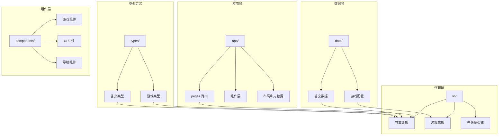
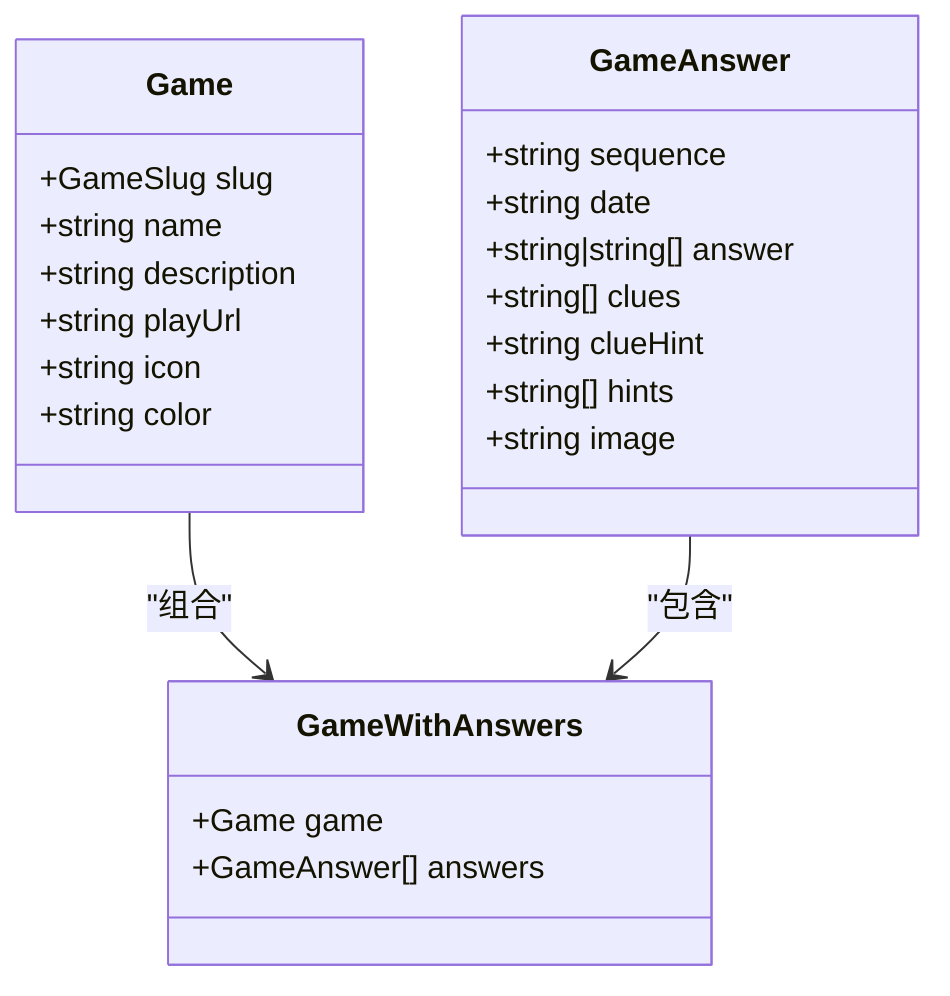
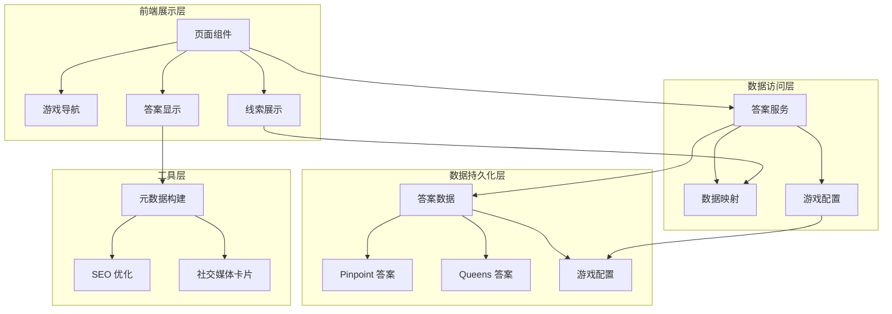
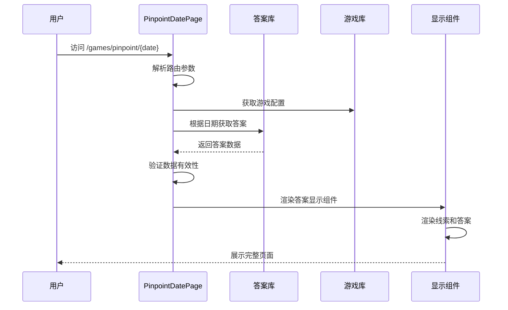
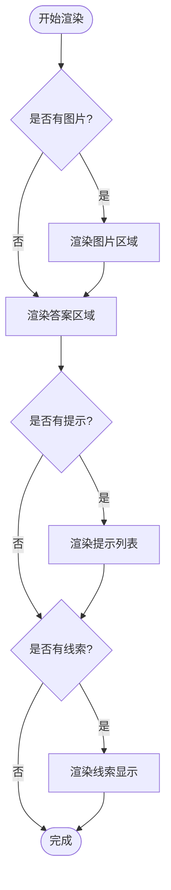
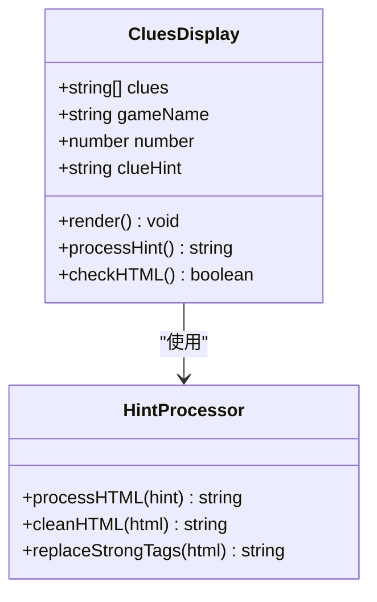
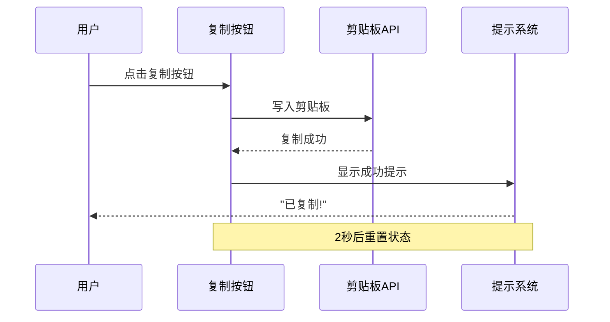
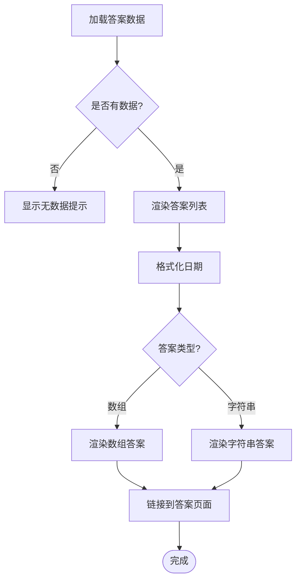
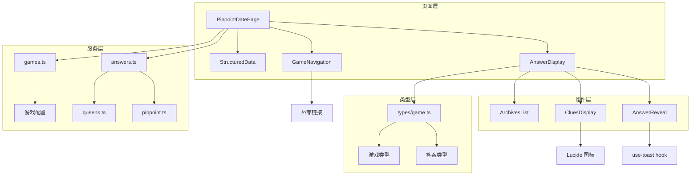

# Pinpoint Puzzle 内容

<cite>
**本文档引用的文件**
- [app/games/pinpoint/[date]/page.tsx](file://app/games/pinpoint/[date]/page.tsx)
- [data/answers/pinpoint.ts](file://data/answers/pinpoint.ts)
- [lib/answers.ts](file://lib/answers.ts)
- [lib/games.ts](file://lib/games.ts)
- [data/games.ts](file://data/games.ts)
- [components/games/AnswerDisplay.tsx](file://components/games/AnswerDisplay.tsx)
- [components/games/AnswerReveal.tsx](file://components/games/AnswerReveal.tsx)
- [components/games/CluesDisplay.tsx](file://components/games/CluesDisplay.tsx)
- [components/games/GameNavigation.tsx](file://components/games/GameNavigation.tsx)
- [components/games/ArchivesList.tsx](file://components/games/ArchivesList.tsx)
- [lib/metadata.ts](file://lib/metadata.ts)
- [types/game.ts](file://types/game.ts)
</cite>

## 更新摘要
**所做更改**
- 更新了答案数据结构和内容，反映新增的答案条目 #694 和 #693 的格式改进
- 增强了 HTML 段落标签处理机制的说明
- 更新了数据模型和组件交互的详细分析

## 目录
1. [简介](#简介)
2. [项目结构](#项目结构)
3. [核心组件](#核心组件)
4. [架构概览](#架构概览)
5. [详细组件分析](#详细组件分析)
6. [依赖关系分析](#依赖关系分析)
7. [性能考虑](#性能考虑)
8. [故障排除指南](#故障排除指南)
9. [结论](#结论)

## 简介

Pinpoint Puzzle 是一个基于 LinkedIn 的每日词汇关联游戏，用户需要根据给定的五个线索词推断出它们共同的主题或类别。该项目采用 Next.js 构建，提供了完整的静态生成、SEO 优化和响应式设计。

游戏的核心玩法是通过五个看似不相关的词汇，找出它们之间的共同联系。每个答案都包含详细的解释和线索提示，帮助用户理解词汇间的关联性。

**更新** 最新更新包括新增答案条目 #694（地质学主题：岩石建筑材料类型）和对现有答案条目 #693 的格式改进，增强了 HTML 段落标签的处理能力。

## 项目结构

该项目采用模块化的文件组织方式，主要分为以下几个核心部分：

**图表来源**
- [app/games/pinpoint/[date]/page.tsx](file://app/games/pinpoint/[date]/page.tsx#L1-L90)
- [data/answers/pinpoint.ts:1-603](file://data/answers/pinpoint.ts#L1-L603)
- [lib/answers.ts:1-42](file://lib/answers.ts#L1-L42)

**章节来源**
- [app/games/pinpoint/[date]/page.tsx](file://app/games/pinpoint/[date]/page.tsx#L1-L90)
- [data/answers/pinpoint.ts:1-603](file://data/answers/pinpoint.ts#L1-L603)
- [lib/answers.ts:1-42](file://lib/answers.ts#L1-L42)

## 核心组件

### 数据模型

项目使用 TypeScript 定义了清晰的数据结构来管理游戏内容：

**图表来源**
- [types/game.ts:1-27](file://types/game.ts#L1-L27)

### 答案数据结构

Pinpoint 游戏的答案数据采用数组形式存储，每个答案包含以下关键信息：

- **sequence**: 答案序列号（如 #694）
- **date**: 答案日期（YYYY-MM-DD 格式）
- **answer**: 答案内容（可以是单个字符串或字符串数组）
- **clues**: 五个线索词数组
- **clueHint**: 线索解释说明（支持 HTML 格式）
- **hints**: 可选的额外提示
- **image**: 可选的答案图片 URL

**更新** 最新的答案数据包含了改进的 HTML 段落标签处理，确保线索提示的格式更加规范和一致。

**章节来源**
- [types/game.ts:5-13](file://types/game.ts#L5-L13)
- [data/answers/pinpoint.ts:3-603](file://data/answers/pinpoint.ts#L3-L603)

## 架构概览

项目采用分层架构设计，确保了良好的可维护性和扩展性：

**图表来源**
- [app/games/pinpoint/[date]/page.tsx](file://app/games/pinpoint/[date]/page.tsx#L1-L90)
- [lib/answers.ts:1-42](file://lib/answers.ts#L1-L42)
- [lib/metadata.ts:1-78](file://lib/metadata.ts#L1-L78)

## 详细组件分析

### 页面渲染组件

主页面组件负责处理动态路由参数并渲染完整的游戏页面：

**图表来源**
- [app/games/pinpoint/[date]/page.tsx](file://app/games/pinpoint/[date]/page.tsx#L52-L89)

### 答案显示组件

答案显示组件负责格式化和展示游戏答案：

**图表来源**
- [components/games/AnswerDisplay.tsx:11-64](file://components/games/AnswerDisplay.tsx#L11-L64)

### 线索展示组件

线索展示组件提供交互式的线索查看体验：

**更新** 线索展示组件现在具备更强大的 HTML 处理能力，能够正确解析和格式化包含段落标签的线索提示文本。

**图表来源**
- [components/games/CluesDisplay.tsx:12-73](file://components/games/CluesDisplay.tsx#L12-L73)

**章节来源**
- [components/games/AnswerDisplay.tsx:1-65](file://components/games/AnswerDisplay.tsx#L1-L65)
- [components/games/CluesDisplay.tsx:1-74](file://components/games/CluesDisplay.tsx#L1-L74)

### 答案复制功能

答案复制组件实现了便捷的答案分享功能：

**图表来源**
- [components/games/AnswerReveal.tsx:19-37](file://components/games/AnswerReveal.tsx#L19-L37)

**章节来源**
- [components/games/AnswerReveal.tsx:1-83](file://components/games/AnswerReveal.tsx#L1-L83)

### 游戏导航组件

导航组件提供游戏内页面间的快速跳转：

**图表来源**
- [components/games/GameNavigation.tsx:11-82](file://components/games/GameNavigation.tsx#L11-L82)

**章节来源**
- [components/games/GameNavigation.tsx:1-83](file://components/games/GameNavigation.tsx#L1-L83)

### 归档列表组件

归档列表组件展示所有历史答案：

**图表来源**
- [components/games/ArchivesList.tsx:9-66](file://components/games/ArchivesList.tsx#L9-L66)

**章节来源**
- [components/games/ArchivesList.tsx:1-67](file://components/games/ArchivesList.tsx#L1-L67)

## 依赖关系分析

项目中的组件间依赖关系体现了清晰的分层设计：

**图表来源**
- [app/games/pinpoint/[date]/page.tsx](file://app/games/pinpoint/[date]/page.tsx#L1-L9)
- [lib/answers.ts:1-3](file://lib/answers.ts#L1-L3)
- [lib/games.ts:1-2](file://lib/games.ts#L1-L2)

**章节来源**
- [lib/answers.ts:1-42](file://lib/answers.ts#L1-L42)
- [lib/games.ts:1-15](file://lib/games.ts#L1-L15)
- [data/games.ts:1-29](file://data/games.ts#L1-L29)

## 性能考虑

### 静态生成优化

项目充分利用 Next.js 的静态生成特性：

- **预渲染**: 所有答案页面在构建时生成静态 HTML
- **缓存策略**: 利用浏览器缓存减少重复请求
- **代码分割**: 按需加载组件，优化首屏加载时间

### 数据访问优化

- **内存缓存**: 答案数据在内存中缓存，避免重复读取
- **排序优化**: 答案按日期排序，支持快速查找
- **类型安全**: 使用 TypeScript 确保数据访问的安全性

### SEO 优化

- **元数据动态生成**: 每个页面的标题和描述根据内容动态生成
- **Open Graph 支持**: 完整的社交媒体分享卡片支持
- **结构化数据**: 提供搜索引擎友好的结构化内容

## 故障排除指南

### 常见问题及解决方案

**问题 1: 答案页面显示 404**
- 检查答案数据中是否存在对应日期的答案
- 验证路由参数格式是否正确 (YYYY-MM-DD)
- 确认答案数据文件是否正确导入

**问题 2: 线索提示不显示**
- 检查 clueHint 字段是否正确设置
- 验证 HTML 标签是否正确闭合
- 确认组件是否正确处理 HTML 内容

**问题 3: 复制功能失效**
- 检查浏览器权限设置
- 验证剪贴板 API 是否可用
- 确认 toast 组件是否正常工作

**问题 4: SEO 元数据异常**
- 检查 constructMetadata 函数参数
- 验证网站配置信息
- 确认路径参数是否正确传递

**更新** 对于 HTML 段落标签相关的问题：
- 确认 clueHint 中的 `
` 标签正确闭合
- 验证 `<strong>` 标签的嵌套层次
- 检查 HTML 实体编码是否正确

**章节来源**
- [app/games/pinpoint/[date]/page.tsx](file://app/games/pinpoint/[date]/page.tsx#L57-L59)
- [components/games/AnswerReveal.tsx:20-36](file://components/games/AnswerReveal.tsx#L20-L36)
- [lib/metadata.ts:14-78](file://lib/metadata.ts#L14-L78)

## 结论

Pinpoint Puzzle 项目展现了现代 React 应用的最佳实践，通过清晰的架构设计、类型安全的代码实现和优秀的用户体验，成功构建了一个功能完整、易于维护的问答游戏平台。

项目的主要优势包括：

1. **模块化设计**: 清晰的文件组织和职责分离
2. **类型安全**: 完整的 TypeScript 类型定义
3. **性能优化**: 静态生成和缓存策略
4. **用户体验**: 响应式设计和交互式功能
5. **SEO 友好**: 完善的元数据和结构化内容

**更新** 最新的更新进一步增强了系统的健壮性和用户体验：

- 新增的答案条目 #694 提供了丰富的地质学主题内容
- 改进的 HTML 段落标签处理机制确保了线索提示的格式一致性
- 增强的错误处理和验证机制提高了系统的稳定性

该架构为未来的功能扩展奠定了坚实基础，可以轻松添加新的游戏类型、改进用户界面或增强数据分析功能。