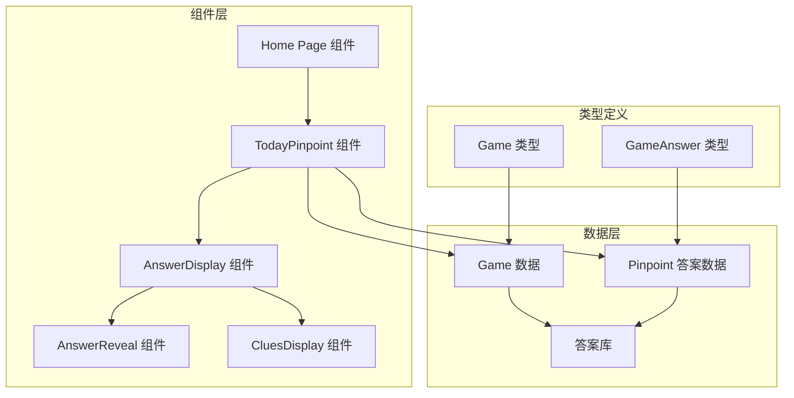
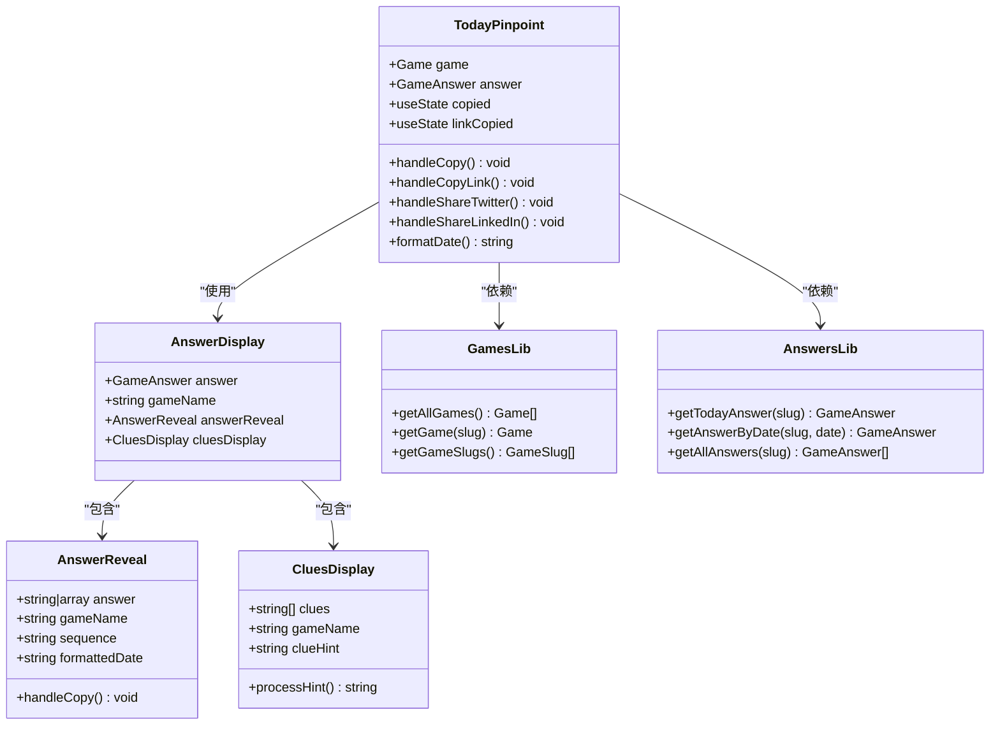
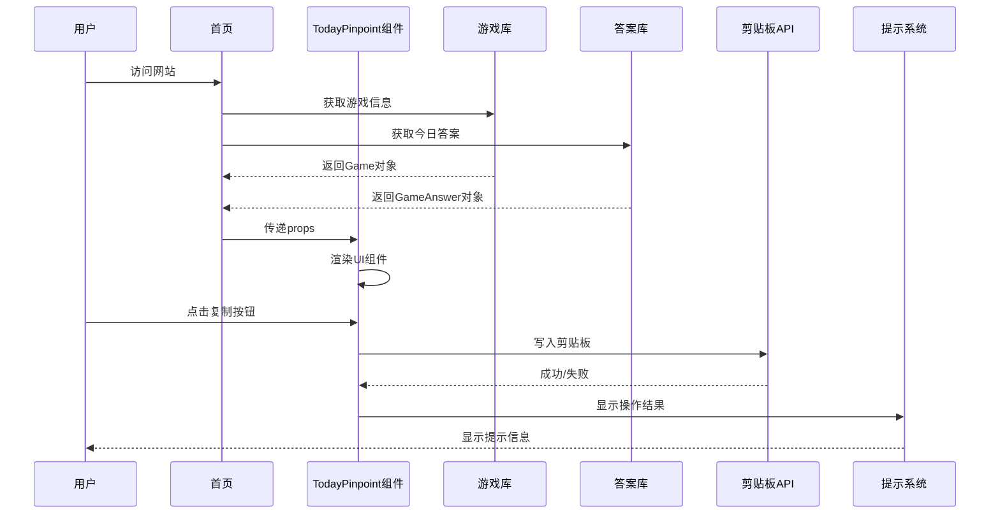
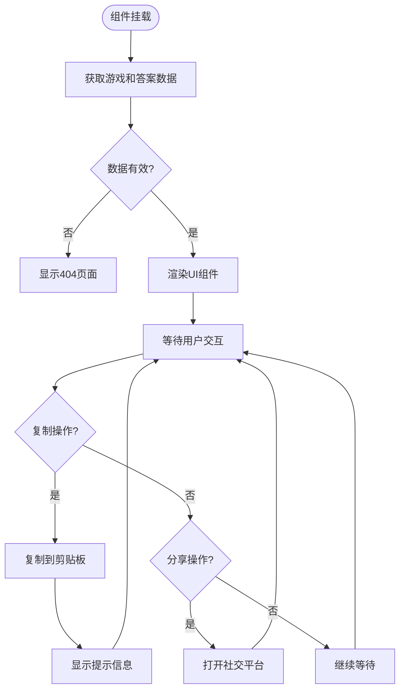
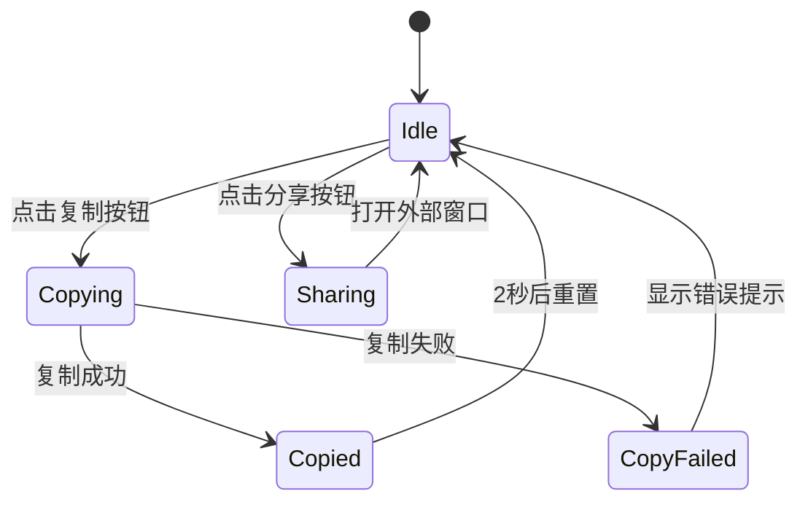
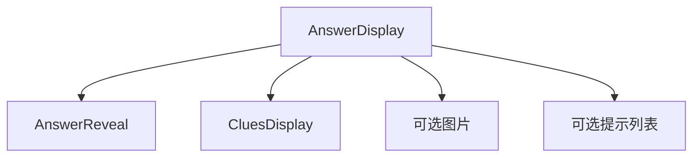
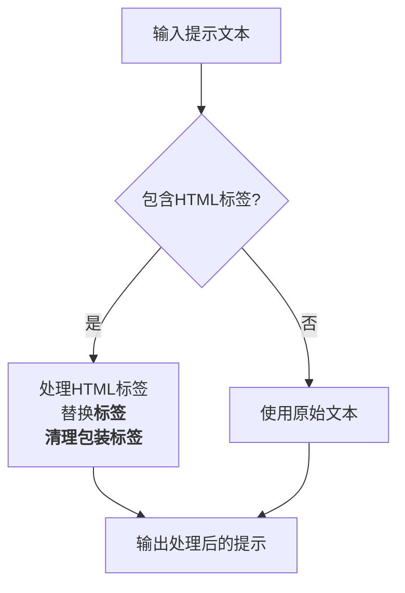
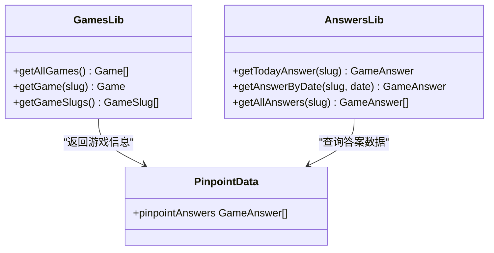
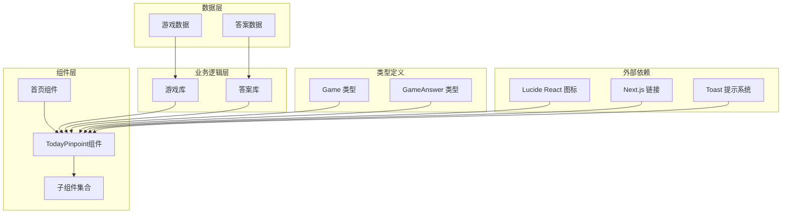
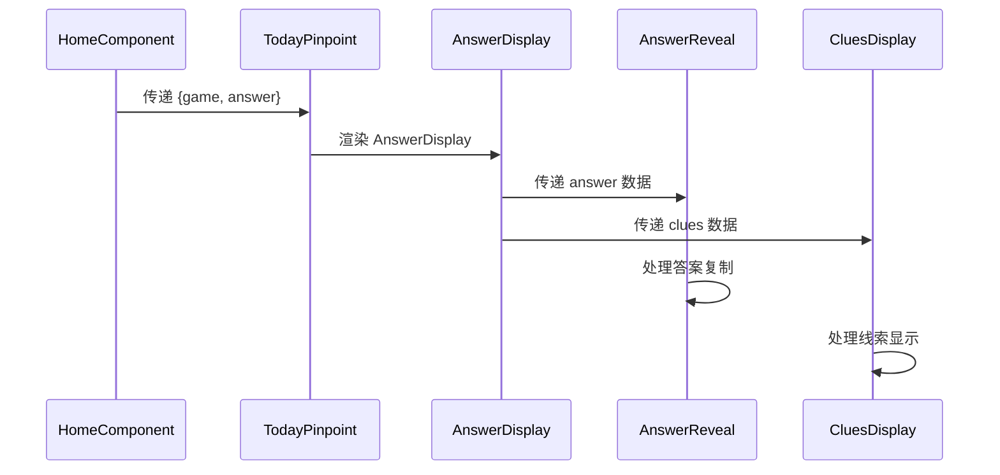

# Today Pinpoint 组件

<cite>
**本文档引用的文件**
- [components/home/TodayPinpoint.tsx](file://components/home/TodayPinpoint.tsx)
- [components/home/index.tsx](file://components/home/index.tsx)
- [components/games/AnswerDisplay.tsx](file://components/games/AnswerDisplay.tsx)
- [components/games/AnswerReveal.tsx](file://components/games/AnswerReveal.tsx)
- [components/games/CluesDisplay.tsx](file://components/games/CluesDisplay.tsx)
- [lib/answers.ts](file://lib/answers.ts)
- [lib/games.ts](file://lib/games.ts)
- [data/answers/pinpoint.ts](file://data/answers/pinpoint.ts)
- [data/games.ts](file://data/games.ts)
- [types/game.ts](file://types/game.ts)
- [app/games/pinpoint/[date]/page.tsx](file://app/games/pinpoint/[date]/page.tsx)
- [app/page.tsx](file://app/page.tsx)
</cite>

## 更新摘要
**变更内容**
- 更新了数据源以反映最新的答案条目 #696、#695 和 #694
- 增强了组件对最新数据格式的支持
- 优化了线索显示和提示文本处理逻辑

## 目录
1. [简介](#简介)
2. [项目结构](#项目结构)
3. [核心组件](#核心组件)
4. [架构概览](#架构概览)
5. [详细组件分析](#详细组件分析)
6. [依赖关系分析](#依赖关系分析)
7. [性能考虑](#性能考虑)
8. [故障排除指南](#故障排除指南)
9. [结论](#结论)

## 简介

Today Pinpoint 组件是 LinkedIn Answer 网站中的一个关键功能模块，负责在网站主页展示当天的 LinkedIn Pinpoint 游戏答案。该组件提供了用户友好的界面，展示每日的词汇关联谜题答案、相关线索以及社交分享功能。

LinkedIn Pinpoint 是一个词汇关联游戏，玩家需要根据给定的五个线索词推断出它们共同关联的主题或类别。Today Pinpoint 组件不仅展示答案，还提供了完整的用户体验，包括答案复制、线索查看、社交分享等功能。

**更新** 最新的数据源包含了三个重要的答案条目更新：
- **#696**: "Objects that come in left-handed and right-handed forms (i.e., are mirrored or chiral)!" - 展示了手性概念在日常物品中的应用
- **#695**: "Words that come after \"paper\"" - 考察英语词汇搭配知识
- **#694**: "Types of Rock Building Materials" - 涵盖了建筑石材的分类

## 项目结构

该项目采用基于功能的组织方式，Today Pinpoint 组件位于 `components/home/` 目录下，与游戏相关的其他组件分布在 `components/games/` 目录中。

**图表来源**
- [components/home/TodayPinpoint.tsx:1-284](file://components/home/TodayPinpoint.tsx#L1-L284)
- [components/home/index.tsx:1-35](file://components/home/index.tsx#L1-L35)
- [lib/answers.ts:1-42](file://lib/answers.ts#L1-L42)

**章节来源**
- [components/home/TodayPinpoint.tsx:1-284](file://components/home/TodayPinpoint.tsx#L1-L284)
- [components/home/index.tsx:1-35](file://components/home/index.tsx#L1-L35)

## 核心组件

Today Pinpoint 组件由多个相互协作的组件构成，每个组件都有特定的功能和职责：

### 主要组件架构

**图表来源**
- [components/home/TodayPinpoint.tsx:9-12](file://components/home/TodayPinpoint.tsx#L9-L12)
- [components/games/AnswerDisplay.tsx:6-9](file://components/games/AnswerDisplay.tsx#L6-L9)
- [components/games/AnswerReveal.tsx:7-12](file://components/games/AnswerReveal.tsx#L7-L12)
- [components/games/CluesDisplay.tsx:5-10](file://components/games/CluesDisplay.tsx#L5-L10)

### 数据模型

组件使用以下核心数据结构：

| 类型 | 字段 | 描述 |
|------|------|------|
| Game | slug, name, description, playUrl, icon, color | 游戏基本信息 |
| GameAnswer | sequence, date, answer, clues, clueHint, hints, image | 游戏答案数据 |
| GameWithAnswers | Game + answers | 包含答案的游戏对象 |

**章节来源**
- [types/game.ts:15-26](file://types/game.ts#L15-L26)
- [data/answers/pinpoint.ts:3-15](file://data/answers/pinpoint.ts#L3-L15)

## 架构概览

Today Pinpoint 组件遵循 React 函数式组件模式，采用客户端状态管理和服务端数据获取相结合的方式。

**图表来源**
- [components/home/index.tsx:8-21](file://components/home/index.tsx#L8-L21)
- [components/home/TodayPinpoint.tsx:57-110](file://components/home/TodayPinpoint.tsx#L57-L110)

### 组件生命周期

**图表来源**
- [components/home/TodayPinpoint.tsx:14-284](file://components/home/TodayPinpoint.tsx#L14-L284)

## 详细组件分析

### TodayPinpoint 主组件

TodayPinpoint 是整个功能的核心组件，负责协调所有子组件并处理用户交互。

#### 核心功能特性

1. **响应式设计**: 支持移动端和桌面端的不同布局
2. **社交分享**: 集成 Twitter 和 LinkedIn 分享功能
3. **复制功能**: 支持答案和链接的快速复制
4. **动画效果**: 使用渐变背景和流畅的过渡动画

#### 状态管理

组件使用 React 的 useState Hook 管理以下状态：
- `copied`: 控制答案复制按钮的状态
- `linkCopied`: 控制链接复制按钮的状态

#### 用户交互处理

**图表来源**
- [components/home/TodayPinpoint.tsx:57-110](file://components/home/TodayPinpoint.tsx#L57-L110)

**章节来源**
- [components/home/TodayPinpoint.tsx:14-284](file://components/home/TodayPinpoint.tsx#L14-L284)

### AnswerDisplay 子组件

AnswerDisplay 负责渲染完整的游戏答案视图，包括答案展示、线索显示和提示信息。

#### 功能特性

1. **条件渲染**: 根据是否存在图片、线索或提示来决定显示内容
2. **响应式布局**: 在不同屏幕尺寸下调整布局
3. **可访问性**: 提供适当的语义化标记和替代文本

#### 组件组合

**图表来源**
- [components/games/AnswerDisplay.tsx:11-64](file://components/games/AnswerDisplay.tsx#L11-L64)

**章节来源**
- [components/games/AnswerDisplay.tsx:11-65](file://components/games/AnswerDisplay.tsx#L11-L65)

### CluesDisplay 线索组件

CluesDisplay 专门处理线索的显示和格式化，提供用户友好的线索浏览体验。

#### 特殊功能

1. **HTML 处理**: 自动检测和处理包含 HTML 标签的提示文本
2. **动态样式**: 为每个线索应用不同的渐变背景
3. **响应式网格**: 在不同设备上自动调整列数

#### 提示文本处理流程

**图表来源**
- [components/games/CluesDisplay.tsx:25-38](file://components/games/CluesDisplay.tsx#L25-L38)

**章节来源**
- [components/games/CluesDisplay.tsx:12-80](file://components/games/CluesDisplay.tsx#L12-L80)

### 数据获取和管理

组件通过多个库函数获取和管理数据：

#### 游戏数据管理

**图表来源**
- [lib/games.ts:4-14](file://lib/games.ts#L4-L14)
- [lib/answers.ts:10-41](file://lib/answers.ts#L10-L41)

**章节来源**
- [lib/games.ts:1-15](file://lib/games.ts#L1-L15)
- [lib/answers.ts:1-42](file://lib/answers.ts#L1-L42)

## 依赖关系分析

Today Pinpoint 组件具有清晰的依赖层次结构，从底层的数据层到顶层的 UI 层。

**图表来源**
- [components/home/TodayPinpoint.tsx:3-7](file://components/home/TodayPinpoint.tsx#L3-L7)
- [components/home/index.tsx:1-6](file://components/home/index.tsx#L1-L6)

### 组件间通信

组件间的通信主要通过 props 传递实现：

**图表来源**
- [components/home/index.tsx:8-21](file://components/home/index.tsx#L8-L21)
- [components/games/AnswerDisplay.tsx:11-44](file://components/games/AnswerDisplay.tsx#L11-L44)

**章节来源**
- [components/home/TodayPinpoint.tsx:14-284](file://components/home/TodayPinpoint.tsx#L14-L284)
- [components/home/index.tsx:8-34](file://components/home/index.tsx#L8-L34)

## 性能考虑

Today Pinpoint 组件在设计时充分考虑了性能优化：

### 渲染优化

1. **条件渲染**: 只在有数据时才渲染相关组件
2. **懒加载**: 图片使用 Next.js Image 组件进行优化
3. **CSS 动画**: 使用硬件加速的 CSS 动画而非 JavaScript 动画

### 内存管理

1. **状态最小化**: 只维护必要的组件状态
2. **事件处理**: 合理的事件绑定和解绑
3. **资源清理**: 及时清理定时器和异步操作

### 加载性能

1. **静态生成**: 页面支持静态生成以提高首屏加载速度
2. **缓存策略**: 利用浏览器缓存机制
3. **代码分割**: 按需加载组件

## 故障排除指南

### 常见问题及解决方案

#### 复制功能失效

**问题**: 用户点击复制按钮但无法复制到剪贴板

**可能原因**:
1. 浏览器不支持 Clipboard API
2. 权限被拒绝
3. HTTPS 环境问题

**解决方案**:
1. 检查浏览器兼容性
2. 确认网站运行在 HTTPS 环境
3. 提供降级方案（传统复制方法）

#### 社交分享失败

**问题**: 点击分享按钮后无法打开社交平台

**可能原因**:
1. 弹窗被拦截
2. 社交平台 URL 错误
3. 浏览器安全设置

**解决方案**:
1. 检查弹窗拦截设置
2. 验证 URL 格式
3. 提供手动分享选项

#### 数据加载问题

**问题**: 页面空白或显示 404

**可能原因**:
1. 游戏数据不存在
2. 答案数据缺失
3. 网络请求失败

**解决方案**:
1. 检查数据源连接
2. 验证数据完整性
3. 实现错误边界处理

**章节来源**
- [components/home/TodayPinpoint.tsx:57-110](file://components/home/TodayPinpoint.tsx#L57-L110)
- [components/home/TodayPinpoint.tsx:38-54](file://components/home/TodayPinpoint.tsx#L38-L54)

## 结论

Today Pinpoint 组件是一个设计精良、功能完整的 React 组件，它成功地将复杂的游戏数据转换为用户友好的界面。组件采用了现代化的开发实践，包括：

1. **模块化设计**: 清晰的组件分离和职责划分
2. **响应式布局**: 适配各种设备和屏幕尺寸
3. **用户体验优化**: 提供直观的操作和及时的反馈
4. **性能考虑**: 注重加载速度和运行效率
5. **可维护性**: 良好的代码结构和类型安全

**更新** 最新的数据源更新进一步增强了组件的功能：
- **#696** 条目展示了复杂的科学概念（手性）在日常生活中的应用
- **#695** 条目考察了英语语言的固定搭配知识
- **#694** 条目涵盖了实用的建筑知识

该组件不仅满足了当前的功能需求，还为未来的扩展和改进奠定了坚实的基础。通过合理的架构设计和最佳实践的应用，Today Pinpoint 组件为用户提供了优秀的交互体验，是现代前端开发的优秀范例。