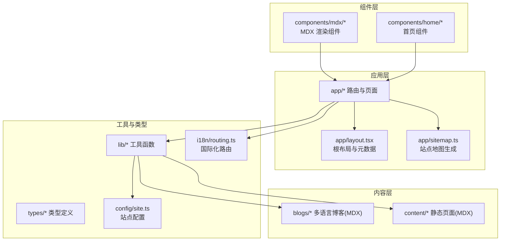
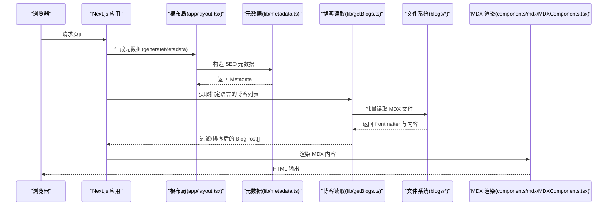
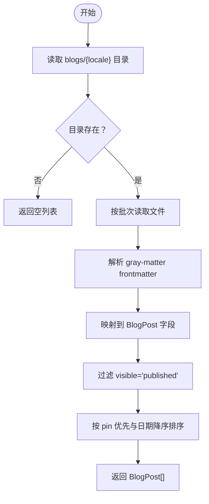
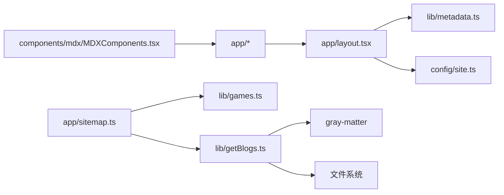

# 内容管理系统

<cite>
**本文档引用的文件**
- [README.md](file://README.md)
- [package.json](file://package.json)
- [next.config.mjs](file://next.config.mjs)
- [config/site.ts](file://config/site.ts)
- [types/blog.ts](file://types/blog.ts)
- [lib/getBlogs.ts](file://lib/getBlogs.ts)
- [app/page.tsx](file://app/page.tsx)
- [app/layout.tsx](file://app/layout.tsx)
- [app/sitemap.ts](file://app/sitemap.ts)
- [lib/metadata.ts](file://lib/metadata.ts)
- [components/mdx/MDXComponents.tsx](file://components/mdx/MDXComponents.tsx)
- [i18n/routing.ts](file://i18n/routing.ts)
- [blogs/en/1.demo.mdx](file://blogs/en/1.demo.mdx)
- [blogs/en/2.nextjs-starter-template-guide.mdx](file://blogs/en/2.nextjs-starter-template-guide.mdx)
- [content/about/en.mdx](file://content/about/en.mdx)
- [components/home/Hero.tsx](file://components/home/Hero.tsx)
- [lib/games.ts](file://lib/games.ts)
- [types/siteConfig.ts](file://types/siteConfig.ts)
</cite>

## 目录
1. [简介](#简介)
2. [项目结构](#项目结构)
3. [核心组件](#核心组件)
4. [架构总览](#架构总览)
5. [详细组件分析](#详细组件分析)
6. [依赖关系分析](#依赖关系分析)
7. [性能考虑](#性能考虑)
8. [故障排除指南](#故障排除指南)
9. [结论](#结论)
10. [附录](#附录)

## 简介
本内容管理系统基于 Next.js 16 App Router 构建，提供多语言支持、MDX 内容管理、静态页面与博客内容发布、SEO 优化与分析集成等能力。系统通过文件系统驱动的内容模型（blogs/content 目录）实现内容的声明式管理；使用 gray-matter 解析 MDX 前言元数据，结合自定义类型定义与渲染组件，完成内容的获取、过滤、排序与展示。

## 项目结构
系统采用“按功能分层 + 按路由组织”的混合结构：
- app：应用入口与国际化路由，负责页面布局、元数据生成与站点地图
- blogs：按语言组织的博客内容（MDX）
- content：静态页面内容（MDX）
- components：可复用 UI 组件与 MDX 渲染组件
- lib：通用工具函数（博客读取、元数据构造、游戏数据访问）
- types：类型定义（博客、站点配置、游戏等）
- i18n：国际化路由与消息配置
- config：站点全局配置
- 其他：构建配置、样式、脚本等

图表来源
- [app/layout.tsx](file://app/layout.tsx#L1-L78)
- [app/sitemap.ts](file://app/sitemap.ts#L1-L64)
- [lib/getBlogs.ts](file://lib/getBlogs.ts#L1-L65)
- [components/mdx/MDXComponents.tsx](file://components/mdx/MDXComponents.tsx#L1-L126)
- [config/site.ts](file://config/site.ts#L1-L45)
- [i18n/routing.ts](file://i18n/routing.ts#L1-L37)

章节来源
- [README.md](file://README.md#L139-L168)
- [package.json](file://package.json#L1-L65)

## 核心组件
- 博客内容读取与排序：通过 lib/getBlogs.ts 从 blogs/[locale] 目录批量读取 MDX 文件，解析 gray-matter 的 frontmatter，过滤可见性为已发布的文章，按置顶与日期排序，返回标准化的 BlogPost 列表。
- MDX 渲染组件：components/mdx/MDXComponents.tsx 定义标题、段落、列表、表格、代码块、引用等组件映射，支持自定义样式与语义化 ID。
- 元数据与 SEO：lib/metadata.ts 提供统一的元数据构造器，生成 Open Graph、Twitter 卡片、robots、canonical 等；app/layout.tsx 在服务端生成首页元数据。
- 站点地图：app/sitemap.ts 动态生成静态页面、游戏页面与博客文章的 sitemap 条目。
- 国际化路由：i18n/routing.ts 定义支持的语言、默认语言与前缀策略，提供 Link、redirect 等导航封装。
- 站点配置：config/site.ts 提供站点名称、描述、图标、社交链接、主题色等全局信息。

章节来源
- [lib/getBlogs.ts](file://lib/getBlogs.ts#L1-L65)
- [components/mdx/MDXComponents.tsx](file://components/mdx/MDXComponents.tsx#L1-L126)
- [lib/metadata.ts](file://lib/metadata.ts#L1-L78)
- [app/layout.tsx](file://app/layout.tsx#L1-L78)
- [app/sitemap.ts](file://app/sitemap.ts#L1-L64)
- [i18n/routing.ts](file://i18n/routing.ts#L1-L37)
- [config/site.ts](file://config/site.ts#L1-L45)

## 架构总览
系统采用“文件系统即数据库”的内容模型：博客与静态页面均以 MDX 文件形式存储在 blogs 与 content 目录中，运行时通过 lib 层读取与解析，再交由页面组件渲染。国际化通过 next-intl 实现，SEO 与分析通过 Next.js 内置能力与第三方组件集成。

图表来源
- [app/layout.tsx](file://app/layout.tsx#L18-L26)
- [lib/metadata.ts](file://lib/metadata.ts#L14-L78)
- [lib/getBlogs.ts](file://lib/getBlogs.ts#L8-L65)
- [components/mdx/MDXComponents.tsx](file://components/mdx/MDXComponents.tsx#L27-L123)

## 详细组件分析

### 博客系统与内容模型
- 数据模型：BlogPost 类型定义了标题、描述、图像、slug、标签、日期、可见性、置顶、内容与元数据字段。该类型用于统一对 MDX frontmatter 的映射与扩展。
- 内容来源：blogs/[locale] 下的 MDX 文件作为内容源，frontmatter 中的字段决定文章的元数据与发布状态。
- 获取逻辑：getPosts(locale) 读取目录、批量处理文件、解析 gray-matter、过滤可见性、按置顶优先与时间倒序排序。
- 发布策略：visible 字段控制发布状态（draft/invisible/published），默认 published；pin 字段控制置顶优先级。

图表来源
- [lib/getBlogs.ts](file://lib/getBlogs.ts#L8-L65)
- [types/blog.ts](file://types/blog.ts#L2-L16)

章节来源
- [types/blog.ts](file://types/blog.ts#L1-L17)
- [lib/getBlogs.ts](file://lib/getBlogs.ts#L1-L65)
- [blogs/en/1.demo.mdx](file://blogs/en/1.demo.mdx#L1-L18)
- [blogs/en/2.nextjs-starter-template-guide.mdx](file://blogs/en/2.nextjs-starter-template-guide.mdx#L1-L234)

### MDX 内容格式与渲染
- 格式规范：MDX 文件顶部使用 YAML frontmatter，包含标题、描述、图像、slug、标签、日期、可见性、置顶等字段；正文为 Markdown 与 React 组件的混合内容。
- 渲染组件：MDXComponents.tsx 将标题、段落、列表、表格、代码块、引用、图片等映射为带样式的 React 组件，并为标题生成锚点 ID，便于目录与跳转。
- 示例参考：示例博客文件展示了 frontmatter 字段与正文结构，可用于创建新文章或校验现有内容。

章节来源
- [components/mdx/MDXComponents.tsx](file://components/mdx/MDXComponents.tsx#L1-L126)
- [blogs/en/1.demo.mdx](file://blogs/en/1.demo.mdx#L1-L18)
- [blogs/en/2.nextjs-starter-template-guide.mdx](file://blogs/en/2.nextjs-starter-template-guide.mdx#L1-L234)

### 博客分类与标签系统
- 分类与标签：frontmatter 中的 tags 字段用于标记文章主题或分类；系统未内置专门的分类页面路由，可通过 tags 字段在页面侧进行筛选与聚合展示。
- 排序规则：getPosts 对文章先按 pin 排序，再按 date 降序排列，确保置顶文章优先显示且最新文章在前。

章节来源
- [lib/getBlogs.ts](file://lib/getBlogs.ts#L54-L60)
- [blogs/en/2.nextjs-starter-template-guide.mdx](file://blogs/en/2.nextjs-starter-template-guide.mdx#L4-L8)

### 内容元数据管理与发布策略
- 元数据：frontmatter 的 title、description、image、slug 等字段用于 SEO 与社交分享；系统通过 constructMetadata 生成 Open Graph、Twitter 卡片与 robots 等。
- 发布策略：visible 字段控制可见性，默认 published；pin 控制置顶；slug 用于生成文章 URL。
- 更新时间：博客与静态页面的 lastUpdated 可用于站点地图中的 lastModified 字段。

章节来源
- [lib/metadata.ts](file://lib/metadata.ts#L14-L78)
- [app/sitemap.ts](file://app/sitemap.ts#L51-L57)
- [blogs/en/2.nextjs-starter-template-guide.mdx](file://blogs/en/2.nextjs-starter-template-guide.mdx#L4-L8)
- [content/about/en.mdx](file://content/about/en.mdx#L4-L5)

### 静态页面管理
- 页面位置：静态页面内容位于 content/[page]/[locale].mdx，如 about、privacy-policy、terms-of-service。
- 编辑方式：直接修改对应语言的 MDX 文件即可更新页面内容。
- 示例：about 页面展示了基本的页面结构与 frontmatter 字段。

章节来源
- [README.md](file://README.md#L117-L119)
- [content/about/en.mdx](file://content/about/en.mdx#L1-L100)

### SEO 优化与站点地图
- 自动站点地图：sitemap.ts 动态生成静态页面、游戏页面与博客文章的条目，设置 lastModified、changeFrequency 与 priority。
- 元数据：layout 中调用 constructMetadata 生成统一的 SEO 元数据，包括 Open Graph、Twitter 卡片、robots、canonical 等。
- 图片优化：next.config.mjs 配置静态导出与图片远程模式，适配 CDN 或 R2。

章节来源
- [app/sitemap.ts](file://app/sitemap.ts#L13-L64)
- [lib/metadata.ts](file://lib/metadata.ts#L14-L78)
- [app/layout.tsx](file://app/layout.tsx#L18-L26)
- [next.config.mjs](file://next.config.mjs#L1-L28)

### 国际化与多语言内容
- 支持语言：en、zh、ja；默认语言为 en；可按需开启自动语言检测。
- 路由策略：localePrefix 为 as-needed，避免重复前缀；Link、redirect 等导航 API 基于路由配置。
- 内容组织：blogs 与 content 目录下按语言子目录存放内容，确保不同语言独立维护。

章节来源
- [i18n/routing.ts](file://i18n/routing.ts#L4-L23)
- [README.md](file://README.md#L88-L94)

### 内容版本管理与迁移建议
- 版本管理：当前系统未内置版本控制或草稿分支机制，建议通过 Git 管理内容变更；frontmatter 的 updatedAt 可用于记录更新时间。
- 迁移方案：将旧内容迁移到 blogs/[locale] 或 content/[page]/[locale].mddx；保持 frontmatter 字段一致；验证渲染与 SEO 元数据是否正确。

章节来源
- [blogs/en/1.demo.mdx](file://blogs/en/1.demo.mdx#L7-L8)
- [content/about/en.mdx](file://content/about/en.mdx#L4-L5)

## 依赖关系分析
- 组件耦合：app/layout.tsx 依赖 lib/metadata.ts 与 config/site.ts；app/sitemap.ts 依赖 lib/getBlogs.ts 与 lib/games.ts；lib/getBlogs.ts 依赖 gray-matter 与文件系统。
- 外部依赖：next、next-intl、gray-matter、@vercel/analytics、Google/Baidu/Plausible Analytics 等。
- 类型依赖：types/blog.ts 与 types/siteConfig.ts 为各模块提供类型约束。

图表来源
- [app/layout.tsx](file://app/layout.tsx#L1-L78)
- [lib/metadata.ts](file://lib/metadata.ts#L1-L78)
- [app/sitemap.ts](file://app/sitemap.ts#L1-L64)
- [lib/getBlogs.ts](file://lib/getBlogs.ts#L1-L65)
- [components/mdx/MDXComponents.tsx](file://components/mdx/MDXComponents.tsx#L1-L126)
- [config/site.ts](file://config/site.ts#L1-L45)
- [lib/games.ts](file://lib/games.ts#L1-L15)

章节来源
- [package.json](file://package.json#L16-L51)

## 性能考虑
- 静态导出：next.config.mjs 启用 output: export，适合静态托管平台；remotePatterns 支持 R2 等 CDN。
- 批处理读取：getBlogs.ts 使用批量读取与 Promise.all 并发处理，提升 IO 效率。
- 构建优化：生产环境移除 console 日志，减少包体积与运行时开销。

章节来源
- [next.config.mjs](file://next.config.mjs#L3-L25)
- [lib/getBlogs.ts](file://lib/getBlogs.ts#L22-L49)

## 故障排除指南
- MDX 文件不显示：检查文件路径、frontmatter 格式与 visible 字段是否为 published。
- 国际化路由问题：使用 i18n/routing.ts 提供的 Link 组件；确认 middleware 配置与路由前缀。
- 样式异常：确认 Tailwind 类名正确；重启开发服务器。
- 包管理器版本不匹配：删除 node_modules 与锁文件后重新安装。

章节来源
- [README.md](file://README.md#L241-L271)

## 结论
该内容管理系统以简洁的文件系统为核心，结合 MDX 与 gray-matter 实现高效的内容创作与发布；通过统一的元数据与站点地图生成，保障 SEO 与可发现性；借助 next-intl 实现多语言支持。建议在现有基础上完善版本控制与批量处理工具，以满足更复杂的内容管理需求。

## 附录

### 博客文章创建操作指南
- 在 blogs/[locale] 目录下新建 MDX 文件，填写 frontmatter 字段（title/description/image/slug/tags/date/visible/pin）。
- 在正文编写内容，必要时使用 MDX 组件。
- 本地预览：执行开发命令启动应用，访问对应路由查看效果。
- 发布：将 visible 设置为 published，重新构建与部署。

章节来源
- [README.md](file://README.md#L97-L116)
- [blogs/en/1.demo.mdx](file://blogs/en/1.demo.mdx#L1-L18)
- [blogs/en/2.nextjs-starter-template-guide.mdx](file://blogs/en/2.nextjs-starter-template-guide.mdx#L1-L234)

### 静态页面编辑操作指南
- 在 content/[page]/[locale].mdx 中编辑页面内容。
- 如需新增页面，可在 app 目录下创建对应路由并在页面中引入内容组件。
- 预览与部署同常规 Next.js 页面。

章节来源
- [README.md](file://README.md#L117-L119)
- [content/about/en.mdx](file://content/about/en.mdx#L1-L100)

### 内容版本管理与迁移方案
- 版本管理：使用 Git 记录内容变更；frontmatter 的 updatedAt 可辅助追踪更新。
- 迁移步骤：将旧内容复制到 blogs 或 content 对应目录；核对 frontmatter 字段；测试渲染与 SEO 元数据；上线验证。

章节来源
- [blogs/en/1.demo.mdx](file://blogs/en/1.demo.mdx#L7-L8)
- [content/about/en.mdx](file://content/about/en.mdx#L4-L5)

### 内容创作最佳实践
- 使用清晰的 slug 与标题，确保 SEO 友好。
- 合理使用 tags 进行分类，便于后续筛选与聚合。
- 为每篇文章提供高质量的描述与封面图，提升社交分享效果。
- 定期更新 lastUpdated，保证站点地图的时效性。

章节来源
- [blogs/en/2.nextjs-starter-template-guide.mdx](file://blogs/en/2.nextjs-starter-template-guide.mdx#L4-L8)
- [content/about/en.mdx](file://content/about/en.mdx#L4-L5)

### 批量处理工具建议
- 批量重命名与重排：通过脚本遍历 blogs/[locale] 目录，按日期或自定义规则重写文件名与 frontmatter。
- 批量更新：为所有文章添加或更新 tags、visible 状态、更新时间戳。
- 导出与备份：定期导出 blogs 与 content 目录至版本控制系统或外部存储。

章节来源
- [lib/getBlogs.ts](file://lib/getBlogs.ts#L8-L65)