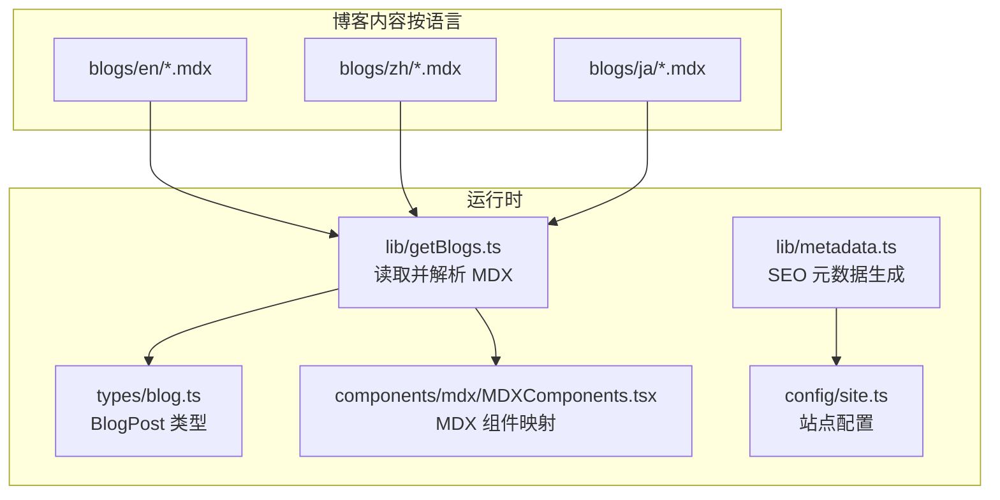
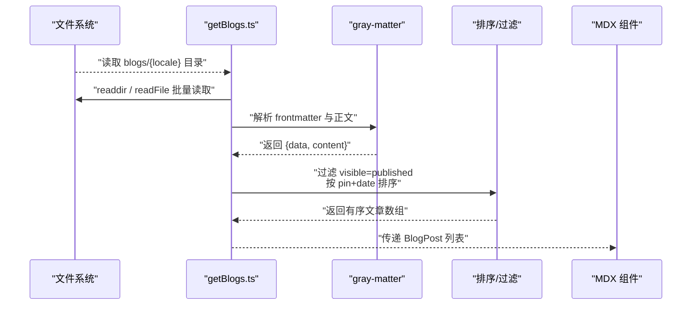
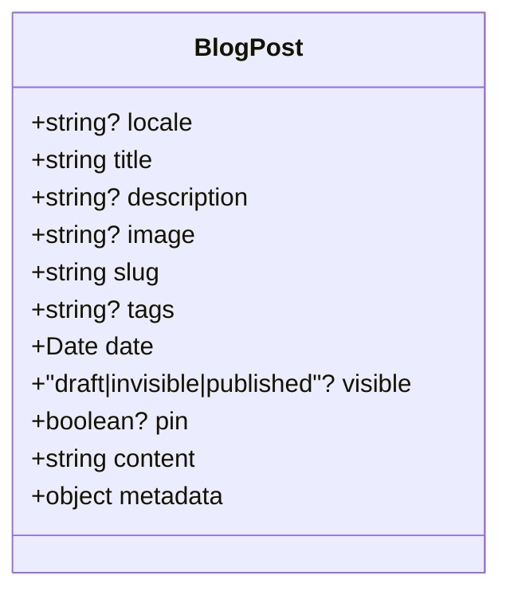
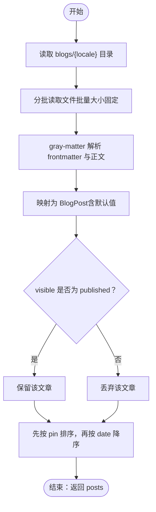
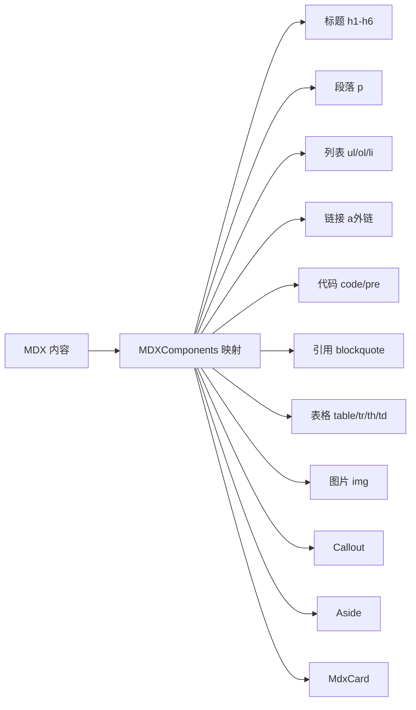
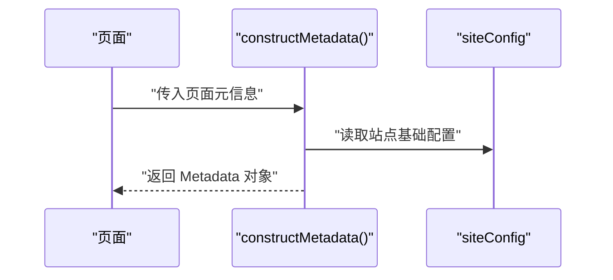
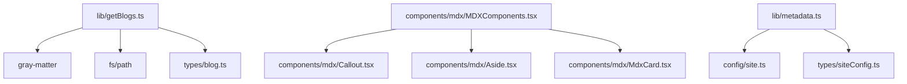

# 博客系统

<cite>
**本文引用的文件**
- [blogs/en/1.demo.mdx](file://blogs/en/1.demo.mdx)
- [blogs/en/2.nextjs-starter-template-guide.mdx](file://blogs/en/2.nextjs-starter-template-guide.mdx)
- [types/blog.ts](file://types/blog.ts)
- [lib/getBlogs.ts](file://lib/getBlogs.ts)
- [lib/metadata.ts](file://lib/metadata.ts)
- [config/site.ts](file://config/site.ts)
- [components/mdx/MDXComponents.tsx](file://components/mdx/MDXComponents.tsx)
- [components/mdx/Aside.tsx](file://components/mdx/Aside.tsx)
- [components/mdx/Callout.tsx](file://components/mdx/Callout.tsx)
- [components/mdx/MdxCard.tsx](file://components/mdx/MdxCard.tsx)
- [types/siteConfig.ts](file://types/siteConfig.ts)
- [app/page.tsx](file://app/page.tsx)
- [components/home/index.tsx](file://components/home/index.tsx)
- [components/home/Hero.tsx](file://components/home/Hero.tsx)
- [components/home/Showcase.tsx](file://components/home/Showcase.tsx)
</cite>

## 目录
1. [简介](#简介)
2. [项目结构](#项目结构)
3. [核心组件](#核心组件)
4. [架构总览](#架构总览)
5. [详细组件分析](#详细组件分析)
6. [依赖关系分析](#依赖关系分析)
7. [性能考量](#性能考量)
8. [故障排查指南](#故障排查指南)
9. [结论](#结论)
10. [附录](#附录)

## 简介
本文件为基于 MDX 的博客系统文档，聚焦以下主题：
- 基于 MDX 的博客架构设计与内容组织
- 多语言内容管理（英语、简体中文、日语）
- 博客元数据结构与内容获取逻辑
- YAML frontmatter 配置项、标签系统、发布状态与置顶排序规则
- 文章创建流程、MDX 编写规范、图片与代码块处理、内部/外部链接管理
- 数据模型、类型定义与获取函数实现细节
- 内容创作最佳实践、批量发布策略与 SEO 优化建议

## 项目结构
博客内容按语言分目录存放，每个语言目录下以数字前缀命名的 MDX 文件代表文章条目；通过统一的类型定义与获取函数读取并排序展示。

图表来源
- [lib/getBlogs.ts](file://lib/getBlogs.ts#L1-L65)
- [types/blog.ts](file://types/blog.ts#L1-L17)
- [lib/metadata.ts](file://lib/metadata.ts#L1-L78)
- [config/site.ts](file://config/site.ts#L1-L45)
- [components/mdx/MDXComponents.tsx](file://components/mdx/MDXComponents.tsx#L1-L126)

章节来源
- [lib/getBlogs.ts](file://lib/getBlogs.ts#L1-L65)
- [types/blog.ts](file://types/blog.ts#L1-L17)
- [lib/metadata.ts](file://lib/metadata.ts#L1-L78)
- [config/site.ts](file://config/site.ts#L1-L45)
- [components/mdx/MDXComponents.tsx](file://components/mdx/MDXComponents.tsx#L1-L126)

## 核心组件
- 博客数据模型：定义文章字段（标题、描述、图像、slug、标签、日期、可见性、置顶、正文、原始 frontmatter 元数据等），用于统一的数据结构与前端渲染。
- 内容获取函数：按语言读取目录、批量读取文件、解析 gray-matter 提取 frontmatter 与正文、过滤未发布文章、按置顶与日期排序。
- MDX 渲染组件：提供标题、段落、列表、代码、表格、图片、引用、自定义 Callout/Aside/MdxCard 等组件映射。
- SEO 元数据工具：集中生成 Open Graph、Twitter Card、robots、alternate canonical 等信息，结合站点配置输出。

章节来源
- [types/blog.ts](file://types/blog.ts#L1-L17)
- [lib/getBlogs.ts](file://lib/getBlogs.ts#L1-L65)
- [components/mdx/MDXComponents.tsx](file://components/mdx/MDXComponents.tsx#L1-L126)
- [lib/metadata.ts](file://lib/metadata.ts#L1-L78)
- [config/site.ts](file://config/site.ts#L1-L45)

## 架构总览
博客系统采用“静态内容 + 运行时解析 + 组件渲染”的三层架构：
- 内容层：MDX 文件作为内容源，frontmatter 定义元数据
- 解析层：读取目录、批量读取、gray-matter 解析、过滤与排序
- 展示层：MDX 组件映射渲染、SEO 元数据注入

图表来源
- [lib/getBlogs.ts](file://lib/getBlogs.ts#L1-L65)

章节来源
- [lib/getBlogs.ts](file://lib/getBlogs.ts#L1-L65)

## 详细组件分析

### 博客数据模型与类型定义
- 字段说明
  - locale：可选，标识语言
  - title/description/image：标题、描述、封面图
  - slug：文章路径片段
  - tags：逗号分隔字符串
  - date：发布时间（时间戳或日期）
  - visible：发布状态（draft/invisible/published，默认 published）
  - pin：是否置顶（布尔）
  - content：解析后的 MDX 正文
  - metadata：原始 frontmatter 对象
- 设计要点
  - 使用统一类型约束，便于在服务端与客户端一致消费
  - metadata 保留原始 frontmatter，便于扩展

图表来源
- [types/blog.ts](file://types/blog.ts#L1-L17)

章节来源
- [types/blog.ts](file://types/blog.ts#L1-L17)

### 内容获取与处理逻辑
- 目录读取与批处理
  - 按语言目录读取文件名，反转顺序以保证最新文件优先处理
  - 分批（每批固定数量）并发读取，避免一次性内存压力
- frontmatter 解析
  - 使用 gray-matter 提取 data（frontmatter）与 content（正文）
  - 将 data 映射到 BlogPost 字段，缺失值设置默认值
- 发布状态与排序
  - 过滤 visible 不为 published 的文章
  - 先按 pin（置顶优先），再按 date 降序排序
- 返回结构
  - 返回包含 posts 数组的对象，供页面渲染使用

图表来源
- [lib/getBlogs.ts](file://lib/getBlogs.ts#L1-L65)

章节来源
- [lib/getBlogs.ts](file://lib/getBlogs.ts#L1-L65)

### YAML Frontmatter 配置与语义
- 必填字段
  - title：文章标题
  - slug：相对路径片段（不包含语言前缀）
- 可选字段
  - description：文章描述
  - image：封面图路径
  - tags：逗号分隔的标签字符串
  - date：发布日期（支持日期格式）
  - visible：发布状态（draft/invisible/published，默认 published）
  - pin：是否置顶（true/false）
- 示例参考
  - 英文示例文件展示了完整 frontmatter 结构与正文内容

章节来源
- [blogs/en/1.demo.mdx](file://blogs/en/1.demo.mdx#L1-L18)
- [blogs/en/2.nextjs-starter-template-guide.mdx](file://blogs/en/2.nextjs-starter-template-guide.mdx#L1-L234)

### 标签系统与发布状态管理
- 标签
  - 存储为逗号分隔字符串，适合轻量筛选与展示
  - 建议在页面侧进行解析与去重展示
- 发布状态
  - draft/invisible：不对外展示
  - published：对外发布
  - 默认值为 published，便于快速上线
- 置顶
  - pin 为 true 的文章排在前面，提升曝光

章节来源
- [lib/getBlogs.ts](file://lib/getBlogs.ts#L51-L60)
- [types/blog.ts](file://types/blog.ts#L10-L11)

### 排序规则与展示顺序
- 优先级：置顶（pin）优先
- 其次：按 date 降序排列（越新的文章越靠前）
- 该规则确保首页展示“置顶 + 最新”的组合效果

章节来源
- [lib/getBlogs.ts](file://lib/getBlogs.ts#L54-L60)

### MDX 内容编写规范与组件映射
- 标题层级
  - h1-h6：自动添加 id（标题文本），并应用样式类
- 段落与列表
  - p、ul、ol、li：统一间距与颜色
- 链接
  - a：默认外链打开，带下划线与悬停样式
- 代码与代码块
  - code：行内代码样式
  - pre：代码块容器，支持横向滚动
- 引用与表格
  - blockquote：斜体与左侧边框
  - table/tr/th/td：响应式表格容器与单元格样式
- 图片
  - img：带边框与圆角的图片容器
- 自定义组件
  - Callout：带图标与类型的提示块（warning/danger）
  - Aside：气泡提示风格
  - MdxCard：带可选链接的卡片组件

图表来源
- [components/mdx/MDXComponents.tsx](file://components/mdx/MDXComponents.tsx#L1-L126)
- [components/mdx/Callout.tsx](file://components/mdx/Callout.tsx#L1-L28)
- [components/mdx/Aside.tsx](file://components/mdx/Aside.tsx#L1-L30)
- [components/mdx/MdxCard.tsx](file://components/mdx/MdxCard.tsx#L1-L40)

章节来源
- [components/mdx/MDXComponents.tsx](file://components/mdx/MDXComponents.tsx#L1-L126)
- [components/mdx/Callout.tsx](file://components/mdx/Callout.tsx#L1-L28)
- [components/mdx/Aside.tsx](file://components/mdx/Aside.tsx#L1-L30)
- [components/mdx/MdxCard.tsx](file://components/mdx/MdxCard.tsx#L1-L40)

### SEO 与元数据生成
- 功能概览
  - 动态标题拼接（首页与其他页差异化）
  - Open Graph 与 Twitter Card（支持多图与 alt）
  - robots 控制索引行为
  - canonical 与 hreflang（当前模板以单语言为主）
- 关键输入
  - page、title、description、images、noIndex、path、canonicalUrl
- 输出
  - 返回 Next.js Metadata 对象，供页面调用

图表来源
- [lib/metadata.ts](file://lib/metadata.ts#L1-L78)
- [config/site.ts](file://config/site.ts#L1-L45)
- [types/siteConfig.ts](file://types/siteConfig.ts#L1-L33)

章节来源
- [lib/metadata.ts](file://lib/metadata.ts#L1-L78)
- [config/site.ts](file://config/site.ts#L1-L45)
- [types/siteConfig.ts](file://types/siteConfig.ts#L1-L33)

### 页面入口与首页集成
- 首页入口
  - app/page.tsx 导出 HomeComponent
- 首页组件
  - HomeComponent 聚合游戏网格等模块
  - Hero 与 Showcase 组件用于品牌与生态展示
- 博客列表
  - 通过 getBlogs 获取文章列表后在页面中渲染

章节来源
- [app/page.tsx](file://app/page.tsx#L1-L6)
- [components/home/index.tsx](file://components/home/index.tsx#L1-L12)
- [components/home/Hero.tsx](file://components/home/Hero.tsx#L1-L13)
- [components/home/Showcase.tsx](file://components/home/Showcase.tsx#L1-L103)

## 依赖关系分析
- getBlogs.ts 依赖
  - gray-matter：解析 frontmatter
  - fs/path：读取目录与文件
  - types/blog.ts：统一数据结构
- MDX 渲染依赖
  - components/mdx/*：自定义组件
- SEO 依赖
  - config/site.ts：站点基础信息
  - lib/metadata.ts：统一元数据生成

图表来源
- [lib/getBlogs.ts](file://lib/getBlogs.ts#L1-L65)
- [components/mdx/MDXComponents.tsx](file://components/mdx/MDXComponents.tsx#L1-L126)
- [lib/metadata.ts](file://lib/metadata.ts#L1-L78)
- [config/site.ts](file://config/site.ts#L1-L45)
- [types/siteConfig.ts](file://types/siteConfig.ts#L1-L33)

章节来源
- [lib/getBlogs.ts](file://lib/getBlogs.ts#L1-L65)
- [components/mdx/MDXComponents.tsx](file://components/mdx/MDXComponents.tsx#L1-L126)
- [lib/metadata.ts](file://lib/metadata.ts#L1-L78)
- [config/site.ts](file://config/site.ts#L1-L45)
- [types/siteConfig.ts](file://types/siteConfig.ts#L1-L33)

## 性能考量
- 批量读取
  - 通过固定批次大小并发读取文件，降低内存峰值与 IO 压力
- 过滤与排序
  - 在内存中完成过滤与排序，适合中小规模文章集
- 建议
  - 当文章数量增长时，考虑引入缓存层（如 Redis）或数据库持久化
  - 对图片与代码块渲染进行懒加载与资源压缩

[本节为通用指导，无需列出具体文件来源]

## 故障排查指南
- frontmatter 缺失字段
  - visible 未设置时默认 published；pin 未设置时默认 false；tags 未设置时为空字符串
- 日期格式问题
  - 确保 date 为可被解析的日期格式，否则排序可能异常
- 外链打开方式
  - a 标签默认 target="_blank"，注意配合 rel="noopener noreferrer"
- SEO 未生效
  - 检查 siteConfig 中 url、socialLinks 等配置是否正确
  - 确认页面调用了 constructMetadata 并传入必要参数

章节来源
- [lib/getBlogs.ts](file://lib/getBlogs.ts#L30-L44)
- [components/mdx/MDXComponents.tsx](file://components/mdx/MDXComponents.tsx#L65-L71)
- [lib/metadata.ts](file://lib/metadata.ts#L14-L78)
- [config/site.ts](file://config/site.ts#L14-L44)

## 结论
本博客系统以 MDX 为核心内容载体，结合 gray-matter 解析与统一类型模型，实现了多语言、可置顶、可筛选的博客内容管理。通过 MDX 组件映射与 SEO 工具，既保证了内容创作的灵活性，也兼顾了展示与传播效果。建议在规模化场景下引入缓存与数据库，持续优化性能与可维护性。

[本节为总结性内容，无需列出具体文件来源]

## 附录

### 博客文章创建流程（建议）
- 在对应语言目录新增 MDX 文件（建议以数字前缀命名，便于排序）
- 编写 frontmatter：title、slug、date、visible、pin、tags 等
- 编写正文：遵循 MDX 规范，合理使用标题、列表、代码、表格、图片与链接
- 在页面中调用 getBlogs 获取文章列表并渲染
- 如需 SEO，调用 constructMetadata 注入元数据

章节来源
- [lib/getBlogs.ts](file://lib/getBlogs.ts#L8-L65)
- [components/mdx/MDXComponents.tsx](file://components/mdx/MDXComponents.tsx#L1-L126)
- [lib/metadata.ts](file://lib/metadata.ts#L14-L78)

### 内容创作最佳实践
- frontmatter 规范
  - 使用一致的日期格式与 slug 命名规范
  - tags 保持简洁且语义明确
- 正文规范
  - 合理使用标题层级，避免 h1 过度使用
  - 代码块使用语言标识，便于语法高亮
  - 图片提供 alt 描述，提升可访问性
- 发布策略
  - 先 draft/invisible，逐步验证后再设为 published
  - 对重要文章启用 pin，提升曝光

章节来源
- [blogs/en/1.demo.mdx](file://blogs/en/1.demo.mdx#L1-L18)
- [blogs/en/2.nextjs-starter-template-guide.mdx](file://blogs/en/2.nextjs-starter-template-guide.mdx#L1-L234)
- [lib/getBlogs.ts](file://lib/getBlogs.ts#L51-L60)

### SEO 优化指南
- 标题与描述
  - 使用 constructMetadata 动态生成标题与描述
- Open Graph 与 Twitter Card
  - 提供 images 或默认 og 图，确保分享美观
- robots 与 canonical
  - 对非目标页面设置 noIndex，避免重复索引
  - 正确设置 canonicalUrl 与 alternates（当前模板以单语言为主）

章节来源
- [lib/metadata.ts](file://lib/metadata.ts#L14-L78)
- [config/site.ts](file://config/site.ts#L14-L44)
- [types/siteConfig.ts](file://types/siteConfig.ts#L1-L33)