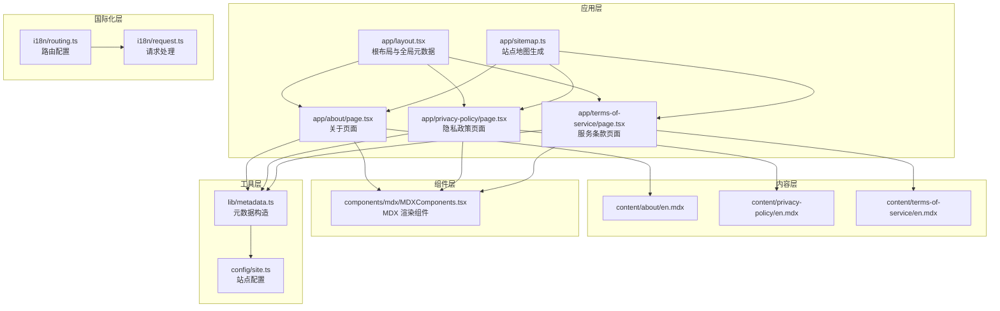
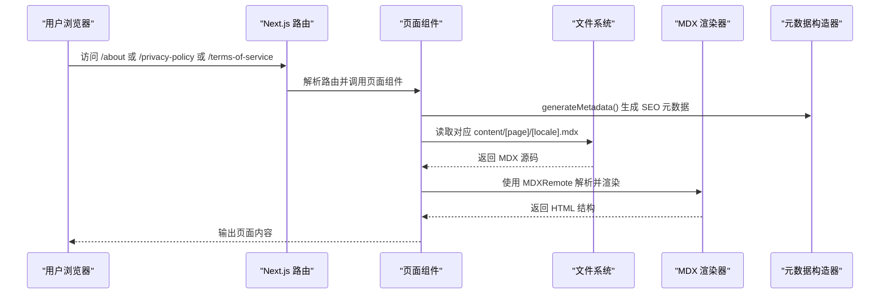
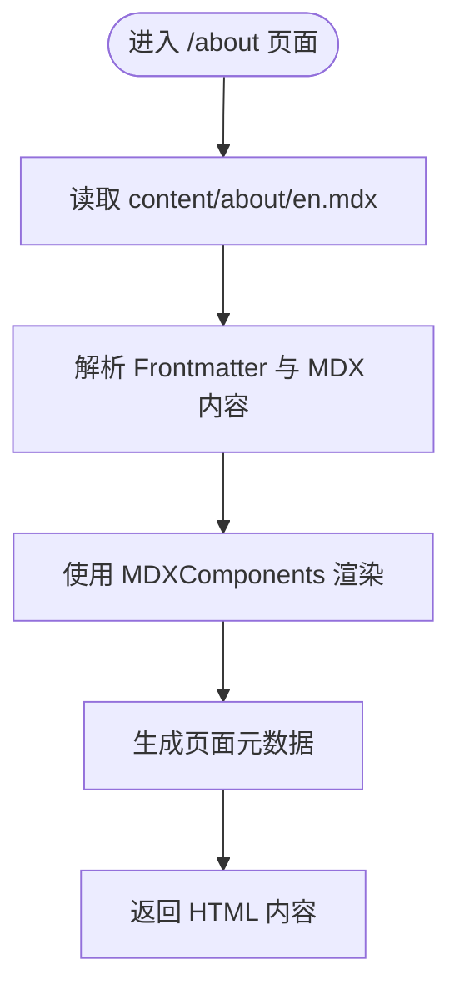
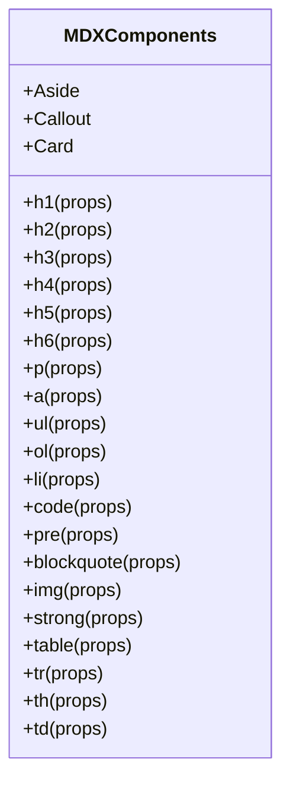
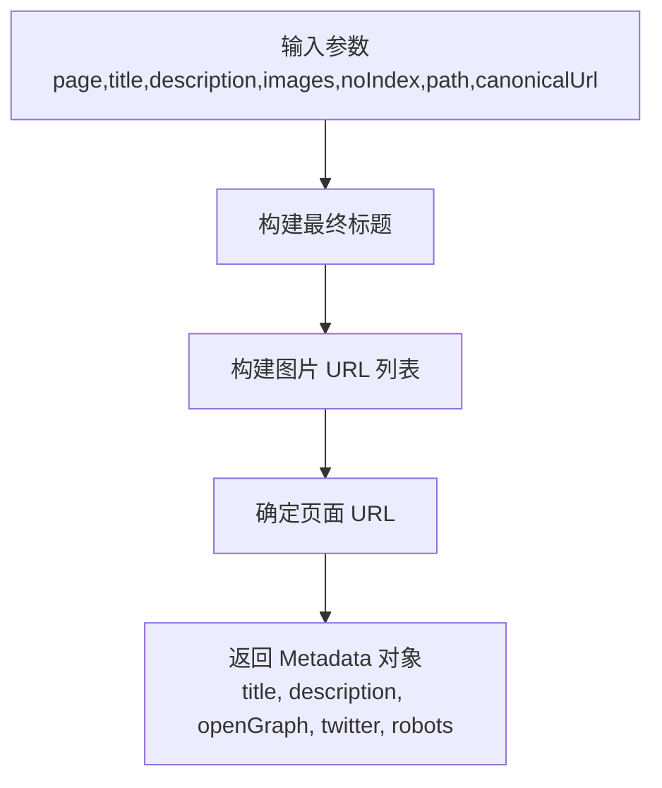
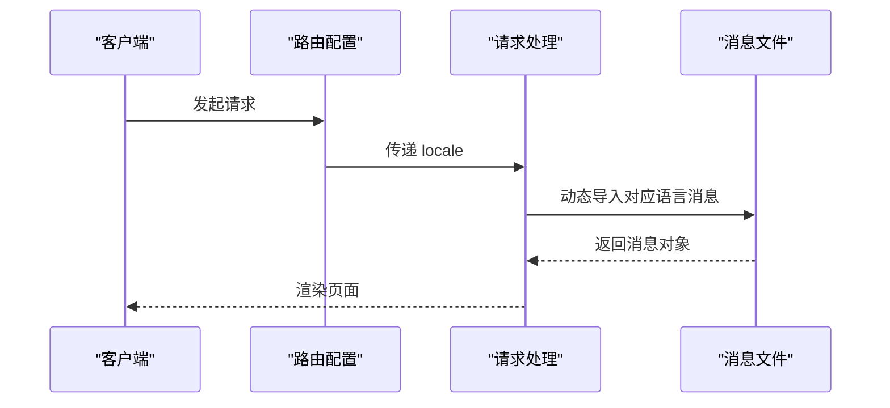
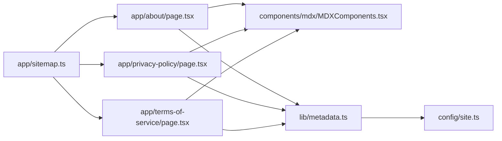

# 静态页面管理

<cite>
**本文档引用的文件**
- [app/layout.tsx](file://app/layout.tsx)
- [app/about/page.tsx](file://app/about/page.tsx)
- [app/privacy-policy/page.tsx](file://app/privacy-policy/page.tsx)
- [app/terms-of-service/page.tsx](file://app/terms-of-service/page.tsx)
- [content/about/en.mdx](file://content/about/en.mdx)
- [content/privacy-policy/en.mdx](file://content/privacy-policy/en.mdx)
- [content/terms-of-service/en.mdx](file://content/terms-of-service/en.mdx)
- [lib/metadata.ts](file://lib/metadata.ts)
- [config/site.ts](file://config/site.ts)
- [components/mdx/MDXComponents.tsx](file://components/mdx/MDXComponents.tsx)
- [i18n/routing.ts](file://i18n/routing.ts)
- [i18n/request.ts](file://i18n/request.ts)
- [app/sitemap.ts](file://app/sitemap.ts)
- [next.config.mjs](file://next.config.mjs)
- [package.json](file://package.json)
</cite>

## 目录
1. [简介](#简介)
2. [项目结构](#项目结构)
3. [核心组件](#核心组件)
4. [架构总览](#架构总览)
5. [详细组件分析](#详细组件分析)
6. [依赖关系分析](#依赖关系分析)
7. [性能考虑](#性能考虑)
8. [故障排除指南](#故障排除指南)
9. [结论](#结论)
10. [附录](#附录)

## 简介
本文件面向“静态页面管理系统”的设计与实现，聚焦于基于 MDX 的静态页面架构、法律文档（隐私政策、服务条款）管理、关于页面内容以及页面元数据管理。文档将从系统架构、组件关系、数据流、处理逻辑、集成点、错误处理与性能特征等方面进行深入解析，并提供页面内容编辑流程、元数据配置、页面模板使用、内容发布流程、数据模型与类型定义、获取逻辑、维护指南、批量更新方案与版本管理策略等实用建议。

## 项目结构
该系统采用 Next.js 应用程序目录结构，结合 MDX 内容与国际化配置，形成可扩展的静态页面管理能力：
- 应用层：根布局、页面路由与元数据生成
- 内容层：MDX 文件存放于 content 目录，按页面与语言组织
- 组件层：MDX 渲染组件与通用 UI 组件
- 国际化层：路由与请求配置，支持多语言
- 工具层：站点配置、元数据构造、站点地图生成

图表来源
- [app/layout.tsx](file://app/layout.tsx#L1-L78)
- [app/about/page.tsx](file://app/about/page.tsx#L1-L56)
- [app/privacy-policy/page.tsx](file://app/privacy-policy/page.tsx#L1-L56)
- [app/terms-of-service/page.tsx](file://app/terms-of-service/page.tsx#L1-L56)
- [content/about/en.mdx](file://content/about/en.mdx#L1-L100)
- [content/privacy-policy/en.mdx](file://content/privacy-policy/en.mdx#L1-L37)
- [content/terms-of-service/en.mdx](file://content/terms-of-service/en.mdx#L1-L32)
- [components/mdx/MDXComponents.tsx](file://components/mdx/MDXComponents.tsx#L1-L126)
- [lib/metadata.ts](file://lib/metadata.ts#L1-L78)
- [config/site.ts](file://config/site.ts#L1-L45)
- [i18n/routing.ts](file://i18n/routing.ts#L1-L37)
- [i18n/request.ts](file://i18n/request.ts#L1-L28)
- [app/sitemap.ts](file://app/sitemap.ts#L1-L64)

章节来源
- [app/layout.tsx](file://app/layout.tsx#L1-L78)
- [app/about/page.tsx](file://app/about/page.tsx#L1-L56)
- [app/privacy-policy/page.tsx](file://app/privacy-policy/page.tsx#L1-L56)
- [app/terms-of-service/page.tsx](file://app/terms-of-service/page.tsx#L1-L56)
- [content/about/en.mdx](file://content/about/en.mdx#L1-L100)
- [content/privacy-policy/en.mdx](file://content/privacy-policy/en.mdx#L1-L37)
- [content/terms-of-service/en.mdx](file://content/terms-of-service/en.mdx#L1-L32)
- [components/mdx/MDXComponents.tsx](file://components/mdx/MDXComponents.tsx#L1-L126)
- [lib/metadata.ts](file://lib/metadata.ts#L1-L78)
- [config/site.ts](file://config/site.ts#L1-L45)
- [i18n/routing.ts](file://i18n/routing.ts#L1-L37)
- [i18n/request.ts](file://i18n/request.ts#L1-L28)
- [app/sitemap.ts](file://app/sitemap.ts#L1-L64)
- [next.config.mjs](file://next.config.mjs#L1-L28)
- [package.json](file://package.json#L1-L65)

## 核心组件
- 根布局与全局元数据：负责注入头部脚本、主题提供者、页眉页脚、全局样式与 Vercel Analytics 等；通过 generateMetadata 构建首页元数据。
- 页面组件：关于页面、隐私政策页面、服务条款页面均采用相同模式——读取对应 MDX 文件、解析 Frontmatter、渲染为 HTML。
- MDX 渲染组件：统一处理标题、段落、链接、列表、代码块、表格、引用、图片等元素的样式与行为。
- 元数据构造器：集中管理标题、描述、Open Graph、Twitter 卡片、robots 等 SEO 字段，支持路径与规范链接。
- 站点配置：统一管理站点名称、URL、作者、社交链接、图标、主题颜色与默认主题。
- 国际化路由与请求：定义支持的语言、默认语言、前缀策略与请求时的语言检测与消息加载。
- 站点地图：动态生成静态页面、游戏页面与博客文章的 sitemap 条目。

章节来源
- [app/layout.tsx](file://app/layout.tsx#L1-L78)
- [app/about/page.tsx](file://app/about/page.tsx#L1-L56)
- [app/privacy-policy/page.tsx](file://app/privacy-policy/page.tsx#L1-L56)
- [app/terms-of-service/page.tsx](file://app/terms-of-service/page.tsx#L1-L56)
- [components/mdx/MDXComponents.tsx](file://components/mdx/MDXComponents.tsx#L1-L126)
- [lib/metadata.ts](file://lib/metadata.ts#L1-L78)
- [config/site.ts](file://config/site.ts#L1-L45)
- [i18n/routing.ts](file://i18n/routing.ts#L1-L37)
- [i18n/request.ts](file://i18n/request.ts#L1-L28)
- [app/sitemap.ts](file://app/sitemap.ts#L1-L64)

## 架构总览
系统采用“内容即代码”的 MDX 架构，页面通过 Next.js 路由自动发现，运行时读取 content 目录下的 MDX 文件并渲染。元数据在构建期或运行期生成，确保 SEO 与社交分享体验一致。国际化通过 next-intl 实现，支持语言检测与消息加载。

图表来源
- [app/about/page.tsx](file://app/about/page.tsx#L17-L31)
- [app/privacy-policy/page.tsx](file://app/privacy-policy/page.tsx#L17-L31)
- [app/terms-of-service/page.tsx](file://app/terms-of-service/page.tsx#L17-L31)
- [lib/metadata.ts](file://lib/metadata.ts#L14-L78)
- [components/mdx/MDXComponents.tsx](file://components/mdx/MDXComponents.tsx#L1-L126)

## 详细组件分析

### 关于页面（/about）
- 内容来源：content/about/[locale].mdx
- 渲染方式：读取文件内容，启用 Frontmatter 解析与 GFM 插件，通过 MDXRemote 渲染
- 元数据：generateMetadata 生成页面级 SEO 元数据，设置路径与规范链接
- 模板使用：MDXComponents 提供统一的标题、段落、列表、表格、代码块等组件样式

图表来源
- [app/about/page.tsx](file://app/about/page.tsx#L17-L31)
- [content/about/en.mdx](file://content/about/en.mdx#L1-L100)
- [components/mdx/MDXComponents.tsx](file://components/mdx/MDXComponents.tsx#L27-L123)
- [lib/metadata.ts](file://lib/metadata.ts#L14-L78)

章节来源
- [app/about/page.tsx](file://app/about/page.tsx#L1-L56)
- [content/about/en.mdx](file://content/about/en.mdx#L1-L100)
- [components/mdx/MDXComponents.tsx](file://components/mdx/MDXComponents.tsx#L1-L126)
- [lib/metadata.ts](file://lib/metadata.ts#L1-L78)

### 隐私政策页面（/privacy-policy）
- 内容来源：content/privacy-policy/[locale].mdx
- 渲染方式：与关于页面一致，读取 MDX 并渲染
- 元数据：generateMetadata 设置页面标题、描述与规范链接

章节来源
- [app/privacy-policy/page.tsx](file://app/privacy-policy/page.tsx#L1-L56)
- [content/privacy-policy/en.mdx](file://content/privacy-policy/en.mdx#L1-L37)
- [lib/metadata.ts](file://lib/metadata.ts#L1-L78)

### 服务条款页面（/terms-of-service）
- 内容来源：content/terms-of-service/[locale].mdx
- 渲染方式：与上述页面一致
- 元数据：generateMetadata 设置页面标题、描述与规范链接

章节来源
- [app/terms-of-service/page.tsx](file://app/terms-of-service/page.tsx#L1-L56)
- [content/terms-of-service/en.mdx](file://content/terms-of-service/en.mdx#L1-L32)
- [lib/metadata.ts](file://lib/metadata.ts#L1-L78)

### MDX 渲染组件体系
- 统一处理：标题层级、段落、链接、列表、代码块、表格、引用、图片、粗体等
- 可扩展性：通过 MDXComponents 映射自定义组件（如 Callout、Aside、MdxCard）

图表来源
- [components/mdx/MDXComponents.tsx](file://components/mdx/MDXComponents.tsx#L27-L123)

章节来源
- [components/mdx/MDXComponents.tsx](file://components/mdx/MDXComponents.tsx#L1-L126)

### 元数据管理与 SEO 优化
- 构造函数：constructMetadata 接收页面名、标题、描述、图片、是否索引、路径与规范链接
- 默认值：首页标题拼接策略、OG 与 Twitter 卡片默认图片
- 动态生成：根据 path 与 canonicalUrl 生成完整 URL
- robots 控制：根据 noIndex 控制索引与跟随策略

图表来源
- [lib/metadata.ts](file://lib/metadata.ts#L14-L78)
- [config/site.ts](file://config/site.ts#L14-L44)

章节来源
- [lib/metadata.ts](file://lib/metadata.ts#L1-L78)
- [config/site.ts](file://config/site.ts#L1-L45)

### 国际化与多语言支持
- 支持语言：en、zh、ja
- 默认语言：en
- 自动检测：可通过环境变量控制
- 请求处理：根据请求语言选择对应消息文件

图表来源
- [i18n/routing.ts](file://i18n/routing.ts#L12-L23)
- [i18n/request.ts](file://i18n/request.ts#L4-L27)

章节来源
- [i18n/routing.ts](file://i18n/routing.ts#L1-L37)
- [i18n/request.ts](file://i18n/request.ts#L1-L28)

### 站点地图与 SEO
- 动态生成：sitemap.ts 生成静态页面、游戏页面与博客文章的条目
- 更新频率与优先级：根据页面类型设定不同权重
- 依赖：使用 getGameSlugs 与 getPosts 获取动态内容

章节来源
- [app/sitemap.ts](file://app/sitemap.ts#L1-L64)

### 构建与部署配置
- 静态导出：output: export，适合静态托管
- 图片优化：静态导出需禁用优化，允许远程图片模式
- 生产移除控制台：仅保留 error 类型日志

章节来源
- [next.config.mjs](file://next.config.mjs#L1-L28)

## 依赖关系分析
- 页面组件依赖 MDX 渲染器与 MDX 组件库
- 元数据构造依赖站点配置
- 国际化依赖路由与请求配置
- 站点地图依赖页面组件与内容获取工具

图表来源
- [app/about/page.tsx](file://app/about/page.tsx#L1-L56)
- [app/privacy-policy/page.tsx](file://app/privacy-policy/page.tsx#L1-L56)
- [app/terms-of-service/page.tsx](file://app/terms-of-service/page.tsx#L1-L56)
- [components/mdx/MDXComponents.tsx](file://components/mdx/MDXComponents.tsx#L1-L126)
- [lib/metadata.ts](file://lib/metadata.ts#L1-L78)
- [config/site.ts](file://config/site.ts#L1-L45)
- [app/sitemap.ts](file://app/sitemap.ts#L1-L64)

章节来源
- [package.json](file://package.json#L16-L51)

## 性能考虑
- 静态导出：减少服务器端计算，提升首屏性能
- MDX 渲染：在构建期或运行期解析，建议缓存 Frontmatter 与渲染结果
- 图片优化：静态导出禁用优化，避免额外开销
- 分析脚本：开发环境关闭分析脚本，生产环境启用以降低影响
- 站点地图：预生成静态 sitemap，减少运行时计算

## 故障排除指南
- MDX 文件读取失败：检查文件路径与权限，确认 content 目录结构正确
- 元数据缺失：核对 generateMetadata 参数与 constructMetadata 调用
- 国际化消息未加载：确认 i18n/messages 下存在对应语言文件，路由配置正确
- 站点地图不完整：检查 getGameSlugs 与 getPosts 是否返回预期数据
- 构建失败：确认 next.config.mjs 中静态导出与图片配置符合要求

章节来源
- [app/about/page.tsx](file://app/about/page.tsx#L24-L30)
- [app/privacy-policy/page.tsx](file://app/privacy-policy/page.tsx#L24-L30)
- [app/terms-of-service/page.tsx](file://app/terms-of-service/page.tsx#L24-L30)
- [i18n/request.ts](file://i18n/request.ts#L16-L22)
- [app/sitemap.ts](file://app/sitemap.ts#L28-L57)

## 结论
该静态页面管理系统以 MDX 为核心，结合统一的元数据构造、国际化与站点地图生成，实现了可维护、可扩展且 SEO 友好的静态页面管理。通过标准化的内容结构、模板与发布流程，团队可以高效地维护法律文档、关于页面与其它静态内容。

## 附录

### 页面内容编辑流程
- 在 content/[page]/[locale].mdx 编写内容，遵循 Frontmatter 规范
- 在页面组件中读取并渲染 MDX，必要时调整 MDXComponents
- 通过 generateMetadata 生成 SEO 元数据，确保标题、描述与规范链接正确
- 如需多语言，新增对应 locale 文件并在国际化配置中声明

章节来源
- [content/about/en.mdx](file://content/about/en.mdx#L1-L100)
- [content/privacy-policy/en.mdx](file://content/privacy-policy/en.mdx#L1-L37)
- [content/terms-of-service/en.mdx](file://content/terms-of-service/en.mdx#L1-L32)
- [app/about/page.tsx](file://app/about/page.tsx#L17-L31)
- [app/privacy-policy/page.tsx](file://app/privacy-policy/page.tsx#L17-L31)
- [app/terms-of-service/page.tsx](file://app/terms-of-service/page.tsx#L17-L31)
- [components/mdx/MDXComponents.tsx](file://components/mdx/MDXComponents.tsx#L27-L123)
- [lib/metadata.ts](file://lib/metadata.ts#L14-L78)
- [i18n/routing.ts](file://i18n/routing.ts#L4-L10)

### 页面路由配置与 SEO 策略
- 路由：Next.js 基于文件系统自动发现路由
- SEO：通过 generateMetadata 与 constructMetadata 统一管理 OG、Twitter 卡片与 robots
- 站点地图：sitemap.ts 动态生成静态页面、游戏与博客条目

章节来源
- [app/about/page.tsx](file://app/about/page.tsx#L33-L41)
- [app/privacy-policy/page.tsx](file://app/privacy-policy/page.tsx#L33-L41)
- [app/terms-of-service/page.tsx](file://app/terms-of-service/page.tsx#L33-L41)
- [lib/metadata.ts](file://lib/metadata.ts#L14-L78)
- [app/sitemap.ts](file://app/sitemap.ts#L13-L64)

### 数据模型与类型定义
- 元数据属性：页面名、标题、描述、图片、是否索引、路径、规范链接
- 站点配置：名称、URL、作者、社交链接、图标、主题颜色与默认主题
- 国际化：支持语言数组、默认语言、语言名称映射与导航 API

章节来源
- [lib/metadata.ts](file://lib/metadata.ts#L4-L12)
- [config/site.ts](file://config/site.ts#L14-L44)
- [i18n/routing.ts](file://i18n/routing.ts#L4-L10)

### 内容获取逻辑
- 运行时读取：页面组件在服务端读取 content 目录下的 MDX 文件
- Frontmatter 解析：启用 parseFrontmatter 以提取元信息
- 插件链：启用 remark-gfm 以支持 GitHub 风格表格与任务列表

章节来源
- [app/about/page.tsx](file://app/about/page.tsx#L9-L15)
- [app/privacy-policy/page.tsx](file://app/privacy-policy/page.tsx#L9-L15)
- [app/terms-of-service/page.tsx](file://app/terms-of-service/page.tsx#L9-L15)

### 页面模板使用
- MDXComponents 提供统一的标题、段落、列表、表格、代码块、引用、图片等组件
- 可通过映射扩展自定义组件（如 Callout、Aside、MdxCard）

章节来源
- [components/mdx/MDXComponents.tsx](file://components/mdx/MDXComponents.tsx#L27-L123)

### 版本管理与批量更新策略
- 版本号：package.json 中定义项目版本
- 批量更新：通过脚本或自动化工具批量修改 content 目录下对应 locale 文件
- 发布流程：本地验证 -> 构建 -> 静态导出 -> 部署至静态托管平台

章节来源
- [package.json](file://package.json#L1-L15)
- [next.config.mjs](file://next.config.mjs#L3-L4)