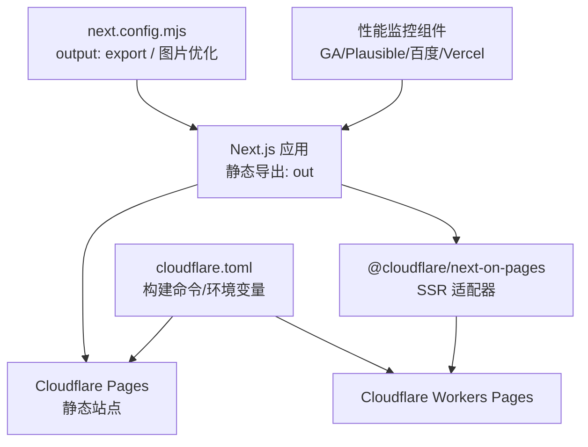
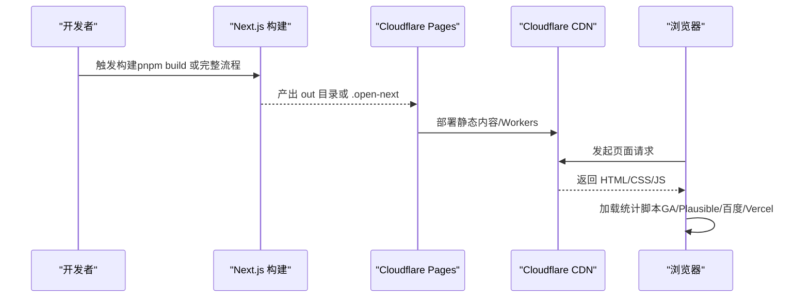
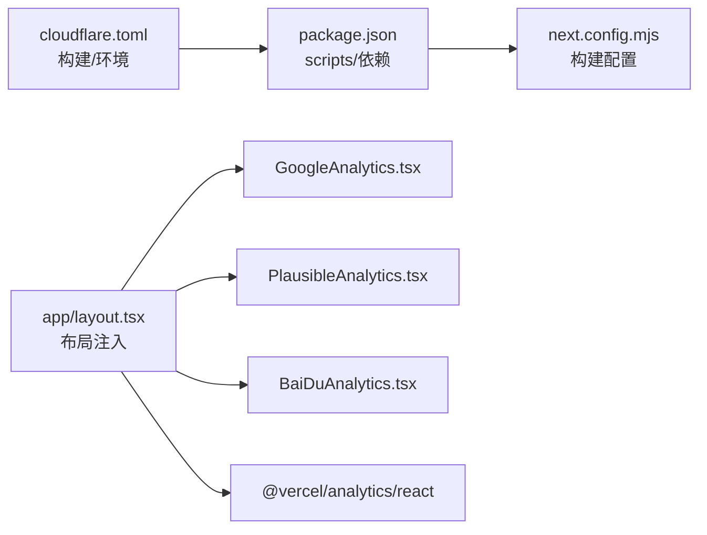
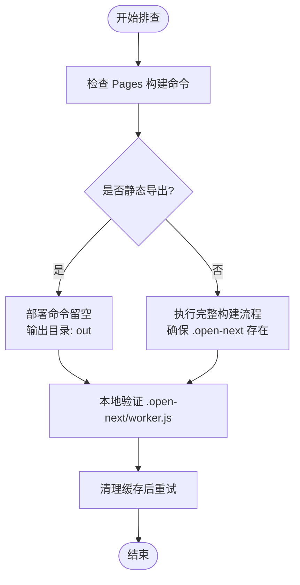

# CDN 和性能监控

<cite>
**本文引用的文件**
- [cloudflare.toml](file://cloudflare.toml)
- [CLOUDFLARE_PAGES_SETUP.md](file://CLOUDFLARE_PAGES_SETUP.md)
- [CLOUDFLARE_PAGES_STATIC_DEPLOY.md](file://CLOUDFLARE_PAGES_STATIC_DEPLOY.md)
- [DEPLOY_CLOUDFLARE.md](file://DEPLOY_CLOUDFLARE.md)
- [next.config.mjs](file://next.config.mjs)
- [package.json](file://package.json)
- [app/layout.tsx](file://app/layout.tsx)
- [app/GoogleAnalytics.tsx](file://app/GoogleAnalytics.tsx)
- [app/PlausibleAnalytics.tsx](file://app/PlausibleAnalytics.tsx)
- [app/BaiDuAnalytics.tsx](file://app/BaiDuAnalytics.tsx)
- [config/site.ts](file://config/site.ts)
- [public/ads.txt](file://public/ads.txt)
</cite>

## 目录
1. [简介](#简介)
2. [项目结构](#项目结构)
3. [核心组件](#核心组件)
4. [架构总览](#架构总览)
5. [详细组件分析](#详细组件分析)
6. [依赖关系分析](#依赖关系分析)
7. [性能考量](#性能考量)
8. [故障排查指南](#故障排查指南)
9. [结论](#结论)
10. [附录](#附录)

## 简介
本文件面向 CDN 与性能监控主题，聚焦于 Cloudflare Pages 部署配置、缓存策略与性能优化设置，结合项目现有配置与文档，系统阐述 cloudflare.toml 参数、静态资源缓存与压缩、分发网络优化、部署流程、环境变量与域名设置、性能监控指标与故障恢复方案，并给出安全与访问控制建议及最佳实践。

## 项目结构
该项目采用 Next.js 16 静态导出（SSG）模式，构建产物输出至 out 目录，适合直接部署到 Cloudflare Pages 的静态站点功能；同时保留了使用 @cloudflare/next-on-pages 适配器进行 SSR 的能力与部署路径说明。关键配置与部署文档集中在以下文件：
- cloudflare.toml：Cloudflare Pages 构建与环境变量参考
- next.config.mjs：静态导出与图片优化配置
- 多个 Cloudflare Pages 部署文档：静态部署、SSR 部署与故障排查
- 性能监控组件：Google Analytics、Plausible Analytics、百度统计与 Vercel Analytics

图表来源
- [cloudflare.toml](file://cloudflare.toml#L1-L13)
- [next.config.mjs](file://next.config.mjs#L1-L28)
- [CLOUDFLARE_PAGES_STATIC_DEPLOY.md](file://CLOUDFLARE_PAGES_STATIC_DEPLOY.md#L1-L61)
- [CLOUDFLARE_PAGES_SETUP.md](file://CLOUDFLARE_PAGES_SETUP.md#L1-L109)
- [DEPLOY_CLOUDFLARE.md](file://DEPLOY_CLOUDFLARE.md#L1-L114)

章节来源
- [cloudflare.toml](file://cloudflare.toml#L1-L13)
- [next.config.mjs](file://next.config.mjs#L1-L28)
- [CLOUDFLARE_PAGES_STATIC_DEPLOY.md](file://CLOUDFLARE_PAGES_STATIC_DEPLOY.md#L1-L61)
- [CLOUDFLARE_PAGES_SETUP.md](file://CLOUDFLARE_PAGES_SETUP.md#L1-L109)
- [DEPLOY_CLOUDFLARE.md](file://DEPLOY_CLOUDFLARE.md#L1-L114)

## 核心组件
- 静态导出与图片优化
  - 通过 output: "export" 生成 out 目录，便于 Cloudflare Pages 静态部署
  - images.unoptimized: true 以适配静态导出场景
  - remotePatterns 支持从 R2 公网地址加载图片（可选）
- 性能监控
  - 布局中按环境注入多个前端统计脚本（Google Analytics、Plausible、百度统计、Vercel Analytics）
  - 通过环境变量控制各统计服务的启用与参数
- 部署配置
  - cloudflare.toml 提供构建命令与 Node 版本参考
  - 多份部署文档覆盖静态与 SSR 场景，含环境变量与故障排查

章节来源
- [next.config.mjs](file://next.config.mjs#L1-L28)
- [app/layout.tsx](file://app/layout.tsx#L1-L78)
- [app/GoogleAnalytics.tsx](file://app/GoogleAnalytics.tsx#L1-L38)
- [app/PlausibleAnalytics.tsx](file://app/PlausibleAnalytics.tsx#L1-L40)
- [app/BaiDuAnalytics.tsx](file://app/BaiDuAnalytics.tsx#L1-L34)
- [cloudflare.toml](file://cloudflare.toml#L1-L13)
- [CLOUDFLARE_PAGES_STATIC_DEPLOY.md](file://CLOUDFLARE_PAGES_STATIC_DEPLOY.md#L1-L61)
- [CLOUDFLARE_PAGES_SETUP.md](file://CLOUDFLARE_PAGES_SETUP.md#L1-L109)
- [DEPLOY_CLOUDFLARE.md](file://DEPLOY_CLOUDFLARE.md#L1-L114)

## 架构总览
下图展示从源码到用户访问的关键路径：Next.js 构建（静态导出或 SSR）、Cloudflare Pages 静态分发或 Workers Pages、浏览器请求与统计脚本执行。

图表来源
- [next.config.mjs](file://next.config.mjs#L1-L28)
- [CLOUDFLARE_PAGES_STATIC_DEPLOY.md](file://CLOUDFLARE_PAGES_STATIC_DEPLOY.md#L1-L61)
- [CLOUDFLARE_PAGES_SETUP.md](file://CLOUDFLARE_PAGES_SETUP.md#L1-L109)
- [app/layout.tsx](file://app/layout.tsx#L1-L78)

## 详细组件分析

### cloudflare.toml 配置解析
- [build.command]
  - 用途：定义 Cloudflare Pages 的构建命令
  - 当前值：pnpm build
  - 说明：静态导出场景下，Pages 会自动检测 out 目录并部署
- [build.output_directory]
  - 用途：指定构建输出目录
  - 当前值：out
  - 说明：与 next.config.mjs 的 output: "export" 对应
- [build.environment_variables]
  - NODE_VERSION：20
  - 用途：统一构建环境 Node 版本，避免版本差异导致的兼容性问题

章节来源
- [cloudflare.toml](file://cloudflare.toml#L4-L12)
- [next.config.mjs](file://next.config.mjs#L3-L4)

### 静态资源缓存与压缩机制
- 缓存策略
  - 静态导出产物 out 目录由 Cloudflare Pages 自动托管，可借助 Pages 的默认缓存行为提升命中率
  - 建议在 Pages 控制台或通过自定义配置（如使用 Workers）对不同资源类型设置合适的 Cache-Control
- 压缩策略
  - Cloudflare 自动启用 HTTP/2、HTTP/3、Brotli/Gzip 压缩
  - 可在 Pages 控制台开启压缩选项（如自动压缩、最小化等）
- 分发网络优化
  - 利用 Cloudflare 全球节点就近分发，减少延迟
  - 建议启用“快速重传”“即时预热”等加速特性（在 Pages 控制台配置）

章节来源
- [CLOUDFLARE_PAGES_STATIC_DEPLOY.md](file://CLOUDFLARE_PAGES_STATIC_DEPLOY.md#L1-L61)

### 部署流程与环境配置
- 静态导出（推荐）
  - 构建命令：pnpm build
  - 输出目录：out
  - 部署命令：留空（Pages 自动检测 out）
  - 环境变量：NODE_VERSION=20（可在 Pages 控制台设置）
- SSR 场景（使用 @cloudflare/next-on-pages）
  - 构建命令：pnpm install && next build && opennextjs-cloudflare build
  - 输出目录：.open-next（由适配器生成）
  - 部署命令：留空（Pages 自动处理）
- 环境变量
  - 统计服务：NEXT_PUBLIC_BAIDU_TONGJI、NEXT_PUBLIC_PLAUSIBLE_DOMAIN、NEXT_PUBLIC_PLAUSIBLE_SRC
  - 站点基础：NEXT_PUBLIC_SITE_URL、NEXT_PUBLIC_DISCORD_INVITE_URL
  - 广告：ca-pub-...（ads.txt 已提供）

章节来源
- [CLOUDFLARE_PAGES_STATIC_DEPLOY.md](file://CLOUDFLARE_PAGES_STATIC_DEPLOY.md#L1-L61)
- [CLOUDFLARE_PAGES_SETUP.md](file://CLOUDFLARE_PAGES_SETUP.md#L1-L109)
- [DEPLOY_CLOUDFLARE.md](file://DEPLOY_CLOUDFLARE.md#L1-L114)
- [public/ads.txt](file://public/ads.txt#L1-L1)

### 性能监控组件与指标
- 组件分布
  - GoogleAnalytics：基于 gtag.js 的 GA4 实现
  - PlausibleAnalytics：轻量级隐私友好统计
  - BaiDuAnalytics：百度统计
  - Vercel Analytics：@vercel/analytics/react
- 指标建议
  - 页面加载时间（TTFB/LCP/FID/CLS）
  - 请求成功率与错误率
  - CDN 缓存命中率与回源比例
  - 用户地域分布与热门页面
- 数据采集与隐私
  - 百度统计与 GA4 需遵循相应国家/地区的合规要求
  - Plausible 强调隐私优先，适合对隐私敏感的场景

章节来源
- [app/layout.tsx](file://app/layout.tsx#L1-L78)
- [app/GoogleAnalytics.tsx](file://app/GoogleAnalytics.tsx#L1-L38)
- [app/PlausibleAnalytics.tsx](file://app/PlausibleAnalytics.tsx#L1-L40)
- [app/BaiDuAnalytics.tsx](file://app/BaiDuAnalytics.tsx#L1-L34)
- [config/site.ts](file://config/site.ts#L1-L45)

### 安全配置、SSL 与访问控制
- SSL 证书
  - Cloudflare Pages 默认为绑定域名提供免费证书与 HTTPS
- 访问控制
  - 可在 Pages 控制台配置 IP 白名单、Bot 防护、WAF 规则
  - 对敏感 API 或后台接口建议配合 Workers 或 Pages Functions 增强鉴权
- 广告与第三方脚本
  - ads.txt 已放置于 public 目录，确保广告平台验证通过
  - 第三方统计脚本通过环境变量控制开关，降低风险面

章节来源
- [public/ads.txt](file://public/ads.txt#L1-L1)
- [app/layout.tsx](file://app/layout.tsx#L40-L41)

## 依赖关系分析
- 构建链路
  - package.json scripts 定义了开发、构建、启动与升级脚本
  - next.config.mjs 决定是否静态导出与图片优化策略
  - cloudflare.toml 提供 Pages 构建命令与 Node 版本
- 统计链路
  - app/layout.tsx 注入多个统计组件
  - 组件读取环境变量决定是否加载与初始化

图表来源
- [package.json](file://package.json#L1-L65)
- [next.config.mjs](file://next.config.mjs#L1-L28)
- [cloudflare.toml](file://cloudflare.toml#L1-L13)
- [app/layout.tsx](file://app/layout.tsx#L1-L78)

章节来源
- [package.json](file://package.json#L1-L65)
- [next.config.mjs](file://next.config.mjs#L1-L28)
- [cloudflare.toml](file://cloudflare.toml#L1-L13)
- [app/layout.tsx](file://app/layout.tsx#L1-L78)

## 性能考量
- 构建与缓存
  - 使用静态导出（output: "export"）可最大化 Pages 的静态缓存收益
  - 保持稳定的文件名哈希（如使用 Next.js 默认命名）有助于长期缓存
- 资源优化
  - 图片优化：静态导出需关闭 Next 图片优化（images.unoptimized: true）
  - CDN 压缩：依赖 Cloudflare 自动压缩，无需额外配置
- 监控与观测
  - 结合 Cloudflare Workers Analytics 与前端统计组件，建立端到端指标体系
  - 关注 TTFB、PWA 渐进增强与离线体验（如适用）

章节来源
- [next.config.mjs](file://next.config.mjs#L5-L16)
- [CLOUDFLARE_PAGES_STATIC_DEPLOY.md](file://CLOUDFLARE_PAGES_STATIC_DEPLOY.md#L1-L61)

## 故障排查指南
- 常见错误与定位
  - “未找到 .open-next/worker.js”：通常因构建命令未正确执行或 Pages 构建命令配置错误
  - “缺少 Worker 入口点或静态资源目录”：多出现在直接使用 Wrangler 部署而非 Pages 的情况下
  - “部署命令”字段非空导致静态站点异常：静态导出场景应留空
- 修复步骤
  - 静态导出：确认构建命令为 pnpm build，输出目录为 out，部署命令留空
  - SSR 场景：使用完整构建流程（next build + opennextjs-cloudflare build），确保 .open-next 存在
  - 清理缓存：删除 .next、.open-next、node_modules/.cache 后重新安装与构建
- 本地验证
  - 本地运行完整构建流程，检查 .open-next/worker.js 是否生成
  - 使用 Wrangler 本地部署测试（如需）

图表来源
- [CLOUDFLARE_PAGES_SETUP.md](file://CLOUDFLARE_PAGES_SETUP.md#L5-L102)
- [CLOUDFLARE_PAGES_STATIC_DEPLOY.md](file://CLOUDFLARE_PAGES_STATIC_DEPLOY.md#L20-L60)

章节来源
- [CLOUDFLARE_PAGES_SETUP.md](file://CLOUDFLARE_PAGES_SETUP.md#L1-L109)
- [CLOUDFLARE_PAGES_STATIC_DEPLOY.md](file://CLOUDFLARE_PAGES_STATIC_DEPLOY.md#L1-L61)

## 结论
本项目以静态导出为主，结合 Cloudflare Pages 的全球分发与缓存能力，可实现高可用、低延迟的前端交付。通过合理的构建配置、环境变量管理与性能监控组件接入，能够在保证隐私合规的前提下获得全面的访问洞察。若未来需要 API 能力或更复杂的运行时逻辑，可平滑迁移到 @cloudflare/next-on-pages 的 SSR 方案。

## 附录

### 部署流程速查
- 静态导出
  - 构建命令：pnpm build
  - 输出目录：out
  - 部署命令：留空
  - 环境变量：NODE_VERSION=20
- SSR（适配器）
  - 构建命令：pnpm install && next build && opennextjs-cloudflare build
  - 输出目录：.open-next
  - 部署命令：留空

章节来源
- [CLOUDFLARE_PAGES_STATIC_DEPLOY.md](file://CLOUDFLARE_PAGES_STATIC_DEPLOY.md#L1-L61)
- [CLOUDFLARE_PAGES_SETUP.md](file://CLOUDFLARE_PAGES_SETUP.md#L1-L109)

### 环境变量清单
- 统计与监控
  - NEXT_PUBLIC_BAIDU_TONGJI：百度统计 ID
  - NEXT_PUBLIC_PLAUSIBLE_DOMAIN：Plausible 域名
  - NEXT_PUBLIC_PLAUSIBLE_SRC：Plausible 脚本地址
- 站点与社交
  - NEXT_PUBLIC_SITE_URL：站点基础 URL
  - NEXT_PUBLIC_DISCORD_INVITE_URL：Discord 邀请链接
- 广告
  - ads.txt 已放置于 public 目录，确保广告平台验证

章节来源
- [app/BaiDuAnalytics.tsx](file://app/BaiDuAnalytics.tsx#L1-L34)
- [app/PlausibleAnalytics.tsx](file://app/PlausibleAnalytics.tsx#L1-L40)
- [config/site.ts](file://config/site.ts#L1-L45)
- [public/ads.txt](file://public/ads.txt#L1-L1)