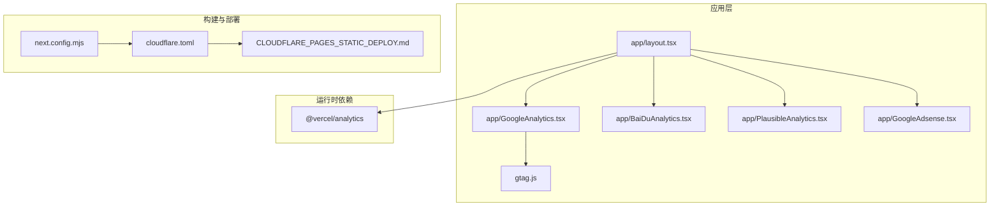
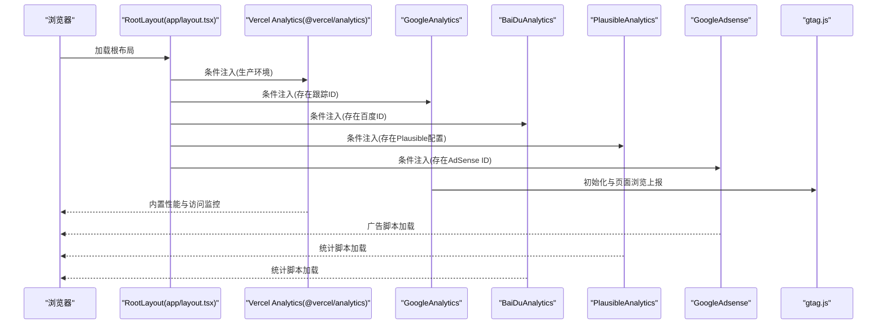
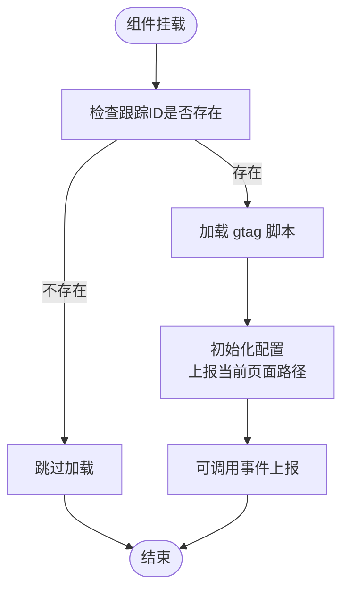
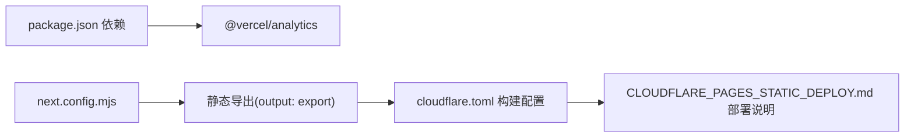
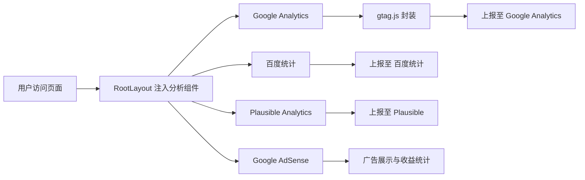

# 分析和监控系统

<cite>
**本文引用的文件**
- [app/layout.tsx](file://app/layout.tsx)
- [app/GoogleAnalytics.tsx](file://app/GoogleAnalytics.tsx)
- [app/BaiDuAnalytics.tsx](file://app/BaiDuAnalytics.tsx)
- [app/PlausibleAnalytics.tsx](file://app/PlausibleAnalytics.tsx)
- [app/GoogleAdsense.tsx](file://app/GoogleAdsense.tsx)
- [gtag.js](file://gtag.js)
- [next.config.mjs](file://next.config.mjs)
- [cloudflare.toml](file://cloudflare.toml)
- [CLOUDFLARE_PAGES_STATIC_DEPLOY.md](file://CLOUDFLARE_PAGES_STATIC_DEPLOY.md)
- [README.md](file://README.md)
- [lib/logger.ts](file://lib/logger.ts)
- [package.json](file://package.json)
</cite>

## 目录
1. [简介](#简介)
2. [项目结构](#项目结构)
3. [核心组件](#核心组件)
4. [架构总览](#架构总览)
5. [详细组件分析](#详细组件分析)
6. [依赖关系分析](#依赖关系分析)
7. [性能考虑](#性能考虑)
8. [故障排除指南](#故障排除指南)
9. [结论](#结论)
10. [附录](#附录)

## 简介
本文件面向“分析和监控系统”的综合文档，围绕本仓库中已集成的多种分析与监控能力进行系统化梳理，涵盖：
- 多分析平台集成：Google Analytics、百度统计、Vercel Analytics、Plausible Analytics
- 广告统计：Google AdSense
- 部署与CDN：静态导出、Cloudflare Pages 部署配置
- 缓存策略与性能监控
- 数据采集、处理与可视化路径
- 配置示例、最佳实践与故障排除
- 性能优化建议、监控告警与数据分析策略

## 项目结构
本项目采用 Next.js App Router 结构，分析与监控相关的核心文件集中在 app 目录与根配置文件中：
- 应用布局与全局注入：app/layout.tsx
- 分析组件：app/GoogleAnalytics.tsx、app/BaiDuAnalytics.tsx、app/PlausibleAnalytics.tsx、app/GoogleAdsense.tsx
- Google Analytics 工具：gtag.js
- 构建与导出配置：next.config.mjs
- 部署配置与说明：cloudflare.toml、CLOUDFLARE_PAGES_STATIC_DEPLOY.md
- 日志记录：lib/logger.ts
- 依赖与版本：package.json

图表来源
- [app/layout.tsx](file://app/layout.tsx#L1-L78)
- [app/GoogleAnalytics.tsx](file://app/GoogleAnalytics.tsx#L1-L38)
- [app/BaiDuAnalytics.tsx](file://app/BaiDuAnalytics.tsx#L1-L34)
- [app/PlausibleAnalytics.tsx](file://app/PlausibleAnalytics.tsx#L1-L40)
- [app/GoogleAdsense.tsx](file://app/GoogleAdsense.tsx#L1-L25)
- [gtag.js](file://gtag.js#L1-L16)
- [next.config.mjs](file://next.config.mjs#L1-L28)
- [cloudflare.toml](file://cloudflare.toml#L1-L13)
- [CLOUDFLARE_PAGES_STATIC_DEPLOY.md](file://CLOUDFLARE_PAGES_STATIC_DEPLOY.md#L1-L61)

章节来源
- [app/layout.tsx](file://app/layout.tsx#L1-L78)
- [next.config.mjs](file://next.config.mjs#L1-L28)
- [cloudflare.toml](file://cloudflare.toml#L1-L13)

## 核心组件
- Vercel Analytics 注入：通过 @vercel/analytics/react 在生产环境注入，用于内置性能监控与访问统计。
- Google Analytics：条件加载，使用 gtag.js 提供初始化与事件上报接口。
- 百度统计：条件加载，通过内联脚本方式引入百度统计 SDK。
- Plausible Analytics：条件加载，支持自定义域名与脚本源，提供轻量隐私友好的统计。
- Google AdSense：条件加载，用于广告展示与收益。

章节来源
- [app/layout.tsx](file://app/layout.tsx#L14-L73)
- [app/GoogleAnalytics.tsx](file://app/GoogleAnalytics.tsx#L1-L38)
- [app/BaiDuAnalytics.tsx](file://app/BaiDuAnalytics.tsx#L1-L34)
- [app/PlausibleAnalytics.tsx](file://app/PlausibleAnalytics.tsx#L1-L40)
- [app/GoogleAdsense.tsx](file://app/GoogleAdsense.tsx#L1-L25)
- [gtag.js](file://gtag.js#L1-L16)

## 架构总览
下图展示了页面生命周期中分析与监控组件的加载顺序与依赖关系：

图表来源
- [app/layout.tsx](file://app/layout.tsx#L14-L73)
- [app/GoogleAnalytics.tsx](file://app/GoogleAnalytics.tsx#L6-L35)
- [app/BaiDuAnalytics.tsx](file://app/BaiDuAnalytics.tsx#L5-L31)
- [app/PlausibleAnalytics.tsx](file://app/PlausibleAnalytics.tsx#L9-L37)
- [app/GoogleAdsense.tsx](file://app/GoogleAdsense.tsx#L5-L22)
- [gtag.js](file://gtag.js#L1-L16)

## 详细组件分析

### Vercel Analytics（内置性能监控）
- 注入位置：RootLayout 中按环境变量条件注入。
- 功能：提供内置的访问统计与性能监控，无需额外配置。
- 生效范围：生产环境生效，开发环境不加载。

章节来源
- [app/layout.tsx](file://app/layout.tsx#L14-L73)

### Google Analytics（条件加载与事件封装）
- 跟踪ID来源：NEXT_PUBLIC_GOOGLE_ID（或 NEXT_PUBLIC_GOOGLE_ANALYTICS，视 README 与 gtag.js 定义而定）。
- 初始化流程：动态加载 gtag 脚本与初始化配置；页面路径自动上报。
- 事件封装：提供 pageview 与 event 封装，便于在业务逻辑中调用。
- 加载策略：使用 afterInteractive，避免阻塞首屏渲染。

图表来源
- [app/GoogleAnalytics.tsx](file://app/GoogleAnalytics.tsx#L6-L35)
- [gtag.js](file://gtag.js#L1-L16)

章节来源
- [app/GoogleAnalytics.tsx](file://app/GoogleAnalytics.tsx#L1-L38)
- [gtag.js](file://gtag.js#L1-L16)
- [README.md](file://README.md#L130-L138)

### 百度统计（条件加载）
- 跟踪ID来源：NEXT_PUBLIC_BAIDU_TONGJI。
- 初始化方式：内联脚本方式引入百度统计 SDK，并插入到文档头部合适位置。
- 加载策略：afterInteractive，避免阻塞首屏。

章节来源
- [app/BaiDuAnalytics.tsx](file://app/BaiDuAnalytics.tsx#L1-L34)

### Plausible Analytics（条件加载与隐私友好）
- 配置来源：NEXT_PUBLIC_PLAUSIBLE_DOMAIN、NEXT_PUBLIC_PLAUSIBLE_SRC。
- 初始化方式：加载脚本并提供 window.plausible 接口，支持自定义域名。
- 加载策略：defer + afterInteractive，提升性能。

章节来源
- [app/PlausibleAnalytics.tsx](file://app/PlausibleAnalytics.tsx#L1-L40)

### Google AdSense（条件加载）
- 跟踪ID来源：NEXT_PUBLIC_GOOGLE_ADSENSE_ID。
- 初始化方式：动态加载官方广告脚本。
- 加载策略：async + afterInteractive。

章节来源
- [app/GoogleAdsense.tsx](file://app/GoogleAdsense.tsx#L1-L25)

## 依赖关系分析
- 运行时依赖：@vercel/analytics 已在 package.json 中声明。
- 构建与导出：next.config.mjs 启用静态导出（output: export），适配 Cloudflare Pages 静态部署。
- 部署配置：cloudflare.toml 指定构建命令与输出目录；CLOUDFLARE_PAGES_STATIC_DEPLOY.md 提供静态部署的控制台配置说明。

图表来源
- [package.json](file://package.json#L27-L27)
- [next.config.mjs](file://next.config.mjs#L2-L4)
- [cloudflare.toml](file://cloudflare.toml#L4-L12)
- [CLOUDFLARE_PAGES_STATIC_DEPLOY.md](file://CLOUDFLARE_PAGES_STATIC_DEPLOY.md#L7-L27)

章节来源
- [package.json](file://package.json#L16-L51)
- [next.config.mjs](file://next.config.mjs#L1-L28)
- [cloudflare.toml](file://cloudflare.toml#L1-L13)
- [CLOUDFLARE_PAGES_STATIC_DEPLOY.md](file://CLOUDFLARE_PAGES_STATIC_DEPLOY.md#L1-L61)

## 性能考虑
- 脚本加载策略
  - afterInteractive：确保 DOM 可交互后再加载分析脚本，减少对首屏的影响。
  - defer：Plausible 使用 defer，有助于避免阻塞解析。
  - async：AdSense 使用 async，确保广告脚本异步加载。
- 静态导出与 CDN
  - next.config.mjs 启用静态导出，配合 Cloudflare Pages 实现边缘分发与缓存加速。
  - cloudflare.toml 指定输出目录为 out，符合静态导出产物。
- 日志与可观测性
  - lib/logger.ts 使用 winston + DailyRotateFile，按日期轮转日志，适合本地或服务端侧的可观测性补充。
- 构建优化
  - 移除生产日志：compiler.removeConsole 在生产环境移除 console.error 以外的日志，减小包体积与运行时开销。

章节来源
- [app/GoogleAnalytics.tsx](file://app/GoogleAnalytics.tsx#L11-L14)
- [app/PlausibleAnalytics.tsx](file://app/PlausibleAnalytics.tsx#L14-L18)
- [app/GoogleAdsense.tsx](file://app/GoogleAdsense.tsx#L10-L14)
- [next.config.mjs](file://next.config.mjs#L5-L24)
- [lib/logger.ts](file://lib/logger.ts#L11-L18)

## 故障排除指南
- 部署命令错误（Cloudflare Pages）
  - 症状：出现 wrangler deploy 相关错误。
  - 原因：静态导出（SSG）不需要 Workers 或运行时部署命令。
  - 解决：在 Cloudflare Pages 控制台将“部署命令”留空；若系统要求必填，可使用占位命令。
- 分析脚本未生效
  - 检查环境变量是否正确设置（NEXT_PUBLIC_GOOGLE_ID/NEXT_PUBLIC_GOOGLE_ANALYTICS、NEXT_PUBLIC_BAIDU_TONGJI、NEXT_PUBLIC_PLAUSIBLE_DOMAIN、NEXT_PUBLIC_PLAUSIBLE_SRC、NEXT_PUBLIC_GOOGLE_ADSENSE_ID）。
  - 确认组件在生产环境加载（开发环境不加载）。
- 页面路径未正确上报
  - 确认 gtag.js 中 page_path 是否被正确传入；如需自定义上报，可在业务逻辑中调用 pageview(url)。
- 广告未显示
  - 检查 AdSense ID 是否正确；确认页面已通过审核且广告单元配置无误。

章节来源
- [CLOUDFLARE_PAGES_STATIC_DEPLOY.md](file://CLOUDFLARE_PAGES_STATIC_DEPLOY.md#L20-L46)
- [app/layout.tsx](file://app/layout.tsx#L63-L73)
- [gtag.js](file://gtag.js#L3-L7)
- [README.md](file://README.md#L130-L138)

## 结论
本项目以模块化组件的方式集成了多平台分析与监控能力，结合静态导出与 CDN 部署，实现了低侵入、高性能的数据采集与运行时监控。通过合理的加载策略与环境变量控制，既能满足隐私合规（如 Plausible），也能覆盖主流分析平台需求。建议在生产环境中持续关注指标健康度与告警阈值，并结合日志系统进行问题定位与优化迭代。

## 附录

### 配置清单与示例
- 环境变量（示例）
  - NEXT_PUBLIC_GOOGLE_ID 或 NEXT_PUBLIC_GOOGLE_ANALYTICS：Google Analytics 跟踪ID
  - NEXT_PUBLIC_BAIDU_TONGJI：百度统计 ID
  - NEXT_PUBLIC_PLAUSIBLE_DOMAIN：Plausible 域名
  - NEXT_PUBLIC_PLAUSIBLE_SRC：Plausible 脚本地址
  - NEXT_PUBLIC_GOOGLE_ADSENSE_ID：AdSense 客户端ID
- 构建与部署
  - next.config.mjs：启用静态导出（output: export）
  - cloudflare.toml：指定构建命令与输出目录
  - CLOUDFLARE_PAGES_STATIC_DEPLOY.md：控制台部署配置说明

章节来源
- [README.md](file://README.md#L130-L138)
- [next.config.mjs](file://next.config.mjs#L2-L4)
- [cloudflare.toml](file://cloudflare.toml#L4-L12)
- [CLOUDFLARE_PAGES_STATIC_DEPLOY.md](file://CLOUDFLARE_PAGES_STATIC_DEPLOY.md#L7-L27)

### 最佳实践
- 分析平台选择
  - 国际化站点优先考虑 Google Analytics；国内场景可叠加百度统计。
  - 注重隐私合规时，优先使用 Plausible。
  - Vercel Analytics 作为内置监控，无需额外配置即可获得访问与性能数据。
- 加载策略
  - 使用 afterInteractive/defer/async 等策略降低对首屏的影响。
- 数据处理与可视化
  - 将各平台仪表盘作为主入口；结合日志系统进行异常与错误追踪。
- 监控告警与数据分析
  - 设定关键指标阈值（如跳出率、平均停留时长、4xx/5xx 错误率）。
  - 对异常波动进行自动化告警（如通过平台自带告警或外部集成）。
  - 定期复盘流量来源、热门内容与转化路径，指导内容与运营策略。

### 数据流与处理示意

图表来源
- [app/layout.tsx](file://app/layout.tsx#L63-L73)
- [app/GoogleAnalytics.tsx](file://app/GoogleAnalytics.tsx#L6-L35)
- [app/BaiDuAnalytics.tsx](file://app/BaiDuAnalytics.tsx#L5-L31)
- [app/PlausibleAnalytics.tsx](file://app/PlausibleAnalytics.tsx#L9-L37)
- [app/GoogleAdsense.tsx](file://app/GoogleAdsense.tsx#L5-L22)
- [gtag.js](file://gtag.js#L1-L16)