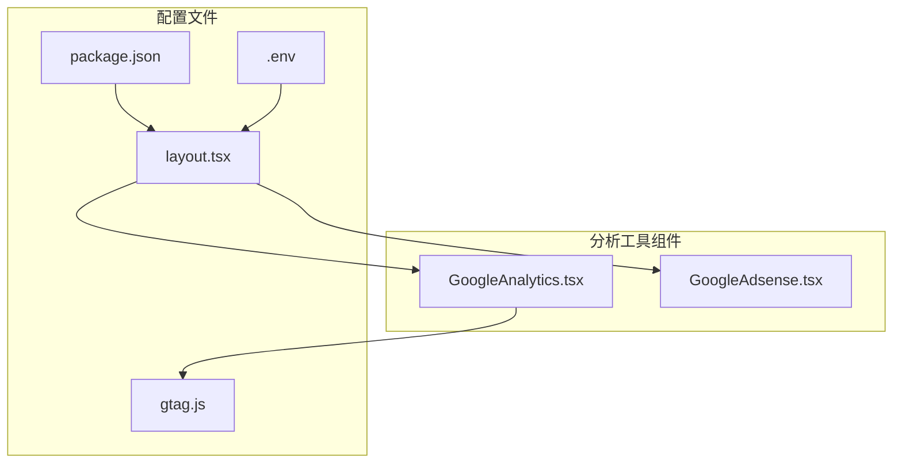
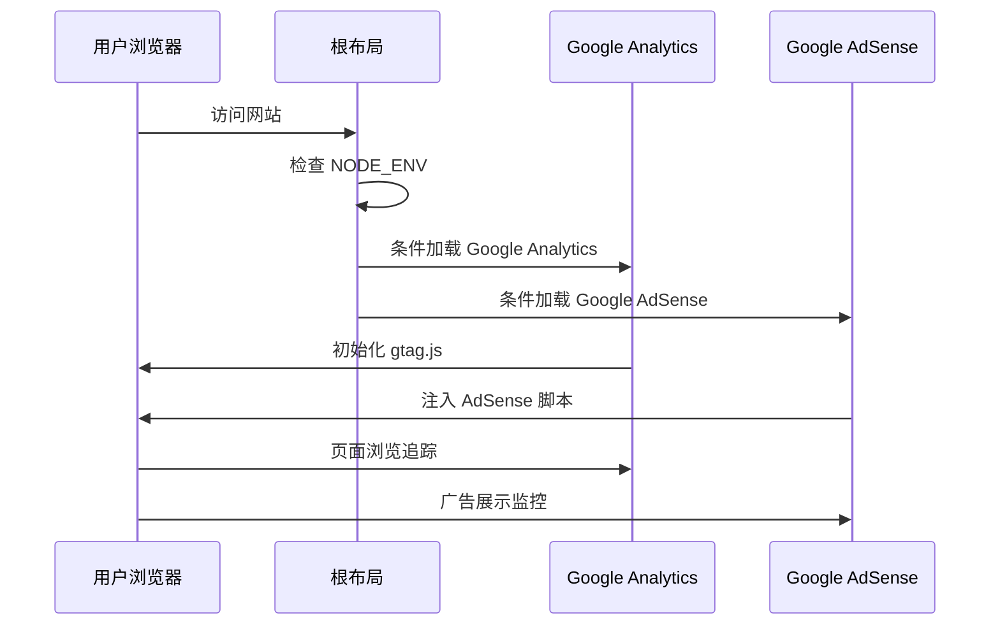
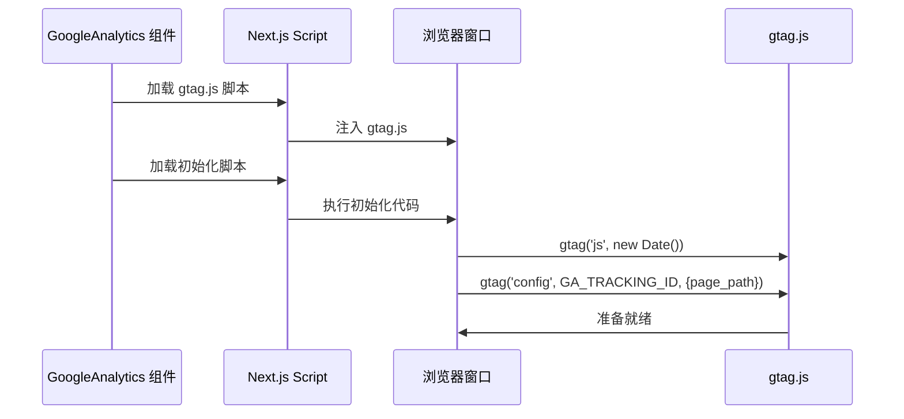
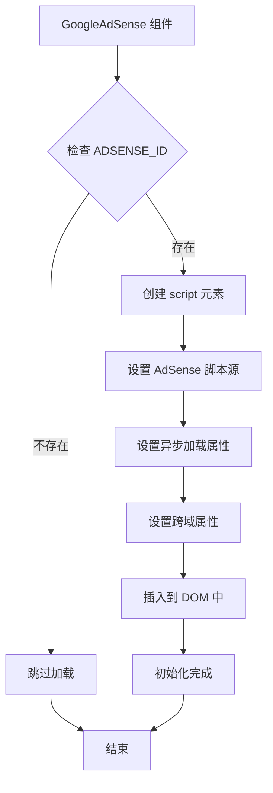
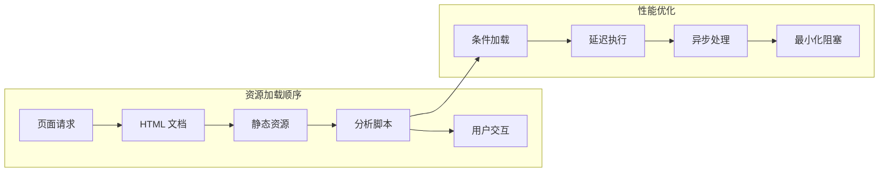

# 分析工具集成

<cite>
**本文档引用的文件**
- [app/GoogleAnalytics.tsx](file://app/GoogleAnalytics.tsx)
- [app/GoogleAdsense.tsx](file://app/GoogleAdsense.tsx)
- [app/layout.tsx](file://app/layout.tsx)
- [gtag.js](file://gtag.js)
- [.env](file://.env)
- [package.json](file://package.json)
</cite>

## 更新摘要
**所做更改**
- 更新了分析工具集成架构，移除了百度统计和Plausible Analytics组件
- 简化了分析基础设施，目前仅保留Google Analytics和Google AdSense组件
- 更新了环境变量配置和脚本加载策略
- 修订了架构图和组件分析以反映当前实现状态

## 目录
1. [简介](#简介)
2. [项目结构](#项目结构)
3. [核心组件](#核心组件)
4. [架构概览](#架构概览)
5. [详细组件分析](#详细组件分析)
6. [依赖关系分析](#依赖关系分析)
7. [性能考虑](#性能考虑)
8. [故障排除指南](#故障排除指南)
9. [结论](#结论)

## 简介

本项目实现了两种分析工具的集成：Google Analytics和Google AdSense。这些分析工具通过Next.js的客户端组件和脚本加载机制进行集成，提供了网站访问统计、用户行为分析和广告投放监控能力。

项目采用条件加载策略，仅在生产环境中加载分析脚本，确保开发环境的纯净性和性能。所有分析工具都通过环境变量进行配置，支持多语言部署和国际化需求。

**更新** 移除了百度统计和Plausible Analytics的支持，简化了分析基础设施，专注于Google Analytics和Google AdSense的核心分析功能。

## 项目结构

分析工具集成主要分布在以下文件中：



**图表来源**
- [app/GoogleAnalytics.tsx](file://app/GoogleAnalytics.tsx#L1-L38)
- [app/GoogleAdsense.tsx](file://app/GoogleAdsense.tsx#L1-L25)
- [gtag.js](file://gtag.js#L1-L16)
- [app/layout.tsx](file://app/layout.tsx#L1-L74)
- [.env](file://.env#L1-L5)

**章节来源**
- [app/GoogleAnalytics.tsx](file://app/GoogleAnalytics.tsx#L1-L38)
- [app/GoogleAdsense.tsx](file://app/GoogleAdsense.tsx#L1-L25)
- [gtag.js](file://gtag.js#L1-L16)
- [app/layout.tsx](file://app/layout.tsx#L1-L74)
- [.env](file://.env#L1-L5)

## 核心组件

项目实现了两个主要的分析工具组件，每个组件都有特定的功能和配置要求：

### Google Analytics 组件
- **文件路径**: `app/GoogleAnalytics.tsx`
- **功能**: 集成Google Analytics 4 (GA4) 通过gtag.js实现
- **配置**: 通过 `NEXT_PUBLIC_GOOGLE_ID` 环境变量配置跟踪ID
- **初始化**: 动态加载gtag.js脚本和初始化配置
- **数据收集**: 页面浏览追踪、用户行为分析

### Google AdSense 组件  
- **文件路径**: `app/GoogleAdsense.tsx`
- **功能**: 集成Google AdSense广告投放系统
- **配置**: 通过 `NEXT_PUBLIC_GOOGLE_ADSENSE_ID` 环境变量配置客户端ID
- **初始化**: 动态加载AdSense脚本和广告标签
- **数据收集**: 广告展示、点击率、收入统计

**更新** 移除了百度统计和Plausible Analytics组件，简化了分析工具集，专注于核心的分析和广告功能。

**章节来源**
- [app/GoogleAnalytics.tsx](file://app/GoogleAnalytics.tsx#L1-L38)
- [app/GoogleAdsense.tsx](file://app/GoogleAdsense.tsx#L1-L25)
- [gtag.js](file://gtag.js#L1-L16)
- [app/layout.tsx](file://app/layout.tsx#L1-L74)
- [.env](file://.env#L1-L5)

## 架构概览

分析工具集成采用了简化的架构设计，通过客户端组件和条件加载机制实现：



**图表来源**
- [app/layout.tsx](file://app/layout.tsx#L61-L69)
- [app/GoogleAnalytics.tsx](file://app/GoogleAnalytics.tsx#L9-L32)
- [app/GoogleAdsense.tsx](file://app/GoogleAdsense.tsx#L8-L20)

### 数据流分析


**图表来源**
- [app/layout.tsx](file://app/layout.tsx#L61-L69)
- [gtag.js](file://gtag.js#L3-L15)

## 详细组件分析

### Google Analytics 集成

Google Analytics 通过 gtag.js 实现，提供了完整的用户行为追踪功能：

#### 配置参数
- **环境变量**: `NEXT_PUBLIC_GOOGLE_ID`
- **脚本源**: `https://www.googletagmanager.com/gtag/js?id=${GA_TRACKING_ID}`
- **初始化配置**: 自动记录页面路径和时间戳

#### 初始化过程



**图表来源**
- [app/GoogleAnalytics.tsx](file://app/GoogleAnalytics.tsx#L11-L28)
- [gtag.js](file://gtag.js#L3-L7)

#### 数据收集机制
- **页面浏览**: 自动追踪页面路径变化
- **自定义事件**: 支持事件追踪和参数传递
- **用户属性**: 可配置用户标识和属性

**章节来源**
- [app/GoogleAnalytics.tsx](file://app/GoogleAnalytics.tsx#L1-L38)
- [gtag.js](file://gtag.js#L1-L16)
- [.env](file://.env#L4-L4)

### Google AdSense 集成

Google AdSense 提供了广告投放和收入监控功能：

#### 配置参数
- **环境变量**: `NEXT_PUBLIC_GOOGLE_ADSENSE_ID`
- **脚本源**: `https://pagead2.googlesyndication.com/pagead/js/adsbygoogle.js?client=ca-pub-${ADSENSE_ID}`
- **初始化方式**: 异步加载和广告标签注入

#### 初始化过程



**图表来源**
- [app/GoogleAdsense.tsx](file://app/GoogleAdsense.tsx#L10-L15)

#### 数据收集机制
- **广告展示**: 自动追踪广告加载和显示
- **点击监控**: 监控用户广告点击行为
- **收入统计**: 收集广告收益数据

**章节来源**
- [app/GoogleAdsense.tsx](file://app/GoogleAdsense.tsx#L1-L25)
- [.env](file://.env#L5-L5)

## 依赖关系分析

分析工具集成涉及两个核心依赖关系和外部服务：

```mermaid
graph TB
subgraph "核心依赖"
NextJS[Next.js 16]
React[React 19]
VercelAnalytics[@vercel/analytics]
end
subgraph "分析工具"
GA4[Google Analytics 4]
AdSense[Google AdSense]
end
subgraph "配置管理"
EnvVars[环境变量]
ConfigFile[配置文件]
end
NextJS --> React
NextJS --> VercelAnalytics
NextJS --> GA4
NextJS --> AdSense
EnvVars --> GA4
EnvVars --> AdSense
ConfigFile --> EnvVars
```

**图表来源**
- [package.json](file://package.json#L16-L51)
- [app/layout.tsx](file://app/layout.tsx#L1-L15)

### 外部服务集成

| 工具名称 | 服务提供商 | 配置参数 | 用途 |
|---------|-----------|----------|------|
| Google Analytics | Google | `NEXT_PUBLIC_GOOGLE_ID` | 用户行为追踪 |
| Google AdSense | Google | `NEXT_PUBLIC_GOOGLE_ADSENSE_ID` | 广告投放监控 |

**更新** 移除了百度统计和Plausible Analytics的集成，简化了外部服务依赖。

**章节来源**
- [package.json](file://package.json#L16-L51)
- [.env](file://.env#L1-L5)

## 性能考虑

### 加载策略优化

项目采用了简化的性能优化策略：

1. **条件加载**: 仅在生产环境加载分析脚本
2. **延迟加载**: 使用 `afterInteractive` 策略避免阻塞页面渲染
3. **异步加载**: Google AdSense 使用异步加载
4. **最小化影响**: 分析脚本不影响主要内容的加载

### 资源管理



### 缓存策略

- **脚本缓存**: 浏览器自动缓存分析脚本
- **配置缓存**: 环境变量在构建时确定
- **CDN 优化**: 分析脚本通过 CDN 分发

## 故障排除指南

### 常见问题诊断

#### 分析脚本未加载

**症状**: 分析数据不显示或控制台报错

**排查步骤**:
1. 检查环境变量是否正确设置
2. 验证脚本加载策略是否正确
3. 查看浏览器网络面板确认脚本加载状态

**解决方案**:
- 确认 `.env` 文件中的配置项
- 检查 `NODE_ENV` 环境变量
- 验证脚本源地址的有效性

#### 跨域问题

**症状**: 分析脚本加载失败或被浏览器阻止

**排查步骤**:
1. 检查 `crossOrigin` 属性设置
2. 验证 CDN 域名的 CORS 配置
3. 查看浏览器安全控制台

**解决方案**:
- 确保正确的 `crossOrigin` 属性
- 验证 CDN 服务的跨域设置
- 检查防火墙和代理配置

#### 性能影响

**症状**: 页面加载缓慢或交互延迟

**排查步骤**:
1. 检查分析脚本的加载优先级
2. 验证脚本的异步加载配置
3. 监控页面性能指标

**解决方案**:
- 使用 `afterInteractive` 策略
- 确保脚本异步加载
- 考虑分阶段加载分析脚本

### 环境变量配置

| 环境变量 | 类型 | 必需 | 描述 |
|---------|------|------|------|
| `NEXT_PUBLIC_SITE_URL` | 字符串 | 是 | 站点基础URL |
| `NEXT_PUBLIC_LOCALE_DETECTION` | 布尔值 | 是 | 语言检测开关 |
| `NEXT_PUBLIC_OPTIMIZED_IMAGES` | 布尔值 | 是 | 图片优化开关 |
| `NEXT_PUBLIC_GOOGLE_ID` | 字符串 | 否 | Google Analytics 跟踪ID |
| `NEXT_PUBLIC_GOOGLE_ADSENSE_ID` | 字符串 | 否 | Google AdSense 客户端ID |

**更新** 移除了百度统计和Plausible Analytics相关的环境变量配置。

**章节来源**
- [.env](file://.env#L1-L5)

## 结论

本项目成功实现了Google Analytics和Google AdSense的集成，提供了有效的网站访问统计、用户行为分析和广告投放监控能力。通过简化的架构设计和条件加载机制，确保了分析功能的灵活性和性能优化。

### 主要优势

1. **精简的工具集**: 专注于Google Analytics和Google AdSense的核心分析功能
2. **性能优化**: 条件加载和异步处理确保最佳用户体验
3. **易于配置**: 通过环境变量轻松配置分析工具
4. **安全性**: 移除了不必要的第三方分析工具，减少隐私风险
5. **维护简便**: 简化的架构降低了维护复杂度

### 最佳实践建议

1. **合理配置环境变量**: 确保分析工具的正确配置和安全存储
2. **监控性能影响**: 定期检查分析脚本对页面性能的影响
3. **遵守隐私法规**: 确保分析工具符合相关的隐私保护法规
4. **定期更新依赖**: 保持分析工具和相关依赖的最新版本
5. **关注广告合规**: 确保AdSense集成符合Google的广告政策

通过遵循这些实践建议，可以最大化分析工具的价值，同时确保网站的最佳性能和用户体验。移除不必要分析工具的决策使项目更加专注和高效，为未来的功能扩展奠定了良好的基础。