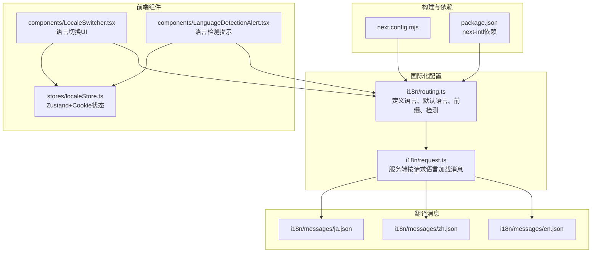
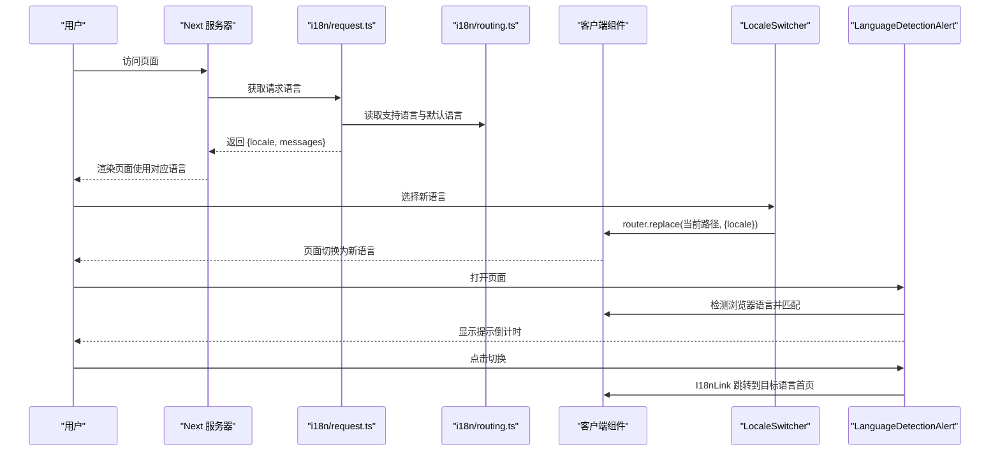
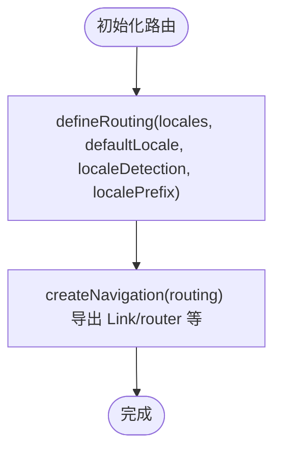
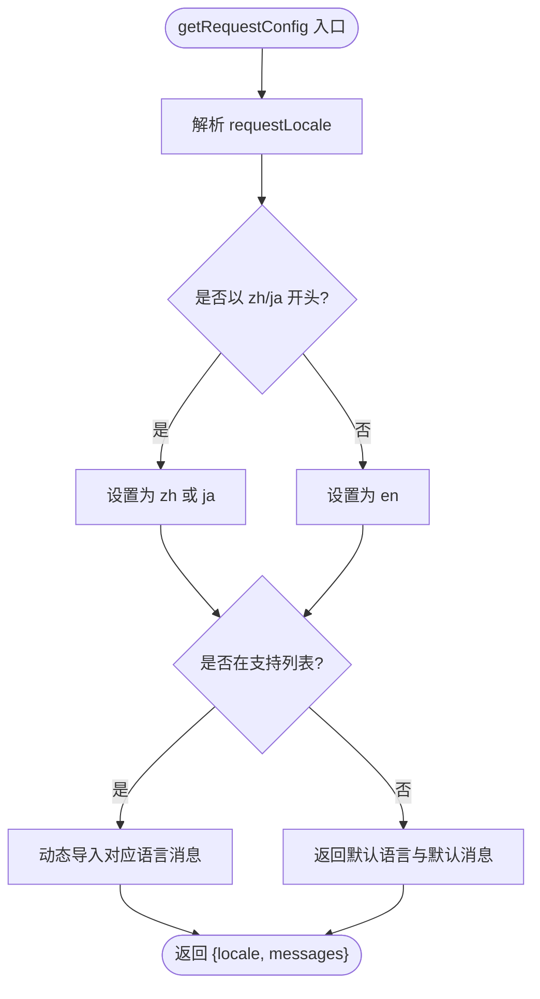
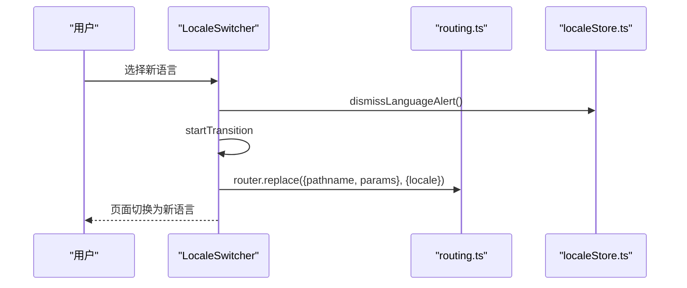
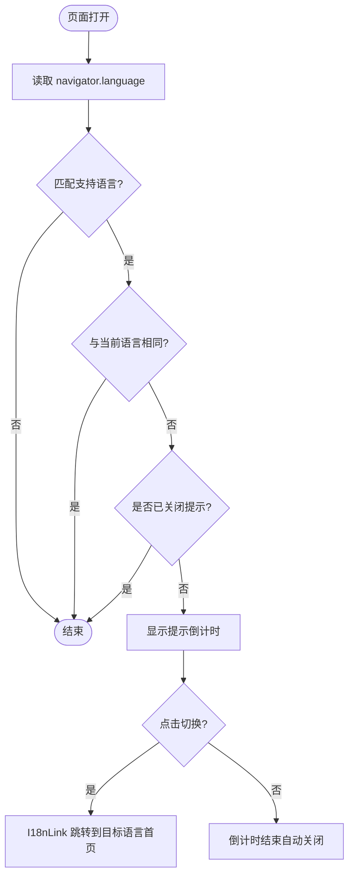
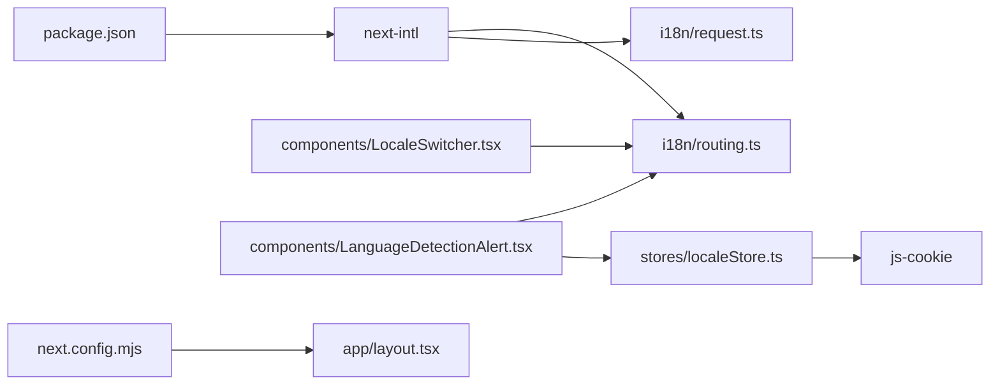

# 国际化系统

<cite>
**本文引用的文件**
- [i18n/routing.ts](file://i18n/routing.ts)
- [i18n/request.ts](file://i18n/request.ts)
- [i18n/messages/en.json](file://i18n/messages/en.json)
- [i18n/messages/zh.json](file://i18n/messages/zh.json)
- [i18n/messages/ja.json](file://i18n/messages/ja.json)
- [components/LocaleSwitcher.tsx](file://components/LocaleSwitcher.tsx)
- [components/LanguageDetectionAlert.tsx](file://components/LanguageDetectionAlert.tsx)
- [stores/localeStore.ts](file://stores/localeStore.ts)
- [next.config.mjs](file://next.config.mjs)
- [package.json](file://package.json)
- [README.md](file://README.md)
- [app/layout.tsx](file://app/layout.tsx)
</cite>

## 目录
1. [简介](#简介)
2. [项目结构](#项目结构)
3. [核心组件](#核心组件)
4. [架构总览](#架构总览)
5. [详细组件分析](#详细组件分析)
6. [依赖关系分析](#依赖关系分析)
7. [性能考量](#性能考量)
8. [故障排查指南](#故障排查指南)
9. [结论](#结论)
10. [附录](#附录)

## 简介
本文件系统性梳理该仓库的国际化（i18n）体系，覆盖以下主题：
- 多语言支持架构与路由国际化配置
- 翻译文件管理与命名空间组织
- 语言检测机制与用户提示
- next-intl 集成方式与导航封装
- 语言切换功能实现与状态管理策略
- 动态路由国际化与内容目录映射
- 最佳实践：新增语言、状态同步、用户体验优化

## 项目结构
国际化相关的关键位置如下：
- 路由与导航：i18n/routing.ts 定义支持的语言、默认语言、前缀策略与语言检测开关；导出封装后的 Link、router、usePathname 等。
- 请求级配置：i18n/request.ts 在服务端根据请求语言选择对应翻译消息。
- 翻译消息：i18n/messages/*.json 按语言分文件存放，采用层级命名空间组织。
- 前端交互：components/LocaleSwitcher.tsx 提供语言切换 UI；components/LanguageDetectionAlert.tsx 提供浏览器语言检测与自动切换提示。
- 状态管理：stores/localeStore.ts 使用 Zustand + js-cookie 管理语言提示的显示与持久化。
- 构建配置：next.config.mjs 控制静态导出等构建行为；package.json 声明 next-intl 依赖。

图表来源
- [i18n/routing.ts](file://i18n/routing.ts#L1-L37)
- [i18n/request.ts](file://i18n/request.ts#L1-L28)
- [i18n/messages/en.json](file://i18n/messages/en.json#L1-L110)
- [i18n/messages/zh.json](file://i18n/messages/zh.json#L1-L110)
- [i18n/messages/ja.json](file://i18n/messages/ja.json#L1-L110)
- [components/LocaleSwitcher.tsx](file://components/LocaleSwitcher.tsx#L1-L72)
- [components/LanguageDetectionAlert.tsx](file://components/LanguageDetectionAlert.tsx#L1-L145)
- [stores/localeStore.ts](file://stores/localeStore.ts#L1-L22)
- [next.config.mjs](file://next.config.mjs#L1-L28)
- [package.json](file://package.json#L1-L65)

章节来源
- [i18n/routing.ts](file://i18n/routing.ts#L1-L37)
- [i18n/request.ts](file://i18n/request.ts#L1-L28)
- [i18n/messages/en.json](file://i18n/messages/en.json#L1-L110)
- [i18n/messages/zh.json](file://i18n/messages/zh.json#L1-L110)
- [i18n/messages/ja.json](file://i18n/messages/ja.json#L1-L110)
- [components/LocaleSwitcher.tsx](file://components/LocaleSwitcher.tsx#L1-L72)
- [components/LanguageDetectionAlert.tsx](file://components/LanguageDetectionAlert.tsx#L1-L145)
- [stores/localeStore.ts](file://stores/localeStore.ts#L1-L22)
- [next.config.mjs](file://next.config.mjs#L1-L28)
- [package.json](file://package.json#L1-L65)

## 核心组件
- 路由与导航封装：通过 defineRouting 定义语言列表、默认语言、是否启用语言检测、路径前缀策略；createNavigation 包装 Link、router、usePathname 等，确保跳转时遵循路由配置。
- 请求级配置：getRequestConfig 根据请求语言选择具体 locale，并加载对应 JSON 消息；对 zh/ja 进行主语言前缀归一化，保证匹配。
- 语言切换组件：LocaleSwitcher 提供下拉选择，结合 useTransition 平滑跳转至同页目标语言；触发时调用 dismissLanguageAlert 持久化关闭提示。
- 语言检测提示：LanguageDetectionAlert 基于 navigator.language 检测浏览器语言，匹配支持语言后弹出提示，带倒计时自动关闭；点击“切换”使用 I18nLink 导航。
- 状态管理：localeStore 使用 Zustand 存储 showLanguageAlert 状态，并通过 Cookie 记录“已关闭”标记，30 天过期。

章节来源
- [i18n/routing.ts](file://i18n/routing.ts#L1-L37)
- [i18n/request.ts](file://i18n/request.ts#L1-L28)
- [components/LocaleSwitcher.tsx](file://components/LocaleSwitcher.tsx#L1-L72)
- [components/LanguageDetectionAlert.tsx](file://components/LanguageDetectionAlert.tsx#L1-L145)
- [stores/localeStore.ts](file://stores/localeStore.ts#L1-L22)

## 架构总览
整体流程：
- 用户访问页面 → 服务器根据请求语言选择 locale → 加载对应翻译消息 → 渲染页面
- 前端语言切换 → 触发路由 replace（保持当前路径）→ 更新语言状态 → 关闭语言提示
- 浏览器语言检测 → 若与当前语言不同 → 弹出提示 → 可一键切换

图表来源
- [i18n/request.ts](file://i18n/request.ts#L1-L28)
- [i18n/routing.ts](file://i18n/routing.ts#L1-L37)
- [components/LocaleSwitcher.tsx](file://components/LocaleSwitcher.tsx#L1-L72)
- [components/LanguageDetectionAlert.tsx](file://components/LanguageDetectionAlert.tsx#L1-L145)

## 详细组件分析

### 路由国际化配置（i18n/routing.ts）
- 支持语言：en、zh、ja
- 默认语言：en
- 语言检测：受环境变量控制（NEXT_PUBLIC_LOCALE_DETECTION=true/false）
- 路径前缀：as-needed（仅在需要时添加语言前缀）
- 导出导航工具：Link、redirect、usePathname、useRouter、getPathname，均考虑路由配置

图表来源
- [i18n/routing.ts](file://i18n/routing.ts#L1-L37)

章节来源
- [i18n/routing.ts](file://i18n/routing.ts#L1-L37)

### 请求级配置（i18n/request.ts）
- 从请求中解析语言
- 对 zh、ja 进行主语言前缀归一化（如 zh-HK → zh）
- 校验语言是否在支持列表内，否则回退到默认语言
- 动态导入对应语言的 JSON 消息

图表来源
- [i18n/request.ts](file://i18n/request.ts#L1-L28)

章节来源
- [i18n/request.ts](file://i18n/request.ts#L1-L28)

### 翻译消息管理（i18n/messages/*.json）
- 文件命名：按语言代码（en/zh/ja）划分
- 结构：采用层级命名空间（如 Header、Footer、Games 等），便于模块化使用
- 示例字段：标题、描述、按钮文案、占位符、复数/参数化文本等

章节来源
- [i18n/messages/en.json](file://i18n/messages/en.json#L1-L110)
- [i18n/messages/zh.json](file://i18n/messages/zh.json#L1-L110)
- [i18n/messages/ja.json](file://i18n/messages/ja.json#L1-L110)

### 语言切换组件（components/LocaleSwitcher.tsx）
- 使用 Select 组件展示语言选项，键值为路由支持的语言码
- 选中后调用 router.replace，保持当前 pathname，仅变更 locale
- 切换时调用 dismissLanguageAlert，持久化关闭语言提示
- 使用 useTransition 降低切换抖动

图表来源
- [components/LocaleSwitcher.tsx](file://components/LocaleSwitcher.tsx#L1-L72)
- [i18n/routing.ts](file://i18n/routing.ts#L1-L37)
- [stores/localeStore.ts](file://stores/localeStore.ts#L1-L22)

章节来源
- [components/LocaleSwitcher.tsx](file://components/LocaleSwitcher.tsx#L1-L72)
- [i18n/routing.ts](file://i18n/routing.ts#L1-L37)
- [stores/localeStore.ts](file://stores/localeStore.ts#L1-L22)

### 语言检测与提示（components/LanguageDetectionAlert.tsx）
- 基于 navigator.language 获取浏览器语言
- 优先精确匹配，其次匹配主语言前缀（如 zh-CN → zh）
- 若与当前语言不同且未被用户关闭，显示提示，包含倒计时与“切换”按钮
- 点击切换使用 I18nLink 导航到目标语言首页
- 通过 localeStore 管理显示状态与 Cookie 标记

图表来源
- [components/LanguageDetectionAlert.tsx](file://components/LanguageDetectionAlert.tsx#L1-L145)
- [i18n/routing.ts](file://i18n/routing.ts#L1-L37)
- [stores/localeStore.ts](file://stores/localeStore.ts#L1-L22)

章节来源
- [components/LanguageDetectionAlert.tsx](file://components/LanguageDetectionAlert.tsx#L1-L145)
- [i18n/routing.ts](file://i18n/routing.ts#L1-L37)
- [stores/localeStore.ts](file://stores/localeStore.ts#L1-L22)

### 状态管理策略（stores/localeStore.ts）
- 状态：showLanguageAlert、dismissLanguageAlert、getLangAlertDismissed
- 存储：使用 js-cookie 记录“已关闭”标记，30 天过期
- 行为：切换语言时立即关闭提示；页面加载时检查 Cookie 决定是否显示

章节来源
- [stores/localeStore.ts](file://stores/localeStore.ts#L1-L22)

### 动态路由国际化与内容目录映射
- 路由层：通过 next-intl 的路由配置自动生成 /en、/zh、/ja 前缀路径
- 内容层：博客与静态页面内容分别在 blogs/、content/ 下按语言子目录组织，与路由语言一一对应
- 使用建议：新增语言时，同步在上述目录创建对应语言子目录，并填充内容

章节来源
- [README.md](file://README.md#L222-L228)

## 依赖关系分析
- next-intl：提供路由国际化、请求级配置、导航封装与客户端翻译 Hook
- js-cookie：用于持久化语言提示状态
- zustand：轻量状态管理，替代 Redux/Vuex，适合小型应用
- next.config.mjs：控制静态导出与图片优化等构建行为
- package.json：声明 next-intl 依赖版本

图表来源
- [package.json](file://package.json#L1-L65)
- [i18n/routing.ts](file://i18n/routing.ts#L1-L37)
- [i18n/request.ts](file://i18n/request.ts#L1-L28)
- [components/LocaleSwitcher.tsx](file://components/LocaleSwitcher.tsx#L1-L72)
- [components/LanguageDetectionAlert.tsx](file://components/LanguageDetectionAlert.tsx#L1-L145)
- [stores/localeStore.ts](file://stores/localeStore.ts#L1-L22)
- [next.config.mjs](file://next.config.mjs#L1-L28)
- [app/layout.tsx](file://app/layout.tsx#L1-L78)

章节来源
- [package.json](file://package.json#L1-L65)
- [i18n/routing.ts](file://i18n/routing.ts#L1-L37)
- [i18n/request.ts](file://i18n/request.ts#L1-L28)
- [components/LocaleSwitcher.tsx](file://components/LocaleSwitcher.tsx#L1-L72)
- [components/LanguageDetectionAlert.tsx](file://components/LanguageDetectionAlert.tsx#L1-L145)
- [stores/localeStore.ts](file://stores/localeStore.ts#L1-L22)
- [next.config.mjs](file://next.config.mjs#L1-L28)
- [app/layout.tsx](file://app/layout.tsx#L1-L78)

## 性能考量
- 语言检测与提示：仅在客户端运行，避免阻塞 SSR；倒计时与动画过渡使用 CSS 实现，减少 JS 占用。
- 切换语言：使用 router.replace 保持当前路径，避免重复渲染；配合 useTransition 降低切换抖动。
- 消息加载：服务端按需动态导入对应语言 JSON，避免一次性加载全部消息。
- 状态持久化：Cookie 仅存储简单标记，体积小、读写快。
- 构建优化：静态导出模式下，确保图片优化关闭（unoptimized:true），避免额外处理。

章节来源
- [components/LocaleSwitcher.tsx](file://components/LocaleSwitcher.tsx#L1-L72)
- [components/LanguageDetectionAlert.tsx](file://components/LanguageDetectionAlert.tsx#L1-L145)
- [i18n/request.ts](file://i18n/request.ts#L1-L28)
- [stores/localeStore.ts](file://stores/localeStore.ts#L1-L22)
- [next.config.mjs](file://next.config.mjs#L1-L28)

## 故障排查指南
- 语言检测未生效
  - 检查环境变量 NEXT_PUBLIC_LOCALE_DETECTION 是否为 'true'
  - 确认浏览器语言代码与路由支持语言匹配（如 zh-CN → zh）
- 切换语言无效
  - 确认路由封装 Link/router 已正确使用
  - 检查 router.replace 的 pathname 与 params 是否匹配当前路由
- 翻译缺失或乱码
  - 确认对应语言 JSON 文件存在且命名正确
  - 检查 JSON 语法与命名空间是否一致
- 提示不出现或无法关闭
  - 检查 Cookie 中 langAlertDismissed 是否被设置
  - 确认 localeStore 的 getLangAlertDismissed 逻辑正常

章节来源
- [i18n/routing.ts](file://i18n/routing.ts#L1-L37)
- [i18n/request.ts](file://i18n/request.ts#L1-L28)
- [components/LocaleSwitcher.tsx](file://components/LocaleSwitcher.tsx#L1-L72)
- [components/LanguageDetectionAlert.tsx](file://components/LanguageDetectionAlert.tsx#L1-L145)
- [stores/localeStore.ts](file://stores/localeStore.ts#L1-L22)

## 结论
该国际化系统基于 next-intl 提供了完善的路由国际化能力，结合服务端消息加载、客户端语言切换与语言检测提示，形成从“识别—切换—持久化”的闭环体验。通过清晰的文件组织与状态管理，既保证了开发效率，也兼顾了性能与可维护性。建议在扩展新语言时，严格遵循“路由配置—翻译文件—内容目录—提示状态”的同步更新流程，确保一致性与用户体验。

## 附录

### 配置示例与最佳实践
- 新增语言支持步骤
  - 在 i18n/messages/ 下新增对应语言 JSON 文件
  - 更新 i18n/routing.ts 中的 LOCALES、DEFAULT_LOCALE、LOCALE_NAMES
  - 在 blogs/ 与 content/ 下创建对应语言子目录并填充内容
  - 如需启用语言检测，设置环境变量 NEXT_PUBLIC_LOCALE_DETECTION='true'
- 使用翻译
  - 在组件中使用 useTranslations('命名空间') 读取消息
  - 参数化文本与复数可通过 next-intl 的格式化能力实现
- 动态路由国际化
  - 通过 next-intl 自动生成 /en、/zh、/ja 前缀路径
  - 保持 pathname 与 params 与当前路由一致，避免不必要的重渲染
- 语言存储与状态同步
  - 使用 localeStore 管理提示状态，Cookie 标记 30 天过期
  - 切换语言时调用 dismissLanguageAlert，确保下次不再显示提示
- 用户体验优化
  - 切换语言时使用 router.replace 与 useTransition，减少闪烁
  - 语言检测提示采用倒计时与渐隐动画，避免打扰
  - 保持 Footer/Header 中的静态链接与语言无关，或在多语言下统一文案

章节来源
- [README.md](file://README.md#L222-L237)
- [i18n/routing.ts](file://i18n/routing.ts#L1-L37)
- [i18n/messages/en.json](file://i18n/messages/en.json#L1-L110)
- [i18n/messages/zh.json](file://i18n/messages/zh.json#L1-L110)
- [i18n/messages/ja.json](file://i18n/messages/ja.json#L1-L110)
- [components/LocaleSwitcher.tsx](file://components/LocaleSwitcher.tsx#L1-L72)
- [components/LanguageDetectionAlert.tsx](file://components/LanguageDetectionAlert.tsx#L1-L145)
- [stores/localeStore.ts](file://stores/localeStore.ts#L1-L22)