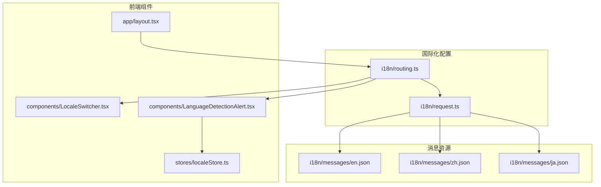
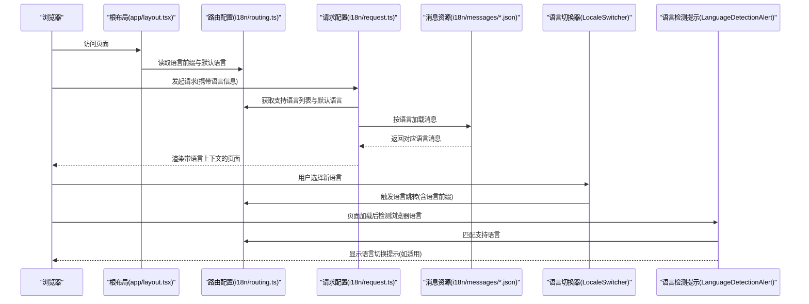
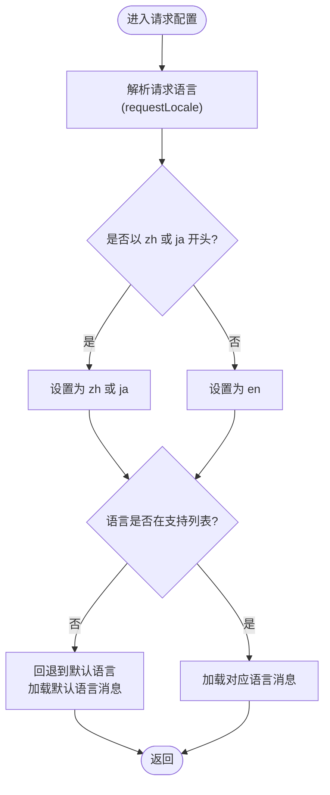
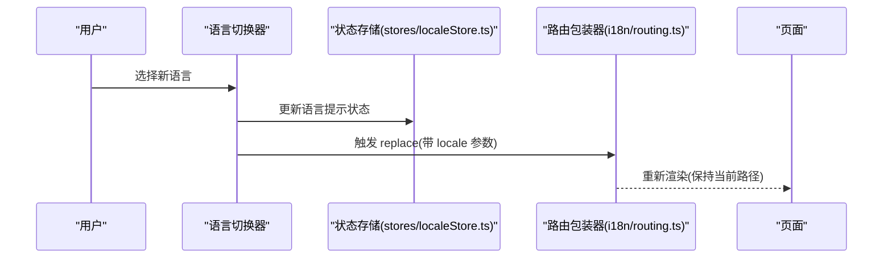
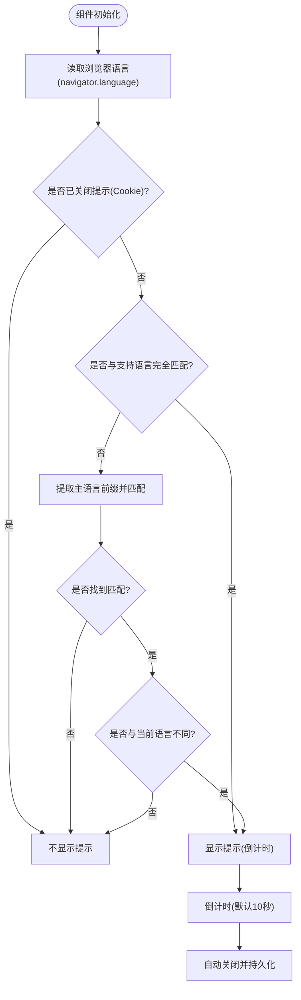
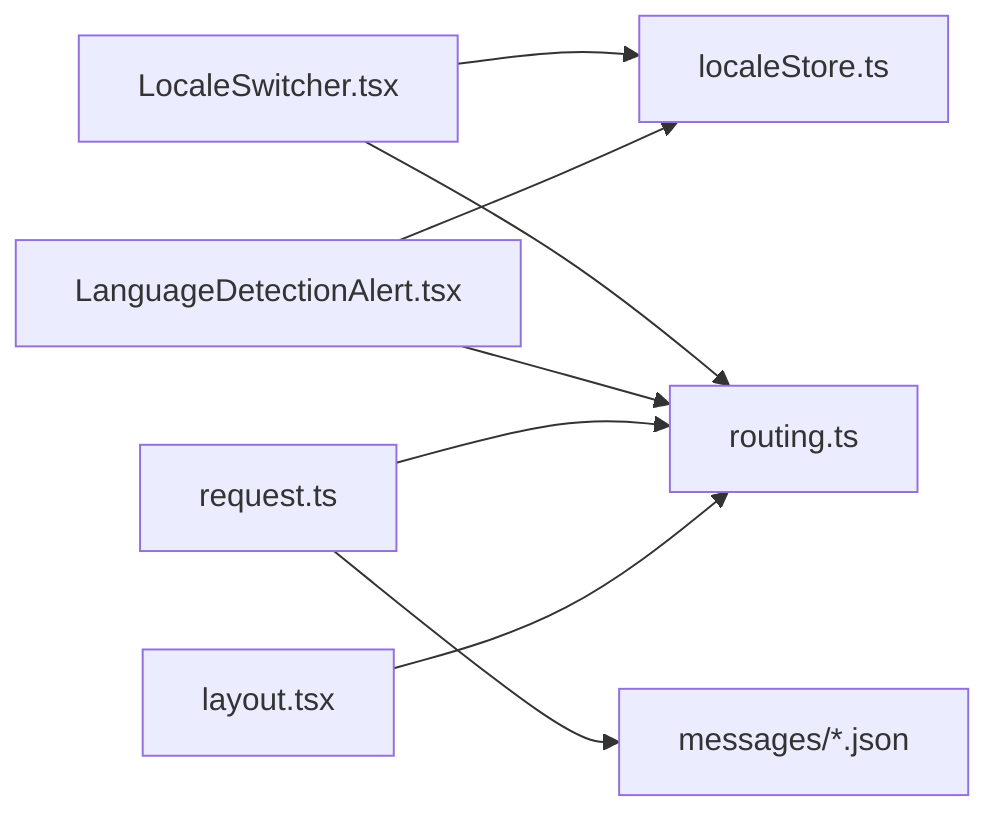

# 多语言支持

<cite>
**本文引用的文件**
- [i18n/routing.ts](file://i18n/routing.ts)
- [i18n/request.ts](file://i18n/request.ts)
- [i18n/messages/en.json](file://i18n/messages/en.json)
- [i18n/messages/zh.json](file://i18n/messages/zh.json)
- [i18n/messages/ja.json](file://i18n/messages/ja.json)
- [components/LocaleSwitcher.tsx](file://components/LocaleSwitcher.tsx)
- [components/LanguageDetectionAlert.tsx](file://components/LanguageDetectionAlert.tsx)
- [stores/localeStore.ts](file://stores/localeStore.ts)
- [app/layout.tsx](file://app/layout.tsx)
- [next.config.mjs](file://next.config.mjs)
- [package.json](file://package.json)
</cite>

## 目录
1. [简介](#简介)
2. [项目结构](#项目结构)
3. [核心组件](#核心组件)
4. [架构总览](#架构总览)
5. [详细组件分析](#详细组件分析)
6. [依赖关系分析](#依赖关系分析)
7. [性能考量](#性能考量)
8. [故障排查指南](#故障排查指南)
9. [结论](#结论)
10. [附录：新增语言支持操作手册](#附录新增语言支持操作手册)

## 简介
本项目采用 next-intl 提供的国际化方案，实现多语言内容管理与语言切换。系统支持的语言列表、默认语言、语言名称映射、语言前缀策略、自动检测机制以及语言回退策略均在统一的路由配置中集中定义与生效。前端通过语言切换器与语言检测提示组件为用户提供便捷的语言选择体验；服务端通过请求配置按需加载对应语言的消息资源，确保渲染时使用正确的语言。

## 项目结构
与多语言支持直接相关的目录与文件如下：
- i18n/routing.ts：定义支持语言数组、默认语言、语言名称映射、语言前缀与自动检测开关
- i18n/request.ts：服务端请求配置，负责根据客户端请求识别语言并加载对应消息
- i18n/messages/*.json：各语言的消息资源文件，包含界面文案、导航链接等
- components/LocaleSwitcher.tsx：语言切换器 UI 组件，基于路由配置动态生成语言选项
- components/LanguageDetectionAlert.tsx：语言检测提示组件，基于浏览器语言与路由配置进行匹配
- stores/localeStore.ts：语言检测提示的状态与持久化存储（Cookie）
- app/layout.tsx：根布局，设置 html 标签语言属性
- next.config.mjs：Next.js 构建配置（与国际化无直接耦合）
- package.json：依赖声明，包含 next-intl

图表来源
- [i18n/routing.ts](file://i18n/routing.ts#L1-L37)
- [i18n/request.ts](file://i18n/request.ts#L1-L28)
- [i18n/messages/en.json](file://i18n/messages/en.json#L1-L110)
- [i18n/messages/zh.json](file://i18n/messages/zh.json#L1-L110)
- [i18n/messages/ja.json](file://i18n/messages/ja.json#L1-L110)
- [components/LocaleSwitcher.tsx](file://components/LocaleSwitcher.tsx#L1-L72)
- [components/LanguageDetectionAlert.tsx](file://components/LanguageDetectionAlert.tsx#L1-L145)
- [stores/localeStore.ts](file://stores/localeStore.ts#L1-L22)
- [app/layout.tsx](file://app/layout.tsx#L1-L78)

章节来源
- [i18n/routing.ts](file://i18n/routing.ts#L1-L37)
- [i18n/request.ts](file://i18n/request.ts#L1-L28)
- [components/LocaleSwitcher.tsx](file://components/LocaleSwitcher.tsx#L1-L72)
- [components/LanguageDetectionAlert.tsx](file://components/LanguageDetectionAlert.tsx#L1-L145)
- [stores/localeStore.ts](file://stores/localeStore.ts#L1-L22)
- [app/layout.tsx](file://app/layout.tsx#L1-L78)

## 核心组件
- 支持语言列表（LOCALES）：集中定义可用语言代码数组
- 默认语言（DEFAULT_LOCALE）：当无法匹配或无效时使用的回退语言
- 语言名称映射（LOCALE_NAMES）：用于 UI 展示的本地化语言名称
- 路由配置（routing）：启用语言前缀策略与自动检测开关
- 请求配置（getRequestConfig）：服务端按请求语言加载对应消息资源
- 语言切换器（LocaleSwitcher）：基于路由配置生成下拉选项并触发语言跳转
- 语言检测提示（LanguageDetectionAlert）：基于浏览器语言与路由配置进行匹配与提示

章节来源
- [i18n/routing.ts](file://i18n/routing.ts#L4-L23)
- [i18n/request.ts](file://i18n/request.ts#L4-L27)
- [components/LocaleSwitcher.tsx](file://components/LocaleSwitcher.tsx#L23-L71)
- [components/LanguageDetectionAlert.tsx](file://components/LanguageDetectionAlert.tsx#L11-L72)

## 架构总览
整体流程从浏览器请求进入，服务端根据路由配置识别语言并加载对应消息；前端在页面中通过语言切换器与语言检测提示进行交互。

图表来源
- [app/layout.tsx](file://app/layout.tsx#L32-L77)
- [i18n/routing.ts](file://i18n/routing.ts#L12-L23)
- [i18n/request.ts](file://i18n/request.ts#L4-L27)
- [components/LocaleSwitcher.tsx](file://components/LocaleSwitcher.tsx#L36-L50)
- [components/LanguageDetectionAlert.tsx](file://components/LanguageDetectionAlert.tsx#L34-L72)

## 详细组件分析

### 路由配置与语言参数
- LOCALES：定义受支持的语言代码集合
- DEFAULT_LOCALE：未匹配或无效时的回退语言
- LOCALE_NAMES：UI 展示用的本地化语言名称
- localeDetection：通过环境变量控制是否启用自动语言检测
- localePrefix：语言前缀策略设为“按需”，即仅在需要区分语言时添加前缀

章节来源
- [i18n/routing.ts](file://i18n/routing.ts#L4-L23)

### 服务端请求配置
- 从请求中解析语言，对 zh、ja 做主语言归一（例如 zh-Hant 会被归一为 zh）
- 若解析结果不在支持列表内，则回退到默认语言并加载默认语言的消息
- 正常情况下返回对应语言的消息对象

图表来源
- [i18n/request.ts](file://i18n/request.ts#L4-L27)

章节来源
- [i18n/request.ts](file://i18n/request.ts#L4-L27)

### 语言切换器组件
- 基于路由配置的 locales 动态生成下拉选项
- 使用 LOCALE_NAMES 作为 UI 展示文本
- 切换时通过路由包装器触发语言跳转，保持当前路径不变

图表来源
- [components/LocaleSwitcher.tsx](file://components/LocaleSwitcher.tsx#L36-L50)
- [stores/localeStore.ts](file://stores/localeStore.ts#L11-L21)
- [i18n/routing.ts](file://i18n/routing.ts#L27-L33)

章节来源
- [components/LocaleSwitcher.tsx](file://components/LocaleSwitcher.tsx#L23-L71)
- [stores/localeStore.ts](file://stores/localeStore.ts#L1-L22)

### 语言检测提示组件
- 读取浏览器语言，先精确匹配，再按主语言前缀匹配
- 若检测到不同语言且未被用户关闭提示，则显示提示条，包含倒计时与切换按钮
- 通过 Cookie 记录用户是否已关闭提示，避免重复打扰

图表来源
- [components/LanguageDetectionAlert.tsx](file://components/LanguageDetectionAlert.tsx#L34-L72)
- [stores/localeStore.ts](file://stores/localeStore.ts#L19-L21)

章节来源
- [components/LanguageDetectionAlert.tsx](file://components/LanguageDetectionAlert.tsx#L11-L144)
- [stores/localeStore.ts](file://stores/localeStore.ts#L1-L22)

### 根布局与语言属性
- 根布局设置 html 的 lang 属性为默认语言，确保无障碍与搜索引擎友好性

章节来源
- [app/layout.tsx](file://app/layout.tsx#L38)

## 依赖关系分析
- 组件依赖
  - LocaleSwitcher 依赖路由配置与状态存储
  - LanguageDetectionAlert 依赖路由配置与状态存储
  - request.ts 依赖路由配置与消息资源
- 外部依赖
  - next-intl 提供路由、导航与请求配置能力
  - js-cookie 用于语言提示的持久化存储

图表来源
- [components/LocaleSwitcher.tsx](file://components/LocaleSwitcher.tsx#L1-L21)
- [components/LanguageDetectionAlert.tsx](file://components/LanguageDetectionAlert.tsx#L1-L21)
- [i18n/request.ts](file://i18n/request.ts#L1-L2)
- [i18n/routing.ts](file://i18n/routing.ts#L1-L2)
- [stores/localeStore.ts](file://stores/localeStore.ts#L1-L2)
- [app/layout.tsx](file://app/layout.tsx#L1-L16)

章节来源
- [package.json](file://package.json#L36-L37)

## 性能考量
- 语言检测提示仅在客户端运行，避免服务端开销
- 语言切换使用路由包装器的 replace，减少不必要的页面重建
- 消息资源按需加载，避免一次性加载全部语言包
- 语言前缀策略为“按需”，减少不必要的路径冗余

## 故障排查指南
- 语言未生效或显示默认语言
  - 检查请求配置是否正确归一浏览器语言（如 zh-Hant → zh）
  - 确认 LOCALES 中包含该语言代码
  - 确认对应语言的消息文件存在且可被动态导入
- 语言切换无效
  - 确认路由包装器 Link/redirect/useRouter 已正确使用
  - 检查 LocaleSwitcher 的 onSelectChange 是否传入有效语言代码
- 自动检测提示不出现
  - 确认环境变量 NEXT_PUBLIC_LOCALE_DETECTION 设置为 true
  - 检查浏览器语言是否与支持语言匹配（包括主语言前缀）
- 提示频繁弹出
  - 检查 Cookie 是否被清除或未正确写入
  - 确认 getLangAlertDismissed 的逻辑是否正常

章节来源
- [i18n/request.ts](file://i18n/request.ts#L8-L14)
- [i18n/routing.ts](file://i18n/routing.ts#L20)
- [components/LanguageDetectionAlert.tsx](file://components/LanguageDetectionAlert.tsx#L34-L51)
- [stores/localeStore.ts](file://stores/localeStore.ts#L19-L21)

## 结论
本项目的多语言支持通过集中式路由配置与服务端请求配置实现，具备清晰的语言列表、默认语言与名称映射，结合语言切换器与语言检测提示，为用户提供了自然的语言选择体验。语言前缀策略与自动检测机制可根据部署需求灵活开启或关闭，满足不同场景下的国际化需求。

## 附录：新增语言支持操作手册
- 步骤
  1) 在路由配置中添加语言代码到 LOCALES，并在 LOCALE_NAMES 中添加对应的 UI 名称
  2) 在消息目录新增对应语言的 JSON 文件，确保包含必要的键（如 LanguageDetection、页面模块等）
  3) 如需自动检测，确认浏览器语言主语言前缀与 LOCALES 中的代码一致（例如 zh、ja、en）
  4) 在语言切换器中验证 UI 下拉项是否出现新语言
  5) 在服务端请求配置中确认语言归一逻辑不会将新语言误判
  6) 进行端到端测试：访问页面、切换语言、检测提示行为
- 翻译文件格式要求
  - 使用 JSON 格式，顶层键建议包含 LanguageDetection 与各页面模块（如 Home、Games、Footer 等）
  - 键值为字符串或包含占位符的字符串，便于复用与本地化
- 语言代码规范
  - 使用小写字母与短横线分隔的 BCP 47 主语言子标签（如 en、zh、ja）
  - 若存在地区变体，可在服务端请求配置中做主语言归一处理
- 语言前缀
  - 当前策略为“按需”，仅在需要区分语言时添加前缀；如需全局前缀，可在路由配置中调整
- 自动检测机制
  - 通过环境变量开启/关闭；检测逻辑先精确匹配，再按主语言前缀匹配
- 回退策略
  - 当请求语言不在支持列表或无效时，回退到 DEFAULT_LOCALE 并加载默认语言消息

章节来源
- [i18n/routing.ts](file://i18n/routing.ts#L4-L10)
- [i18n/request.ts](file://i18n/request.ts#L17-L22)
- [components/LocaleSwitcher.tsx](file://components/LocaleSwitcher.tsx#L63-L67)
- [components/LanguageDetectionAlert.tsx](file://components/LanguageDetectionAlert.tsx#L34-L51)
- [i18n/messages/en.json](file://i18n/messages/en.json#L1-L110)
- [i18n/messages/zh.json](file://i18n/messages/zh.json#L1-L110)
- [i18n/messages/ja.json](file://i18n/messages/ja.json#L1-L110)