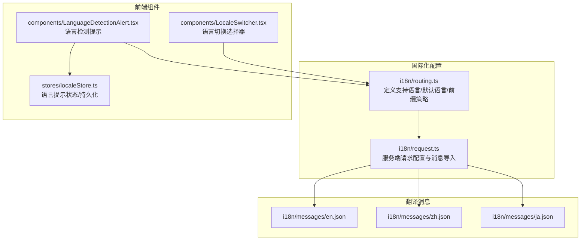
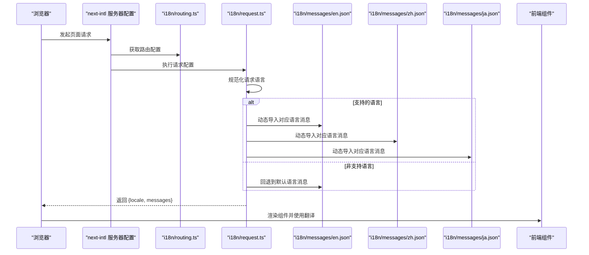
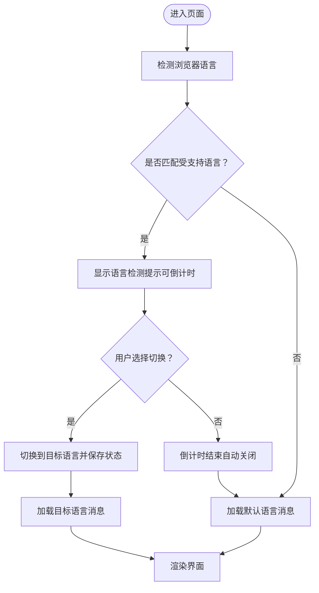
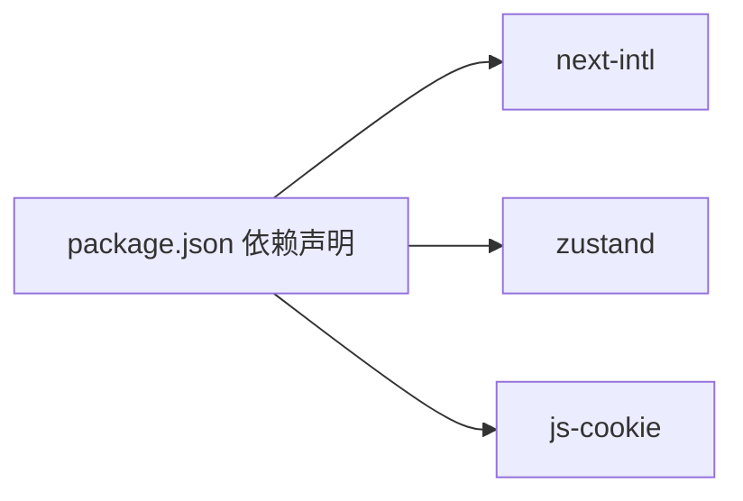

# 翻译文件管理

<cite>
**本文引用的文件**
- [i18n/messages/en.json](file://i18n/messages/en.json)
- [i18n/messages/zh.json](file://i18n/messages/zh.json)
- [i18n/messages/ja.json](file://i18n/messages/ja.json)
- [i18n/request.ts](file://i18n/request.ts)
- [i18n/routing.ts](file://i18n/routing.ts)
- [components/LocaleSwitcher.tsx](file://components/LocaleSwitcher.tsx)
- [components/LanguageDetectionAlert.tsx](file://components/LanguageDetectionAlert.tsx)
- [stores/localeStore.ts](file://stores/localeStore.ts)
- [package.json](file://package.json)
- [README.md](file://README.md)
</cite>

## 目录
1. [简介](#简介)
2. [项目结构](#项目结构)
3. [核心组件](#核心组件)
4. [架构总览](#架构总览)
5. [组件详解](#组件详解)
6. [依赖关系分析](#依赖关系分析)
7. [性能考量](#性能考量)
8. [故障排查指南](#故障排查指南)
9. [结论](#结论)
10. [附录](#附录)

## 简介
本文件系统性阐述该仓库的翻译文件管理方案，覆盖以下主题：
- 翻译文件结构与命名约定
- 消息键值对的组织方式与嵌套对象使用
- JSON 编码规范、特殊字符处理与转义规则
- 占位符替换与复数形式处理的实现思路
- 翻译文件的维护策略、批量更新方法与质量保证流程
- 缺失翻译的默认回退与缓存机制
- 版本控制、团队协作与自动化检查的最佳实践

## 项目结构
翻译系统由“路由与请求配置 + 翻译消息文件 + 前端交互组件 + 状态存储”构成，核心文件如下：
- 路由与国际化配置：i18n/routing.ts、i18n/request.ts
- 翻译消息文件：i18n/messages/{en,zh,ja}.json
- 前端交互：components/LocaleSwitcher.tsx、components/LanguageDetectionAlert.tsx
- 状态存储：stores/localeStore.ts
- 依赖声明：package.json
- 开发指引与最佳实践：README.md

图表来源
- [i18n/routing.ts](file://i18n/routing.ts#L1-L37)
- [i18n/request.ts](file://i18n/request.ts#L1-L28)
- [i18n/messages/en.json](file://i18n/messages/en.json#L1-L110)
- [i18n/messages/zh.json](file://i18n/messages/zh.json#L1-L110)
- [i18n/messages/ja.json](file://i18n/messages/ja.json#L1-L110)
- [components/LocaleSwitcher.tsx](file://components/LocaleSwitcher.tsx#L1-L72)
- [components/LanguageDetectionAlert.tsx](file://components/LanguageDetectionAlert.tsx#L1-L144)
- [stores/localeStore.ts](file://stores/localeStore.ts#L1-L22)

章节来源
- [i18n/routing.ts](file://i18n/routing.ts#L1-L37)
- [i18n/request.ts](file://i18n/request.ts#L1-L28)
- [i18n/messages/en.json](file://i18n/messages/en.json#L1-L110)
- [i18n/messages/zh.json](file://i18n/messages/zh.json#L1-L110)
- [i18n/messages/ja.json](file://i18n/messages/ja.json#L1-L110)
- [components/LocaleSwitcher.tsx](file://components/LocaleSwitcher.tsx#L1-L72)
- [components/LanguageDetectionAlert.tsx](file://components/LanguageDetectionAlert.tsx#L1-L144)
- [stores/localeStore.ts](file://stores/localeStore.ts#L1-L22)

## 核心组件
- 路由与语言配置：定义支持语言列表、默认语言、自动语言检测开关与路径前缀策略；导出导航封装以便统一处理语言切换。
- 请求配置：根据请求语言进行规范化（如 zh-HK → zh），校验是否为受支持语言，否则回退至默认语言并加载对应消息文件。
- 翻译消息文件：按语言分文件存放，采用层级命名空间组织键值，支持字符串、数组与嵌套对象，便于复用与模块化。
- 前端交互组件：语言切换器用于用户手动切换语言；语言检测提示用于基于浏览器语言给出切换建议并带倒计时。
- 状态存储：通过 Cookie 记录用户是否已忽略语言提示，避免重复打扰。

章节来源
- [i18n/routing.ts](file://i18n/routing.ts#L1-L37)
- [i18n/request.ts](file://i18n/request.ts#L1-L28)
- [i18n/messages/en.json](file://i18n/messages/en.json#L1-L110)
- [components/LocaleSwitcher.tsx](file://components/LocaleSwitcher.tsx#L1-L72)
- [components/LanguageDetectionAlert.tsx](file://components/LanguageDetectionAlert.tsx#L1-L144)
- [stores/localeStore.ts](file://stores/localeStore.ts#L1-L22)

## 架构总览
下图展示了从请求进入、语言判定、消息加载到前端渲染的整体流程。

图表来源
- [i18n/request.ts](file://i18n/request.ts#L1-L28)
- [i18n/routing.ts](file://i18n/routing.ts#L1-L37)
- [i18n/messages/en.json](file://i18n/messages/en.json#L1-L110)
- [i18n/messages/zh.json](file://i18n/messages/zh.json#L1-L110)
- [i18n/messages/ja.json](file://i18n/messages/ja.json#L1-L110)

## 组件详解

### 翻译消息文件结构与组织
- 结构格式：采用 JSON 对象，键为命名空间或具体消息键，值可以是字符串、数组或嵌套对象。
- 命名约定：使用语义化的层级命名，如“命名空间.子项.键”，便于模块化与检索。
- 嵌套对象使用：适合复用的复杂结构（如 Footer.Links.groups[i].links[j]），减少重复与提升可读性。
- 示例参考：
  - 命名空间与简单键值：见 [i18n/messages/en.json](file://i18n/messages/en.json#L1-L110)
  - 嵌套对象与数组：见 [i18n/messages/en.json](file://i18n/messages/en.json#L8-L55)

章节来源
- [i18n/messages/en.json](file://i18n/messages/en.json#L1-L110)
- [i18n/messages/zh.json](file://i18n/messages/zh.json#L1-L110)
- [i18n/messages/ja.json](file://i18n/messages/ja.json#L1-L110)

### JSON 编码规范、特殊字符处理与转义
- 编码：UTF-8，确保多语言字符正确显示。
- 字符集：支持 Unicode 字符，包括中文、日文等。
- 转义规则：遵循标准 JSON 转义，如引号、反斜杠、控制字符等需正确转义。
- 建议：避免在键名中使用空格与特殊字符；保持键名简洁且具描述性。
- 参考：各语言消息文件均采用 UTF-8 编码与标准 JSON 结构。

章节来源
- [i18n/messages/en.json](file://i18n/messages/en.json#L1-L110)
- [i18n/messages/zh.json](file://i18n/messages/zh.json#L1-L110)
- [i18n/messages/ja.json](file://i18n/messages/ja.json#L1-L110)

### 占位符替换与复数形式处理
- 占位符替换：消息文本中使用占位符（如 {year}、{name}、{countdown}），在渲染时传入参数完成替换。
  - 示例位置：Copyright 文案、倒计时文案等。
- 复数形式处理：当前仓库未引入专门的复数规则库，可在业务层根据数值判断选择不同键或在调用处拼接逻辑。
- 建议：若未来需要更复杂的复数与性别规则，可引入相应 i18n 库并在消息文件中按库规范组织键值。

章节来源
- [i18n/messages/en.json](file://i18n/messages/en.json#L16-L18)
- [i18n/messages/en.json](file://i18n/messages/en.json#L4-L6)
- [i18n/messages/zh.json](file://i18n/messages/zh.json#L16-L18)
- [i18n/messages/zh.json](file://i18n/messages/zh.json#L4-L6)
- [i18n/messages/ja.json](file://i18n/messages/ja.json#L16-L18)
- [i18n/messages/ja.json](file://i18n/messages/ja.json#L4-L6)

### 语言检测与切换流程
- 语言检测：基于浏览器语言（navigator.language）与路由配置匹配，支持主语言前缀匹配（如 zh → zh）。
- 切换流程：用户通过语言切换器选择目标语言，触发路由跳转并携带 locale 参数。
- 提示与回退：若检测到不一致的语言，弹出提示并倒计时自动关闭；用户可手动忽略或切换。

图表来源
- [components/LanguageDetectionAlert.tsx](file://components/LanguageDetectionAlert.tsx#L1-L144)
- [components/LocaleSwitcher.tsx](file://components/LocaleSwitcher.tsx#L1-L72)
- [stores/localeStore.ts](file://stores/localeStore.ts#L1-L22)
- [i18n/request.ts](file://i18n/request.ts#L1-L28)

章节来源
- [components/LanguageDetectionAlert.tsx](file://components/LanguageDetectionAlert.tsx#L1-L144)
- [components/LocaleSwitcher.tsx](file://components/LocaleSwitcher.tsx#L1-L72)
- [stores/localeStore.ts](file://stores/localeStore.ts#L1-L22)
- [i18n/request.ts](file://i18n/request.ts#L1-L28)

### 缺失翻译、默认回退与缓存机制
- 默认回退：当请求语言不在受支持列表时，回退到默认语言并加载默认语言的消息文件。
- 缓存机制：当前实现为按需动态导入消息文件；生产环境可通过构建期预打包或 CDN 缓存优化加载性能。
- 建议：在构建阶段预加载常用语言包，减少首屏延迟；对不常访问的语言采用懒加载策略。

章节来源
- [i18n/request.ts](file://i18n/request.ts#L16-L27)

### 维护策略、批量更新与质量保证
- 维护策略：统一在 i18n/messages 下新增/修改语言文件；路由配置中同步更新支持语言列表。
- 批量更新：通过工具对比键集合差异，自动生成缺失键或迁移旧键；结合 ESLint/TypeScript 类型检查降低错误。
- 质量保证：在 CI 中执行 JSON 语法检查与键一致性校验；对关键文案进行 A/B 测试或本地化回归测试。

章节来源
- [README.md](file://README.md#L222-L238)
- [i18n/routing.ts](file://i18n/routing.ts#L4-L10)

### 版本控制、团队协作与自动化检查
- 版本控制：将翻译文件纳入版本库，使用分支/PR 审查；为每种语言建立独立变更路径。
- 团队协作：约定命名空间与键命名规范；使用共享的术语表与样式指南。
- 自动化检查：在 CI 中添加 JSON 校验、键一致性检查与类型推断检查；对新增/删除键进行告警。

章节来源
- [README.md](file://README.md#L222-L238)
- [package.json](file://package.json#L1-L65)

## 依赖关系分析
- 依赖库：next-intl 提供国际化路由与请求配置能力；zustand 用于轻量状态管理；js-cookie 用于持久化用户偏好。
- 组件耦合：前端组件仅依赖路由配置与状态存储，与消息文件解耦，便于扩展与维护。
- 外部集成：语言检测依赖浏览器 navigator.language；语言切换依赖路由封装。

图表来源
- [package.json](file://package.json#L16-L51)

章节来源
- [package.json](file://package.json#L1-L65)

## 性能考量
- 动态导入：按需加载语言包，减少初始包体积；对高频语言可考虑预加载。
- 缓存策略：利用浏览器缓存与 CDN 加速；对静态内容启用长缓存。
- 渲染优化：避免在渲染路径中频繁切换语言；使用稳定键名减少重绘。

## 故障排查指南
- 语言不生效：确认路由配置中的支持语言列表与请求配置中的回退逻辑；检查环境变量是否开启语言检测。
- 键缺失：在对应语言文件中补充缺失键；或在调用处提供默认值。
- 乱码问题：确保文件保存为 UTF-8；检查构建与部署环境的字符集设置。
- 语言提示不出现：检查浏览器语言与路由配置；确认 Cookie 是否阻止提示显示。

章节来源
- [i18n/routing.ts](file://i18n/routing.ts#L19-L22)
- [i18n/request.ts](file://i18n/request.ts#L16-L22)
- [stores/localeStore.ts](file://stores/localeStore.ts#L14-L21)

## 结论
该翻译系统以 next-intl 为核心，采用 JSON 消息文件与路由配置实现多语言支持。通过清晰的命名空间组织、动态导入与默认回退机制，兼顾易维护性与性能。建议在后续迭代中引入更强的复数与性别规则支持、构建期预加载与自动化校验，以进一步提升可维护性与用户体验。

## 附录
- 开发最佳实践与新增语言步骤详见项目文档指引。

章节来源
- [README.md](file://README.md#L222-L238)