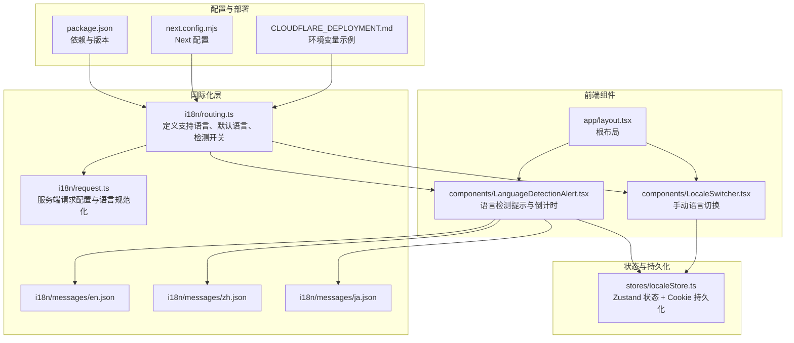
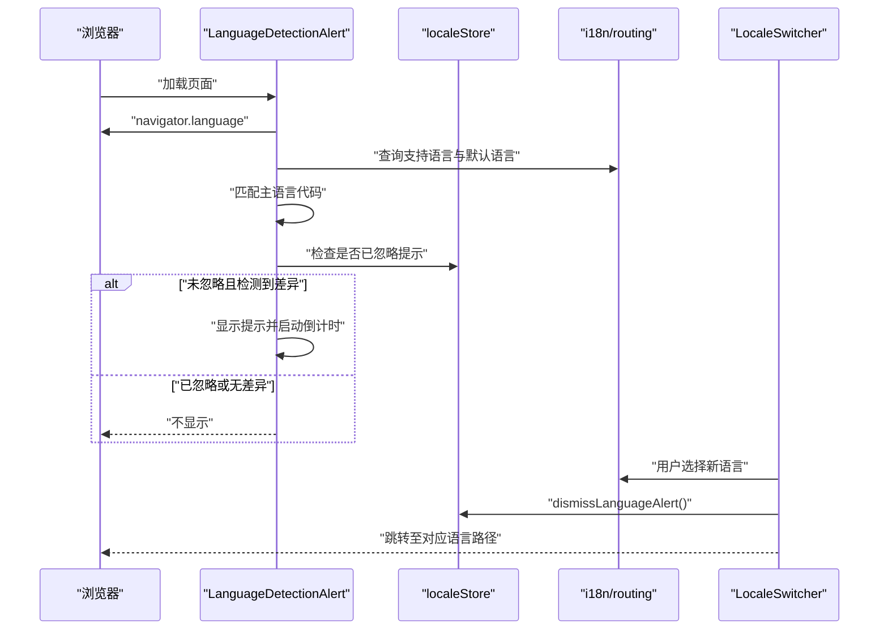
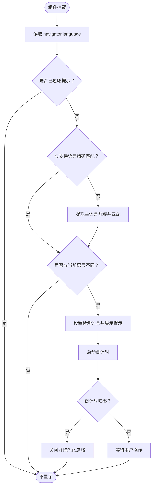
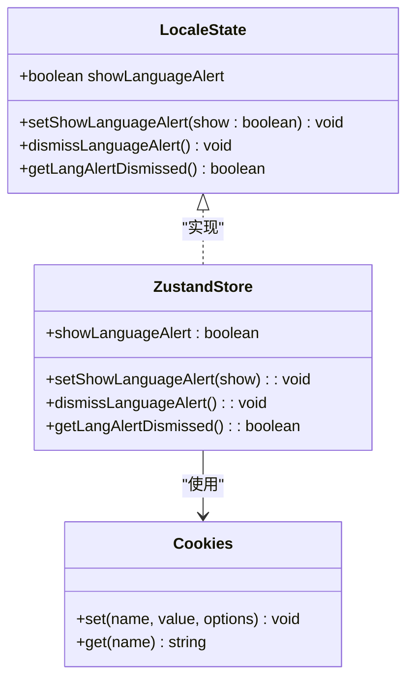
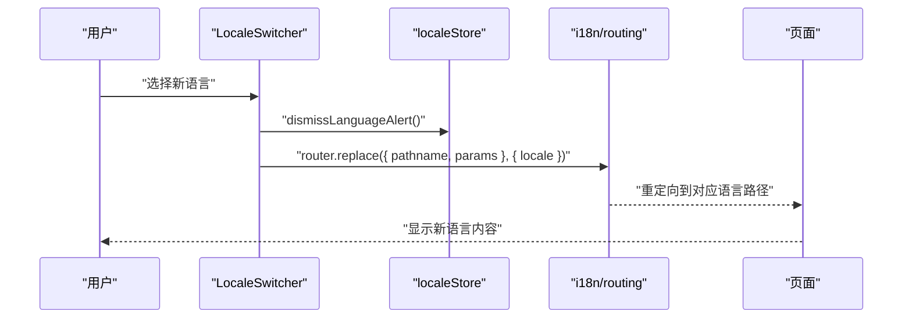
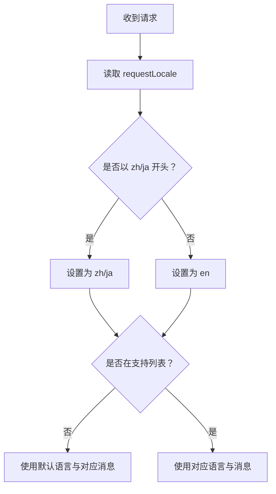
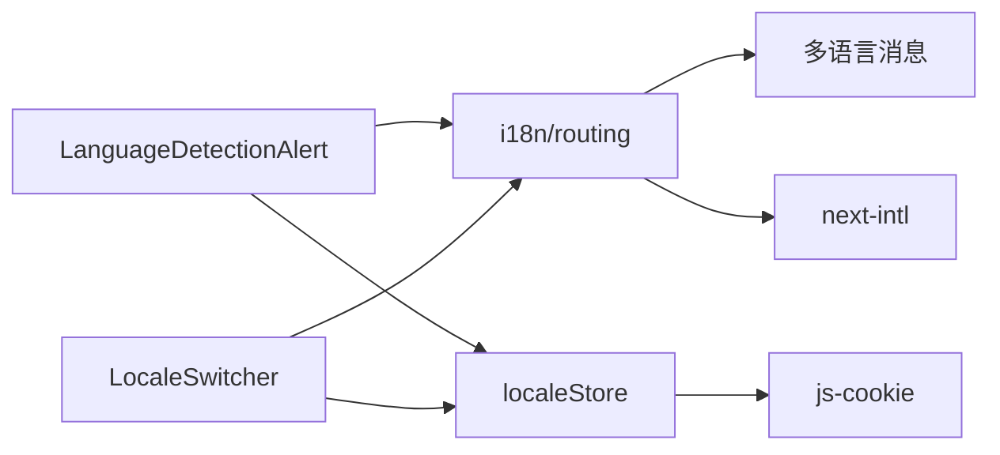

# 语言检测机制

<cite>
**本文引用的文件**
- [components/LanguageDetectionAlert.tsx](file://components/LanguageDetectionAlert.tsx)
- [stores/localeStore.ts](file://stores/localeStore.ts)
- [i18n/routing.ts](file://i18n/routing.ts)
- [i18n/request.ts](file://i18n/request.ts)
- [components/LocaleSwitcher.tsx](file://components/LocaleSwitcher.tsx)
- [i18n/messages/en.json](file://i18n/messages/en.json)
- [i18n/messages/zh.json](file://i18n/messages/zh.json)
- [i18n/messages/ja.json](file://i18n/messages/ja.json)
- [app/layout.tsx](file://app/layout.tsx)
- [CLOUDFLARE_DEPLOYMENT.md](file://CLOUDFLARE_DEPLOYMENT.md)
- [package.json](file://package.json)
- [next.config.mjs](file://next.config.mjs)
</cite>

## 目录
1. [简介](#简介)
2. [项目结构](#项目结构)
3. [核心组件](#核心组件)
4. [架构总览](#架构总览)
5. [详细组件分析](#详细组件分析)
6. [依赖关系分析](#依赖关系分析)
7. [性能考虑](#性能考虑)
8. [故障排除指南](#故障排除指南)
9. [结论](#结论)
10. [附录](#附录)

## 简介
本文件系统性阐述该仓库的语言检测机制，包括自动语言检测的工作原理、浏览器语言偏好设置的读取与匹配策略、用户偏好的保存与跨页面同步、LanguageDetectionAlert 组件的实现逻辑与交互流程、localeStore 的状态管理与持久化策略，以及配置项、隐私保护、错误处理与用户体验设计。同时提供检测精度优化建议与多语言环境兼容性处理方案。

## 项目结构
围绕语言检测的关键文件组织如下：
- i18n 层：路由配置、请求配置与多语言消息
- 前端组件：语言检测提示弹窗与语言切换器
- 状态管理：Zustand + Cookie 的轻量状态与持久化
- 部署与配置：环境变量控制语言检测开关

**图表来源**
- [i18n/routing.ts](file://i18n/routing.ts#L1-L37)
- [i18n/request.ts](file://i18n/request.ts#L1-L28)
- [components/LanguageDetectionAlert.tsx](file://components/LanguageDetectionAlert.tsx#L1-L145)
- [components/LocaleSwitcher.tsx](file://components/LocaleSwitcher.tsx#L1-L72)
- [stores/localeStore.ts](file://stores/localeStore.ts#L1-L22)
- [app/layout.tsx](file://app/layout.tsx#L1-L78)
- [package.json](file://package.json#L1-L65)
- [next.config.mjs](file://next.config.mjs#L1-L28)
- [CLOUDFLARE_DEPLOYMENT.md](file://CLOUDFLARE_DEPLOYMENT.md#L220-L228)

**章节来源**
- [i18n/routing.ts](file://i18n/routing.ts#L1-L37)
- [i18n/request.ts](file://i18n/request.ts#L1-L28)
- [components/LanguageDetectionAlert.tsx](file://components/LanguageDetectionAlert.tsx#L1-L145)
- [components/LocaleSwitcher.tsx](file://components/LocaleSwitcher.tsx#L1-L72)
- [stores/localeStore.ts](file://stores/localeStore.ts#L1-L22)
- [app/layout.tsx](file://app/layout.tsx#L1-L78)
- [package.json](file://package.json#L1-L65)
- [next.config.mjs](file://next.config.mjs#L1-L28)
- [CLOUDFLARE_DEPLOYMENT.md](file://CLOUDFLARE_DEPLOYMENT.md#L220-L228)

## 核心组件
- LanguageDetectionAlert：基于浏览器 navigator.language 自动检测并提示切换语言，内置 10 秒倒计时与用户手动确认流程。
- localeStore：Zustand 状态管理，负责“是否显示语言提示”和“提示是否已被用户忽略”的持久化（Cookie）。
- LocaleSwitcher：手动语言切换入口，触发语言变更并同步关闭语言提示。
- i18n/routing：定义支持语言、默认语言、检测开关与导航封装；request.ts 负责服务端请求时的语言规范化。
- 多语言消息：按语言加载 LanguageDetection 对应文案，确保提示内容与目标语言一致。

**章节来源**
- [components/LanguageDetectionAlert.tsx](file://components/LanguageDetectionAlert.tsx#L1-L145)
- [stores/localeStore.ts](file://stores/localeStore.ts#L1-L22)
- [components/LocaleSwitcher.tsx](file://components/LocaleSwitcher.tsx#L1-L72)
- [i18n/routing.ts](file://i18n/routing.ts#L1-L37)
- [i18n/request.ts](file://i18n/request.ts#L1-L28)
- [i18n/messages/en.json](file://i18n/messages/en.json#L1-L110)
- [i18n/messages/zh.json](file://i18n/messages/zh.json#L1-L110)
- [i18n/messages/ja.json](file://i18n/messages/ja.json#L1-L110)

## 架构总览
语言检测的整体流程从浏览器侧读取语言偏好，与支持语言集合进行匹配，若发现差异且未被用户忽略，则显示提示弹窗；用户可立即切换或等待倒计时自动关闭；切换动作会同步关闭提示并持久化用户选择。

**图表来源**
- [components/LanguageDetectionAlert.tsx](file://components/LanguageDetectionAlert.tsx#L34-L72)
- [stores/localeStore.ts](file://stores/localeStore.ts#L14-L21)
- [i18n/routing.ts](file://i18n/routing.ts#L12-L23)
- [components/LocaleSwitcher.tsx](file://components/LocaleSwitcher.tsx#L36-L50)

## 详细组件分析

### LanguageDetectionAlert 组件
- 工作原理
  - 读取浏览器语言：使用 navigator.language 获取完整语言标签（如 zh-HK），并与支持语言列表进行精确匹配；若不匹配则提取主语言前缀（如 zh）再次匹配。
  - 条件显示：仅当检测到不同语言且当前语言不等于检测语言、且用户未忽略提示时才显示。
  - 倒计时与动画：显示后延迟短暂时间触发展示动画；倒计时归零自动关闭并调用 dismissLanguageAlert。
- 检测结果展示
  - 动态加载目标语言的消息文件，读取 LanguageDetection 字段渲染标题、描述与按钮文案。
  - 提供“切换到目标语言”的 I18nLink，点击即完成语言切换并关闭提示。
- 用户确认流程
  - 关闭按钮：用户可随时手动关闭提示，关闭后通过 Cookie 记录忽略状态。
  - 自动关闭：倒计时结束自动关闭并持久化忽略状态。

**图表来源**
- [components/LanguageDetectionAlert.tsx](file://components/LanguageDetectionAlert.tsx#L34-L72)

**章节来源**
- [components/LanguageDetectionAlert.tsx](file://components/LanguageDetectionAlert.tsx#L1-L145)
- [i18n/messages/en.json](file://i18n/messages/en.json#L2-L7)
- [i18n/messages/zh.json](file://i18n/messages/zh.json#L2-L7)
- [i18n/messages/ja.json](file://i18n/messages/ja.json#L2-L7)

### localeStore 状态管理与持久化
- 状态字段
  - showLanguageAlert：控制语言提示是否显示
  - setShowLanguageAlert：设置显示状态
  - dismissLanguageAlert：关闭提示并写入 Cookie（30 天过期）
  - getLangAlertDismissed：读取 Cookie 判断是否忽略
- 持久化策略
  - 使用 js-cookie 存储 langAlertDismissed=true，避免刷新或跨页面重复提示。
- 跨页面同步
  - 由于 Cookie 具备域名级共享能力，可在同域下跨页面共享忽略状态，保证一致性。

**图表来源**
- [stores/localeStore.ts](file://stores/localeStore.ts#L4-L22)

**章节来源**
- [stores/localeStore.ts](file://stores/localeStore.ts#L1-L22)

### LocaleSwitcher 手动语言选择
- 行为逻辑
  - 读取当前语言与路由配置，渲染支持语言下拉框。
  - 用户选择后，调用 router.replace 并携带 locale 参数，实现语言切换。
  - 切换时同步调用 dismissLanguageAlert，确保提示不再出现。
- 与 LanguageDetectionAlert 的协作
  - 二者均依赖 localeStore 的 dismissLanguageAlert，保证用户主动选择后不再提示。

**图表来源**
- [components/LocaleSwitcher.tsx](file://components/LocaleSwitcher.tsx#L36-L50)
- [stores/localeStore.ts](file://stores/localeStore.ts#L14-L18)
- [i18n/routing.ts](file://i18n/routing.ts#L27-L33)

**章节来源**
- [components/LocaleSwitcher.tsx](file://components/LocaleSwitcher.tsx#L1-L72)
- [stores/localeStore.ts](file://stores/localeStore.ts#L1-L22)
- [i18n/routing.ts](file://i18n/routing.ts#L1-L37)

### i18n/routing 与 i18n/request
- 路由配置
  - 定义支持语言数组、默认语言、是否启用自动语言检测（受环境变量控制）、语言前缀策略等。
- 请求配置
  - 服务端根据 requestLocale 归一化语言（如 zh-CN、zh-HK 归一为 zh），确保只使用受支持的语言集。

**图表来源**
- [i18n/request.ts](file://i18n/request.ts#L4-L27)
- [i18n/routing.ts](file://i18n/routing.ts#L4-L10)

**章节来源**
- [i18n/routing.ts](file://i18n/routing.ts#L1-L37)
- [i18n/request.ts](file://i18n/request.ts#L1-L28)

## 依赖关系分析
- 组件耦合
  - LanguageDetectionAlert 依赖 i18n/routing 的 locales 与 LOCALE_NAMES，依赖 localeStore 的状态与持久化。
  - LocaleSwitcher 依赖 i18n/routing 的 Link/redirect/router 封装与路由配置。
- 外部依赖
  - js-cookie：用于持久化忽略状态。
  - next-intl：提供路由、导航与国际化能力。
- 环境变量
  - NEXT_PUBLIC_LOCALE_DETECTION 控制是否启用自动语言检测（客户端）。

**图表来源**
- [components/LanguageDetectionAlert.tsx](file://components/LanguageDetectionAlert.tsx#L4-L6)
- [components/LocaleSwitcher.tsx](file://components/LocaleSwitcher.tsx#L10-L16)
- [stores/localeStore.ts](file://stores/localeStore.ts#L1)
- [i18n/routing.ts](file://i18n/routing.ts#L1-L37)
- [package.json](file://package.json#L36-L41)

**章节来源**
- [components/LanguageDetectionAlert.tsx](file://components/LanguageDetectionAlert.tsx#L1-L145)
- [components/LocaleSwitcher.tsx](file://components/LocaleSwitcher.tsx#L1-L72)
- [stores/localeStore.ts](file://stores/localeStore.ts#L1-L22)
- [i18n/routing.ts](file://i18n/routing.ts#L1-L37)
- [package.json](file://package.json#L16-L51)

## 性能考虑
- 客户端检测成本低：仅读取 navigator.language 与一次数组匹配，开销极小。
- 倒计时使用 setInterval：建议在组件卸载时清理定时器，避免内存泄漏（当前实现已在清理函数中处理）。
- 消息动态加载：按需加载目标语言的 LanguageDetection 段，避免一次性加载全部消息。
- Cookie 写入：仅在用户关闭提示或手动切换时写入，频率较低。
- 服务端语言规范化：仅在 SSR 场景生效，避免对 CSR 页面造成额外负担。

[本节为通用性能建议，无需特定文件引用]

## 故障排除指南
- 为什么没有显示语言提示？
  - 可能已忽略提示：Cookie langAlertDismissed=true 会阻止再次显示。
  - 浏览器语言与支持语言完全一致：不会触发提示。
  - 环境变量关闭了自动检测：NEXT_PUBLIC_LOCALE_DETECTION=false。
- 如何强制重新显示提示？
  - 清除 Cookie langAlertDismissed 或在开发环境下临时关闭忽略逻辑。
- 服务端语言不正确？
  - 检查 request.ts 的语言归一化逻辑与支持列表是否匹配。
- 切换语言无效？
  - 确认 LocaleSwitcher 的 router.replace 调用与路由配置一致，且 locales 包含所选语言。

**章节来源**
- [stores/localeStore.ts](file://stores/localeStore.ts#L14-L21)
- [i18n/routing.ts](file://i18n/routing.ts#L19-L23)
- [i18n/request.ts](file://i18n/request.ts#L8-L14)
- [components/LocaleSwitcher.tsx](file://components/LocaleSwitcher.tsx#L40-L49)

## 结论
该语言检测机制通过浏览器语言读取与支持语言匹配，在用户未忽略的前提下提供简洁的切换提示；结合 Zustand + Cookie 的状态管理，实现了跨页面的一致体验。配合 i18n/routing 与 request.ts 的配置，既保证了客户端的即时反馈，也确保了服务端渲染的稳定性。通过合理的配置项与隐私保护策略（仅使用浏览器语言信息、无第三方追踪），在提升用户体验的同时兼顾了数据最小化原则。

[本节为总结性内容，无需特定文件引用]

## 附录

### 配置选项与环境变量
- NEXT_PUBLIC_LOCALE_DETECTION：控制是否启用自动语言检测（true/false）。部署文档中示例值为 false。
- LOCALES：支持的语言列表（en、zh、ja）。
- DEFAULT_LOCALE：默认语言。
- LOCALE_NAMES：语言名称映射，用于 UI 显示。

**章节来源**
- [CLOUDFLARE_DEPLOYMENT.md](file://CLOUDFLARE_DEPLOYMENT.md#L222-L223)
- [i18n/routing.ts](file://i18n/routing.ts#L4-L10)

### 检测精度优化建议
- 多层级匹配：优先完整语言标签，其次主语言前缀，最后回退到默认语言。
- 用户行为学习：在忽略提示一定次数后，延长忽略周期或改为更温和的提示形式。
- 语言区域细化：针对 zh-HK、zh-TW 等变体，可考虑进一步细分匹配策略。
- 服务端与客户端协同：在 SSR 期间即完成语言选择，减少客户端闪烁。

[本节为通用优化建议，无需特定文件引用]

### 用户隐私保护措施
- 仅使用浏览器 navigator.language，不收集其他设备或网络信息。
- 忽略状态存储于 Cookie，无上传行为。
- 语言切换为本地操作，不涉及第三方统计或追踪。

[本节为通用隐私建议，无需特定文件引用]

### 多语言环境兼容性
- 消息文件按语言拆分，LanguageDetection 段独立维护，便于扩展与翻译。
- 服务端请求配置统一归一化语言，避免因区域变体导致的匹配失败。
- UI 组件通过 LOCALE_NAMES 与路由配置联动，确保显示与跳转一致。

**章节来源**
- [i18n/messages/en.json](file://i18n/messages/en.json#L2-L7)
- [i18n/messages/zh.json](file://i18n/messages/zh.json#L2-L7)
- [i18n/messages/ja.json](file://i18n/messages/ja.json#L2-L7)
- [i18n/request.ts](file://i18n/request.ts#L8-L14)
- [i18n/routing.ts](file://i18n/routing.ts#L6-L10)