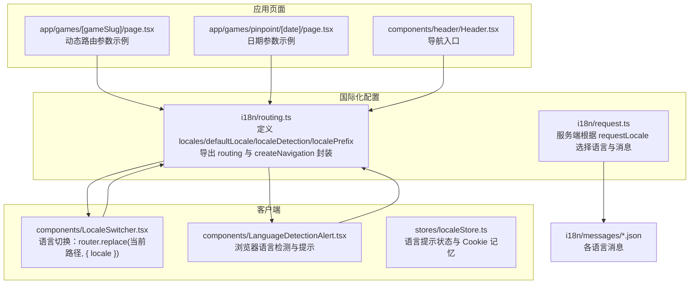
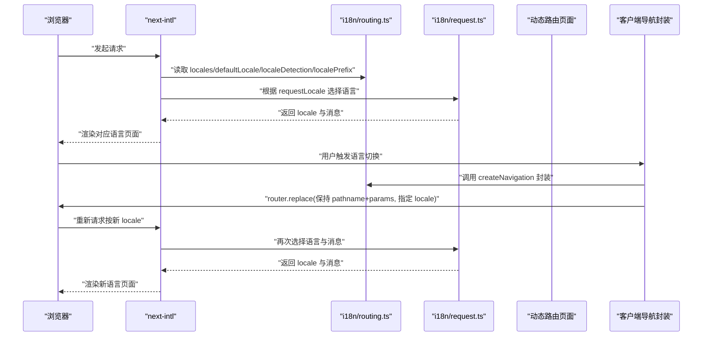
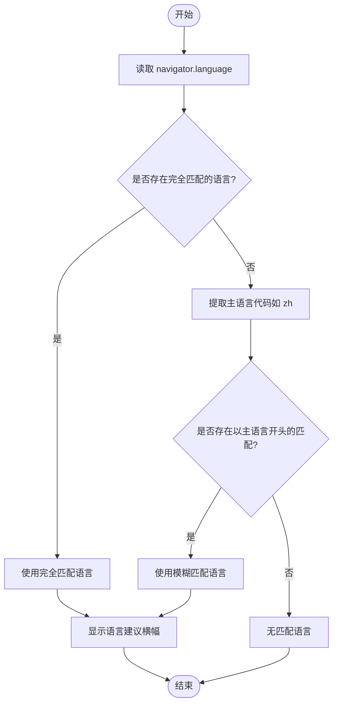
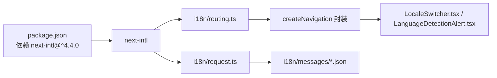

# 路由国际化

<cite>
**本文引用的文件**
- [i18n/routing.ts](file://i18n/routing.ts)
- [i18n/request.ts](file://i18n/request.ts)
- [components/LocaleSwitcher.tsx](file://components/LocaleSwitcher.tsx)
- [components/LanguageDetectionAlert.tsx](file://components/LanguageDetectionAlert.tsx)
- [stores/localeStore.ts](file://stores/localeStore.ts)
- [app/games/[gameSlug]/page.tsx](file://app/games/[gameSlug]/page.tsx)
- [app/games/pinpoint/[date]/page.tsx](file://app/games/pinpoint/[date]/page.tsx)
- [components/header/Header.tsx](file://components/header/Header.tsx)
- [i18n/messages/en.json](file://i18n/messages/en.json)
- [next.config.mjs](file://next.config.mjs)
- [package.json](file://package.json)
</cite>

## 目录
1. [简介](#简介)
2. [项目结构](#项目结构)
3. [核心组件](#核心组件)
4. [架构总览](#架构总览)
5. [详细组件分析](#详细组件分析)
6. [依赖关系分析](#依赖关系分析)
7. [性能考量](#性能考量)
8. [故障排查指南](#故障排查指南)
9. [结论](#结论)
10. [附录](#附录)

## 简介
本文件系统性阐述该项目的路由国际化实现，围绕以下主题展开：defineRouting 的配置项（locales、defaultLocale、localeDetection、localePrefix）、自动语言检测机制、路由前缀策略、Link 组件与 redirect 函数的国际化封装、usePathname 与 useRouter 的使用方式、国际化导航与路径处理最佳实践、动态路由参数的国际化处理、多语言页面的路由配置、语言切换时的路由保持策略、无匹配语言时的回退机制以及语言前缀的生成规则。

## 项目结构
本项目采用 next-intl 提供的国际化路由能力，核心位于 i18n/routing.ts 中定义路由配置，并通过 createNavigation 包装 Next.js 导航 API，形成统一的国际化导航层。客户端组件通过 LocaleSwitcher.tsx 与 LanguageDetectionAlert.tsx 实现语言切换与检测提示；服务端通过 i18n/request.ts 根据请求语言选择对应消息与回退策略；动态路由页面在 app/games 下演示了带参数的国际化路径处理。

图表来源
- [i18n/routing.ts](file://i18n/routing.ts#L1-L37)
- [i18n/request.ts](file://i18n/request.ts#L1-L28)
- [components/LocaleSwitcher.tsx](file://components/LocaleSwitcher.tsx#L1-L72)
- [components/LanguageDetectionAlert.tsx](file://components/LanguageDetectionAlert.tsx#L1-L145)
- [stores/localeStore.ts](file://stores/localeStore.ts#L1-L22)
- [app/games/[gameSlug]/page.tsx](file://app/games/[gameSlug]/page.tsx#L1-L115)
- [app/games/pinpoint/[date]/page.tsx](file://app/games/pinpoint/[date]/page.tsx#L1-L90)
- [components/header/Header.tsx](file://components/header/Header.tsx#L1-L45)
- [i18n/messages/en.json](file://i18n/messages/en.json#L1-L110)

章节来源
- [i18n/routing.ts](file://i18n/routing.ts#L1-L37)
- [i18n/request.ts](file://i18n/request.ts#L1-L28)
- [components/LocaleSwitcher.tsx](file://components/LocaleSwitcher.tsx#L1-L72)
- [components/LanguageDetectionAlert.tsx](file://components/LanguageDetectionAlert.tsx#L1-L145)
- [stores/localeStore.ts](file://stores/localeStore.ts#L1-L22)
- [app/games/[gameSlug]/page.tsx](file://app/games/[gameSlug]/page.tsx#L1-L115)
- [app/games/pinpoint/[date]/page.tsx](file://app/games/pinpoint/[date]/page.tsx#L1-L90)
- [components/header/Header.tsx](file://components/header/Header.tsx#L1-L45)
- [i18n/messages/en.json](file://i18n/messages/en.json#L1-L110)

## 核心组件
- defineRouting 配置
  - locales：支持的语言列表
  - defaultLocale：未匹配时的默认语言
  - localeDetection：是否启用自动语言检测（受环境变量控制）
  - localePrefix：语言前缀策略为“按需添加”
- createNavigation 封装
  - Link、redirect、usePathname、useRouter、getPathname 均考虑 routing 配置
- 服务端请求配置
  - getRequestConfig 根据 requestLocale 选择语言，并进行回退与消息加载
- 客户端语言切换
  - LocaleSwitcher 使用 router.replace 保持当前路径与参数，仅变更 locale
- 浏览器语言检测
  - LanguageDetectionAlert 基于 navigator.language 进行匹配与倒计时提示
- 存储与记忆
  - localeStore 使用 Cookie 记住用户关闭提示的状态

章节来源
- [i18n/routing.ts](file://i18n/routing.ts#L4-L33)
- [i18n/request.ts](file://i18n/request.ts#L4-L27)
- [components/LocaleSwitcher.tsx](file://components/LocaleSwitcher.tsx#L23-L50)
- [components/LanguageDetectionAlert.tsx](file://components/LanguageDetectionAlert.tsx#L11-L72)
- [stores/localeStore.ts](file://stores/localeStore.ts#L11-L22)

## 架构总览
下图展示从浏览器请求到页面渲染、再到语言切换与导航的整体流程，体现国际化路由的关键节点与数据流。

图表来源
- [i18n/routing.ts](file://i18n/routing.ts#L12-L33)
- [i18n/request.ts](file://i18n/request.ts#L4-L27)
- [components/LocaleSwitcher.tsx](file://components/LocaleSwitcher.tsx#L36-L49)

## 详细组件分析

### defineRouting 配置详解
- locales：支持的语言集合
- defaultLocale：当无法识别或不匹配时使用的默认语言
- localeDetection：是否启用自动语言检测，受 NEXT_PUBLIC_LOCALE_DETECTION 控制
- localePrefix：语言前缀策略为“按需添加”，即仅在需要区分语言时才添加前缀，避免重复前缀

章节来源
- [i18n/routing.ts](file://i18n/routing.ts#L4-L23)

### 自动语言检测机制
- 浏览器侧检测
  - 通过 navigator.language 获取完整语言代码（如 zh-HK），先尝试精确匹配，再以主语言代码（如 zh）进行模糊匹配
  - 若检测到支持语言且与当前语言不同，则显示语言建议横幅并倒计时关闭
- 服务端回退
  - getRequestConfig 对 requestLocale 进行规范化（如 zh-HK → zh），若不在支持列表则回退至 defaultLocale 并加载默认语言消息

图表来源
- [components/LanguageDetectionAlert.tsx](file://components/LanguageDetectionAlert.tsx#L34-L52)

章节来源
- [components/LanguageDetectionAlert.tsx](file://components/LanguageDetectionAlert.tsx#L11-L72)
- [i18n/request.ts](file://i18n/request.ts#L8-L14)

### 路由前缀策略（localePrefix）
- 当前策略为“按需添加”（as-needed），意味着：
  - 在默认语言或与默认语言一致时，URL 不强制带语言前缀
  - 在非默认语言访问时，URL 会自动带上语言前缀以区分语言
- 这种策略有助于保持默认语言 URL 的简洁性，同时确保多语言场景下的可区分性

章节来源
- [i18n/routing.ts](file://i18n/routing.ts#L22-L23)

### Link 组件、redirect 函数、usePathname 与 useRouter 的国际化封装
- Link：基于国际化配置生成正确语言前缀的链接
- redirect：在服务端重定向时遵循 routing 配置，确保目标路径带有正确的语言前缀
- usePathname：返回当前语言上下文下的路径名（去除语言前缀或按需保留）
- useRouter：提供 replace 等方法，结合 params 与 locale 实现语言切换时的路径保持
- getPathname：用于获取当前语言上下文下的路径名

章节来源
- [i18n/routing.ts](file://i18n/routing.ts#L27-L33)

### 国际化导航与路径处理最佳实践
- 语言切换时保持当前路径与参数
  - 使用 router.replace 传入 { pathname, params } 与 { locale }，确保跳转后仍停留在同一页面
- 动态路由参数的国际化处理
  - params 由 Next.js 提供，国际化封装会将其与 pathname 一起保留，仅替换 locale
- 导航入口
  - Header 中的链接可直接使用国际化 Link 或相对路径，由 routing 自动处理语言前缀

章节来源
- [components/LocaleSwitcher.tsx](file://components/LocaleSwitcher.tsx#L36-L49)
- [components/header/Header.tsx](file://components/header/Header.tsx#L12-L26)

### 动态路由参数的国际化处理
- 游戏 slug 示例
  - 页面通过 generateStaticParams 生成静态参数，国际化路由会自动为每个 slug 添加语言前缀
- 日期参数示例
  - 日期型参数同样受国际化路由影响，URL 会按需添加语言前缀
- 参数一致性
  - 切换语言时，params 会被保留，仅语言前缀变化，保证用户在同一页内切换语言

章节来源
- [app/games/[gameSlug]/page.tsx](file://app/games/[gameSlug]/page.tsx#L14-L19)
- [app/games/pinpoint/[date]/page.tsx](file://app/games/pinpoint/[date]/page.tsx#L14-L17)

### 多语言页面的路由配置
- 支持语言：en、zh、ja
- 默认语言：en
- 语言名称映射：用于 UI 展示（如下拉框中的语言名称）
- 语言检测开关：通过环境变量控制是否启用自动检测

章节来源
- [i18n/routing.ts](file://i18n/routing.ts#L4-L10)
- [i18n/routing.ts](file://i18n/routing.ts#L19-L21)

### 语言切换时的路由保持策略
- 保持 pathname 与 params，仅替换 locale
- 使用 useTransition 与 router.replace，确保平滑过渡与正确语言上下文
- 切换后，服务端根据新的 locale 重新选择消息与渲染

章节来源
- [components/LocaleSwitcher.tsx](file://components/LocaleSwitcher.tsx#L36-L49)
- [i18n/request.ts](file://i18n/request.ts#L16-L27)

### 无匹配语言时的回退机制
- 服务端回退
  - 若 requestLocale 规范化后仍不在支持列表，回退至 defaultLocale，并加载默认语言消息
- 客户端检测
  - LanguageDetectionAlert 仅在检测到支持语言且与当前语言不同时提示，不会强制回退

章节来源
- [i18n/request.ts](file://i18n/request.ts#L16-L22)
- [components/LanguageDetectionAlert.tsx](file://components/LanguageDetectionAlert.tsx#L34-L52)

### 语言前缀的生成规则
- 仅在需要区分语言时添加前缀（as-needed）
- 默认语言访问时不强制加前缀，提升默认语言 URL 的简洁性
- 非默认语言访问时自动添加语言前缀

章节来源
- [i18n/routing.ts](file://i18n/routing.ts#L22-L23)

## 依赖关系分析
- next-intl 版本：4.4.0
- 项目使用 createNavigation 包装 Next.js 导航 API，形成统一的国际化导航层
- 客户端组件依赖 routing 配置与 createNavigation 封装
- 服务端依赖 getRequestConfig 与 routing 配置进行语言选择与消息加载

图表来源
- [package.json](file://package.json#L37-L37)
- [i18n/routing.ts](file://i18n/routing.ts#L1-L3)
- [i18n/request.ts](file://i18n/request.ts#L1-L2)
- [components/LocaleSwitcher.tsx](file://components/LocaleSwitcher.tsx#L1-L16)
- [components/LanguageDetectionAlert.tsx](file://components/LanguageDetectionAlert.tsx#L1-L9)
- [i18n/messages/en.json](file://i18n/messages/en.json#L1-L110)

章节来源
- [package.json](file://package.json#L37-L37)
- [i18n/routing.ts](file://i18n/routing.ts#L1-L3)
- [i18n/request.ts](file://i18n/request.ts#L1-L2)

## 性能考量
- 静态导出与国际化
  - 项目启用了静态导出（output: "export"），国际化路由在静态构建中仍可正常工作
  - 图片优化在静态导出模式下被禁用（unoptimized: true），以适配静态站点要求
- 语言检测与提示
  - 语言检测仅在客户端执行，避免服务端额外开销
  - Cookie 记忆提示状态，减少重复提示带来的交互成本
- 导航性能
  - 使用 router.replace 与 useTransition，确保语言切换时的流畅体验

章节来源
- [next.config.mjs](file://next.config.mjs#L3-L4)
- [next.config.mjs](file://next.config.mjs#L5-L16)
- [components/LocaleSwitcher.tsx](file://components/LocaleSwitcher.tsx#L29-L49)
- [stores/localeStore.ts](file://stores/localeStore.ts#L14-L21)

## 故障排查指南
- 语言检测未生效
  - 检查环境变量 NEXT_PUBLIC_LOCALE_DETECTION 是否设置为 "true"
  - 确认浏览器语言代码是否在 locales 列表中（包括主语言前缀匹配）
- 切换语言后路径异常
  - 确保使用 router.replace 传入 { pathname, params } 与 { locale }
  - 检查动态路由参数是否正确传递
- 服务端回退至默认语言
  - 检查 requestLocale 的规范化逻辑与 locales 列表
  - 确认 messages 文件存在且命名正确
- 语言提示频繁出现
  - 检查 Cookie 是否正确写入 langAlertDismissed
  - 确认倒计时逻辑与 dismiss 行为

章节来源
- [i18n/routing.ts](file://i18n/routing.ts#L19-L21)
- [components/LanguageDetectionAlert.tsx](file://components/LanguageDetectionAlert.tsx#L34-L52)
- [components/LocaleSwitcher.tsx](file://components/LocaleSwitcher.tsx#L36-L49)
- [i18n/request.ts](file://i18n/request.ts#L16-L27)
- [stores/localeStore.ts](file://stores/localeStore.ts#L14-L21)

## 结论
本项目通过 next-intl 的 defineRouting 与 createNavigation 封装，实现了简洁而强大的路由国际化方案。核心特性包括：可配置的 locales 与 defaultLocale、灵活的 localeDetection 开关、按需添加的 localePrefix、统一的 Link/redirect/usePathname/useRouter 封装、完善的客户端语言切换与浏览器语言检测、以及服务端的回退与消息加载机制。配合动态路由参数的国际化处理与静态导出配置，整体具备良好的可维护性与扩展性。

## 附录
- 语言名称映射用于 UI 展示（如下拉框中的语言名称）
- 语言检测横幅的消息来自 i18n/messages/en.json 中的 LanguageDetection 字段

章节来源
- [i18n/routing.ts](file://i18n/routing.ts#L6-L10)
- [i18n/messages/en.json](file://i18n/messages/en.json#L2-L7)