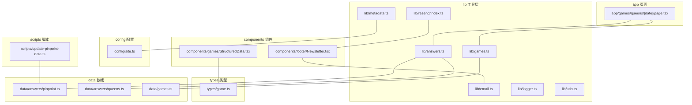
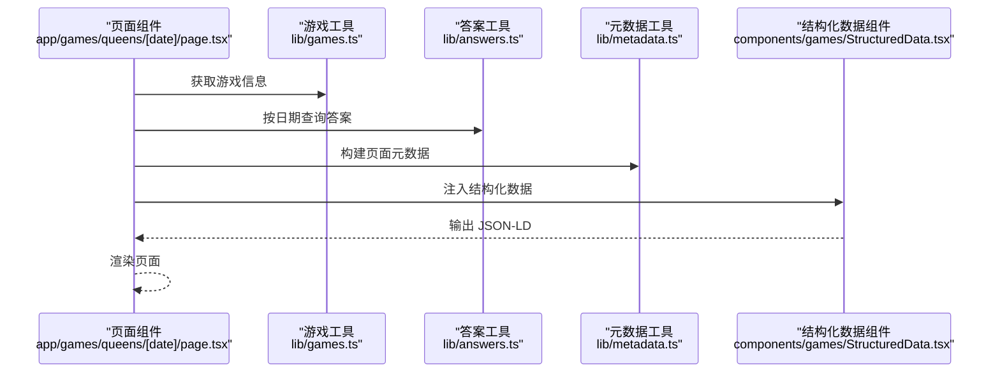
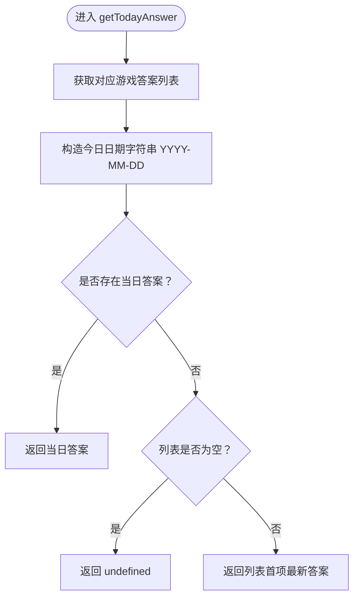
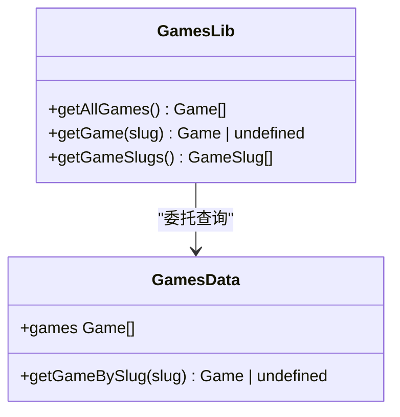
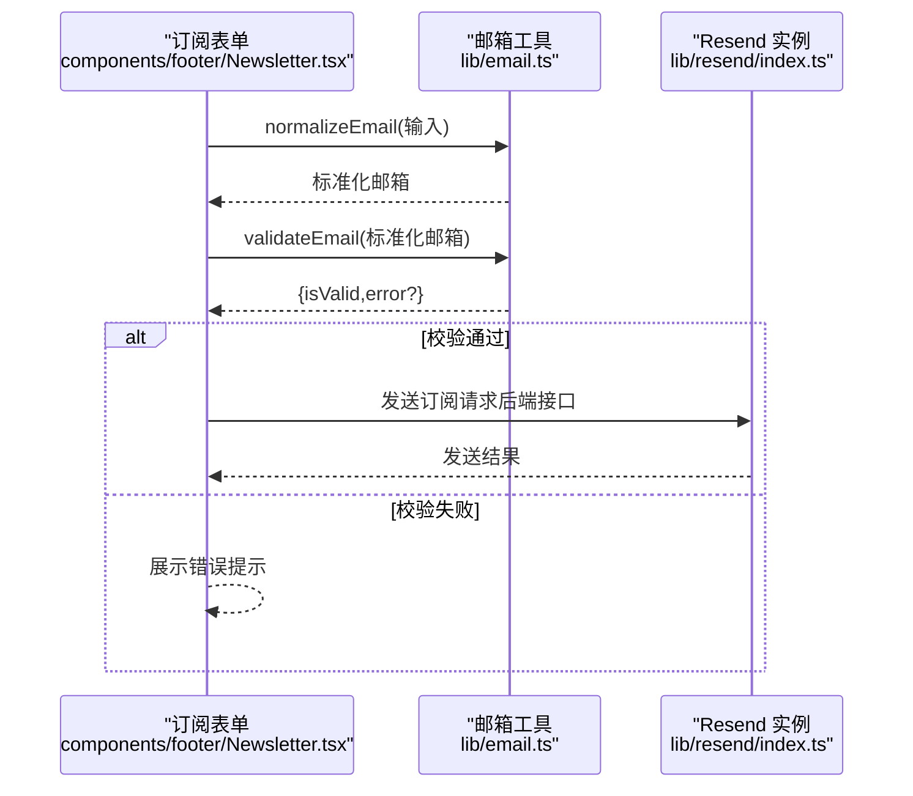
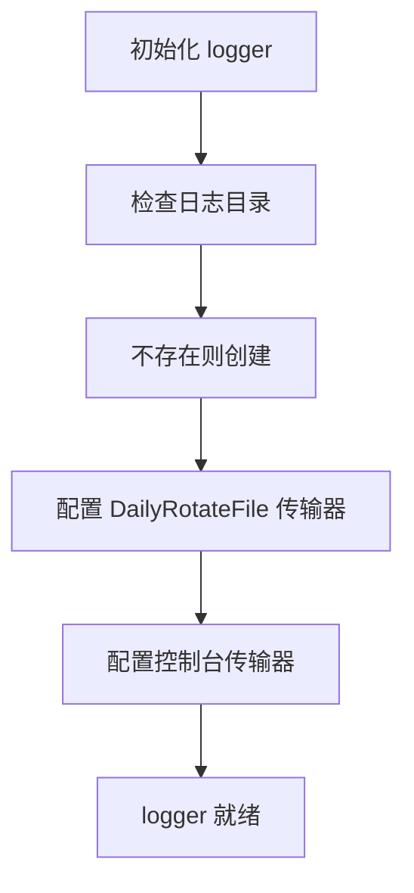
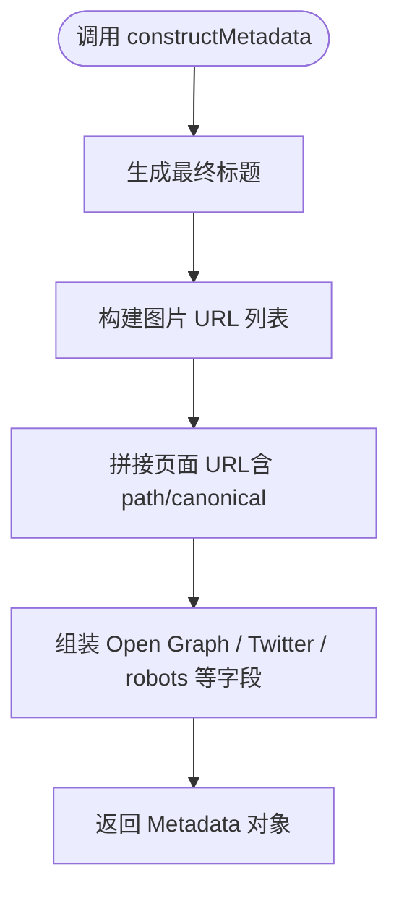
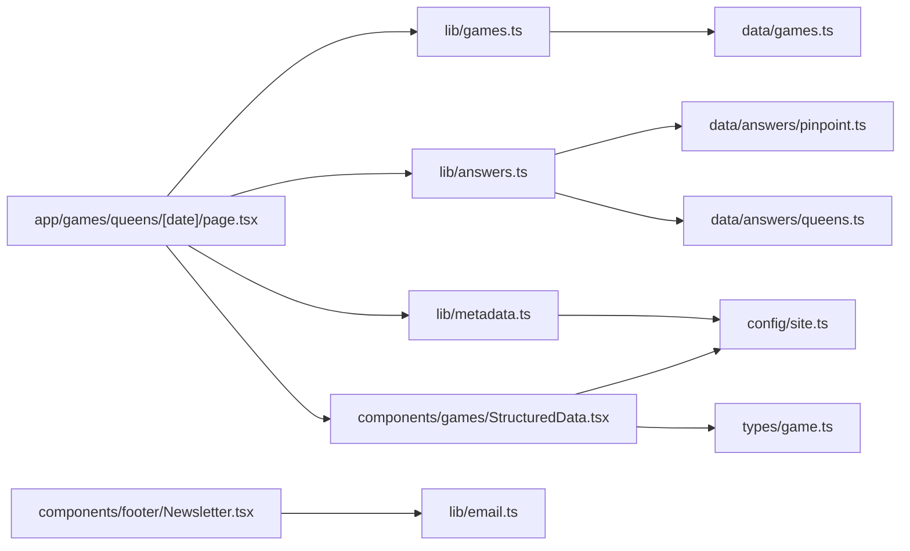

# 业务逻辑工具

<cite>
**本文引用的文件**
- [lib/answers.ts](file://lib/answers.ts)
- [lib/games.ts](file://lib/games.ts)
- [lib/email.ts](file://lib/email.ts)
- [lib/logger.ts](file://lib/logger.ts)
- [lib/metadata.ts](file://lib/metadata.ts)
- [lib/utils.ts](file://lib/utils.ts)
- [lib/resend/index.ts](file://lib/resend/index.ts)
- [data/answers/pinpoint.ts](file://data/answers/pinpoint.ts)
- [data/answers/queens.ts](file://data/answers/queens.ts)
- [data/games.ts](file://data/games.ts)
- [types/game.ts](file://types/game.ts)
- [config/site.ts](file://config/site.ts)
- [components/footer/Newsletter.tsx](file://components/footer/Newsletter.tsx)
- [components/games/StructuredData.tsx](file://components/games/StructuredData.tsx)
- [app/games/queens/[date]/page.tsx](file://app/games/queens/[date]/page.tsx)
- [scripts/update-pinpoint-data.ts](file://scripts/update-pinpoint-data.ts)
</cite>

## 目录
1. [简介](#简介)
2. [项目结构](#项目结构)
3. [核心组件](#核心组件)
4. [架构总览](#架构总览)
5. [详细组件分析](#详细组件分析)
6. [依赖分析](#依赖分析)
7. [性能考虑](#性能考虑)
8. [故障排查指南](#故障排查指南)
9. [结论](#结论)
10. [附录](#附录)

## 简介
本文件系统性梳理并说明业务逻辑工具模块的设计与实现，覆盖以下工具与能力：
- 答案数据管理工具：按游戏维度聚合、查询今日或指定日期的答案，支持排序与回退策略
- 游戏配置管理工具：提供游戏清单、按 slug 查询、slug 列表等
- 邮件发送工具：基于 Resend 的客户端封装与环境初始化
- 日志记录工具：基于 winston 的每日轮转日志记录器
- 元数据管理工具：统一构建 SEO 友好的页面元数据
- 实用工具函数：类名合并与域名提取等通用工具

文档将逐项说明功能、参数、返回值、使用场景、错误处理策略、性能优化建议，并给出工具间的协作关系与数据流转过程。

## 项目结构
围绕业务逻辑工具，代码主要分布在以下位置：
- lib：业务工具层（答案、游戏、邮件、日志、元数据、工具）
- data：静态数据（答案与游戏清单）
- types：类型定义
- config：站点配置
- components：页面级组件（如结构化数据、订阅表单）
- app：页面路由（如 queens 指定日期页）
- scripts：数据更新脚本

图表来源
- [lib/answers.ts](file://lib/answers.ts#L1-L42)
- [lib/games.ts](file://lib/games.ts#L1-L15)
- [lib/email.ts](file://lib/email.ts#L1-L91)
- [lib/logger.ts](file://lib/logger.ts#L1-L41)
- [lib/metadata.ts](file://lib/metadata.ts#L1-L78)
- [lib/utils.ts](file://lib/utils.ts#L1-L19)
- [lib/resend/index.ts](file://lib/resend/index.ts#L1-L13)
- [data/answers/pinpoint.ts](file://data/answers/pinpoint.ts#L1-L139)
- [data/answers/queens.ts](file://data/answers/queens.ts#L1-L59)
- [data/games.ts](file://data/games.ts#L1-L29)
- [types/game.ts](file://types/game.ts#L1-L27)
- [config/site.ts](file://config/site.ts#L1-L45)
- [components/games/StructuredData.tsx](file://components/games/StructuredData.tsx#L1-L74)
- [components/footer/Newsletter.tsx](file://components/footer/Newsletter.tsx#L1-L90)
- [app/games/queens/[date]/page.tsx](file://app/games/queens/[date]/page.tsx#L43-L89)
- [scripts/update-pinpoint-data.ts](file://scripts/update-pinpoint-data.ts#L60-L81)

章节来源
- [lib/answers.ts](file://lib/answers.ts#L1-L42)
- [lib/games.ts](file://lib/games.ts#L1-L15)
- [lib/email.ts](file://lib/email.ts#L1-L91)
- [lib/logger.ts](file://lib/logger.ts#L1-L41)
- [lib/metadata.ts](file://lib/metadata.ts#L1-L78)
- [lib/utils.ts](file://lib/utils.ts#L1-L19)
- [lib/resend/index.ts](file://lib/resend/index.ts#L1-L13)
- [data/answers/pinpoint.ts](file://data/answers/pinpoint.ts#L1-L139)
- [data/answers/queens.ts](file://data/answers/queens.ts#L1-L59)
- [data/games.ts](file://data/games.ts#L1-L29)
- [types/game.ts](file://types/game.ts#L1-L27)
- [config/site.ts](file://config/site.ts#L1-L45)
- [components/games/StructuredData.tsx](file://components/games/StructuredData.tsx#L1-L74)
- [components/footer/Newsletter.tsx](file://components/footer/Newsletter.tsx#L1-L90)
- [app/games/queens/[date]/page.tsx](file://app/games/queens/[date]/page.tsx#L43-L89)
- [scripts/update-pinpoint-data.ts](file://scripts/update-pinpoint-data.ts#L60-L81)

## 核心组件
本节对六大工具进行概览式说明，后续章节深入分析。

- 答案数据管理工具（lib/answers.ts）
  - 功能：按游戏 slug 聚合答案；查询今日答案（若无则回退到最近答案）；按日期查询；获取全部答案并按日期降序排序
  - 关键函数：getAnswersByGameSlug、getTodayAnswer、getAnswerByDate、getAllAnswers
  - 数据来源：data/answers/pinpoint.ts、data/answers/queens.ts
  - 使用场景：页面渲染答案卡片、历史归档页、API 返回答案集合

- 游戏配置管理工具（lib/games.ts）
  - 功能：获取全部游戏、按 slug 获取单个游戏、获取所有 slug
  - 关键函数：getAllGames、getGame、getGameSlugs
  - 数据来源：data/games.ts
  - 使用场景：导航、面包屑、页面标题与描述动态拼装

- 邮件发送工具（lib/resend/index.ts + lib/email.ts）
  - 功能：Resend 客户端初始化（带环境变量检查）；前端邮箱校验与标准化
  - 关键函数：validateEmail、normalizeEmail
  - 使用场景：订阅表单提交前校验、调用后端订阅接口
  - 注意：实际发送由后端接口完成，此处提供客户端校验与客户端实例

- 日志记录工具（lib/logger.ts）
  - 功能：基于 winston 的每日轮转文件日志；控制台输出；JSON 格式时间戳
  - 关键函数：默认导出 logger
  - 使用场景：服务端日志记录、审计与排障

- 元数据管理工具（lib/metadata.ts）
  - 功能：统一构建 Next.js Metadata；支持 Open Graph、Twitter Card、robots、canonical 等
  - 关键函数：constructMetadata
  - 数据来源：config/site.ts
  - 使用场景：页面级元数据生成

- 实用工具函数（lib/utils.ts）
  - 功能：类名合并（clsx + tailwind-merge）、域名提取（含协议补全与 www 去除）
  - 关键函数：cn、getDomain
  - 使用场景：组件样式合并、链接处理

章节来源
- [lib/answers.ts](file://lib/answers.ts#L1-L42)
- [lib/games.ts](file://lib/games.ts#L1-L15)
- [lib/email.ts](file://lib/email.ts#L1-L91)
- [lib/logger.ts](file://lib/logger.ts#L1-L41)
- [lib/metadata.ts](file://lib/metadata.ts#L1-L78)
- [lib/utils.ts](file://lib/utils.ts#L1-L19)
- [lib/resend/index.ts](file://lib/resend/index.ts#L1-L13)
- [data/answers/pinpoint.ts](file://data/answers/pinpoint.ts#L1-L139)
- [data/answers/queens.ts](file://data/answers/queens.ts#L1-L59)
- [data/games.ts](file://data/games.ts#L1-L29)
- [config/site.ts](file://config/site.ts#L1-L45)

## 架构总览
下图展示业务逻辑工具在页面渲染与数据流中的协作关系：

图表来源
- [app/games/queens/[date]/page.tsx](file://app/games/queens/[date]/page.tsx#L43-L89)
- [lib/games.ts](file://lib/games.ts#L1-L15)
- [lib/answers.ts](file://lib/answers.ts#L1-L42)
- [lib/metadata.ts](file://lib/metadata.ts#L1-L78)
- [components/games/StructuredData.tsx](file://components/games/StructuredData.tsx#L1-L74)

## 详细组件分析

### 答案数据管理工具（lib/answers.ts）
- 设计要点
  - 以 slug 映射答案数组，便于扩展新游戏
  - 今日答案优先匹配当天，否则回退到最新答案
  - 全量答案按日期降序排列，利于归档页展示
- 函数说明
  - getAnswersByGameSlug(slug)
    - 参数：slug（枚举限定）
    - 返回：GameAnswer[]（空数组兜底）
    - 场景：通用答案列表读取
  - getTodayAnswer(slug)
    - 参数：slug
    - 返回：GameAnswer | undefined
    - 场景：首页或今日答案页
  - getAnswerByDate(slug, date)
    - 参数：slug、date（YYYY-MM-DD）
    - 返回：GameAnswer | undefined
    - 场景：按日期详情页
  - getAllAnswers(slug)
    - 参数：slug
    - 返回：GameAnswer[]（按日期降序）
    - 场景：历史归档页
- 错误处理与边界
  - 未找到答案时返回空数组或 undefined，调用方需判空
  - 日期格式严格要求 YYYY-MM-DD，避免解析异常
- 性能优化
  - 答案数组为内存常驻，查询为 O(n)，n 为答案条数；可按需引入缓存或二分查找（按有序日期）
  - 排序仅在需要时执行，避免重复计算
- 数据来源
  - pinpointAnswers、queensAnswers 来自 data/answers 下的静态文件

图表来源
- [lib/answers.ts](file://lib/answers.ts#L14-L26)

章节来源
- [lib/answers.ts](file://lib/answers.ts#L1-L42)
- [data/answers/pinpoint.ts](file://data/answers/pinpoint.ts#L1-L139)
- [data/answers/queens.ts](file://data/answers/queens.ts#L1-L59)

### 游戏配置管理工具（lib/games.ts）
- 设计要点
  - 将游戏清单与查询方法集中管理，便于扩展
  - 提供 slug 列表用于路由与导航
- 函数说明
  - getAllGames()
    - 返回：Game[]（完整清单）
  - getGame(slug)
    - 返回：Game | undefined
  - getGameSlugs()
    - 返回：GameSlug[]
- 使用场景
  - 页面标题、描述、OG 图片路径拼接
  - 导航与面包屑生成

图表来源
- [lib/games.ts](file://lib/games.ts#L1-L15)
- [data/games.ts](file://data/games.ts#L1-L29)

章节来源
- [lib/games.ts](file://lib/games.ts#L1-L15)
- [data/games.ts](file://data/games.ts#L1-L29)

### 邮件发送工具（lib/resend/index.ts + lib/email.ts）
- 设计要点
  - 客户端：Resend 实例按环境变量懒加载，未设置时仅告警
  - 前端：邮箱格式、长度、别名规则、一次性邮箱黑名单等校验与标准化
- 函数说明
  - validateEmail(email)
    - 返回：{ isValid: boolean, error?: string }
    - 支持错误类型：invalid_email_format、email_part_too_long、disposable_email_not_allowed、invalid_characters
  - normalizeEmail(email)
    - 返回：标准化后的邮箱字符串（小写、去冗余）
    - 针对不同域名的本地部分规则（如 Gmail 去点与加号、Outlook/Hotmail/Live 去加号、Yahoo 去横杠等）
  - resend 实例
    - 在存在 RESEND_API_KEY 时初始化，否则为 null 并输出警告
- 使用场景
  - 订阅表单提交前校验与标准化
  - 通过后端接口调用 Resend 发送邮件

图表来源
- [components/footer/Newsletter.tsx](file://components/footer/Newsletter.tsx#L15-L55)
- [lib/email.ts](file://lib/email.ts#L15-L91)
- [lib/resend/index.ts](file://lib/resend/index.ts#L1-L13)

章节来源
- [lib/email.ts](file://lib/email.ts#L1-L91)
- [lib/resend/index.ts](file://lib/resend/index.ts#L1-L13)
- [components/footer/Newsletter.tsx](file://components/footer/Newsletter.tsx#L1-L90)

### 日志记录工具（lib/logger.ts）
- 设计要点
  - 基于 winston，每日轮转文件，压缩归档，保留 3 天
  - 控制台彩色输出，便于开发调试
  - 日志目录可配置，默认 log
- 使用场景
  - 服务端日志记录、审计、排障
- 最佳实践
  - 生产环境确保 LOG_DIR 可写
  - 结合业务关键事件打点，避免过量日志

图表来源
- [lib/logger.ts](file://lib/logger.ts#L5-L38)

章节来源
- [lib/logger.ts](file://lib/logger.ts#L1-L41)

### 元数据管理工具（lib/metadata.ts）
- 设计要点
  - 统一构建 Next.js Metadata，包含 Open Graph、Twitter Card、robots、canonical 等
  - 自动拼接图片 URL（相对路径转绝对），支持 noIndex 控制爬虫
- 函数说明
  - constructMetadata(params)
    - 参数：page、title、description、images、noIndex、path、canonicalUrl
    - 返回：Metadata 对象
- 使用场景
  - 页面级元数据生成，提升 SEO 与社交分享体验

图表来源
- [lib/metadata.ts](file://lib/metadata.ts#L14-L78)
- [config/site.ts](file://config/site.ts#L1-L45)

章节来源
- [lib/metadata.ts](file://lib/metadata.ts#L1-L78)
- [config/site.ts](file://config/site.ts#L1-L45)

### 实用工具函数（lib/utils.ts）
- 设计要点
  - cn：基于 clsx 与 tailwind-merge 的类名合并，避免冲突
  - getDomain：安全解析 URL，补全协议，去除 www 前缀
- 使用场景
  - 组件样式合并、链接域名提取与展示

章节来源
- [lib/utils.ts](file://lib/utils.ts#L1-L19)

## 依赖分析
- 答案工具依赖数据层（pinpoint、queens）
- 游戏工具依赖数据层（games）
- 元数据工具依赖站点配置
- 结构化数据组件依赖类型定义与站点配置
- 订阅表单依赖邮箱工具与 Resend 实例
- 页面（如 queens 指定日期页）同时依赖游戏与答案工具，并注入元数据与结构化数据

图表来源
- [lib/answers.ts](file://lib/answers.ts#L1-L42)
- [lib/games.ts](file://lib/games.ts#L1-L15)
- [lib/metadata.ts](file://lib/metadata.ts#L1-L78)
- [lib/email.ts](file://lib/email.ts#L1-L91)
- [components/games/StructuredData.tsx](file://components/games/StructuredData.tsx#L1-L74)
- [app/games/queens/[date]/page.tsx](file://app/games/queens/[date]/page.tsx#L43-L89)
- [data/answers/pinpoint.ts](file://data/answers/pinpoint.ts#L1-L139)
- [data/answers/queens.ts](file://data/answers/queens.ts#L1-L59)
- [data/games.ts](file://data/games.ts#L1-L29)
- [types/game.ts](file://types/game.ts#L1-L27)
- [config/site.ts](file://config/site.ts#L1-L45)

章节来源
- [lib/answers.ts](file://lib/answers.ts#L1-L42)
- [lib/games.ts](file://lib/games.ts#L1-L15)
- [lib/metadata.ts](file://lib/metadata.ts#L1-L78)
- [lib/email.ts](file://lib/email.ts#L1-L91)
- [components/games/StructuredData.tsx](file://components/games/StructuredData.tsx#L1-L74)
- [app/games/queens/[date]/page.tsx](file://app/games/queens/[date]/page.tsx#L43-L89)
- [data/answers/pinpoint.ts](file://data/answers/pinpoint.ts#L1-L139)
- [data/answers/queens.ts](file://data/answers/queens.ts#L1-L59)
- [data/games.ts](file://data/games.ts#L1-L29)
- [types/game.ts](file://types/game.ts#L1-L27)
- [config/site.ts](file://config/site.ts#L1-L45)

## 性能考虑
- 答案查询
  - 当前为线性查找，复杂度 O(n)；若答案量增长，建议：
    - 引入 Map 以日期为键的索引
    - 或对答案按日期排序后使用二分查找
- 日志
  - 每日轮转与压缩归档会带来磁盘 IO；建议：
    - 控制日志级别，仅记录关键事件
    - 设置合适的 maxFiles 与 maxSize
- 元数据
  - 构建过程为纯函数，成本极低；避免在高频路径重复构建
- 邮件校验
  - 正则与字符串操作成本低；标准化规则可缓存常用域名分支

## 故障排查指南
- 邮件订阅失败
  - 现象：前端报错“订阅失败”
  - 排查：
    - 检查 validateEmail 返回的错误码
    - 确认 normalizeEmail 是否正确
    - 检查后端接口响应与状态码
    - 确认 RESEND_API_KEY 是否配置
- 答案未显示或显示错误
  - 现象：今日答案为空或非预期答案
  - 排查：
    - 确认日期格式为 YYYY-MM-DD
    - 检查 data/answers 下对应游戏数据是否包含当日答案
    - 若无当日答案，getTodayAnswer 会回退到最新答案
- 元数据缺失或图片不显示
  - 现象：OG 图片未显示或 canonical 缺失
  - 排查：
    - 检查 images 数组与 path/canonicalUrl 参数
    - 确认 config/site.ts 的 url 配置正确
- 日志不生成
  - 现象：log 目录无文件
  - 排查：
    - 确认 LOG_DIR 可写
    - 检查进程权限与磁盘空间

章节来源
- [components/footer/Newsletter.tsx](file://components/footer/Newsletter.tsx#L15-L55)
- [lib/email.ts](file://lib/email.ts#L15-L91)
- [lib/logger.ts](file://lib/logger.ts#L5-L38)
- [lib/metadata.ts](file://lib/metadata.ts#L14-L78)
- [lib/answers.ts](file://lib/answers.ts#L14-L26)

## 结论
本工具模块以清晰的职责划分与简洁的 API 设计支撑了答案数据、游戏配置、邮件、日志、元数据与通用工具的业务需求。通过类型约束与纯函数设计，提升了可维护性与可测试性。建议在高并发与大数据量场景下对答案查询与日志策略进行针对性优化，并持续完善错误处理与可观测性。

## 附录
- 数据更新脚本
  - 作用：批量更新 pinpoint 答案数据并写入文件，便于自动化维护
  - 关键流程：读取、处理、写入、打印更新摘要与错误处理
  - 使用场景：运维或定时任务中更新答案数据源

章节来源
- [scripts/update-pinpoint-data.ts](file://scripts/update-pinpoint-data.ts#L60-L81)