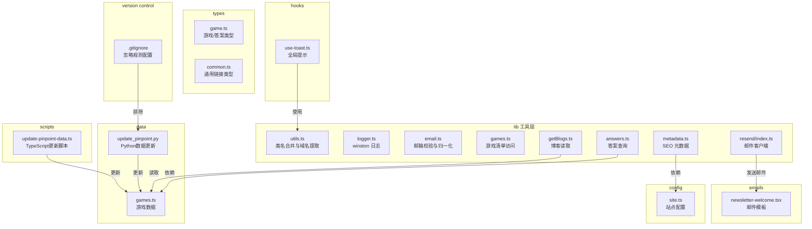
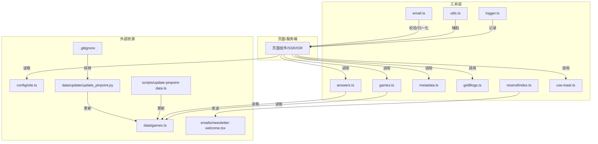
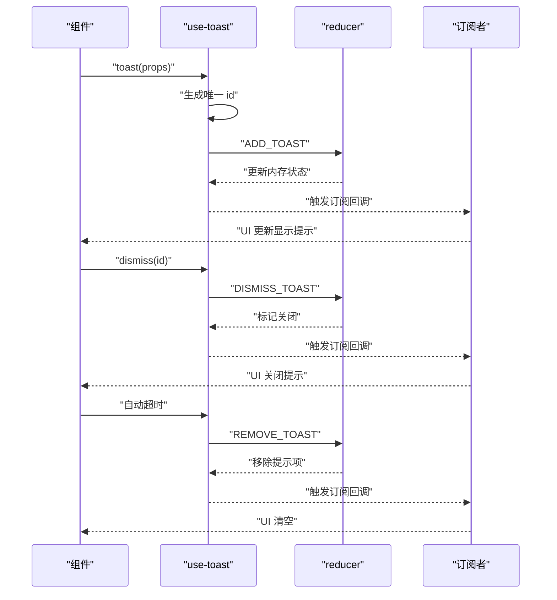
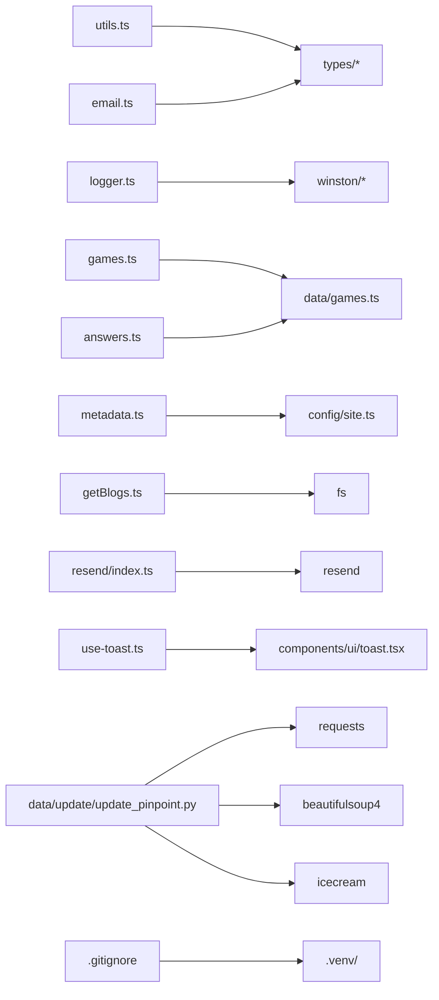

# 开发工具和辅助模块

<cite>
**本文引用的文件**
- [lib/utils.ts](file://lib/utils.ts)
- [lib/logger.ts](file://lib/logger.ts)
- [hooks/use-toast.ts](file://hooks/use-toast.ts)
- [lib/email.ts](file://lib/email.ts)
- [lib/games.ts](file://lib/games.ts)
- [lib/answers.ts](file://lib/answers.ts)
- [lib/metadata.ts](file://lib/metadata.ts)
- [lib/getBlogs.ts](file://lib/getBlogs.ts)
- [lib/resend/index.ts](file://lib/resend/index.ts)
- [emails/newsletter-welcome.tsx](file://emails/newsletter-welcome.tsx)
- [scripts/update-pinpoint-data.ts](file://scripts/update-pinpoint-data.ts)
- [types/game.ts](file://types/game.ts)
- [types/common.ts](file://types/common.ts)
- [config/site.ts](file://config/site.ts)
- [data/games.ts](file://data/games.ts)
- [data/update/update_pinpoint.py](file://data/update/update_pinpoint.py)
- [.gitignore](file://.gitignore)
</cite>

## 更新摘要
**变更内容**
- 新增Python虚拟环境目录忽略规则说明
- 更新版本控制最佳实践章节
- 增强开发环境配置指南

## 目录
1. [简介](#简介)
2. [项目结构](#项目结构)
3. [核心组件](#核心组件)
4. [架构总览](#架构总览)
5. [详细组件分析](#详细组件分析)
6. [版本控制与环境配置](#版本控制与环境配置)
7. [依赖关系分析](#依赖关系分析)
8. [性能考虑](#性能考虑)
9. [故障排查指南](#故障排查指南)
10. [结论](#结论)
11. [附录](#附录)

## 简介
本文件系统性梳理该项目中的"开发工具与辅助模块"，覆盖以下方面：
- 业务逻辑工具：游戏管理、答案查询、元数据构造、博客读取等
- 自定义 Hook：全局提示（Toast）的状态管理与使用模式
- 类型定义：游戏、通用链接等类型规范
- 邮件与发送：邮箱格式校验、别名规范化、邮件模板与发送客户端初始化
- 日志记录：基于 winston 的本地日志轮转与控制台输出
- 开发脚本：自动化更新 Pinpoint 答案数据的脚本
- Python环境管理：虚拟环境配置与版本控制排除
- 使用示例与集成指南：如何在页面或服务端中调用这些工具
- 调试技巧与性能分析建议：日志、批处理、缓存与并发优化思路

## 项目结构
该仓库采用按功能域划分的目录组织方式，开发工具与辅助模块主要分布在如下位置：
- lib：通用业务工具与服务封装（如日志、邮件、元数据、答案、博客）
- hooks：React 客户端自定义 Hook（如全局 Toast）
- types：TypeScript 类型定义（如游戏、通用链接）
- config：站点配置（如基础 URL、社交链接）
- data：静态数据与Python更新脚本（如游戏清单、答案数据更新）
- emails：邮件模板（React 组件）
- scripts：开发期自动化脚本（如更新答案数据）
- .gitignore：版本控制忽略规则配置

**图表来源**
- [lib/utils.ts](file://lib/utils.ts#L1-L19)
- [lib/logger.ts](file://lib/logger.ts#L1-L41)
- [lib/email.ts](file://lib/email.ts#L1-L91)
- [lib/games.ts](file://lib/games.ts#L1-L15)
- [lib/answers.ts](file://lib/answers.ts#L1-L42)
- [lib/metadata.ts](file://lib/metadata.ts#L1-L78)
- [lib/getBlogs.ts](file://lib/getBlogs.ts#L1-L65)
- [lib/resend/index.ts](file://lib/resend/index.ts#L1-L13)
- [hooks/use-toast.ts](file://hooks/use-toast.ts#L1-L195)
- [types/game.ts](file://types/game.ts#L1-L27)
- [types/common.ts](file://types/common.ts#L1-L21)
- [config/site.ts](file://config/site.ts#L1-L45)
- [data/games.ts](file://data/games.ts#L1-L29)
- [data/update/update_pinpoint.py](file://data/update/update_pinpoint.py#L1-L273)
- [emails/newsletter-welcome.tsx](file://emails/newsletter-welcome.tsx#L1-L99)
- [scripts/update-pinpoint-data.ts](file://scripts/update-pinpoint-data.ts#L1-L82)
- [.gitignore](file://.gitignore#L136)

**章节来源**
- [lib/utils.ts](file://lib/utils.ts#L1-L19)
- [lib/logger.ts](file://lib/logger.ts#L1-L41)
- [hooks/use-toast.ts](file://hooks/use-toast.ts#L1-L195)
- [lib/email.ts](file://lib/email.ts#L1-L91)
- [lib/games.ts](file://lib/games.ts#L1-L15)
- [lib/answers.ts](file://lib/answers.ts#L1-L42)
- [lib/metadata.ts](file://lib/metadata.ts#L1-L78)
- [lib/getBlogs.ts](file://lib/getBlogs.ts#L1-L65)
- [lib/resend/index.ts](file://lib/resend/index.ts#L1-L13)
- [emails/newsletter-welcome.tsx](file://emails/newsletter-welcome.tsx#L1-L99)
- [scripts/update-pinpoint-data.ts](file://scripts/update-pinpoint-data.ts#L1-L82)
- [types/game.ts](file://types/game.ts#L1-L27)
- [types/common.ts](file://types/common.ts#L1-L21)
- [config/site.ts](file://config/site.ts#L1-L45)
- [data/games.ts](file://data/games.ts#L1-L29)
- [data/update/update_pinpoint.py](file://data/update/update_pinpoint.py#L1-L273)
- [.gitignore](file://.gitignore#L136)

## 核心组件
- 工具函数与服务
  - 域名解析与类名合并：用于 SEO 图片 URL 规范化与样式合并
  - 日志记录：本地文件轮转与控制台输出
  - 邮箱校验与归一化：格式、长度、一次性邮箱检测与别名规则
  - 游戏与答案：提供游戏清单、按日期/最新答案查询
  - 元数据构造：统一生成 Open Graph、Twitter Card、robots 等
  - 博客读取：按语言批量读取并排序
  - 邮件发送：Resend 客户端初始化与邮件模板渲染
- 自定义 Hook
  - use-toast：全局提示队列、去重、自动移除、批量关闭
- 开发脚本
  - update-pinpoint-data：抓取 API 并写回答案数据文件
  - update_pinpoint.py：Python版本的数据更新脚本
- 版本控制配置
  - .gitignore：统一管理各类构建产物、缓存目录和虚拟环境

**章节来源**
- [lib/utils.ts](file://lib/utils.ts#L1-L19)
- [lib/logger.ts](file://lib/logger.ts#L1-L41)
- [lib/email.ts](file://lib/email.ts#L1-L91)
- [lib/games.ts](file://lib/games.ts#L1-L15)
- [lib/answers.ts](file://lib/answers.ts#L1-L42)
- [lib/metadata.ts](file://lib/metadata.ts#L1-L78)
- [lib/getBlogs.ts](file://lib/getBlogs.ts#L1-L65)
- [lib/resend/index.ts](file://lib/resend/index.ts#L1-L13)
- [hooks/use-toast.ts](file://hooks/use-toast.ts#L1-L195)
- [scripts/update-pinpoint-data.ts](file://scripts/update-pinpoint-data.ts#L1-L82)
- [data/update/update_pinpoint.py](file://data/update/update_pinpoint.py#L1-L273)
- [.gitignore](file://.gitignore#L136)

## 架构总览
下图展示"工具层"与"上层应用"的交互关系，以及关键数据流：

**图表来源**
- [hooks/use-toast.ts](file://hooks/use-toast.ts#L1-L195)
- [lib/games.ts](file://lib/games.ts#L1-L15)
- [lib/answers.ts](file://lib/answers.ts#L1-L42)
- [lib/metadata.ts](file://lib/metadata.ts#L1-L78)
- [lib/getBlogs.ts](file://lib/getBlogs.ts#L1-L65)
- [lib/logger.ts](file://lib/logger.ts#L1-L41)
- [lib/utils.ts](file://lib/utils.ts#L1-L19)
- [lib/email.ts](file://lib/email.ts#L1-L91)
- [lib/resend/index.ts](file://lib/resend/index.ts#L1-L13)
- [config/site.ts](file://config/site.ts#L1-L45)
- [data/games.ts](file://data/games.ts#L1-L29)
- [emails/newsletter-welcome.tsx](file://emails/newsletter-welcome.tsx#L1-L99)
- [scripts/update-pinpoint-data.ts](file://scripts/update-pinpoint-data.ts#L1-L82)
- [data/update/update_pinpoint.py](file://data/update/update_pinpoint.py#L1-L273)
- [.gitignore](file://.gitignore#L136)

## 详细组件分析

### 工具函数与服务

#### 域名解析与类名合并（lib/utils.ts）
- 功能
  - 将传入的 URL 补全协议并解析出主机名，去除可选的 www 前缀
  - 合并 Tailwind CSS 类名，支持条件类与动态类输入
- 复杂度
  - 域名解析为 O(1)，类名合并为 O(n)（n 为类名数量）
- 使用场景
  - SEO 图片 URL 规范化、主题切换时的样式合并

**章节来源**
- [lib/utils.ts](file://lib/utils.ts#L1-L19)

#### 日志记录（lib/logger.ts）
- 功能
  - 基于 winston 的 DailyRotateFile 传输器，按日期轮转日志文件
  - 控制台彩色输出与 JSON 格式化
  - 支持通过环境变量设置日志目录
- 配置要点
  - 文件命名包含日期，压缩归档，最大大小与保留天数
  - 控制台与文件双通道输出
- 使用建议
  - 在生产环境设置 LOG_DIR，避免默认 log 目录权限问题
  - 对敏感信息进行脱敏处理后再写入日志

**章节来源**
- [lib/logger.ts](file://lib/logger.ts#L1-L41)

#### 邮箱校验与归一化（lib/email.ts）
- 功能
  - 校验邮箱格式、长度限制、禁止一次性邮箱、非法字符
  - 归一化不同服务商的别名规则（如 Gmail 的点号与加号、Outlook 的加号、Yahoo 的减号）
- 错误类型
  - invalid_email_format、email_part_too_long、disposable_email_not_allowed、invalid_characters
- 使用建议
  - 在用户提交表单后先进行前端校验，再进行后端二次校验
  - 归一化后的邮箱可用于去重与关联账户

**章节来源**
- [lib/email.ts](file://lib/email.ts#L1-L91)

#### 游戏管理（lib/games.ts）
- 功能
  - 提供获取所有游戏、按 slug 获取游戏、获取所有 slug 的方法
- 依赖
  - 依赖 data/games.ts 中的游戏清单与查找函数
- 使用建议
  - 在路由参数校验与导航中优先使用 slug 列表进行白名单校验

**章节来源**
- [lib/games.ts](file://lib/games.ts#L1-L15)
- [data/games.ts](file://data/games.ts#L1-L29)

#### 答案查询（lib/answers.ts）
- 功能
  - 按游戏 slug 获取答案列表
  - 获取今日答案（若无则返回最近一条）
  - 按指定日期获取答案
  - 获取全部答案并按日期降序排列
- 复杂度
  - 查找为 O(n)（n 为答案条目数），排序为 O(n log n)
- 使用建议
  - 对高频查询可引入内存缓存（按 slug 分组）
  - 日期比较使用 ISO 字符串（YYYY-MM-DD）

**章节来源**
- [lib/answers.ts](file://lib/answers.ts#L1-L42)
- [types/game.ts](file://types/game.ts#L1-L27)
- [data/games.ts](file://data/games.ts#L1-L29)

#### 元数据构造（lib/metadata.ts）
- 功能
  - 统一生成标题、描述、OG 图片、Twitter 卡片、robots 等
  - 支持路径、canonical、noIndex 等参数
- 依赖
  - 依赖 config/site.ts 提供的基础 URL、作者、图标等
- 使用建议
  - 在动态路由中根据 page 参数拼接最终标题
  - 图片 URL 自动补全绝对地址

**章节来源**
- [lib/metadata.ts](file://lib/metadata.ts#L1-L78)
- [config/site.ts](file://config/site.ts#L1-L45)

#### 博客读取（lib/getBlogs.ts）
- 功能
  - 按语言读取博客目录，分批读取文件，解析 YAML front matter
  - 过滤可见性为 published 的文章，按置顶与时间排序
- 批处理
  - 使用批次大小常量进行批量读取，避免一次性 IO 压力
- 使用建议
  - 在 ISR 或静态导出场景中预取并缓存结果
  - 对大目录可考虑懒加载与分页

**章节来源**
- [lib/getBlogs.ts](file://lib/getBlogs.ts#L1-L65)

#### 邮件发送与模板（lib/resend/index.ts + emails/newsletter-welcome.tsx）
- 功能
  - 初始化 Resend 客户端（受 API Key 控制）
  - 提供欢迎邮件模板（React 组件，内联样式）
- 使用建议
  - 在生产环境确保 RESEND_API_KEY 设置
  - 模板中使用站点配置的 URL 与名称，保持品牌一致性

**章节来源**
- [lib/resend/index.ts](file://lib/resend/index.ts#L1-L13)
- [emails/newsletter-welcome.tsx](file://emails/newsletter-welcome.tsx#L1-L99)
- [config/site.ts](file://config/site.ts#L1-L45)

#### 开发脚本：更新 Pinpoint 数据（scripts/update-pinpoint-data.ts + data/update/update_pinpoint.py）
- 功能
  - TypeScript版本：通过 API 获取最新数据，转换为 GameAnswer 格式并写入 data/answers/pinpoint.ts
  - Python版本：提供备用的数据更新脚本，支持更灵活的Python环境配置
  - 支持命令行直接运行与被其他流程调用
- 使用建议
  - 在 CI 中定期执行以保持答案数据新鲜
  - 注意错误处理与退出码，便于自动化失败告警
  - Python版本适合需要独立Python环境的场景

**章节来源**
- [scripts/update-pinpoint-data.ts](file://scripts/update-pinpoint-data.ts#L1-L82)
- [data/update/update_pinpoint.py](file://data/update/update_pinpoint.py#L1-L273)

### 自定义 Hook：全局提示（hooks/use-toast.ts）
- 设计模式
  - 单向数据流：内部维护内存状态，通过订阅者模式通知 UI 更新
  - 不可变更新：每次操作返回新数组/对象，保证 React 正确渲染
  - 去重与上限：TOAST_LIMIT 控制同时显示数量
- 状态管理最佳实践
  - 使用 reducer 维护状态，集中处理多种动作
  - 使用 Map 存储定时器，避免重复注册
  - 通过 onOpenChange 与自动超时机制实现优雅关闭
- 代码复用策略
  - 将 toast 方法返回 id、dismiss、update，便于在任意组件中统一管理
  - useToast 返回完整状态与操作方法，减少重复样板代码

**图表来源**
- [hooks/use-toast.ts](file://hooks/use-toast.ts#L1-L195)

**章节来源**
- [hooks/use-toast.ts](file://hooks/use-toast.ts#L1-L195)

### 类型定义
- 游戏与答案类型（types/game.ts）
  - GameSlug、Game、GameAnswer、GameWithAnswers
  - 约束答案日期格式、线索与图片字段
- 通用链接类型（types/common.ts）
  - HeaderLink、FooterLink、Link
  - 支持可选属性与 rel/target 等

**章节来源**
- [types/game.ts](file://types/game.ts#L1-L27)
- [types/common.ts](file://types/common.ts#L1-L21)

## 版本控制与环境配置

### Git忽略规则配置（.gitignore）
- 新增规则
  - '.venv/'：Python虚拟环境目录排除
- 配置范围
  - 覆盖Node.js模板、日志、构建产物、依赖缓存、IDE配置等
  - 包含Next.js、Nuxt.js、Gatsby等框架的输出目录
  - 排除包管理器缓存和临时文件
- 最佳实践
  - 保持忽略规则的层次化组织
  - 定期审查和更新忽略规则
  - 团队成员共享一致的忽略配置

**章节来源**
- [.gitignore](file://.gitignore#L136)

### Python环境管理
- 虚拟环境配置
  - 使用'.venv/'作为Python虚拟环境目录
  - 符合Python社区标准命名约定
- 环境隔离
  - 独立的Python包依赖管理
  - 避免与主项目Node.js依赖冲突
- 开发工作流
  - 支持TypeScript和Python脚本并存
  - 独立的开发环境配置
  - 可选的Python脚本执行能力

**章节来源**
- [data/update/update_pinpoint.py](file://data/update/update_pinpoint.py#L1-L273)
- [.gitignore](file://.gitignore#L136)

## 依赖关系分析
- 内聚与耦合
  - lib 层工具高度内聚，彼此独立；仅通过 types 与 config 进行弱耦合
  - hooks 与 UI 组件存在直接依赖，但通过抽象接口（如 ToastProps）降低耦合
  - Python脚本与TypeScript脚本形成互补的数据更新方案
- 外部依赖
  - winston 与 DailyRotateFile 用于日志
  - resend 用于邮件发送
  - gray-matter 用于博客内容解析
  - requests、beautifulsoup4、icecream 用于Python数据抓取
- 循环依赖
  - 当前未发现循环导入；各模块职责清晰

**图表来源**
- [lib/utils.ts](file://lib/utils.ts#L1-L19)
- [lib/logger.ts](file://lib/logger.ts#L1-L41)
- [lib/email.ts](file://lib/email.ts#L1-L91)
- [lib/games.ts](file://lib/games.ts#L1-L15)
- [lib/answers.ts](file://lib/answers.ts#L1-L42)
- [lib/metadata.ts](file://lib/metadata.ts#L1-L78)
- [lib/getBlogs.ts](file://lib/getBlogs.ts#L1-L65)
- [lib/resend/index.ts](file://lib/resend/index.ts#L1-L13)
- [hooks/use-toast.ts](file://hooks/use-toast.ts#L1-L195)
- [config/site.ts](file://config/site.ts#L1-L45)
- [data/games.ts](file://data/games.ts#L1-L29)
- [data/update/update_pinpoint.py](file://data/update/update_pinpoint.py#L1-L273)
- [.gitignore](file://.gitignore#L136)

**章节来源**
- [lib/utils.ts](file://lib/utils.ts#L1-L19)
- [lib/logger.ts](file://lib/logger.ts#L1-L41)
- [lib/email.ts](file://lib/email.ts#L1-L91)
- [lib/games.ts](file://lib/games.ts#L1-L15)
- [lib/answers.ts](file://lib/answers.ts#L1-L42)
- [lib/metadata.ts](file://lib/metadata.ts#L1-L78)
- [lib/getBlogs.ts](file://lib/getBlogs.ts#L1-L65)
- [lib/resend/index.ts](file://lib/resend/index.ts#L1-L13)
- [hooks/use-toast.ts](file://hooks/use-toast.ts#L1-L195)
- [config/site.ts](file://config/site.ts#L1-L45)
- [data/games.ts](file://data/games.ts#L1-L29)
- [data/update/update_pinpoint.py](file://data/update/update_pinpoint.py#L1-L273)
- [.gitignore](file://.gitignore#L136)

## 性能考虑
- I/O 批处理
  - 博客读取采用批次读取，避免一次性打开过多文件句柄
- 内存与缓存
  - 答案查询可引入按 slug 的内存缓存，减少重复遍历
- 日志轮转
  - 合理设置 maxSize 与 maxFiles，避免磁盘占用过高
- 并发与超时
  - 邮件发送与 API 抓取应设置合理超时与重试策略
  - Python脚本使用15秒超时防止阻塞
- UI 渲染
  - use-toast 通过不可变更新与订阅者模式，避免不必要的重渲染
- 环境隔离
  - Python虚拟环境独立管理，避免依赖冲突影响主项目性能

## 故障排查指南
- 日志无法写入
  - 检查 LOG_DIR 是否存在且有写权限；确认进程运行目录
- 邮件发送失败
  - 确认 RESEND_API_KEY 是否设置；检查网络连通性与模板渲染是否正确
- 邮箱校验异常
  - 检查一次性邮箱域名列表是否包含目标域名；确认本地部分长度限制
- 答案查询为空
  - 确认数据文件是否已生成；检查日期格式是否为 YYYY-MM-DD
- 博客读取为空
  - 确认语言目录是否存在；检查 front matter 字段与可见性标志
- Toast 不显示或不消失
  - 检查 TOAST_LIMIT 与自动移除延迟；确认订阅者是否正常注册
- Python脚本执行失败
  - 确认Python虚拟环境已激活；检查依赖包安装情况
- 版本控制问题
  - 检查.gitignore规则是否正确排除了'.venv/'目录

**章节来源**
- [lib/logger.ts](file://lib/logger.ts#L1-L41)
- [lib/resend/index.ts](file://lib/resend/index.ts#L1-L13)
- [lib/email.ts](file://lib/email.ts#L1-L91)
- [lib/answers.ts](file://lib/answers.ts#L1-L42)
- [lib/getBlogs.ts](file://lib/getBlogs.ts#L1-L65)
- [hooks/use-toast.ts](file://hooks/use-toast.ts#L1-L195)
- [data/update/update_pinpoint.py](file://data/update/update_pinpoint.py#L1-L273)
- [.gitignore](file://.gitignore#L136)

## 结论
本项目的开发工具与辅助模块以"高内聚、低耦合"为原则，围绕游戏、答案、元数据、博客、邮件与日志等核心业务场景提供了稳定、可扩展的工具层。自定义 Hook 在状态管理上体现了良好的设计模式，便于跨组件复用。配合开发脚本与类型定义，整体提升了开发效率与可维护性。

**更新** 项目现已支持Python虚拟环境管理，通过.gitignore中的'.venv/'规则实现了Python开发环境的版本控制排除，为多语言混合开发提供了更好的环境隔离和协作体验。

## 附录

### API 参考与使用示例

- 工具函数
  - 域名解析：接收任意 URL，返回标准化主机名
  - 类名合并：接收多个类名输入，返回合并后的类名字符串
  - 示例路径
    - [lib/utils.ts](file://lib/utils.ts#L1-L19)
- 日志记录
  - 初始化后可直接调用 info/debug/error 等方法
  - 示例路径
    - [lib/logger.ts](file://lib/logger.ts#L1-L41)
- 邮箱校验与归一化
  - validateEmail 返回 { isValid, error? }
  - normalizeEmail 返回标准化邮箱字符串
  - 示例路径
    - [lib/email.ts](file://lib/email.ts#L1-L91)
- 游戏管理
  - getAllGames / getGame(slug) / getGameSlugs
  - 示例路径
    - [lib/games.ts](file://lib/games.ts#L1-L15)
    - [data/games.ts](file://data/games.ts#L1-L29)
- 答案查询
  - getAnswersByGameSlug / getTodayAnswer / getAnswerByDate / getAllAnswers
  - 示例路径
    - [lib/answers.ts](file://lib/answers.ts#L1-L42)
    - [types/game.ts](file://types/game.ts#L1-L27)
- 元数据构造
  - constructMetadata({...})
  - 示例路径
    - [lib/metadata.ts](file://lib/metadata.ts#L1-L78)
    - [config/site.ts](file://config/site.ts#L1-L45)
- 博客读取
  - getPosts(locale)
  - 示例路径
    - [lib/getBlogs.ts](file://lib/getBlogs.ts#L1-L65)
- 邮件发送与模板
  - 初始化 Resend 客户端
  - 渲染欢迎邮件模板
  - 示例路径
    - [lib/resend/index.ts](file://lib/resend/index.ts#L1-L13)
    - [emails/newsletter-welcome.tsx](file://emails/newsletter-welcome.tsx#L1-L99)
- 全局提示（Toast）
  - toast(props) / dismiss(id) / useToast()
  - 示例路径
    - [hooks/use-toast.ts](file://hooks/use-toast.ts#L1-L195)
- Python数据更新
  - get_today_pinpoint() / update_pinpoint_ts()
  - 示例路径
    - [data/update/update_pinpoint.py](file://data/update/update_pinpoint.py#L1-L273)

### 集成指南
- 在页面中使用
  - 导入对应工具函数并在生命周期或事件中调用
  - 在 SSR/ISR 场景中注意只在客户端使用 use-toast
- 在服务端使用
  - 使用 logger 记录请求与错误；使用 getBlogs 读取内容；使用 email 校验用户输入
- 在 CI/CD 中使用
  - 调用 update-pinpoint-data 脚本更新答案数据；在部署后验证日志与邮件发送可用性
- Python环境配置
  - 创建Python虚拟环境：python -m venv .venv
  - 激活虚拟环境：source .venv/bin/activate（Linux/Mac）或 .venv\Scripts\activate（Windows）
  - 安装依赖：pip install requests beautifulsoup4 icecream
  - 运行脚本：python data/update/update_pinpoint.py

### 调试技巧与性能分析
- 调试
  - 使用 logger 输出关键路径日志；在 use-toast 中打印状态变化
  - 在 getBlogs 中对批次大小进行调整以观察 I/O 行为
  - Python脚本使用icecream库进行调试输出
- 性能
  - 对答案查询引入缓存；对博客读取进行分页与懒加载
  - 在生产环境启用日志轮转与压缩，避免磁盘膨胀
  - Python脚本设置合理的超时时间，避免长时间阻塞
- 版本控制
  - 定期检查.gitignore规则的有效性
  - 确保Python虚拟环境目录不会意外提交到版本控制系统