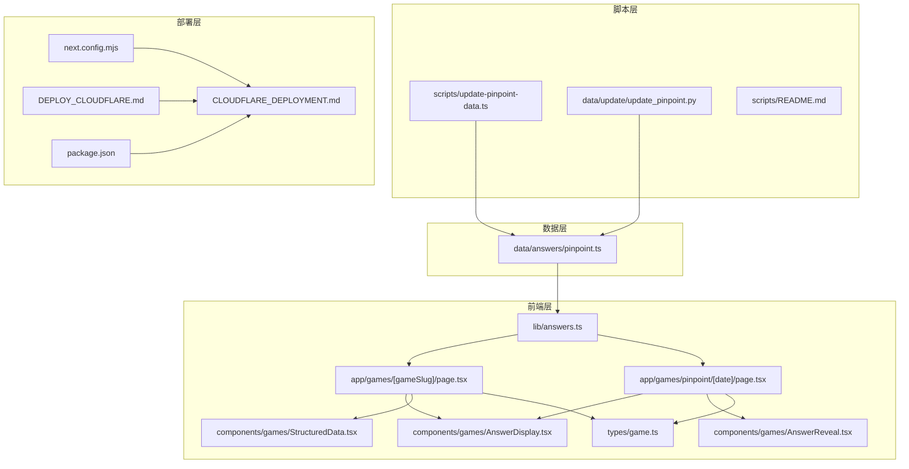
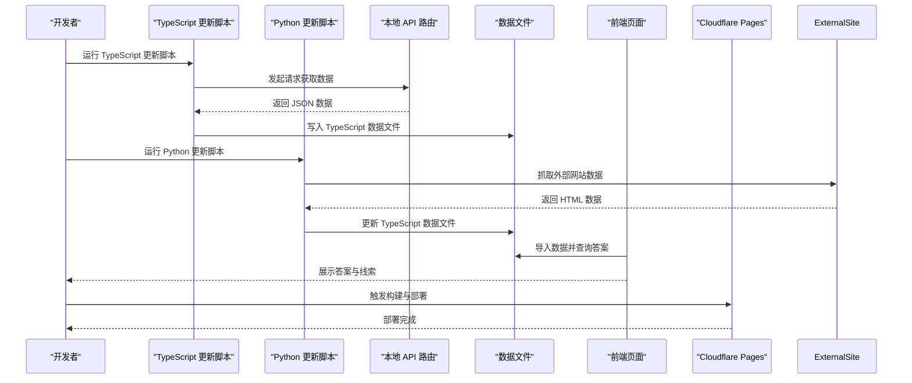
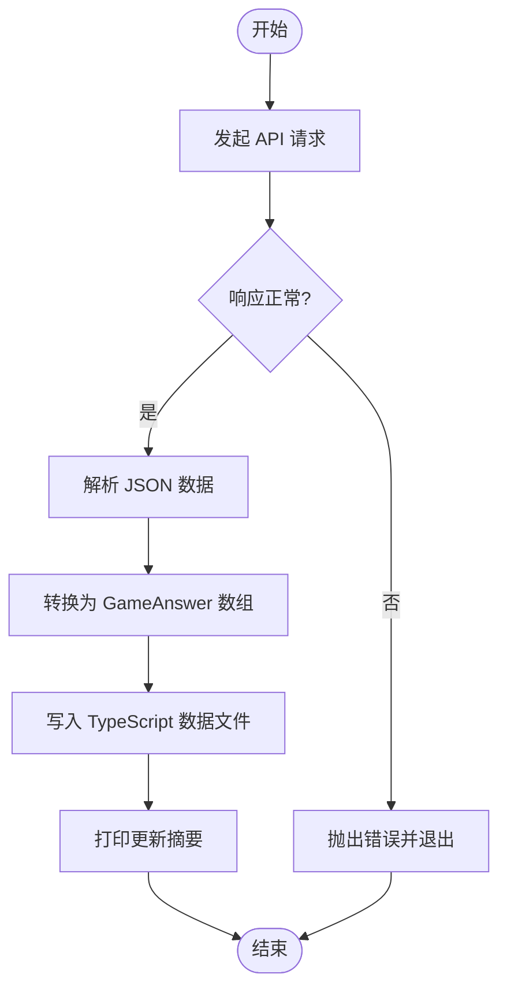
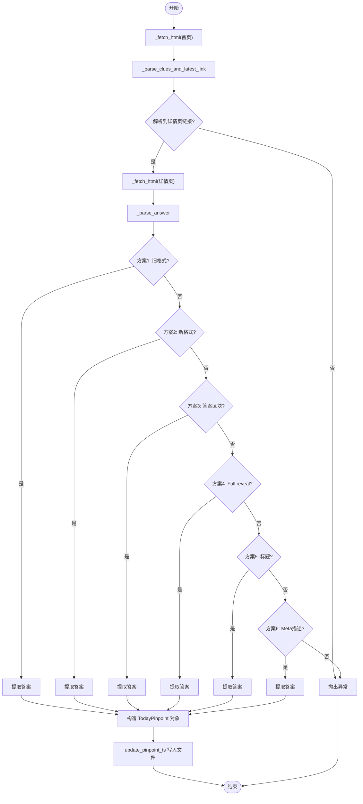
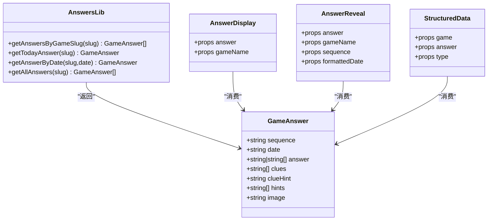
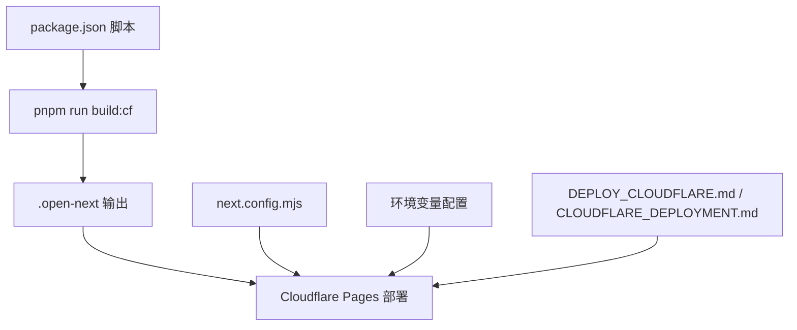
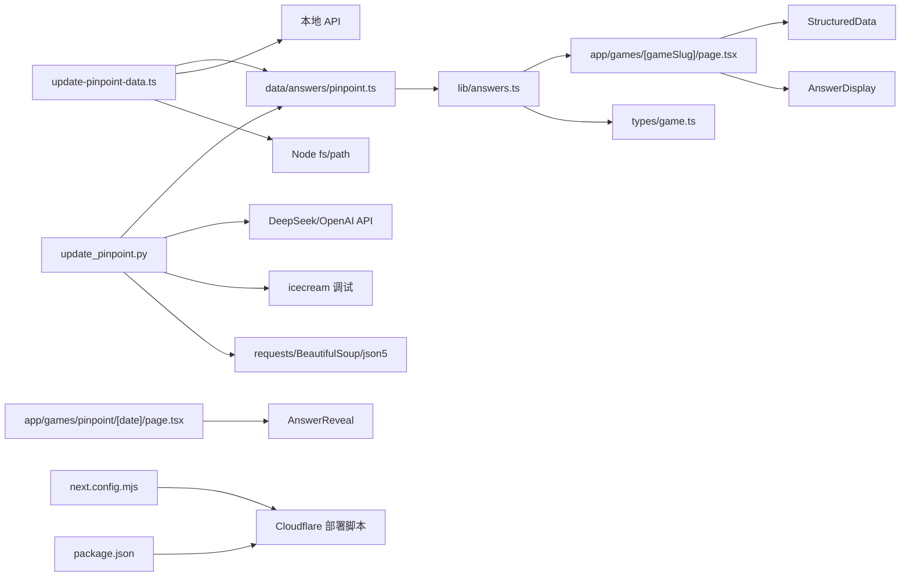

# 开发脚本

<cite>
**本文引用的文件**
- [scripts/README.md](file://scripts/README.md)
- [scripts/update-pinpoint-data.ts](file://scripts/update-pinpoint-data.ts)
- [data/update/update_pinpoint.py](file://data/update/update_pinpoint.py)
- [data/answers/pinpoint.ts](file://data/answers/pinpoint.ts)
- [lib/answers.ts](file://lib/answers.ts)
- [types/game.ts](file://types/game.ts)
- [components/games/AnswerDisplay.tsx](file://components/games/AnswerDisplay.tsx)
- [components/games/AnswerReveal.tsx](file://components/games/AnswerReveal.tsx)
- [components/games/StructuredData.tsx](file://components/games/StructuredData.tsx)
- [app/games/[gameSlug]/page.tsx](file://app/games/[gameSlug]/page.tsx)
- [app/games/pinpoint/[date]/page.tsx](file://app/games/pinpoint/[date]/page.tsx)
- [DEPLOY_CLOUDFLARE.md](file://DEPLOY_CLOUDFLARE.md)
- [CLOUDFLARE_DEPLOYMENT.md](file://CLOUDFLARE_DEPLOYMENT.md)
- [next.config.mjs](file://next.config.mjs)
- [package.json](file://package.json)
</cite>

## 更新摘要
**所做更改**
- 新增 Python 数据抓取脚本组件的详细分析
- 更新架构总览图以反映新的数据抓取流程
- 增强故障排除指南以涵盖 Python 脚本特有的问题
- 补充 Python 依赖关系和环境配置说明
- 更新性能考量以包含 Python 脚本的执行效率
- **更新** 改进了 Python 数据更新脚本的6种解析策略，大幅提高了跨不同网页布局的可靠性
- **更新** 新增 AI 提示生成功能，支持 DeepSeek 和 OpenAI API
- **更新** 增强了正则表达式模式和字符编码处理能力

## 目录
1. [简介](#简介)
2. [项目结构](#项目结构)
3. [核心组件](#核心组件)
4. [架构总览](#架构总览)
5. [详细组件分析](#详细组件分析)
6. [依赖分析](#依赖分析)
7. [性能考量](#性能考量)
8. [故障排除指南](#故障排除指南)
9. [结论](#结论)
10. [附录](#附录)

## 简介
本文件聚焦于本仓库中的开发脚本体系，涵盖数据更新脚本、部署脚本与自动化工具的设计与实现。重点说明：
- 数据更新脚本：从外部网站抓取答案与线索，写入本地数据文件，并与前端展示逻辑衔接。
- 部署脚本与自动化：基于 Cloudflare Pages 的部署流程、适配器与环境变量配置。
- 使用示例、参数配置、输出结果、依赖关系、权限与安全注意事项、定制化与扩展策略。

**更新** 新增 Python 数据抓取脚本组件，提供高级 HTML 解析、6种不同的解析策略和 AI 提示生成功能。改进了正则表达式模式和字符编码处理，大幅提高了跨不同网页布局的可靠性。

## 项目结构
围绕"开发脚本"的关键目录与文件如下：
- scripts：TypeScript 更新脚本与使用说明
- data/update：Python 抓取脚本（历史实现）
- data/answers：最终写入的 TypeScript 数据文件
- lib/answers.ts：前端读取数据的统一入口
- 类型定义：types/game.ts
- 前端展示组件：components/games/*
- 页面路由：app/games/* 与 app/games/pinpoint/[date]/*
- 部署文档：DEPLOY_CLOUDFLARE.md、CLOUDFLARE_DEPLOYMENT.md
- 构建配置：next.config.mjs
- 项目脚本与依赖：package.json

**图表来源**
- [scripts/update-pinpoint-data.ts](file://scripts/update-pinpoint-data.ts#L1-L82)
- [data/update/update_pinpoint.py](file://data/update/update_pinpoint.py#L1-L450)
- [data/answers/pinpoint.ts](file://data/answers/pinpoint.ts#L1-L365)
- [lib/answers.ts](file://lib/answers.ts#L1-L42)
- [types/game.ts](file://types/game.ts#L1-L27)
- [app/games/[gameSlug]/page.tsx](file://app/games/[gameSlug]/page.tsx#L49-L115)
- [app/games/pinpoint/[date]/page.tsx](file://app/games/pinpoint/[date]/page.tsx#L52-L90)
- [components/games/AnswerDisplay.tsx](file://components/games/AnswerDisplay.tsx#L1-L65)
- [components/games/AnswerReveal.tsx](file://components/games/AnswerReveal.tsx#L1-L83)
- [components/games/StructuredData.tsx](file://components/games/StructuredData.tsx#L1-L75)
- [next.config.mjs](file://next.config.mjs#L1-L28)
- [DEPLOY_CLOUDFLARE.md](file://DEPLOY_CLOUDFLARE.md#L1-L114)
- [CLOUDFLARE_DEPLOYMENT.md](file://CLOUDFLARE_DEPLOYMENT.md#L1-L303)
- [package.json](file://package.json#L1-L65)

**章节来源**
- [scripts/README.md](file://scripts/README.md#L1-L104)
- [scripts/update-pinpoint-data.ts](file://scripts/update-pinpoint-data.ts#L1-L82)
- [data/update/update_pinpoint.py](file://data/update/update_pinpoint.py#L1-L450)
- [data/answers/pinpoint.ts](file://data/answers/pinpoint.ts#L1-L365)
- [lib/answers.ts](file://lib/answers.ts#L1-L42)
- [types/game.ts](file://types/game.ts#L1-L27)
- [app/games/[gameSlug]/page.tsx](file://app/games/[gameSlug]/page.tsx#L49-L115)
- [app/games/pinpoint/[date]/page.tsx](file://app/games/pinpoint/[date]/page.tsx#L52-L90)
- [components/games/AnswerDisplay.tsx](file://components/games/AnswerDisplay.tsx#L1-L65)
- [components/games/AnswerReveal.tsx](file://components/games/AnswerReveal.tsx#L1-L83)
- [components/games/StructuredData.tsx](file://components/games/StructuredData.tsx#L1-L75)
- [next.config.mjs](file://next.config.mjs#L1-L28)
- [DEPLOY_CLOUDFLARE.md](file://DEPLOY_CLOUDFLARE.md#L1-L114)
- [CLOUDFLARE_DEPLOYMENT.md](file://CLOUDFLARE_DEPLOYMENT.md#L1-L303)
- [package.json](file://package.json#L1-L65)

## 核心组件
- 数据更新脚本（TypeScript）：通过调用本地 API 获取数据，转换为前端可用格式并写入 TypeScript 数据文件。
- 数据更新脚本（Python）：独立抓取外部网站数据，解析线索与答案，更新 TypeScript 数据文件。
- 前端数据读取：统一从数据文件导入，提供按日期查询、今日答案回退等能力。
- 前端展示组件：负责答案呈现、线索展示、结构化数据输出等。
- 部署自动化：Cloudflare Pages 部署流程、适配器与环境变量配置。

**更新** 新增 Python 数据抓取脚本作为独立的备用方案，提供高级 HTML 解析、6种不同的解析策略和 AI 提示生成功能。改进了正则表达式模式和字符编码处理，大幅提高了跨不同网页布局的可靠性。

**章节来源**
- [scripts/update-pinpoint-data.ts](file://scripts/update-pinpoint-data.ts#L1-L82)
- [data/update/update_pinpoint.py](file://data/update/update_pinpoint.py#L1-L450)
- [lib/answers.ts](file://lib/answers.ts#L1-L42)
- [components/games/AnswerDisplay.tsx](file://components/games/AnswerDisplay.tsx#L1-L65)
- [components/games/AnswerReveal.tsx](file://components/games/AnswerReveal.tsx#L1-L83)
- [components/games/StructuredData.tsx](file://components/games/StructuredData.tsx#L1-L75)
- [DEPLOY_CLOUDFLARE.md](file://DEPLOY_CLOUDFLARE.md#L1-L114)
- [CLOUDFLARE_DEPLOYMENT.md](file://CLOUDFLARE_DEPLOYMENT.md#L1-L303)

## 架构总览
数据流自外部网站经脚本层抓取，落地到数据层，再由前端层统一读取并渲染。部署层确保静态导出或适配器模式下的稳定运行。

**更新** 新增 Python 脚本作为独立的数据抓取组件，提供备用方案和离线环境支持。改进了6种解析策略，大幅提高了跨不同网页布局的可靠性。

**图表来源**
- [scripts/update-pinpoint-data.ts](file://scripts/update-pinpoint-data.ts#L20-L74)
- [data/update/update_pinpoint.py](file://data/update/update_pinpoint.py#L447-L450)
- [data/answers/pinpoint.ts](file://data/answers/pinpoint.ts#L1-L365)
- [lib/answers.ts](file://lib/answers.ts#L1-L42)
- [app/games/[gameSlug]/page.tsx](file://app/games/[gameSlug]/page.tsx#L49-L115)
- [DEPLOY_CLOUDFLARE.md](file://DEPLOY_CLOUDFLARE.md#L1-L114)

## 详细组件分析

### 组件 A：TypeScript 数据更新脚本
- 功能概述
  - 通过本地 API 获取数据，转换为前端所需格式，写入 TypeScript 数据文件。
  - 支持直接运行脚本进行更新，便于 CI/CD 或本地自动化。
- 输入与输出
  - 输入：本地 API 返回的 JSON 数据（包含日期、答案、线索等）。
  - 输出：写入 data/answers/pinpoint.ts，包含导入语句与数组定义。
- 参数与环境
  - 依赖环境变量用于推断本地站点地址。
  - 通过 Node.js 文件系统写入目标路径。
- 执行流程
  - 发起请求 → 校验响应 → 解析 JSON → 转换为 GameAnswer 结构 → 写入文件 → 控制台输出结果摘要。
- 错误处理
  - 对网络错误、非 OK 响应、业务失败进行捕获与退出码控制。
- 使用示例
  - 在本地开发服务器运行后，执行脚本以更新数据文件。

**图表来源**
- [scripts/update-pinpoint-data.ts](file://scripts/update-pinpoint-data.ts#L20-L74)

**章节来源**
- [scripts/update-pinpoint-data.ts](file://scripts/update-pinpoint-data.ts#L1-L82)
- [scripts/README.md](file://scripts/README.md#L1-L104)

### 组件 B：Python 数据更新脚本（历史实现）
- 功能概述
  - 直接抓取外部网站首页与详情页，解析线索与答案，更新 TypeScript 数据文件。
  - 支持判断重复条目，避免重复写入。
  - 包含高级 HTML 解析、6种不同的解析策略和 AI 提示生成功能。
- 输入与输出
  - 输入：外部网站 HTML。
  - 输出：修改 data/answers/pinpoint.ts。
- 执行流程
  - 获取首页 HTML → 解析线索与详情页链接 → 获取详情页 HTML → 解析答案 → 生成新条目 → 插入数组首部 → 写回文件。
- 错误处理
  - 对缺失链接或答案时抛出异常，便于定位问题。
- 使用场景
  - 作为备用方案或离线环境下的独立抓取工具。
- 依赖关系
  - requests：HTTP 请求库
  - BeautifulSoup：HTML 解析库
  - json5：JSON5 解析支持
  - icecream：调试输出

**更新** 新增高级 HTML 解析、6种不同的解析策略和 AI 提示生成功能，提供更强大的数据处理能力。改进了正则表达式模式和字符编码处理，大幅提高了跨不同网页布局的可靠性。

**更新** 新增了6种不同的解析策略来提取答案，包括：
1. 旧格式解析：匹配 "Category: Pinpoint #XXX" 后的答案文本
2. 新格式解析：匹配 "Pinpoint #XXX Answer:" 后的答案
3. 答案区块解析：从页面中的答案区块提取
4. Full reveal 解析：处理 "Full reveal came in—XXX—" 格式
5. 标题解析：从页面标题中提取答案
6. Meta 描述解析：从 meta description 中提取答案

**图表来源**
- [data/update/update_pinpoint.py](file://data/update/update_pinpoint.py#L272-L314)

**章节来源**
- [data/update/update_pinpoint.py](file://data/update/update_pinpoint.py#L1-L450)

### 组件 C：前端数据读取与展示
- 数据读取
  - 通过 lib/answers.ts 统一导入数据文件，提供按游戏、按日期、按今日回退等查询接口。
- 展示组件
  - AnswerDisplay：负责答案与线索的展示、图片渲染。
  - AnswerReveal：提供复制答案的能力与交互反馈。
  - StructuredData：输出结构化数据供 SEO。
- 页面路由
  - app/games/[gameSlug]/page.tsx：首页展示今日答案与归档列表。
  - app/games/pinpoint/[date]/page.tsx：按日期查看答案详情页。

**图表来源**
- [lib/answers.ts](file://lib/answers.ts#L1-L42)
- [types/game.ts](file://types/game.ts#L5-L13)
- [components/games/AnswerDisplay.tsx](file://components/games/AnswerDisplay.tsx#L1-L65)
- [components/games/AnswerReveal.tsx](file://components/games/AnswerReveal.tsx#L1-L83)
- [components/games/StructuredData.tsx](file://components/games/StructuredData.tsx#L1-L75)

**章节来源**
- [lib/answers.ts](file://lib/answers.ts#L1-L42)
- [types/game.ts](file://types/game.ts#L1-L27)
- [components/games/AnswerDisplay.tsx](file://components/games/AnswerDisplay.tsx#L1-L65)
- [components/games/AnswerReveal.tsx](file://components/games/AnswerReveal.tsx#L1-L83)
- [components/games/StructuredData.tsx](file://components/games/StructuredData.tsx#L1-L75)
- [app/games/[gameSlug]/page.tsx](file://app/games/[gameSlug]/page.tsx#L49-L115)
- [app/games/pinpoint/[date]/page.tsx](file://app/games/pinpoint/[date]/page.tsx#L52-L90)

### 组件 D：部署自动化与环境配置
- Cloudflare Pages 部署
  - 推荐使用 Pages 自动集成，支持静态导出或通过适配器启用 SSR。
  - 若使用 API Routes，需适配器支持；静态导出会丢失 API Routes。
- 适配器与构建命令
  - 使用 @cloudflare/next-on-pages 适配器，提供 build:cf 与 deploy 脚本。
- 环境变量
  - NODE_VERSION、NODE_ENV、国际化相关变量等。
- 构建配置
  - next.config.mjs 启用静态导出，输出到 out 目录；图片优化需关闭。

**图表来源**
- [package.json](file://package.json#L8-L15)
- [CLOUDFLARE_DEPLOYMENT.md](file://CLOUDFLARE_DEPLOYMENT.md#L61-L71)
- [next.config.mjs](file://next.config.mjs#L3-L4)
- [DEPLOY_CLOUDFLARE.md](file://DEPLOY_CLOUDFLARE.md#L35-L47)
- [CLOUDFLARE_DEPLOYMENT.md](file://CLOUDFLARE_DEPLOYMENT.md#L105-L114)

**章节来源**
- [DEPLOY_CLOUDFLARE.md](file://DEPLOY_CLOUDFLARE.md#L1-L114)
- [CLOUDFLARE_DEPLOYMENT.md](file://CLOUDFLARE_DEPLOYMENT.md#L1-L303)
- [next.config.mjs](file://next.config.mjs#L1-L28)
- [package.json](file://package.json#L1-L65)

## 依赖分析
- 脚本层
  - TypeScript 脚本依赖 Node.js 文件系统与路径模块，运行时通过 fetch 访问本地 API。
  - Python 脚本依赖 requests、BeautifulSoup、json5 等库。
- 前端层
  - lib/answers.ts 导入 data/answers/pinpoint.ts，types/game.ts 提供类型约束。
- 部署层
  - package.json 定义构建与部署脚本；next.config.mjs 控制静态导出；部署文档提供 Pages 与适配器配置。

**更新** 新增 Python 脚本的依赖关系分析，包括 requests、BeautifulSoup、json5 等第三方库。改进了6种解析策略，大幅提高了跨不同网页布局的可靠性。

**图表来源**
- [scripts/update-pinpoint-data.ts](file://scripts/update-pinpoint-data.ts#L9-L11)
- [data/update/update_pinpoint.py](file://data/update/update_pinpoint.py#L31-L33)
- [data/answers/pinpoint.ts](file://data/answers/pinpoint.ts#L1-L365)
- [lib/answers.ts](file://lib/answers.ts#L1-L42)
- [types/game.ts](file://types/game.ts#L1-L27)
- [app/games/[gameSlug]/page.tsx](file://app/games/[gameSlug]/page.tsx#L49-L115)
- [app/games/pinpoint/[date]/page.tsx](file://app/games/pinpoint/[date]/page.tsx#L52-L90)
- [package.json](file://package.json#L8-L15)
- [next.config.mjs](file://next.config.mjs#L3-L4)

**章节来源**
- [scripts/update-pinpoint-data.ts](file://scripts/update-pinpoint-data.ts#L1-L82)
- [data/update/update_pinpoint.py](file://data/update/update_pinpoint.py#L1-L450)
- [lib/answers.ts](file://lib/answers.ts#L1-L42)
- [types/game.ts](file://types/game.ts#L1-L27)
- [package.json](file://package.json#L1-L65)
- [next.config.mjs](file://next.config.mjs#L1-L28)

## 性能考量
- 抓取频率与并发
  - 避免过于频繁地请求外部网站，降低被限流或封禁风险。
  - Python 脚本使用 15 秒超时设置，减少长时间等待。
- 构建与部署
  - 使用静态导出可显著缩短构建时间；若启用 SSR，需评估适配器开销。
- 缓存与增量
  - 在 CI/CD 中利用构建缓存，减少重复安装依赖的时间。
  - Python 脚本检查重复条目，避免不必要的文件写入。
- 前端渲染
  - 静态导出模式下，图片优化需关闭；合理组织数据文件大小，避免影响加载性能。
- Python 脚本优化
  - 使用6种不同的解析策略进行高效文本匹配
  - 采用 json5 解析支持复杂数据结构
  - 实现智能的 HTML 解析和容错机制
  - **更新** 改进的字符编码处理，使用 UTF-8 编码和 surrogates 清理，避免编码错误
  - **更新** AI 提示生成支持 DeepSeek 和 OpenAI API，提供智能线索解释

**更新** 新增 Python 脚本的性能考量，包括6种解析策略、超时设置、重复检查和高效解析策略。改进了6种解析策略，大幅提高了跨不同网页布局的可靠性。

## 故障排除指南
- API 路由不可用
  - 确认本地开发服务器已启动，且 API 端点可达。
- 数据文件未更新
  - 检查脚本输出与错误日志；确认写入路径与权限。
- 部署报错"缺少入口点"
  - 使用 Pages 自动集成或正确配置适配器；确保构建命令包含适配器构建步骤。
- 中间件错误
  - 使用 Edge Runtime 的中间件配置，删除旧的 Node.js 中间件文件。
- pnpm 版本不匹配
  - 在根目录创建 .npmrc 并在 package.json 指定 packageManager。
- 构建超时
  - 优化依赖与构建步骤，必要时使用本地适配器构建进行调试。
- Python 脚本问题
  - 网络请求失败：检查网络连接和目标网站可访问性
  - HTML 解析错误：验证6种解析策略和 BeautifulSoup 解析器版本
  - JSON 解析异常：检查 TypeScript 文件格式和 json5 兼容性
  - 文件写入权限：确认脚本有足够权限修改 data/answers/pinpoint.ts
  - **更新** 字符编码错误：检查 UTF-8 编码处理和 surrogates 清理机制
  - **更新** AI API 配置：检查 DEEPSEEK_API_KEY 或 OPENAI_API_KEY 环境变量设置
  - **更新** 解析策略失败：检查正则表达式模式和解析逻辑

**更新** 新增 Python 脚本特有的故障排除指南，涵盖网络请求、6种解析策略、JSON 解析、文件权限和字符编码等问题。改进了6种解析策略，大幅提高了跨不同网页布局的可靠性。

**章节来源**
- [scripts/README.md](file://scripts/README.md#L62-L104)
- [DEPLOY_CLOUDFLARE.md](file://DEPLOY_CLOUDFLARE.md#L5-L114)
- [CLOUDFLARE_DEPLOYMENT.md](file://CLOUDFLARE_DEPLOYMENT.md#L147-L188)
- [CLOUDFLARE_DEPLOYMENT.md](file://CLOUDFLARE_DEPLOYMENT.md#L149-L157)
- [data/update/update_pinpoint.py](file://data/update/update_pinpoint.py#L1-L450)

## 结论
本仓库的开发脚本体系以"数据更新脚本 + 前端读取 + 部署自动化"为核心，形成闭环。TypeScript 脚本通过本地 API 实现与前端一致的数据格式；Python 脚本提供独立抓取能力；Cloudflare Pages 部署文档明确了适配器与静态导出的最佳实践。建议在 CI/CD 中结合脚本与部署流程，实现自动化更新与发布。

**更新** 新增 Python 数据抓取脚本作为重要的备用方案，提供更强大的数据处理能力和容错机制，增强了整个脚本体系的健壮性和灵活性。改进了6种解析策略，大幅提高了跨不同网页布局的可靠性。

## 附录
- 使用示例（基于仓库内说明）
  - 通过 API 路由获取数据：访问本地 API 端点，返回包含当天答案与历史答案的 JSON。
  - 运行更新脚本：在本地开发服务器运行后，执行脚本以更新数据文件。
  - Python 脚本使用：直接运行 python data/update/update_pinpoint.py 进行独立抓取。
  - **更新** AI 提示生成：配置 DEEPSEEK_API_KEY 或 OPENAI_API_KEY 环境变量以启用智能提示生成功能。
- 环境要求
  - Node.js 与 pnpm；Python 与相关依赖（requests、BeautifulSoup、json5）。
  - Cloudflare Pages 项目设置与环境变量配置。
  - **更新** AI API 密钥配置（可选）。
- 权限与安全
  - 脚本仅访问公开网站与本地文件系统；敏感信息通过环境变量注入，避免硬编码。
  - Python 脚本包含超时设置和错误处理，提高安全性。
  - **更新** AI API 调用具有超时保护和错误回退机制。
- 定制化与扩展
  - 可新增游戏类型时，参照现有数据结构与导入方式扩展数据文件与前端读取逻辑。
  - 部署流程可根据需求调整静态导出或适配器策略。
  - Python 脚本支持自定义目标文件路径和解析规则，便于扩展到其他网站。
  - **更新** 改进的6种解析策略，支持更多数据格式和更好的错误处理。
  - **更新** AI 提示生成功能支持自定义提示模板和解析规则。

**更新** 新增 Python 脚本的使用示例和定制化选项，包括自定义文件路径、解析规则和 AI 提示生成。改进了6种解析策略，大幅提高了跨不同网页布局的可靠性。

**章节来源**
- [scripts/README.md](file://scripts/README.md#L7-L104)
- [package.json](file://package.json#L1-L65)
- [CLOUDFLARE_DEPLOYMENT.md](file://CLOUDFLARE_DEPLOYMENT.md#L250-L303)
- [data/update/update_pinpoint.py](file://data/update/update_pinpoint.py#L1-L450)