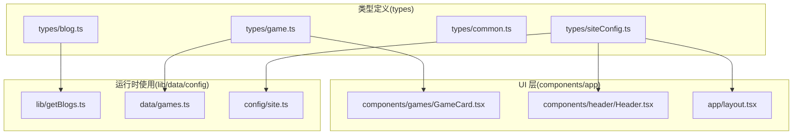
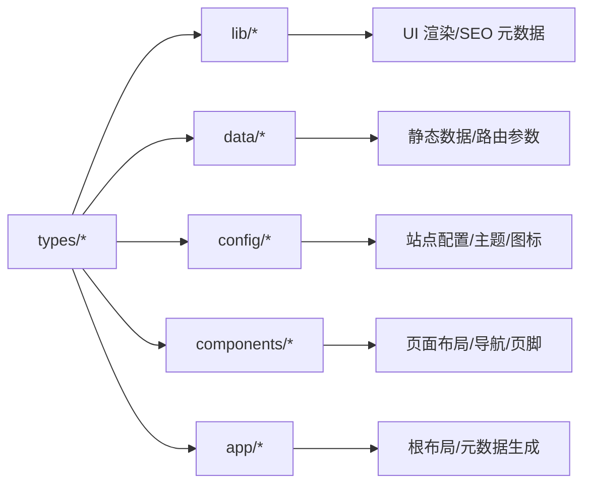
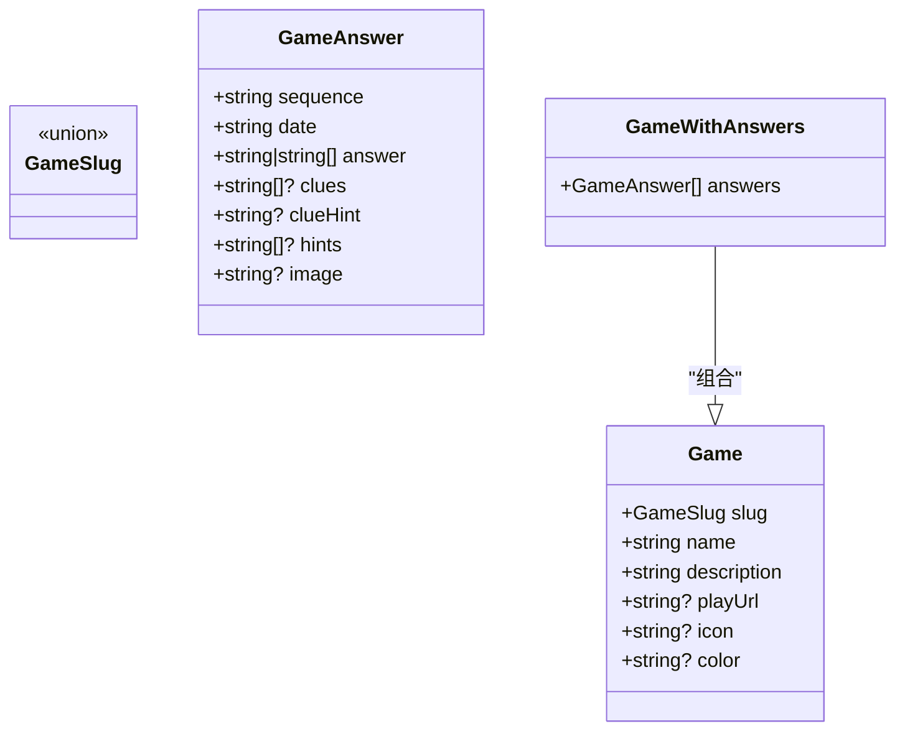
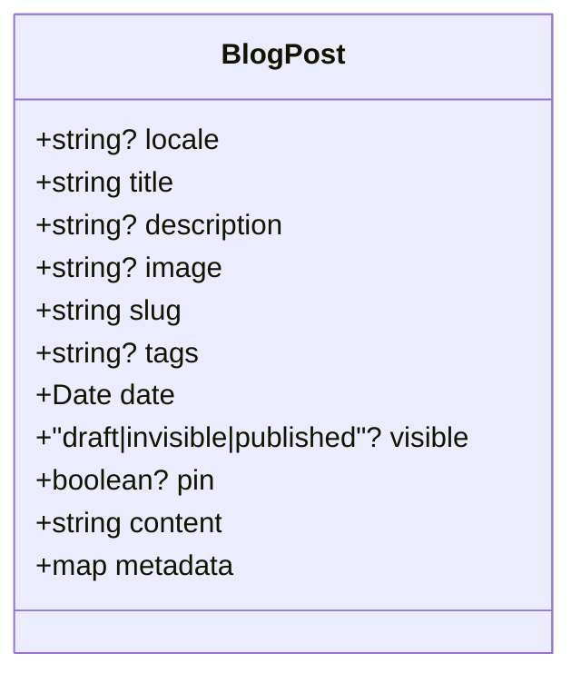
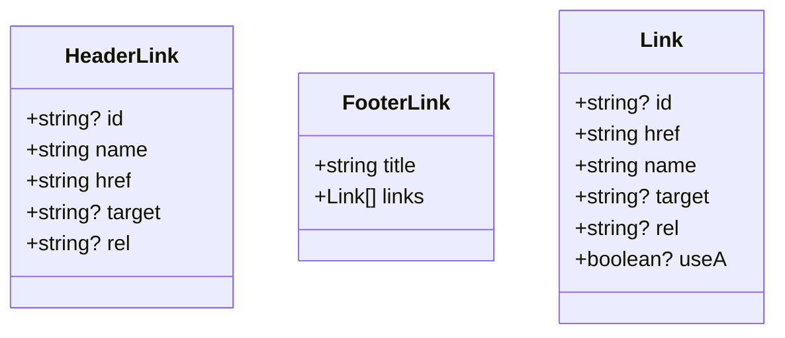
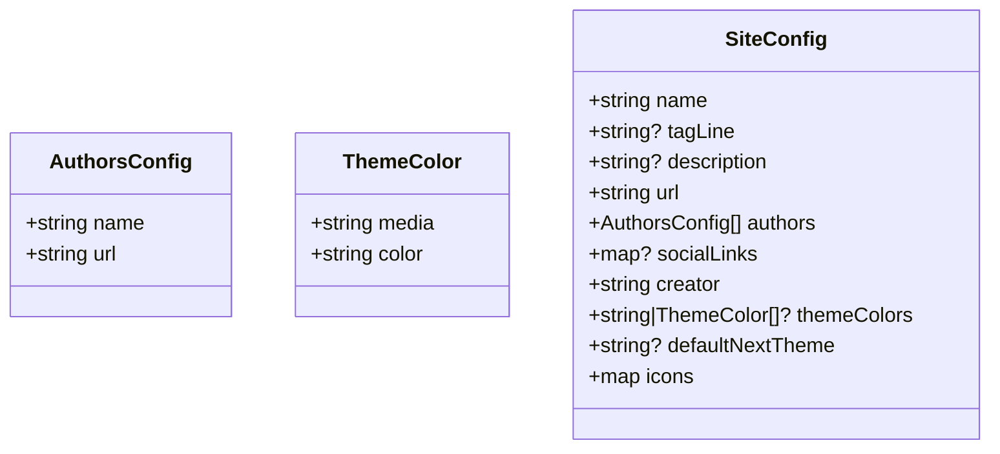
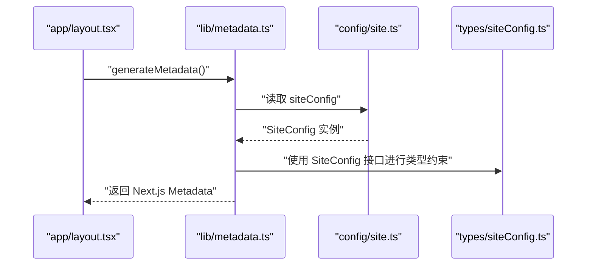
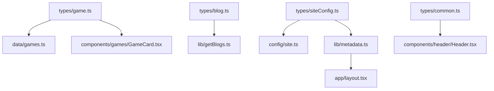

# 类型定义

<cite>
**本文引用的文件**
- [types/game.ts](file://types/game.ts)
- [types/blog.ts](file://types/blog.ts)
- [types/common.ts](file://types/common.ts)
- [types/siteConfig.ts](file://types/siteConfig.ts)
- [lib/getBlogs.ts](file://lib/getBlogs.ts)
- [data/games.ts](file://data/games.ts)
- [config/site.ts](file://config/site.ts)
- [lib/metadata.ts](file://lib/metadata.ts)
- [components/games/GameCard.tsx](file://components/games/GameCard.tsx)
- [components/header/Header.tsx](file://components/header/Header.tsx)
- [hooks/use-toast.ts](file://hooks/use-toast.ts)
- [components/mdx/Callout.tsx](file://components/mdx/Callout.tsx)
- [components/social-icons/icons.tsx](file://components/social-icons/icons.tsx)
- [app/layout.tsx](file://app/layout.tsx)
</cite>

## 目录
1. [引言](#引言)
2. [项目结构](#项目结构)
3. [核心组件](#核心组件)
4. [架构总览](#架构总览)
5. [详细组件分析](#详细组件分析)
6. [依赖分析](#依赖分析)
7. [性能考量](#性能考量)
8. [故障排查指南](#故障排查指南)
9. [结论](#结论)
10. [附录](#附录)

## 引言
本文件系统化梳理并阐述本仓库的类型定义体系，覆盖游戏类型、博客类型、通用类型与站点配置类型的设计理念、字段约束与使用场景，并结合实际代码中的应用展示类型推导与组合技巧。同时给出类型安全最佳实践、接口设计原则、向后兼容性建议以及扩展与自定义类型的实操指南。

## 项目结构
类型定义集中于 types 目录，围绕以下四类类型展开：
- 游戏类型：描述可玩的游戏元信息与答案数据结构
- 博客类型：描述内容型文章的数据结构
- 通用类型：描述导航、页脚等通用 UI 结构
- 站点配置类型：描述站点元信息、社交链接、主题色等配置

图表来源
- [types/game.ts](file://types/game.ts#L1-L27)
- [types/blog.ts](file://types/blog.ts#L1-L17)
- [types/common.ts](file://types/common.ts#L1-L21)
- [types/siteConfig.ts](file://types/siteConfig.ts#L1-L33)
- [lib/getBlogs.ts](file://lib/getBlogs.ts#L1-L65)
- [data/games.ts](file://data/games.ts#L1-L29)
- [config/site.ts](file://config/site.ts#L1-L45)
- [components/games/GameCard.tsx](file://components/games/GameCard.tsx#L1-L91)
- [components/header/Header.tsx](file://components/header/Header.tsx#L1-L45)
- [app/layout.tsx](file://app/layout.tsx#L1-L78)

章节来源
- [types/game.ts](file://types/game.ts#L1-L27)
- [types/blog.ts](file://types/blog.ts#L1-L17)
- [types/common.ts](file://types/common.ts#L1-L21)
- [types/siteConfig.ts](file://types/siteConfig.ts#L1-L33)

## 核心组件
本节从“类型设计—字段约束—使用场景—类型推导”的维度，逐类解析。

- 游戏类型（Game、GameSlug、GameAnswer、GameWithAnswers）
  - 设计要点
    - 使用字面量联合类型限定 slug 取值域，确保枚举式约束
    - 答案结构支持单值或数组，允许可选线索与提示，便于扩展不同玩法
    - 答案日期采用字符串格式，利于与外部数据源对齐
  - 字段约束
    - 必填：slug、name、description；可选：playUrl、icon、color
    - 答案对象：sequence、date、answer；可选：clues、clueHint、hints、image
  - 使用场景
    - 列表渲染：GameCard 组件消费 Game，按 color 选择样式
    - 数据加载：data/games.ts 提供静态 Game 数组与查询函数
    - 路由拼接：根据 slug 生成详情与归档页面路径
  - 类型推导
    - 通过交叉类型组合出带答案集合的 GameWithAnswers，实现“只读”答案集的类型安全

- 博客类型（BlogPost）
  - 设计要点
    - 以灰度标记 visible 控制发布状态，支持草稿/不可见/已发布三态
    - metadata 为任意键值对，保留 Markdown Front Matter 的灵活性
  - 字段约束
    - 必填：title、slug、date、content、metadata
    - 可选：locale、description、image、tags、visible、pin
  - 使用场景
    - 内容读取：lib/getBlogs.ts 读取本地目录，解析 Front Matter 并构造 BlogPost
    - 列表排序：按 pin 优先与时间倒序排列
  - 类型推导
    - 返回值 Promise<{ posts: BlogPost[] }>，明确返回结构，便于上层消费

- 通用类型（HeaderLink、FooterLink、Link）
  - 设计要点
    - 将导航与页脚链接抽象为可复用结构，统一 href、name、target、rel 等属性
    - FooterLink 以标题分组链接，提升组织性
  - 字段约束
    - HeaderLink：可选 id，必填 name、href，可选 target、rel
    - FooterLink：必填 title，links 为 Link[]；Link 同样包含 id、href、name、target、rel、useA
  - 使用场景
    - HeaderLinks 组件消费 HeaderLink，Footer 组件消费 FooterLink
  - 类型推导
    - 通过接口组合形成层级结构，避免重复定义，增强一致性

- 站点配置类型（SiteConfig、AuthorsConfig、ThemeColor）
  - 设计要点
    - 支持多作者 authors、可选社交链接、主题色数组或单一字符串
    - icons 提供 icon、shortcut、apple 多尺寸图标
  - 字段约束
    - 必填：name、url、authors、creator、icons
    - 可选：tagLine、description、socialLinks、themeColors、defaultNextTheme
  - 使用场景
    - 构建 SEO 元数据：lib/metadata.ts 消费 siteConfig 生成 Open Graph、Twitter 等
    - 布局与主题：app/layout.ts 读取 themeColors 与 defaultNextTheme
    - UI 展示：components/header/Header.tsx 使用 siteConfig.name 与图标
  - 类型推导
    - ThemeColor[] 与 string 联合，满足不同主题色配置需求

章节来源
- [types/game.ts](file://types/game.ts#L1-L27)
- [types/blog.ts](file://types/blog.ts#L1-L17)
- [types/common.ts](file://types/common.ts#L1-L21)
- [types/siteConfig.ts](file://types/siteConfig.ts#L1-L33)
- [lib/getBlogs.ts](file://lib/getBlogs.ts#L1-L65)
- [data/games.ts](file://data/games.ts#L1-L29)
- [config/site.ts](file://config/site.ts#L1-L45)
- [lib/metadata.ts](file://lib/metadata.ts#L1-L78)
- [components/games/GameCard.tsx](file://components/games/GameCard.tsx#L1-L91)
- [components/header/Header.tsx](file://components/header/Header.tsx#L1-L45)
- [app/layout.tsx](file://app/layout.tsx#L1-L78)

## 架构总览
类型系统在“定义—使用—推导—约束”四个层面协同工作：
- 定义：types 下的接口/类型声明
- 使用：lib、data、config、components、app 中消费类型
- 推导：TypeScript 自动推导与显式类型注解并用
- 约束：字面量联合、可选字段、只读集合等保障数据一致性

图表来源
- [types/game.ts](file://types/game.ts#L1-L27)
- [types/blog.ts](file://types/blog.ts#L1-L17)
- [types/common.ts](file://types/common.ts#L1-L21)
- [types/siteConfig.ts](file://types/siteConfig.ts#L1-L33)
- [lib/getBlogs.ts](file://lib/getBlogs.ts#L1-L65)
- [data/games.ts](file://data/games.ts#L1-L29)
- [config/site.ts](file://config/site.ts#L1-L45)
- [lib/metadata.ts](file://lib/metadata.ts#L1-L78)
- [components/games/GameCard.tsx](file://components/games/GameCard.tsx#L1-L91)
- [components/header/Header.tsx](file://components/header/Header.tsx#L1-L45)
- [app/layout.tsx](file://app/layout.tsx#L1-L78)

## 详细组件分析

### 游戏类型体系
- 类型关系
  - GameSlug：字面量联合，限定 slug 取值
  - GameAnswer：答案条目，支持多答案与可选线索/提示/图片
  - Game：游戏元信息
  - GameWithAnswers：在 Game 基础上附加答案数组

图表来源
- [types/game.ts](file://types/game.ts#L1-L27)

- 使用示例与场景
  - 列表渲染：GameCard 消费 Game，按 color 选择样式
  - 数据访问：data/games.ts 提供 getGameBySlug、getAllGames
  - 路由参数：根据 slug 生成页面路径

- 类型推导技巧
  - 交叉类型组合：GameWithAnswers = Game & { answers: GameAnswer[] }
  - 字面量联合：确保 slug 仅接受受控值，避免魔法字符串

章节来源
- [types/game.ts](file://types/game.ts#L1-L27)
- [data/games.ts](file://data/games.ts#L1-L29)
- [components/games/GameCard.tsx](file://components/games/GameCard.tsx#L1-L91)

### 博客类型体系
- 类型关系
  - BlogPost：统一文章结构，visible 控制发布态，metadata 保留原始 Front Matter

图表来源
- [types/blog.ts](file://types/blog.ts#L1-L17)

- 使用示例与场景
  - 内容读取：lib/getBlogs.ts 读取本地目录，解析 Front Matter 并构造 BlogPost
  - 列表排序：先 pin，再按日期倒序

- 类型推导技巧
  - 返回值 Promise<{ posts: BlogPost[] }>，明确结构，便于上层消费

章节来源
- [types/blog.ts](file://types/blog.ts#L1-L17)
- [lib/getBlogs.ts](file://lib/getBlogs.ts#L1-L65)

### 通用类型体系
- 类型关系
  - HeaderLink：导航项
  - FooterLink：页脚分组链接
  - Link：具体链接项

图表来源
- [types/common.ts](file://types/common.ts#L1-L21)

- 使用示例与场景
  - HeaderLinks 组件消费 HeaderLink
  - Footer 组件消费 FooterLink

章节来源
- [types/common.ts](file://types/common.ts#L1-L21)

### 站点配置类型体系
- 类型关系
  - AuthorsConfig：作者信息
  - ThemeColor：媒体查询与颜色映射
  - SiteConfig：站点主配置

图表来源
- [types/siteConfig.ts](file://types/siteConfig.ts#L1-L33)

- 使用示例与场景
  - 构建元数据：lib/metadata.ts 消费 siteConfig 生成 Open Graph、Twitter 等
  - 主题与图标：app/layout.ts 读取 themeColors 与 defaultNextTheme
  - UI 展示：components/header/Header.tsx 使用 siteConfig.name 与图标

章节来源
- [types/siteConfig.ts](file://types/siteConfig.ts#L1-L33)
- [config/site.ts](file://config/site.ts#L1-L45)
- [lib/metadata.ts](file://lib/metadata.ts#L1-L78)
- [app/layout.tsx](file://app/layout.tsx#L1-L78)
- [components/header/Header.tsx](file://components/header/Header.tsx#L1-L45)

### API/服务组件流程（以元数据构建为例）

图表来源
- [app/layout.tsx](file://app/layout.tsx#L18-L26)
- [lib/metadata.ts](file://lib/metadata.ts#L1-L78)
- [config/site.ts](file://config/site.ts#L1-L45)
- [types/siteConfig.ts](file://types/siteConfig.ts#L1-L33)

## 依赖分析
- 类型到实现的依赖
  - types/game.ts → data/games.ts → components/games/GameCard.tsx
  - types/blog.ts → lib/getBlogs.ts
  - types/siteConfig.ts → config/site.ts → lib/metadata.ts → app/layout.tsx
  - types/common.ts → components/header/Header.tsx

图表来源
- [types/game.ts](file://types/game.ts#L1-L27)
- [types/blog.ts](file://types/blog.ts#L1-L17)
- [types/common.ts](file://types/common.ts#L1-L21)
- [types/siteConfig.ts](file://types/siteConfig.ts#L1-L33)
- [data/games.ts](file://data/games.ts#L1-L29)
- [lib/getBlogs.ts](file://lib/getBlogs.ts#L1-L65)
- [config/site.ts](file://config/site.ts#L1-L45)
- [lib/metadata.ts](file://lib/metadata.ts#L1-L78)
- [components/games/GameCard.tsx](file://components/games/GameCard.tsx#L1-L91)
- [components/header/Header.tsx](file://components/header/Header.tsx#L1-L45)
- [app/layout.tsx](file://app/layout.tsx#L1-L78)

章节来源
- [types/game.ts](file://types/game.ts#L1-L27)
- [types/blog.ts](file://types/blog.ts#L1-L17)
- [types/common.ts](file://types/common.ts#L1-L21)
- [types/siteConfig.ts](file://types/siteConfig.ts#L1-L33)
- [data/games.ts](file://data/games.ts#L1-L29)
- [lib/getBlogs.ts](file://lib/getBlogs.ts#L1-L65)
- [config/site.ts](file://config/site.ts#L1-L45)
- [lib/metadata.ts](file://lib/metadata.ts#L1-L78)
- [components/games/GameCard.tsx](file://components/games/GameCard.tsx#L1-L91)
- [components/header/Header.tsx](file://components/header/Header.tsx#L1-L45)
- [app/layout.tsx](file://app/layout.tsx#L1-L78)

## 性能考量
- 类型层面
  - 使用字面量联合类型限制枚举值，减少分支判断开销与运行时校验成本
  - 通过交叉类型组合避免重复字段定义，降低维护成本
- 运行时层面
  - 博客批量读取与排序：lib/getBlogs.ts 采用分批读取与一次性过滤/排序，避免全量同步处理
  - 元数据构建：lib/metadata.ts 复用 siteConfig，避免重复计算

## 故障排查指南
- 常见问题与定位
  - 博客可见性异常：检查 BlogPost.visible 是否符合预期枚举值
  - 游戏颜色样式缺失：确认 Game.color 是否在样式映射中存在对应键
  - 站点主题色不生效：核对 SiteConfig.themeColors 类型与媒体查询表达式
- 调试建议
  - 在关键函数处添加类型断言与日志，验证输入是否符合类型约束
  - 使用 TypeScript 的“严格模式”与“noImplicitAny”，尽早暴露类型不匹配

章节来源
- [lib/getBlogs.ts](file://lib/getBlogs.ts#L1-L65)
- [components/games/GameCard.tsx](file://components/games/GameCard.tsx#L1-L91)
- [lib/metadata.ts](file://lib/metadata.ts#L1-L78)

## 结论
本类型定义体系以“明确约束—清晰推导—可扩展组合”为核心设计思想，既保证了数据结构的一致性与安全性，又兼顾了内容与站点配置的灵活性。通过字面量联合、可选字段与交叉类型等手段，实现了良好的类型安全与可维护性。建议在新增类型时遵循现有命名与约束风格，保持向后兼容与最小破坏变更。

## 附录

### 类型安全最佳实践
- 优先使用字面量联合类型限定枚举值
- 对外暴露的接口尽量使用只读与可选字段，避免隐式必填
- 通过交叉类型组合模块化结构，减少重复定义
- 在公共模块中明确返回值类型，便于上层消费

### 接口设计原则
- 单一职责：每个接口聚焦一类实体或概念
- 可扩展性：为未来字段预留可选空间
- 明确边界：对外 API 与内部实现分离，避免泄露实现细节

### 向后兼容性考虑
- 新增字段应设为可选，避免强制迁移
- 避免删除或重命名已有字段；如需变更，提供过渡期的兼容层
- 对于枚举值，新增值不影响旧逻辑，但删除值需谨慎

### 类型扩展指南与自定义类型创建方法
- 扩展游戏类型
  - 若需新增玩法字段，可在 GameAnswer 或 Game 上增加可选字段，保持默认值或空值策略
  - 如需新增 slug，更新 GameSlug 联合类型并同步路由与数据源
- 扩展博客类型
  - 若需要更严格的 Front Matter 约束，可引入更细粒度的接口或工具函数进行校验
  - 对 metadata 的任意键值，建议在消费端做防御性读取与类型守卫
- 扩展通用类型
  - HeaderLink/FooterLink/Link 可按页面需求扩展，但需保持与 UI 组件的契约一致
- 扩展站点配置类型
  - 新增社交平台时，在 SiteConfig.socialLinks 中添加可选键，避免破坏现有配置
  - 主题色支持字符串或数组，新增媒体查询时保持与现有断言一致

### 泛型与类型推导示例（路径指引）
- 交叉类型组合：参见 [types/game.ts](file://types/game.ts#L24-L26)
- 返回值类型推导：参见 [lib/getBlogs.ts](file://lib/getBlogs.ts#L8-L65)
- 组件 props 类型：参见 [components/games/GameCard.tsx](file://components/games/GameCard.tsx#L6-L8)
- UI 组件 props 类型：参见 [components/mdx/Callout.tsx](file://components/mdx/Callout.tsx#L3-L7)
- SVG 组件 props 类型：参见 [components/social-icons/icons.tsx](file://components/social-icons/icons.tsx#L1-L20)
- 自定义 Hook 返回值类型：参见 [hooks/use-toast.ts](file://hooks/use-toast.ts#L14-L19)