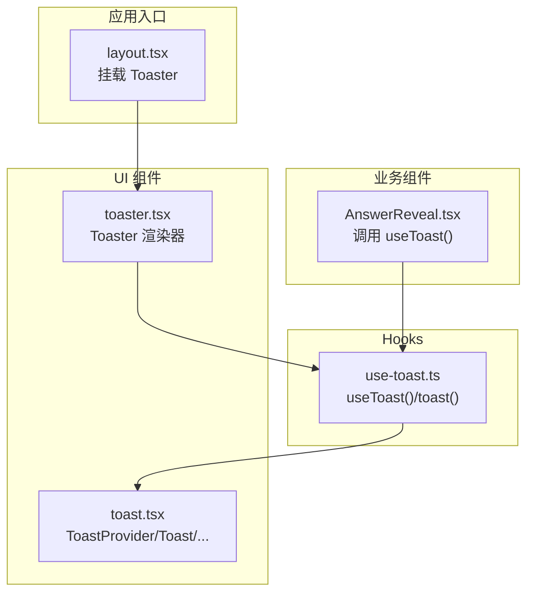
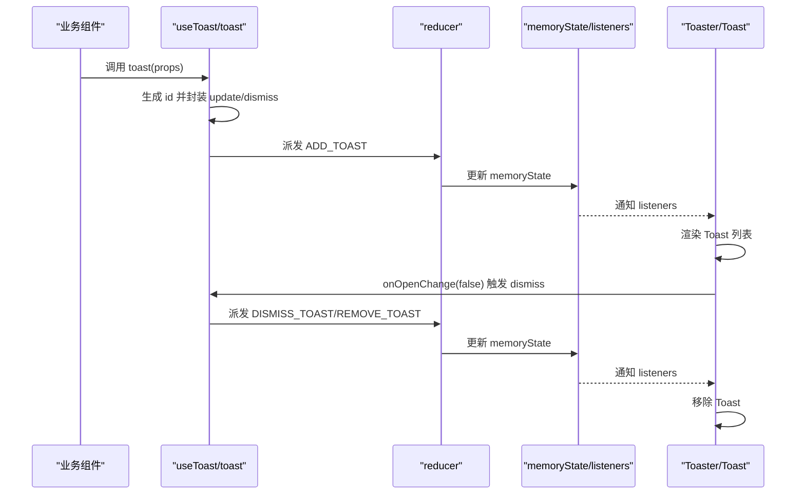
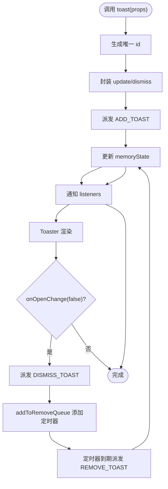
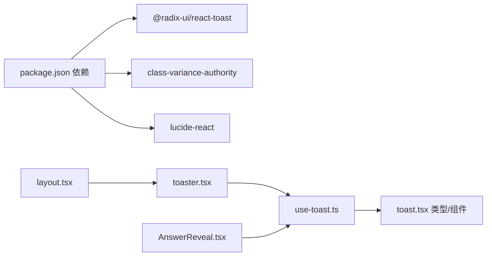

# 自定义 Hook

<cite>
**本文引用的文件列表**
- [hooks/use-toast.ts](file://hooks/use-toast.ts)
- [components/ui/toast.tsx](file://components/ui/toast.tsx)
- [components/ui/toaster.tsx](file://components/ui/toaster.tsx)
- [components/games/AnswerReveal.tsx](file://components/games/AnswerReveal.tsx)
- [app/layout.tsx](file://app/layout.tsx)
- [package.json](file://package.json)
</cite>

## 目录
1. [简介](#简介)
2. [项目结构](#项目结构)
3. [核心组件](#核心组件)
4. [架构总览](#架构总览)
5. [详细组件分析](#详细组件分析)
6. [依赖关系分析](#依赖关系分析)
7. [性能考量](#性能考量)
8. [故障排查指南](#故障排查指南)
9. [结论](#结论)
10. [附录：使用示例与最佳实践](#附录使用示例与最佳实践)

## 简介
本文件围绕 use-toast 自定义 Hook 进行系统化文档化，涵盖其设计原理、实现细节、状态管理机制、事件处理逻辑、生命周期管理、依赖关系、副作用处理、错误边界、与其他组件的集成方式以及扩展方法。目标是帮助开发者快速理解并正确使用该 Hook，同时在复杂场景中进行安全扩展与优化。

## 项目结构
use-toast 位于 hooks 目录，配套的 UI 组件位于 components/ui，实际渲染容器 Toaster 组件位于 components/ui，业务组件中通过 useToast 调用，根布局 app/layout.tsx 中挂载 Toaster，形成“Hook 提供状态与动作 -> UI 容器消费状态 -> 业务组件触发动作”的完整链路。

图表来源
- [hooks/use-toast.ts](file://hooks/use-toast.ts#L174-L192)
- [components/ui/toast.tsx](file://components/ui/toast.tsx#L10-L129)
- [components/ui/toaster.tsx](file://components/ui/toaster.tsx#L13-L35)
- [components/games/AnswerReveal.tsx](file://components/games/AnswerReveal.tsx#L14-L37)
- [app/layout.tsx](file://app/layout.tsx#L61-L61)

章节来源
- [hooks/use-toast.ts](file://hooks/use-toast.ts#L1-L195)
- [components/ui/toast.tsx](file://components/ui/toast.tsx#L1-L130)
- [components/ui/toaster.tsx](file://components/ui/toaster.tsx#L1-L36)
- [components/games/AnswerReveal.tsx](file://components/games/AnswerReveal.tsx#L1-L83)
- [app/layout.tsx](file://app/layout.tsx#L1-L78)

## 核心组件
- useToast Hook：提供全局 toast 状态与动作（toast、dismiss），内部维护内存状态并通过订阅者模式向所有订阅者推送更新。
- toast 工厂函数：用于创建并调度一个新 toast，返回可操作对象（id、dismiss、update）。
- reducer：纯函数式状态机，负责 ADD/UPDATE/DISMISS/REMOVE 四类动作的分发与状态计算。
- Toaster 渲染器：消费 useToast 返回的状态，将 toasts 渲染为 Radix UI Toast 组件树。
- UI 组件层：基于 @radix-ui/react-toast 与 class-variance-authority 实现样式变体与交互。

章节来源
- [hooks/use-toast.ts](file://hooks/use-toast.ts#L174-L192)
- [hooks/use-toast.ts](file://hooks/use-toast.ts#L145-L172)
- [hooks/use-toast.ts](file://hooks/use-toast.ts#L77-L130)
- [components/ui/toaster.tsx](file://components/ui/toaster.tsx#L13-L35)
- [components/ui/toast.tsx](file://components/ui/toast.tsx#L10-L129)

## 架构总览
use-toast 采用“内存状态 + 订阅者模式 + 纯函数 reducer”的架构：
- 内存状态 memoryState：全局共享的不可变状态副本。
- listeners：订阅 useToast 的组件集合，每次 dispatch 后广播给所有监听者。
- reducer：根据动作类型对内存状态进行不可变更新，并返回新的状态。
- toast 工厂：生成唯一 id，封装 update/dismiss，并派发 ADD_TOAST 动作。
- useToast：将内存状态与 React 状态绑定，建立订阅并在卸载时清理。

图表来源
- [hooks/use-toast.ts](file://hooks/use-toast.ts#L145-L172)
- [hooks/use-toast.ts](file://hooks/use-toast.ts#L77-L130)
- [hooks/use-toast.ts](file://hooks/use-toast.ts#L174-L192)
- [components/ui/toaster.tsx](file://components/ui/toaster.tsx#L13-L35)
- [components/ui/toast.tsx](file://components/ui/toast.tsx#L10-L129)

## 详细组件分析

### useToast Hook 设计与实现
- 状态与动作
  - 返回值包含当前 toasts 数组与三个动作：toast、dismiss、以及从内存状态解构出的其他字段。
  - toast 工厂函数负责创建带唯一 id 的 toast，并自动设置 open 与 onOpenChange 回调以支持自动关闭。
- 订阅机制
  - 在 useEffect 中将 setState 推入 listeners，组件卸载时从 listeners 中移除，避免泄漏。
  - dispatch 将内存状态更新后，遍历 listeners 调用，使所有订阅者同步收到最新状态。
- 生命周期管理
  - 初始化：useToast 以 memoryState 作为初始 React 状态。
  - 卸载：清理 listeners，防止后续 dispatch 导致无效更新。
- 副作用与副作用处理
  - onOpenChange 为副作用：当 toast 关闭时触发 dismiss，进而触发 REMOVE_TOAST。
  - addToRemoveQueue 使用 Map 存储定时器，避免重复添加；定时结束后删除 Map 中条目并派发 REMOVE_TOAST。
- 错误边界
  - 当传入的 toastId 不存在或已移除时，DISMISS_TOAST/REMOVE_TOAST 会安全地跳过对应项，不会抛错。
- 性能特性
  - 纯函数 reducer，不可变更新，便于 React 识别变更。
  - TOAST_LIMIT 限制仅保留最近一条 toast，降低渲染与内存压力。
  - TOAST_REMOVE_DELAY 设置为较大值，配合 onOpenChange 控制关闭时机，避免频繁重排。

图表来源
- [hooks/use-toast.ts](file://hooks/use-toast.ts#L145-L172)
- [hooks/use-toast.ts](file://hooks/use-toast.ts#L61-L75)
- [hooks/use-toast.ts](file://hooks/use-toast.ts#L77-L130)
- [hooks/use-toast.ts](file://hooks/use-toast.ts#L174-L192)

章节来源
- [hooks/use-toast.ts](file://hooks/use-toast.ts#L174-L192)
- [hooks/use-toast.ts](file://hooks/use-toast.ts#L145-L172)
- [hooks/use-toast.ts](file://hooks/use-toast.ts#L61-L75)
- [hooks/use-toast.ts](file://hooks/use-toast.ts#L77-L130)

### toast 工厂函数与动作封装
- 生成唯一 id：genId 通过递增计数取模保证 id 唯一性。
- update：派发 UPDATE_TOAST，合并部分属性到指定 toast。
- dismiss：派发 DISMISS_TOAST，触发关闭动画与定时移除。
- ADD_TOAST：设置 open 为 true，并注册 onOpenChange 回调，确保 toast 关闭后自动移除。

章节来源
- [hooks/use-toast.ts](file://hooks/use-toast.ts#L145-L172)
- [hooks/use-toast.ts](file://hooks/use-toast.ts#L30-L33)

### reducer 状态机
- ADD_TOAST：将新 toast 放入数组头部，并按 TOAST_LIMIT 截断。
- UPDATE_TOAST：按 id 合并属性，保持其他 toast 不变。
- DISMISS_TOAST：对指定或全部 toast 设置 open=false，并加入移除队列。
- REMOVE_TOAST：从数组中移除指定或全部 toast。

章节来源
- [hooks/use-toast.ts](file://hooks/use-toast.ts#L77-L130)

### Toaster 渲染器与 UI 组件
- Toaster：从 useToast 获取 toasts，逐个渲染 Toast，支持标题、描述、动作与关闭按钮。
- UI 组件层：基于 Radix UI Toast Provider/Root/Viewport 等构建，支持变体样式与动画。

章节来源
- [components/ui/toaster.tsx](file://components/ui/toaster.tsx#L13-L35)
- [components/ui/toast.tsx](file://components/ui/toast.tsx#L10-L129)

### 业务组件中的使用示例
- AnswerReveal：在复制答案成功/失败时调用 toast，展示成功或错误提示，并在成功后短暂切换按钮状态。

章节来源
- [components/games/AnswerReveal.tsx](file://components/games/AnswerReveal.tsx#L14-L37)

## 依赖关系分析
- 外部依赖
  - @radix-ui/react-toast：提供无障碍、可访问的 Toast 原语。
  - class-variance-authority：提供样式变体能力，简化变体组合。
  - lucide-react：图标库，用于关闭按钮等。
- 内部依赖
  - use-toast 依赖 toast.tsx 的类型与组件。
  - Toaster 依赖 use-toast 的状态与动作。
  - 业务组件通过 useToast 触发 toast。

图表来源
- [package.json](file://package.json#L16-L51)
- [hooks/use-toast.ts](file://hooks/use-toast.ts#L6-L9)
- [components/ui/toast.tsx](file://components/ui/toast.tsx#L3-L8)
- [components/ui/toaster.tsx](file://components/ui/toaster.tsx#L3-L11)
- [components/games/AnswerReveal.tsx](file://components/games/AnswerReveal.tsx#L5-L5)
- [app/layout.tsx](file://app/layout.tsx#L8-L8)

章节来源
- [package.json](file://package.json#L16-L51)
- [hooks/use-toast.ts](file://hooks/use-toast.ts#L6-L9)
- [components/ui/toast.tsx](file://components/ui/toast.tsx#L3-L8)
- [components/ui/toaster.tsx](file://components/ui/toaster.tsx#L3-L11)
- [components/games/AnswerReveal.tsx](file://components/games/AnswerReveal.tsx#L5-L5)
- [app/layout.tsx](file://app/layout.tsx#L8-L8)

## 性能考量
- 状态更新成本低：reducer 为纯函数，不可变更新，React 可高效 diff。
- 渲染数量控制：TOAST_LIMIT 限制为 1，避免多 toast 渲染带来的 DOM 压力。
- 自动关闭策略：通过 onOpenChange 与定时器结合，减少手动管理开销。
- 订阅者清理：useEffect 清理 listeners，避免内存泄漏与无效渲染。
- 动画与交互：Radix UI 动画由原语驱动，性能稳定且可访问性良好。

[本节为通用性能建议，不直接分析具体文件]

## 故障排查指南
- toast 不显示
  - 确认根布局已挂载 Toaster。
  - 检查是否在客户端组件中使用 useToast。
- toast 无法关闭
  - 检查 onOpenChange 是否被覆盖或阻止。
  - 确认未手动设置 open=true 或未阻止默认行为。
- 多个 toast 同时存在
  - TOAST_LIMIT 为 1，若需要多条 toast，请调整限制并确保 UI 层支持多条渲染。
- 内存泄漏或异常渲染
  - 确保组件卸载时未持有旧的 setState 引用；useToast 已在卸载时清理 listeners。
- 动作无效
  - 确认传入的 toastId 是否仍存在于当前 toasts 中；DISMISS_TOAST/REMOVE_TOAST 对不存在的 id 会安全跳过。

章节来源
- [app/layout.tsx](file://app/layout.tsx#L61-L61)
- [hooks/use-toast.ts](file://hooks/use-toast.ts#L174-L192)
- [hooks/use-toast.ts](file://hooks/use-toast.ts#L77-L130)

## 结论
use-toast 通过“内存状态 + 订阅者模式 + 纯函数 reducer”的设计，在保证易用性的同时兼顾了性能与可维护性。其与 Radix UI 的深度集成提供了良好的可访问性与动画体验。通过 Toaster 统一渲染与业务组件按需触发，形成了清晰的职责分离。建议在复杂场景中遵循现有模式进行扩展，如增加更多动作类型、支持批量 dismiss、或引入持久化策略。

[本节为总结性内容，不直接分析具体文件]

## 附录：使用示例与最佳实践

### 使用示例
- 在业务组件中调用 toast
  - 示例路径：[components/games/AnswerReveal.tsx](file://components/games/AnswerReveal.tsx#L14-L37)
- 在根布局挂载 Toaster
  - 示例路径：[app/layout.tsx](file://app/layout.tsx#L61-L61)

### 最佳实践
- 保持 toast 的简洁信息，避免长文本导致阅读困难。
- 使用 variant 区分成功/错误等语义，提升可读性。
- 避免在同一页面内频繁触发大量 toast，必要时合并消息或延迟触发。
- 在用户交互后立即反馈，如复制成功、提交成功等。
- 如需多条 toast，考虑调整 TOAST_LIMIT 并相应修改 Toaster 渲染逻辑。

### 扩展方法
- 新增动作类型：在 actionTypes 与 Action 类型中新增枚举与分支，扩展 reducer。
- 增加持久化：将 memoryState 与本地存储结合，实现刷新后恢复 toast。
- 批量管理：为 dismiss 增加批量参数，或提供 clearAll 动作。
- 主题与样式：通过 UI 组件层的变体系统统一管理样式，避免在业务层分散配置。

章节来源
- [components/games/AnswerReveal.tsx](file://components/games/AnswerReveal.tsx#L14-L37)
- [app/layout.tsx](file://app/layout.tsx#L61-L61)
- [hooks/use-toast.ts](file://hooks/use-toast.ts#L21-L26)
- [hooks/use-toast.ts](file://hooks/use-toast.ts#L37-L53)
- [hooks/use-toast.ts](file://hooks/use-toast.ts#L77-L130)
- [components/ui/toaster.tsx](file://components/ui/toaster.tsx#L13-L35)
- [components/ui/toast.tsx](file://components/ui/toast.tsx#L27-L41)