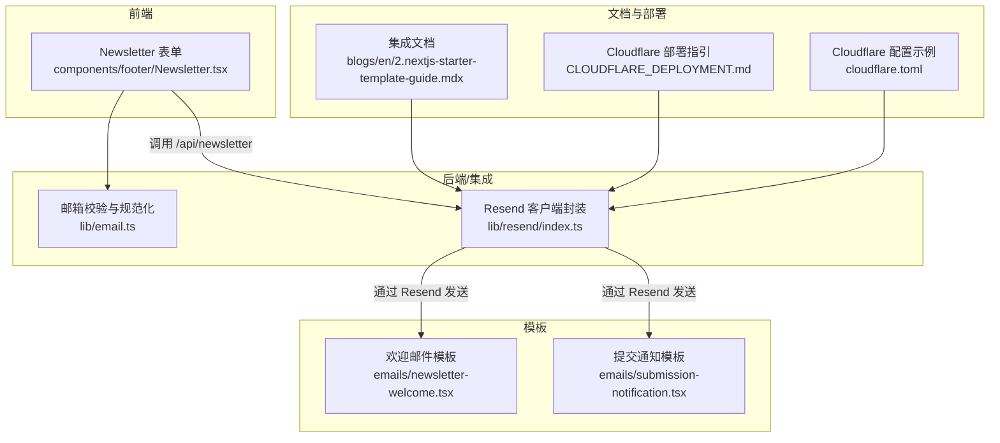
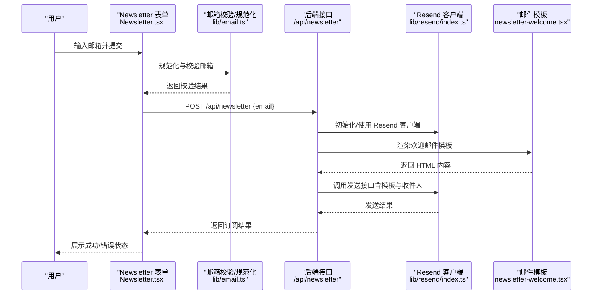
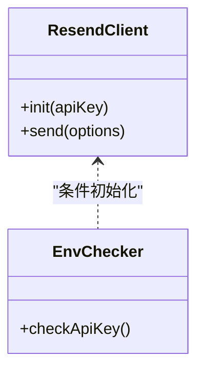
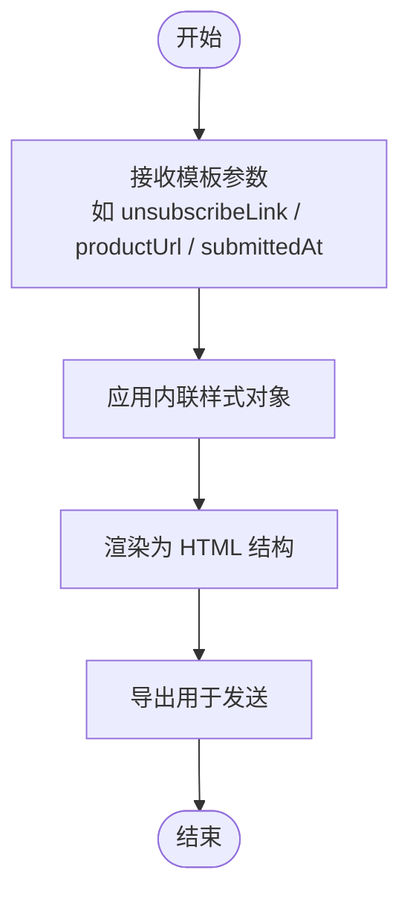
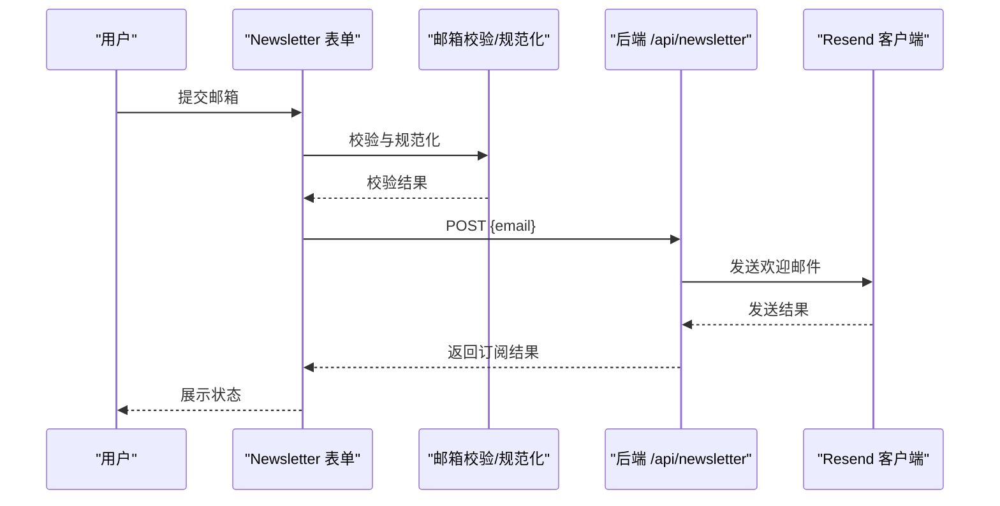
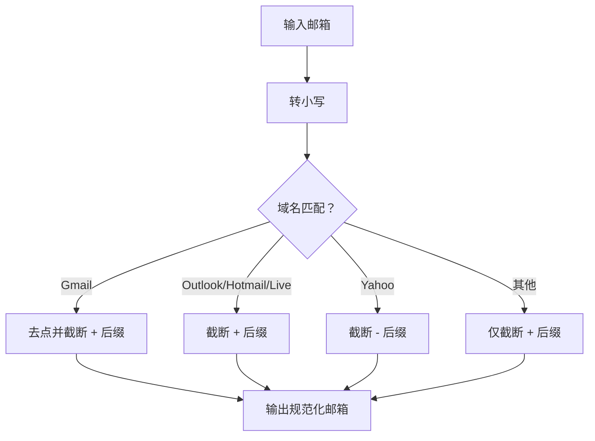
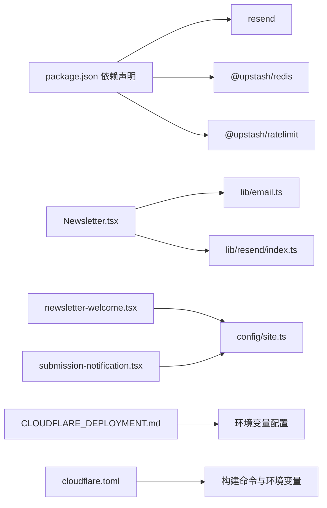

# 邮件服务集成

<cite>
**本文引用的文件**
- [lib/email.ts](file://lib/email.ts)
- [lib/resend/index.ts](file://lib/resend/index.ts)
- [emails/newsletter-welcome.tsx](file://emails/newsletter-welcome.tsx)
- [emails/submission-notification.tsx](file://emails/submission-notification.tsx)
- [components/footer/Newsletter.tsx](file://components/footer/Newsletter.tsx)
- [blogs/en/2.nextjs-starter-template-guide.mdx](file://blogs/en/2.nextjs-starter-template-guide.mdx)
- [CLOUDFLARE_DEPLOYMENT.md](file://CLOUDFLARE_DEPLOYMENT.md)
- [cloudflare.toml](file://cloudflare.toml)
- [package.json](file://package.json)
</cite>

## 目录
1. [简介](#简介)
2. [项目结构](#项目结构)
3. [核心组件](#核心组件)
4. [架构总览](#架构总览)
5. [详细组件分析](#详细组件分析)
6. [依赖关系分析](#依赖关系分析)
7. [性能考量](#性能考量)
8. [故障排查指南](#故障排查指南)
9. [结论](#结论)
10. [附录](#附录)

## 简介
本文件系统性阐述本项目的邮件服务集成方案，重点围绕 Resend 邮件服务的配置、集成与使用展开；同时覆盖邮件模板的设计、渲染与发送流程，提供 API 集成示例、错误处理策略、性能优化建议，并解释邮件队列管理、模板变量处理与个性化内容生成等主题。文档面向不同技术背景的读者，既提供高层概览，也给出可操作的落地步骤与最佳实践。

## 项目结构
围绕邮件服务的关键文件分布如下：
- 邮件客户端初始化与封装：lib/resend/index.ts
- 邮件模板（React 组件）：emails/newsletter-welcome.tsx、emails/submission-notification.tsx
- 前端订阅表单与调用：components/footer/Newsletter.tsx
- 邮件相关校验与规范化：lib/email.ts
- 文档与部署指引：blogs/en/2.nextjs-starter-template-guide.mdx、CLOUDFLARE_DEPLOYMENT.md、cloudflare.toml
- 依赖声明：package.json

图表来源
- [components/footer/Newsletter.tsx](file://components/footer/Newsletter.tsx#L15-L55)
- [lib/email.ts](file://lib/email.ts#L15-L53)
- [lib/resend/index.ts](file://lib/resend/index.ts#L1-L11)
- [emails/newsletter-welcome.tsx](file://emails/newsletter-welcome.tsx#L1-L99)
- [emails/submission-notification.tsx](file://emails/submission-notification.tsx#L1-L101)
- [blogs/en/2.nextjs-starter-template-guide.mdx](file://blogs/en/2.nextjs-starter-template-guide.mdx#L117-L137)
- [CLOUDFLARE_DEPLOYMENT.md](file://CLOUDFLARE_DEPLOYMENT.md#L209-L228)
- [cloudflare.toml](file://cloudflare.toml#L1-L13)

章节来源
- [lib/resend/index.ts](file://lib/resend/index.ts#L1-L11)
- [lib/email.ts](file://lib/email.ts#L1-L91)
- [emails/newsletter-welcome.tsx](file://emails/newsletter-welcome.tsx#L1-L99)
- [emails/submission-notification.tsx](file://emails/submission-notification.tsx#L1-L101)
- [components/footer/Newsletter.tsx](file://components/footer/Newsletter.tsx#L1-L91)
- [blogs/en/2.nextjs-starter-template-guide.mdx](file://blogs/en/2.nextjs-starter-template-guide.mdx#L117-L137)
- [CLOUDFLARE_DEPLOYMENT.md](file://CLOUDFLARE_DEPLOYMENT.md#L209-L228)
- [cloudflare.toml](file://cloudflare.toml#L1-L13)
- [package.json](file://package.json#L45-L45)

## 核心组件
- 邮件客户端封装（Resend）
  - 作用：在运行时按需初始化 Resend 客户端，读取环境变量 RESEND_API_KEY，若缺失则记录警告。
  - 关键路径：[lib/resend/index.ts](file://lib/resend/index.ts#L1-L11)
- 邮件模板（React 组件）
  - 欢迎邮件模板：包含站点标识、欢迎语、退订链接与版权信息。
    - 关键路径：[emails/newsletter-welcome.tsx](file://emails/newsletter-welcome.tsx#L1-L99)
  - 提交通知模板：展示产品链接与提交时间等信息。
    - 关键路径：[emails/submission-notification.tsx](file://emails/submission-notification.tsx#L1-L101)
- 前端订阅表单
  - 功能：收集邮箱、执行本地校验与规范化、调用后端接口完成订阅与欢迎邮件发送。
    - 关键路径：[components/footer/Newsletter.tsx](file://components/footer/Newsletter.tsx#L15-L55)
- 邮箱校验与规范化
  - 功能：格式校验、长度限制、禁用一次性邮箱、特殊字符过滤、别名规则（如 Gmail/Outlook/Yahoo）。
    - 关键路径：[lib/email.ts](file://lib/email.ts#L15-L53)、[lib/email.ts](file://lib/email.ts#L56-L91)

章节来源
- [lib/resend/index.ts](file://lib/resend/index.ts#L1-L11)
- [emails/newsletter-welcome.tsx](file://emails/newsletter-welcome.tsx#L1-L99)
- [emails/submission-notification.tsx](file://emails/submission-notification.tsx#L1-L101)
- [components/footer/Newsletter.tsx](file://components/footer/Newsletter.tsx#L15-L55)
- [lib/email.ts](file://lib/email.ts#L15-L53)
- [lib/email.ts](file://lib/email.ts#L56-L91)

## 架构总览
下图展示了从前端表单到模板渲染与邮件发送的整体流程，以及与 Resend 的交互方式。

图表来源
- [components/footer/Newsletter.tsx](file://components/footer/Newsletter.tsx#L15-L55)
- [lib/email.ts](file://lib/email.ts#L15-L53)
- [lib/resend/index.ts](file://lib/resend/index.ts#L1-L11)
- [emails/newsletter-welcome.tsx](file://emails/newsletter-welcome.tsx#L1-L99)

## 详细组件分析

### 组件一：Resend 客户端封装
- 设计要点
  - 条件初始化：仅当存在 RESEND_API_KEY 时才实例化 Resend 客户端，避免在无密钥环境下误初始化。
  - 导出默认实例：供其他模块直接导入使用，降低耦合度。
- 错误处理
  - 当缺少密钥时，控制台输出警告，便于开发阶段及时发现配置问题。
- 可扩展性
  - 若未来需要多客户端或动态切换密钥，可在当前封装基础上增加工厂模式或配置中心。

图表来源
- [lib/resend/index.ts](file://lib/resend/index.ts#L1-L11)

章节来源
- [lib/resend/index.ts](file://lib/resend/index.ts#L1-L11)

### 组件二：邮件模板（React 组件）
- 设计原则
  - 结构清晰：容器、卡片、标题、段落、页脚等模块化样式对象，便于维护与复用。
  - 个性化：通过 props 注入变量（如退订链接、产品链接、提交时间），实现模板参数化。
  - 可访问性：使用语义化标签与明确的文本层级。
- 渲染与发送
  - 模板以 React 组件形式渲染为 HTML 字符串，再由 Resend 客户端发送。
  - 退订链接与站点信息来自全局配置，确保一致性与可追踪性。

图表来源
- [emails/newsletter-welcome.tsx](file://emails/newsletter-welcome.tsx#L4-L55)
- [emails/submission-notification.tsx](file://emails/submission-notification.tsx#L4-L64)

章节来源
- [emails/newsletter-welcome.tsx](file://emails/newsletter-welcome.tsx#L1-L99)
- [emails/submission-notification.tsx](file://emails/submission-notification.tsx#L1-L101)

### 组件三：前端订阅表单与调用链
- 表单逻辑
  - 输入收集与本地校验：调用邮箱校验与规范化函数，返回错误码或通过。
  - 请求发送：向 /api/newsletter 发起 POST 请求，携带规范化后的邮箱地址。
  - 状态反馈：根据响应更新 UI 状态（加载/成功/错误）。
- 错误处理
  - 对网络异常、后端错误进行捕获与提示，避免页面崩溃。
  - 成功后清空输入并重置状态，提升用户体验。

图表来源
- [components/footer/Newsletter.tsx](file://components/footer/Newsletter.tsx#L15-L55)
- [lib/email.ts](file://lib/email.ts#L15-L53)
- [lib/resend/index.ts](file://lib/resend/index.ts#L1-L11)

章节来源
- [components/footer/Newsletter.tsx](file://components/footer/Newsletter.tsx#L1-L91)
- [lib/email.ts](file://lib/email.ts#L15-L53)

### 组件四：邮箱校验与规范化
- 校验维度
  - 格式：使用正则表达式约束整体长度与局部长度。
  - 域名：限制域名与本地部分长度。
  - 禁用一次性邮箱：对特定域名进行拦截。
  - 特殊字符：禁止危险字符出现在本地部分。
- 规范化策略
  - 统一小写。
  - 针对不同邮箱服务商的别名规则进行处理（如移除加号后缀、Gmail 去点与加号等）。
- 复杂度
  - 校验与规范化均为 O(n) 时间复杂度，空间复杂度 O(1) 或 O(n)（取决于字符串处理）。

图表来源
- [lib/email.ts](file://lib/email.ts#L56-L91)

章节来源
- [lib/email.ts](file://lib/email.ts#L1-L91)

## 依赖关系分析
- 外部依赖
  - resend：邮件服务 SDK，负责发送邮件。
  - @upstash/redis 与 @upstash/ratelimit：用于速率限制与防刷（文档中提及）。
- 内部依赖
  - 前端表单依赖邮箱校验与 Resend 客户端。
  - 模板依赖站点配置与全局样式对象。
  - 部署层依赖 Cloudflare Pages 的构建与环境变量配置。

图表来源
- [package.json](file://package.json#L45-L45)
- [package.json](file://package.json#L25-L26)
- [components/footer/Newsletter.tsx](file://components/footer/Newsletter.tsx#L1-L91)
- [lib/email.ts](file://lib/email.ts#L1-L91)
- [lib/resend/index.ts](file://lib/resend/index.ts#L1-L11)
- [emails/newsletter-welcome.tsx](file://emails/newsletter-welcome.tsx#L1-L99)
- [emails/submission-notification.tsx](file://emails/submission-notification.tsx#L1-L101)
- [CLOUDFLARE_DEPLOYMENT.md](file://CLOUDFLARE_DEPLOYMENT.md#L209-L228)
- [cloudflare.toml](file://cloudflare.toml#L1-L13)

章节来源
- [package.json](file://package.json#L16-L51)
- [components/footer/Newsletter.tsx](file://components/footer/Newsletter.tsx#L1-L91)
- [lib/email.ts](file://lib/email.ts#L1-L91)
- [lib/resend/index.ts](file://lib/resend/index.ts#L1-L11)
- [emails/newsletter-welcome.tsx](file://emails/newsletter-welcome.tsx#L1-L99)
- [emails/submission-notification.tsx](file://emails/submission-notification.tsx#L1-L101)
- [CLOUDFLARE_DEPLOYMENT.md](file://CLOUDFLARE_DEPLOYMENT.md#L209-L228)
- [cloudflare.toml](file://cloudflare.toml#L1-L13)

## 性能考量
- 模板渲染
  - 使用内联样式对象减少外部 CSS 依赖，提高首屏渲染稳定性。
  - 避免在模板中进行复杂计算，将数据准备前置到后端或调用方。
- 网络与并发
  - 前端表单提交应避免重复请求，可通过按钮禁用与状态机控制。
  - 后端可引入速率限制（Upstash Redis/Ratelimit）以防止滥用。
- 缓存与静态资源
  - 图片与静态资源尽量使用 CDN，减少邮件中的外链请求。
- 构建与部署
  - 使用 Cloudflare Pages 的构建缓存与并行安装，缩短构建时间。
  - 环境变量加密存储，避免明文泄露。

## 故障排查指南
- 常见问题与定位
  - 环境变量缺失：RESEND_API_KEY 未设置会导致客户端未初始化，前端表单提交时无响应或报错。请在部署平台设置并加密保存。
    - 参考：[CLOUDFLARE_DEPLOYMENT.md](file://CLOUDFLARE_DEPLOYMENT.md#L209-L228)
  - 邮箱格式错误：前端校验失败会返回错误码，需检查正则与域名长度限制。
    - 参考：[lib/email.ts](file://lib/email.ts#L15-L53)
  - 一次性邮箱被拒：模板中包含禁用域名列表，需引导用户更换邮箱。
    - 参考：[lib/email.ts](file://lib/email.ts#L1-L5)
  - 速率限制触发：若短时间内大量订阅，可能被 Upstash 限流，需优化前端节流与后端限流策略。
    - 参考：[package.json](file://package.json#L25-L26)
- 日志与监控
  - 在后端记录发送结果与错误详情，结合日志轮转组件进行归档。
    - 参考：[package.json](file://package.json#L48-L50)
  - 在 Cloudflare Pages 中查看构建与部署日志，定位环境变量与构建命令问题。
    - 参考：[CLOUDFLARE_DEPLOYMENT.md](file://CLOUDFLARE_DEPLOYMENT.md#L84-L102)

章节来源
- [CLOUDFLARE_DEPLOYMENT.md](file://CLOUDFLARE_DEPLOYMENT.md#L209-L228)
- [lib/email.ts](file://lib/email.ts#L1-L53)
- [package.json](file://package.json#L25-L26)
- [package.json](file://package.json#L48-L50)

## 结论
本项目通过简洁的封装与清晰的职责划分，实现了从邮箱校验、模板渲染到 Resend 发送的完整闭环。前端表单与模板组件解耦良好，便于扩展更多场景（如营销活动、通知类邮件）。建议在生产环境中完善速率限制、日志监控与告警机制，并持续优化模板渲染与静态资源加载，以获得更佳的用户体验与更低的发送成本。

## 附录
- 环境变量清单
  - RESEND_API_KEY：Resend API 密钥（必填）
  - RESEND_AUDIENCE_ID：Audience ID（如需使用受众管理）
  - NODE_VERSION：Node.js 版本（Cloudflare Pages）
  - NODE_ENV：运行环境（生产/开发）
  - 参考：[CLOUDFLARE_DEPLOYMENT.md](file://CLOUDFLARE_DEPLOYMENT.md#L209-L228)
- 构建与部署
  - 构建命令与输出目录：参见 Cloudflare Pages 配置与部署文档。
    - 参考：[CLOUDFLARE_DEPLOYMENT.md](file://CLOUDFLARE_DEPLOYMENT.md#L11-L37)
    - 参考：[cloudflare.toml](file://cloudflare.toml#L1-L13)
- 集成文档与示例
  - 集成指南与模板列表：参见博客文档。
    - 参考：[blogs/en/2.nextjs-starter-template-guide.mdx](file://blogs/en/2.nextjs-starter-template-guide.mdx#L117-L137)