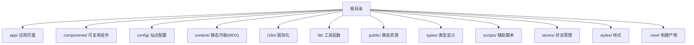
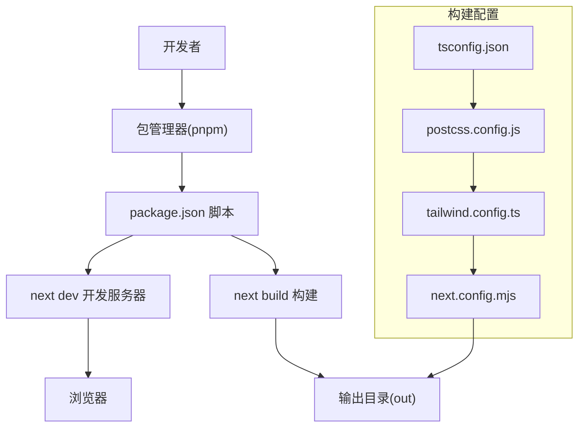
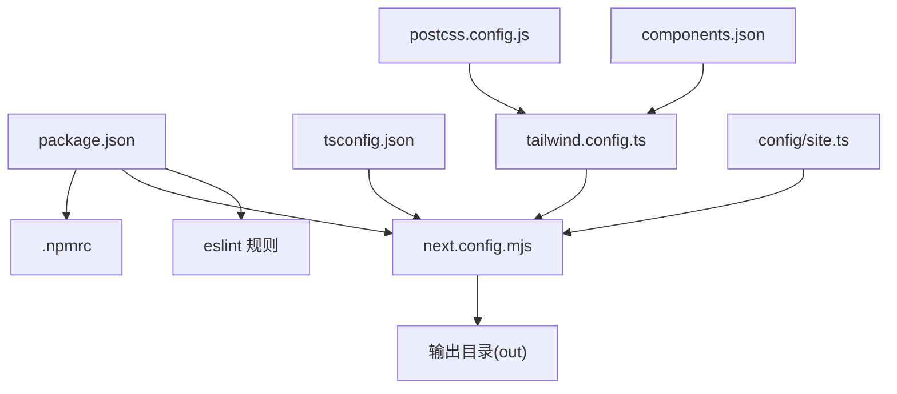

# 快速开始

<cite>
**本文引用的文件**
- [package.json](file://package.json)
- [README.md](file://README.md)
- [next.config.mjs](file://next.config.mjs)
- [tsconfig.json](file://tsconfig.json)
- [.npmrc](file://.npmrc)
- [components.json](file://components.json)
- [tailwind.config.ts](file://tailwind.config.ts)
- [postcss.config.js](file://postcss.config.js)
- [config/site.ts](file://config/site.ts)
- [cloudflare.toml](file://cloudflare.toml)
- [.eslintrc.json](file://.eslintrc.json)
- [next-env.d.ts](file://next-env.d.ts)
- [CLOUDFLARE_DEPLOYMENT.md](file://CLOUDFLARE_DEPLOYMENT.md)
</cite>

## 目录
1. [简介](#简介)
2. [项目结构](#项目结构)
3. [核心组件](#核心组件)
4. [架构总览](#架构总览)
5. [详细组件分析](#详细组件分析)
6. [依赖关系分析](#依赖关系分析)
7. [性能注意事项](#性能注意事项)
8. [故障排除指南](#故障排除指南)
9. [结论](#结论)
10. [附录](#附录)

## 简介
本指南面向初学者，帮助你在最短时间内完成 LinkedIn Answer Today 项目的本地开发环境搭建与运行。你将获得完整的环境要求、安装步骤、依赖安装、环境变量配置以及开发服务器启动流程说明，并包含常见问题的解决方案。

## 项目结构
该项目采用 Next.js 16 App Router 结构，配合 TypeScript、Tailwind CSS、shadcn/ui 组件体系与多语言支持（next-intl）。核心目录职责如下：
- app：应用页面与国际化路由
- components：可复用 UI 组件与业务组件
- config：站点配置
- content：静态内容（MDX）
- i18n：国际化消息与路由
- lib：工具函数与服务封装
- public：静态资源
- types：类型定义
- scripts：辅助脚本
- stores：状态管理（Zustand）

章节来源
- [README.md](file://README.md#L139-L168)

## 核心组件
- 包管理器与引擎版本
  - Node.js：20.x（推荐 20.9+）
  - pnpm：9.0+（推荐，项目已配置 packageManager 字段）
- 开发脚本
  - dev：启动开发服务器
  - build：构建生产包
  - start：启动生产服务器
  - lint：代码质量检查
- 关键依赖
  - Next.js 16、TypeScript、Tailwind CSS、shadcn/ui、next-intl、Zustand、Resend、Upstash Redis 等

章节来源
- [package.json](file://package.json#L1-L65)
- [README.md](file://README.md#L39-L44)

## 架构总览
下图展示了从本地开发到静态导出的关键流程，包括构建配置、样式管线与运行时行为。

图表来源
- [package.json](file://package.json#L8-L14)
- [next.config.mjs](file://next.config.mjs#L1-L28)
- [tsconfig.json](file://tsconfig.json#L1-L43)
- [postcss.config.js](file://postcss.config.js#L1-L7)
- [tailwind.config.ts](file://tailwind.config.ts#L1-L95)

章节来源
- [package.json](file://package.json#L8-L14)
- [next.config.mjs](file://next.config.mjs#L1-L28)
- [tsconfig.json](file://tsconfig.json#L1-L43)
- [postcss.config.js](file://postcss.config.js#L1-L7)
- [tailwind.config.ts](file://tailwind.config.ts#L1-L95)

## 详细组件分析

### 环境要求与准备
- Node.js：20.x（满足 20.9+）
- pnpm：9.0+（推荐，项目已配置 packageManager 字段）
- Corepack：建议启用以确保团队使用一致的 pnpm 版本

章节来源
- [package.json](file://package.json#L5-L7)
- [package.json](file://package.json#L4)
- [README.md](file://README.md#L39-L44)
- [README.md](file://README.md#L206-L210)

### 安装步骤与依赖安装
- 克隆仓库后进入项目目录
- 启用 Corepack（推荐）
- 安装依赖（推荐使用 pnpm）
- 如需使用其他包管理器，README 提供了 npm 与 yarn 的示例

章节来源
- [README.md](file://README.md#L48-L65)

### 环境变量配置
- 复制示例环境变量文件为 .env
- 基础站点配置位于 config/site.ts，包含站点名称、描述、图标、默认主题等
- 分析与邮件订阅相关环境变量可在部署文档中查阅

章节来源
- [README.md](file://README.md#L67-L71)
- [config/site.ts](file://config/site.ts#L1-L45)
- [CLOUDFLARE_DEPLOYMENT.md](file://CLOUDFLARE_DEPLOYMENT.md#L209-L228)

### 开发服务器启动流程
- 启动开发服务器
- 访问 http://localhost:3000 查看应用

章节来源
- [README.md](file://README.md#L72-L78)

### 构建与静态导出配置
- 项目启用了静态导出（output: export），构建产物输出至 out 目录
- 静态导出模式下禁用图片优化，且支持通过环境变量配置远程图片源
- 生产环境移除控制台日志（保留 error）

章节来源
- [next.config.mjs](file://next.config.mjs#L3-L25)

### TypeScript 与路径别名
- 编译目标与严格模式、模块解析策略、路径别名等均在 tsconfig.json 中配置
- baseUrl 与 @/* 路径映射便于统一导入

章节来源
- [tsconfig.json](file://tsconfig.json#L1-L43)

### 样式系统与组件库
- Tailwind CSS 配置集中于 tailwind.config.ts，支持暗色模式、动画插件与内容扫描范围
- shadcn/ui 配置位于 components.json，包含样式风格、TSX 支持、Tailwind 配置与别名映射
- PostCSS 通过 postcss.config.js 集成 Tailwind 与 Autoprefixer

章节来源
- [tailwind.config.ts](file://tailwind.config.ts#L1-L95)
- [components.json](file://components.json#L1-L21)
- [postcss.config.js](file://postcss.config.js#L1-L7)

### ESLint 与类型检查
- ESLint 扩展自 next/core-web-vitals，保证前端最佳实践
- README 提供了 lint 与类型检查脚本示例

章节来源
- [.eslintrc.json](file://.eslintrc.json#L1-L4)
- [README.md](file://README.md#L212-L220)

### Cloudflare Pages 部署参考
- 构建命令与输出目录参考 cloudflare.toml
- 本地测试部署与环境变量管理可参考 CLOUDFLARE_DEPLOYMENT.md

章节来源
- [cloudflare.toml](file://cloudflare.toml#L1-L13)
- [CLOUDFLARE_DEPLOYMENT.md](file://CLOUDFLARE_DEPLOYMENT.md#L190-L272)

## 依赖关系分析
下图展示关键配置文件之间的依赖关系与作用范围。

图表来源
- [package.json](file://package.json#L1-L65)
- [.npmrc](file://.npmrc#L1-L5)
- [next.config.mjs](file://next.config.mjs#L1-L28)
- [tsconfig.json](file://tsconfig.json#L1-L43)
- [postcss.config.js](file://postcss.config.js#L1-L7)
- [tailwind.config.ts](file://tailwind.config.ts#L1-L95)
- [components.json](file://components.json#L1-L21)
- [config/site.ts](file://config/site.ts#L1-L45)

章节来源
- [package.json](file://package.json#L1-L65)
- [next.config.mjs](file://next.config.mjs#L1-L28)
- [tsconfig.json](file://tsconfig.json#L1-L43)
- [postcss.config.js](file://postcss.config.js#L1-L7)
- [tailwind.config.ts](file://tailwind.config.ts#L1-L95)
- [components.json](file://components.json#L1-L21)
- [config/site.ts](file://config/site.ts#L1-L45)

## 性能注意事项
- 使用 pnpm 以提升安装速度与依赖去重
- 启用 Corepack 保持团队一致性
- 生产构建时移除控制台日志，减少包体积
- 静态导出模式下禁用图片优化，避免运行时开销

章节来源
- [README.md](file://README.md#L206-L210)
- [next.config.mjs](file://next.config.mjs#L17-L24)

## 故障排除指南
- 包管理器版本不匹配
  - 清理 node_modules 与锁文件后重新安装
- MDX 文件未显示
  - 检查文件路径与 frontmatter 格式，确认 visible 字段为 published
- 国际化路由异常
  - 使用 i18n/routing.ts 中的 Link 组件，检查 middleware.ts 配置
- 样式不生效
  - 确认 Tailwind 类名正确，重启开发服务器

章节来源
- [README.md](file://README.md#L239-L263)

## 结论
按照本指南完成环境准备、依赖安装与开发服务器启动后，你将能够在本地顺利运行 LinkedIn Answer Today 项目。如需进一步部署，可参考 Cloudflare Pages 的本地测试与环境变量配置说明。

## 附录
- 常用命令示例（仅列出命令路径，不展示具体代码）
  - 安装依赖：参见 [README.md](file://README.md#L59-L65)
  - 启动开发服务器：参见 [README.md](file://README.md#L72-L78)
  - 构建生产包：参见 [README.md](file://README.md#L197-L202)
  - 代码质量检查：参见 [README.md](file://README.md#L214-L220)
- 环境变量示例与站点配置
  - 环境变量复制：参见 [README.md](file://README.md#L67-L71)
  - 站点配置：参见 [config/site.ts](file://config/site.ts#L1-L45)
- 部署参考
  - Cloudflare Pages 构建与本地测试：参见 [CLOUDFLARE_DEPLOYMENT.md](file://CLOUDFLARE_DEPLOYMENT.md#L190-L272)
  - Pages 配置文件参考：参见 [cloudflare.toml](file://cloudflare.toml#L1-L13)