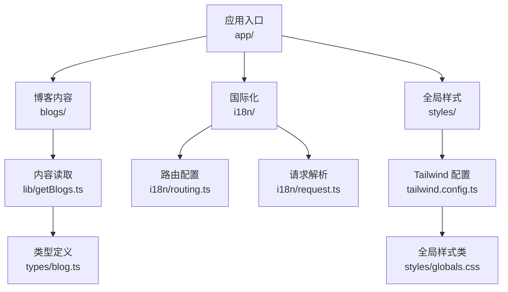
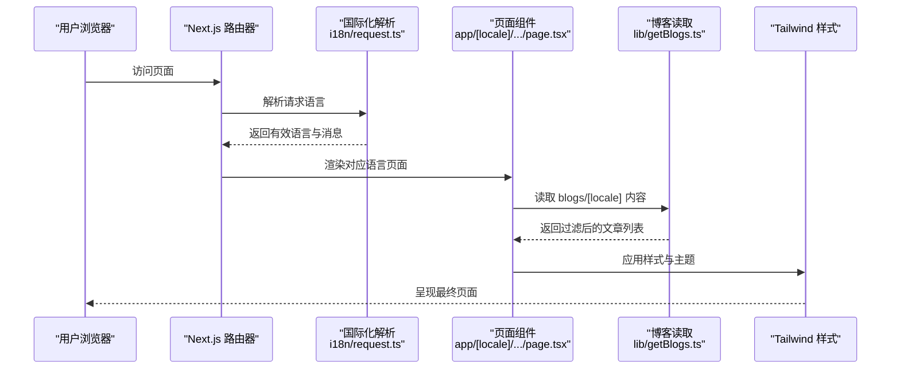
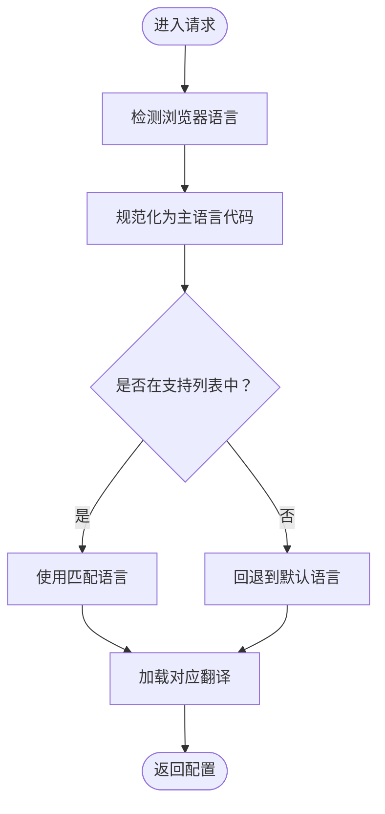
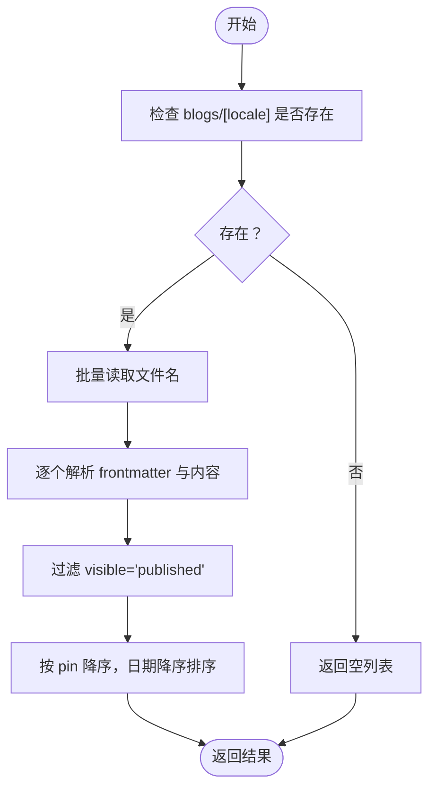
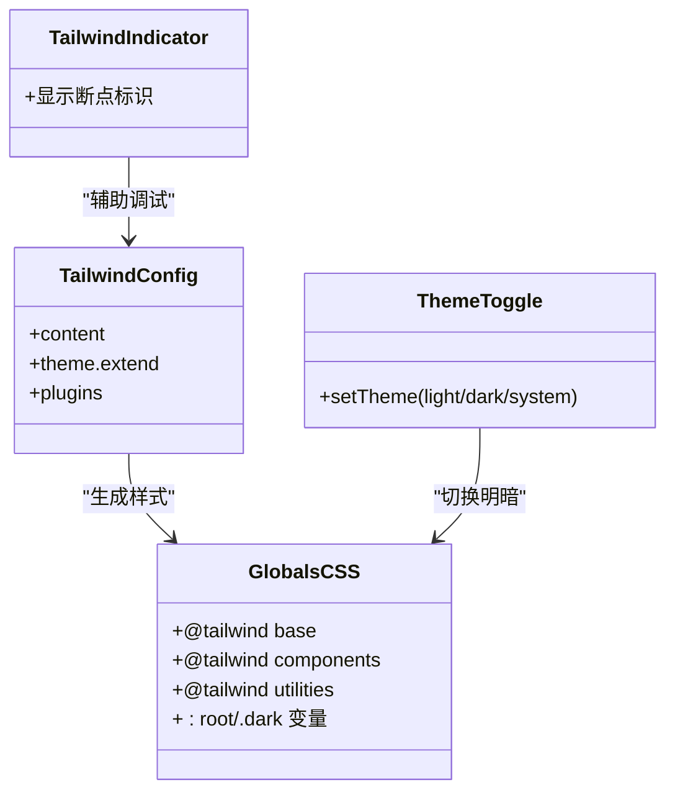
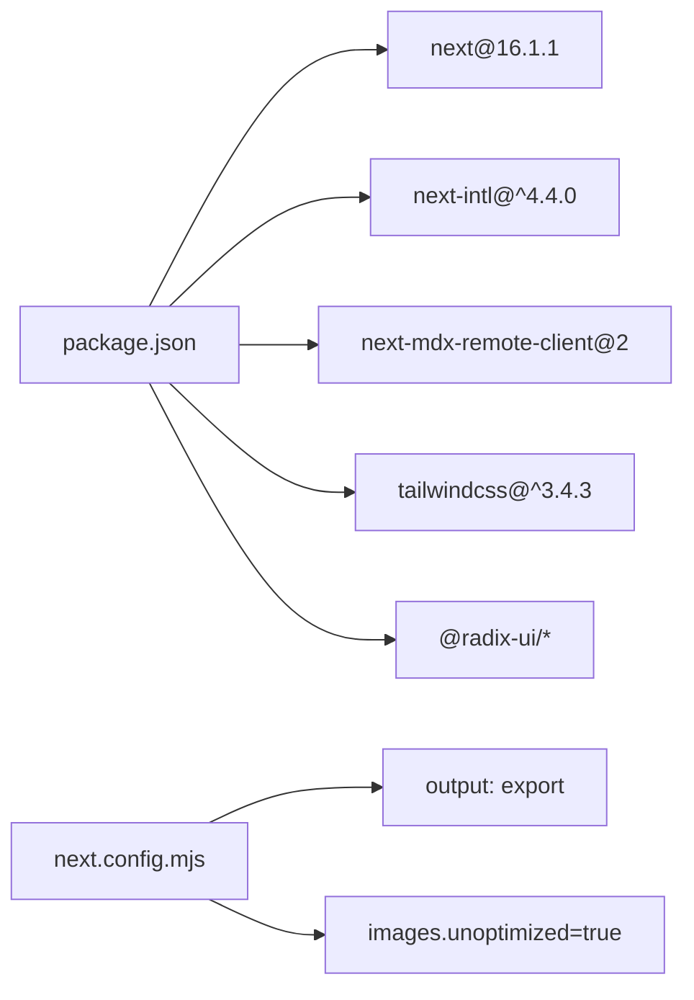

# 故障排除和常见问题

<cite>
**本文引用的文件**
- [package.json](file://package.json)
- [next.config.mjs](file://next.config.mjs)
- [tailwind.config.ts](file://tailwind.config.ts)
- [styles/globals.css](file://styles/globals.css)
- [i18n/routing.ts](file://i18n/routing.ts)
- [i18n/request.ts](file://i18n/request.ts)
- [components/LanguageDetectionAlert.tsx](file://components/LanguageDetectionAlert.tsx)
- [components/TailwindIndicator.tsx](file://components/TailwindIndicator.tsx)
- [components/mdx/MDXComponents.tsx](file://components/mdx/MDXComponents.tsx)
- [lib/getBlogs.ts](file://lib/getBlogs.ts)
- [types/blog.ts](file://types/blog.ts)
- [config/site.ts](file://config/site.ts)
- [tsconfig.json](file://tsconfig.json)
- [README.md](file://README.md)
</cite>

## 目录
1. [简介](#简介)
2. [项目结构](#项目结构)
3. [核心组件](#核心组件)
4. [架构总览](#架构总览)
5. [详细组件分析](#详细组件分析)
6. [依赖关系分析](#依赖关系分析)
7. [性能考虑](#性能考虑)
8. [故障排除指南](#故障排除指南)
9. [结论](#结论)
10. [附录](#附录)

## 简介
本文件面向开发者与运维人员，系统化梳理开发与部署过程中常见的问题与解决方案，覆盖包管理器版本不匹配、MDX 内容不显示、国际化路由异常、样式不生效、开发/生产环境差异、网络连接问题等。同时提供可复用的排查流程、调试工具建议与性能诊断要点，并给出社区支持与问题反馈路径。

## 项目结构
该项目采用 Next.js App Router 结构，内容与国际化配置相对独立，便于定位问题来源：
- 应用入口与页面：app/（含多语言路由）
- 国际化：i18n/（路由与请求配置）
- 博客内容：blogs/（按语言存放 MDX）
- 样式与主题：styles/、tailwind.config.ts、globals.css
- 工具与类型：lib/、types/、config/

图表来源
- [next.config.mjs](file://next.config.mjs#L1-L28)
- [i18n/routing.ts](file://i18n/routing.ts#L1-L37)
- [i18n/request.ts](file://i18n/request.ts#L1-L28)
- [lib/getBlogs.ts](file://lib/getBlogs.ts#L1-L65)
- [types/blog.ts](file://types/blog.ts#L1-L17)
- [tailwind.config.ts](file://tailwind.config.ts#L1-L95)
- [styles/globals.css](file://styles/globals.css#L1-L128)

章节来源
- [next.config.mjs](file://next.config.mjs#L1-L28)
- [tsconfig.json](file://tsconfig.json#L1-L43)

## 核心组件
- 包管理与引擎：通过 package.json 的 engines 与 packageManager 字段约束 Node 与 pnpm 版本，确保团队一致性。
- 构建配置：next.config.mjs 启用静态导出与图片优化策略，控制台输出在生产环境移除。
- 样式体系：tailwind.config.ts 定义内容扫描范围与主题扩展；styles/globals.css 提供基础层与暗色变量。
- 国际化：i18n/routing.ts 定义支持语言、默认语言与前缀策略；i18n/request.ts 负责服务端请求解析与回退。
- 博客系统：lib/getBlogs.ts 读取 blogs/[locale] 下的 MDX 文件并过滤可见性；types/blog.ts 定义文章数据模型。
- 主题与指示器：components/ThemeToggle.tsx 提供主题切换；components/TailwindIndicator.tsx 在开发环境提示断点。

章节来源
- [package.json](file://package.json#L1-L65)
- [next.config.mjs](file://next.config.mjs#L1-L28)
- [tailwind.config.ts](file://tailwind.config.ts#L1-L95)
- [styles/globals.css](file://styles/globals.css#L1-L128)
- [i18n/routing.ts](file://i18n/routing.ts#L1-L37)
- [i18n/request.ts](file://i18n/request.ts#L1-L28)
- [lib/getBlogs.ts](file://lib/getBlogs.ts#L1-L65)
- [types/blog.ts](file://types/blog.ts#L1-L17)
- [components/ThemeToggle.tsx](file://components/ThemeToggle.tsx#L1-L40)
- [components/TailwindIndicator.tsx](file://components/TailwindIndicator.tsx#L1-L15)

## 架构总览
下图展示从请求到渲染的关键路径，包括国际化解析、内容加载与样式应用：

图表来源
- [i18n/request.ts](file://i18n/request.ts#L1-L28)
- [lib/getBlogs.ts](file://lib/getBlogs.ts#L1-L65)
- [tailwind.config.ts](file://tailwind.config.ts#L1-L95)
- [styles/globals.css](file://styles/globals.css#L1-L128)

## 详细组件分析

### 组件 A 分析：国际化路由与请求解析
- 路由配置：定义支持语言、默认语言、自动检测与前缀策略，决定 URL 形态与回退逻辑。
- 请求解析：根据客户端语言能力选择最接近的语言，若无效则回退至默认语言并加载对应翻译。
- 语言检测提醒：在未屏蔽的前提下，基于浏览器语言与路由支持集合进行匹配，引导用户切换语言。

图表来源
- [i18n/routing.ts](file://i18n/routing.ts#L1-L37)
- [i18n/request.ts](file://i18n/request.ts#L1-L28)
- [components/LanguageDetectionAlert.tsx](file://components/LanguageDetectionAlert.tsx#L1-L145)

章节来源
- [i18n/routing.ts](file://i18n/routing.ts#L1-L37)
- [i18n/request.ts](file://i18n/request.ts#L1-L28)
- [components/LanguageDetectionAlert.tsx](file://components/LanguageDetectionAlert.tsx#L1-L145)

### 组件 B 分析：博客内容加载与可见性过滤
- 目录存在性检查：避免因语言目录缺失导致错误。
- 批量读取：分批读取文件以降低内存压力。
- 可见性过滤：仅返回 visible 为 published 的文章。
- 排序规则：优先置顶（pin），再按日期倒序。

图表来源
- [lib/getBlogs.ts](file://lib/getBlogs.ts#L1-L65)
- [types/blog.ts](file://types/blog.ts#L1-L17)

章节来源
- [lib/getBlogs.ts](file://lib/getBlogs.ts#L1-L65)
- [types/blog.ts](file://types/blog.ts#L1-L17)

### 组件 C 分析：样式与主题系统
- Tailwind 内容扫描：包含 app/、components/、pages/、src/，确保新组件样式被正确打包。
- 全局样式：定义基础层与深色模式变量，配合主题切换组件实现明暗主题。
- 开发辅助：TailwindIndicator 在开发环境显示当前断点，便于调试响应式布局。

图表来源
- [tailwind.config.ts](file://tailwind.config.ts#L1-L95)
- [styles/globals.css](file://styles/globals.css#L1-L128)
- [components/ThemeToggle.tsx](file://components/ThemeToggle.tsx#L1-L40)
- [components/TailwindIndicator.tsx](file://components/TailwindIndicator.tsx#L1-L15)

章节来源
- [tailwind.config.ts](file://tailwind.config.ts#L1-L95)
- [styles/globals.css](file://styles/globals.css#L1-L128)
- [components/ThemeToggle.tsx](file://components/ThemeToggle.tsx#L1-L40)
- [components/TailwindIndicator.tsx](file://components/TailwindIndicator.tsx#L1-L15)

## 依赖关系分析
- 构建与运行时：Next.js 16、React 19、pnpm 作为首选包管理器，Node 版本要求 20.x。
- 国际化：next-intl 提供路由与请求级国际化能力。
- MDX：next-mdx-remote-client 支持客户端渲染 MDX。
- 样式：Tailwind CSS 与 shadcn/ui 组件库。
- 部署：静态导出（output: export）与 Cloudflare 平台集成。

图表来源
- [package.json](file://package.json#L1-L65)
- [next.config.mjs](file://next.config.mjs#L1-L28)

章节来源
- [package.json](file://package.json#L1-L65)
- [next.config.mjs](file://next.config.mjs#L1-L28)

## 性能考虑
- 构建输出：静态导出会生成纯 HTML/CSS/JS，适合 CDN 分发，但需注意动态功能限制。
- 图片优化：静态导出需关闭 Next 图片优化，使用本地或外部资源时应配置 remotePatterns。
- 控制台输出：生产环境移除 console，减少日志体积。
- 样式体积：Tailwind 内容扫描范围较大，建议在新增组件后验证样式是否被正确打包。

章节来源
- [next.config.mjs](file://next.config.mjs#L1-L28)
- [tailwind.config.ts](file://tailwind.config.ts#L1-L95)

## 故障排除指南

### 一、包管理器版本不匹配
- 症状
  - 安装阶段报错或构建失败
  - 依赖安装不一致导致运行时异常
- 诊断步骤
  - 检查 Node 版本是否满足 engines 要求
  - 确认 pnpm 版本与 package.json 中 packageManager 一致
  - 使用 Corepack 启用 pnpm 并锁定版本
- 修复方案
  - 删除 node_modules 与锁文件后重新安装
  - 在 CI/CD 中固定 Node 与 pnpm 版本
- 预防措施
  - 团队统一使用 pnpm，启用 Corepack
  - 将版本信息写入 README 或脚本注释

章节来源
- [package.json](file://package.json#L1-L65)
- [README.md](file://README.md#L239-L262)

### 二、MDX 文件不显示
- 症状
  - 博客列表为空或页面空白
  - 控制台出现文件读取错误
- 诊断步骤
  - 确认 blogs/[locale] 目录存在且命名正确
  - 检查 MDX frontmatter 字段（如 title、visible）格式与值
  - 验证 visible 字段为 published 才会出现在列表中
- 修复方案
  - 补充缺失的 locale 目录或修正文件名
  - 修正 frontmatter 字段，确保 visible 为 published
- 预防措施
  - 在提交前校验 frontmatter 规范
  - 对博客内容增加自动化检查

章节来源
- [lib/getBlogs.ts](file://lib/getBlogs.ts#L1-L65)
- [types/blog.ts](file://types/blog.ts#L1-L17)
- [README.md](file://README.md#L251-L254)

### 三、国际化路由问题
- 症状
  - 页面语言未按预期切换
  - URL 不带语言前缀或出现 404
- 诊断步骤
  - 检查 i18n/routing.ts 中 locales、defaultLocale、localeDetection 设置
  - 确认 i18n/request.ts 的语言归一化逻辑与回退机制
  - 使用 LanguageDetectionAlert 组件确认浏览器语言识别是否触发
- 修复方案
  - 在路由配置中添加缺失语言
  - 确保 middleware.ts（如存在）与路由配置一致
  - 使用 i18n/routing.ts 导出的 Link、redirect 等导航 API
- 预防措施
  - 新增语言时同步更新路由配置与内容目录
  - 在本地测试不同语言环境

章节来源
- [i18n/routing.ts](file://i18n/routing.ts#L1-L37)
- [i18n/request.ts](file://i18n/request.ts#L1-L28)
- [components/LanguageDetectionAlert.tsx](file://components/LanguageDetectionAlert.tsx#L1-L145)
- [README.md](file://README.md#L256-L258)

### 四、样式不生效
- 症状
  - 组件无样式或主题切换无效
  - Tailwind 类名未生成
- 诊断步骤
  - 检查 tailwind.config.ts 的 content 扫描路径是否包含目标组件
  - 确认 styles/globals.css 已被引入
  - 在开发环境使用 TailwindIndicator 检查断点与构建状态
- 修复方案
  - 将新组件路径加入 content 列表
  - 重启开发服务器以重新生成样式
  - 检查暗色模式变量是否正确设置
- 预防措施
  - 新增组件后验证样式是否被扫描到
  - 使用主题切换组件测试明暗模式

章节来源
- [tailwind.config.ts](file://tailwind.config.ts#L1-L95)
- [styles/globals.css](file://styles/globals.css#L1-L128)
- [components/TailwindIndicator.tsx](file://components/TailwindIndicator.tsx#L1-L15)

### 五、开发环境问题
- 常见问题
  - 热更新失效、样式抖动、类型检查报错
- 处理建议
  - 清理缓存与依赖后重装
  - 检查 tsconfig.json 的路径映射与模块解析
  - 使用 next lint 与类型检查命令定位问题

章节来源
- [tsconfig.json](file://tsconfig.json#L1-L43)
- [package.json](file://package.json#L1-L65)

### 六、生产环境问题
- 常见问题
  - 静态导出后动态功能不可用、图片无法加载、控制台日志过多
- 处理建议
  - 确认 next.config.mjs 的 output 与 images 配置
  - 生产环境移除 console 的配置已在生效
  - 如需远程图片，配置 remotePatterns

章节来源
- [next.config.mjs](file://next.config.mjs#L1-L28)

### 七、网络连接问题
- 常见问题
  - 构建时下载依赖超时、CDN 资源加载失败
- 处理建议
  - 使用稳定镜像源或代理
  - 在 CI/CD 中缓存依赖与锁文件
  - 检查站点 URL 与 R2 公网地址配置

章节来源
- [config/site.ts](file://config/site.ts#L1-L45)
- [next.config.mjs](file://next.config.mjs#L1-L28)

### 八、调试工具与性能诊断
- 调试工具
  - 浏览器开发者工具：检查网络、样式与控制台
  - TailwindIndicator：快速定位断点
  - 日志与监控：结合 Winston 日志与分析工具
- 性能诊断
  - 构建体积：使用 @next/bundle-analyzer 分析
  - 样式体积：确认 content 范围合理
  - 网络：CDN 缓存与资源压缩

章节来源
- [package.json](file://package.json#L1-L65)
- [components/TailwindIndicator.tsx](file://components/TailwindIndicator.tsx#L1-L15)
- [lib/logger.ts](file://lib/logger.ts)

### 九、社区支持与问题反馈
- 社区渠道
  - GitHub Issues：用于报告缺陷与功能请求
  - Discord：交流与求助
  - Twitter/X 与 Bluesky：作者社交账号
- 反馈流程
  - 提供最小可复现示例
  - 附上环境信息（Node/pnpm/Next 版本）
  - 描述期望行为与实际行为

章节来源
- [README.md](file://README.md#L277-L294)

## 结论
通过明确的排查流程、对关键配置文件的深入理解以及对常见问题的系统化处理，可以显著提升开发效率与稳定性。建议团队在本地与 CI/CD 中固化版本与依赖策略，完善内容与国际化规范，并持续关注样式与构建体积的健康度。

## 附录
- 快速检查清单
  - Node 与 pnpm 版本是否符合要求
  - MDX frontmatter 是否完整且 visible=published
  - i18n 路由配置与内容目录是否一致
  - Tailwind content 是否包含新组件路径
  - next.config.mjs 的静态导出与图片优化配置
- 参考路径
  - [package.json](file://package.json#L1-L65)
  - [next.config.mjs](file://next.config.mjs#L1-L28)
  - [tailwind.config.ts](file://tailwind.config.ts#L1-L95)
  - [styles/globals.css](file://styles/globals.css#L1-L128)
  - [i18n/routing.ts](file://i18n/routing.ts#L1-L37)
  - [i18n/request.ts](file://i18n/request.ts#L1-L28)
  - [lib/getBlogs.ts](file://lib/getBlogs.ts#L1-L65)
  - [types/blog.ts](file://types/blog.ts#L1-L17)
  - [components/LanguageDetectionAlert.tsx](file://components/LanguageDetectionAlert.tsx#L1-L145)
  - [components/TailwindIndicator.tsx](file://components/TailwindIndicator.tsx#L1-L15)
  - [components/ThemeToggle.tsx](file://components/ThemeToggle.tsx#L1-L40)
  - [config/site.ts](file://config/site.ts#L1-L45)
  - [tsconfig.json](file://tsconfig.json#L1-L43)
  - [README.md](file://README.md#L239-L294)