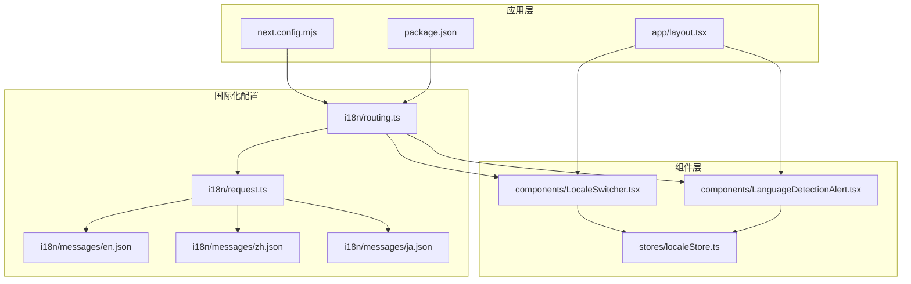
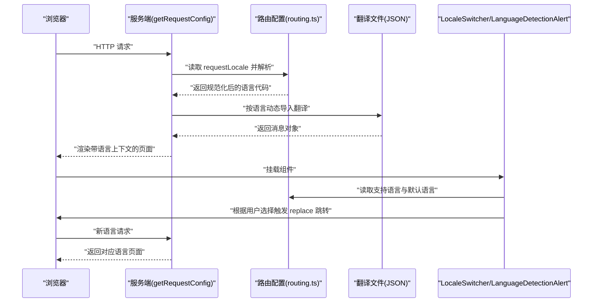
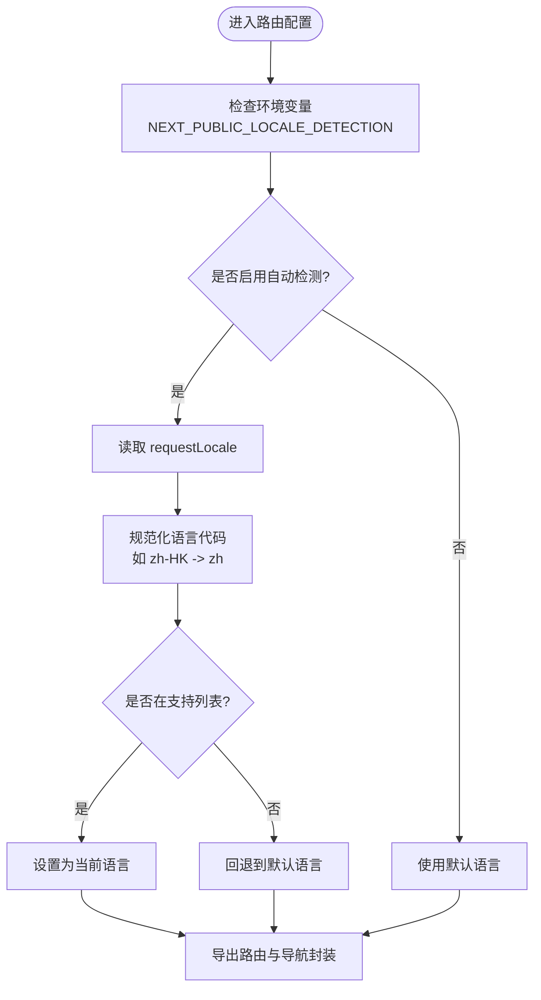
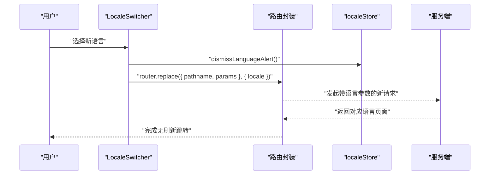
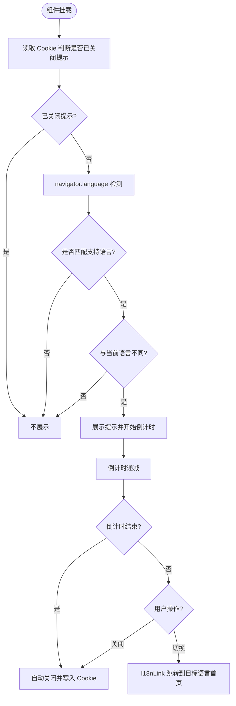
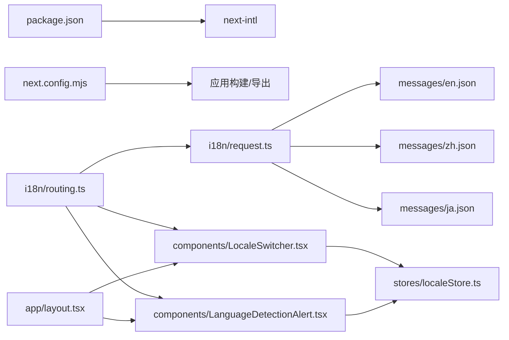

# 国际化架构

<cite>
**本文引用的文件**
- [i18n/routing.ts](file://i18n/routing.ts)
- [i18n/request.ts](file://i18n/request.ts)
- [i18n/messages/en.json](file://i18n/messages/en.json)
- [i18n/messages/zh.json](file://i18n/messages/zh.json)
- [i18n/messages/ja.json](file://i18n/messages/ja.json)
- [components/LocaleSwitcher.tsx](file://components/LocaleSwitcher.tsx)
- [components/LanguageDetectionAlert.tsx](file://components/LanguageDetectionAlert.tsx)
- [stores/localeStore.ts](file://stores/localeStore.ts)
- [app/layout.tsx](file://app/layout.tsx)
- [next.config.mjs](file://next.config.mjs)
- [package.json](file://package.json)
- [content/about/zh.mdx](file://content/about/zh.mdx)
- [blogs/zh/1.demo.mdx](file://blogs/zh/1.demo.mdx)
</cite>

## 目录
1. [简介](#简介)
2. [项目结构](#项目结构)
3. [核心组件](#核心组件)
4. [架构总览](#架构总览)
5. [详细组件分析](#详细组件分析)
6. [依赖关系分析](#依赖关系分析)
7. [性能考量](#性能考量)
8. [故障排查指南](#故障排查指南)
9. [结论](#结论)
10. [附录](#附录)

## 简介
本文件系统性阐述基于 next-intl 的国际化架构设计与实现，覆盖路由国际化、动态语言切换、翻译文件管理、语言检测机制、多语言内容组织与命名规范、国际化路由配置与默认语言处理，以及最佳实践与常见问题解决方案。目标是帮助开发者快速理解并扩展该国际化体系。

## 项目结构
国际化相关的核心目录与文件如下：
- i18n：国际化配置与翻译资源
  - routing.ts：定义支持语言、默认语言、语言前缀策略与导航封装
  - request.ts：服务端请求配置，按浏览器语言选择具体语言并加载对应翻译
  - messages：按语言划分的 JSON 翻译文件
- components：国际化交互组件
  - LocaleSwitcher.tsx：语言切换选择器
  - LanguageDetectionAlert.tsx：浏览器语言检测提示与自动切换
  - stores/localeStore.ts：语言检测提示状态与持久化
- app/layout.tsx：根布局，承载全局 UI 结构
- next.config.mjs：构建配置
- package.json：依赖声明，包含 next-intl

图表来源
- [i18n/routing.ts](file://i18n/routing.ts#L1-L37)
- [i18n/request.ts](file://i18n/request.ts#L1-L28)
- [i18n/messages/en.json](file://i18n/messages/en.json#L1-L110)
- [i18n/messages/zh.json](file://i18n/messages/zh.json#L1-L110)
- [i18n/messages/ja.json](file://i18n/messages/ja.json#L1-L110)
- [components/LocaleSwitcher.tsx](file://components/LocaleSwitcher.tsx#L1-L72)
- [components/LanguageDetectionAlert.tsx](file://components/LanguageDetectionAlert.tsx#L1-L145)
- [stores/localeStore.ts](file://stores/localeStore.ts#L1-L22)
- [app/layout.tsx](file://app/layout.tsx#L1-L78)
- [next.config.mjs](file://next.config.mjs#L1-L28)
- [package.json](file://package.json#L1-L65)

章节来源
- [i18n/routing.ts](file://i18n/routing.ts#L1-L37)
- [i18n/request.ts](file://i18n/request.ts#L1-L28)
- [i18n/messages/en.json](file://i18n/messages/en.json#L1-L110)
- [i18n/messages/zh.json](file://i18n/messages/zh.json#L1-L110)
- [i18n/messages/ja.json](file://i18n/messages/ja.json#L1-L110)
- [components/LocaleSwitcher.tsx](file://components/LocaleSwitcher.tsx#L1-L72)
- [components/LanguageDetectionAlert.tsx](file://components/LanguageDetectionAlert.tsx#L1-L145)
- [stores/localeStore.ts](file://stores/localeStore.ts#L1-L22)
- [app/layout.tsx](file://app/layout.tsx#L1-L78)
- [next.config.mjs](file://next.config.mjs#L1-L28)
- [package.json](file://package.json#L1-L65)

## 核心组件
- 路由与导航封装：通过 defineRouting 定义语言集合、默认语言、语言前缀策略与自动语言检测开关；createNavigation 提供对 Next.js 导航 API 的轻量封装，统一考虑路由配置。
- 服务端请求配置：根据 requestLocale 获取浏览器语言，进行语言规范化（如 zh-HK → zh），校验是否受支持，否则回退到默认语言并加载对应翻译。
- 翻译资源：按语言划分的 JSON 文件，包含语言检测提示、导航、页脚、首页、游戏、博客、静态页面等命名空间。
- 动态语言切换：LocaleSwitcher 组件提供下拉选择，结合路由封装的 replace 实现无刷新跳转至对应语言页面。
- 浏览器语言检测：LanguageDetectionAlert 基于 navigator.language 与路由配置判断是否展示提示，支持自动倒计时关闭与手动关闭，切换语言时写入 Cookie 标记“不再提示”。

章节来源
- [i18n/routing.ts](file://i18n/routing.ts#L1-L37)
- [i18n/request.ts](file://i18n/request.ts#L1-L28)
- [i18n/messages/en.json](file://i18n/messages/en.json#L1-L110)
- [i18n/messages/zh.json](file://i18n/messages/zh.json#L1-L110)
- [i18n/messages/ja.json](file://i18n/messages/ja.json#L1-L110)
- [components/LocaleSwitcher.tsx](file://components/LocaleSwitcher.tsx#L1-L72)
- [components/LanguageDetectionAlert.tsx](file://components/LanguageDetectionAlert.tsx#L1-L145)
- [stores/localeStore.ts](file://stores/localeStore.ts#L1-L22)

## 架构总览
整体流程从浏览器请求进入，服务端根据语言检测与路由配置确定语言并加载翻译；客户端通过封装的导航与状态管理实现语言切换与提示控制。

图表来源
- [i18n/request.ts](file://i18n/request.ts#L1-L28)
- [i18n/routing.ts](file://i18n/routing.ts#L1-L37)
- [i18n/messages/en.json](file://i18n/messages/en.json#L1-L110)
- [i18n/messages/zh.json](file://i18n/messages/zh.json#L1-L110)
- [i18n/messages/ja.json](file://i18n/messages/ja.json#L1-L110)
- [components/LocaleSwitcher.tsx](file://components/LocaleSwitcher.tsx#L1-L72)
- [components/LanguageDetectionAlert.tsx](file://components/LanguageDetectionAlert.tsx#L1-L145)

## 详细组件分析

### 路由国际化与语言检测
- 支持语言与默认语言：通过常量定义语言集合与默认语言，便于集中维护。
- 语言前缀策略：采用 as-needed，仅在非默认语言时显示语言前缀，保持默认语言路径简洁。
- 自动语言检测：通过环境变量控制是否启用浏览器语言自动检测，避免在某些部署环境下误判。
- 导航封装：提供 Link、redirect、usePathname、useRouter、getPathname 等 API 封装，统一处理语言前缀与路径。

图表来源
- [i18n/routing.ts](file://i18n/routing.ts#L1-L37)
- [i18n/request.ts](file://i18n/request.ts#L1-L28)

章节来源
- [i18n/routing.ts](file://i18n/routing.ts#L1-L37)
- [i18n/request.ts](file://i18n/request.ts#L1-L28)

### 动态语言切换
- 选择器组件：使用 Select 组件展示语言选项，结合 LOCALE_NAMES 显示本地化语言名。
- 切换逻辑：监听下拉变化，调用 router.replace 并传入目标语言，实现无刷新跳转至同路径的对应语言页面。
- 状态联动：切换时调用 dismissLanguageAlert，清除语言检测提示的“不再提示”标记，确保下次进入不同语言时仍可提示。

图表来源
- [components/LocaleSwitcher.tsx](file://components/LocaleSwitcher.tsx#L1-L72)
- [stores/localeStore.ts](file://stores/localeStore.ts#L1-L22)
- [i18n/routing.ts](file://i18n/routing.ts#L1-L37)

章节来源
- [components/LocaleSwitcher.tsx](file://components/LocaleSwitcher.tsx#L1-L72)
- [stores/localeStore.ts](file://stores/localeStore.ts#L1-L22)
- [i18n/routing.ts](file://i18n/routing.ts#L1-L37)

### 浏览器语言检测与提示
- 检测逻辑：读取 navigator.language，优先精确匹配，其次按主语言前缀匹配，若与当前语言不同则展示提示。
- 倒计时与关闭：默认 10 秒倒计时，结束后自动关闭；用户可手动关闭并写入 Cookie 标记“不再提示”。
- 切换操作：点击“切换到”按钮，使用 I18nLink 指定目标语言并跳转至首页。

图表来源
- [components/LanguageDetectionAlert.tsx](file://components/LanguageDetectionAlert.tsx#L1-L145)
- [stores/localeStore.ts](file://stores/localeStore.ts#L1-L22)
- [i18n/routing.ts](file://i18n/routing.ts#L1-L37)

章节来源
- [components/LanguageDetectionAlert.tsx](file://components/LanguageDetectionAlert.tsx#L1-L145)
- [stores/localeStore.ts](file://stores/localeStore.ts#L1-L22)
- [i18n/routing.ts](file://i18n/routing.ts#L1-L37)

### 翻译文件管理与命名规范
- 分类与命名：按语言划分文件，文件名为语言代码（如 en.json、zh.json、ja.json），置于 i18n/messages 目录。
- 命名空间：翻译键采用层级命名（如 Header、Footer、Games、Blog 等），便于模块化管理与检索。
- 多语言内容组织：静态页面内容位于 content/[page]/[locale].mdx，博客内容位于 blogs/[locale]/[slug].mdx，与翻译资源协同工作。

章节来源
- [i18n/messages/en.json](file://i18n/messages/en.json#L1-L110)
- [i18n/messages/zh.json](file://i18n/messages/zh.json#L1-L110)
- [i18n/messages/ja.json](file://i18n/messages/ja.json#L1-L110)
- [content/about/zh.mdx](file://content/about/zh.mdx#L1-L99)
- [blogs/zh/1.demo.mdx](file://blogs/zh/1.demo.mdx#L1-L18)

### 国际化路由配置与默认语言处理
- 语言前缀：通过 localePrefix: 'as-needed' 控制仅在非默认语言时显示语言段。
- 默认语言：defaultLocale 指定默认语言，当无法识别或无效时回退使用。
- 服务端回退：request.ts 对无效语言进行兜底，确保始终返回有效语言与翻译。

章节来源
- [i18n/routing.ts](file://i18n/routing.ts#L1-L37)
- [i18n/request.ts](file://i18n/request.ts#L1-L28)

## 依赖关系分析
- 组件依赖：LocaleSwitcher 与 LanguageDetectionAlert 依赖路由配置与状态存储；状态存储依赖 js-cookie 进行持久化。
- 服务端依赖：request.ts 依赖 routing.ts 的语言配置与默认语言；翻译文件按需动态导入。
- 构建与运行：next.config.mjs 影响静态导出与图片优化；package.json 声明 next-intl 依赖。

图表来源
- [package.json](file://package.json#L1-L65)
- [next.config.mjs](file://next.config.mjs#L1-L28)
- [i18n/routing.ts](file://i18n/routing.ts#L1-L37)
- [i18n/request.ts](file://i18n/request.ts#L1-L28)
- [i18n/messages/en.json](file://i18n/messages/en.json#L1-L110)
- [i18n/messages/zh.json](file://i18n/messages/zh.json#L1-L110)
- [i18n/messages/ja.json](file://i18n/messages/ja.json#L1-L110)
- [components/LocaleSwitcher.tsx](file://components/LocaleSwitcher.tsx#L1-L72)
- [components/LanguageDetectionAlert.tsx](file://components/LanguageDetectionAlert.tsx#L1-L145)
- [stores/localeStore.ts](file://stores/localeStore.ts#L1-L22)
- [app/layout.tsx](file://app/layout.tsx#L1-L78)

章节来源
- [package.json](file://package.json#L1-L65)
- [next.config.mjs](file://next.config.mjs#L1-L28)
- [i18n/routing.ts](file://i18n/routing.ts#L1-L37)
- [i18n/request.ts](file://i18n/request.ts#L1-L28)
- [components/LocaleSwitcher.tsx](file://components/LocaleSwitcher.tsx#L1-L72)
- [components/LanguageDetectionAlert.tsx](file://components/LanguageDetectionAlert.tsx#L1-L145)
- [stores/localeStore.ts](file://stores/localeStore.ts#L1-L22)
- [app/layout.tsx](file://app/layout.tsx#L1-L78)

## 性能考量
- 动态导入翻译：按需动态导入对应语言的翻译文件，避免一次性加载全部语言资源，降低初始包体积。
- 语言检测提示：仅在首次进入且语言不一致时展示，倒计时结束后自动关闭，减少对用户交互的干扰。
- 无刷新跳转：使用 router.replace 实现语言切换，避免整页刷新带来的性能损耗。
- 图片优化：静态导出模式下禁用图片优化，减少构建复杂度与潜在的兼容性问题。

章节来源
- [i18n/request.ts](file://i18n/request.ts#L1-L28)
- [components/LanguageDetectionAlert.tsx](file://components/LanguageDetectionAlert.tsx#L1-L145)
- [components/LocaleSwitcher.tsx](file://components/LocaleSwitcher.tsx#L1-L72)
- [next.config.mjs](file://next.config.mjs#L1-L28)

## 故障排查指南
- 语言未生效或回退到默认语言
  - 检查环境变量 NEXT_PUBLIC_LOCALE_DETECTION 是否正确开启语言检测。
  - 确认 request.ts 中的语言规范化逻辑与浏览器语言是否匹配。
  - 验证路由配置中的 locales 是否包含当前语言。
- 语言切换后路径异常
  - 确认使用封装的 router.replace 并传入 { locale } 参数。
  - 检查语言前缀策略 localePrefix 是否符合预期。
- 翻译缺失或键不存在
  - 核对翻译文件中是否存在对应命名空间与键。
  - 确认翻译文件命名与语言代码一致。
- 语言检测提示不出现
  - 检查 Cookie 标记是否导致提示被屏蔽。
  - 确认 navigator.language 与路由支持语言的匹配规则。
- 构建或导出问题
  - 静态导出模式下需禁用图片优化，确保 images.unoptimized 为 true。
  - 确认依赖版本与 next 版本兼容。

章节来源
- [i18n/routing.ts](file://i18n/routing.ts#L1-L37)
- [i18n/request.ts](file://i18n/request.ts#L1-L28)
- [components/LocaleSwitcher.tsx](file://components/LocaleSwitcher.tsx#L1-L72)
- [components/LanguageDetectionAlert.tsx](file://components/LanguageDetectionAlert.tsx#L1-L145)
- [stores/localeStore.ts](file://stores/localeStore.ts#L1-L22)
- [next.config.mjs](file://next.config.mjs#L1-L28)

## 结论
该国际化架构以 next-intl 为核心，通过路由配置、服务端请求处理与客户端交互组件形成闭环：既保证了语言检测与默认语言处理的一致性，又提供了灵活的动态语言切换与友好的用户体验。配合清晰的翻译文件组织与命名规范，能够高效支撑多语言内容的维护与扩展。

## 附录
- 最佳实践
  - 在 i18n/routing.ts 中集中维护语言集合与默认语言。
  - 使用命名空间组织翻译键，便于团队协作与维护。
  - 在新增语言时同步更新路由配置、翻译文件与内容目录。
  - 利用语言检测提示提升用户体验，但注意不要过度打扰。
- 常见问题
  - 语言检测与默认语言冲突：确认环境变量与路由配置一致。
  - 切换语言后面包屑或导航失效：检查 Link 与路由封装的使用。
  - 翻译键拼写错误：统一使用命名空间与层级结构，避免重复键名。