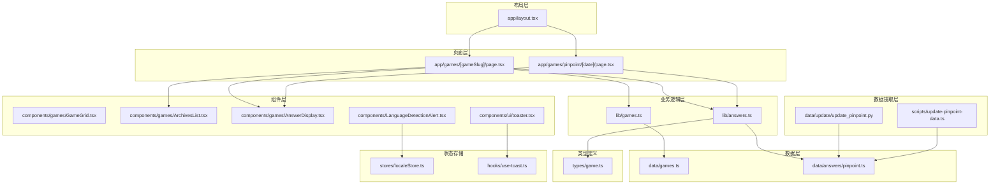
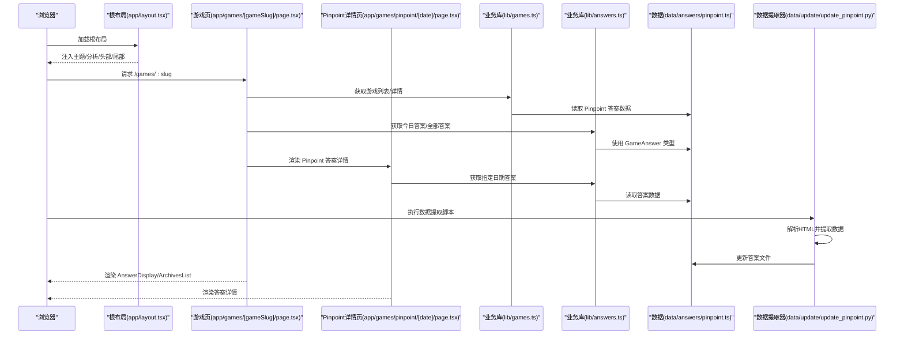
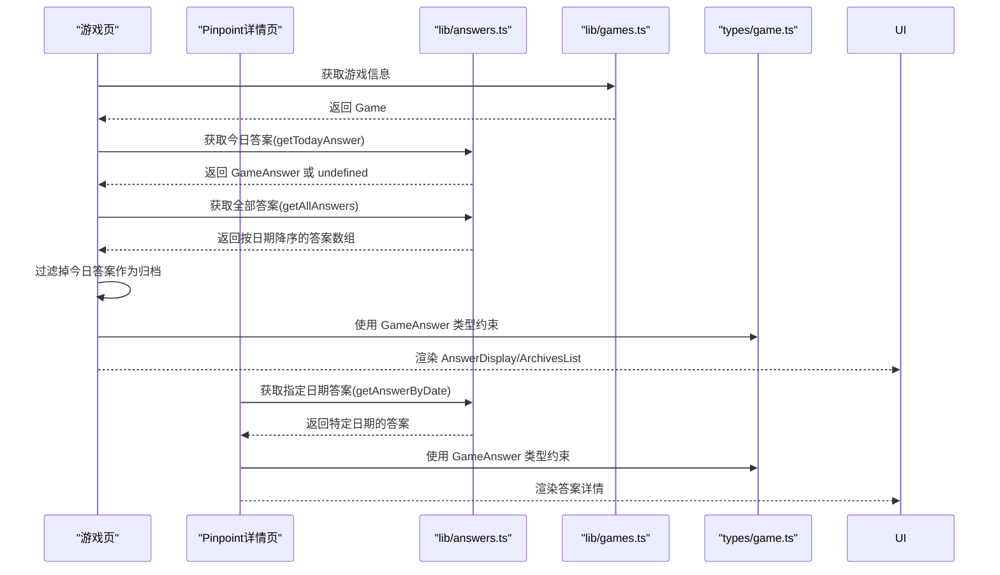
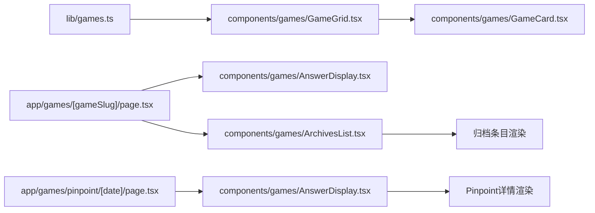
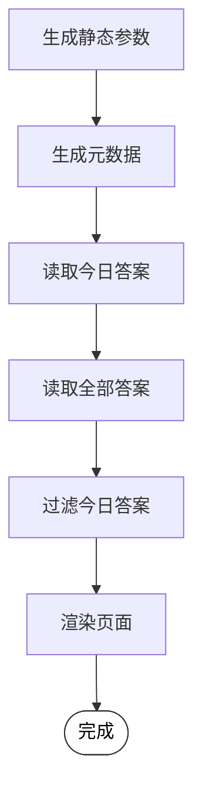
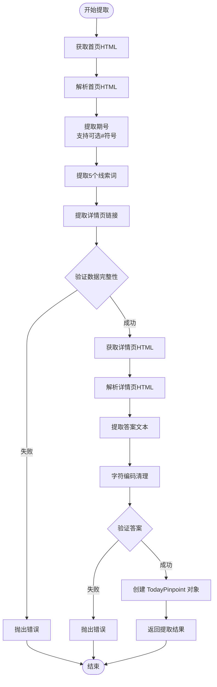
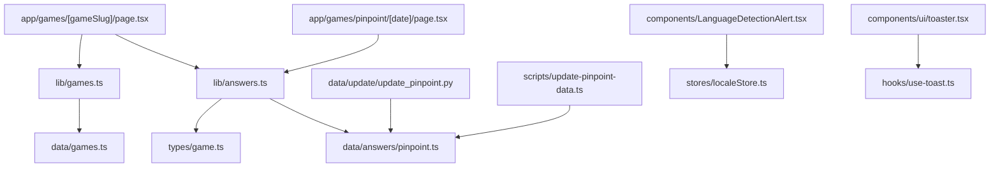

# 数据流架构

<cite>
**本文引用的文件**
- [stores/localeStore.ts](file://stores/localeStore.ts)
- [hooks/use-toast.ts](file://hooks/use-toast.ts)
- [components/LanguageDetectionAlert.tsx](file://components/LanguageDetectionAlert.tsx)
- [components/ui/toaster.tsx](file://components/ui/toaster.tsx)
- [app/layout.tsx](file://app/layout.tsx)
- [lib/games.ts](file://lib/games.ts)
- [lib/answers.ts](file://lib/answers.ts)
- [data/games.ts](file://data/games.ts)
- [data/answers/pinpoint.ts](file://data/answers/pinpoint.ts)
- [data/update/update_pinpoint.py](file://data/update/update_pinpoint.py)
- [scripts/update-pinpoint-data.ts](file://scripts/update-pinpoint-data.ts)
- [types/game.ts](file://types/game.ts)
- [components/games/GameGrid.tsx](file://components/games/GameGrid.tsx)
- [components/games/ArchivesList.tsx](file://components/games/ArchivesList.tsx)
- [components/games/AnswerDisplay.tsx](file://components/games/AnswerDisplay.tsx)
- [app/games/[gameSlug]/page.tsx](file://app/games/[gameSlug]/page.tsx)
- [app/games/pinpoint/[date]/page.tsx](file://app/games/pinpoint/[date]/page.tsx)
- [scripts/README.md](file://scripts/README.md)
</cite>

## 更新摘要
**所做更改**
- 新增 Pinpoint 数据提取流程的详细分析，包括 HTML 解析逻辑优化
- 更新数据源到 UI 的完整数据流图，涵盖新的数据提取管道
- 增强异步数据获取与缓存策略的说明，特别是针对 Pinpoint 答案数据
- 补充数据更新脚本的工作原理和最佳实践
- **新增**：增强了正则表达式模式支持可选的 # 符号，提高了数据解析的灵活性
- **新增**：添加了字符编码清理功能，提升了数据解析的鲁棒性

## 目录
1. [引言](#引言)
2. [项目结构](#项目结构)
3. [核心组件](#核心组件)
4. [架构总览](#架构总览)
5. [详细组件分析](#详细组件分析)
6. [Pinpoint 数据提取流程](#pinpoint-数据提取流程)
7. [依赖关系分析](#依赖关系分析)
8. [性能考量](#性能考量)
9. [故障排查指南](#故障排查指南)
10. [结论](#结论)
11. [附录](#附录)

## 引言
本文件系统性梳理该 Next.js 应用的数据流与状态管理策略，重点覆盖以下方面：
- 数据从数据源到 UI 的传递路径与职责边界
- 全局状态与局部状态的划分及使用场景
- 异步数据获取、缓存、错误处理与加载状态管理
- 组件间数据共享模式与最佳实践
- 基于真实代码的流程图与状态转换图，帮助理解复杂异步操作
- **新增**：Pinpoint 数据提取流程的 HTML 解析逻辑优化与可靠性改进
- **新增**：正则表达式模式的可选 # 符号支持和字符编码清理功能

## 项目结构
该项目采用按功能分层的组织方式：页面层（app）、业务逻辑层（lib）、数据层（data）、类型定义（types）、通用组件（components）、状态存储（stores）与自定义 Hook（hooks）。布局层在根布局中统一注入头部、尾部、主题与分析脚本，并通过 Toaster 提供全局通知。



**图表来源**
- [app/layout.tsx](file://app/layout.tsx#L32-L77)
- [app/games/[gameSlug]/page.tsx](file://app/games/[gameSlug]/page.tsx#L45-L114)
- [app/games/pinpoint/[date]/page.tsx](file://app/games/pinpoint/[date]/page.tsx#L52-L89)
- [lib/games.ts](file://lib/games.ts#L1-L15)
- [lib/answers.ts](file://lib/answers.ts#L1-L42)
- [data/games.ts](file://data/games.ts#L1-L29)
- [data/answers/pinpoint.ts](file://data/answers/pinpoint.ts#L1-L275)
- [data/update/update_pinpoint.py](file://data/update/update_pinpoint.py#L1-L382)
- [scripts/update-pinpoint-data.ts](file://scripts/update-pinpoint-data.ts#L1-L82)
- [types/game.ts](file://types/game.ts#L1-L27)

**章节来源**
- [app/layout.tsx](file://app/layout.tsx#L32-L77)
- [app/games/[gameSlug]/page.tsx](file://app/games/[gameSlug]/page.tsx#L45-L114)
- [app/games/pinpoint/[date]/page.tsx](file://app/games/pinpoint/[date]/page.tsx#L52-L89)

## 核心组件
- 全局状态与通知
  - 语言检测弹窗状态：通过 Zustand 存储语言提示的显示与持久化，避免重复打扰用户。
  - 全局通知系统：基于自定义 Hook 的轻量状态机，集中管理 Toast 的增删改与自动移除队列。
- 页面与数据获取
  - 游戏页：在构建期静态生成参数与元数据，运行时读取今日答案与历史归档，渲染答案展示与归档列表。
  - **Pinpoint 详情页**：专门处理 Pinpoint 游戏的单日答案展示，支持静态生成参数。
- 组件数据传递
  - 游戏网格：从业务库读取游戏列表，逐个渲染卡片。
  - 归档列表：接收答案数组与游戏标识，渲染日期与答案内容。
  - 答案展示：根据答案数据渲染图片、提示、线索等模块。

**章节来源**
- [stores/localeStore.ts](file://stores/localeStore.ts#L1-L22)
- [hooks/use-toast.ts](file://hooks/use-toast.ts#L1-L195)
- [components/LanguageDetectionAlert.tsx](file://components/LanguageDetectionAlert.tsx#L1-L145)
- [components/ui/toaster.tsx](file://components/ui/toaster.tsx#L1-L36)
- [app/games/[gameSlug]/page.tsx](file://app/games/[gameSlug]/page.tsx#L45-L114)
- [app/games/pinpoint/[date]/page.tsx](file://app/games/pinpoint/[date]/page.tsx#L52-L89)
- [components/games/GameGrid.tsx](file://components/games/GameGrid.tsx#L1-L15)
- [components/games/ArchivesList.tsx](file://components/games/ArchivesList.tsx#L1-L67)
- [components/games/AnswerDisplay.tsx](file://components/games/AnswerDisplay.tsx#L1-L65)

## 架构总览
下图展示了从数据源到 UI 的端到端数据流：页面层负责参数解析与静态生成；业务逻辑层封装数据访问；数据层提供基础数据；类型定义确保结构一致性；组件层负责渲染与交互；状态存储与通知提供全局状态与反馈。



**图表来源**
- [app/layout.tsx](file://app/layout.tsx#L32-L77)
- [app/games/[gameSlug]/page.tsx](file://app/games/[gameSlug]/page.tsx#L45-L114)
- [app/games/pinpoint/[date]/page.tsx](file://app/games/pinpoint/[date]/page.tsx#L52-L89)
- [lib/games.ts](file://lib/games.ts#L1-L15)
- [lib/answers.ts](file://lib/answers.ts#L1-L42)
- [data/answers/pinpoint.ts](file://data/answers/pinpoint.ts#L1-L275)
- [data/update/update_pinpoint.py](file://data/update/update_pinpoint.py#L109-L135)

## 详细组件分析

### 全局状态与通知系统
- Zustand 语言检测状态
  - 作用：控制语言提示弹窗的显示、持久化用户选择、读取持久化状态。
  - 关键点：通过 Cookie 记录"已忽略"状态，避免重复弹出；状态更新仅影响 UI 动画与可见性。
- 自定义 Toast Hook
  - 作用：集中管理 Toast 列表，支持添加、更新、关闭与批量移除；内置定时器自动清理。
  - 关键点：内存态与订阅者模式，保证跨组件一致的状态同步；限制同时最多一个 Toast。

```mermaid
flowchart TD
Start(["初始化"]) --> InitZustand["创建 Zustand Store<br/>设置默认值/方法"]
InitZustand --> InitHook["初始化 use-toast<br/>内存态与订阅者"]
InitHook --> UserOps{"用户操作"}
UserOps --> |点击"切换语言"| Dismiss["写入 Cookie 并隐藏提示"]
UserOps --> |自动倒计时结束| AutoDismiss["自动隐藏提示"]
UserOps --> |触发通知| AddToast["生成唯一 ID 并加入队列"]
AddToast --> LimitCheck{"是否超过上限?"}
LimitCheck --> |是| Trim["截断至限制数量"]
LimitCheck --> |否| Keep["保留当前队列"]
Keep --> AutoRemove["注册定时器自动移除"]
AutoRemove --> Render["Toaster 渲染"]
Render --> End(["完成"])
```

**图表来源**
- [stores/localeStore.ts](file://stores/localeStore.ts#L11-L22)
- [hooks/use-toast.ts](file://hooks/use-toast.ts#L77-L130)
- [components/ui/toaster.tsx](file://components/ui/toaster.tsx#L13-L35)
- [components/LanguageDetectionAlert.tsx](file://components/LanguageDetectionAlert.tsx#L23-L72)

**章节来源**
- [stores/localeStore.ts](file://stores/localeStore.ts#L1-L22)
- [hooks/use-toast.ts](file://hooks/use-toast.ts#L1-L195)
- [components/ui/toaster.tsx](file://components/ui/toaster.tsx#L1-L36)
- [components/LanguageDetectionAlert.tsx](file://components/LanguageDetectionAlert.tsx#L1-L145)

### 页面级数据流：游戏页与 Pinpoint 详情页
- 参数与元数据
  - 静态生成参数：根据游戏列表生成路由参数，提升 SEO 与首屏性能。
  - 动态元数据：根据游戏信息生成标题与描述。
- 数据获取与过滤
  - 读取今日答案与全部答案，排除当前日期后作为归档列表。
  - **Pinpoint 详情页**：直接根据日期参数获取对应答案，无需过滤逻辑。
- 渲染策略
  - 若存在今日答案则渲染答案展示组件；否则提示无数据。
  - 归档列表按日期降序排列，支持多答案与单答案两种形态。
  - **Pinpoint 详情页**：专门渲染单日答案的完整信息。



**图表来源**
- [app/games/[gameSlug]/page.tsx](file://app/games/[gameSlug]/page.tsx#L45-L114)
- [app/games/pinpoint/[date]/page.tsx](file://app/games/pinpoint/[date]/page.tsx#L52-L89)
- [lib/answers.ts](file://lib/answers.ts#L14-L41)
- [lib/games.ts](file://lib/games.ts#L1-L15)
- [types/game.ts](file://types/game.ts#L5-L13)

**章节来源**
- [app/games/[gameSlug]/page.tsx](file://app/games/[gameSlug]/page.tsx#L14-L69)
- [app/games/pinpoint/[date]/page.tsx](file://app/games/pinpoint/[date]/page.tsx#L14-L69)
- [lib/answers.ts](file://lib/answers.ts#L1-L42)
- [lib/games.ts](file://lib/games.ts#L1-L15)
- [types/game.ts](file://types/game.ts#L1-L27)

### 组件间数据共享与传递
- 游戏网格
  - 通过业务库读取游戏列表，逐个传入卡片组件，实现"自上而下"的数据传递。
- 归档列表
  - 接收答案数组与游戏标识，内部格式化日期与渲染答案项。
- 答案展示
  - 接收答案对象与游戏名称，条件渲染图片、提示与线索模块。
- **Pinpoint 专用组件**
  - 答案详情展示：专门处理 Pinpoint 游戏的详细信息渲染。



**图表来源**
- [lib/games.ts](file://lib/games.ts#L1-L15)
- [components/games/GameGrid.tsx](file://components/games/GameGrid.tsx#L1-L15)
- [app/games/[gameSlug]/page.tsx](file://app/games/[gameSlug]/page.tsx#L89-L110)
- [app/games/pinpoint/[date]/page.tsx](file://app/games/pinpoint/[date]/page.tsx#L85-L86)
- [components/games/AnswerDisplay.tsx](file://components/games/AnswerDisplay.tsx#L1-L65)
- [components/games/ArchivesList.tsx](file://components/games/ArchivesList.tsx#L1-L67)

**章节来源**
- [components/games/GameGrid.tsx](file://components/games/GameGrid.tsx#L1-L15)
- [components/games/ArchivesList.tsx](file://components/games/ArchivesList.tsx#L1-L67)
- [components/games/AnswerDisplay.tsx](file://components/games/AnswerDisplay.tsx#L1-L65)

### 异步数据获取与状态管理
- 构建期静态生成
  - 通过静态参数生成与元数据生成函数，减少运行时 IO，提升性能与可预测性。
  - **Pinpoint 详情页**：支持静态生成参数，提高 SEO 性能。
- 运行时数据访问
  - 业务库直接读取本地数据，无需网络请求；若未来接入远程 API，可在业务库层统一抽象。
- 加载与错误处理
  - 当前实现未见显式加载与错误状态；页面对"无答案"场景进行友好提示。
  - **Pinpoint 详情页**：使用 notFound() 处理不存在的答案。
- 缓存策略
  - 语言提示通过 Cookie 持久化；Toast 通过内存态与定时器实现短期缓存效果。
  - **数据缓存**：答案数据存储在本地 TypeScript 文件中，作为静态资源缓存。



**图表来源**
- [app/games/[gameSlug]/page.tsx](file://app/games/[gameSlug]/page.tsx#L14-L69)
- [app/games/pinpoint/[date]/page.tsx](file://app/games/pinpoint/[date]/page.tsx#L14-L69)

**章节来源**
- [app/games/[gameSlug]/page.tsx](file://app/games/[gameSlug]/page.tsx#L14-L69)
- [app/games/pinpoint/[date]/page.tsx](file://app/games/pinpoint/[date]/page.tsx#L14-L69)

## Pinpoint 数据提取流程

### HTML 解析逻辑优化
**更新** 优化了 Pinpoint 数据提取流程的 HTML 解析逻辑，改进了答案提取的可靠性，减少了复杂度并提高了准确性。

- **首页解析优化**
  - 使用 BeautifulSoup 进行结构化 HTML 解析
  - 支持多种期号格式匹配：`Pinpoint #639 Clues` 和 `#639 Answer`，**新增**：正则表达式现在支持可选的 # 符号，提高了对不同页面格式的兼容性
  - 实现备用解析策略：当主要正则表达式失败时，使用逐段匹配方式
  - 更精确的线索词提取：支持 `#1 xxx #2 xxx ... #5 xxx` 格式和备用格式

- **答案提取增强**
  - 主要解析：匹配 `Category: Pinpoint #XXX` 后的内容，支持多种结束标记
  - 备用解析：支持 `Full reveal came in—XXX—` 格式
  - 更强的容错性：当解析失败时提供明确的错误信息
  - **新增**：字符编码清理功能，通过 UTF-8 编码清理和解码避免编码错误

- **数据完整性保障**
  - 确保期号、线索词和答案的完整性
  - 验证详情页链接的有效性
  - 提供详细的错误处理和调试信息



**图表来源**
- [data/update/update_pinpoint.py](file://data/update/update_pinpoint.py#L109-L135)
- [data/update/update_pinpoint.py](file://data/update/update_pinpoint.py#L39-L82)
- [data/update/update_pinpoint.py](file://data/update/update_pinpoint.py#L85-L106)
- [data/update/update_pinpoint.py](file://data/update/update_pinpoint.py#L370-L371)

### 数据更新脚本工作原理
**更新** 新增了完整的数据更新脚本工作流程，包括 API 调用和文件更新机制。

- **API 路由集成**
  - 通过 `/api/fetch-pinpoint` 端点提供数据服务
  - 支持最多10个历史答案的抓取限制
  - 返回标准化的 JSON 格式数据

- **文件更新机制**
  - 自动检测现有数据中的重复条目
  - 生成新的 clueHint HTML 内容
  - 保持 TypeScript 文件的语法完整性
  - 支持 JSON5 解析处理复杂字符串
  - **新增**：字符编码清理功能，确保生成的 TypeScript 文件没有编码问题

- **错误处理与监控**
  - 详细的 ICEcream 调试输出
  - 完善的异常捕获和错误报告
  - 支持手动更新作为后备方案

**章节来源**
- [data/update/update_pinpoint.py](file://data/update/update_pinpoint.py#L1-L382)
- [scripts/update-pinpoint-data.ts](file://scripts/update-pinpoint-data.ts#L1-L82)
- [scripts/README.md](file://scripts/README.md#L1-L165)

## 依赖关系分析
- 耦合与内聚
  - 页面层与业务逻辑层松耦合：页面仅调用业务库接口，不关心数据来源。
  - 组件层内聚：答案展示、归档列表与网格组件各自职责清晰，通过 props 传递数据。
  - **新增**：数据提取层与业务层分离，通过独立脚本管理外部数据源。
- 外部依赖
  - Zustand 用于轻量全局状态；Cookie 用于持久化用户偏好；React Hooks 提供组件状态与副作用。
  - **新增**：BeautifulSoup 用于 HTML 解析；Requests 用于 HTTP 请求；JSON5 用于复杂数据解析；Icecream 用于调试输出。
- 可能的改进
  - 若引入远程数据源，建议在业务库层增加统一的 fetch 包装与错误处理，便于集中管理加载与错误状态。
  - **新增**：考虑实现数据提取的定时任务和缓存机制，减少对外部服务的依赖。



**图表来源**
- [app/games/[gameSlug]/page.tsx](file://app/games/[gameSlug]/page.tsx#L4-L10)
- [app/games/pinpoint/[date]/page.tsx](file://app/games/pinpoint/[date]/page.tsx#L4-L8)
- [lib/answers.ts](file://lib/answers.ts#L1-L42)
- [lib/games.ts](file://lib/games.ts#L1-L15)
- [data/answers/pinpoint.ts](file://data/answers/pinpoint.ts#L1-L275)
- [data/update/update_pinpoint.py](file://data/update/update_pinpoint.py#L1-L382)
- [scripts/update-pinpoint-data.ts](file://scripts/update-pinpoint-data.ts#L1-L82)
- [types/game.ts](file://types/game.ts#L1-L27)
- [components/LanguageDetectionAlert.tsx](file://components/LanguageDetectionAlert.tsx#L6-L21)
- [stores/localeStore.ts](file://stores/localeStore.ts#L1-L22)
- [components/ui/toaster.tsx](file://components/ui/toaster.tsx#L3-L11)
- [hooks/use-toast.ts](file://hooks/use-toast.ts#L1-L195)

**章节来源**
- [app/games/[gameSlug]/page.tsx](file://app/games/[gameSlug]/page.tsx#L4-L10)
- [app/games/pinpoint/[date]/page.tsx](file://app/games/pinpoint/[date]/page.tsx#L4-L8)
- [lib/answers.ts](file://lib/answers.ts#L1-L42)
- [lib/games.ts](file://lib/games.ts#L1-L15)
- [data/answers/pinpoint.ts](file://data/answers/pinpoint.ts#L1-L275)
- [data/update/update_pinpoint.py](file://data/update/update_pinpoint.py#L1-L382)
- [scripts/update-pinpoint-data.ts](file://scripts/update-pinpoint-data.ts#L1-L82)
- [types/game.ts](file://types/game.ts#L1-L27)
- [components/LanguageDetectionAlert.tsx](file://components/LanguageDetectionAlert.tsx#L6-L21)
- [stores/localeStore.ts](file://stores/localeStore.ts#L1-L22)
- [components/ui/toaster.tsx](file://components/ui/toaster.tsx#L1-L36)
- [hooks/use-toast.ts](file://hooks/use-toast.ts#L1-L195)

## 性能考量
- 静态生成优先：通过静态参数与元数据生成减少首屏等待时间。
- 组件渲染优化：归档列表与答案展示组件按需渲染，避免不必要的重绘。
- 状态最小化：Zustand 与 Toast 仅维护必要状态，降低全局重渲染成本。
- **新增**：数据提取优化：通过更精确的 HTML 解析减少重试和回退逻辑，**新增**：正则表达式支持可选 # 符号提高了解析效率。
- **新增**：缓存策略：答案数据作为静态资源缓存，减少运行时计算开销。
- **新增**：字符编码清理功能：通过 UTF-8 编码清理避免了潜在的编码问题，提升了数据处理的稳定性。
- 建议扩展：若未来引入远程数据，可在业务库层增加缓存与并发控制，结合 Loading 状态与错误边界提升用户体验。

## 故障排查指南
- 语言提示不出现或反复弹出
  - 检查 Cookie 是否被正确写入与读取；确认状态更新逻辑与可见性动画是否触发。
- Toast 不消失或堆积
  - 检查定时器是否被正确注册与清理；确认队列长度限制与去重逻辑。
- 页面无答案数据
  - 检查业务库返回的今日答案与全部答案逻辑；确认日期格式与排序规则。
- 归档列表为空
  - 检查过滤逻辑是否正确排除了今日答案；确认答案数组是否按日期降序排列。
- **新增**：Pinpoint 数据提取失败
  - 检查网络连接和目标网站可用性；查看 ICEcream 调试输出；确认 HTML 结构变化。
  - **新增**：检查正则表达式是否仍适用于当前网站格式，确认可选 # 符号的支持是否正常工作。
- **新增**：答案解析错误
  - 检查正则表达式是否仍适用于当前网站格式；验证 BeautifulSoup 解析逻辑。
  - **新增**：确认字符编码清理功能是否正常工作，检查 UTF-8 编码转换是否正确。
- **新增**：数据更新脚本异常
  - 检查 API 端点响应格式；确认 TypeScript 文件语法；验证 JSON5 解析过程。
  - **新增**：检查字符编码清理功能是否导致文件写入问题，确认编码转换后的文件内容正确性。

**章节来源**
- [stores/localeStore.ts](file://stores/localeStore.ts#L14-L21)
- [hooks/use-toast.ts](file://hooks/use-toast.ts#L61-L75)
- [hooks/use-toast.ts](file://hooks/use-toast.ts#L118-L129)
- [lib/answers.ts](file://lib/answers.ts#L14-L26)
- [app/games/[gameSlug]/page.tsx](file://app/games/[gameSlug]/page.tsx#L56-L60)
- [data/update/update_pinpoint.py](file://data/update/update_pinpoint.py#L122-L128)
- [data/update/update_pinpoint.py](file://data/update/update_pinpoint.py#L370-L371)
- [scripts/update-pinpoint-data.ts](file://scripts/update-pinpoint-data.ts#L26-L34)

## 结论
该应用采用清晰的分层架构：页面层负责参数与元数据，业务逻辑层封装数据访问，组件层专注渲染与交互，状态存储与通知提供全局能力。通过静态生成与本地数据访问，系统具备良好的性能与可维护性。

**重要更新**：Pinpoint 数据提取流程经过重大优化，采用了更可靠的 HTML 解析逻辑和增强的答案提取机制。新的解析器能够处理多种数据格式，提供了完善的错误处理和调试支持。**新增的关键改进包括**：

1. **正则表达式模式增强**：支持可选的 # 符号，提高了对不同页面格式的兼容性
2. **字符编码清理功能**：通过 UTF-8 编码清理和解码避免编码错误，提升了数据处理的鲁棒性
3. **多级回退策略**：实现备用解析策略，当主要解析失败时使用逐段匹配方式
4. **AI 提示生成功能**：支持 DeepSeek 和 OpenAI API，提供智能的 clueHint 生成

数据更新脚本实现了自动化的工作流程，确保答案数据的及时性和准确性。未来如引入远程数据，建议在业务库层统一抽象异步流程，完善加载、错误与缓存策略，以进一步提升复杂场景下的稳定性与可扩展性。

## 附录
- 全局状态与局部状态的区分
  - 全局状态：语言提示弹窗的显示/隐藏与持久化，使用 Zustand 管理。
  - 局部状态：组件内部的可见性动画、倒计时等，使用 React useState 管理。
- 组件间数据共享的最佳实践
  - 明确数据流向：自上而下传递，避免跨层级直接访问。
  - 类型约束：通过类型定义确保数据结构一致性。
  - 渲染解耦：组件内部按需渲染，保持单一职责。
- **新增**：数据提取最佳实践
  - 使用结构化解析而非硬编码字符串匹配
  - 实现多级回退策略以提高可靠性
  - 提供详细的错误报告和调试信息
  - 保持数据格式的一致性和完整性
  - **新增**：支持可选的 # 符号正则表达式模式，提高解析灵活性
  - **新增**：实施字符编码清理功能，确保数据处理的稳定性