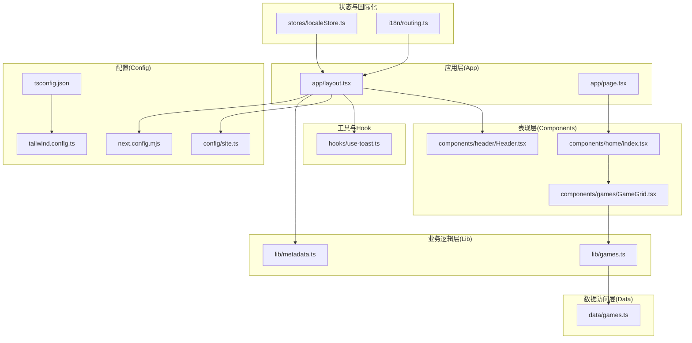
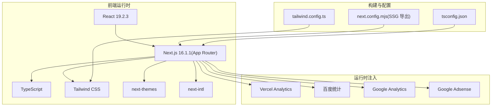
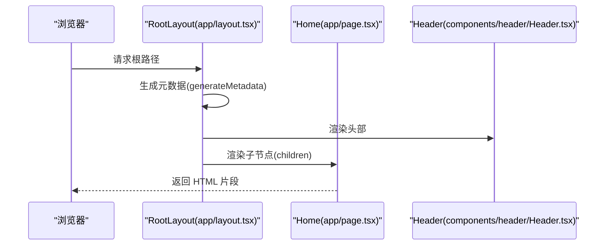
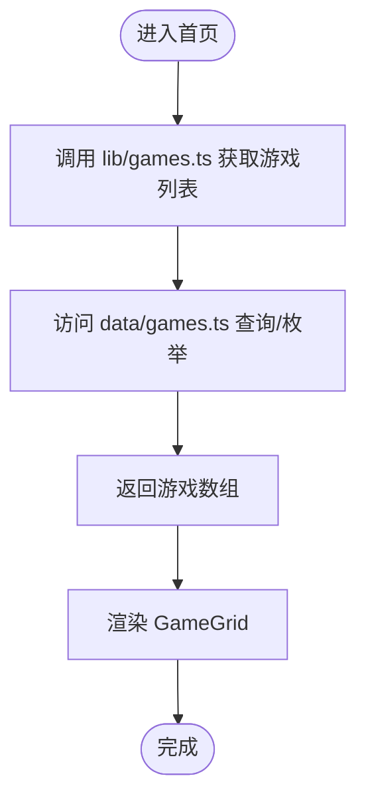
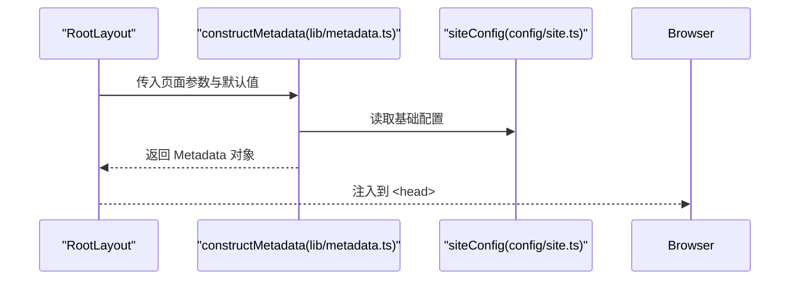
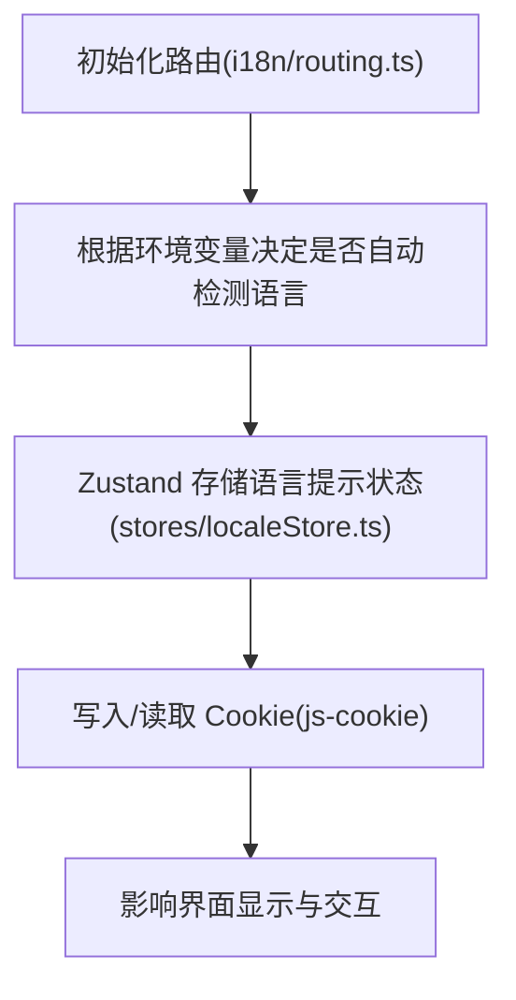
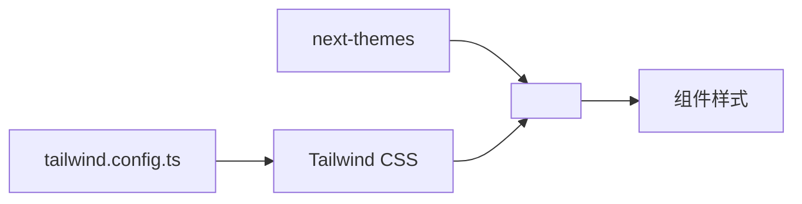
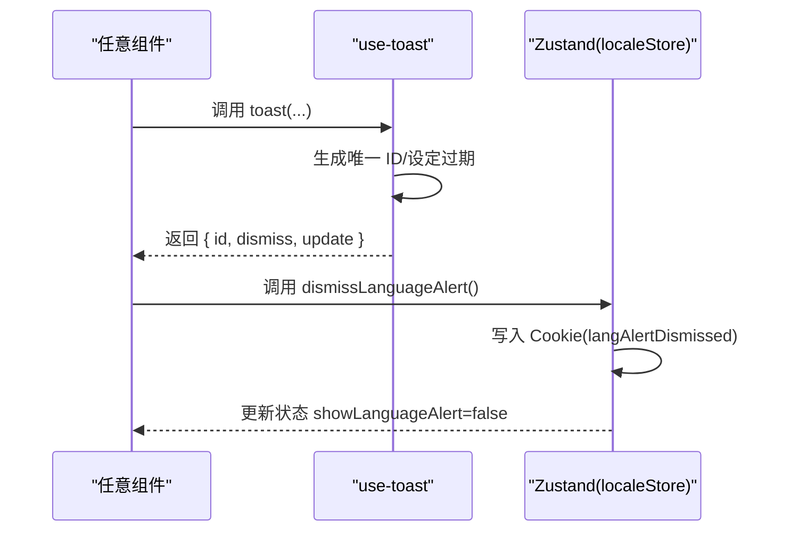
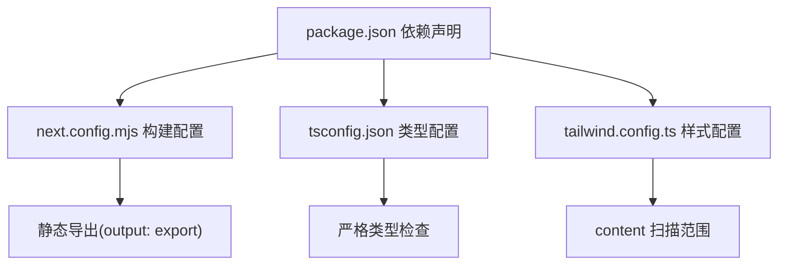

# 整体架构概览

<cite>
**本文引用的文件**
- [package.json](file://package.json)
- [next.config.mjs](file://next.config.mjs)
- [tsconfig.json](file://tsconfig.json)
- [tailwind.config.ts](file://tailwind.config.ts)
- [app/layout.tsx](file://app/layout.tsx)
- [app/page.tsx](file://app/page.tsx)
- [config/site.ts](file://config/site.ts)
- [lib/metadata.ts](file://lib/metadata.ts)
- [components/home/index.tsx](file://components/home/index.tsx)
- [components/games/GameGrid.tsx](file://components/games/GameGrid.tsx)
- [lib/games.ts](file://lib/games.ts)
- [data/games.ts](file://data/games.ts)
- [hooks/use-toast.ts](file://hooks/use-toast.ts)
- [stores/localeStore.ts](file://stores/localeStore.ts)
- [i18n/routing.ts](file://i18n/routing.ts)
- [components/header/Header.tsx](file://components/header/Header.tsx)
</cite>

## 目录
1. [引言](#引言)
2. [项目结构](#项目结构)
3. [核心组件](#核心组件)
4. [架构总览](#架构总览)
5. [详细组件分析](#详细组件分析)
6. [依赖分析](#依赖分析)
7. [性能考虑](#性能考虑)
8. [故障排除指南](#故障排除指南)
9. [结论](#结论)
10. [附录](#附录)

## 引言
本文件为 LinkedIn Answer Today 项目的整体架构概览文档，聚焦于基于 Next.js 16.1.1 的 App Router 架构与静态生成（SSG）策略，阐述分层架构设计（表现层、业务逻辑层、数据访问层）以及技术栈选择的架构考量（React 19.2.3、TypeScript、Tailwind CSS 等）。文档同时提供系统架构图与组件关系图，帮助读者快速理解模块间依赖与数据流向。

## 项目结构
该项目采用 Next.js App Router 的目录组织方式，页面与布局通过 app 目录下的层级结构进行管理；组件按功能拆分至 components 目录；配置与类型定义分别位于 config、types、i18n、stores、lib、data 等目录；样式与主题通过 Tailwind CSS 与 next-themes 集成；国际化使用 next-intl；构建配置由 next.config.mjs 控制，TS 配置由 tsconfig.json 统一约束。

图表来源
- [app/layout.tsx](file://app/layout.tsx#L1-L78)
- [app/page.tsx](file://app/page.tsx#L1-L6)
- [components/home/index.tsx](file://components/home/index.tsx#L1-L12)
- [components/games/GameGrid.tsx](file://components/games/GameGrid.tsx#L1-L15)
- [lib/games.ts](file://lib/games.ts#L1-L15)
- [data/games.ts](file://data/games.ts#L1-L29)
- [lib/metadata.ts](file://lib/metadata.ts#L1-L78)
- [config/site.ts](file://config/site.ts#L1-L45)
- [tsconfig.json](file://tsconfig.json#L1-L43)
- [tailwind.config.ts](file://tailwind.config.ts#L1-L95)
- [next.config.mjs](file://next.config.mjs#L1-L28)
- [stores/localeStore.ts](file://stores/localeStore.ts#L1-L22)
- [i18n/routing.ts](file://i18n/routing.ts#L1-L37)
- [hooks/use-toast.ts](file://hooks/use-toast.ts#L1-L195)

章节来源
- [package.json](file://package.json#L1-L65)
- [next.config.mjs](file://next.config.mjs#L1-L28)
- [tsconfig.json](file://tsconfig.json#L1-L43)
- [tailwind.config.ts](file://tailwind.config.ts#L1-L95)

## 核心组件
- 应用根布局：负责全局主题、头部尾部、元数据、分析脚本注入与视口配置。
- 主页页面：作为入口路由，渲染首页内容区域。
- 游戏网格组件：从业务层读取游戏列表并渲染卡片。
- 游戏业务层：封装对数据层的访问方法，提供统一接口。
- 数据层：以静态数组形式存储游戏信息，提供查询与枚举能力。
- 元数据构造器：集中生成 SEO 友好的标题、描述、Open Graph 与 Twitter 卡片。
- 国际化与本地存储：通过 next-intl 定义路由规则，使用 Zustand + Cookie 管理语言提示状态。
- 工具与 Hook：提供全局通知（Toaster）与本地持久化状态。

章节来源
- [app/layout.tsx](file://app/layout.tsx#L1-L78)
- [app/page.tsx](file://app/page.tsx#L1-L6)
- [components/home/index.tsx](file://components/home/index.tsx#L1-L12)
- [components/games/GameGrid.tsx](file://components/games/GameGrid.tsx#L1-L15)
- [lib/games.ts](file://lib/games.ts#L1-L15)
- [data/games.ts](file://data/games.ts#L1-L29)
- [lib/metadata.ts](file://lib/metadata.ts#L1-L78)
- [i18n/routing.ts](file://i18n/routing.ts#L1-L37)
- [stores/localeStore.ts](file://stores/localeStore.ts#L1-L22)
- [hooks/use-toast.ts](file://hooks/use-toast.ts#L1-L195)

## 架构总览
系统采用典型的三层架构：
- 表现层（UI 层）：由 Next.js App Router 路由驱动，组件负责渲染与交互。
- 业务逻辑层（Lib 层）：封装领域操作，如游戏列表获取、元数据生成等。
- 数据访问层（Data 层）：提供静态数据与查询函数，未来可替换为外部 API 或数据库。

静态生成（SSG）策略：
- 通过 next.config.mjs 的 output: "export" 将应用导出为静态站点，适合部署在 CDN 或静态托管平台。
- App Router 的 generateMetadata 在构建期生成 SEO 元数据，提升首屏性能与 SEO 表现。
- 本地化与主题切换在客户端完成，不依赖服务端渲染。

技术栈架构考量：
- Next.js 16.1.1 + App Router：提供路由、SSG、流式传输与现代开发体验。
- React 19.2.3：最新稳定版本，支持并发特性与性能优化。
- TypeScript：强类型保障，提升可维护性与协作效率。
- Tailwind CSS：实用优先的原子化样式框架，与 next-themes 协同实现深浅主题。
- next-intl：多语言路由与本地化方案，支持自动检测与前缀控制。
- Zustand + js-cookie：轻量状态管理与本地持久化，避免复杂状态树。
- Vercel Analytics、百度统计、Google Analytics、Adsense：在生产环境注入，便于观测与变现。

图表来源
- [package.json](file://package.json#L16-L51)
- [next.config.mjs](file://next.config.mjs#L1-L28)
- [tsconfig.json](file://tsconfig.json#L1-L43)
- [tailwind.config.ts](file://tailwind.config.ts#L1-L95)
- [app/layout.tsx](file://app/layout.tsx#L1-L78)

章节来源
- [package.json](file://package.json#L16-L51)
- [next.config.mjs](file://next.config.mjs#L1-L28)
- [app/layout.tsx](file://app/layout.tsx#L1-L78)

## 详细组件分析

### 页面与布局（App Router）
- 根布局负责注入全局样式、主题、头部尾部、元数据与分析脚本，并设置视口主题色。
- 主页页面仅承担路由职责，实际内容由表现层组件承载。

图表来源
- [app/layout.tsx](file://app/layout.tsx#L18-L26)
- [app/layout.tsx](file://app/layout.tsx#L32-L77)
- [app/page.tsx](file://app/page.tsx#L1-L6)
- [components/header/Header.tsx](file://components/header/Header.tsx#L1-L45)

章节来源
- [app/layout.tsx](file://app/layout.tsx#L1-L78)
- [app/page.tsx](file://app/page.tsx#L1-L6)
- [components/header/Header.tsx](file://components/header/Header.tsx#L1-L45)

### 游戏网格与业务逻辑
- GameGrid 从 lib 层获取游戏列表，再交由 GameCard 渲染。
- lib 层封装对 data 层的访问，提供统一查询接口。
- data 层以静态数组形式提供游戏数据，具备按 slug 查询与枚举能力。

图表来源
- [components/games/GameGrid.tsx](file://components/games/GameGrid.tsx#L1-L15)
- [lib/games.ts](file://lib/games.ts#L1-L15)
- [data/games.ts](file://data/games.ts#L1-L29)

章节来源
- [components/games/GameGrid.tsx](file://components/games/GameGrid.tsx#L1-L15)
- [lib/games.ts](file://lib/games.ts#L1-L15)
- [data/games.ts](file://data/games.ts#L1-L29)

### 元数据与 SEO
- 元数据构造器集中处理标题、描述、OG 图片、Twitter 卡片与 robots 规则。
- 根布局通过 generateMetadata 在构建期注入，确保静态页面具备良好的 SEO 基础。

图表来源
- [lib/metadata.ts](file://lib/metadata.ts#L14-L78)
- [config/site.ts](file://config/site.ts#L1-L45)
- [app/layout.tsx](file://app/layout.tsx#L18-L26)

章节来源
- [lib/metadata.ts](file://lib/metadata.ts#L1-L78)
- [config/site.ts](file://config/site.ts#L1-L45)
- [app/layout.tsx](file://app/layout.tsx#L1-L78)

### 国际化与本地化
- 使用 next-intl 定义支持的语言、默认语言与前缀策略，并提供导航工具。
- 语言提示状态通过 Zustand 管理，使用 Cookie 记录用户偏好，30 天过期。

图表来源
- [i18n/routing.ts](file://i18n/routing.ts#L1-L37)
- [stores/localeStore.ts](file://stores/localeStore.ts#L1-L22)

章节来源
- [i18n/routing.ts](file://i18n/routing.ts#L1-L37)
- [stores/localeStore.ts](file://stores/localeStore.ts#L1-L22)

### 主题与样式
- next-themes 提供主题切换能力，Tailwind CSS 提供原子化样式与动画扩展。
- tailwind.config.ts 指定扫描范围与主题扩展，确保按需打包与一致的视觉语言。

图表来源
- [app/layout.tsx](file://app/layout.tsx#L48-L52)
- [tailwind.config.ts](file://tailwind.config.ts#L1-L95)

章节来源
- [app/layout.tsx](file://app/layout.tsx#L1-L78)
- [tailwind.config.ts](file://tailwind.config.ts#L1-L95)

### 通知与状态管理
- use-toast 提供全局通知队列与去重策略，限制同时显示数量并定时移除。
- localeStore 使用 Zustand 管理语言提示状态，结合 Cookie 实现持久化。

图表来源
- [hooks/use-toast.ts](file://hooks/use-toast.ts#L145-L195)
- [stores/localeStore.ts](file://stores/localeStore.ts#L14-L22)

章节来源
- [hooks/use-toast.ts](file://hooks/use-toast.ts#L1-L195)
- [stores/localeStore.ts](file://stores/localeStore.ts#L1-L22)

## 依赖分析
- 运行时依赖：Next.js 16.1.1、React 19.2.3、next-intl、next-themes、Tailwind CSS、Zustand、Winston 日志、Resend 邮件、Upstash 限流与 Redis 等。
- 开发依赖：TypeScript、Tailwind CSS、ESLint、PostCSS、wrangler 等。
- 构建配置：启用静态导出、禁用图片优化、生产环境移除 console、远程图片源白名单等。
- 类型配置：严格模式、路径别名 @/*、增量编译与 bundler 解析。

图表来源
- [package.json](file://package.json#L16-L64)
- [next.config.mjs](file://next.config.mjs#L1-L28)
- [tsconfig.json](file://tsconfig.json#L1-L43)
- [tailwind.config.ts](file://tailwind.config.ts#L1-L95)

章节来源
- [package.json](file://package.json#L1-L65)
- [next.config.mjs](file://next.config.mjs#L1-L28)
- [tsconfig.json](file://tsconfig.json#L1-L43)
- [tailwind.config.ts](file://tailwind.config.ts#L1-L95)

## 性能考虑
- SSG 导出：通过静态生成减少服务器压力，提升首屏加载速度与 SEO 表现。
- 构建期元数据：generateMetadata 在构建期计算，避免运行时开销。
- 图片优化关闭：静态导出场景下禁用 Next.js 图片优化，配合静态资源托管。
- 生产环境移除 console：降低包体积与潜在调试信息泄露风险。
- Tailwind 按需扫描：仅打包实际使用的样式，减少 CSS 体积。
- 并发与状态：React 19 与 Zustand 提供更优的并发与状态更新体验。

## 故障排除指南
- 静态导出后图片异常：确认 images.unoptimized 已启用且远程图片域名已在 remotePatterns 中配置。
- 国际化路径错误：检查 i18n/routing.ts 中的 locales、defaultLocale 与 localePrefix 设置。
- 主题切换无效：确认 next-themes 的 attribute 与默认主题配置正确，Tailwind 类名一致。
- 通知未消失：检查 use-toast 的过期时间与去重策略，确保只保留一个通知。
- 语言提示未持久化：确认 js-cookie 是否可用，Cookie 是否在 30 天内有效。

章节来源
- [next.config.mjs](file://next.config.mjs#L5-L16)
- [i18n/routing.ts](file://i18n/routing.ts#L12-L23)
- [app/layout.tsx](file://app/layout.tsx#L48-L52)
- [hooks/use-toast.ts](file://hooks/use-toast.ts#L11-L195)
- [stores/localeStore.ts](file://stores/localeStore.ts#L14-L22)

## 结论
本项目以 Next.js 16.1.1 的 App Router 为核心，采用静态生成策略与三层架构设计，结合 React 19.2.3、TypeScript、Tailwind CSS 等技术栈，实现了高性能、可维护、可扩展的前端架构。通过集中式元数据生成、国际化路由与状态管理，项目在用户体验与工程效率上取得平衡。建议后续在数据层引入外部 API 或数据库，以支撑动态内容与用户行为数据。

## 附录
- 关键配置要点
  - 静态导出：output: "export"
  - 图片优化：unoptimized: true
  - 远程图片源：remotePatterns
  - 生产移除 console：removeConsole
- 技术选型收益
  - App Router：路由与 SSR/SSG 的统一体验
  - next-intl：完善的国际化与路由集成
  - next-themes：主题切换与暗色模式
  - Tailwind CSS：样式一致性与可维护性
  - Zustand：轻量状态管理与持久化