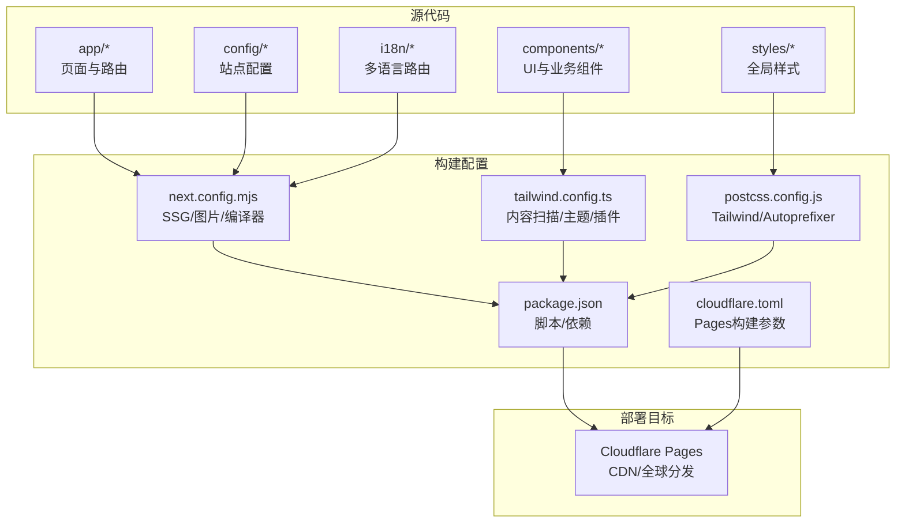
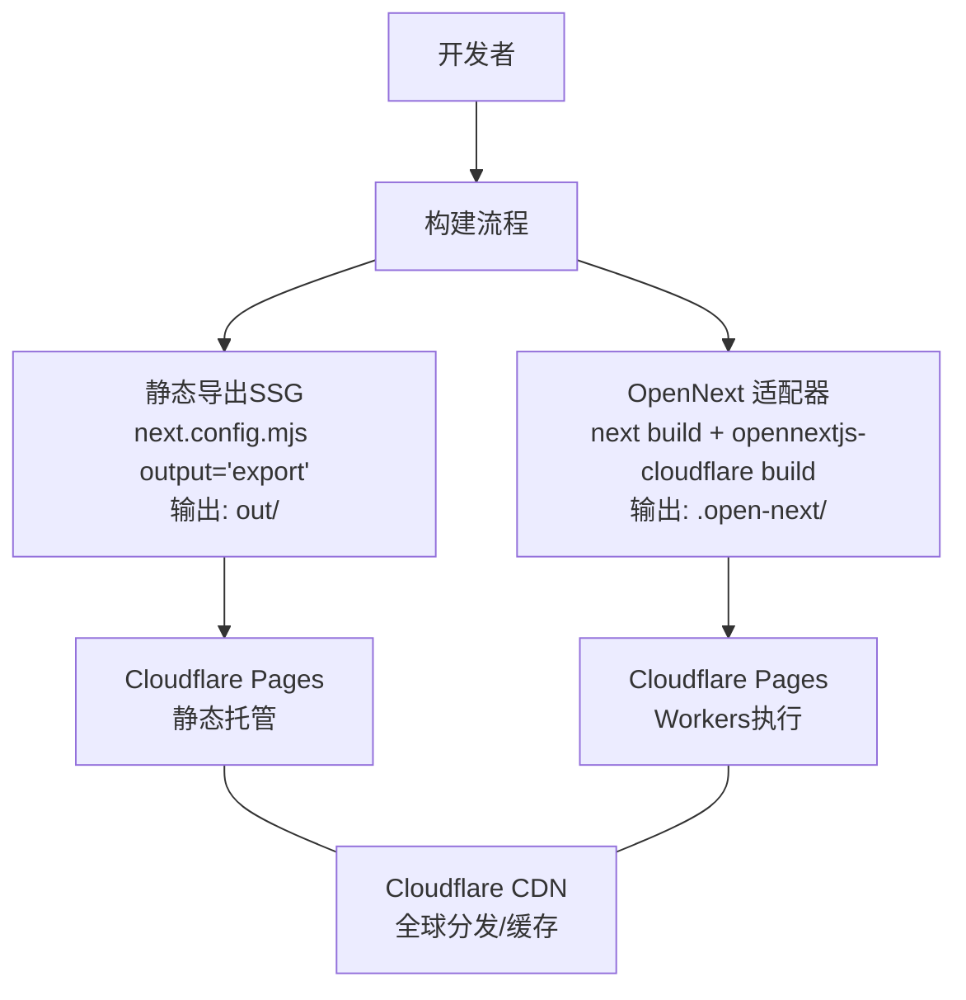
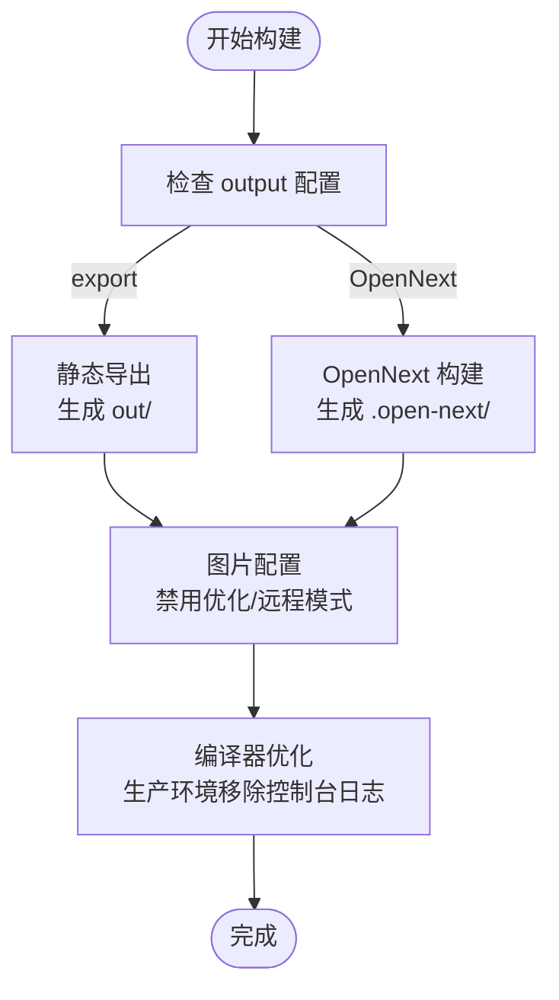
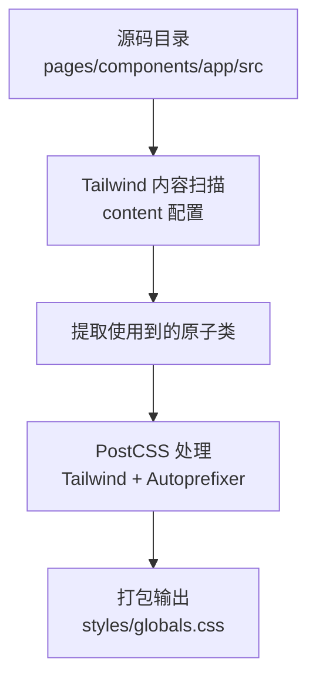
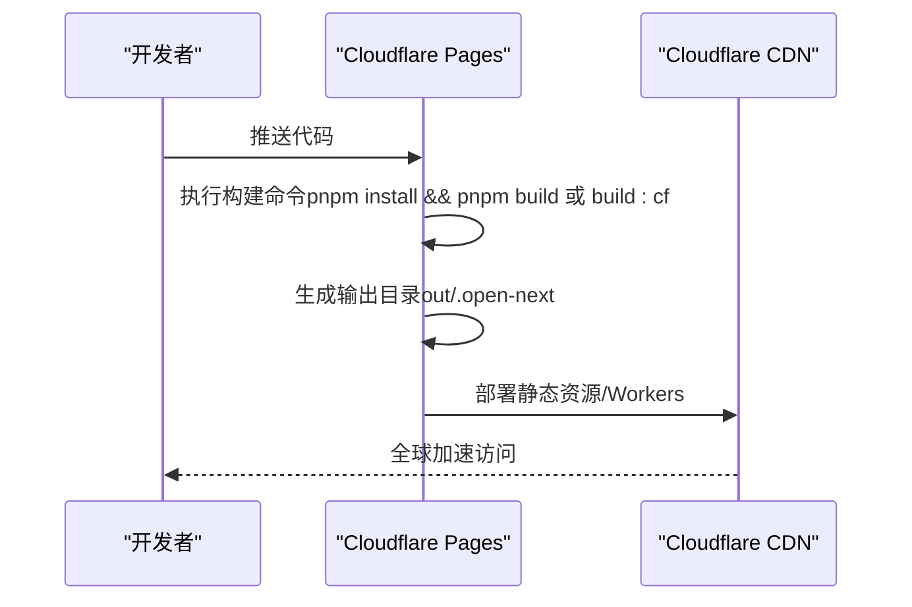
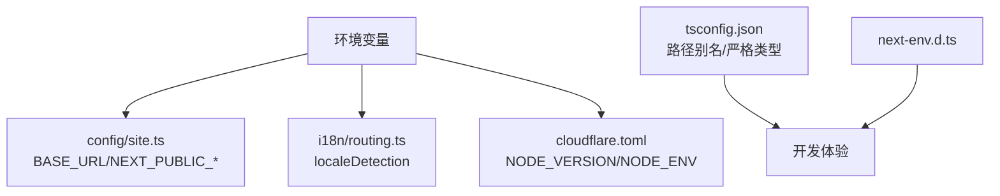
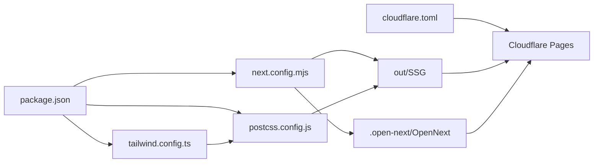

# 构建部署架构

<cite>
**本文引用的文件**
- [next.config.mjs](file://next.config.mjs)
- [cloudflare.toml](file://cloudflare.toml)
- [tailwind.config.ts](file://tailwind.config.ts)
- [postcss.config.js](file://postcss.config.js)
- [package.json](file://package.json)
- [CLOUDFLARE_DEPLOYMENT.md](file://CLOUDFLARE_DEPLOYMENT.md)
- [CLOUDFLARE_PAGES_SETUP.md](file://CLOUDFLARE_PAGES_SETUP.md)
- [CLOUDFLARE_PAGES_STATIC_DEPLOY.md](file://CLOUDFLARE_PAGES_STATIC_DEPLOY.md)
- [DEPLOY_CLOUDFLARE.md](file://DEPLOY_CLOUDFLARE.md)
- [components.json](file://components.json)
- [tsconfig.json](file://tsconfig.json)
- [next-env.d.ts](file://next-env.d.ts)
- [config/site.ts](file://config/site.ts)
- [i18n/routing.ts](file://i18n/routing.ts)
</cite>

## 目录
1. [引言](#引言)
2. [项目结构](#项目结构)
3. [核心组件](#核心组件)
4. [架构总览](#架构总览)
5. [详细组件分析](#详细组件分析)
6. [依赖关系分析](#依赖关系分析)
7. [性能考量](#性能考量)
8. [故障排除指南](#故障排除指南)
9. [结论](#结论)
10. [附录](#附录)

## 引言
本文件面向构建与部署工程师及运维人员，系统性梳理该项目的构建与部署架构，重点覆盖：
- 基于 Next.js 的静态生成（SSG）构建流程与输出结构
- Cloudflare Pages 部署架构、CDN 缓存与全球分发策略
- Tailwind CSS 的按需生成与 Tree Shaking 优化
- 环境变量管理与配置文件组织
- 部署流水线与 CI/CD 最佳实践（含自动化测试与部署验证）

## 项目结构
项目采用 Next.js App Router 结构，结合多语言（i18n）、静态导出与 Cloudflare Pages 部署。关键目录与文件职责概览：
- app/: 页面与路由（含动态路由与静态 SSG）
- components/: UI 组件与业务组件
- config/: 站点配置（含环境变量读取）
- i18n/: 多语言路由与检测
- styles/: 全局样式入口
- 构建与部署相关：next.config.mjs、tailwind.config.ts、postcss.config.js、cloudflare.toml、package.json、各部署文档

图表来源
- [next.config.mjs](file://next.config.mjs#L1-L28)
- [tailwind.config.ts](file://tailwind.config.ts#L1-L95)
- [postcss.config.js](file://postcss.config.js#L1-L7)
- [package.json](file://package.json#L1-L65)
- [cloudflare.toml](file://cloudflare.toml#L1-L13)

章节来源
- [next.config.mjs](file://next.config.mjs#L1-L28)
- [cloudflare.toml](file://cloudflare.toml#L1-L13)
- [package.json](file://package.json#L1-L65)

## 核心组件
- Next.js 构建配置（SSG、图片、编译器移除控制台）
- Tailwind CSS 按需生成与 Tree Shaking
- PostCSS 集成（Tailwind/Autoprefixer）
- Cloudflare Pages 构建与部署（静态导出与 OpenNext 两种路径）
- 环境变量与站点配置
- TypeScript 与类型声明

章节来源
- [next.config.mjs](file://next.config.mjs#L1-L28)
- [tailwind.config.ts](file://tailwind.config.ts#L1-L95)
- [postcss.config.js](file://postcss.config.js#L1-L7)
- [package.json](file://package.json#L1-L65)
- [CLOUDFLARE_DEPLOYMENT.md](file://CLOUDFLARE_DEPLOYMENT.md#L1-L303)
- [CLOUDFLARE_PAGES_STATIC_DEPLOY.md](file://CLOUDFLARE_PAGES_STATIC_DEPLOY.md#L1-L61)
- [config/site.ts](file://config/site.ts#L1-L45)
- [tsconfig.json](file://tsconfig.json#L1-L43)
- [next-env.d.ts](file://next-env.d.ts#L1-L7)

## 架构总览
本项目提供两条主要部署路径：
- 静态导出（SSG）：适用于无需 API Routes 的纯静态站点，输出至 out 目录，由 Cloudflare Pages 直接托管。
- OpenNext Cloudflare 适配器：支持 API Routes 与 SSR，输出至 .open-next 目录，通过 Cloudflare Pages Workers 执行。

图表来源
- [next.config.mjs](file://next.config.mjs#L1-L28)
- [CLOUDFLARE_DEPLOYMENT.md](file://CLOUDFLARE_DEPLOYMENT.md#L34-L146)
- [CLOUDFLARE_PAGES_STATIC_DEPLOY.md](file://CLOUDFLARE_PAGES_STATIC_DEPLOY.md#L1-L61)

## 详细组件分析

### Next.js 构建配置与优化
- 输出模式：静态导出（SSG），输出目录为 out；若使用 OpenNext，则不启用静态导出。
- 图片优化：静态导出场景下禁用 Next.js 图片优化，并允许远程图片域名白名单（R2 Public URL）。
- 编译器优化：生产环境移除控制台日志（保留 error 类型），降低体积与噪音。
- 与 i18n/Middleware 的兼容：Edge Runtime（Cloudflare Workers）要求，需使用 middleware.ts 并声明 runtime = 'edge'。

图表来源
- [next.config.mjs](file://next.config.mjs#L1-L28)
- [CLOUDFLARE_DEPLOYMENT.md](file://CLOUDFLARE_DEPLOYMENT.md#L34-L146)

章节来源
- [next.config.mjs](file://next.config.mjs#L1-L28)
- [CLOUDFLARE_DEPLOYMENT.md](file://CLOUDFLARE_DEPLOYMENT.md#L34-L146)

### Tailwind CSS 构建优化（按需生成与 Tree Shaking）
- 内容扫描：配置 content 覆盖 pages、components、app、src 等目录，确保仅打包被使用的样式。
- 插件链：PostCSS 中启用 tailwindcss 与 autoprefixer，实现原子类提取与浏览器兼容前缀补全。
- 主题扩展：自定义颜色、圆角、动画等，统一设计系统。
- 组件库集成：通过 shadcn/ui 配置文件 components.json 指定 Tailwind 路径与别名，便于按需引入。

图表来源
- [tailwind.config.ts](file://tailwind.config.ts#L1-L95)
- [postcss.config.js](file://postcss.config.js#L1-L7)
- [components.json](file://components.json#L1-L21)

章节来源
- [tailwind.config.ts](file://tailwind.config.ts#L1-L95)
- [postcss.config.js](file://postcss.config.js#L1-L7)
- [components.json](file://components.json#L1-L21)

### Cloudflare Pages 部署架构
- 静态导出（SSG）：构建命令执行后，Cloudflare Pages 自动托管 out 目录，无需部署命令。
- OpenNext 适配器：先执行 next build，再执行 opennextjs-cloudflare build，生成 .open-next 目录供 Pages Workers 执行。
- 构建环境：Node.js 版本可通过环境变量或引擎配置指定；包管理器支持 pnpm/npm/yarn。
- 全球分发与缓存：Pages 依托 Cloudflare CDN，具备全球边缘节点与智能缓存策略，加速静态资源与页面访问。

图表来源
- [CLOUDFLARE_PAGES_STATIC_DEPLOY.md](file://CLOUDFLARE_PAGES_STATIC_DEPLOY.md#L1-L61)
- [CLOUDFLARE_PAGES_SETUP.md](file://CLOUDFLARE_PAGES_SETUP.md#L1-L109)
- [cloudflare.toml](file://cloudflare.toml#L1-L13)

章节来源
- [CLOUDFLARE_PAGES_STATIC_DEPLOY.md](file://CLOUDFLARE_PAGES_STATIC_DEPLOY.md#L1-L61)
- [CLOUDFLARE_PAGES_SETUP.md](file://CLOUDFLARE_PAGES_SETUP.md#L1-L109)
- [cloudflare.toml](file://cloudflare.toml#L1-L13)

### 环境变量管理与配置文件组织
- 站点配置：从环境变量读取站点 URL，用于 SEO 与分享链接。
- 多语言路由：localeDetection 可通过环境变量开关，支持自动语言检测。
- 构建环境：通过 cloudflare.toml 与 Pages 控制台设置 NODE_VERSION、NODE_ENV 等。
- 类型安全：tsconfig.json 与 next-env.d.ts 提供 Next.js 类型支持与路径别名。

图表来源
- [config/site.ts](file://config/site.ts#L1-L45)
- [i18n/routing.ts](file://i18n/routing.ts#L1-L37)
- [cloudflare.toml](file://cloudflare.toml#L1-L13)
- [tsconfig.json](file://tsconfig.json#L1-L43)
- [next-env.d.ts](file://next-env.d.ts#L1-L7)

章节来源
- [config/site.ts](file://config/site.ts#L1-L45)
- [i18n/routing.ts](file://i18n/routing.ts#L1-L37)
- [cloudflare.toml](file://cloudflare.toml#L1-L13)
- [tsconfig.json](file://tsconfig.json#L1-L43)
- [next-env.d.ts](file://next-env.d.ts#L1-L7)

### CI/CD 最佳实践（自动化测试与部署验证）
- 构建脚本：package.json 中提供 build、build:cf、deploy 等脚本，便于流水线调用。
- 本地验证：先在本地执行完整构建（build:cf），检查输出目录是否存在，再进行预览。
- 自动化：通过 Pages 与 GitHub 集成实现推送即构建；必要时配置构建通知与缓存策略。
- 验证清单：部署前后核对 API Routes、i18n、图片与静态资源可用性。

章节来源
- [package.json](file://package.json#L1-L65)
- [CLOUDFLARE_DEPLOYMENT.md](file://CLOUDFLARE_DEPLOYMENT.md#L190-L207)
- [CLOUDFLARE_PAGES_SETUP.md](file://CLOUDFLARE_PAGES_SETUP.md#L39-L55)

## 依赖关系分析
- 构建链路：package.json 脚本驱动 next.config.mjs 与 OpenNext 适配器，生成 out 或 .open-next。
- 样式链路：tailwind.config.ts 与 postcss.config.js 影响最终 CSS 体积与加载性能。
- 部署链路：cloudflare.toml 与 Pages 控制台共同决定构建命令、输出目录与环境变量。

图表来源
- [package.json](file://package.json#L1-L65)
- [next.config.mjs](file://next.config.mjs#L1-L28)
- [tailwind.config.ts](file://tailwind.config.ts#L1-L95)
- [postcss.config.js](file://postcss.config.js#L1-L7)
- [cloudflare.toml](file://cloudflare.toml#L1-L13)

章节来源
- [package.json](file://package.json#L1-L65)
- [next.config.mjs](file://next.config.mjs#L1-L28)
- [tailwind.config.ts](file://tailwind.config.ts#L1-L95)
- [postcss.config.js](file://postcss.config.js#L1-L7)
- [cloudflare.toml](file://cloudflare.toml#L1-L13)

## 性能考量
- 构建体积与速度
  - 移除控制台日志（生产环境）以减小 JS 体积与日志开销。
  - 使用 pnpm 与构建缓存，缩短安装与增量构建时间。
- 样式体积
  - Tailwind 内容扫描仅打包使用到的原子类，避免 Tree Shaking 失效。
  - 合理拆分样式入口，避免全局样式臃肿。
- 静态资源
  - 静态导出场景禁用 Next.js 图片优化，配合 CDN 边缘缓存提升性能。
  - 远程图片域名白名单，确保跨域资源可被正确加载。
- CDN 与缓存
  - Pages 依托 Cloudflare 全球边缘节点，静态资源与页面可获得就近缓存与加速。

章节来源
- [next.config.mjs](file://next.config.mjs#L17-L24)
- [CLOUDFLARE_PAGES_SETUP.md](file://CLOUDFLARE_PAGES_SETUP.md#L236-L249)
- [tailwind.config.ts](file://tailwind.config.ts#L5-L10)

## 故障排除指南
- 构建命令错误（OpenNext）
  - 症状：找不到 .open-next/worker.js
  - 解决：确保构建命令包含 opennextjs-cloudflare build，先 next build 再 opennextjs-cloudflare build。
- 静态导出与部署命令
  - 症状：部署命令字段非空导致静态站点误判
  - 解决：静态导出时将“部署命令”留空或使用占位符 echo 命令。
- pnpm 版本不匹配
  - 症状：构建失败或缓存异常
  - 解决：在 .npmrc 中启用 engine-strict，并在 package.json 指定 packageManager。
- 构建超时
  - 症状：构建时间过长
  - 解决：减少依赖、启用缓存、检查无用构建步骤；必要时使用本地 Wrangler 预览。

章节来源
- [CLOUDFLARE_PAGES_SETUP.md](file://CLOUDFLARE_PAGES_SETUP.md#L84-L102)
- [CLOUDFLARE_PAGES_STATIC_DEPLOY.md](file://CLOUDFLARE_PAGES_STATIC_DEPLOY.md#L20-L46)
- [CLOUDFLARE_DEPLOYMENT.md](file://CLOUDFLARE_DEPLOYMENT.md#L167-L189)

## 结论
本项目通过明确的构建配置与部署文档，提供了两条稳定可靠的上线路径：静态导出（SSG）与 OpenNext 适配器（支持 API Routes）。结合 Tailwind 按需生成与 PostCSS 优化、Cloudflare Pages 的全球 CDN 加速，可在保证性能的同时快速迭代与发布。建议在 CI/CD 中固化构建脚本与验证清单，确保每次变更均可自动完成构建、测试与部署验证。

## 附录
- 部署检查清单与推荐配置可参考各部署文档中的“推荐配置总结”与“部署检查清单”。

章节来源
- [CLOUDFLARE_DEPLOYMENT.md](file://CLOUDFLARE_DEPLOYMENT.md#L250-L303)
- [CLOUDFLARE_PAGES_SETUP.md](file://CLOUDFLARE_PAGES_SETUP.md#L104-L109)