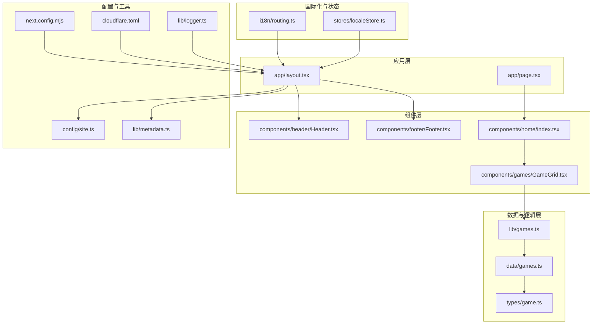
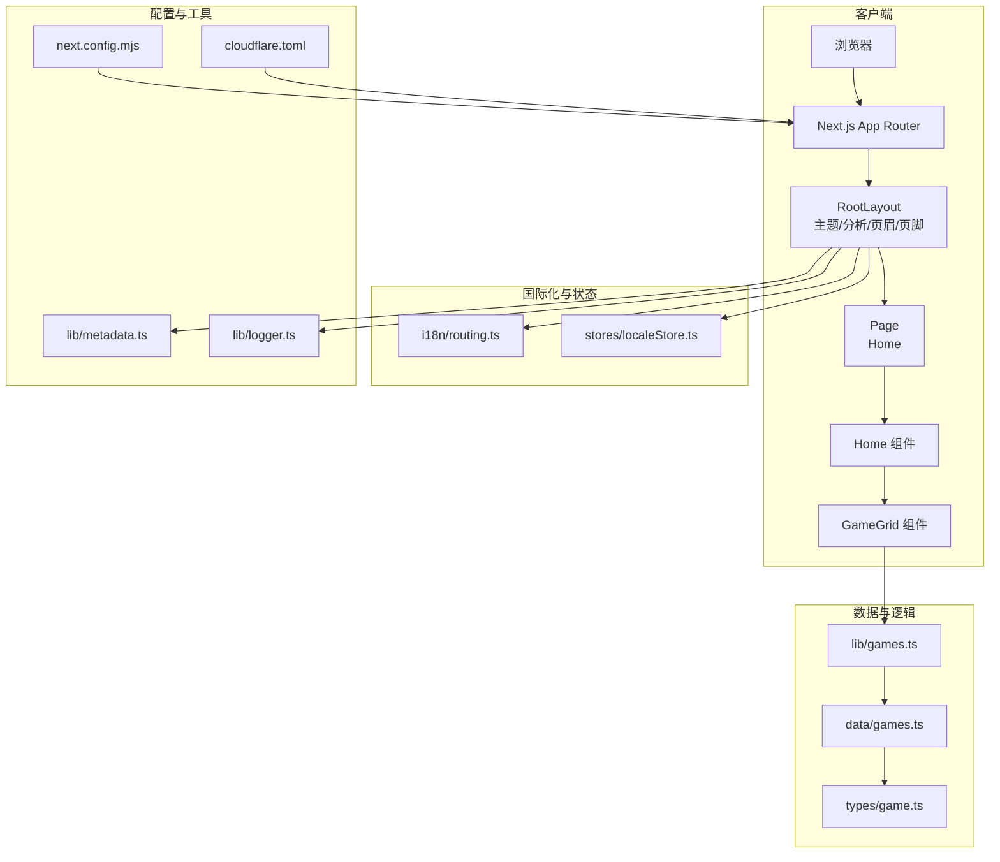
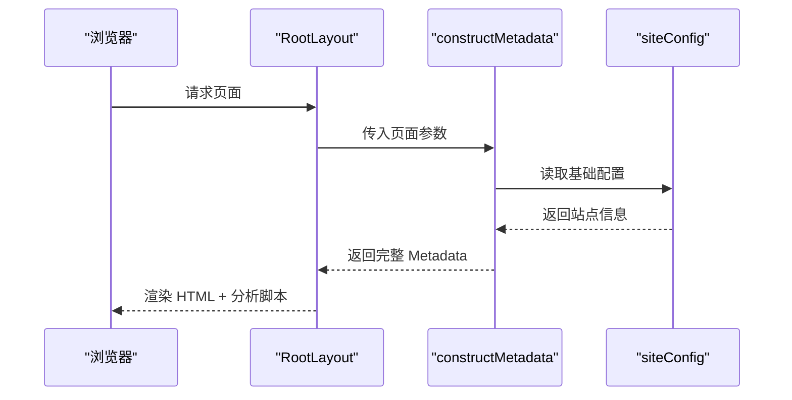
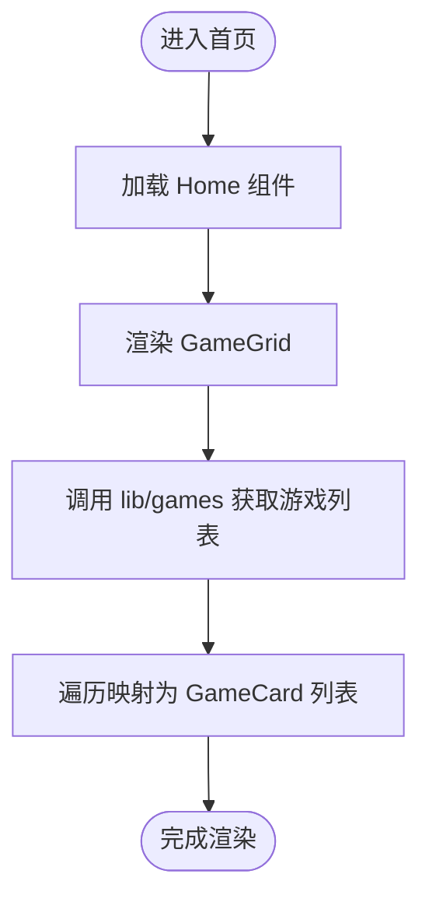
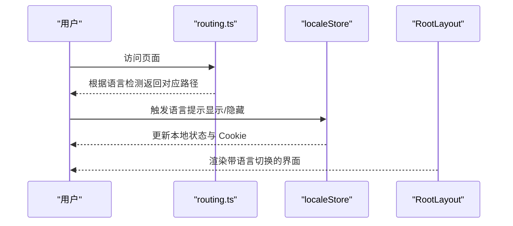
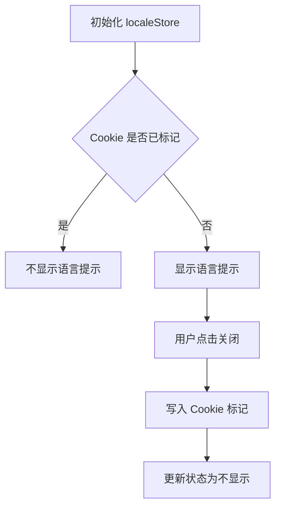
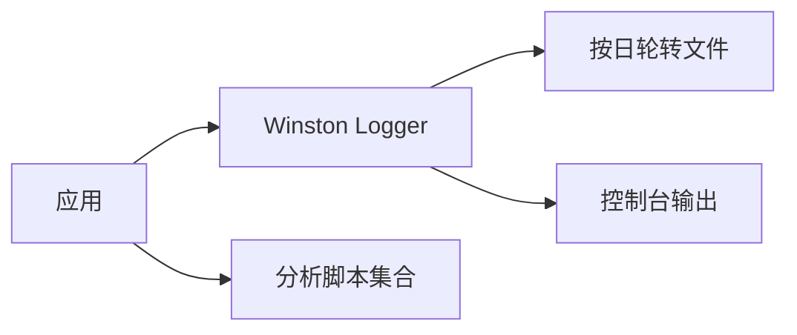
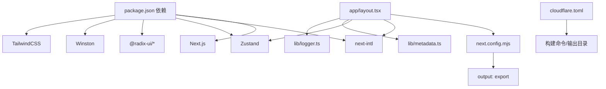
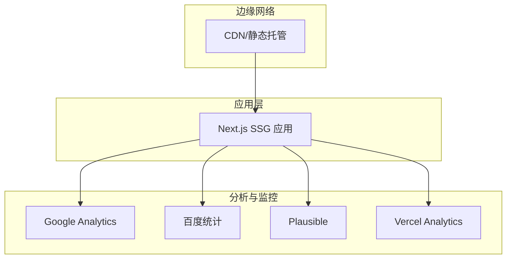

# 架构设计

<cite>
**本文引用的文件**
- [package.json](file://package.json)
- [next.config.mjs](file://next.config.mjs)
- [cloudflare.toml](file://cloudflare.toml)
- [app/layout.tsx](file://app/layout.tsx)
- [app/page.tsx](file://app/page.tsx)
- [i18n/routing.ts](file://i18n/routing.ts)
- [stores/localeStore.ts](file://stores/localeStore.ts)
- [config/site.ts](file://config/site.ts)
- [lib/metadata.ts](file://lib/metadata.ts)
- [lib/logger.ts](file://lib/logger.ts)
- [components/header/Header.tsx](file://components/header/Header.tsx)
- [components/footer/Footer.tsx](file://components/footer/Footer.tsx)
- [components/home/index.tsx](file://components/home/index.tsx)
- [components/games/GameGrid.tsx](file://components/games/GameGrid.tsx)
- [lib/games.ts](file://lib/games.ts)
- [data/games.ts](file://data/games.ts)
- [types/game.ts](file://types/game.ts)
- [hooks/use-toast.ts](file://hooks/use-toast.ts)
</cite>

## 目录
1. [引言](#引言)
2. [项目结构](#项目结构)
3. [核心组件](#核心组件)
4. [架构总览](#架构总览)
5. [详细组件分析](#详细组件分析)
6. [依赖关系分析](#依赖关系分析)
7. [性能考量](#性能考量)
8. [故障排查指南](#故障排查指南)
9. [结论](#结论)
10. [附录](#附录)

## 引言
本项目为“LinkedIn Answer Today”，采用 Next.js App Router 与静态生成（SSG）策略构建，目标是提供每日谜题答案的快速访问与分享体验。系统围绕组件化设计、国际化（i18n）、状态管理（Zustand）、以及可维护的数据流展开。技术选型与架构权衡如下：
- 技术栈：Next.js 16、TypeScript、TailwindCSS、Radix UI、Zustand、next-intl、Winston 日志等。
- 架构模式：App Router 路由 + 布局层封装 + 组件分层（头部/页脚/内容区）+ 数据层抽象（lib/data/types）。
- 国际化：基于 next-intl 的路由级国际化与自动语言检测。
- 状态管理：Zustand 简洁轻量的状态容器，用于本地 UI 状态（如语言提示）。
- 静态生成：通过 Next.js 输出目录导出（output: export），适配静态托管平台（Cloudflare Pages）。

## 项目结构
项目采用按功能域划分的目录组织方式，结合 App Router 的页面与布局结构，形成清晰的层次：
- app：页面与布局根目录，包含根布局、首页、各页面与站点地图等。
- components：可复用 UI 组件，按功能域拆分（header/footer/games/home/ui/mdx/social-icons/icons）。
- lib：业务逻辑与工具函数（元数据构造、游戏数据访问、日志、工具等）。
- data：静态数据与数据访问方法（games、answers 等）。
- i18n：国际化路由与消息加载配置。
- stores：Zustand 状态存储（localeStore）。
- types：共享类型定义（game、blog、common、siteConfig）。
- 公共资源：public 下的广告与静态文件。

图表来源
- [app/layout.tsx](file://app/layout.tsx#L1-L78)
- [app/page.tsx](file://app/page.tsx#L1-L6)
- [components/header/Header.tsx](file://components/header/Header.tsx#L1-L45)
- [components/footer/Footer.tsx](file://components/footer/Footer.tsx#L1-L67)
- [components/home/index.tsx](file://components/home/index.tsx#L1-L12)
- [components/games/GameGrid.tsx](file://components/games/GameGrid.tsx#L1-L15)
- [lib/games.ts](file://lib/games.ts#L1-L15)
- [data/games.ts](file://data/games.ts#L1-L29)
- [types/game.ts](file://types/game.ts#L1-L27)
- [i18n/routing.ts](file://i18n/routing.ts#L1-L37)
- [stores/localeStore.ts](file://stores/localeStore.ts#L1-L22)
- [next.config.mjs](file://next.config.mjs#L1-L28)
- [config/site.ts](file://config/site.ts#L1-L45)
- [lib/metadata.ts](file://lib/metadata.ts#L1-L78)
- [lib/logger.ts](file://lib/logger.ts#L1-L41)
- [cloudflare.toml](file://cloudflare.toml#L1-L13)

章节来源
- [package.json](file://package.json#L1-L65)
- [next.config.mjs](file://next.config.mjs#L1-L28)
- [cloudflare.toml](file://cloudflare.toml#L1-L13)

## 核心组件
- 根布局与主题：根布局负责注入全局样式、主题切换、页眉/页脚、通知组件与分析脚本；同时通过 generateMetadata 提供 SEO 元数据。
- 页面入口：首页页面直接渲染 Home 组件，Home 组件内再渲染游戏网格。
- 游戏网格：从 lib 层读取游戏列表，映射为卡片组件，实现数据与视图分离。
- 国际化与语言检测：通过 next-intl 定义路由规则与导航 API，并支持自动语言检测。
- 状态管理：使用 Zustand 存储语言提示的本地状态与 Cookie 标记。
- 日志与监控：Winston 按日轮转记录日志，生产环境注入分析脚本（Vercel Analytics、百度统计、Google Analytics、Plausible、AdSense）。

章节来源
- [app/layout.tsx](file://app/layout.tsx#L1-L78)
- [app/page.tsx](file://app/page.tsx#L1-L6)
- [components/home/index.tsx](file://components/home/index.tsx#L1-L12)
- [components/games/GameGrid.tsx](file://components/games/GameGrid.tsx#L1-L15)
- [lib/games.ts](file://lib/games.ts#L1-L15)
- [i18n/routing.ts](file://i18n/routing.ts#L1-L37)
- [stores/localeStore.ts](file://stores/localeStore.ts#L1-L22)
- [lib/logger.ts](file://lib/logger.ts#L1-L41)

## 架构总览
系统采用“布局层 + 页面层 + 组件层 + 数据层”的分层架构，配合静态生成与国际化路由，形成可扩展、可维护的前端体系。

图表来源
- [app/layout.tsx](file://app/layout.tsx#L1-L78)
- [app/page.tsx](file://app/page.tsx#L1-L6)
- [components/home/index.tsx](file://components/home/index.tsx#L1-L12)
- [components/games/GameGrid.tsx](file://components/games/GameGrid.tsx#L1-L15)
- [lib/games.ts](file://lib/games.ts#L1-L15)
- [data/games.ts](file://data/games.ts#L1-L29)
- [types/game.ts](file://types/game.ts#L1-L27)
- [i18n/routing.ts](file://i18n/routing.ts#L1-L37)
- [stores/localeStore.ts](file://stores/localeStore.ts#L1-L22)
- [lib/metadata.ts](file://lib/metadata.ts#L1-L78)
- [lib/logger.ts](file://lib/logger.ts#L1-L41)
- [next.config.mjs](file://next.config.mjs#L1-L28)
- [cloudflare.toml](file://cloudflare.toml#L1-L13)

## 详细组件分析

### 根布局与元数据
- 职责：统一注入主题、页眉、页脚、通知、分析脚本与 SEO 元数据；控制视口与字体。
- 关键点：
  - generateMetadata 动态生成标题、描述、Open Graph 与 Twitter 卡片。
  - 主题切换通过 next-themes 实现。
  - 生产环境启用分析脚本与广告脚本。
- 复杂度：O(1)，无复杂计算，主要为组合与注入。

图表来源
- [app/layout.tsx](file://app/layout.tsx#L18-L26)
- [lib/metadata.ts](file://lib/metadata.ts#L14-L78)
- [config/site.ts](file://config/site.ts#L14-L44)

章节来源
- [app/layout.tsx](file://app/layout.tsx#L1-L78)
- [lib/metadata.ts](file://lib/metadata.ts#L1-L78)
- [config/site.ts](file://config/site.ts#L1-L45)

### 首页与游戏网格
- 首页页面：简单包装 Home 组件，便于后续扩展。
- Home 组件：容器组件，负责布局与区域划分。
- GameGrid：从 lib 层获取游戏列表，遍历渲染卡片。
- 数据流：UI -> lib -> data -> types，单向数据流，职责清晰。

图表来源
- [app/page.tsx](file://app/page.tsx#L1-L6)
- [components/home/index.tsx](file://components/home/index.tsx#L1-L12)
- [components/games/GameGrid.tsx](file://components/games/GameGrid.tsx#L1-L15)
- [lib/games.ts](file://lib/games.ts#L1-L15)
- [data/games.ts](file://data/games.ts#L1-L29)
- [types/game.ts](file://types/game.ts#L1-L27)

章节来源
- [app/page.tsx](file://app/page.tsx#L1-L6)
- [components/home/index.tsx](file://components/home/index.tsx#L1-L12)
- [components/games/GameGrid.tsx](file://components/games/GameGrid.tsx#L1-L15)
- [lib/games.ts](file://lib/games.ts#L1-L15)
- [data/games.ts](file://data/games.ts#L1-L29)
- [types/game.ts](file://types/game.ts#L1-L27)

### 国际化与语言检测
- 路由配置：定义支持的语言列表、默认语言、前缀策略与自动检测开关。
- 导航封装：提供 Link、redirect、usePathname、useRouter 等 API，统一处理多语言路径。
- 本地状态：Zustand 存储语言提示状态，并通过 Cookie 记忆用户选择。

图表来源
- [i18n/routing.ts](file://i18n/routing.ts#L1-L37)
- [stores/localeStore.ts](file://stores/localeStore.ts#L1-L22)
- [app/layout.tsx](file://app/layout.tsx#L1-L78)

章节来源
- [i18n/routing.ts](file://i18n/routing.ts#L1-L37)
- [stores/localeStore.ts](file://stores/localeStore.ts#L1-L22)

### 状态管理（Zustand）
- 作用域：本地 UI 状态（语言提示），不涉及全局持久化。
- 行为：提供 setter、dismiss 与 Cookie 标记，避免重复提示。
- 与国际化协作：在语言切换或首次访问时决定是否展示提示。

图表来源
- [stores/localeStore.ts](file://stores/localeStore.ts#L1-L22)

章节来源
- [stores/localeStore.ts](file://stores/localeStore.ts#L1-L22)

### 日志与监控
- 日志：Winston 按日轮转记录，支持控制台与文件输出，便于问题定位。
- 监控：生产环境注入多种分析脚本，覆盖流量与行为追踪。

图表来源
- [lib/logger.ts](file://lib/logger.ts#L1-L41)
- [app/layout.tsx](file://app/layout.tsx#L63-L73)

章节来源
- [lib/logger.ts](file://lib/logger.ts#L1-L41)
- [app/layout.tsx](file://app/layout.tsx#L1-L78)

## 依赖关系分析
- 运行时依赖：Next.js、React、next-intl、Zustand、Radix UI、Winston、TailwindCSS 等。
- 构建与部署：Next.js 静态导出（output: export），Cloudflare Pages 配置文件定义构建命令与输出目录。
- 配置耦合：根布局依赖 siteConfig、metadata 工具与分析脚本；组件依赖类型定义与数据层。

图表来源
- [package.json](file://package.json#L16-L51)
- [next.config.mjs](file://next.config.mjs#L1-L28)
- [cloudflare.toml](file://cloudflare.toml#L1-L13)
- [app/layout.tsx](file://app/layout.tsx#L1-L78)
- [lib/metadata.ts](file://lib/metadata.ts#L1-L78)
- [lib/logger.ts](file://lib/logger.ts#L1-L41)

章节来源
- [package.json](file://package.json#L1-L65)
- [next.config.mjs](file://next.config.mjs#L1-L28)
- [cloudflare.toml](file://cloudflare.toml#L1-L13)

## 性能考量
- 静态生成（SSG）：通过 output: export 将页面预渲染为静态 HTML，减少首屏渲染时间与服务器压力。
- 图片优化：静态导出需禁用 Next 图片优化，确保 CDN 正常加载外部图片。
- 构建产物：Cloudflare Pages 使用 pnpm 构建，输出目录为 out，建议开启压缩与缓存策略。
- 代码分割：App Router 默认按路由拆分，保持页面级最小化加载。
- 日志与分析：仅在生产环境注入分析脚本，避免开发阶段的额外开销。

章节来源
- [next.config.mjs](file://next.config.mjs#L3-L24)
- [cloudflare.toml](file://cloudflare.toml#L4-L12)
- [app/layout.tsx](file://app/layout.tsx#L63-L73)

## 故障排查指南
- 页面未正确显示语言切换或提示：检查 localeStore 的 Cookie 写入与读取逻辑，确认语言检测开关。
- 国际化链接异常：核对 routing.ts 中的 locales、defaultLocale 与 localeDetection 设置。
- SEO 元数据缺失：确认 generateMetadata 返回值与 siteConfig 配置一致。
- 日志未生成：检查 LOG_DIR 环境变量与文件权限，确认按日轮转文件存在。
- 静态导出后图片 404：确认 images.unoptimized 与 remotePatterns 配置，确保 R2_PUBLIC_URL 正确。

章节来源
- [stores/localeStore.ts](file://stores/localeStore.ts#L1-L22)
- [i18n/routing.ts](file://i18n/routing.ts#L12-L23)
- [app/layout.tsx](file://app/layout.tsx#L18-L26)
- [config/site.ts](file://config/site.ts#L1-L45)
- [lib/logger.ts](file://lib/logger.ts#L1-L41)
- [next.config.mjs](file://next.config.mjs#L5-L16)

## 结论
本项目以 Next.js App Router 为核心，结合静态生成、组件化设计与国际化路由，构建了简洁高效的前端架构。Zustand 用于轻量 UI 状态管理，Winston 提供可靠日志能力，Cloudflare Pages 支持零配置部署。整体架构在可维护性、性能与可扩展性之间取得平衡，适合持续迭代与多语言发布场景。

## 附录
- 基础设施与部署拓扑（概念示意）

- 系统边界与跨领域关注点
  - 安全性：静态导出降低服务端攻击面；分析脚本仅在生产环境启用。
  - 监控：多源分析脚本覆盖流量与用户行为；日志按日轮转，保留短期审计证据。
  - 灾难恢复：静态产物可快速回滚；Cloudflare Pages 支持版本与回滚策略。