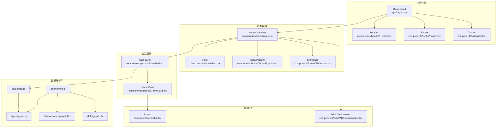
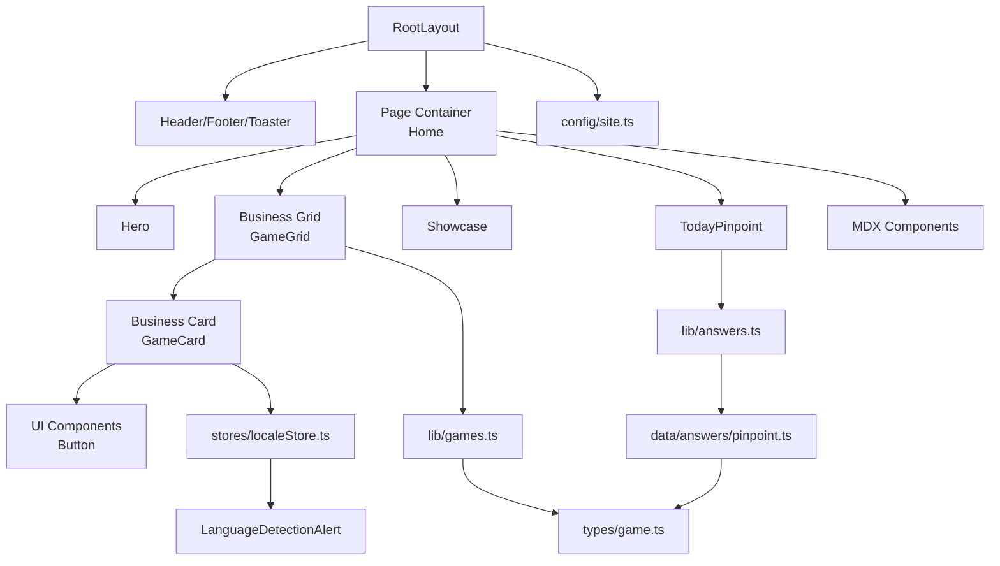
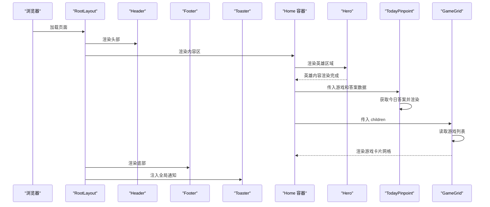
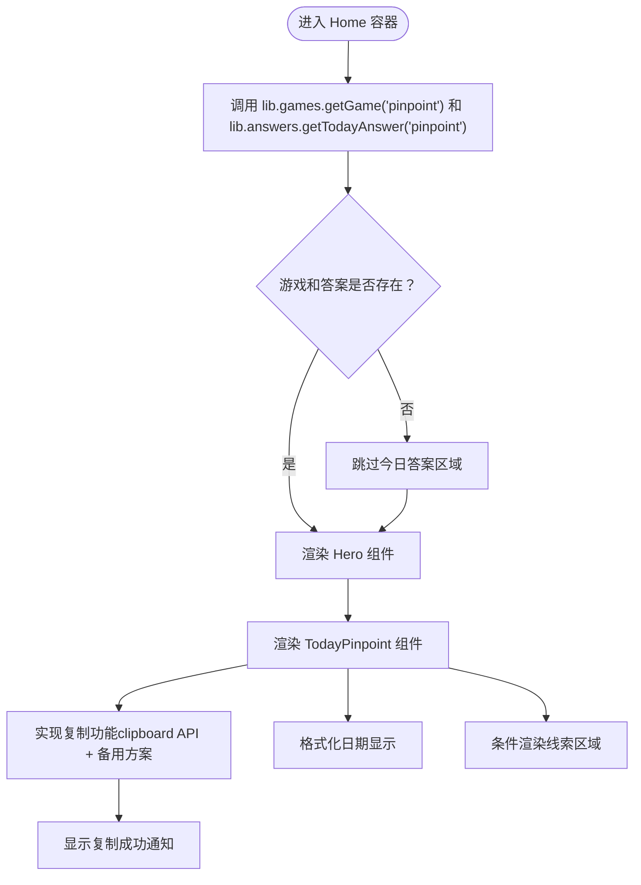
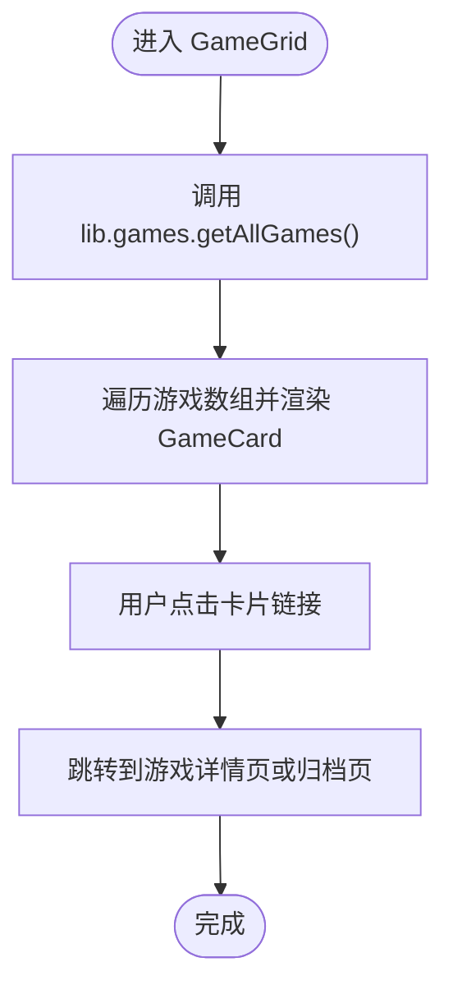
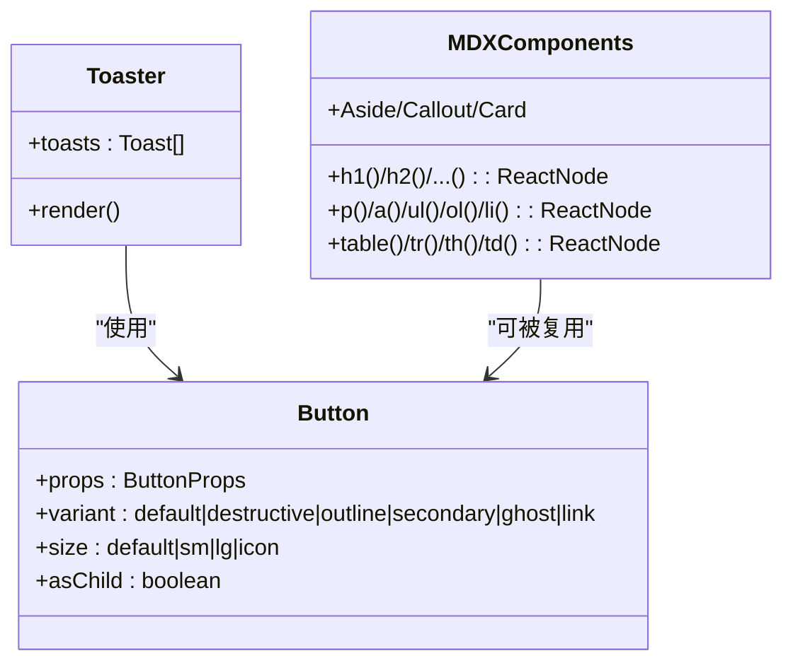
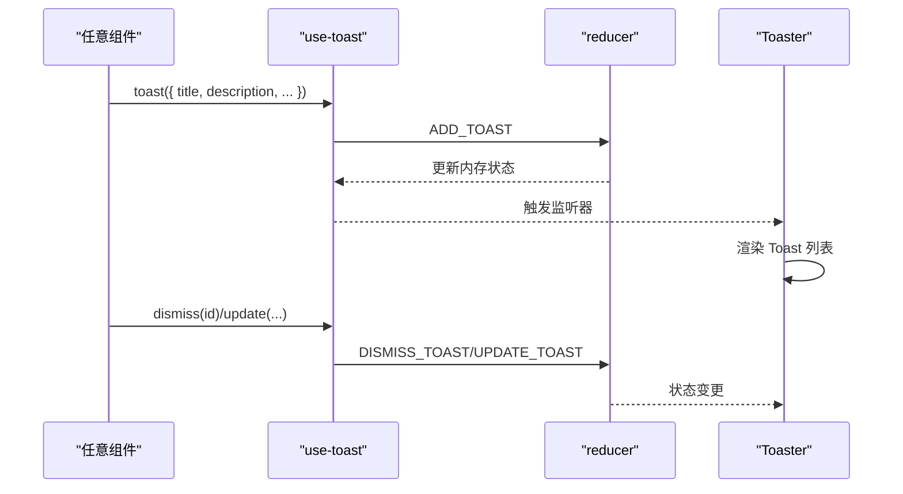
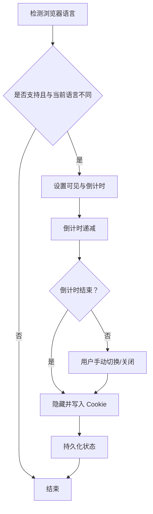
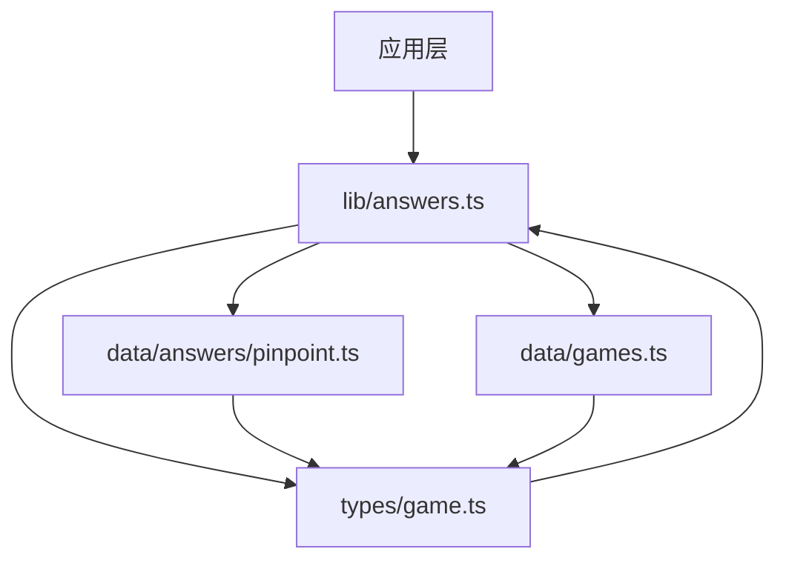
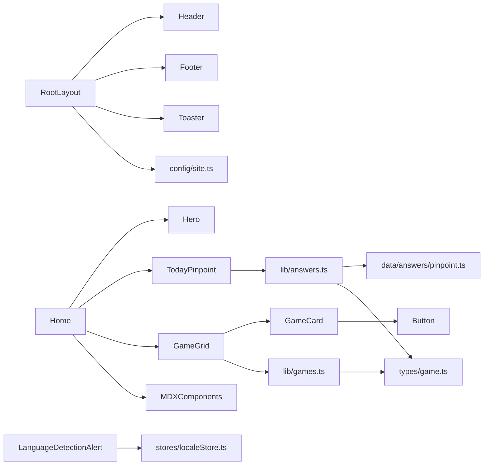

# 组件架构设计

<cite>
**本文引用的文件**
- [app/layout.tsx](file://app/layout.tsx)
- [app/page.tsx](file://app/page.tsx)
- [components/home/index.tsx](file://components/home/index.tsx)
- [components/home/Hero.tsx](file://components/home/Hero.tsx)
- [components/home/TodayPinpoint.tsx](file://components/home/TodayPinpoint.tsx)
- [components/home/Showcase.tsx](file://components/home/Showcase.tsx)
- [components/header/Header.tsx](file://components/header/Header.tsx)
- [components/footer/Footer.tsx](file://components/footer/Footer.tsx)
- [components/games/GameGrid.tsx](file://components/games/GameGrid.tsx)
- [components/games/GameCard.tsx](file://components/games/GameCard.tsx)
- [components/mdx/MDXComponents.tsx](file://components/mdx/MDXComponents.tsx)
- [components/ui/button.tsx](file://components/ui/button.tsx)
- [components/ui/toaster.tsx](file://components/ui/toaster.tsx)
- [hooks/use-toast.ts](file://hooks/use-toast.ts)
- [components/LanguageDetectionAlert.tsx](file://components/LanguageDetectionAlert.tsx)
- [stores/localeStore.ts](file://stores/localeStore.ts)
- [lib/games.ts](file://lib/games.ts)
- [lib/answers.ts](file://lib/answers.ts)
- [types/game.ts](file://types/game.ts)
- [config/site.ts](file://config/site.ts)
- [data/answers/pinpoint.ts](file://data/answers/pinpoint.ts)
- [data/games.ts](file://data/games.ts)
</cite>

## 更新摘要
**变更内容**
- 临时注释 TodayPinpoint 组件的快速链接功能，当前版本仅显示核心答案展示
- 临时注释主页的 GameGrid 组件，当前版本仅显示英雄区域和今日答案
- 新增 TodayPinpoint 组件作为主页核心功能模块
- 扩展了游戏答案管理系统，支持动态获取今日答案
- 增强了主页内容结构，包含英雄区域、今日答案展示和游戏卡片区域
- 完善了数据层架构，支持多游戏类型的答案管理

## 目录
1. [引言](#引言)
2. [项目结构](#项目结构)
3. [核心组件](#核心组件)
4. [架构总览](#架构总览)
5. [组件详细分析](#组件详细分析)
6. [依赖关系分析](#依赖关系分析)
7. [性能考量](#性能考量)
8. [故障排查指南](#故障排查指南)
9. [结论](#结论)
10. [附录：组件设计最佳实践与代码规范](#附录组件设计最佳实践与代码规范)

## 引言
本文件面向基于 React 的组件化架构设计，结合仓库中的实际组件与数据流，系统阐述以下主题：
- 职责分离：根布局、页面容器、UI 组件、业务组件的边界划分
- 可复用性：通过变体与组合模式实现高内聚低耦合
- 组合模式：从根组件到叶子组件的层级设计思路
- 组件通信：props 传递、事件处理与状态提升（含本地状态与全局状态）
- UI 组件库设计：基础组件、复合组件、业务组件的分类与协作
- 最佳实践与代码规范：可维护性、可扩展性与一致性

## 项目结构
该项目采用 Next.js 页面路由与组件分层组织方式：
- 根布局负责全局主题、头部、页脚、分析脚本与全局提示器挂载
- 页面容器（如首页）仅承担布局与数据聚合，不包含复杂交互
- 业务组件（如游戏卡片、今日答案）封装具体业务逻辑与展示
- UI 组件（如按钮、吐司）提供通用能力与样式变体
- 数据访问通过 lib 层统一导出，类型定义集中于 types 目录
- 站点配置与主题在 config 中集中管理

**图表来源**
- [app/layout.tsx](file://app/layout.tsx#L32-L77)
- [app/page.tsx](file://app/page.tsx#L1-L6)
- [components/home/index.tsx](file://components/home/index.tsx#L1-L36)
- [components/home/Hero.tsx](file://components/home/Hero.tsx#L1-L41)
- [components/home/TodayPinpoint.tsx](file://components/home/TodayPinpoint.tsx#L1-L216)
- [components/home/Showcase.tsx](file://components/home/Showcase.tsx#L1-L103)
- [components/games/GameGrid.tsx](file://components/games/GameGrid.tsx#L1-L15)
- [components/games/GameCard.tsx](file://components/games/GameCard.tsx#L1-L91)
- [components/ui/button.tsx](file://components/ui/button.tsx#L1-L58)
- [components/mdx/MDXComponents.tsx](file://components/mdx/MDXComponents.tsx#L1-L126)
- [lib/games.ts](file://lib/games.ts#L1-L15)
- [lib/answers.ts](file://lib/answers.ts#L1-L42)
- [types/game.ts](file://types/game.ts#L1-L27)
- [data/answers/pinpoint.ts](file://data/answers/pinpoint.ts#L1-L200)
- [data/games.ts](file://data/games.ts#L1-L29)

**章节来源**
- [app/layout.tsx](file://app/layout.tsx#L32-L77)
- [app/page.tsx](file://app/page.tsx#L1-L6)
- [components/home/index.tsx](file://components/home/index.tsx#L1-L36)

## 核心组件
- 根布局 RootLayout：统一注入主题、头部、页脚、分析脚本与全局提示器，作为所有页面的容器
- 首页容器 Home：负责承载内容区域与业务网格
- 英雄区域 Hero：展示网站标语、特色功能和品牌信息
- 今日答案组件 TodayPinpoint：展示每日游戏答案，支持复制功能和线索展示
- 游戏网格 GameGrid：读取游戏列表并渲染卡片
- 游戏卡片 GameCard：单个游戏的展示与导航入口
- 按钮 Button：具备多种变体与尺寸的基础 UI 组件
- 吐司 Toaster：基于自定义 hook use-toast 的全局通知展示
- MDX 组件库：为 Markdown 内容提供统一的标题、段落、表格等渲染规则
- 语言检测告警 LanguageDetectionAlert：基于 Zustand 的本地状态与 Cookie 的跨组件通信示例
- 展示区 Showcase：展示使用该模板构建的产品案例

**更新** 当前版本临时注释了 TodayPinpoint 组件的快速链接功能和主页的 GameGrid 组件，以反映临时实现状态

**章节来源**
- [app/layout.tsx](file://app/layout.tsx#L32-L77)
- [app/page.tsx](file://app/page.tsx#L1-L6)
- [components/home/index.tsx](file://components/home/index.tsx#L1-L36)
- [components/home/Hero.tsx](file://components/home/Hero.tsx#L1-L41)
- [components/home/TodayPinpoint.tsx](file://components/home/TodayPinpoint.tsx#L1-L216)
- [components/home/Showcase.tsx](file://components/home/Showcase.tsx#L1-L103)
- [components/games/GameGrid.tsx](file://components/games/GameGrid.tsx#L1-L15)
- [components/games/GameCard.tsx](file://components/games/GameCard.tsx#L1-L91)
- [components/ui/button.tsx](file://components/ui/button.tsx#L1-L58)
- [components/ui/toaster.tsx](file://components/ui/toaster.tsx#L1-L36)
- [hooks/use-toast.ts](file://hooks/use-toast.ts#L1-L195)
- [components/mdx/MDXComponents.tsx](file://components/mdx/MDXComponents.tsx#L1-L126)
- [components/LanguageDetectionAlert.tsx](file://components/LanguageDetectionAlert.tsx#L1-L145)
- [stores/localeStore.ts](file://stores/localeStore.ts#L1-L22)

## 架构总览
该架构遵循"布局-容器-业务-UI"的分层原则：
- 布局层：RootLayout 提供全局上下文与装饰元素
- 容器层：页面容器仅负责布局与数据聚合，不包含业务细节
- 业务层：GameGrid/ GameCard、TodayPinpoint 封装业务逻辑与交互
- UI 层：Button、Toaster、MDXComponents 提供通用能力
- 状态层：Zustand 用于轻量全局状态；React 自带状态用于局部交互；自定义 hook use-toast 管理通知队列
- 数据层：lib 层统一管理数据访问，types 层定义数据结构，data 层存储静态数据

**图表来源**
- [app/layout.tsx](file://app/layout.tsx#L32-L77)
- [app/page.tsx](file://app/page.tsx#L1-L6)
- [components/home/index.tsx](file://components/home/index.tsx#L1-L36)
- [components/home/Hero.tsx](file://components/home/Hero.tsx#L1-L41)
- [components/home/TodayPinpoint.tsx](file://components/home/TodayPinpoint.tsx#L1-L216)
- [components/home/Showcase.tsx](file://components/home/Showcase.tsx#L1-L103)
- [components/games/GameGrid.tsx](file://components/games/GameGrid.tsx#L1-L15)
- [components/games/GameCard.tsx](file://components/games/GameCard.tsx#L1-L91)
- [components/ui/button.tsx](file://components/ui/button.tsx#L1-L58)
- [components/mdx/MDXComponents.tsx](file://components/mdx/MDXComponents.tsx#L1-L126)
- [lib/games.ts](file://lib/games.ts#L1-L15)
- [lib/answers.ts](file://lib/answers.ts#L1-L42)
- [types/game.ts](file://types/game.ts#L1-L27)
- [data/answers/pinpoint.ts](file://data/answers/pinpoint.ts#L1-L200)
- [stores/localeStore.ts](file://stores/localeStore.ts#L1-L22)
- [components/LanguageDetectionAlert.tsx](file://components/LanguageDetectionAlert.tsx#L1-L145)
- [config/site.ts](file://config/site.ts#L1-L45)

## 组件详细分析

### 根布局与页面容器
- RootLayout：注入主题提供者、头部、页脚、分析脚本与全局提示器，确保所有页面共享一致的外观与行为
- Home：仅负责外层容器与网格布局，将数据读取与渲染委托给 GameGrid

**图表来源**
- [app/layout.tsx](file://app/layout.tsx#L32-L77)
- [app/page.tsx](file://app/page.tsx#L1-L6)
- [components/home/index.tsx](file://components/home/index.tsx#L1-L36)
- [components/home/Hero.tsx](file://components/home/Hero.tsx#L1-L41)
- [components/home/TodayPinpoint.tsx](file://components/home/TodayPinpoint.tsx#L1-L216)
- [components/games/GameGrid.tsx](file://components/games/GameGrid.tsx#L1-L15)

**章节来源**
- [app/layout.tsx](file://app/layout.tsx#L32-L77)
- [app/page.tsx](file://app/page.tsx#L1-L6)
- [components/home/index.tsx](file://components/home/index.tsx#L1-L36)

### 英雄区域与今日答案组件
- Hero：展示网站标语、特色功能和品牌信息，包含徽章、主标题、副标题和功能标签
- TodayPinpoint：展示每日游戏答案，支持复制功能、日期格式化、线索展示和快速导航

**更新** 当前版本临时注释了快速链接功能，仅保留核心答案展示和线索区域

**图表来源**
- [components/home/index.tsx](file://components/home/index.tsx#L1-L36)
- [components/home/Hero.tsx](file://components/home/Hero.tsx#L1-L41)
- [components/home/TodayPinpoint.tsx](file://components/home/TodayPinpoint.tsx#L1-L216)
- [lib/answers.ts](file://lib/answers.ts#L1-L42)
- [lib/games.ts](file://lib/games.ts#L1-L15)

**章节来源**
- [components/home/index.tsx](file://components/home/index.tsx#L1-L36)
- [components/home/Hero.tsx](file://components/home/Hero.tsx#L1-L41)
- [components/home/TodayPinpoint.tsx](file://components/home/TodayPinpoint.tsx#L1-L216)
- [lib/answers.ts](file://lib/answers.ts#L1-L42)
- [lib/games.ts](file://lib/games.ts#L1-L15)

### 游戏网格与卡片（业务组件）
- GameGrid：从 lib 层读取游戏列表，遍历渲染 GameCard
- GameCard：接收 Game 类型 props，根据颜色映射生成视觉风格，提供导航入口与辅助链接

**更新** 当前版本临时注释了 GameGrid 组件的渲染，主页仅显示英雄区域和今日答案

**图表来源**
- [components/games/GameGrid.tsx](file://components/games/GameGrid.tsx#L1-L15)
- [lib/games.ts](file://lib/games.ts#L1-L15)
- [types/game.ts](file://types/game.ts#L1-L27)

**章节来源**
- [components/games/GameGrid.tsx](file://components/games/GameGrid.tsx#L1-L15)
- [components/games/GameCard.tsx](file://components/games/GameCard.tsx#L1-L91)
- [lib/games.ts](file://lib/games.ts#L1-L15)
- [types/game.ts](file://types/game.ts#L1-L27)

### UI 组件库（基础与复合）
- Button：通过变体与尺寸实现统一的视觉与交互规范，支持 asChild 以适配不同语义标签
- Toaster：基于 use-toast 的全局通知展示，按需渲染多个 Toast 实例
- MDXComponents：为 Markdown 内容提供统一的标题、段落、表格等渲染规则，便于内容驱动的页面

**图表来源**
- [components/ui/button.tsx](file://components/ui/button.tsx#L1-L58)
- [components/ui/toaster.tsx](file://components/ui/toaster.tsx#L1-L36)
- [components/mdx/MDXComponents.tsx](file://components/mdx/MDXComponents.tsx#L1-L126)

**章节来源**
- [components/ui/button.tsx](file://components/ui/button.tsx#L1-L58)
- [components/ui/toaster.tsx](file://components/ui/toaster.tsx#L1-L36)
- [components/mdx/MDXComponents.tsx](file://components/mdx/MDXComponents.tsx#L1-L126)

### 通知系统（状态提升与自定义 Hook）
- use-toast：实现通知队列的添加、更新、关闭与移除，限制同时显示数量
- Toaster：订阅状态并渲染 Toast 列表，提供视口与关闭控件

**图表来源**
- [hooks/use-toast.ts](file://hooks/use-toast.ts#L1-L195)
- [components/ui/toaster.tsx](file://components/ui/toaster.tsx#L1-L36)

**章节来源**
- [hooks/use-toast.ts](file://hooks/use-toast.ts#L1-L195)
- [components/ui/toaster.tsx](file://components/ui/toaster.tsx#L1-L36)

### 语言检测告警（跨组件通信）
- 使用 Zustand 存储语言告警状态与 Cookie 记忆
- 通过自定义 Hook 与路由国际化组件联动，实现跨组件的状态共享与交互

**图表来源**
- [components/LanguageDetectionAlert.tsx](file://components/LanguageDetectionAlert.tsx#L1-L145)
- [stores/localeStore.ts](file://stores/localeStore.ts#L1-L22)

**章节来源**
- [components/LanguageDetectionAlert.tsx](file://components/LanguageDetectionAlert.tsx#L1-L145)
- [stores/localeStore.ts](file://stores/localeStore.ts#L1-L22)

### 数据层架构（答案管理系统）
- lib/answers.ts：提供游戏答案的查询接口，支持按日期、按游戏类型获取答案
- types/game.ts：定义游戏和答案的数据结构，支持多游戏类型和灵活的答案格式
- data/answers/pinpoint.ts：存储历史答案数据，包含序列号、日期、答案、线索等信息
- data/games.ts：定义游戏元数据，包括名称、描述、链接和颜色主题

**图表来源**
- [lib/answers.ts](file://lib/answers.ts#L1-L42)
- [types/game.ts](file://types/game.ts#L1-L27)
- [data/answers/pinpoint.ts](file://data/answers/pinpoint.ts#L1-L200)
- [data/games.ts](file://data/games.ts#L1-L29)

**章节来源**
- [lib/answers.ts](file://lib/answers.ts#L1-L42)
- [types/game.ts](file://types/game.ts#L1-L27)
- [data/answers/pinpoint.ts](file://data/answers/pinpoint.ts#L1-L200)
- [data/games.ts](file://data/games.ts#L1-L29)

## 依赖关系分析
- 组件耦合与内聚
  - GameGrid 与 GameCard：高内聚的业务组合，GameGrid 负责聚合，GameCard 负责展示
  - TodayPinpoint 与 lib/answers：紧密耦合但职责明确，TodayPinpoint 专注于展示，lib/answers 专注数据访问
  - Hero 与 TodayPinpoint：通过 Home 容器协调，形成清晰的层次结构
  - UI 组件对业务组件：Button 作为通用能力被业务组件复用，保持低耦合
  - RootLayout 对子树：通过 children 与主题提供者实现松耦合的包裹关系
- 外部依赖
  - 主题：next-themes
  - 图标：lucide-react
  - 状态：zustand（Zustand）、React 自带状态
  - 分析脚本：Vercel Analytics、百度统计、Google Analytics、Google Adsense
- 接口契约
  - GameGrid 依赖 lib.games 的接口；GameCard 依赖 Game 类型；Button 依赖变体与尺寸接口
  - TodayPinpoint 依赖 Game 和 GameAnswer 类型；lib/answers 依赖 GameSlug 类型

**图表来源**
- [app/layout.tsx](file://app/layout.tsx#L32-L77)
- [app/page.tsx](file://app/page.tsx#L1-L6)
- [components/home/index.tsx](file://components/home/index.tsx#L1-L36)
- [components/home/Hero.tsx](file://components/home/Hero.tsx#L1-L41)
- [components/home/TodayPinpoint.tsx](file://components/home/TodayPinpoint.tsx#L1-L216)
- [components/games/GameGrid.tsx](file://components/games/GameGrid.tsx#L1-L15)
- [components/games/GameCard.tsx](file://components/games/GameCard.tsx#L1-L91)
- [components/ui/button.tsx](file://components/ui/button.tsx#L1-L58)
- [components/mdx/MDXComponents.tsx](file://components/mdx/MDXComponents.tsx#L1-L126)
- [lib/games.ts](file://lib/games.ts#L1-L15)
- [lib/answers.ts](file://lib/answers.ts#L1-L42)
- [types/game.ts](file://types/game.ts#L1-L27)
- [stores/localeStore.ts](file://stores/localeStore.ts#L1-L22)
- [config/site.ts](file://config/site.ts#L1-L45)

**章节来源**
- [lib/games.ts](file://lib/games.ts#L1-L15)
- [lib/answers.ts](file://lib/answers.ts#L1-L42)
- [types/game.ts](file://types/game.ts#L1-L27)
- [config/site.ts](file://config/site.ts#L1-L45)

## 性能考量
- 渲染优化
  - 使用 React.memo 或稳定化 props 减少重渲染（建议在 GameCard 上进一步稳定 key 与 props）
  - 将昂贵计算移至 useMemo/useCallback，避免在渲染期间重复计算
  - TodayPinpoint 组件中对复制功能的实现考虑了浏览器兼容性，使用备用方案确保功能可用
- 网络与数据
  - lib 层统一数据访问，避免在组件中直接发起请求
  - 对静态数据（如游戏列表、答案数据）可在构建期预取或缓存
  - 今日答案的获取逻辑包含回退机制，如果当天没有答案则返回最新答案
- 资源加载
  - 分析脚本与第三方资源按需加载，开发环境与生产环境区分
  - 图标组件使用 lucide-react，按需导入减少包体积
- 主题与样式
  - next-themes 与 Tailwind 的组合应避免不必要的类名拼接，减少运行时开销
  - TodayPinpoint 组件使用渐变背景和阴影效果，注意在深色模式下的可读性

## 故障排查指南
- 通知不显示
  - 检查 Toaster 是否正确挂载于 RootLayout
  - 确认 use-toast 的监听器已注册且状态更新触发
- 语言告警未出现
  - 检查浏览器语言与路由支持的语言集合匹配
  - 确认 Cookie 未阻止或已过期
- 游戏列表为空
  - 检查 lib.games 的数据导出与类型定义是否一致
  - 确认 GameGrid 的映射逻辑与 key 设置正确
- 今日答案不显示
  - 检查 lib.answers.getTodayAnswer 是否正确返回答案
  - 确认 data/answers/pinpoint.ts 中包含当前日期的答案
  - 检查 Home 组件中 TodayPinpoint 的条件渲染逻辑
- 复制功能异常
  - 检查浏览器是否支持 Clipboard API
  - 确认备用方案（document.execCommand）是否正常工作
  - 查看控制台是否有权限相关的错误信息
- 快速链接功能缺失
  - 检查 TodayPinpoint 组件中注释的快速链接部分是否需要恢复
  - 确认游戏的 playUrl 配置是否正确

**章节来源**
- [components/ui/toaster.tsx](file://components/ui/toaster.tsx#L1-L36)
- [hooks/use-toast.ts](file://hooks/use-toast.ts#L1-L195)
- [components/LanguageDetectionAlert.tsx](file://components/LanguageDetectionAlert.tsx#L1-L145)
- [lib/games.ts](file://lib/games.ts#L1-L15)
- [lib/answers.ts](file://lib/answers.ts#L1-L42)
- [components/home/TodayPinpoint.tsx](file://components/home/TodayPinpoint.tsx#L1-L216)

## 结论
该组件架构以"布局-容器-业务-UI"分层清晰、职责明确，通过 UI 组件库实现高复用与一致性，通过自定义 Hook 与轻量状态库实现跨组件通信。新增的 TodayPinpoint 组件作为主页核心功能，展示了组件架构的演进和增强。当前版本临时注释了快速链接功能和 GameGrid 组件，以适应临时实现需求。建议在现有基础上进一步强化：
- 在业务组件上引入稳定化与缓存策略
- 明确数据层与 UI 层的边界，持续下沉副作用
- 规范组件命名与目录结构，提升可发现性与可维护性
- 完善错误处理和降级方案，提升用户体验

## 附录：组件设计最佳实践与代码规范
- 职责分离
  - 布局层只做上下文与装饰；容器层只做布局与数据聚合；业务层只做业务逻辑；UI 层只做通用能力
  - 新增组件应遵循单一职责原则，避免过度耦合
- 可复用性
  - 通过变体与尺寸参数化 UI 组件；通过 props 与 children 支持组合
  - 数据层抽象应支持多游戏类型扩展
- 组合模式
  - 从根组件到叶子组件逐层细化，保持单一职责与最小依赖
  - 组件间通过 props 传递数据，通过事件回调进行交互
- 组件通信
  - props 单向流动；事件回调向上冒泡；状态提升到最近公共祖先；跨组件共享使用轻量状态库
  - 今日答案组件通过 props 接收数据，内部状态仅限于本地交互
- UI 组件库
  - 基础组件：Button、Select、Dropdown 等，提供一致的视觉与交互
  - 复合组件：由基础组件组合而成，如 Toaster、MDXComponents、TodayPinpoint
  - 业务组件：封装业务规则与交互，如 GameCard、LanguageDetectionAlert、Hero
- 数据层设计
  - 类型安全：使用 TypeScript 定义完整的数据结构
  - 数据访问：通过 lib 层统一管理数据获取逻辑
  - 扩展性：支持多游戏类型和灵活的答案格式
- 代码规范
  - 统一使用 TypeScript 类型约束
  - 组件导出默认函数与类型定义，避免隐式依赖
  - 使用 hooks 与 store 管理状态，避免在组件内部直接操作全局变量
  - 为关键流程补充注释与路径引用，便于追踪与维护
  - 考虑浏览器兼容性，提供降级方案
  - 临时功能变更应使用清晰的注释标记，便于后续恢复