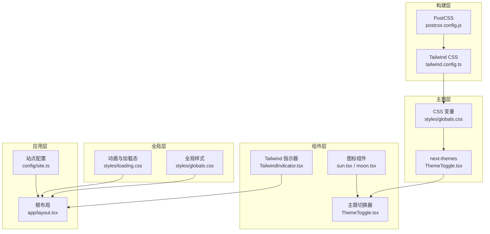
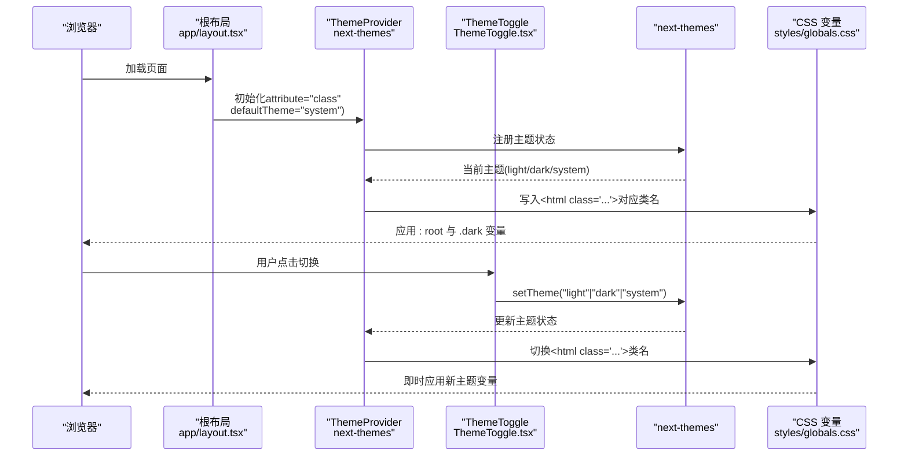
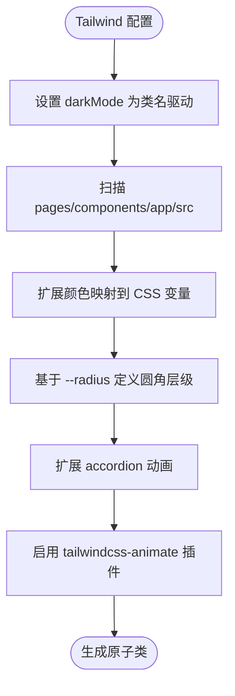
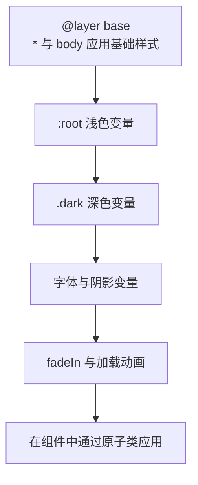
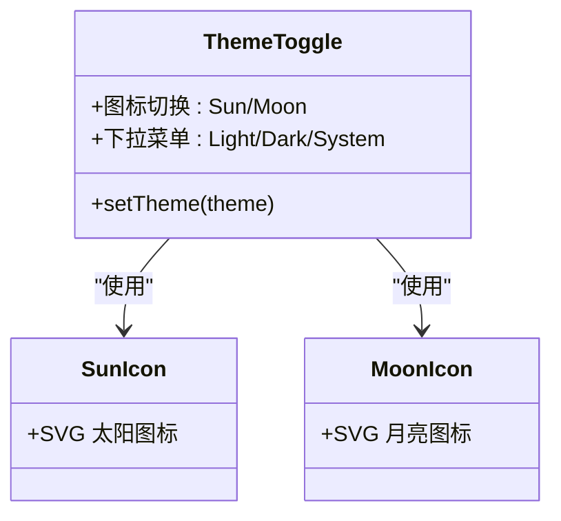
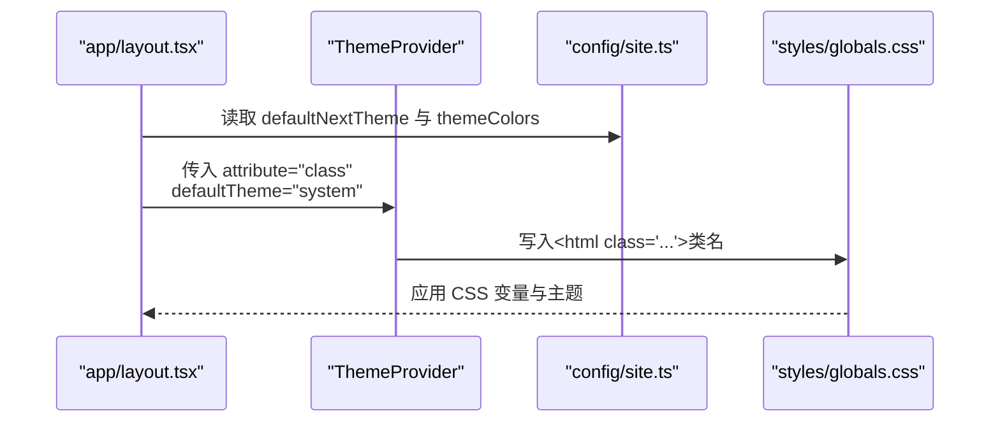
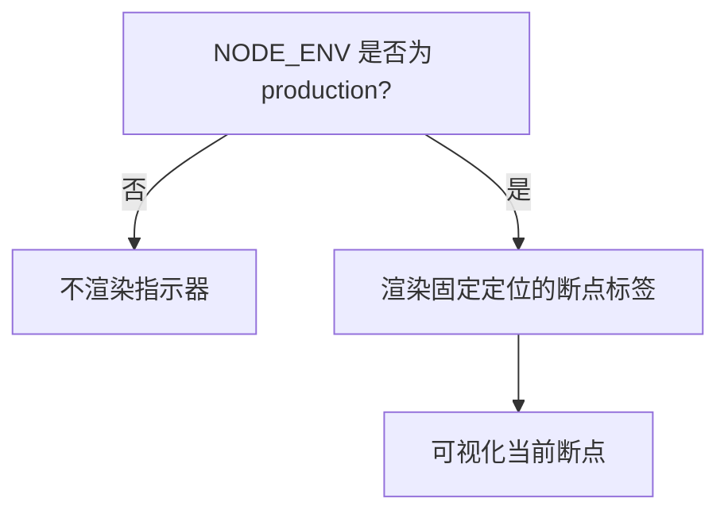
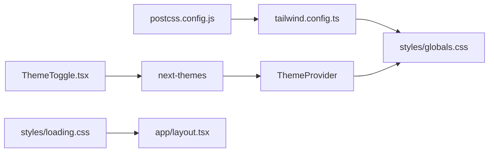

# 样式和主题系统

<cite>
**本文引用的文件**
- [tailwind.config.ts](file://tailwind.config.ts)
- [postcss.config.js](file://postcss.config.js)
- [styles/globals.css](file://styles/globals.css)
- [styles/loading.css](file://styles/loading.css)
- [components/ThemeToggle.tsx](file://components/ThemeToggle.tsx)
- [components/TailwindIndicator.tsx](file://components/TailwindIndicator.tsx)
- [components/icons/moon.tsx](file://components/icons/moon.tsx)
- [components/icons/sun.tsx](file://components/icons/sun.tsx)
- [app/layout.tsx](file://app/layout.tsx)
- [config/site.ts](file://config/site.ts)
- [package.json](file://package.json)
</cite>

## 目录
1. [简介](#简介)
2. [项目结构](#项目结构)
3. [核心组件](#核心组件)
4. [架构总览](#架构总览)
5. [详细组件分析](#详细组件分析)
6. [依赖关系分析](#依赖关系分析)
7. [性能考量](#性能考量)
8. [故障排查指南](#故障排查指南)
9. [结论](#结论)
10. [附录](#附录)

## 简介
本文件系统性梳理该仓库的样式与主题体系，覆盖 Tailwind CSS 配置、全局样式管理、深色/浅色主题切换机制、颜色系统与动画配置、响应式设计策略、组件样式隔离与主题定制方法，并提供最佳实践、性能优化建议、浏览器兼容性处理以及无障碍支持与品牌定制指南。

## 项目结构
样式与主题系统由以下层次构成：
- 构建层：PostCSS 负责编译与自动前缀，Tailwind 生成原子类。
- 主题层：通过 CSS 变量与类名切换实现浅色/深色主题；next-themes 提供主题状态与持久化。
- 全局层：全局样式与动画定义，统一基础排版与交互动效。
- 组件层：UI 组件与图标组件使用原子类与主题变量，确保一致性与可维护性。
- 应用层：根布局注入主题提供者与全局样式，控制首屏渲染与视口主题色。

图表来源
- [postcss.config.js](file://postcss.config.js#L1-L7)
- [tailwind.config.ts](file://tailwind.config.ts#L1-L95)
- [styles/globals.css](file://styles/globals.css#L1-L128)
- [styles/loading.css](file://styles/loading.css#L1-L41)
- [components/ThemeToggle.tsx](file://components/ThemeToggle.tsx#L1-L40)
- [components/icons/sun.tsx](file://components/icons/sun.tsx#L1-L17)
- [components/icons/moon.tsx](file://components/icons/moon.tsx#L1-L17)
- [components/TailwindIndicator.tsx](file://components/TailwindIndicator.tsx#L1-L15)
- [app/layout.tsx](file://app/layout.tsx#L1-L78)
- [config/site.ts](file://config/site.ts#L1-L45)

章节来源
- [postcss.config.js](file://postcss.config.js#L1-L7)
- [tailwind.config.ts](file://tailwind.config.ts#L1-L95)
- [styles/globals.css](file://styles/globals.css#L1-L128)
- [styles/loading.css](file://styles/loading.css#L1-L41)
- [components/ThemeToggle.tsx](file://components/ThemeToggle.tsx#L1-L40)
- [components/icons/sun.tsx](file://components/icons/sun.tsx#L1-L17)
- [components/icons/moon.tsx](file://components/icons/moon.tsx#L1-L17)
- [components/TailwindIndicator.tsx](file://components/TailwindIndicator.tsx#L1-L15)
- [app/layout.tsx](file://app/layout.tsx#L1-L78)
- [config/site.ts](file://config/site.ts#L1-L45)

## 核心组件
- Tailwind 配置：启用类名驱动的深色模式，扫描 pages/components/app/src 下的源码以生成原子类；扩展颜色、圆角与动画。
- 全局样式：定义 :root 与 .dark 的 CSS 变量，统一背景、前景、容器、边框、输入、环形光晕、卡片、弹出层、强调色与图表色等；在 base 层应用基础样式。
- 主题切换：基于 next-themes 的 ThemeProvider 与自定义 ThemeToggle 组件，支持 light/dark/system 三档切换，并通过类名切换实现即时主题变更。
- 动画与加载态：内置淡入与点阵加载动画，配合原子类与模块化样式实现一致的过渡效果。
- 响应式与断点：Tailwind 断点与指示器组件结合，开发时可视化断点，生产环境隐藏指示器。
- 视口主题色：站点配置提供媒体查询的主题色数组，根布局注入到 viewport 中。

章节来源
- [tailwind.config.ts](file://tailwind.config.ts#L1-L95)
- [styles/globals.css](file://styles/globals.css#L1-L128)
- [components/ThemeToggle.tsx](file://components/ThemeToggle.tsx#L1-L40)
- [styles/loading.css](file://styles/loading.css#L1-L41)
- [components/TailwindIndicator.tsx](file://components/TailwindIndicator.tsx#L1-L15)
- [app/layout.tsx](file://app/layout.tsx#L28-L30)
- [config/site.ts](file://config/site.ts#L34-L38)

## 架构总览
下图展示从构建到运行时的主题切换流程，包括配置、样式注入、主题提供者与用户交互。

图表来源
- [app/layout.tsx](file://app/layout.tsx#L48-L52)
- [components/ThemeToggle.tsx](file://components/ThemeToggle.tsx#L14-L38)
- [styles/globals.css](file://styles/globals.css#L32-L126)

章节来源
- [app/layout.tsx](file://app/layout.tsx#L48-L52)
- [components/ThemeToggle.tsx](file://components/ThemeToggle.tsx#L14-L38)
- [styles/globals.css](file://styles/globals.css#L32-L126)

## 详细组件分析

### Tailwind 配置与颜色系统
- 深色模式：通过类名驱动，darkMode 设置为 ["class"]，与 HTML 的 class 切换配合。
- 内容扫描：扫描 pages/components/app/src，确保按需生成原子类，减少体积。
- 主题扩展：
  - 颜色：使用 hsl(var(--xxx)) 映射到 CSS 变量，覆盖 border/input/ring/background/foreground/primary/secondary/destructive/muted/accent/popover/card/chart 等。
  - 圆角：基于 --radius 变量，提供 lg/md/sm 不同层级。
  - 动画：扩展 accordion-down/up，便于折叠组件使用。
- 插件：tailwindcss-animate 提供更丰富的动画工具类。

图表来源
- [tailwind.config.ts](file://tailwind.config.ts#L3-L10)
- [tailwind.config.ts](file://tailwind.config.ts#L20-L92)

章节来源
- [tailwind.config.ts](file://tailwind.config.ts#L1-L95)

### 全局样式与 CSS 变量
- 基础层：在 base 层对 * 与 body 应用 border 与背景/文字色，确保默认一致性。
- 变量定义：:root 定义浅色变量，.dark 定义深色变量；涵盖背景、前景、卡片、弹出层、输入、环形光晕、强调色、破坏性色、边框、图表色与侧边栏系列。
- 字体与阴影：定义 --font-sans/serif/mono 与多级阴影变量，统一排版与视觉层级。
- 动画：定义 fadeIn 与加载点阵动画，配合原子类与模块化样式使用。

图表来源
- [styles/globals.css](file://styles/globals.css#L9-L17)
- [styles/globals.css](file://styles/globals.css#L32-L126)
- [styles/loading.css](file://styles/loading.css#L1-L41)

章节来源
- [styles/globals.css](file://styles/globals.css#L1-L128)
- [styles/loading.css](file://styles/loading.css#L1-L41)

### 主题切换组件与图标
- ThemeToggle：使用 next-themes 的 useTheme，提供 light/dark/system 选项；图标随主题旋转/显隐，配合原子类实现平滑过渡。
- 图标组件：sun/moon 使用 SVG，作为切换按钮的视觉反馈。
- 响应式：在 .dark 类下，图标旋转角度与缩放比例切换，保证对比度与可读性。

图表来源
- [components/ThemeToggle.tsx](file://components/ThemeToggle.tsx#L14-L38)
- [components/icons/sun.tsx](file://components/icons/sun.tsx#L1-L17)
- [components/icons/moon.tsx](file://components/icons/moon.tsx#L1-L17)

章节来源
- [components/ThemeToggle.tsx](file://components/ThemeToggle.tsx#L1-L40)
- [components/icons/sun.tsx](file://components/icons/sun.tsx#L1-L17)
- [components/icons/moon.tsx](file://components/icons/moon.tsx#L1-L17)

### 根布局与主题提供者
- 根布局注入 ThemeProvider，指定 attribute="class"，使主题通过 html 的 class 切换生效；defaultTheme 来自站点配置，enableSystem 支持跟随系统偏好。
- 全局样式与加载动画在根布局中引入，确保首屏一致体验。
- 视口主题色：viewport.themeColor 来自站点配置的主题色数组，提升浏览器地址栏与启动页的感知一致性。

图表来源
- [app/layout.tsx](file://app/layout.tsx#L48-L52)
- [app/layout.tsx](file://app/layout.tsx#L28-L30)
- [config/site.ts](file://config/site.ts#L34-L38)

章节来源
- [app/layout.tsx](file://app/layout.tsx#L1-L78)
- [config/site.ts](file://config/site.ts#L1-L45)

### Tailwind 指示器与响应式调试
- TailwindIndicator：仅在开发环境显示，通过固定定位展示当前激活的断点标签（xs/sm/md/lg/xl/2xl），辅助响应式开发。
- 响应式断点：Tailwind 默认断点与指示器联动，帮助快速验证不同屏幕下的布局表现。

图表来源
- [components/TailwindIndicator.tsx](file://components/TailwindIndicator.tsx#L1-L15)

章节来源
- [components/TailwindIndicator.tsx](file://components/TailwindIndicator.tsx#L1-L15)

## 依赖关系分析
- 构建链路：postcss.config.js 启用 tailwindcss 与 autoprefixer；tailwind.config.ts 控制生成范围与扩展项。
- 运行时链路：next-themes 与 ThemeProvider 驱动主题状态；CSS 变量在 :root 与 .dark 间切换；组件通过原子类消费变量。
- 动画与加载：tailwindcss-animate 提供动画工具类；styles/loading.css 提供加载态动画。

图表来源
- [postcss.config.js](file://postcss.config.js#L1-L7)
- [tailwind.config.ts](file://tailwind.config.ts#L1-L95)
- [styles/globals.css](file://styles/globals.css#L1-L128)
- [components/ThemeToggle.tsx](file://components/ThemeToggle.tsx#L1-L40)
- [app/layout.tsx](file://app/layout.tsx#L1-L78)
- [styles/loading.css](file://styles/loading.css#L1-L41)

章节来源
- [postcss.config.js](file://postcss.config.js#L1-L7)
- [tailwind.config.ts](file://tailwind.config.ts#L1-L95)
- [styles/globals.css](file://styles/globals.css#L1-L128)
- [components/ThemeToggle.tsx](file://components/ThemeToggle.tsx#L1-L40)
- [app/layout.tsx](file://app/layout.tsx#L1-L78)
- [styles/loading.css](file://styles/loading.css#L1-L41)

## 性能考量
- 按需生成：Tailwind 配置限制内容扫描范围，避免生成冗余类，降低 CSS 体积。
- 动画优化：使用 tailwindcss-animate 与 CSS 变量，减少 JavaScript 动画开销；加载动画采用纯 CSS，避免额外脚本。
- 构建优化：PostCSS 自动前缀与压缩，减少手动维护成本。
- 渲染优化：根布局集中引入全局样式，避免重复注入；指示器仅在开发环境渲染，减少生产负担。

[本节为通用指导，无需特定文件引用]

## 故障排查指南
- 主题未生效
  - 检查根布局是否正确包裹 ThemeProvider，且 attribute 设为 "class"。
  - 确认站点配置的 defaultNextTheme 与 themeColors 正确。
- 切换后样式异常
  - 确保 CSS 变量在 :root 与 .dark 中均完整定义。
  - 检查组件是否使用原子类消费变量而非硬编码值。
- 动画不流畅
  - 使用 tailwindcss-animate 提供的工具类；避免在 JS 中频繁操作 DOM。
  - 对复杂动画考虑使用 CSS 变量与 transform/opacity，减少重排。
- 开发环境断点指示器不显示
  - 确认 NODE_ENV 为 development；生产环境会自动隐藏。

章节来源
- [app/layout.tsx](file://app/layout.tsx#L48-L52)
- [config/site.ts](file://config/site.ts#L34-L38)
- [styles/globals.css](file://styles/globals.css#L32-L126)
- [components/TailwindIndicator.tsx](file://components/TailwindIndicator.tsx#L1-L15)

## 结论
该样式与主题系统以 Tailwind 为核心，结合 CSS 变量与 next-themes 实现灵活的主题切换；通过全局样式与动画统一视觉语言，借助响应式断点与指示器保障跨设备一致性。整体架构清晰、扩展性强，适合品牌定制与无障碍增强。

[本节为总结，无需特定文件引用]

## 附录

### 主题定制方法
- 修改颜色变量：在 :root 与 .dark 中调整 --primary/--secondary/--background/--foreground 等，保持语义一致。
- 扩展圆角与阴影：通过 --radius 与阴影变量统一风格。
- 新增动画：在 tailwind.config.ts 的 theme.extend.animation/keyframes 中添加，复用动画工具类。

章节来源
- [styles/globals.css](file://styles/globals.css#L32-L126)
- [tailwind.config.ts](file://tailwind.config.ts#L63-L89)

### 品牌定制方案
- 视口主题色：在站点配置中提供媒体查询的主题色数组，根布局注入 viewport.themeColor。
- 站点名称与描述：用于元数据与可访问性上下文，提升品牌识别度。

章节来源
- [config/site.ts](file://config/site.ts#L34-L38)
- [app/layout.tsx](file://app/layout.tsx#L28-L30)

### 无障碍设计支持
- 文本对比度：深色/浅色变量需满足 WCAG 对比度要求。
- 键盘可达性：下拉菜单与按钮需支持键盘操作与焦点管理。
- 屏幕阅读器：为图标提供 sr-only 文本或 aria-label。
- 减少动画：提供减少动态效果的偏好设置（如 prefers-reduced-motion）。

[本节为通用指导，无需特定文件引用]