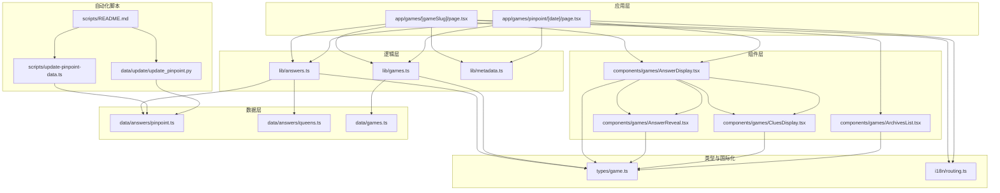
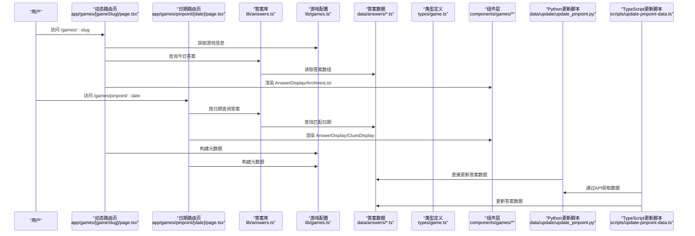
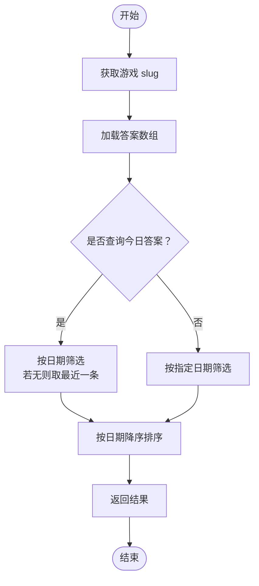
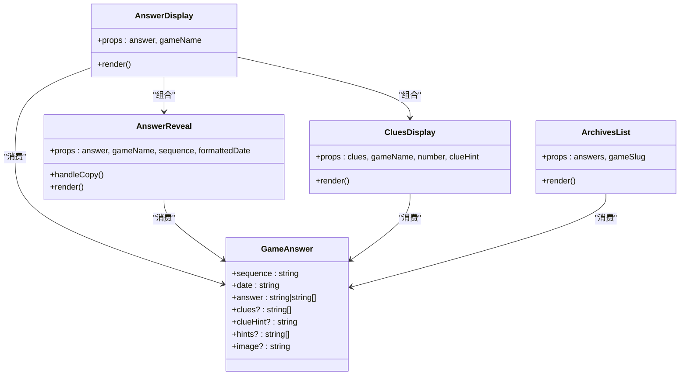
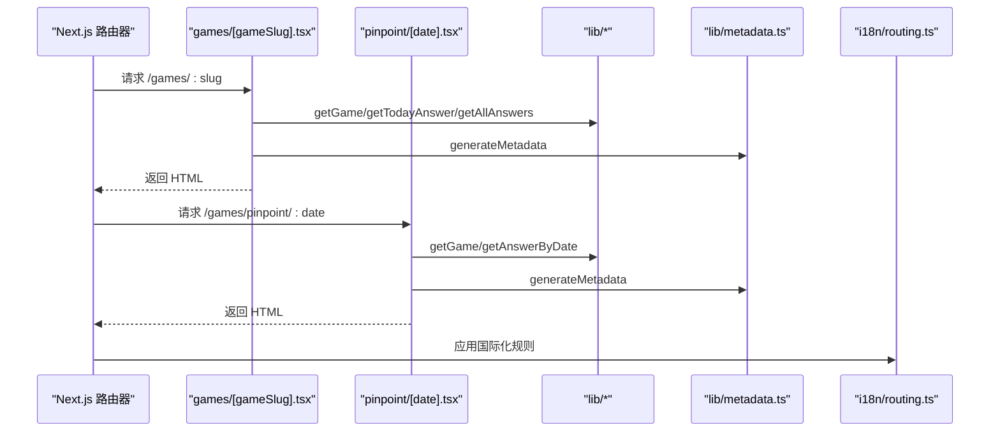
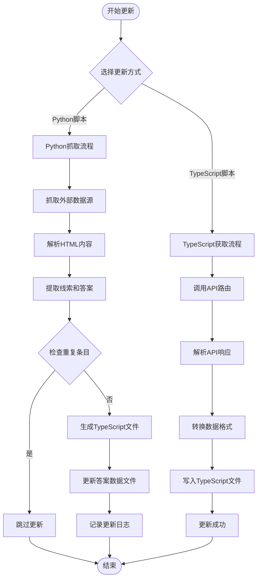
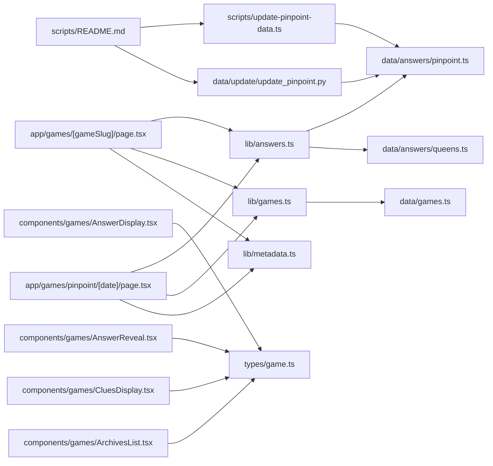

# 核心功能模块

<cite>
**本文引用的文件**
- [app/games/[gameSlug]/page.tsx](file://app/games/[gameSlug]/page.tsx)
- [app/games/pinpoint/[date]/page.tsx](file://app/games/pinpoint/[date]/page.tsx)
- [lib/answers.ts](file://lib/answers.ts)
- [lib/games.ts](file://lib/games.ts)
- [lib/metadata.ts](file://lib/metadata.ts)
- [data/answers/pinpoint.ts](file://data/answers/pinpoint.ts)
- [data/answers/queens.ts](file://data/answers/queens.ts)
- [data/games.ts](file://data/games.ts)
- [types/game.ts](file://types/game.ts)
- [components/games/AnswerDisplay.tsx](file://components/games/AnswerDisplay.tsx)
- [components/games/AnswerReveal.tsx](file://components/games/AnswerReveal.tsx)
- [components/games/CluesDisplay.tsx](file://components/games/CluesDisplay.tsx)
- [components/games/ArchivesList.tsx](file://components/games/ArchivesList.tsx)
- [i18n/routing.ts](file://i18n/routing.ts)
- [scripts/update-pinpoint-data.ts](file://scripts/update-pinpoint-data.ts)
- [data/update/update_pinpoint.py](file://data/update/update_pinpoint.py)
- [scripts/README.md](file://scripts/README.md)
</cite>

## 更新摘要
**变更内容**
- 新增两个新的pinpoint答案条目（#646和#645），扩展了游戏答案库的内容多样性
- 更新答案数据模型以支持更丰富的线索提示和答案格式
- 增强答案查询系统的灵活性，支持更多样化的答案类型
- 完善自动化更新系统，支持从外部源抓取和更新答案数据
- 新增Python脚本实现，支持更复杂的网页抓取和数据解析逻辑
- 新增API路由支持，提供统一的数据获取接口

## 目录
1. [简介](#简介)
2. [项目结构](#项目结构)
3. [核心组件](#核心组件)
4. [架构总览](#架构总览)
5. [详细组件分析](#详细组件分析)
6. [依赖关系分析](#依赖关系分析)
7. [性能考量](#性能考量)
8. [故障排查指南](#故障排查指南)
9. [结论](#结论)
10. [附录](#附录)

## 简介
本文件面向开发者，系统性梳理 LinkedIn Answer Today 的三大核心功能模块：答案查询系统、游戏组件系统与页面路由系统。重点覆盖以下方面：
- 答案数据模型与查询接口设计
- 游戏配置与元数据管理
- 动态路由与静态生成策略
- 组件使用模式与数据流
- 模块间依赖关系与集成方式

**更新** 本版本新增了对pinpoint答案库的扩展支持，包括两轮车主题和以'cat'开头的词汇主题等多样化答案内容。同时增强了自动化更新系统，支持从外部源抓取和更新答案数据。

目标是帮助开发者快速理解并扩展系统能力，同时提供可操作的实现参考。

## 项目结构
项目采用 Next.js App Router 结构，按功能域组织目录：
- app：页面与路由层（含动态路由）
- components：可复用 UI 组件
- lib：业务逻辑与工具函数
- data：静态数据与答案数据
- types：类型定义
- i18n：国际化路由配置
- scripts：自动化更新脚本

**图表来源**
- [app/games/[gameSlug]/page.tsx](file://app/games/[gameSlug]/page.tsx#L1-L115)
- [app/games/pinpoint/[date]/page.tsx](file://app/games/pinpoint/[date]/page.tsx#L1-L90)
- [lib/answers.ts](file://lib/answers.ts#L1-L42)
- [lib/games.ts](file://lib/games.ts#L1-L15)
- [lib/metadata.ts](file://lib/metadata.ts#L1-L78)
- [data/answers/pinpoint.ts](file://data/answers/pinpoint.ts#L1-L162)
- [data/answers/queens.ts](file://data/answers/queens.ts#L1-L59)
- [data/games.ts](file://data/games.ts#L1-L29)
- [types/game.ts](file://types/game.ts#L1-L27)
- [components/games/AnswerDisplay.tsx](file://components/games/AnswerDisplay.tsx#L1-L65)
- [components/games/AnswerReveal.tsx](file://components/games/AnswerReveal.tsx#L1-L83)
- [components/games/CluesDisplay.tsx](file://components/games/CluesDisplay.tsx#L1-L74)
- [components/games/ArchivesList.tsx](file://components/games/ArchivesList.tsx#L1-L67)
- [i18n/routing.ts](file://i18n/routing.ts#L1-L37)
- [scripts/update-pinpoint-data.ts](file://scripts/update-pinpoint-data.ts#L1-L82)
- [data/update/update_pinpoint.py](file://data/update/update_pinpoint.py#L1-L280)
- [scripts/README.md](file://scripts/README.md#L1-L71)

**章节来源**
- [app/games/[gameSlug]/page.tsx](file://app/games/[gameSlug]/page.tsx#L1-L115)
- [app/games/pinpoint/[date]/page.tsx](file://app/games/pinpoint/[date]/page.tsx#L1-L90)
- [lib/answers.ts](file://lib/answers.ts#L1-L42)
- [lib/games.ts](file://lib/games.ts#L1-L15)
- [lib/metadata.ts](file://lib/metadata.ts#L1-L78)
- [data/answers/pinpoint.ts](file://data/answers/pinpoint.ts#L1-L162)
- [data/answers/queens.ts](file://data/answers/queens.ts#L1-L59)
- [data/games.ts](file://data/games.ts#L1-L29)
- [types/game.ts](file://types/game.ts#L1-L27)
- [components/games/AnswerDisplay.tsx](file://components/games/AnswerDisplay.tsx#L1-L65)
- [components/games/AnswerReveal.tsx](file://components/games/AnswerReveal.tsx#L1-L83)
- [components/games/CluesDisplay.tsx](file://components/games/CluesDisplay.tsx#L1-L74)
- [components/games/ArchivesList.tsx](file://components/games/ArchivesList.tsx#L1-L67)
- [i18n/routing.ts](file://i18n/routing.ts#L1-L37)

## 核心组件
- 答案查询系统：提供按游戏、日期、今日答案等查询能力，并负责排序与回退策略。
- 游戏组件系统：封装答案展示、线索展示、归档列表等 UI 组件，支持多答案形态与交互。
- 页面路由系统：基于 App Router 的动态路由与静态生成策略，结合元数据与国际化配置。
- 自动化更新系统：支持从外部源抓取答案数据并自动更新本地存储，包含Python脚本和TypeScript更新脚本两种实现方式。

**更新** 新增自动化更新系统，支持从 pinpiontanswer.today 网站抓取最新的答案数据，包括线索和答案内容。系统现在提供两种更新方式：Python脚本直接更新和TypeScript脚本通过API获取数据。

**章节来源**
- [lib/answers.ts](file://lib/answers.ts#L1-L42)
- [lib/games.ts](file://lib/games.ts#L1-L15)
- [components/games/AnswerDisplay.tsx](file://components/games/AnswerDisplay.tsx#L1-L65)
- [components/games/AnswerReveal.tsx](file://components/games/AnswerReveal.tsx#L1-L83)
- [components/games/CluesDisplay.tsx](file://components/games/CluesDisplay.tsx#L1-L74)
- [components/games/ArchivesList.tsx](file://components/games/ArchivesList.tsx#L1-L67)
- [app/games/[gameSlug]/page.tsx](file://app/games/[gameSlug]/page.tsx#L1-L115)
- [app/games/pinpoint/[date]/page.tsx](file://app/games/pinpoint/[date]/page.tsx#L1-L90)
- [scripts/update-pinpoint-data.ts](file://scripts/update-pinpoint-data.ts#L1-L82)
- [data/update/update_pinpoint.py](file://data/update/update_pinpoint.py#L1-L280)
- [scripts/README.md](file://scripts/README.md#L1-L71)

## 架构总览
系统以"页面路由 → 业务逻辑 → 数据/组件"分层组织，通过类型约束保证数据一致性，通过静态生成提升性能与 SEO。新增自动化更新机制，支持从外部源动态获取最新答案数据。系统现在提供两种自动化更新方式：Python脚本直接抓取和TypeScript脚本通过API获取。

**图表来源**
- [app/games/[gameSlug]/page.tsx](file://app/games/[gameSlug]/page.tsx#L1-L115)
- [app/games/pinpoint/[date]/page.tsx](file://app/games/pinpoint/[date]/page.tsx#L1-L90)
- [lib/answers.ts](file://lib/answers.ts#L1-L42)
- [lib/games.ts](file://lib/games.ts#L1-L15)
- [data/answers/pinpoint.ts](file://data/answers/pinpoint.ts#L1-L162)
- [data/answers/queens.ts](file://data/answers/queens.ts#L1-L59)
- [types/game.ts](file://types/game.ts#L1-L27)
- [components/games/AnswerDisplay.tsx](file://components/games/AnswerDisplay.tsx#L1-L65)
- [components/games/CluesDisplay.tsx](file://components/games/CluesDisplay.tsx#L1-L74)
- [scripts/update-pinpoint-data.ts](file://scripts/update-pinpoint-data.ts#L1-L82)
- [data/update/update_pinpoint.py](file://data/update/update_pinpoint.py#L1-L280)

## 详细组件分析

### 答案查询系统
- 职责
  - 按游戏 slug 返回答案集合
  - 提供今日答案查询（若当日无答案则回退到最近答案）
  - 支持按日期精确查询
  - 对答案按日期降序排序
- 关键实现要点
  - 使用映射表将 slug 映射到具体答案数组
  - 日期格式统一为 YYYY-MM-DD，便于比较与过滤
  - 回退策略确保页面始终有内容展示
- 性能与复杂度
  - 查询与排序均为 O(n)，n 为该游戏的答案数量；可通过预排序与二分查找优化
- 错误处理
  - 未找到时返回空数组或 undefined，由调用方决定渲染策略

**更新** 新增对两个新答案条目的支持：
- #646：两轮车主题答案，包含 Segway、Hand truck、Hoverboard、Motorcycle、Bicycle 等线索
- #645：以'cat'开头的词汇主题答案，包含 Nap、Carrier、Burglar、Litter、Got your tongue? 等线索

**图表来源**
- [lib/answers.ts](file://lib/answers.ts#L1-L42)
- [data/answers/pinpoint.ts](file://data/answers/pinpoint.ts#L1-L162)
- [data/answers/queens.ts](file://data/answers/queens.ts#L1-L59)

**章节来源**
- [lib/answers.ts](file://lib/answers.ts#L1-L42)
- [data/answers/pinpoint.ts](file://data/answers/pinpoint.ts#L1-L162)
- [data/answers/queens.ts](file://data/answers/queens.ts#L1-L59)

### 游戏组件系统
- AnswerDisplay：聚合答案展示、线索展示、提示与图片等子组件
- AnswerReveal：支持单值或多值答案的展示与复制到剪贴板
- CluesDisplay：渲染线索卡片与可选的 HTML 提示文本
- ArchivesList：渲染历史答案列表，支持跳转到对应日期详情页
- 设计要点
  - 统一使用 GameAnswer 类型，支持可选字段与多答案形态
  - 组件职责单一，组合灵活，利于测试与维护
  - 交互组件（AnswerReveal）使用客户端状态与 Toast 提示

**更新** 新增对丰富线索提示的支持，包括详细的 HTML 格式化提示文本，如 #646 中的两轮车线索解释和 #645 中的词汇关联说明。

**图表来源**
- [components/games/AnswerDisplay.tsx](file://components/games/AnswerDisplay.tsx#L1-L65)
- [components/games/AnswerReveal.tsx](file://components/games/AnswerReveal.tsx#L1-L83)
- [components/games/CluesDisplay.tsx](file://components/games/CluesDisplay.tsx#L1-L74)
- [components/games/ArchivesList.tsx](file://components/games/ArchivesList.tsx#L1-L67)
- [types/game.ts](file://types/game.ts#L5-L13)

**章节来源**
- [components/games/AnswerDisplay.tsx](file://components/games/AnswerDisplay.tsx#L1-L65)
- [components/games/AnswerReveal.tsx](file://components/games/AnswerReveal.tsx#L1-L83)
- [components/games/CluesDisplay.tsx](file://components/games/CluesDisplay.tsx#L1-L74)
- [components/games/ArchivesList.tsx](file://components/games/ArchivesList.tsx#L1-L67)
- [types/game.ts](file://types/game.ts#L1-L27)

### 页面路由系统
- 动态路由
  - [gameSlug]：渲染游戏主页，仅显示今日答案，其余作为归档列表
  - pinpoint/[date]：渲染指定日期的答案详情页
- 静态生成策略
  - generateStaticParams：在构建期生成所有游戏 slug 与日期参数，提升首屏性能与 SEO
- 元数据与国际化
  - generateMetadata：根据当前路由与游戏信息生成 SEO 元数据
  - i18n/routing.ts：定义支持语言、默认语言与前缀策略，配合 next-intl 导航 API

**图表来源**
- [app/games/[gameSlug]/page.tsx](file://app/games/[gameSlug]/page.tsx#L14-L43)
- [app/games/pinpoint/[date]/page.tsx](file://app/games/pinpoint/[date]/page.tsx#L14-L50)
- [lib/metadata.ts](file://lib/metadata.ts#L14-L78)
- [i18n/routing.ts](file://i18n/routing.ts#L1-L37)

**章节来源**
- [app/games/[gameSlug]/page.tsx](file://app/games/[gameSlug]/page.tsx#L1-L115)
- [app/games/pinpoint/[date]/page.tsx](file://app/games/pinpoint/[date]/page.tsx#L1-L90)
- [lib/metadata.ts](file://lib/metadata.ts#L1-L78)
- [i18n/routing.ts](file://i18n/routing.ts#L1-L37)

### 自动化更新系统
- 职责
  - 从外部源（pinpointanswer.today）抓取当日答案数据
  - 解析线索和答案内容，生成标准化的数据格式
  - 自动更新本地答案数据文件
- 关键实现要点
  - 使用 Python 脚本进行网页抓取和数据解析
  - 支持从 JSON API 和 HTML 页面两种方式获取数据
  - 自动检测重复条目，避免重复更新
  - 生成完整的 TypeScript 数据文件
- 性能与复杂度
  - 网络请求和解析操作在构建时执行，不影响运行时性能
  - 数据更新频率可控，支持手动触发

**新增** 自动化更新系统支持从外部源动态获取最新答案数据，包括线索和答案内容的完整解析。系统现在提供两种实现方式：

1. **Python脚本实现** (`data/update/update_pinpoint.py`)
   - 直接抓取网页内容，解析HTML结构
   - 支持复杂的正则表达式匹配和数据提取
   - 直接修改TypeScript文件内容

2. **TypeScript脚本实现** (`scripts/update-pinpoint-data.ts`)
   - 通过API路由获取数据，然后更新文件
   - 更简洁的实现方式，依赖现有的API接口

**图表来源**
- [scripts/update-pinpoint-data.ts](file://scripts/update-pinpoint-data.ts#L1-L82)
- [data/update/update_pinpoint.py](file://data/update/update_pinpoint.py#L1-L280)

**章节来源**
- [scripts/update-pinpoint-data.ts](file://scripts/update-pinpoint-data.ts#L1-L82)
- [data/update/update_pinpoint.py](file://data/update/update_pinpoint.py#L1-L280)
- [scripts/README.md](file://scripts/README.md#L1-L71)

## 依赖关系分析
- 模块耦合
  - 页面层仅依赖 lib 层的查询与配置方法，保持低耦合
  - 组件层依赖类型定义，不直接依赖数据文件，便于替换数据源
  - 自动化脚本独立于主应用逻辑，通过文件系统进行数据更新
- 外部依赖
  - Next.js App Router 与静态生成
  - next-intl 国际化路由
  - lucide-react 图标库
  - requests、BeautifulSoup 等 Python 库用于数据抓取
- 循环依赖
  - 未发现循环导入；类型定义被组件与逻辑层共同引用，属于安全共享

**更新** 新增自动化更新系统的依赖关系，包括 Python 网络请求库和数据解析库。

**图表来源**
- [app/games/[gameSlug]/page.tsx](file://app/games/[gameSlug]/page.tsx#L1-L115)
- [app/games/pinpoint/[date]/page.tsx](file://app/games/pinpoint/[date]/page.tsx#L1-L90)
- [lib/answers.ts](file://lib/answers.ts#L1-L42)
- [lib/games.ts](file://lib/games.ts#L1-L15)
- [lib/metadata.ts](file://lib/metadata.ts#L1-L78)
- [data/answers/pinpoint.ts](file://data/answers/pinpoint.ts#L1-L162)
- [data/answers/queens.ts](file://data/answers/queens.ts#L1-L59)
- [data/games.ts](file://data/games.ts#L1-L29)
- [types/game.ts](file://types/game.ts#L1-L27)
- [components/games/AnswerDisplay.tsx](file://components/games/AnswerDisplay.tsx#L1-L65)
- [components/games/AnswerReveal.tsx](file://components/games/AnswerReveal.tsx#L1-L83)
- [components/games/CluesDisplay.tsx](file://components/games/CluesDisplay.tsx#L1-L74)
- [components/games/ArchivesList.tsx](file://components/games/ArchivesList.tsx#L1-L67)
- [scripts/update-pinpoint-data.ts](file://scripts/update-pinpoint-data.ts#L1-L82)
- [data/update/update_pinpoint.py](file://data/update/update_pinpoint.py#L1-L280)
- [scripts/README.md](file://scripts/README.md#L1-L71)

**章节来源**
- [app/games/[gameSlug]/page.tsx](file://app/games/[gameSlug]/page.tsx#L1-L115)
- [app/games/pinpoint/[date]/page.tsx](file://app/games/pinpoint/[date]/page.tsx#L1-L90)
- [lib/answers.ts](file://lib/answers.ts#L1-L42)
- [lib/games.ts](file://lib/games.ts#L1-L15)
- [lib/metadata.ts](file://lib/metadata.ts#L1-L78)
- [data/answers/pinpoint.ts](file://data/answers/pinpoint.ts#L1-L162)
- [data/answers/queens.ts](file://data/answers/queens.ts#L1-L59)
- [data/games.ts](file://data/games.ts#L1-L29)
- [types/game.ts](file://types/game.ts#L1-L27)
- [components/games/AnswerDisplay.tsx](file://components/games/AnswerDisplay.tsx#L1-L65)
- [components/games/AnswerReveal.tsx](file://components/games/AnswerReveal.tsx#L1-L83)
- [components/games/CluesDisplay.tsx](file://components/games/CluesDisplay.tsx#L1-L74)
- [components/games/ArchivesList.tsx](file://components/games/ArchivesList.tsx#L1-L67)
- [scripts/update-pinpoint-data.ts](file://scripts/update-pinpoint-data.ts#L1-L82)
- [data/update/update_pinpoint.py](file://data/update/update_pinpoint.py#L1-L280)
- [scripts/README.md](file://scripts/README.md#L1-L71)

## 性能考量
- 静态生成
  - 在构建期生成所有游戏与日期参数，减少运行时计算
- 数据访问
  - 答案数组较小，O(n) 查询可接受；建议在数据层预排序并缓存
- 组件渲染
  - 使用 React 客户端组件时注意避免不必要的重渲染，合理拆分组件
- SEO 与元数据
  - generateMetadata 动态生成，确保每页唯一 canonical 与描述
- 自动化更新
  - 数据抓取在构建时执行，不影响运行时性能
  - 支持增量更新，避免全量重新抓取
  - Python脚本提供更强大的数据解析能力，但需要额外的依赖

**更新** 新增自动化更新系统的性能考量，包括网络请求的异步处理和数据缓存策略。Python脚本虽然功能强大，但需要额外的依赖安装。

## 故障排查指南
- 页面 404
  - 当游戏 slug 或日期不存在时，路由会触发 notFound，检查数据层与静态参数生成
- 无答案显示
  - getTodayAnswer 回退到最近答案，确认数据时间线与排序逻辑
- 复制失败
  - AnswerReveal 使用浏览器 Clipboard API，需在 HTTPS 环境下运行
- 国际化路径异常
  - 检查 i18n/routing.ts 中的 localeDetection 与 localePrefix 设置
- 自动化更新失败
  - 检查网络连接和外部数据源可用性
  - 验证数据解析逻辑和文件写入权限
  - 查看脚本输出的日志信息
  - 对于Python脚本，确保已安装 requests、beautifulsoup4、icecream、json5 等依赖
  - 对于TypeScript脚本，确保API路由正常工作且返回有效的JSON数据

**更新** 新增自动化更新系统的故障排查指南，包括网络请求失败和数据解析错误的处理方法。特别针对Python脚本的依赖问题和TypeScript脚本的API调用问题。

**章节来源**
- [app/games/[gameSlug]/page.tsx](file://app/games/[gameSlug]/page.tsx#L49-L51)
- [app/games/pinpoint/[date]/page.tsx](file://app/games/pinpoint/[date]/page.tsx#L57-L59)
- [lib/answers.ts](file://lib/answers.ts#L14-L26)
- [components/games/AnswerReveal.tsx](file://components/games/AnswerReveal.tsx#L19-L37)
- [i18n/routing.ts](file://i18n/routing.ts#L20-L23)
- [scripts/update-pinpoint-data.ts](file://scripts/update-pinpoint-data.ts#L70-L73)
- [data/update/update_pinpoint.py](file://data/update/update_pinpoint.py#L125-L141)
- [scripts/README.md](file://scripts/README.md#L62-L71)

## 结论
本系统通过清晰的分层与类型约束，实现了答案查询、组件展示与路由生成的高效协同。新增的自动化更新系统进一步增强了系统的可维护性和数据新鲜度。系统现在提供两种更新方式：Python脚本提供更强大的数据解析能力，TypeScript脚本提供更简洁的实现方式。建议后续在数据层引入缓存与索引、在组件层增加错误边界与加载状态，以进一步提升稳定性与用户体验。

**更新** 新版本通过扩展答案库内容和增强自动化更新能力，显著提升了系统的多样性和可维护性。Python脚本提供了更复杂的网页抓取和数据解析逻辑，而TypeScript脚本则提供了简化的API调用方式。

## 附录
- API 接口规范（基于现有实现）
  - 获取全部答案
    - 方法：GET
    - 路径：/games/:slug
    - 参数：slug（pinpoint | queens）
    - 响应：今日答案 + 归档列表
  - 获取指定日期答案
    - 方法：GET
    - 路径：/games/pinpoint/:date
    - 参数：date（YYYY-MM-DD）
    - 响应：答案详情（含线索/提示/图片）
  - 元数据生成
    - 方法：动态生成
    - 触发：generateMetadata
    - 输出：SEO 标题、描述、Open Graph 与 Twitter 卡片
  - 自动化更新接口
    - 方法：GET
    - 路径：/api/fetch-pinpoint
    - 参数：无
    - 响应：当日答案数据（JSON 格式）
  - Python更新接口
    - 方法：直接调用Python脚本
    - 路径：data/update/update_pinpoint.py
    - 参数：无
    - 响应：直接更新TypeScript文件

**更新** 新增自动化更新接口的 API 规范，支持外部系统触发答案数据更新。同时新增了Python脚本的直接调用方式。

**章节来源**
- [app/games/[gameSlug]/page.tsx](file://app/games/[gameSlug]/page.tsx#L21-L43)
- [app/games/pinpoint/[date]/page.tsx](file://app/games/pinpoint/[date]/page.tsx#L19-L50)
- [lib/metadata.ts](file://lib/metadata.ts#L14-L78)
- [scripts/update-pinpoint-data.ts](file://scripts/update-pinpoint-data.ts#L4-L7)
- [data/update/update_pinpoint.py](file://data/update/update_pinpoint.py#L115-L141)
- [scripts/README.md](file://scripts/README.md#L9-L24)