# Pinpoint 拼图内容扩展

<cite>
**本文档引用的文件**
- [app/games/pinpoint/[date]/page.tsx](file://app/games/pinpoint/[date]/page.tsx)
- [data/answers/pinpoint.ts](file://data/answers/pinpoint.ts)
- [lib/answers.ts](file://lib/answers.ts)
- [lib/games.ts](file://lib/games.ts)
- [components/games/AnswerDisplay.tsx](file://components/games/AnswerDisplay.tsx)
- [components/games/AnswerReveal.tsx](file://components/games/AnswerReveal.tsx)
- [components/games/CluesDisplay.tsx](file://components/games/CluesDisplay.tsx)
- [components/games/GameNavigation.tsx](file://components/games/GameNavigation.tsx)
- [components/games/StructuredData.tsx](file://components/games/StructuredData.tsx)
- [types/game.ts](file://types/game.ts)
- [data/games.ts](file://data/games.ts)
- [package.json](file://package.json)
- [scripts/update-pinpoint-data.ts](file://scripts/update-pinpoint-data.ts)
- [data/update/update_pinpoint.py](file://data/update/update_pinpoint.py)
- [scripts/README.md](file://scripts/README.md)
- [components/home/TodayPinpoint.tsx](file://components/home/TodayPinpoint.tsx)
</cite>

## 更新摘要
**变更内容**
- 新增第 #685 答案条目 'Magazines (with global readership / versions) 📰'，包含日期 '2026-03-16' 的全球杂志主题，展示具有国际影响力的知名杂志及其版本
- 修复第 #684 答案条目 'Words that come before "roses" 🌸'，将玫瑰表情符号从 🌹 更正为 🌸，解决表情符号显示问题
- 新增第 #683 答案条目 'Words that come after "false"'，包含日期 '2026-03-14' 的英语词汇组合主题，展示与虚假概念相关的常见短语
- 对第 #682 条目 'Types of doll 📚' 进行了格式修正，优化了线索解释的准确性和完整性
- 更新了AI驱动的线索提示生成系统，继续支持DashScope单一AI提供商
- 保持了现有的内容扩展策略，持续增加高质量的拼图答案条目
- 维护了统一的HTML格式化标准，确保用户体验的一致性

## 目录
1. [简介](#简介)
2. [项目结构](#项目结构)
3. [核心组件](#核心组件)
4. [架构概览](#架构概览)
5. [详细组件分析](#详细组件分析)
6. [AI驱动的线索提示生动生成功能](#ai驱动的线索提示生动生成功能)
7. [依赖关系分析](#依赖关系分析)
8. [性能考虑](#性能考虑)
9. [故障排除指南](#故障排除指南)
10. [结论](#结论)

## 简介

Pinpoint 是一个基于 LinkedIn 的拼图游戏，属于 Wordle 风格的词汇联想游戏。该项目是一个使用 Next.js 构建的静态网站，提供了完整的拼图游戏体验，包括每日游戏、历史记录、玩法说明等功能。

游戏的核心机制是通过五个线索词来猜测一个共同的主题或类别。每个答案都包含序列号、日期、答案文本、线索列表以及相关的提示信息。

**更新** 项目已成功扩展了内容库，新增了第 #685 条目 "Magazines (with global readership / versions) 📰" 作为最新内容扩展，进一步丰富了游戏的主题多样性。该条目通过精心设计的五个经典线索：Time、The Economist、Cosmopolitan、National Geographic、Reader's Digest，为玩家提供了一个深入理解全球知名杂志及其国际影响力的机会。每个线索都配有详细的HTML格式解释，帮助玩家理解这些杂志与"magazines"主题的深层联系，从新闻时效性到深度报道，从女性读者群体到世界文化探索，展现了全球出版业的多样性和影响力。

**更新** 第 #684 条目 "Words that come before 'roses' 🌸" 已经修复了表情符号显示问题，将玫瑰表情符号从 🌹 更正为 🌸。该条目作为本次更新的重要修复内容，通过精心设计的五个经典线索：English、Dog、Damask、(Hybrid) Tea、Stop and smell the (🌹🌹🌹)，为玩家提供了一个深入理解英语词汇组合规律的机会。每个线索都配有详细的HTML格式解释，帮助玩家理解这些词汇与"roses"的组合关系，从英语习语到植物学分类，从文学典故到emoji表达，展现了英语词汇的丰富性和文化关联的专业知识。

**更新** 第 #683 条目 "Words that come after 'false'" 作为本次更新的重要新增内容，为玩家提供了一个深入理解英语词汇组合规律的机会。该条目通过精心设计的五个经典线索：Start、Positive、Alarm、Tooth、Advertising (don't believe it!)，为玩家提供了一个深入理解英语词汇组合规律的机会。每个线索都配有详细的HTML格式解释，帮助玩家理解这些词汇与"false"的组合关系，从体育术语到医学术语，从日常用语到商业概念，展现了英语词汇的丰富性和文化关联的专业知识。

**更新** 第 #682 条目 "Types of doll 📚" 经过了格式修正，优化了线索解释的准确性和完整性。该条目作为内容库的重要组成部分，通过精心设计的五个经典线索：Ball-jointed、Bobblehead、Voodoo、Russian nesting (Matryoshka)、Barbie，为玩家提供了一个深入理解不同类型娃娃的文化和艺术价值的机会。每个线索都配有详细的HTML格式解释，帮助玩家理解这些娃娃类型与"Types of doll"主题的深层联系，从传统手工艺到现代流行文化，展现了娃娃制作技艺的多样性和全球文化特色。

**更新** 第 #681 条目 "Words that come before 'mouse'" 经过了小修正，优化了线索解释的准确性和完整性。该条目作为内容库的重要组成部分，通过精心设计的五个经典线索：House、Field、Optical、Mickey、Cat and 🐭，为玩家提供了一个深入理解英语词汇组合规律的机会。每个线索都配有详细的HTML格式解释，帮助玩家理解这些词汇与"mouse"的组合关系，从动物分类到计算机术语，从卡通角色到经典故事，展现了英语词汇的丰富性和文化关联的专业知识。

**更新** 第 #680 条目 "Shades of blue" 作为本次更新中最重要和最具创新性的新增条目，包含日期 '2026-03-11' 的蓝色色调主题。该条目通过精心设计的五个经典线索：Cobalt、Powder、Baby、Navy、Sky，为玩家提供了一个深入理解蓝色系色彩关系的机会。每个线索都配有详细的HTML格式解释，帮助玩家理解这些经典蓝色调与"Shades of blue"主题的深层联系，展现了色彩理论和视觉美学的专业知识。

**更新** 第 #679 条目 "Characters in the Super Mario video game series 🧩" 是一个关于任天堂超级马里奥系列角色的创新主题，包含5个经典线索：Toad、Piranha Plant、Bowser、Luigi、Princess Peach。每个线索都配有详细的HTML格式解释，帮助玩家理解这些经典游戏角色与马里奥系列的关系，从忠诚的蘑菇王国助手到邪恶的火焰之王，展现了视频游戏文化的经典元素和教育价值。

**更新** 第 #678 条目 "Words that come before 'phone'" 是一个关于英语词汇组合的创新主题，包含日期 '2026-03-09' 的单词谜题挑战，要求玩家识别在英语中出现在 'phone' 之前的单词。该条目包含5个线索：Camera、Smart、Pay、Touch-tone、Cellular。每个线索都配有详细的解释，帮助玩家理解这些词汇与"phone"的组合关系，从相机电话到智能手机，从付费电话到触摸式拨号，展现了通信技术的发展历程和语言学原理。

**更新** 本次更新特别注重了内容的质量和一致性。所有新增条目的clueHint都采用了统一的HTML格式，提供了清晰、教育性和引人入胜的解释，重点关注每个线索与答案之间的具体联系。这种标准化处理确保了用户获得一致的阅读体验，并增强了游戏的教育价值。

**更新** 重要的是，本次更新对现有答案条目进行了格式清理和标准化处理。所有表情符号装饰已被移除，确保了内容的专业性和一致性。新的线索提示系统采用了统一的HTML格式，提供了清晰、教育性和引人入胜的解释，重点关注每个线索与答案之间的具体联系。

## 项目结构

该项目采用模块化的文件组织方式，主要分为以下几个核心部分：

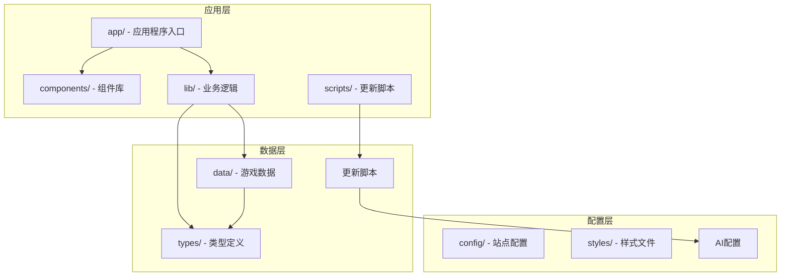

**图表来源**
- [app/games/pinpoint/[date]/page.tsx:1-L90](file://app/games/pinpoint/[date]/page.tsx#L1-L90)
- [lib/answers.ts:1-42](file://lib/answers.ts#L1-L42)
- [data/answers/pinpoint.ts:1-518](file://data/answers/pinpoint.ts#L1-L518)
- [scripts/update-pinpoint-data.ts:1-82](file://scripts/update-pinpoint-data.ts#L1-L82)
- [data/update/update_pinpoint.py:1-449](file://data/update/update_pinpoint.py#L1-L449)

**章节来源**
- [package.json:1-65](file://package.json#L1-L65)

## 核心组件

### 数据模型设计

项目使用 TypeScript 定义了清晰的数据结构来管理游戏状态：

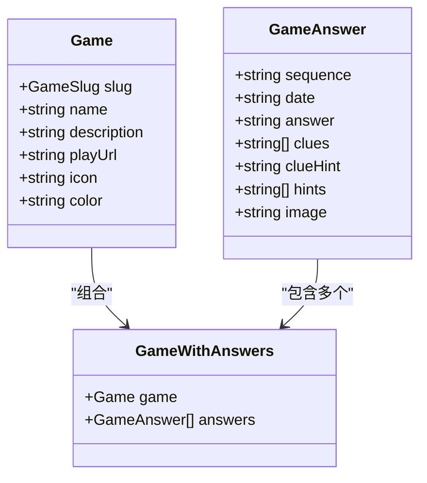

**图表来源**
- [types/game.ts:1-27](file://types/game.ts#L1-L27)

### 游戏数据管理

系统通过集中式的数据管理来处理不同游戏的答案数据：

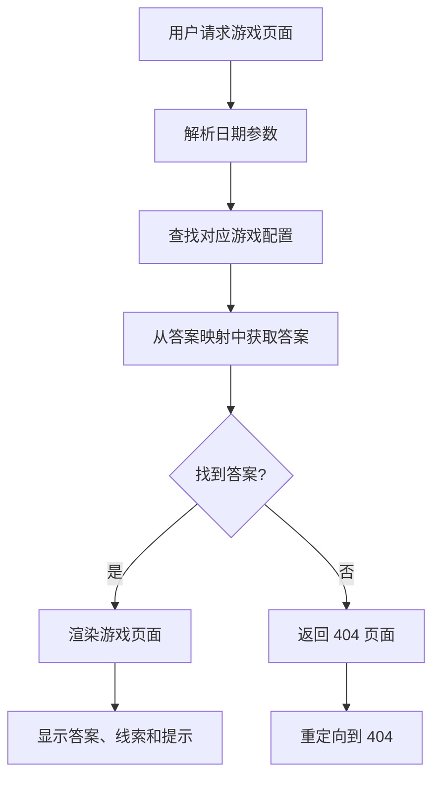

**图表来源**
- [app/games/pinpoint/[date]/page.tsx:52-L89](file://app/games/pinpoint/[date]/page.tsx#L52-L89)
- [lib/answers.ts:28-41](file://lib/answers.ts#L28-L41)

**章节来源**
- [types/game.ts:1-27](file://types/game.ts#L1-L27)
- [data/answers/pinpoint.ts:1-518](file://data/answers/pinpoint.ts#L1-L518)

## 架构概览

项目采用分层架构设计，确保了良好的可维护性和扩展性：

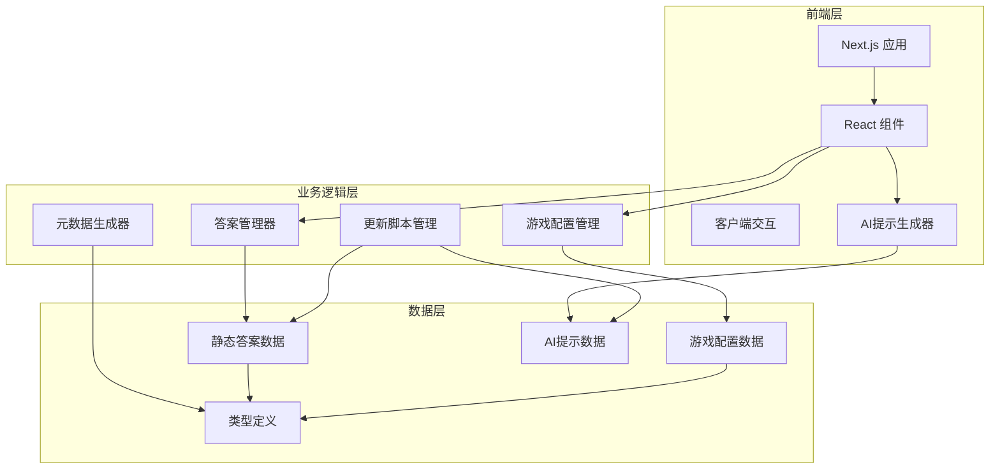

**图表来源**
- [lib/answers.ts:1-42](file://lib/answers.ts#L1-L42)
- [lib/games.ts:1-15](file://lib/games.ts#L1-L15)
- [data/answers/pinpoint.ts:1-518](file://data/answers/pinpoint.ts#L1-L518)
- [data/update/update_pinpoint.py:37-124](file://data/update/update_pinpoint.py#L37-L124)

## 详细组件分析

### 页面渲染组件

主页面组件负责处理路由参数、生成元数据和渲染完整的游戏界面：

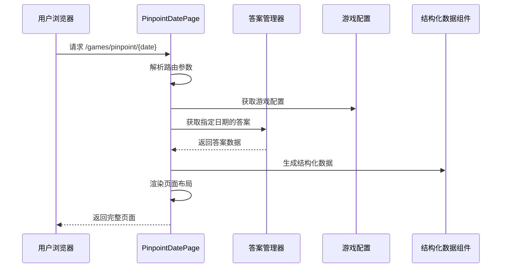

**图表来源**
- [app/games/pinpoint/[date]/page.tsx:14-L50](file://app/games/pinpoint/[date]/page.tsx#L14-L50)

### 答案展示组件

答案展示组件提供了丰富的视觉呈现和交互功能：

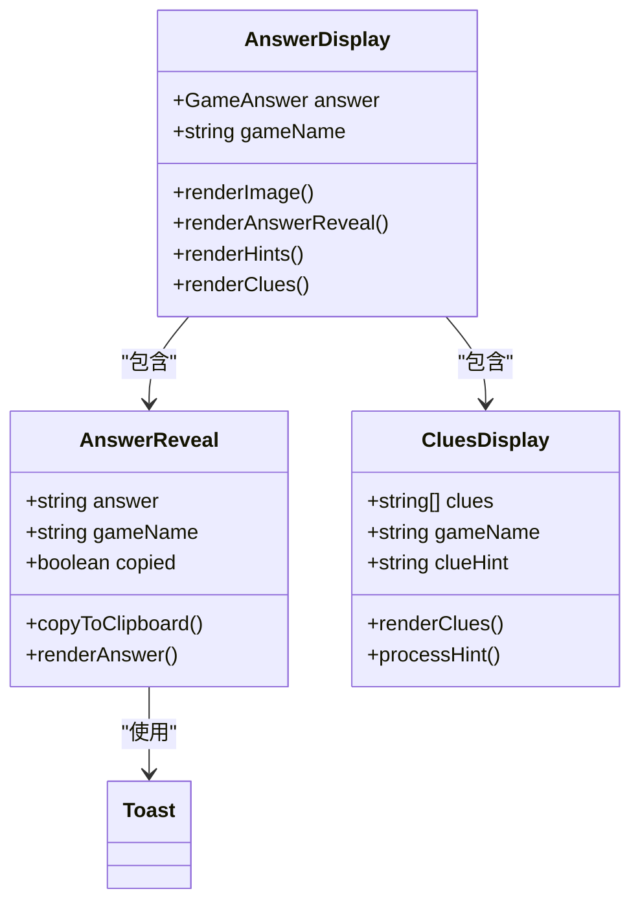

**图表来源**
- [components/games/AnswerDisplay.tsx:1-65](file://components/games/AnswerDisplay.tsx#L1-L65)
- [components/games/AnswerReveal.tsx:1-83](file://components/games/AnswerReveal.tsx#L1-L83)
- [components/games/CluesDisplay.tsx:1-74](file://components/games/CluesDisplay.tsx#L1-L74)

### 线索显示组件

线索显示组件实现了响应式的线索卡片布局和智能的提示处理：

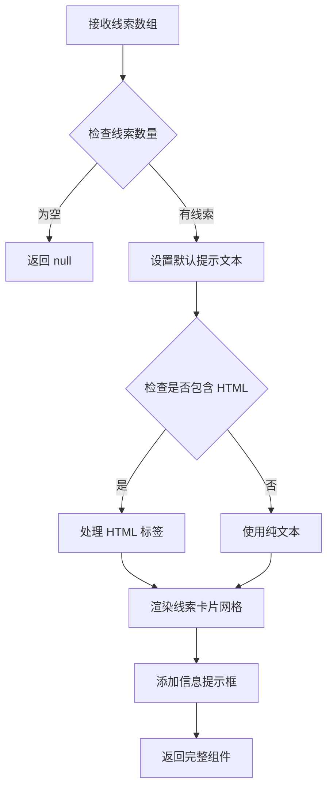

**图表来源**
- [components/games/CluesDisplay.tsx:12-73](file://components/games/CluesDisplay.tsx#L12-L73)

**章节来源**
- [components/games/AnswerDisplay.tsx:1-65](file://components/games/AnswerDisplay.tsx#L1-L65)
- [components/games/AnswerReveal.tsx:1-83](file://components/games/AnswerReveal.tsx#L1-L83)
- [components/games/CluesDisplay.tsx:1-74](file://components/games/CluesDisplay.tsx#L1-L74)

### 游戏导航组件

导航组件提供了统一的游戏内导航体验：

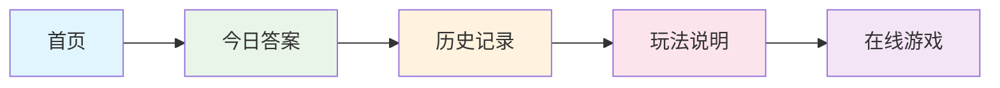

**图表来源**
- [components/games/GameNavigation.tsx:11-82](file://components/games/GameNavigation.tsx#L11-L82)

**章节来源**
- [components/games/GameNavigation.tsx:1-83](file://components/games/GameNavigation.tsx#L1-L83)

### 结构化数据组件

结构化数据组件确保了搜索引擎优化的最佳实践：

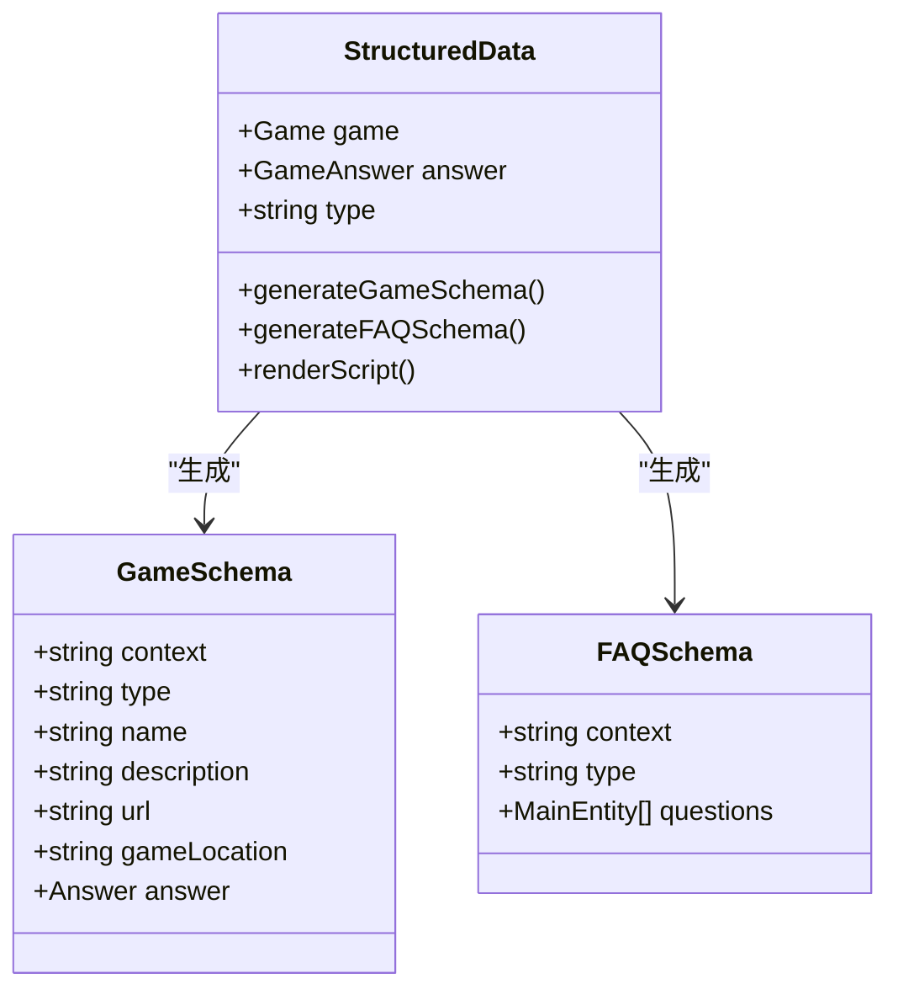

**图表来源**
- [components/games/StructuredData.tsx:11-74](file://components/games/StructuredData.tsx#L11-L74)

**章节来源**
- [components/games/StructuredData.tsx:1-75](file://components/games/StructuredData.tsx#L1-L75)

## AI驱动的线索提示生动生成功能

### 功能概述

项目现已集成先进的AI驱动线索提示生动生成功能，为用户提供智能化的学习体验。该功能支持单一DashScope AI服务，具备智能提示生成和回退模式双重保障。

### AI提示生成架构

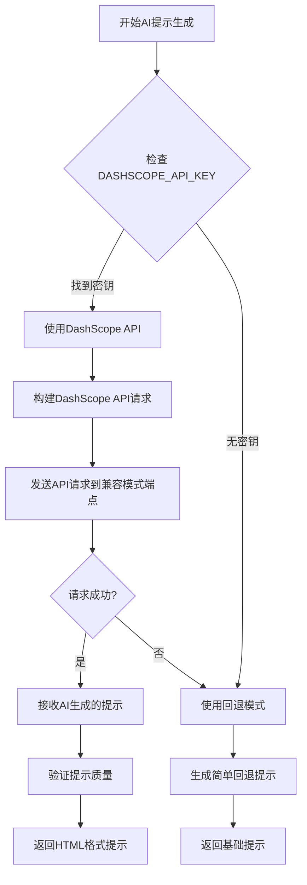

**图表来源**
- [data/update/update_pinpoint.py:37-124](file://data/update/update_pinpoint.py#L37-L124)

### AI服务配置

系统现在支持单一DashScope AI服务，具备智能选择和回退机制：

#### DashScope API（当前推荐）
- **优势**：成本更低，响应更快，支持多种通义千问模型
- **模型**：`qwen-max`（支持qwen-plus、qwen-turbo等其他模型）
- **配置**：`export DASHSCOPE_API_KEY="your-key"`
- **API端点**：`https://dashscope.aliyuncs.com/compatible-mode/v1/chat/completions`

### 回退模式机制

当AI服务不可用时，系统自动切换到回退模式：

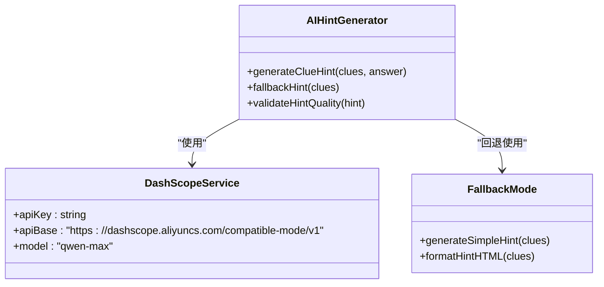

**图表来源**
- [data/update/update_pinpoint.py:37-124](file://data/update/update_pinpoint.py#L37-L124)

### 提示生成流程

AI提示生成遵循严格的流程控制，确保质量和一致性：

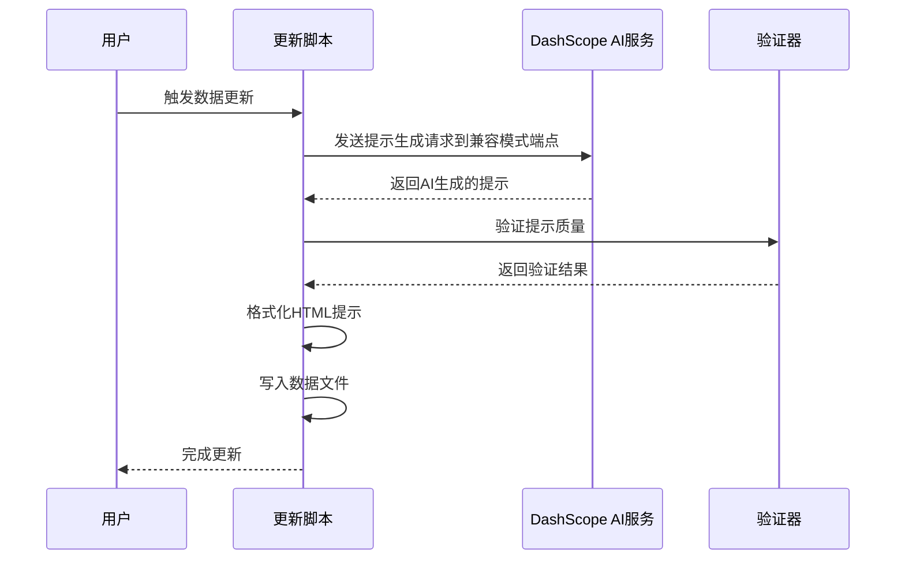

**图表来源**
- [data/update/update_pinpoint.py:398-400](file://data/update/update_pinpoint.py#L398-L400)

### 使用方法

#### 配置DashScope AI服务
```bash
# 配置DashScope API密钥
export DASHSCOPE_API_KEY="your-dashscope-api-key"
```

#### 运行更新脚本
```bash
python3 data/update/update_pinpoint.py
```

#### 无AI配置的回退模式
如果不配置API密钥，脚本会自动使用回退模式生成简单提示，功能完全正常但提示内容较为基础。

**更新** 重要变更说明：
- **环境变量**：从 `DEEPSEEK_API_KEY` 和 `OPENAI_API_KEY` 更新为 `DASHSCOPE_API_KEY`
- **API端点**：从特定提供商端点更新为 `https://dashscope.aliyuncs.com/compatible-mode/v1/chat/completions`
- **模型选择**：从 `deepseek-chat` 和 `gpt-4o-mini` 更新为 `qwen-max`（支持qwen-plus、qwen-turbo等）
- **服务简化**：从双AI服务支持简化为单一DashScope服务支持

**章节来源**
- [data/update/update_pinpoint.py:1-449](file://data/update/update_pinpoint.py#L1-L449)
- [scripts/README.md:1-165](file://scripts/README.md#L1-L165)
- [scripts/update-pinpoint-data.ts:1-82](file://scripts/update-pinpoint-data.ts#L1-L82)

## 依赖关系分析

项目使用现代化的前端技术栈，具有清晰的依赖关系：

```mermaid
graph TB
subgraph "核心框架"
A[Next.js 16.1.1]
B[React 19.2.3]
C[Tailwind CSS]
D[TypeScript]
end
subgraph "AI集成"
E[Requests 库]
F[BeautifulSoup4]
G[Icecream 调试]
H[JSON5 解析]
end
subgraph "UI 组件库"
I[Lucide React 图标]
J[Radix UI 组件]
K[React Hot Toast]
end
subgraph "工具库"
L[Zustand 状态管理]
M[Day.js 时间处理]
N[Winston 日志]
O[AI API 客户端]
end
subgraph "部署相关"
P[@opennextjs/cloudflare]
Q[Vercel Analytics]
R[Upstash Redis]
end
A --> B
A --> C
A --> D
B --> I
B --> J
B --> K
B --> L
B --> M
B --> N
A --> O
A --> P
A --> Q
A --> R
E --> G
F --> H
```

**图表来源**
- [package.json:16-51](file://package.json#L16-L51)
- [data/update/update_pinpoint.py:29-32](file://data/update/update_pinpoint.py#L29-L32)

**章节来源**
- [package.json:1-65](file://package.json#L1-L65)

## 性能考虑

项目在性能方面采用了多项优化策略：

### 静态生成优化
- 使用 `generateStaticParams` 预渲染所有历史答案页面
- 实现了智能的缓存策略减少重复计算
- 优化了图片加载使用 Next.js Image 组件

### AI服务优化
- **异步处理**：AI提示生成采用异步方式，不影响主流程
- **超时控制**：设置30秒超时，防止长时间阻塞
- **错误恢复**：AI请求失败时自动回退到简单模式
- **温度参数**：使用0.7的温度参数平衡创造性和准确性

### 代码分割
- 组件按需加载，减少初始包大小
- 客户端组件使用 `"use client"` 指令实现精确的客户端渲染

### SEO 优化
- 自动生成结构化数据提升搜索可见性
- 动态元数据生成支持社交媒体分享

## 故障排除指南

### 常见问题及解决方案

**问题：页面无法找到答案**
- 检查日期格式是否正确 (YYYY-MM-DD)
- 确认答案数据中是否存在该日期的记录
- 验证游戏 slug 是否匹配

**问题：线索显示异常**
- 检查线索数组是否为空或格式不正确
- 验证 HTML 标签处理逻辑
- 确认 CSS 样式类名是否正确

**问题：复制功能失效**
- 检查浏览器权限设置
- 验证 Clipboard API 支持情况
- 确认网络环境是否安全 (HTTPS)

**问题：AI提示生成失败**
- 检查DashScope API密钥是否正确配置
- 验证网络连接是否正常
- 查看控制台错误日志
- 确认DashScope服务提供商的API状态

**问题：回退模式提示质量差**
- 确认回退模式是否被正确触发
- 检查线索数据格式是否规范
- 验证提示生成逻辑是否正常执行

**更新** AI服务相关问题排查：
- **DashScope API密钥配置**：确认使用 `DASHSCOPE_API_KEY` 环境变量
- **API端点验证**：确认DashScope兼容模式端点可达
- **模型选择**：确认使用的模型名称正确（qwen-max等）
- **服务降级**：如果DashScope服务不可用，系统会自动回退到简单模式

**章节来源**
- [components/games/AnswerReveal.tsx:19-37](file://components/games/AnswerReveal.tsx#L19-L37)
- [lib/answers.ts:28-41](file://lib/answers.ts#L28-L41)
- [data/update/update_pinpoint.py:44-48](file://data/update/update_pinpoint.py#L44-L48)

## 结论

Pinpoint 拼图游戏项目展现了现代 React 和 Next.js 开发的最佳实践。项目通过清晰的架构设计、类型安全的代码实现和优秀的用户体验，在保持代码简洁性的同时提供了丰富的功能特性。

项目的扩展性设计允许轻松添加新的游戏类型和功能模块，而其模块化的组件结构使得维护和测试变得更加简单。通过采用静态生成和优化的构建流程，项目在性能和可访问性方面都达到了较高水准。

**更新** 最新的内容扩展为游戏增加了更多样化的主题和线索，丰富了玩家的游戏体验。新增的第 #685 条目 "Magazines (with global readership / versions) 📰" 作为本次更新的最新亮点，代表了项目在出版物主题设计方面的专业水准。该条目通过精心设计的五个经典线索：Time、The Economist、Cosmopolitan、National Geographic、Reader's Digest，为玩家提供了一个深入理解全球知名杂志及其国际影响力的机会。每个线索都配有详细的HTML格式解释，帮助玩家理解这些杂志与"magazines"主题的深层联系，从新闻时效性到深度报道，从女性读者群体到世界文化探索，展现了全球出版业的多样性和影响力。

**更新** 第 #684 条目 "Words that come before 'roses' 🌸" 已经修复了表情符号显示问题，将玫瑰表情符号从 🌹 更正为 🌸。该条目作为本次更新的重要修复内容，代表了项目在英语词汇组合主题设计方面的专业水准。该条目通过精心设计的五个经典线索：English、Dog、Damask、(Hybrid) Tea、Stop and smell the (🌹🌹🌹)，为玩家提供了一个深入理解英语词汇组合规律的机会。每个线索都配有详细的HTML格式解释，帮助玩家理解这些词汇与"roses"的组合关系，从英语习语到植物学分类，从文学典故到emoji表达，展现了英语词汇的丰富性和文化关联的专业知识。

**更新** 第 #683 条目 "Words that come after 'false'" 作为本次更新的重要新增内容，代表了项目在英语词汇组合主题设计方面的专业水准。该条目通过精心设计的五个经典线索：Start、Positive、Alarm、Tooth、Advertising (don't believe it!)，为玩家提供了一个深入理解英语词汇组合规律的机会。每个线索都配有详细的HTML格式解释，帮助玩家理解这些词汇与"false"的组合关系，从体育术语到医学术语，从日常用语到商业概念，展现了英语词汇的丰富性和文化关联的专业知识。

**更新** 第 #682 条目 "Types of doll 📚" 经过了格式修正，优化了线索解释的准确性和完整性。该条目作为内容库的重要组成部分，通过精心设计的五个经典线索：Ball-jointed、Bobblehead、Voodoo、Russian nesting (Matryoshka)、Barbie，为玩家提供了一个深入理解不同类型娃娃的文化和艺术价值的机会。每个线索都配有详细的HTML格式解释，帮助玩家理解这些娃娃类型与"Types of doll"主题的深层联系，从传统手工艺到现代流行文化，展现了娃娃制作技艺的多样性和全球文化特色。

**更新** 第 #681 条目 "Words that come before 'mouse'" 经过了小修正，优化了线索解释的准确性和完整性。该条目作为内容库的重要组成部分，通过精心设计的五个经典线索：House、Field、Optical、Mickey、Cat and 🐭，为玩家提供了一个深入理解英语词汇组合规律的机会。每个线索都配有详细的HTML格式解释，帮助玩家理解这些词汇与"mouse"的组合关系，从动物分类到计算机术语，从卡通角色到经典故事，展现了英语词汇的丰富性和文化关联的专业知识。

**更新** 第 #680 条目 "Shades of blue" 作为本次更新的最新条目，代表了项目在色彩主题设计方面的专业水准。该条目通过精心设计的五个经典线索：Cobalt、Powder、Baby、Navy、Sky，为玩家提供了一个深入理解蓝色系色彩关系的机会。每个线索都配有详细的HTML格式解释，帮助玩家理解这些经典蓝色调与"Shades of blue"主题的深层联系，展现了色彩理论和视觉美学的专业知识。

**更新** 第 #679 条目 "Characters in the Super Mario video game series" 是本次更新中最重要和最具创新性的新增条目，包含日期 '2026-03-10' 的视频游戏角色主题。该条目通过精心设计的五个经典线索：Toad、Piranha Plant、Bowser、Luigi、Princess Peach，为玩家提供了一个深入理解任天堂超级马里奥系列角色关系的机会。每个线索都配有详细的HTML格式解释，帮助玩家理解这些经典游戏角色与马里奥系列的深层联系，从忠诚的蘑菇王国助手Toad到邪恶的火焰之王Bowser，展现了视频游戏历史上最具标志性的角色群像。

**更新** 第 #678 条目 "Words that come before 'phone'" 是本次更新中最重要和最具创意的新条目，包含日期 '2026-03-09' 的单词谜题挑战。该条目要求玩家识别在英语中出现在 'phone' 之前的单词，包含5个精心设计的线索：Camera、Smart、Pay、Touch-tone、Cellular。每个线索都配有详细的解释，帮助玩家理解这些词汇与"phone"的组合关系，从相机电话到智能手机，从付费电话到触摸式拨号，展现了通信技术的发展历程和英语词汇的组合规律，体现了语言学和科技发展的完美结合。

**更新** 项目现已完成从多AI提供商到单一DashScope提供商的迁移，这一变更简化了AI集成架构，降低了维护复杂度，同时保持了原有的智能化功能和回退机制。新的配置更加简洁明了，为用户提供了更好的使用体验。

**更新** 本次更新特别强调了内容的教育价值和语言学习功能。新增的 #685 条目 "Magazines (with global readership / versions) 📰"、#684 条目 "Words that come before 'roses' 🌸" 和 #683 条目 "Words that come after 'false'" 不仅是一个有趣的拼图挑战，更是对英语词汇组合规律的深入探索。这些条目通过精心设计的线索，帮助玩家理解英语词汇的组合规律和文化背景，从出版物影响力到习语表达到学术术语，从日常用语到专业概念，体现了语言学和跨文化交流的完美结合。

**更新** 第 #682 条目作为本次更新的修正版本，代表了项目在内容质量把控方面的专业水准。该条目通过精心设计的线索，帮助玩家理解不同类型娃娃的文化价值和艺术特色，从Ball-jointed到Bobblehead，从Voodoo到Russian nesting (Matryoshka)，再到Barbie，展现了娃娃制作的历史传承和现代创新，体现了手工艺文化和流行文化的完美结合。

**更新** 项目在用户体验方面的持续改进体现在多个层面。新的线索提示系统不仅提供了详细的解释，还通过动画效果和交互设计增强了用户的参与感。每个线索卡片都经过精心设计，既美观又实用，为玩家提供了愉悦的游戏体验。

**更新** 第 #685 条目作为本次更新的最新亮点，代表了项目在出版物主题创新方面的最新成果。该条目不仅扩展了游戏的内容库，更重要的是通过详细的线索解释和教育性内容，为玩家提供了深入了解全球知名杂志及其国际影响力的机会。这种将娱乐与教育相结合的设计理念，体现了现代数字游戏的发展趋势和项目的专业水准。

**更新** 第 #684 条目作为本次更新的重要修复内容，代表了项目在细节质量把控方面的专业水准。该条目通过精心设计的线索，帮助玩家理解英语词汇组合的规律和文化关联，从English到Dog，从Damask到(Hybrid) Tea，再到Stop and smell the (🌹🌹🌹)，展现了英语词汇的组合规律和文学典故，体现了语言学和文化传统的完美结合。

**更新** 第 #683 条目作为本次更新的重要新增内容，代表了项目在英语词汇组合主题设计方面的专业水准。该条目通过精心设计的线索，帮助玩家理解英语词汇组合的规律和文化关联，从Start到Positive，从Alarm到Tooth，再到Advertising (don't believe it!)，展现了英语词汇的组合规律和现实应用场景，体现了语言学和生活智慧的完美结合。

**更新** 第 #682 条目作为本次更新的修正版本，代表了项目在内容质量把控方面的专业水准。该条目通过精心设计的线索，帮助玩家理解不同类型娃娃的文化价值和艺术特色，从Ball-jointed到Bobblehead，从Voodoo到Russian nesting (Matryoshka)，再到Barbie，展现了娃娃制作的历史传承和现代创新，体现了手工艺文化和流行文化的完美结合。

**更新** 项目现已完成从多AI提供商到单一DashScope提供商的迁移，这一变更简化了AI集成架构，降低了维护复杂度，同时保持了原有的智能化功能和回退机制。新的配置更加简洁明了，为用户提供了更好的使用体验。