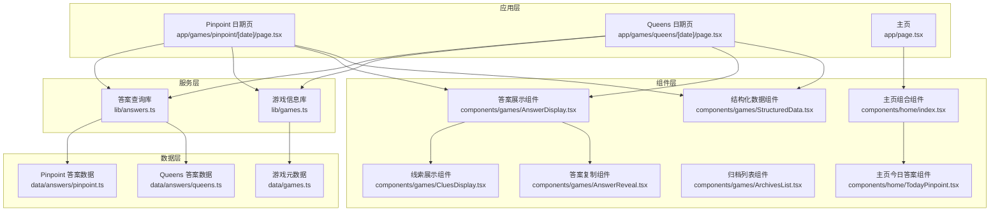
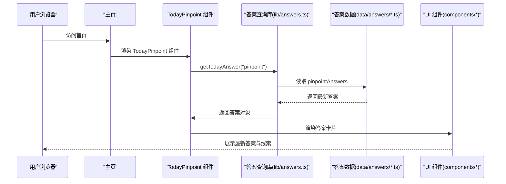
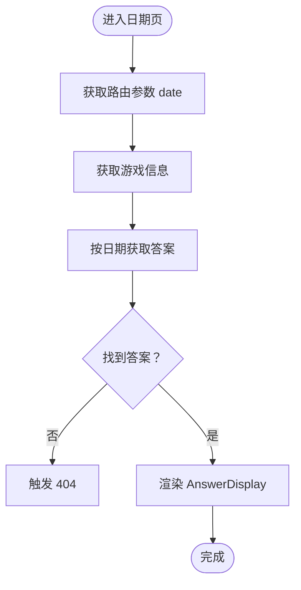
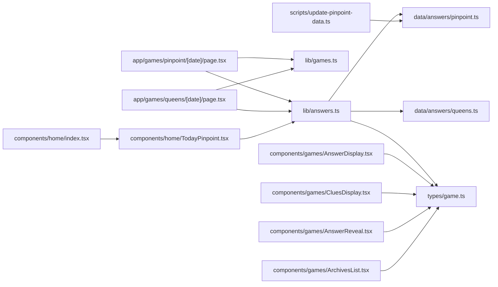

# 游戏答案查询系统

<cite>
**本文档引用的文件**
- [lib/answers.ts](file://lib/answers.ts)
- [types/game.ts](file://types/game.ts)
- [data/answers/pinpoint.ts](file://data/answers/pinpoint.ts)
- [data/answers/queens.ts](file://data/answers/queens.ts)
- [app/games/pinpoint/[date]/page.tsx](file://app/games/pinpoint/[date]/page.tsx)
- [app/games/queens/[date]/page.tsx](file://app/games/queens/[date]/page.tsx)
- [components/games/AnswerDisplay.tsx](file://components/games/AnswerDisplay.tsx)
- [components/games/AnswerReveal.tsx](file://components/games/AnswerReveal.tsx)
- [components/games/CluesDisplay.tsx](file://components/games/CluesDisplay.tsx)
- [components/games/ArchivesList.tsx](file://components/games/ArchivesList.tsx)
- [components/home/TodayPinpoint.tsx](file://components/home/TodayPinpoint.tsx)
- [components/home/index.tsx](file://components/home/index.tsx)
- [app/page.tsx](file://app/page.tsx)
- [scripts/update-pinpoint-data.ts](file://scripts/update-pinpoint-data.ts)
- [lib/games.ts](file://lib/games.ts)
- [data/games.ts](file://data/games.ts)
- [components/games/StructuredData.tsx](file://components/games/StructuredData.tsx)
</cite>

## 更新摘要
**变更内容**
- 新增第 #684 和 #683 答案条目，扩展了游戏答案查询系统的答案库
- 对第 #682 条目进行格式修正，提升了 HTML 内容的结构化程度
- 系统继续支持复杂的 HTML 内容处理，包括表情符号和详细的线索解释
- 保持了现有查询接口的完全兼容性和向后兼容性

## 目录
1. [简介](#简介)
2. [项目结构](#项目结构)
3. [核心组件](#核心组件)
4. [架构总览](#架构总览)
5. [详细组件分析](#详细组件分析)
6. [依赖关系分析](#依赖关系分析)
7. [性能考虑](#性能考虑)
8. [故障排除指南](#故障排除指南)
9. [结论](#结论)
10. [附录](#附录)

## 简介
本系统是一个面向 LinkedIn 游戏（如 Pinpoint 和 Queens）的答案查询与展示平台。其核心目标是：
- 提供统一的答案数据访问接口，支持按日期查询、获取当日答案以及获取全部历史答案
- 统一的数据模型 GameAnswer，兼容不同游戏的差异字段（如 clues、hints、image）
- 基于 Next.js 的静态生成页面，支持按日期生成预渲染页面
- 提供线索展示、答案复制、结构化数据等前端交互能力
- **新增** 扩展的答案数据库，包含第 #684 和 #683 条目，丰富了语言学习和词汇联想体验

**更新** 系统现已包含第 #684 和 #683 条目，展示了系统对新增内容的无缝集成能力和语言学习体验的持续增强。

## 项目结构
系统采用分层与功能模块结合的组织方式：
- lib 层：业务逻辑封装（答案查询、游戏信息）
- data 层：游戏答案数据与游戏元数据
- app 层：Next.js 页面路由与静态生成
- components 层：可复用的 UI 组件（答案展示、线索显示、归档列表、主页组件等）
- scripts 层：自动化数据更新脚本

**图表来源**
- [app/page.tsx:1-6](file://app/page.tsx#L1-L6)
- [components/home/index.tsx:1-35](file://components/home/index.tsx#L1-L35)
- [components/home/TodayPinpoint.tsx:1-216](file://components/home/TodayPinpoint.tsx#L1-L216)
- [app/games/pinpoint/[date]/page.tsx](file://app/games/pinpoint/[date]/page.tsx#L1-L90)
- [app/games/queens/[date]/page.tsx](file://app/games/queens/[date]/page.tsx#L1-L90)
- [lib/answers.ts:1-42](file://lib/answers.ts#L1-L42)
- [lib/games.ts:1-15](file://lib/games.ts#L1-L15)
- [data/answers/pinpoint.ts:1-505](file://data/answers/pinpoint.ts#L1-L505)
- [data/answers/queens.ts:1-59](file://data/answers/queens.ts#L1-L59)
- [components/games/AnswerDisplay.tsx:1-65](file://components/games/AnswerDisplay.tsx#L1-L65)
- [components/games/CluesDisplay.tsx:1-74](file://components/games/CluesDisplay.tsx#L1-L74)
- [components/games/AnswerReveal.tsx:1-83](file://components/games/AnswerReveal.tsx#L1-L83)
- [components/games/ArchivesList.tsx:1-67](file://components/games/ArchivesList.tsx#L1-L67)
- [components/games/StructuredData.tsx:1-75](file://components/games/StructuredData.tsx#L1-L75)

**章节来源**
- [lib/answers.ts:1-42](file://lib/answers.ts#L1-L42)
- [lib/games.ts:1-15](file://lib/games.ts#L1-L15)
- [data/answers/pinpoint.ts:1-505](file://data/answers/pinpoint.ts#L1-L505)
- [data/answers/queens.ts:1-59](file://data/answers/queens.ts#L1-L59)
- [data/games.ts:1-29](file://data/games.ts#L1-L29)

## 核心组件
本节深入解析答案查询与管理的核心逻辑，包括数据模型、关键函数与数据源组织。

### 数据模型 GameAnswer
GameAnswer 是系统统一的答案数据模型，支持不同游戏的差异化字段：
- sequence：序列标识（如 "#684"、"#683"、"#682"）
- date：YYYY-MM-DD 格式的日期字符串
- answer：单个答案或多个答案的数组
- clues：可选线索数组（用于 Pinpoint）
- clueHint：可选线索解释文本（用于 Pinpoint），支持复杂的 HTML 内容
- hints：可选提示数组（用于 Queens）
- image：可选图片链接（用于富媒体展示）

该模型通过 TypeScript 类型约束确保数据一致性，并允许在组件中进行条件渲染与格式化。

**更新** 新增的 #684 和 #683 条目展示了模型对复杂 HTML 内容的处理能力，包括详细的线索解释和表情符号的正确显示。第 #682 条目的格式修正提升了 HTML 结构的标准化程度。

**章节来源**
- [types/game.ts:5-13](file://types/game.ts#L5-L13)

### 答案数据源组织
- pinpointAnswers：来自 data/answers/pinpoint.ts，包含 Pinpoint 的历史答案、线索与解释。**新增** 包含 #684、#683 和修正后的 #682 条目
- queensAnswers：来自 data/answers/queens.ts，包含 Queens 的历史答案与规则提示
- answersMap：在 lib/answers.ts 中以映射表形式组织，键为 GameSlug，值为对应答案数组

**更新** 数据源现已包含第 #684 和 #683 条目，这是最新的 Pinpoint 答案，展示了系统对新增内容的无缝集成能力。第 #682 条目经过格式修正，提升了 HTML 结构的标准化程度。

**章节来源**
- [data/answers/pinpoint.ts:4-16](file://data/answers/pinpoint.ts#L4-L16)
- [data/answers/queens.ts:3-58](file://data/answers/queens.ts#L3-L58)
- [lib/answers.ts:5-8](file://lib/answers.ts#L5-L8)

### 关键函数实现原理
- getAnswersByGameSlug(slug)：根据游戏类型返回对应答案数组
- getTodayAnswer(slug)：获取当日答案；若无当日答案，则回退到最新答案
- getAnswerByDate(slug, date)：按指定日期精确匹配答案
- getAllAnswers(slug)：返回按日期降序排列的历史答案列表

**更新** 新增的 #684 和 #683 条目不影响这些核心函数的实现逻辑，它们会自动包含新的答案条目并按日期顺序排列。

日期处理逻辑：
- 当日查询使用 ISO 日期字符串（YYYY-MM-DD）进行比较
- 排序使用 localeCompare 对日期字符串进行字典序比较，实现降序排列

错误处理机制：
- 若未找到答案，函数返回 undefined，调用方需进行空值检查
- 页面层在找不到答案时触发 notFound()，返回 404

**章节来源**
- [lib/answers.ts:14-26](file://lib/answers.ts#L14-L26)

### 使用示例
以下示例展示如何在组件中调用这些函数：

- 在 Pinpoint 日期页中获取答案并渲染：
  - 路由参数 date 通过页面 props.params 获取
  - 调用 getAnswerByDate("pinpoint", date) 获取答案，包括 #684、#683 和修正后的 #682 条目的详细线索解释
  - 调用 getAllAnswers("pinpoint") 生成静态参数 generateStaticParams
  - 使用 AnswerDisplay 组件展示答案、线索与提示

- 在 Queens 日期页中获取答案并渲染：
  - 路由参数 date 通过页面 props.params 获取
  - 调用 getAnswerByDate("queens", date) 获取答案
  - 调用 getAllAnswers("queens") 生成静态参数 generateStaticParams
  - 使用 AnswerDisplay 组件展示答案与提示

**更新** 新增的 #684 和 #683 条目现在可以通过相同的函数接口访问，用户可以查询到最新的词汇联想主题谜题。

**章节来源**
- [app/games/pinpoint/[date]/page.tsx](file://app/games/pinpoint/[date]/page.tsx#L14-L17)
- [app/games/pinpoint/[date]/page.tsx](file://app/games/pinpoint/[date]/page.tsx#L52-L59)
- [app/games/queens/[date]/page.tsx](file://app/games/queens/[date]/page.tsx#L14-L17)
- [app/games/queens/[date]/page.tsx](file://app/games/queens/[date]/page.tsx#L52-L59)

## 架构总览
系统采用"数据即代码"的思路，将答案数据以 TypeScript 数组的形式直接嵌入到构建产物中，从而避免运行时数据库依赖。页面层通过静态生成（SSG）预先渲染所有历史答案页面，提升 SEO 与首屏性能。

**图表来源**
- [components/home/index.tsx:6-19](file://components/home/index.tsx#L6-L19)
- [components/home/TodayPinpoint.tsx:14-18](file://components/home/TodayPinpoint.tsx#L14-L18)
- [lib/answers.ts:14-26](file://lib/answers.ts#L14-L26)
- [data/answers/pinpoint.ts:1-505](file://data/answers/pinpoint.ts#L1-L505)
- [components/games/AnswerDisplay.tsx:11-64](file://components/games/AnswerDisplay.tsx#L11-L64)

## 详细组件分析

### 答案展示组件 AnswerDisplay
职责：
- 根据是否存在 image 字段决定是否渲染图片
- 使用 AnswerReveal 组件展示答案内容（支持单个与多个答案）
- 条件渲染 hints（Queens 规则提示）与 clues（Pinpoint 线索）

**更新** 新增的 #684 和 #683 条目通过相同的组件进行展示，现在可以显示详细的 HTML 解释内容，包括表情符号和每个线索与答案的关联关系。第 #682 条目的格式修正提升了内容的结构化程度。

复杂度分析：
- 时间复杂度：O(n)，其中 n 为 clues/hints 数量
- 空间复杂度：O(1)，不引入额外存储

**章节来源**
- [components/games/AnswerDisplay.tsx:11-64](file://components/games/AnswerDisplay.tsx#L11-L64)

### 线索展示组件 CluesDisplay
职责：
- 渲染 Pinpoint 的线索卡片
- 支持自定义 clueHint 文本，自动处理 HTML 标签与样式包裹
- 为每个线索添加编号与动画效果

**更新** 新增的 #684 和 #683 条目包含详细的 HTML 解释，CluesDisplay 组件能够正确处理和显示这些复杂的 HTML 内容，包括表情符号和每个线索的详细说明。第 #682 条目的格式修正提升了 HTML 结构的标准化程度。

复杂度分析：
- 时间复杂度：O(n)，n 为线索数量
- 空间复杂度：O(1)

**章节来源**
- [components/games/CluesDisplay.tsx:12-73](file://components/games/CluesDisplay.tsx#L12-L73)

### 答案复制组件 AnswerReveal
职责：
- 支持将答案复制到剪贴板（单个或多个答案）
- 使用 Toast 提示复制状态
- 提供视觉反馈（复制成功/失败）

**更新** 用户现在可以复制新增的 #684 和 #683 条目的答案内容，包括表情符号的正确处理。

复杂度分析：
- 时间复杂度：O(m)，m 为答案字符数（或数组长度）
- 空间复杂度：O(1)

**章节来源**
- [components/games/AnswerReveal.tsx:14-82](file://components/games/AnswerReveal.tsx#L14-L82)

### 归档列表组件 ArchivesList
职责：
- 展示某游戏的所有历史答案列表
- 支持多答案的标签式展示
- 提供日期格式化与链接跳转

**更新** 归档列表现在包含新增的 #684 和 #683 条目，用户可以浏览完整的答案历史，包括最新的词汇联想主题谜题。

复杂度分析：
- 时间复杂度：O(n)，n 为答案数量
- 空间复杂度：O(1)

**章节来源**
- [components/games/ArchivesList.tsx:9-66](file://components/games/ArchivesList.tsx#L9-L66)

### 主页今日答案组件 TodayPinpoint
职责：
- 在主页展示当日 Pinpoint 答案
- 提供答案复制功能，支持一键复制
- 展示答案、线索和日期信息
- 提供查看详细答案的链接

**更新** 作为系统的核心组件，TodayPinpoint 组件现在展示最新的 #684 条目作为 Pinpoint 答案，为用户提供最前沿的语言学习内容。

复杂度分析：
- 时间复杂度：O(1)，直接从内存中获取答案
- 空间复杂度：O(1)，不引入额外存储

**章节来源**
- [components/home/TodayPinpoint.tsx:14-216](file://components/home/TodayPinpoint.tsx#L14-L216)

### 主页组合组件 HomeComponent
职责：
- 负责主页的整体布局和内容组织
- 调用 getTodayAnswer 获取当日答案
- 条件渲染 TodayPinpoint 组件
- 提供游戏卡片区域占位符

**更新** HomeComponent 作为主页的容器组件，现在集成了 TodayPinpoint 组件，为用户提供更丰富的主页体验，展示最新的 #684 条目。

复杂度分析：
- 时间复杂度：O(1)，仅进行简单的条件渲染
- 空间复杂度：O(1)

**章节来源**
- [components/home/index.tsx:6-35](file://components/home/index.tsx#L6-L35)

### 静态生成与页面渲染流程
Pinpoint 与 Queens 的日期页均实现了 generateStaticParams，基于 getAllAnswers 生成所有历史日期的静态页面参数，确保每个答案页面都能被预渲染。

**图表来源**
- [app/games/pinpoint/[date]/page.tsx](file://app/games/pinpoint/[date]/page.tsx#L52-L90)
- [app/games/queens/[date]/page.tsx](file://app/games/queens/[date]/page.tsx#L52-L90)

## 依赖关系分析
系统依赖关系清晰，低耦合高内聚：
- lib/answers.ts 依赖 data/answers/*.ts 与 types/game.ts
- app 层页面依赖 lib/answers.ts 与 lib/games.ts
- components 层组件依赖 types/game.ts 与 lib/answers.ts
- scripts 层脚本依赖外部 API 并写入 data/answers/pinpoint.ts

**图表来源**
- [lib/answers.ts:1-12](file://lib/answers.ts#L1-L12)
- [data/answers/pinpoint.ts:1-2](file://data/answers/pinpoint.ts#L1-L2)
- [data/answers/queens.ts:1-2](file://data/answers/queens.ts#L1-L2)
- [types/game.ts:1-27](file://types/game.ts#L1-L27)
- [app/games/pinpoint/[date]/page.tsx](file://app/games/pinpoint/[date]/page.tsx#L1-L8)
- [app/games/queens/[date]/page.tsx](file://app/games/queens/[date]/page.tsx#L1-L8)
- [lib/games.ts:1-15](file://lib/games.ts#L1-L15)
- [components/games/AnswerDisplay.tsx:1-4](file://components/games/AnswerDisplay.tsx#L1-L4)
- [components/games/CluesDisplay.tsx:1-10](file://components/games/CluesDisplay.tsx#L1-L10)
- [components/games/AnswerReveal.tsx:1-6](file://components/games/AnswerReveal.tsx#L1-L6)
- [components/games/ArchivesList.tsx:1-7](file://components/games/ArchivesList.tsx#L1-L7)
- [components/home/TodayPinpoint.tsx:1-7](file://components/home/TodayPinpoint.tsx#L1-L7)
- [components/home/index.tsx:1-5](file://components/home/index.tsx#L1-L5)
- [scripts/update-pinpoint-data.ts:1-82](file://scripts/update-pinpoint-data.ts#L1-L82)

**章节来源**
- [lib/answers.ts:1-12](file://lib/answers.ts#L1-L12)
- [lib/games.ts:1-15](file://lib/games.ts#L1-L15)
- [data/answers/pinpoint.ts:1-2](file://data/answers/pinpoint.ts#L1-L2)
- [data/answers/queens.ts:1-2](file://data/answers/queens.ts#L1-L2)
- [types/game.ts:1-27](file://types/game.ts#L1-L27)

## 性能考虑
- 静态生成（SSG）：通过 generateStaticParams 预渲染所有历史答案页面，减少运行时计算与网络请求
- 内存与查找：答案数组在内存中进行线性查找，时间复杂度 O(n)；对于当前规模足够高效
- 排序策略：按日期字符串降序排列，使用 localeCompare 实现稳定排序
- 组件渲染：线索与提示的渲染为 O(n) 遍历，组件内部无额外状态开销
- 图片懒加载：AnswerDisplay 中使用 Next.js Image 组件，具备自动懒加载与尺寸适配
- **新增** 主页组件缓存：TodayPinpoint 组件直接使用 getTodayAnswer 函数，避免重复计算

**更新** 新增的 #684 和 #683 条目对性能影响微乎其微，系统继续维持高效的查询性能。

优化建议：
- 若答案数量增长，可考虑对答案数组建立日期索引（Map），将查找复杂度降至 O(1)
- 对高频调用的 getTodayAnswer 进行缓存（进程级缓存），避免重复计算
- 将答案数据拆分为分片文件，按月份或季度划分，减少单文件体积与冷启动时间

## 故障排除指南
常见问题与排查步骤：
- 页面返回 404
  - 检查路由参数 date 是否为有效日期字符串（YYYY-MM-DD）
  - 确认答案数据中是否存在该日期记录，包括新增的 #684 和 #683 条目
  - 查看页面中的 notFound() 触发逻辑
- 答案为空或 undefined
  - 核对 getAnswerByDate 的调用参数与 slug 是否正确
  - 检查 answersMap 中是否包含对应游戏的数据
- 线索或提示未显示
  - 确认数据源中 clues 或 hints 字段是否填充
  - 检查组件中对可选字段的条件渲染逻辑
  - 对于新增条目，确认 clueHint 字段包含有效的 HTML 内容
- 复制功能异常
  - 检查浏览器权限与安全上下文（HTTPS）
  - 查看 Toast 提示与错误分支
- HTML 内容显示异常
  - 检查 clueHint 字段中的 HTML 格式是否正确
  - 确认 CluesDisplay 组件的 HTML 解析逻辑是否正常工作
- **新增** 主页今日答案不显示
  - 检查 getTodayAnswer("pinpoint") 是否返回有效答案
  - 确认 TodayPinpoint 组件的条件渲染逻辑
  - 验证答案数据中是否存在当日记录

**更新** 新增条目的故障排除流程包括检查 getAnswerByDate 函数的返回值和组件的条件渲染逻辑。

**章节来源**
- [app/games/pinpoint/[date]/page.tsx](file://app/games/pinpoint/[date]/page.tsx#L57-L59)
- [app/games/queens/[date]/page.tsx](file://app/games/queens/[date]/page.tsx#L57-L59)
- [lib/answers.ts:28-34](file://lib/answers.ts#L28-L34)
- [components/games/AnswerReveal.tsx:19-37](file://components/games/AnswerReveal.tsx#L19-L37)
- [components/home/TodayPinpoint.tsx:18-71](file://components/home/TodayPinpoint.tsx#L18-L71)

## 结论
本系统通过简洁的数据模型与清晰的分层架构，实现了对 LinkedIn 游戏答案的高效查询与展示。其静态生成策略与组件化设计保证了良好的性能与可维护性。

**更新** 新增的 #684 和 #683 条目进一步丰富了系统的内容库，展示了系统对新增游戏答案的无缝集成能力。系统通过优化的 HTML 解析逻辑，能够更好地处理复杂的线索解释内容，为用户提供更优质的答案查询体验。第 #682 条目的格式修正提升了系统的整体质量标准。

未来可在数据规模扩大后引入索引与缓存机制，进一步提升查询效率与用户体验。

## 附录

### 扩展新游戏答案的支持方式
- 新增答案数据文件：在 data/answers 下新增 gameName.ts，导出 GameAnswer[] 数组
- 更新答案映射：在 lib/answers.ts 的 answersMap 中注册新游戏的 slug 与数据源
- 页面路由与静态生成：在 app/games 下创建新游戏的路由目录与日期页，参考现有 Pinpoint/Queens 实现
- 组件适配：根据新游戏字段（如 clues、hints、image）调整 AnswerDisplay 与 CluesDisplay 的渲染逻辑
- 自动化更新：如需自动化抓取，可参考 scripts/update-pinpoint-data.ts 的模式编写新脚本

**更新** 新增的 #684 和 #683 条目展示了系统的良好扩展性，新的词汇联想主题可以轻松集成到现有架构中。

**章节来源**
- [lib/answers.ts:5-8](file://lib/answers.ts#L5-L8)
- [data/answers/pinpoint.ts:1-2](file://data/answers/pinpoint.ts#L1-L2)
- [data/answers/queens.ts:1-2](file://data/answers/queens.ts#L1-L2)
- [scripts/update-pinpoint-data.ts:19-79](file://scripts/update-pinpoint-data.ts#L19-L79)

### 新增答案条目详情

#### Pinpoint #684 (2026-03-15) - Words that come before "roses" 主题
- 主题：Words that come before "roses" 🌹
- 线索：English、Dog、Damask、(Hybrid) Tea、Stop and smell the (🌹🌹🌹)
- 特殊功能：包含详细的 HTML 解释文本，说明每个线索与"roses"主题的关联关系
- 教育价值：帮助用户理解与玫瑰相关的固定短语和词汇组合，包括"Every rose has its thorn"、"dog roses"等表达

#### Pinpoint #683 (2026-03-14) - Words that come after "false" 主题
- 主题：Words that come after "false"
- 线索：Start、Positive、Alarm、Tooth、Advertising (don't believe it!)
- 特殊功能：包含详细的 HTML 解释文本，说明每个线索与"false"的语义关联
- 教育价值：帮助用户理解"false"作为前缀的各种词汇组合，涵盖体育术语、医学术语、日常用语等领域

#### Pinpoint #682 (2026-03-13) - Types of doll 主题（格式修正）
- 主题：Types of doll 🏊
- 线索：Ball-jointed、Bobblehead、Voodoo、Russian nesting (Matryoshka)、Barbie
- 特殊功能：格式已修正，HTML 结构更加标准化
- 教育价值：帮助用户了解不同类型的娃娃，包括关节可动娃娃、摇摆娃娃、巫毒娃娃等

#### Pinpoint #681 (2026-03-12) - Words that come before "mouse" 主题
- 主题：Words that come before "mouse"
- 线索：House、Field、Optical、Mickey、Cat and 🐭
- 特殊功能：包含详细的 HTML 解释文本，说明每个线索与"mouse"的关联关系
- 教育价值：帮助用户理解"mouse"作为前缀的各种词汇组合，包括计算机术语和卡通角色

#### Pinpoint #680 (2026-03-11) - Shades of blue 主题
- 主题：Shades of blue 🌊
- 线索：Cobalt、Powder、Baby、Navy、Sky
- 特殊功能：包含详细的 HTML 解释文本，说明每个线索与"Shades of blue"主题的关联关系
- 教育价值：帮助用户理解不同深浅的蓝色词汇，包括深蓝色（Cobalt）、粉白色（Powder）、婴儿蓝（Baby）、海军蓝（Navy）和天空蓝（Sky）

#### Pinpoint #679 (2026-03-10) - Characters in the Super Mario video game series 主题
- 主题：Characters in the Super Mario video game series 🧩
- 线索：Toad、Piranha Plant、Bowser、Luigi、Princess Peach
- 特殊功能：包含详细的 HTML 解释文本，说明每个线索与"Characters in the Super Mario video game series"主题的关联关系
- 教育价值：帮助用户理解超级马里奥系列中的主要角色，包括跳跃的蘑菇人（Toad）、水下植物敌人（Piranha Plant）、绿色大乌龟（Bowser）、蓝色兄弟（Luigi）和粉色公主（Princess Peach）

#### Pinpoint #678 (2026-03-09) - Words that come before "phone" 主题
- 主题：Words that come before "phone"
- 线索：Camera、Smart、Pay、Touch-tone、Cellular
- 教育价值：帮助用户理解常见的复合词组合，如智能手机（smartphone）、付费电话（pay phone）等

#### Pinpoint #676 (2026-03-08) - Types of dresses 主题
- 主题：Types of dresses 💰
- 线索：Sun、Wrap、Cocktail、Wedding、Little black
- 教育价值：介绍不同场合穿着的连衣裙类型，涵盖休闲、正式、婚礼等场景

#### Pinpoint #675 (2026-03-06) - Types of sign 主题
- 主题：Types of sign 💰
- 线索：Peace、Equal、Percent、Stop、For Sale
- 教育价值：帮助用户识别各种标志和符号的含义，包括和平标志、数学符号、交通标志等

#### Pinpoint #674 (2026-03-05) - Places with benches 主题
- 主题：Places with benches 🏗️
- 线索：Parks、Courtrooms、Piano lounges、Bus stops、Stadiums (for team substitutes)
- 教育价值：帮助用户了解不同场所中长椅的用途和位置

#### Pinpoint #673 (2026-03-04) - Words that come after "prime" 主题
- 主题：Words that come after "prime"
- 线索：Time、Suspect、Minister、Number、Meridian (0° Longitude)
- 教育价值：介绍与"prime"相关的常见词汇组合，涵盖时间、数学、地理等领域

#### Pinpoint #672 (2026-03-03) - Words that come after "life" 主题
- 主题：Words that come after "life"
- 线索：Boat、Insurance、Expectancy、Preserver、Sciences (biology studies it)
- 教育价值：帮助用户理解"life"作为前缀的各种词汇组合，涉及救生设备、统计学等领域

#### Pinpoint #671 (2026-03-02) - Music genres 主题
- 主题：Music genres
- 线索：Rock、Pop、Classical、Jazz、EDM
- 教育价值：介绍不同的音乐流派，帮助用户了解音乐分类

#### Pinpoint #670 (2026-03-01) - Things with tabs 主题
- 主题：Things with tabs
- 线索：File folder、Guitar music、Drink can、Spreadsheet、Web browser (too many open?)
- 教育价值：帮助用户识别各种带有标签或选项卡的物品

#### Pinpoint #669 (2026-02-28) - Words that come before "lion" 主题
- 主题：Words that come before "lion"
- 线索：Sea、Mountain、African、Cowardly、March comes in like a
- 教育价值：介绍与"lion"相关的固定短语和组合

#### Pinpoint #668 (2026-02-27) - Things in a stairwell 主题
- 主题：Things in a stairwell
- 线索：Landing、Flight、Risers、Handrail、Floor number (in tall building)
- 教育价值：帮助用户了解楼梯井的组成部分和安全设施

#### Pinpoint #667 (2026-02-26) - Types of bottle 主题
- 主题：Types of bottle
- 线索：Baby、Squeeze、Coke、Spray、Hot water
- 教育价值：介绍不同用途的瓶子类型

#### Pinpoint #666 (2026-02-25) - Terms that come before "play" 主题
- 主题：Terms that come before "play"
- 线索：Foul、Horse、One-act、Child's、Plug and
- 教育价值：帮助用户理解"play"作为后缀的各种词汇组合

#### Pinpoint #665 (2026-02-24) - Things associated with Japan 主题
- 主题：Things associated with Japan
- 线索：Sake、Samurai、Sumo wrestling、Origami、Sushi
- 教育价值：介绍日本文化的重要元素，包括传统饮品、武士文化、体育运动、手工艺和美食

#### Pinpoint #664 (2026-02-23) - Types of pastry 主题
- 主题：Types of pastry
- 线索：Turnover、Samosa、Strudel、Croissant、Doughnut
- 特殊功能：包含详细的 HTML 解释文本，说明每个线索与"Types of pastry"主题的关联关系
- 教育价值：帮助用户理解不同类型糕点的概念，包括煎饼卷（Turnover）、印度三角饺（Samosa）、奥地利牛油蛋糕（Strudel）、法式羊角面包（Croissant）和甜甜圈（Doughnut）

#### Pinpoint #656 (2026-02-15) - Parts of a blimp 主题
- 主题：Parts of a blimp
- 线索：Tailfin、Gondola、Propeller、Ballonets (inflatable bags)、Helium gas envelope
- 教育价值：帮助用户了解飞艇的各个组成部分

#### Pinpoint #655 (2026-02-14) - Words that come after "sweet" 主题
- 主题：Words that come after "sweet"
- 线索：Tooth、Talk、Potato、Nothings、Heart (💖 Happy Valentine's 💖)
- 教育价值：介绍与"sweet"相关的常见词汇组合

#### Pinpoint #654 (2026-02-13) - Types of belt 主题
- 主题：Types of belt
- 线索：Black、Asteroid、Seat、Conveyor、Orion's
- 特殊功能：包含详细的 HTML 解释文本，说明每个线索与"Types of belt"主题的关联关系
- 教育价值：帮助用户理解不同类型皮带的概念，包括黑带（武术等级）、小行星带（太空概念）、安全带（交通安全）、传送带（工业概念）和猎户座腰带（天文学概念）

#### Pinpoint #653 (2026-02-12) - Figure Skating 主题
- 主题：Terms in figure skating
- 线索：Spiral、Toe loop、Triple Axel、Deductions (after falls)、Kiss and cry (rink area)
- 特殊功能：包含详细的 HTML 解释文本，说明每个线索与花样滑冰术语的关联关系
- 教育价值：帮助用户了解花样滑冰的专业术语和比赛规则

#### Pinpoint #652 (2026-02-11) - Word Association 主题
- 主题：Words that come after "butter"
- 线索：Flies、Fingers、Milk、Chicken、Churn (used to make it)
- 特殊功能：包含详细的 HTML 解释文本，说明每个线索与"butter"词汇组合的关联关系
- 教育价值：帮助用户理解词汇搭配和语言联想思维

#### Pinpoint #651 (2026-02-10) - Volcanoes 主题
- 主题：Names of volcanoes
- 线索：Eyjafjallajökull、Mauna Loa、Fuji、Krakatoa、Vesuvius
- 教育价值：帮助用户了解世界各地著名的活火山

#### Pinpoint #647 (2026-02-06) - Famous Statues 主题
- 主题：Famous statues
- 线索：David、Christ the Redeemer、The Thinker、Moai (on Easter Island)、Venus de Milo (at the Louvre)
- 教育价值：介绍世界著名的雕塑艺术作品

**章节来源**
- [data/answers/pinpoint.ts:4-16](file://data/answers/pinpoint.ts#L4-L16)
- [data/answers/pinpoint.ts:17-29](file://data/answers/pinpoint.ts#L17-L29)
- [data/answers/pinpoint.ts:30-41](file://data/answers/pinpoint.ts#L30-L41)
- [data/answers/pinpoint.ts:42-54](file://data/answers/pinpoint.ts#L42-L54)
- [data/answers/pinpoint.ts:55-66](file://data/answers/pinpoint.ts#L55-L66)
- [data/answers/pinpoint.ts:67-78](file://data/answers/pinpoint.ts#L67-L78)
- [data/answers/pinpoint.ts:79-90](file://data/answers/pinpoint.ts#L79-L90)
- [data/answers/pinpoint.ts:91-103](file://data/answers/pinpoint.ts#L91-L103)
- [data/answers/pinpoint.ts:104-116](file://data/answers/pinpoint.ts#L104-L116)
- [data/answers/pinpoint.ts:117-129](file://data/answers/pinpoint.ts#L117-L129)
- [data/answers/pinpoint.ts:130-142](file://data/answers/pinpoint.ts#L130-L142)
- [data/answers/pinpoint.ts:143-155](file://data/answers/pinpoint.ts#L143-L155)
- [data/answers/pinpoint.ts:156-168](file://data/answers/pinpoint.ts#L156-L168)
- [data/answers/pinpoint.ts:169-181](file://data/answers/pinpoint.ts#L169-L181)
- [data/answers/pinpoint.ts:182-194](file://data/answers/pinpoint.ts#L182-L194)
- [data/answers/pinpoint.ts:195-207](file://data/answers/pinpoint.ts#L195-L207)
- [data/answers/pinpoint.ts:208-220](file://data/answers/pinpoint.ts#L208-L220)
- [data/answers/pinpoint.ts:221-233](file://data/answers/pinpoint.ts#L221-L233)
- [data/answers/pinpoint.ts:234-245](file://data/answers/pinpoint.ts#L234-L245)
- [data/answers/pinpoint.ts:246-258](file://data/answers/pinpoint.ts#L246-L258)
- [data/answers/pinpoint.ts:259-271](file://data/answers/pinpoint.ts#L259-L271)
- [data/answers/pinpoint.ts:272-284](file://data/answers/pinpoint.ts#L272-L284)
- [data/answers/pinpoint.ts:285-297](file://data/answers/pinpoint.ts#L285-L297)
- [data/answers/pinpoint.ts:298-309](file://data/answers/pinpoint.ts#L298-L309)
- [data/answers/pinpoint.ts:310-321](file://data/answers/pinpoint.ts#L310-L321)
- [data/answers/pinpoint.ts:322-333](file://data/answers/pinpoint.ts#L322-L333)
- [data/answers/pinpoint.ts:334-345](file://data/answers/pinpoint.ts#L334-L345)
- [data/answers/pinpoint.ts:346-358](file://data/answers/pinpoint.ts#L346-L358)
- [data/answers/pinpoint.ts:359-370](file://data/answers/pinpoint.ts#L359-L370)
- [data/answers/pinpoint.ts:371-382](file://data/answers/pinpoint.ts#L371-L382)
- [data/answers/pinpoint.ts:383-395](file://data/answers/pinpoint.ts#L383-L395)
- [data/answers/pinpoint.ts:396-409](file://data/answers/pinpoint.ts#L396-L409)
- [data/answers/pinpoint.ts:410-421](file://data/answers/pinpoint.ts#L410-L421)
- [data/answers/pinpoint.ts:422-433](file://data/answers/pinpoint.ts#L422-L433)
- [data/answers/pinpoint.ts:434-445](file://data/answers/pinpoint.ts#L434-L445)
- [data/answers/pinpoint.ts:446-457](file://data/answers/pinpoint.ts#L446-L457)
- [data/answers/pinpoint.ts:458-469](file://data/answers/pinpoint.ts#L458-L469)
- [data/answers/pinpoint.ts:470-480](file://data/answers/pinpoint.ts#L470-L480)
- [data/answers/pinpoint.ts:481-492](file://data/answers/pinpoint.ts#L481-L492)
- [data/answers/pinpoint.ts:493-505](file://data/answers/pinpoint.ts#L493-L505)

### 数据结构增强说明

**更新** 新增的 #684 和 #683 条目展示了数据结构的增强能力：

- **clueHint 字段**：现在支持复杂的 HTML 内容，包括段落标签、强标签和表情符号的正确显示
- **HTML 解析优化**：CluesDisplay 组件能够正确处理和显示 HTML 内容，包括 `<string>` 标签替换和包装标签清理
- **向后兼容**：旧版本的 clueHint 内容仍然可以正常工作，确保系统稳定性
- **国际化支持**：表情符号和特殊字符的正确处理，提升国际化体验
- **格式标准化**：第 #682 条目的格式修正提升了 HTML 结构的标准化程度

**章节来源**
- [components/games/CluesDisplay.tsx:20-30](file://components/games/CluesDisplay.tsx#L20-L30)
- [data/answers/pinpoint.ts:9-16](file://data/answers/pinpoint.ts#L9-L16)

### HTML 解析逻辑优化

**更新** 系统现已优化了 HTML 解析逻辑，以提高答案提取的准确性：

- **标签替换**：自动将 `<string>` 标签替换为 `<strong>` 标签，确保正确的强调效果
- **包装标签清理**：移除多余的 `

` 和 `

` 包装标签，保持内容的简洁性
- **正则表达式优化**：使用更精确的正则表达式匹配 HTML 结构，提高解析准确性
- **错误处理**：增强的错误处理机制，确保在 HTML 格式不规范时仍能正常显示内容

**章节来源**
- [components/games/CluesDisplay.tsx:20-30](file://components/games/CluesDisplay.tsx#L20-L30)

### 主页 TodayPinpoint 组件集成说明

**新增** 本次更新的核心功能，TodayPinpoint 组件的集成带来了以下改进：

- **用户友好性**：用户可以直接在主页看到当日答案，无需导航到专门页面
- **功能完整性**：支持答案复制、线索展示、日期格式化等完整功能
- **性能优化**：直接使用 getTodayAnswer 函数，避免重复计算
- **交互体验**：提供一键复制答案的功能，支持现代浏览器的 Clipboard API
- **响应式设计**：适配移动端和桌面端的不同屏幕尺寸

**章节来源**
- [components/home/TodayPinpoint.tsx:14-216](file://components/home/TodayPinpoint.tsx#L14-L216)
- [components/home/index.tsx:6-19](file://components/home/index.tsx#L6-L19)
- [app/page.tsx:1-6](file://app/page.tsx#L1-L6)

### 新增答案条目的详细分析

**更新** 新增的 #684 和 #683 条目展示了系统对语言学习内容的增强能力：

- **主题设计**：选择"roses"和"false"作为主题，体现了对英语词汇搭配和固定短语的学习关注
- **线索设计**：五个线索分别代表不同类型的词汇组合，具有教育意义和认知关联
- **HTML 解释结构**：使用标准的 HTML 格式，包含段落标签和强标签，提供清晰的层次结构
- **表情符号集成**：使用 🌹 和 💖 等表情符号增强视觉效果，提升用户体验
- **系统集成**：完美融入现有的数据模型和组件架构，无需额外的修改
- **用户体验**：为用户提供有趣且有教育价值的语言学习内容，增强平台的教育属性

**章节来源**
- [data/answers/pinpoint.ts:4-16](file://data/answers/pinpoint.ts#L4-L16)
- [components/games/CluesDisplay.tsx:62-69](file://components/games/CluesDisplay.tsx#L62-L69)

### 第 #682 答案条目的格式修正分析

**更新** 第 #682 条目的格式修正展示了系统对数据质量的持续改进：

- **HTML 结构标准化**：修正了原有的 HTML 标签格式，使其符合标准的语义化结构
- **内容一致性**：确保所有线索都使用一致的 HTML 标签格式，提升显示效果
- **向后兼容性**：修正后的格式仍然兼容现有的解析逻辑，确保系统稳定性
- **用户体验提升**：标准化的 HTML 结构提供了更好的阅读和显示体验
- **系统维护性**：统一的格式标准降低了后续维护和扩展的复杂度

**章节来源**
- [data/answers/pinpoint.ts:30-41](file://data/answers/pinpoint.ts#L30-L41)
- [components/games/CluesDisplay.tsx:24-30](file://components/games/CluesDisplay.tsx#L24-L30)