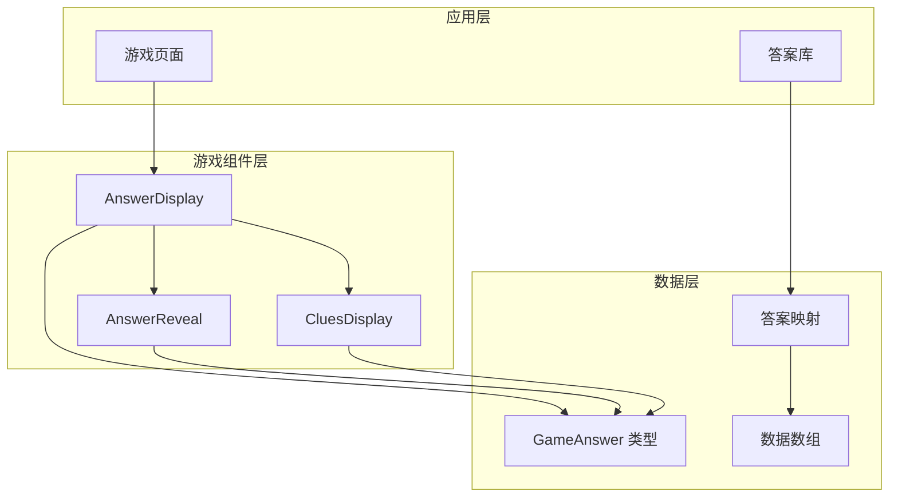
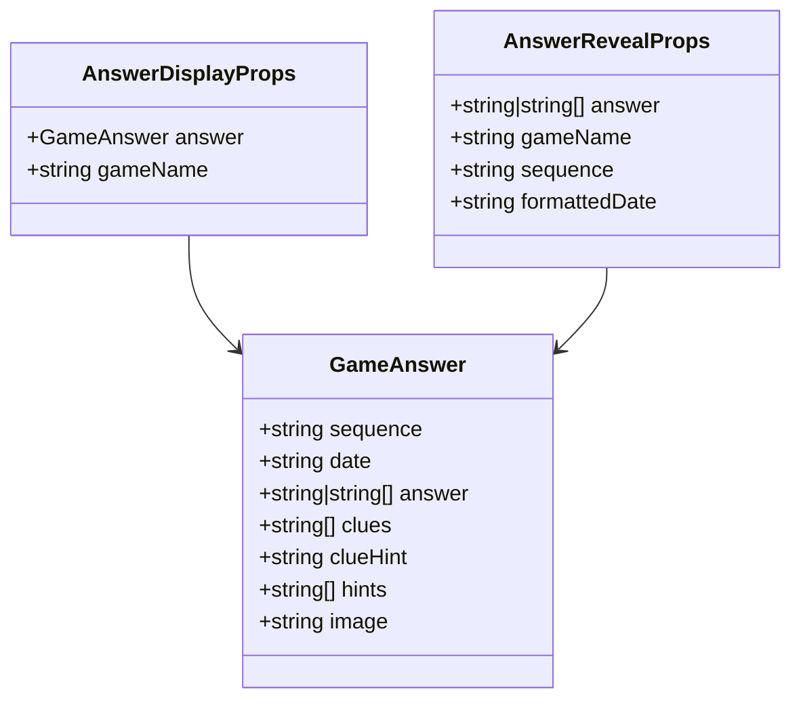
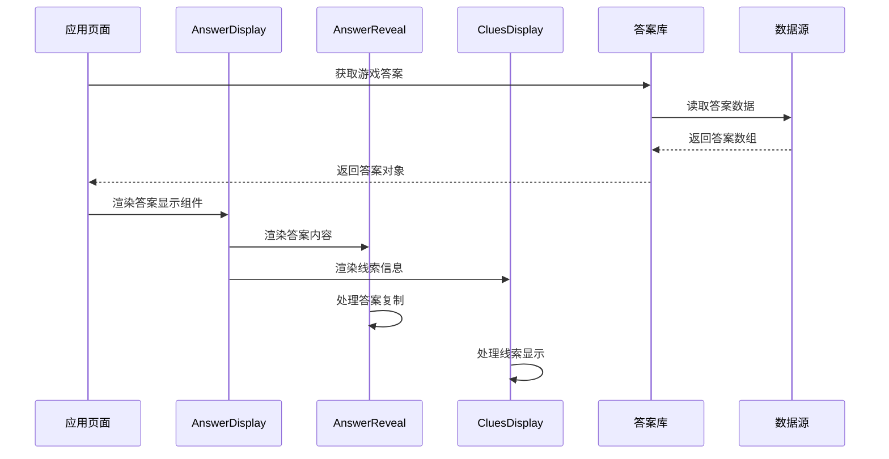
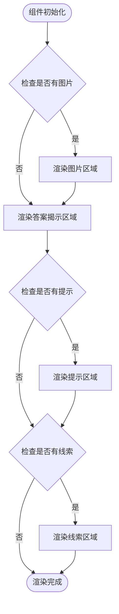
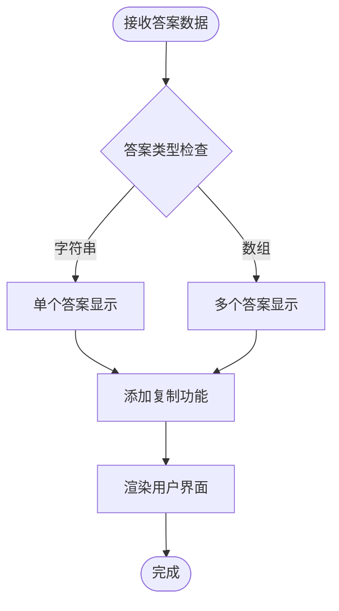
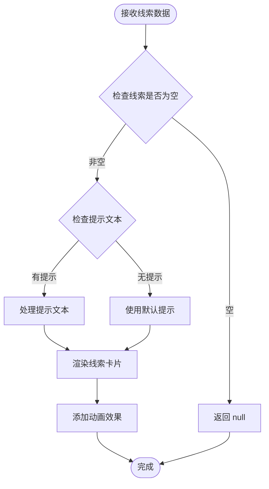
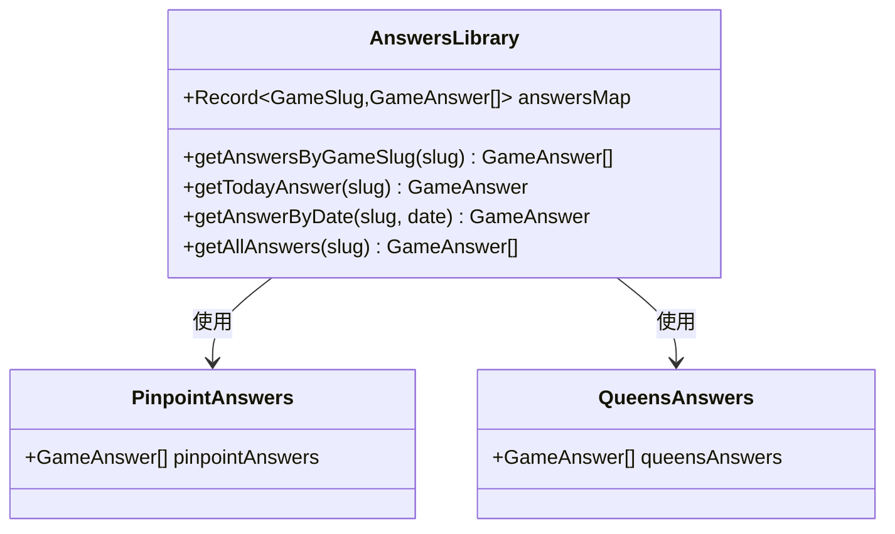
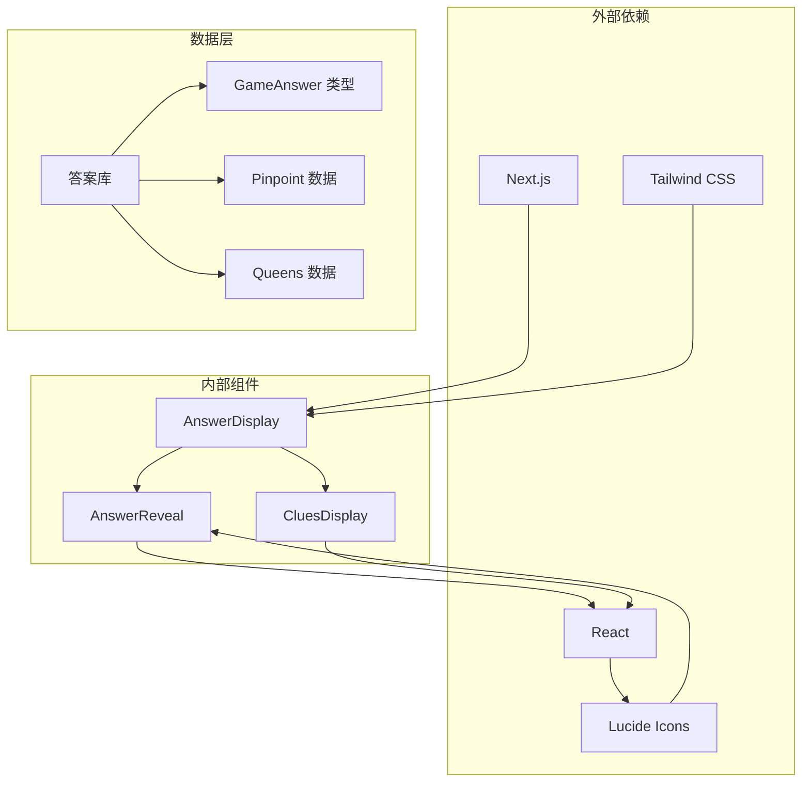
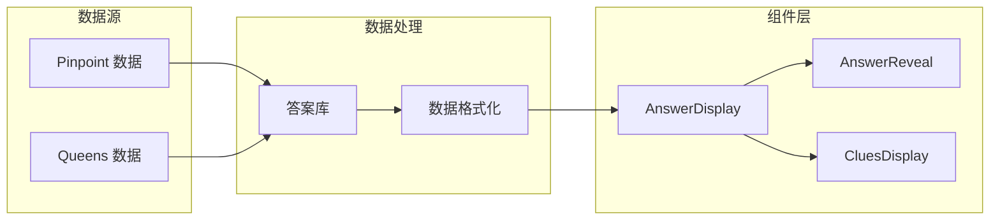

# AnswerDisplay 答案显示组件

<cite>
**本文档引用的文件**
- [AnswerDisplay.tsx](file://components/games/AnswerDisplay.tsx)
- [AnswerReveal.tsx](file://components/games/AnswerReveal.tsx)
- [CluesDisplay.tsx](file://components/games/CluesDisplay.tsx)
- [answers.ts](file://lib/answers.ts)
- [pinpoint.ts](file://data/answers/pinpoint.ts)
- [queens.ts](file://data/answers/queens.ts)
- [game.ts](file://types/game.ts)
- [page.tsx](file://app/games/[gameSlug]/page.tsx)
- [globals.css](file://styles/globals.css)
</cite>

## 目录
1. [简介](#简介)
2. [项目结构](#项目结构)
3. [核心组件](#核心组件)
4. [架构概览](#架构概览)
5. [详细组件分析](#详细组件分析)
6. [依赖关系分析](#依赖关系分析)
7. [性能考虑](#性能考虑)
8. [故障排除指南](#故障排除指南)
9. [结论](#结论)
10. [附录](#附录)

## 简介

AnswerDisplay 是一个专门用于展示游戏答案数据的 React 组件，负责将游戏答案以美观、易读的方式呈现给用户。该组件支持多种游戏类型的答案展示，包括单个答案、多个答案以及带有线索和提示的复杂答案格式。

该组件的核心功能包括：
- 答案数据的解析和格式化显示
- 响应式布局设计
- 用户交互功能（复制答案）
- 多种游戏类型的支持
- 无障碍访问支持
- 动画效果实现

## 项目结构

AnswerDisplay 组件位于游戏功能模块中，与相关的子组件共同构成完整的答案显示系统：



**图表来源**
- [AnswerDisplay.tsx](file://components/games/AnswerDisplay.tsx#L1-L65)
- [AnswerReveal.tsx](file://components/games/AnswerReveal.tsx#L1-L83)
- [CluesDisplay.tsx](file://components/games/CluesDisplay.tsx#L1-L74)
- [answers.ts](file://lib/answers.ts#L1-L42)

**章节来源**
- [AnswerDisplay.tsx](file://components/games/AnswerDisplay.tsx#L1-L65)
- [game.ts](file://types/game.ts#L1-L27)

## 核心组件

AnswerDisplay 组件采用组合模式，通过多个子组件协作完成答案的完整展示：

### 主要特性

1. **多游戏类型支持**：支持 "pinpoint" 和 "queens" 两种游戏类型
2. **灵活的答案格式**：支持单个答案和多个答案的展示
3. **响应式设计**：适配各种屏幕尺寸
4. **用户交互**：提供答案复制功能
5. **视觉层次**：清晰的信息层级结构

### 数据结构

组件使用统一的 `GameAnswer` 接口来处理不同类型的游戏答案：



**图表来源**
- [game.ts](file://types/game.ts#L5-L13)
- [AnswerDisplay.tsx](file://components/games/AnswerDisplay.tsx#L6-L9)

**章节来源**
- [game.ts](file://types/game.ts#L1-L27)
- [AnswerDisplay.tsx](file://components/games/AnswerDisplay.tsx#L6-L19)

## 架构概览

AnswerDisplay 采用分层架构设计，各组件职责明确：



**图表来源**
- [page.tsx](file://app/games/[gameSlug]/page.tsx#L45-L97)
- [answers.ts](file://lib/answers.ts#L14-L26)
- [AnswerDisplay.tsx](file://components/games/AnswerDisplay.tsx#L11-L63)

## 详细组件分析

### AnswerDisplay 组件

AnswerDisplay 是主组件，负责协调各个子组件的工作：

#### 组件结构



**图表来源**
- [AnswerDisplay.tsx](file://components/games/AnswerDisplay.tsx#L21-L63)

#### 关键功能实现

1. **日期格式化**：使用本地化格式显示答案日期
2. **条件渲染**：根据数据可用性动态显示组件
3. **响应式设计**：使用 Tailwind CSS 实现自适应布局
4. **暗色模式支持**：自动适配系统主题

**章节来源**
- [AnswerDisplay.tsx](file://components/games/AnswerDisplay.tsx#L11-L63)

### AnswerReveal 子组件

AnswerReveal 专门负责答案内容的展示和交互：

#### 显示逻辑



**图表来源**
- [AnswerReveal.tsx](file://components/games/AnswerReveal.tsx#L14-L82)

#### 交互功能

1. **答案复制**：一键复制答案到剪贴板
2. **状态管理**：显示复制成功/失败状态
3. **视觉反馈**：提供动画效果和视觉提示

**章节来源**
- [AnswerReveal.tsx](file://components/games/AnswerReveal.tsx#L14-L82)

### CluesDisplay 子组件

CluesDisplay 负责展示游戏线索信息：

#### 线索处理



**图表来源**
- [CluesDisplay.tsx](file://components/games/CluesDisplay.tsx#L12-L73)

**章节来源**
- [CluesDisplay.tsx](file://components/games/CluesDisplay.tsx#L12-L73)

### 数据获取和处理

#### 答案库管理



**图表来源**
- [answers.ts](file://lib/answers.ts#L5-L41)
- [pinpoint.ts](file://data/answers/pinpoint.ts#L3-L138)
- [queens.ts](file://data/answers/queens.ts#L3-L58)

**章节来源**
- [answers.ts](file://lib/answers.ts#L1-L42)

## 依赖关系分析

### 组件间依赖



**图表来源**
- [AnswerDisplay.tsx](file://components/games/AnswerDisplay.tsx#L1-L4)
- [AnswerReveal.tsx](file://components/games/AnswerReveal.tsx#L1-L6)
- [CluesDisplay.tsx](file://components/games/CluesDisplay.tsx#L1-L4)

### 数据流分析



**图表来源**
- [answers.ts](file://lib/answers.ts#L1-L8)
- [page.tsx](file://app/games/[gameSlug]/page.tsx#L45-L54)

**章节来源**
- [page.tsx](file://app/games/[gameSlug]/page.tsx#L1-L115)

## 性能考虑

### 渲染优化

1. **条件渲染**：仅在数据存在时渲染相应组件
2. **懒加载**：图片使用 Next.js 的懒加载机制
3. **CSS 动画**：使用硬件加速的 CSS 动画
4. **响应式设计**：减少不必要的重排重绘

### 内存管理

1. **组件卸载**：正确处理组件生命周期
2. **事件清理**：避免内存泄漏
3. **状态优化**：合理使用 React 状态

## 故障排除指南

### 常见问题

1. **答案不显示**
   - 检查游戏 slug 是否正确
   - 验证答案数据是否存在
   - 确认网络连接正常

2. **图片加载失败**
   - 检查图片 URL 是否有效
   - 验证图片格式支持
   - 确认 CDN 连接正常

3. **复制功能异常**
   - 检查浏览器权限设置
   - 验证 HTTPS 环境
   - 确认剪贴板 API 可用

### 调试建议

1. **控制台日志**：添加必要的调试信息
2. **错误边界**：实现错误边界组件
3. **性能监控**：使用 React DevTools 分析性能

**章节来源**
- [AnswerReveal.tsx](file://components/games/AnswerReveal.tsx#L19-L37)

## 结论

AnswerDisplay 组件是一个设计精良的答案展示系统，具有以下特点：

1. **模块化设计**：通过子组件协作实现功能分离
2. **响应式布局**：适配各种设备和屏幕尺寸
3. **用户友好**：提供直观的交互体验
4. **可扩展性**：支持新的游戏类型和答案格式
5. **性能优化**：采用多种优化策略提升用户体验

该组件为游戏答案的展示提供了完整的解决方案，既满足了功能需求，又保证了良好的用户体验。

## 附录

### 使用示例

#### 基本使用

```typescript
// 在游戏页面中使用
<AnswerDisplay 
  answer={gameAnswer} 
  gameName={game.name} 
/>
```

#### 自定义样式配置

1. **颜色主题**：通过 Tailwind CSS 类名自定义
2. **动画效果**：修改 CSS 动画参数
3. **布局调整**：使用响应式断点
4. **字体大小**：通过 CSS 变量调整

#### 支持的游戏类型

1. **Pinpoint 游戏**：支持线索和提示显示
2. **Queens 游戏**：支持简单答案格式
3. **扩展支持**：可通过修改类型定义支持新游戏

### 最佳实践

1. **数据验证**：始终验证输入数据的有效性
2. **错误处理**：实现完善的错误处理机制
3. **性能监控**：定期检查组件性能表现
4. **用户体验**：持续优化交互体验