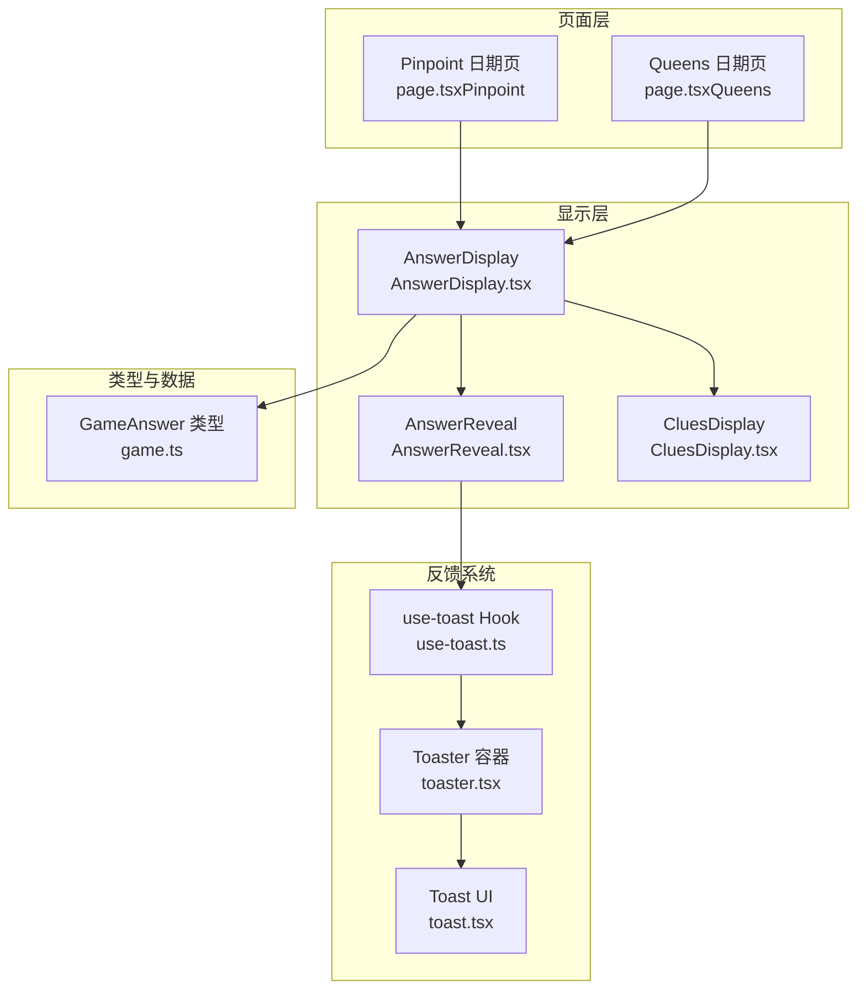
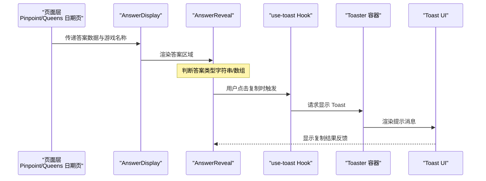
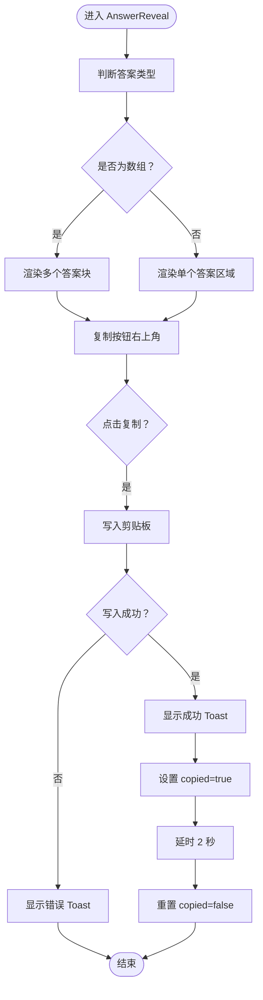
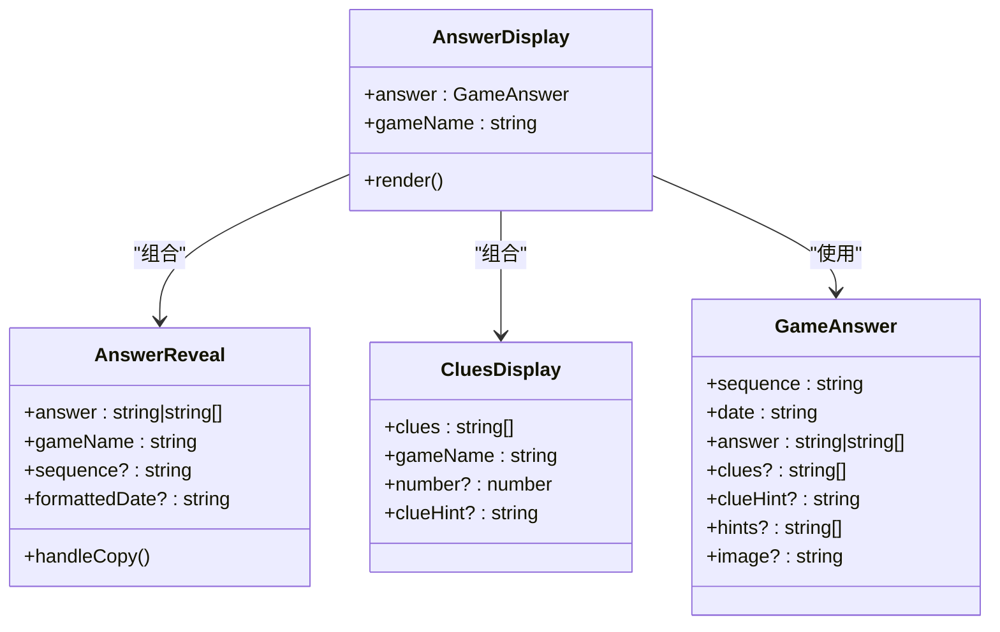

# AnswerReveal 答案揭示组件

<cite>
**本文档引用的文件**
- [AnswerReveal.tsx](file://components/games/AnswerReveal.tsx)
- [AnswerDisplay.tsx](file://components/games/AnswerDisplay.tsx)
- [CluesDisplay.tsx](file://components/games/CluesDisplay.tsx)
- [game.ts](file://types/game.ts)
- [page.tsx（Pinpoint）](file://app/games/pinpoint/[date]/page.tsx)
- [page.tsx（Queens）](file://app/games/queens/[date]/page.tsx)
- [use-toast.ts](file://hooks/use-toast.ts)
- [toast.tsx](file://components/ui/toast.tsx)
- [toaster.tsx](file://components/ui/toaster.tsx)
- [globals.css](file://styles/globals.css)
</cite>

## 目录
1. [简介](#简介)
2. [项目结构](#项目结构)
3. [核心组件](#核心组件)
4. [架构概览](#架构概览)
5. [详细组件分析](#详细组件分析)
6. [依赖关系分析](#依赖关系分析)
7. [性能考虑](#性能考虑)
8. [故障排除指南](#故障排除指南)
9. [结论](#结论)
10. [附录](#附录)

## 简介
AnswerReveal 是一个用于在网页中渐进式揭示答案的 React 组件，支持单个答案与多个答案两种展示形式，并提供复制到剪贴板的功能与即时反馈提示。该组件通过动画过渡增强视觉体验，结合用户交互触发状态变化，确保在不同设备与主题下均具备良好的可用性与可访问性。

## 项目结构
AnswerReveal 组件位于游戏模块中，通常由 AnswerDisplay 聚合渲染，后者负责组织答案、线索与图片等信息。页面层（Pinpoint/Queens）通过路由参数加载对应日期的答案数据并传递给 AnswerDisplay。

**图表来源**
- [page.tsx（Pinpoint）](file://app/games/pinpoint/[date]/page.tsx#L52-L89)
- [page.tsx（Queens）](file://app/games/queens/[date]/page.tsx#L52-L89)
- [AnswerDisplay.tsx](file://components/games/AnswerDisplay.tsx#L11-L64)
- [AnswerReveal.tsx](file://components/games/AnswerReveal.tsx#L14-L82)
- [CluesDisplay.tsx](file://components/games/CluesDisplay.tsx#L12-L73)
- [game.ts](file://types/game.ts#L5-L13)
- [use-toast.ts](file://hooks/use-toast.ts#L174-L192)
- [toast.tsx](file://components/ui/toast.tsx#L10-L56)
- [toaster.tsx](file://components/ui/toaster.tsx#L13-L35)

**章节来源**
- [AnswerReveal.tsx](file://components/games/AnswerReveal.tsx#L1-L83)
- [AnswerDisplay.tsx](file://components/games/AnswerDisplay.tsx#L1-L65)
- [CluesDisplay.tsx](file://components/games/CluesDisplay.tsx#L1-L74)
- [game.ts](file://types/game.ts#L1-L27)
- [page.tsx（Pinpoint）](file://app/games/pinpoint/[date]/page.tsx#L1-L90)
- [page.tsx（Queens）](file://app/games/queens/[date]/page.tsx#L1-L90)

## 核心组件
AnswerReveal 的职责是根据传入的答案数据动态渲染答案区域，并提供复制功能与即时反馈。其关键特性包括：
- 自适应答案形态：单个答案或数组形式的答案
- 渐进式动画：通过全局动画与悬停缩放提升交互体验
- 用户反馈：复制成功/失败通过 Toast 提示
- 响应式布局：在移动端与桌面端保持一致的可读性与可触达性

**章节来源**
- [AnswerReveal.tsx](file://components/games/AnswerReveal.tsx#L7-L12)
- [AnswerReveal.tsx](file://components/games/AnswerReveal.tsx#L14-L82)
- [use-toast.ts](file://hooks/use-toast.ts#L145-L172)
- [toast.tsx](file://components/ui/toast.tsx#L27-L41)

## 架构概览
AnswerReveal 的调用链从页面层开始，经 AnswerDisplay 聚合，最终渲染答案与相关辅助信息。复制交互通过 use-toast Hook 触发 Toast，UI 层由 Toaster 容器统一挂载。

**图表来源**
- [page.tsx（Pinpoint）](file://app/games/pinpoint/[date]/page.tsx#L52-L89)
- [page.tsx（Queens）](file://app/games/queens/[date]/page.tsx#L52-L89)
- [AnswerDisplay.tsx](file://components/games/AnswerDisplay.tsx#L39-L44)
- [AnswerReveal.tsx](file://components/games/AnswerReveal.tsx#L19-L37)
- [use-toast.ts](file://hooks/use-toast.ts#L145-L172)
- [toaster.tsx](file://components/ui/toaster.tsx#L13-L35)
- [toast.tsx](file://components/ui/toast.tsx#L10-L56)

## 详细组件分析

### AnswerReveal 组件
- 输入参数
  - answer: 字符串或字符串数组
  - gameName: 游戏名称
  - sequence: 可选的序列号（如“第 N 日”）
  - formattedDate: 可选的格式化日期
- 状态管理
  - copied: 标识复制状态，用于切换图标与短暂反馈
- 动画与交互
  - 复制按钮在悬停时放大、按压时缩小，提供触觉反馈
  - 答案容器采用渐变背景与阴影，提升层级感
- 复制流程
  - 将答案合并为文本后写入剪贴板
  - 成功：设置 copied 并弹出 Toast；2 秒后清除状态
  - 失败：弹出错误 Toast 并保持原状

**图表来源**
- [AnswerReveal.tsx](file://components/games/AnswerReveal.tsx#L14-L82)
- [use-toast.ts](file://hooks/use-toast.ts#L145-L172)

**章节来源**
- [AnswerReveal.tsx](file://components/games/AnswerReveal.tsx#L7-L12)
- [AnswerReveal.tsx](file://components/games/AnswerReveal.tsx#L14-L82)

### AnswerDisplay 组件
- 职责：聚合答案、图片、提示与线索
- 答案渲染：委托给 AnswerReveal
- 图片渲染：可选，若存在则显示
- 提示与线索：可选，分别渲染提示列表与线索卡片

**章节来源**
- [AnswerDisplay.tsx](file://components/games/AnswerDisplay.tsx#L6-L9)
- [AnswerDisplay.tsx](file://components/games/AnswerDisplay.tsx#L11-L64)

### CluesDisplay 组件
- 职责：渲染线索卡片，支持可配置提示文本
- 动画：每张卡片带有序列延迟的淡入动画
- 提示：支持内联 HTML 标记的高亮处理

**章节来源**
- [CluesDisplay.tsx](file://components/games/CluesDisplay.tsx#L5-L10)
- [CluesDisplay.tsx](file://components/games/CluesDisplay.tsx#L12-L73)

### 页面集成
- Pinpoint/Queens 日期页通过路由参数加载答案数据，构造格式化日期并传递给 AnswerDisplay
- 页面元数据生成与导航组件配合，确保 SEO 与可访问性

**章节来源**
- [page.tsx（Pinpoint）](file://app/games/pinpoint/[date]/page.tsx#L14-L50)
- [page.tsx（Pinpoint）](file://app/games/pinpoint/[date]/page.tsx#L52-L89)
- [page.tsx（Queens）](file://app/games/queens/[date]/page.tsx#L14-L50)
- [page.tsx（Queens）](file://app/games/queens/[date]/page.tsx#L52-L89)

## 依赖关系分析
- 组件耦合
  - AnswerDisplay 对 AnswerReveal 与 CluesDisplay 存在直接依赖
  - AnswerReveal 依赖 use-toast Hook 进行反馈
- 外部依赖
  - 全局动画：globals.css 中的 fadeIn 动画被 CluesDisplay 使用
  - UI 组件：Radix UI 的 Toast 提供跨浏览器一致的提示体验
- 数据契约
  - GameAnswer 类型定义了答案、线索、提示与图片等字段，保证数据一致性

**图表来源**
- [AnswerDisplay.tsx](file://components/games/AnswerDisplay.tsx#L6-L9)
- [AnswerReveal.tsx](file://components/games/AnswerReveal.tsx#L7-L12)
- [CluesDisplay.tsx](file://components/games/CluesDisplay.tsx#L5-L10)
- [game.ts](file://types/game.ts#L5-L13)

**章节来源**
- [game.ts](file://types/game.ts#L1-L27)
- [globals.css](file://styles/globals.css#L19-L28)

## 性能考虑
- 渲染优化
  - 数组答案采用映射渲染，避免不必要的重复 DOM 结构
  - 复制按钮仅在单答案模式下出现，减少冗余元素
- 动画性能
  - 使用 CSS 动画（如 fadeIn）而非 JavaScript 动画库，降低主线程压力
  - 卡片级动画采用顺序延迟，避免同时触发大量重排
- 反馈开销
  - Toast 限制数量与移除延迟，避免频繁创建/销毁 DOM
- 主题与响应式
  - 使用 Tailwind 工具类与暗色主题变量，减少自定义样式的计算成本

[本节为通用性能建议，不直接分析具体文件，故无章节来源]

## 故障排除指南
- 复制失败
  - 现象：复制按钮未变化且弹出错误 Toast
  - 排查：检查浏览器权限与 HTTPS 环境；确认 answer 数据类型正确
- 反馈未显示
  - 现象：点击复制无任何提示
  - 排查：确认 Toaster 已在应用根部挂载；检查 use-toast Hook 是否正确初始化
- 动画异常
  - 现象：卡片动画不生效或卡顿
  - 排查：确认全局动画已引入；检查动画时序与延迟设置

**章节来源**
- [AnswerReveal.tsx](file://components/games/AnswerReveal.tsx#L19-L37)
- [use-toast.ts](file://hooks/use-toast.ts#L145-L172)
- [toaster.tsx](file://components/ui/toaster.tsx#L13-L35)
- [toast.tsx](file://components/ui/toast.tsx#L27-L41)

## 结论
AnswerReveal 通过简洁的接口与稳健的状态管理，实现了答案的渐进式揭示与用户交互反馈。其与 AnswerDisplay、CluesDisplay 的协作，以及与 Toast 系统的集成，共同构建了清晰、可维护且具有良好用户体验的答案展示体系。未来可在确认对话框、多步揭示动画与无障碍增强方面进一步扩展。

[本节为总结性内容，不直接分析具体文件，故无章节来源]

## 附录

### 动画效果配置
- 全局淡入动画：适用于线索卡片的逐项出现
- 按钮交互动画：悬停放大、按压缩小，提供触觉反馈
- 答案容器：渐变背景与阴影，增强层级感

**章节来源**
- [globals.css](file://styles/globals.css#L19-L28)
- [CluesDisplay.tsx](file://components/games/CluesDisplay.tsx#L44-L46)
- [AnswerReveal.tsx](file://components/games/AnswerReveal.tsx#L60-L77)

### 交互状态管理
- copied 状态：控制复制按钮图标与短暂反馈
- Toast 状态：由 use-toast Hook 管理，限制同时显示数量

**章节来源**
- [AnswerReveal.tsx](file://components/games/AnswerReveal.tsx#L15-L16)
- [AnswerReveal.tsx](file://components/games/AnswerReveal.tsx#L25-L29)
- [use-toast.ts](file://hooks/use-toast.ts#L11-L12)
- [use-toast.ts](file://hooks/use-toast.ts#L77-L130)

### 用户确认机制与结果反馈
- 复制成功：显示“已复制”提示并自动恢复
- 复制失败：显示错误提示，引导用户重试
- 反馈位置：全局右上角，不影响主要内容阅读

**章节来源**
- [AnswerReveal.tsx](file://components/games/AnswerReveal.tsx#L25-L36)
- [toast.tsx](file://components/ui/toast.tsx#L12-L25)

### 组件使用示例与扩展建议
- 基本用法
  - 在 AnswerDisplay 中传入 GameAnswer 与游戏名称
  - 若存在图片或提示，AnswerDisplay 会自动渲染
- 自定义揭示动画
  - 可在 AnswerReveal 内部增加更多 CSS 动画类，或通过外部容器注入入场/出场动画
- 添加确认对话框
  - 在 handleCopy 前插入确认步骤，例如二次点击或模态框确认
- 扩展交互模式
  - 支持“逐步揭示”：将答案拆分为多个阶段，点击后逐段显示
  - 支持“音效反馈”：在复制成功时播放简短音效

**章节来源**
- [AnswerDisplay.tsx](file://components/games/AnswerDisplay.tsx#L39-L44)
- [AnswerReveal.tsx](file://components/games/AnswerReveal.tsx#L19-L37)