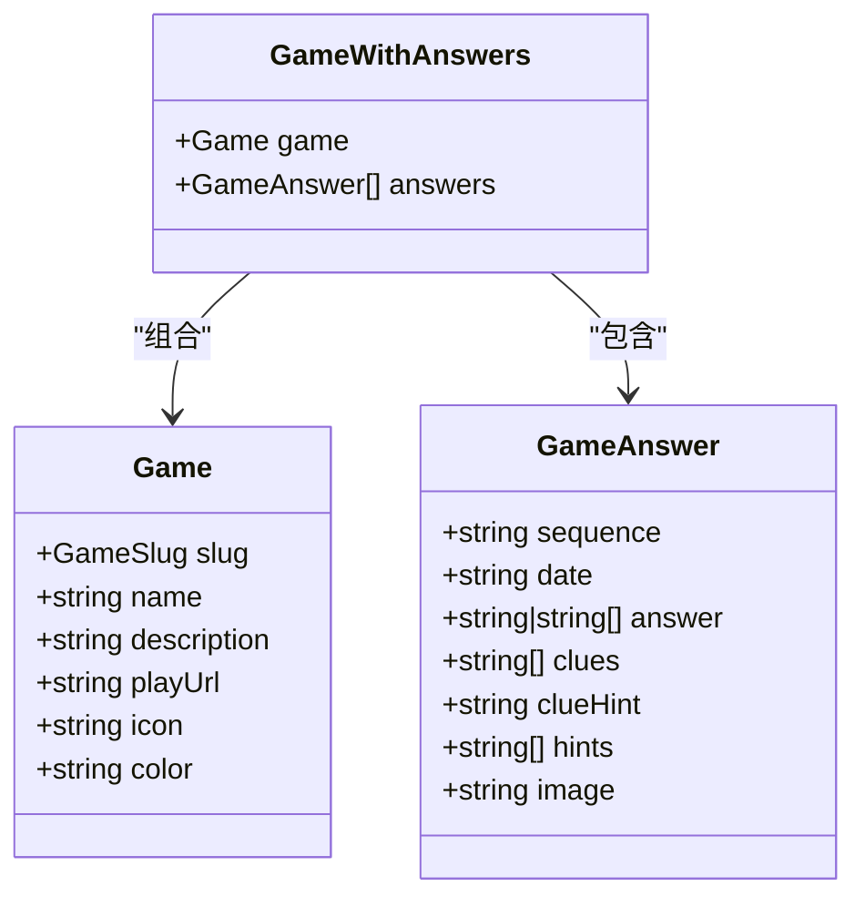
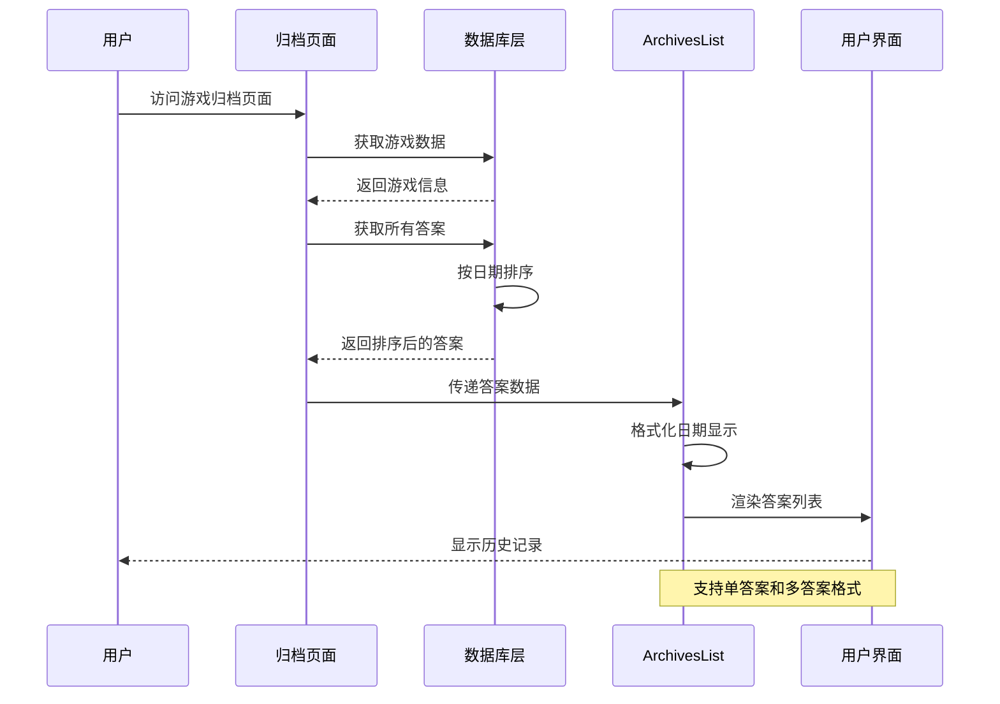
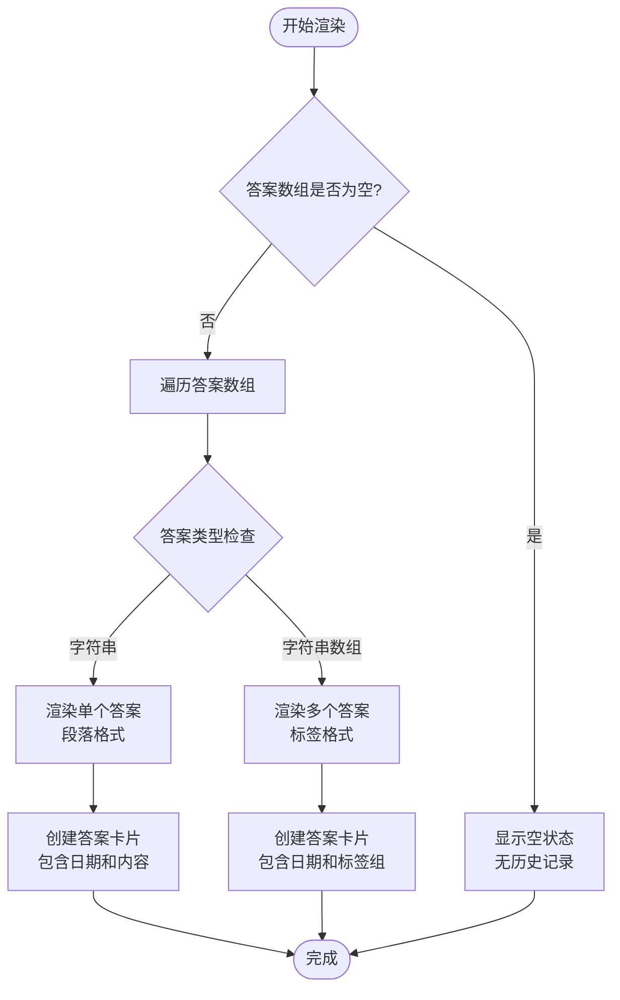
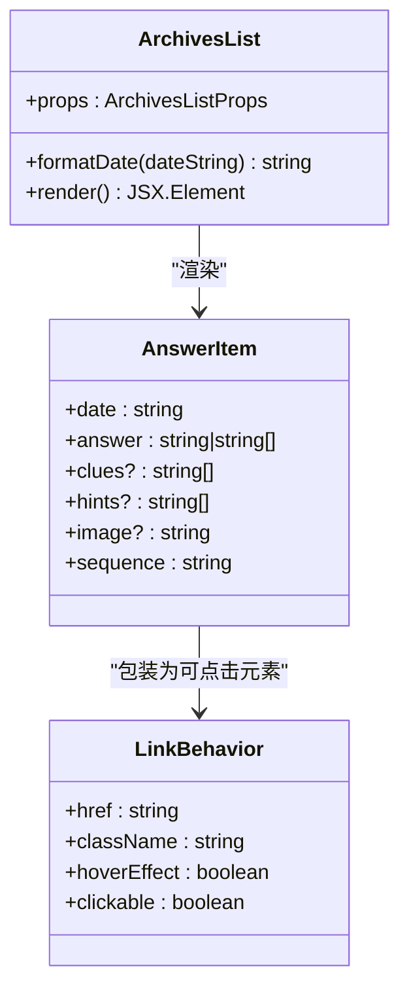
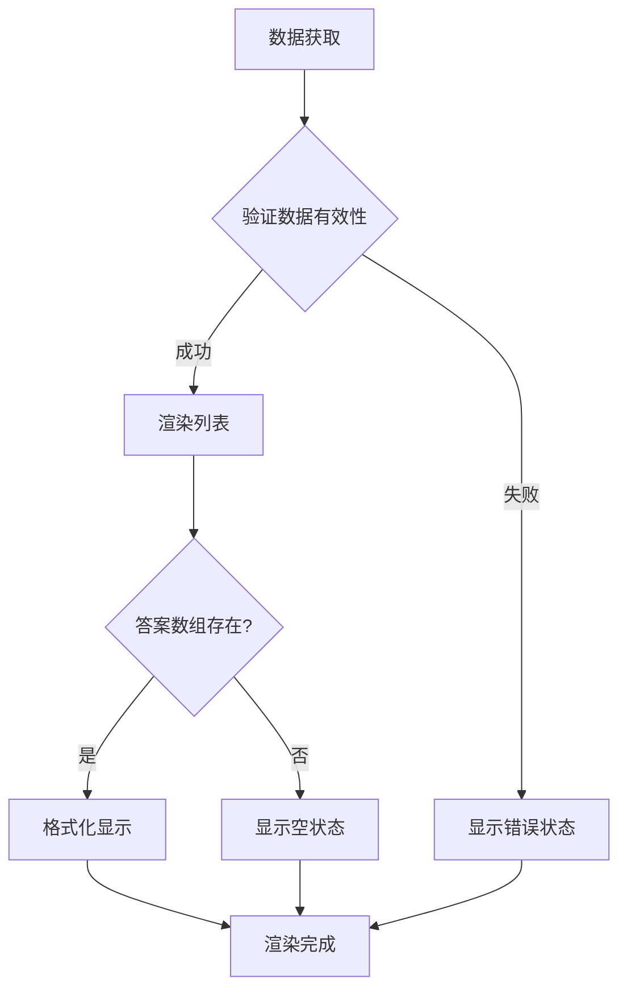
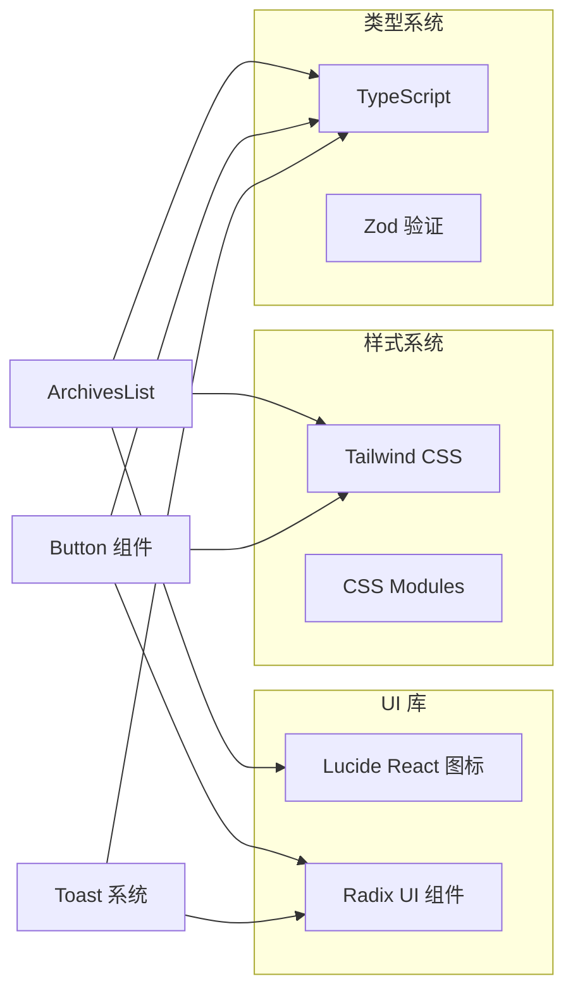
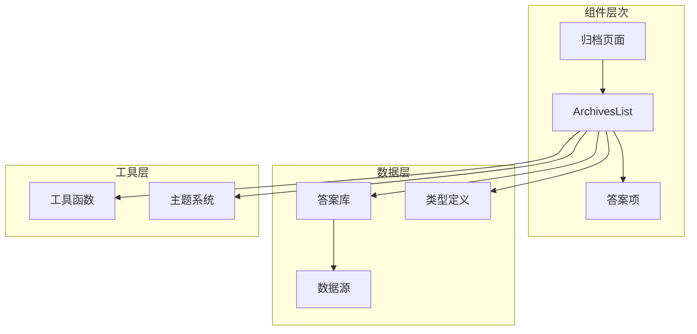
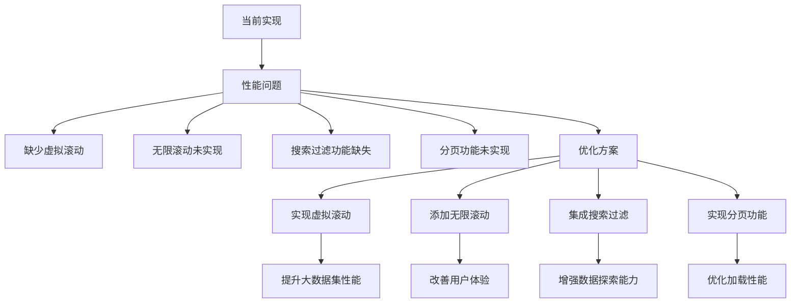
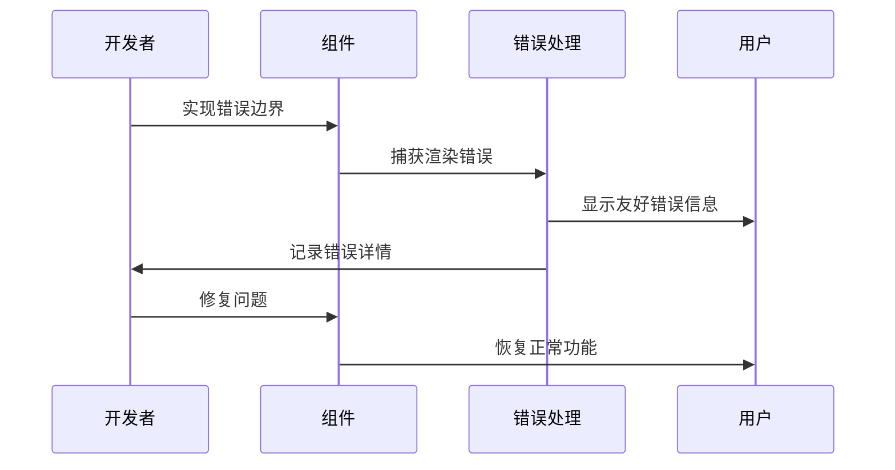

# ArchivesList 历史记录列表组件

<cite>
**本文档引用的文件**
- [ArchivesList.tsx](file://components/games/ArchivesList.tsx)
- [page.tsx](file://app/games/[gameSlug]/archives/page.tsx)
- [answers.ts](file://lib/answers.ts)
- [game.ts](file://types/game.ts)
- [pinpoint.ts](file://data/answers/pinpoint.ts)
- [queens.ts](file://data/answers/queens.ts)
- [games.ts](file://lib/games.ts)
- [button.tsx](file://components/ui/button.tsx)
- [loading-spinner.tsx](file://components/icons/loading-spinner.tsx)
- [loading-dots.tsx](file://components/icons/loading-dots.tsx)
- [toast.tsx](file://components/ui/toast.tsx)
- [use-toast.ts](file://hooks/use-toast.ts)
</cite>

## 目录
1. [简介](#简介)
2. [项目结构](#项目结构)
3. [核心组件](#核心组件)
4. [架构概览](#架构概览)
5. [详细组件分析](#详细组件分析)
6. [依赖关系分析](#依赖关系分析)
7. [性能考虑](#性能考虑)
8. [故障排除指南](#故障排除指南)
9. [结论](#结论)
10. [附录](#附录)

## 简介

ArchivesList 是一个专门用于展示游戏历史答案记录的 React 组件。该组件负责渲染游戏的历史数据，包括按日期排序的答案列表、格式化的显示效果以及用户交互功能。组件支持多种答案格式（单个答案和多个答案），并提供友好的视觉反馈和加载状态管理。

## 项目结构

ArchivesList 组件位于游戏模块中，与游戏页面和数据层紧密集成：

```mermaid
graph TB
subgraph "应用层"
APG[游戏归档页面<br/>app/games/[gameSlug]/archives/page.tsx]
end
subgraph "组件层"
AL[ArchivesList 组件<br/>components/games/ArchivesList.tsx]
BTN[按钮组件<br/>components/ui/button.tsx]
LS[加载动画<br/>components/icons/loading-spinner.tsx]
end
subgraph "数据层"
AN[答案数据<br/>lib/answers.ts]
GA[游戏数据<br/>lib/games.ts]
DT[类型定义<br/>types/game.ts]
end
subgraph "数据源"
PIN[Pinpoint 数据<br/>data/answers/pinpoint.ts]
QUE[Queens 数据<br/>data/answers/queens.ts]
end
APG --> AL
AL --> AN
AN --> PIN
AN --> QUE
AL --> DT
APG --> GA
AL --> BTN
AL --> LS
```

**图表来源**
- [page.tsx](file://app/games/[gameSlug]/archives/page.tsx#L1-L67)
- [ArchivesList.tsx](file://components/games/ArchivesList.tsx#L1-L67)
- [answers.ts](file://lib/answers.ts#L1-L42)

**章节来源**
- [page.tsx](file://app/games/[gameSlug]/archives/page.tsx#L1-L67)
- [ArchivesList.tsx](file://components/games/ArchivesList.tsx#L1-L67)

## 核心组件

### 组件接口定义

ArchivesList 接受两个主要属性：

| 属性名 | 类型 | 必需 | 描述 |
|--------|------|------|------|
| answers | GameAnswer[] | 是 | 游戏历史答案数组，按日期降序排列 |
| gameSlug | string | 是 | 游戏标识符，用于构建答案链接 |

### 数据结构定义

GameAnswer 接口定义了历史记录的数据结构：



**图表来源**
- [game.ts](file://types/game.ts#L5-L27)

**章节来源**
- [game.ts](file://types/game.ts#L1-L27)

## 架构概览

ArchivesList 的工作流程展示了从数据获取到界面渲染的完整过程：



**图表来源**
- [page.tsx](file://app/games/[gameSlug]/archives/page.tsx#L42-L66)
- [answers.ts](file://lib/answers.ts#L36-L41)
- [ArchivesList.tsx](file://components/games/ArchivesList.tsx#L9-L66)

## 详细组件分析

### 列表渲染逻辑

ArchivesList 实现了智能的列表渲染，能够处理不同类型的答案数据：



**图表来源**
- [ArchivesList.tsx](file://components/games/ArchivesList.tsx#L19-L66)

### 时间排序逻辑

系统采用基于 ISO 8601 格式的字符串比较进行排序：

| 排序方式 | 比较算法 | 结果 |
|----------|----------|------|
| 日期降序 | b.date.localeCompare(a.date) | 最新答案在前 |
| 字符串比较 | ISO 8601 格式 | YYYY-MM-DD 自然排序 |

### 交互设计

组件提供了丰富的用户交互体验：



**图表来源**
- [ArchivesList.tsx](file://components/games/ArchivesList.tsx#L32-L61)

**章节来源**
- [ArchivesList.tsx](file://components/games/ArchivesList.tsx#L1-L67)

### 加载状态管理

虽然当前版本没有实现完整的加载状态管理，但组件具备以下特性：

- **空状态处理**：当没有历史记录时显示友好提示
- **条件渲染**：根据答案数量动态调整布局
- **响应式设计**：支持移动端和桌面端的不同间距

### 错误处理机制

组件实现了基础的错误处理：



**图表来源**
- [ArchivesList.tsx](file://components/games/ArchivesList.tsx#L19-L25)

**章节来源**
- [ArchivesList.tsx](file://components/games/ArchivesList.tsx#L19-L25)

## 依赖关系分析

### 外部依赖

组件依赖于以下外部库和工具：



**图表来源**
- [ArchivesList.tsx](file://components/games/ArchivesList.tsx#L1-L2)
- [button.tsx](file://components/ui/button.tsx#L1-L58)
- [toast.tsx](file://components/ui/toast.tsx#L1-L130)

### 内部依赖关系



**图表来源**
- [page.tsx](file://app/games/[gameSlug]/archives/page.tsx#L1-L67)
- [answers.ts](file://lib/answers.ts#L1-L42)

**章节来源**
- [page.tsx](file://app/games/[gameSlug]/archives/page.tsx#L1-L67)
- [answers.ts](file://lib/answers.ts#L1-L42)

## 性能考虑

### 当前实现的性能特点

1. **内存效率**：组件直接接收预排序的数据，避免重复计算
2. **渲染优化**：使用 React 的 key 属性确保列表项的稳定更新
3. **样式优化**：采用 Tailwind CSS 的原子化类名，减少样式计算开销

### 潜在优化机会



## 故障排除指南

### 常见问题及解决方案

| 问题类型 | 症状 | 可能原因 | 解决方案 |
|----------|------|----------|----------|
| 数据显示异常 | 答案顺序错误 | 排序逻辑问题 | 检查 date 字段格式和排序函数 |
| 样式不正确 | 组件显示异常 | CSS 类名冲突 | 验证 Tailwind 配置和类名 |
| 性能问题 | 页面加载缓慢 | 大数据集渲染 | 考虑实现虚拟滚动或分页 |
| 交互失效 | 点击无响应 | 链接或事件绑定问题 | 检查 href 和事件处理器 |

### 错误处理最佳实践



**章节来源**
- [toast.tsx](file://components/ui/toast.tsx#L1-L130)
- [use-toast.ts](file://hooks/use-toast.ts#L1-L195)

## 结论

ArchivesList 组件是一个设计精良的历史记录展示组件，具有以下优势：

1. **清晰的架构**：组件职责单一，易于维护和测试
2. **良好的用户体验**：直观的视觉设计和流畅的交互
3. **可扩展性**：支持多种答案格式和未来功能扩展
4. **性能优化**：合理的数据处理和渲染策略

建议的改进方向包括实现虚拟滚动、搜索过滤和分页功能，以进一步提升用户体验和性能表现。

## 附录

### 组件使用示例

#### 基本用法
```typescript
// 在游戏归档页面中使用
<ArchivesList 
  answers={gameAnswers} 
  gameSlug={gameSlug} 
/>
```

#### 自定义样式
```typescript
// 通过 props 传入自定义样式
<ArchivesList 
  answers={answers} 
  gameSlug={gameSlug}
  className="custom-styles"
/>
```

#### 扩展功能
```typescript
// 添加搜索过滤功能
const filteredAnswers = answers.filter(answer => 
  answer.answer.toLowerCase().includes(searchTerm)
);

<ArchivesList 
  answers={filteredAnswers} 
  gameSlug={gameSlug}
/>
```

### 数据源扩展

要支持新的历史数据源，需要：

1. **添加数据文件**：在 `data/answers/` 目录下创建新的数据文件
2. **更新映射**：在 `lib/answers.ts` 中添加新的映射关系
3. **类型定义**：确保新的数据符合 GameAnswer 接口规范
4. **页面集成**：在相应的游戏页面中集成新数据源

**章节来源**
- [pinpoint.ts](file://data/answers/pinpoint.ts#L1-L139)
- [queens.ts](file://data/answers/queens.ts#L1-L59)
- [answers.ts](file://lib/answers.ts#L1-L42)