# ArchivesList 历史记录列表组件

<cite>
**本文档引用的文件**
- [ArchivesList.tsx](file://components/games/ArchivesList.tsx)
- [page.tsx](file://app/games/[gameSlug]/archives/page.tsx)
- [answers.ts](file://lib/answers.ts)
- [game.ts](file://types/game.ts)
- [select.tsx](file://components/ui/select.tsx)
- [button.tsx](file://components/ui/button.tsx)
- [loading-spinner.tsx](file://components/icons/loading-spinner.tsx)
- [loading-dots.tsx](file://components/icons/loading-dots.tsx)
</cite>

## 更新摘要
**变更内容**
- 新增月度过滤系统，支持按月份筛选历史记录
- 实现分页功能，每页显示10条记录
- 添加实时结果计数显示，动态显示过滤后结果数量
- 优化交互设计，支持过滤器变化时的分页重置
- 增强用户界面，提供更好的浏览体验
- 实现响应式设计，支持移动端和桌面端的不同间距

## 目录
1. [简介](#简介)
2. [项目结构](#项目结构)
3. [核心组件](#核心组件)
4. [架构概览](#架构概览)
5. [详细组件分析](#详细组件分析)
6. [功能特性](#功能特性)
7. [依赖关系分析](#依赖关系分析)
8. [性能考虑](#性能考虑)
9. [故障排除指南](#故障排除指南)
10. [结论](#结论)
11. [附录](#附录)

## 简介

ArchivesList 是一个专门用于展示游戏历史答案记录的 React 组件。该组件经过重大功能增强，现已升级为完整的交互式档案浏览系统，支持月度过滤、分页加载、实时结果计数等高级功能。组件负责渲染游戏的历史数据，包括按日期排序的答案列表、格式化的显示效果以及丰富的用户交互功能。

## 项目结构

ArchivesList 组件位于游戏模块中，与游戏页面和数据层紧密集成：

```mermaid
graph TB
subgraph "应用层"
APG[游戏归档页面<br/>app/games/[gameSlug]/archives/page.tsx]
end
subgraph "组件层"
AL[ArchivesList 组件<br/>components/games/ArchivesList.tsx]
SEL[选择器组件<br/>components/ui/select.tsx]
BTN[按钮组件<br/>components/ui/button.tsx]
LS[加载动画<br/>components/icons/loading-spinner.tsx]
end
subgraph "数据层"
AN[答案数据<br/>lib/answers.ts]
GA[游戏数据<br/>lib/games.ts]
DT[类型定义<br/>types/game.ts]
end
APG --> AL
AL --> AN
AL --> SEL
AL --> BTN
AL --> LS
AN --> DT
APG --> GA
```

**图表来源**
- [page.tsx:1-67](file://app/games/[gameSlug]/archives/page.tsx#L1-L67)
- [ArchivesList.tsx:1-166](file://components/games/ArchivesList.tsx#L1-L166)
- [answers.ts:1-42](file://lib/answers.ts#L1-L42)

**章节来源**
- [page.tsx:1-67](file://app/games/[gameSlug]/archives/page.tsx#L1-L67)
- [ArchivesList.tsx:1-166](file://components/games/ArchivesList.tsx#L1-L166)

## 核心组件

### 组件接口定义

ArchivesList 接受两个主要属性：

| 属性名 | 类型 | 必需 | 描述 |
|--------|------|------|------|
| answers | GameAnswer[] | 是 | 游戏历史答案数组，按日期降序排列 |
| gameSlug | string | 是 | 游戏标识符，用于构建答案链接 |

### 数据结构定义

GameAnswer 接口定义了历史记录的数据结构：

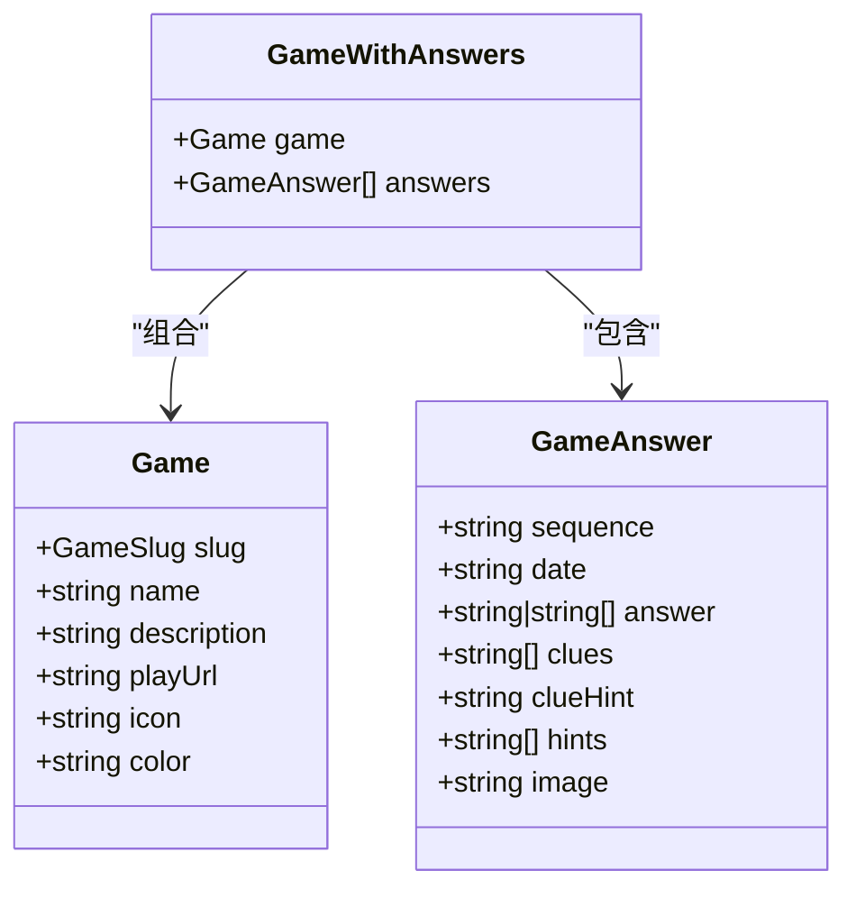

**图表来源**
- [game.ts:5-27](file://types/game.ts#L5-L27)

**章节来源**
- [game.ts:1-27](file://types/game.ts#L1-L27)

## 架构概览

ArchivesList 的工作流程展示了从数据获取到界面渲染的完整过程：

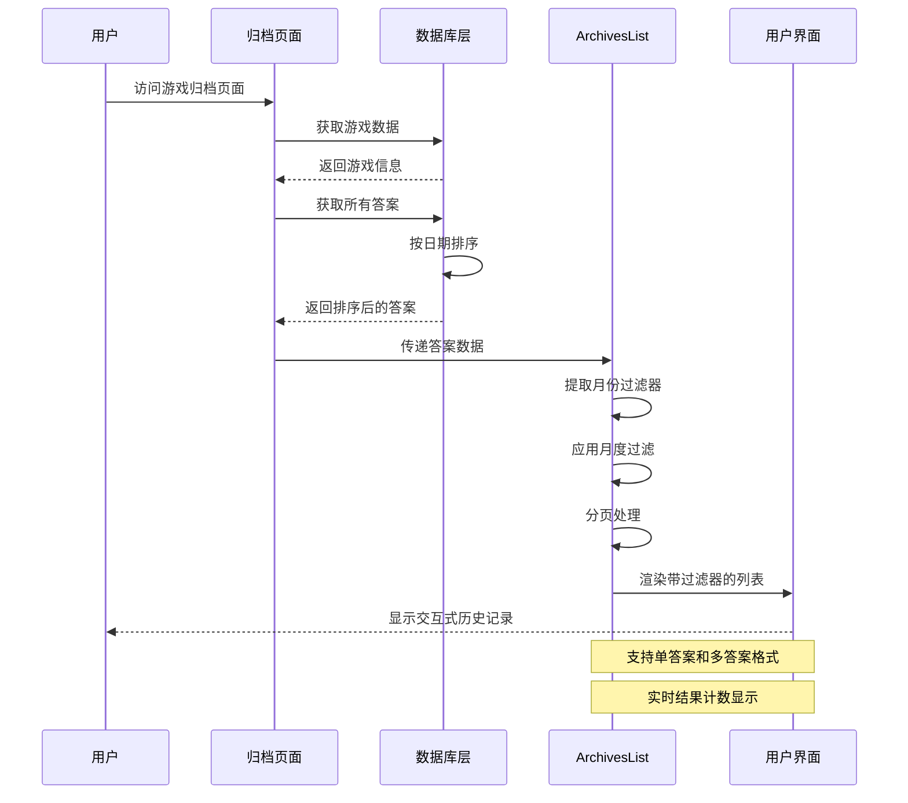

**图表来源**
- [page.tsx:42-66](file://app/games/[gameSlug]/archives/page.tsx#L42-L66)
- [answers.ts:36-41](file://lib/answers.ts#L36-L41)
- [ArchivesList.tsx:14-166](file://components/games/ArchivesList.tsx#L14-L166)

## 详细组件分析

### 列表渲染逻辑

ArchivesList 实现了智能的列表渲染，能够处理不同类型的答案数据：

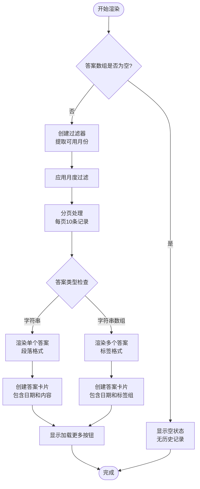

**图表来源**
- [ArchivesList.tsx:14-166](file://components/games/ArchivesList.tsx#L14-L166)

### 时间排序逻辑

系统采用基于 ISO 8601 格式的字符串比较进行排序，并提供月度过滤功能：

| 排序方式 | 比较算法 | 结果 |
|----------|----------|------|
| 日期降序 | b.date.localeCompare(a.date) | 最新答案在前 |
| 月份提取 | date.toLocaleDateString("en-US", {year: "numeric", month: "long"}) | YYYY年MM月格式 |
| 字符串比较 | ISO 8601 格式 | YYYY-MM-DD 自然排序 |

### 交互设计

组件提供了丰富的用户交互体验，包括月度过滤和分页导航：

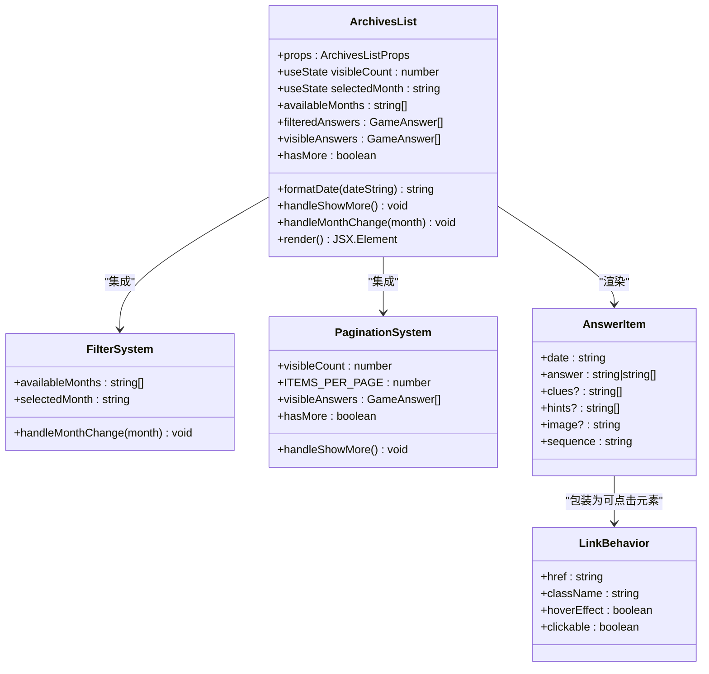

**图表来源**
- [ArchivesList.tsx:14-166](file://components/games/ArchivesList.tsx#L14-L166)

### 加载状态管理

组件实现了完整的状态管理机制：

- **空状态处理**：当没有历史记录时显示友好提示
- **过滤状态**：实时显示过滤后的结果数量
- **分页状态**：动态控制加载更多按钮的显示
- **条件渲染**：根据答案数量动态调整布局
- **响应式设计**：支持移动端和桌面端的不同间距（使用 `sm:` 前缀）

### 错误处理机制

组件实现了基础的错误处理：

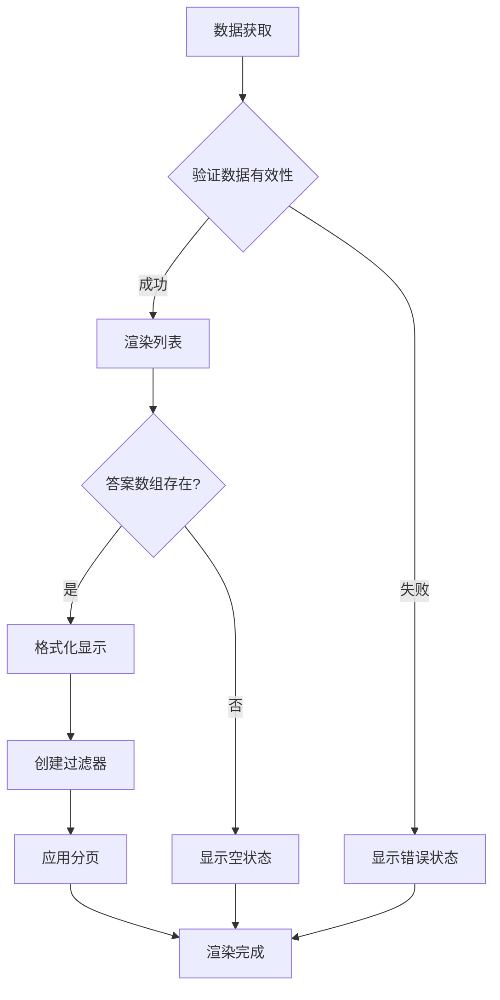

**图表来源**
- [ArchivesList.tsx:73-79](file://components/games/ArchivesList.tsx#L73-L79)

**章节来源**
- [ArchivesList.tsx:73-79](file://components/games/ArchivesList.tsx#L73-L79)

## 功能特性

### 月度过滤系统

组件实现了智能的月度过滤功能：

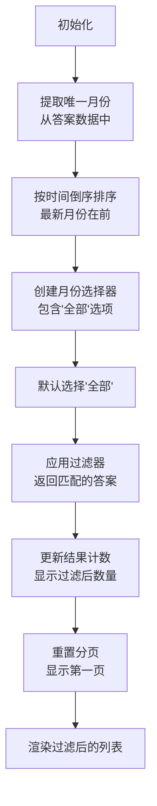

**图表来源**
- [ArchivesList.tsx:27-71](file://components/games/ArchivesList.tsx#L27-L71)

### 分页功能

实现了高效的分页加载机制：

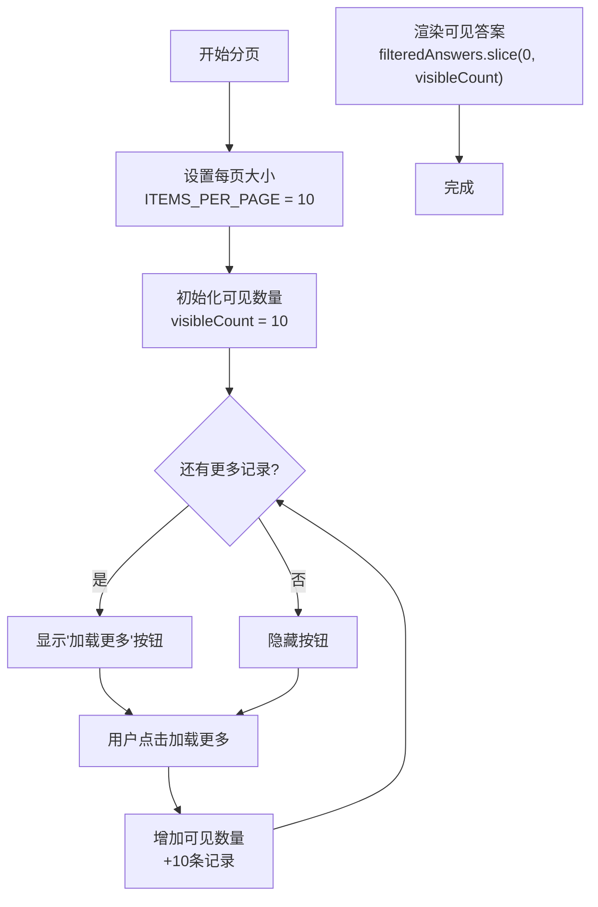

**图表来源**
- [ArchivesList.tsx:12-66](file://components/games/ArchivesList.tsx#L12-L66)

### 实时结果计数

动态显示过滤后的结果数量：

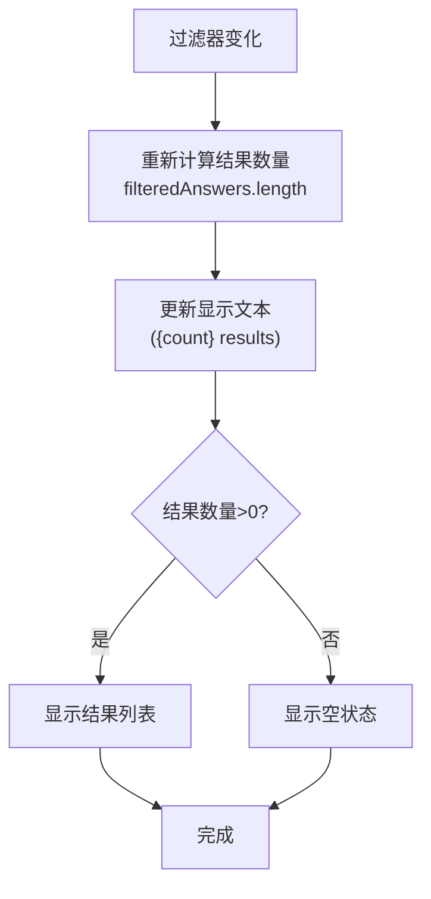

**图表来源**
- [ArchivesList.tsx:104-106](file://components/games/ArchivesList.tsx#L104-L106)

### 响应式设计

组件实现了完整的响应式设计：

- **移动端优化**：使用 `sm:` 前缀的 Tailwind 类实现断点适配
- **间距调整**：在小屏幕上使用 `space-y-3`，在大屏幕上使用 `space-y-4`
- **内边距调整**：在小屏幕上使用 `p-3`，在大屏幕上使用 `p-4`
- **字体大小调整**：在小屏幕上使用 `text-sm`，在大屏幕上使用 `text-base`

**章节来源**
- [ArchivesList.tsx:12-106](file://components/games/ArchivesList.tsx#L12-L106)

## 依赖关系分析

### 外部依赖

组件依赖于以下外部库和工具：

```mermaid
graph LR
subgraph "UI 库"
LUCIDE[Lucide React 图标]
RADIX[Radix UI 组件]
END
subgraph "样式系统"
TAILWIND[Tailwind CSS]
CSS_MODULES[CSS Modules]
end
subgraph "类型系统"
TYPESCRIPT[TypeScript]
ZOD[Zod 验证]
end
AL[ArchivesList] --> LUCIDE
AL --> TAILWIND
AL --> TYPESCRIPT
SEL[Select 组件] --> RADIX
SEL --> TAILWIND
SEL --> TYPESCRIPT
BTN[Button 组件] --> RADIX
BTN --> TAILWIND
BTN --> TYPESCRIPT
```

**图表来源**
- [ArchivesList.tsx:1-5](file://components/games/ArchivesList.tsx#L1-L5)
- [select.tsx:1-160](file://components/ui/select.tsx#L1-L160)
- [button.tsx:1-58](file://components/ui/button.tsx#L1-L58)

### 内部依赖关系

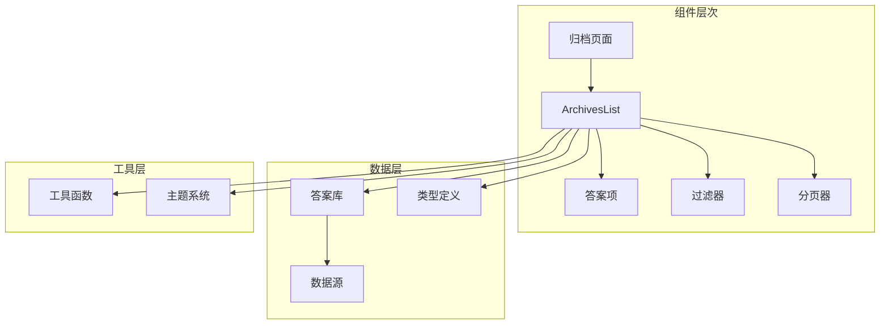

**图表来源**
- [page.tsx:1-67](file://app/games/[gameSlug]/archives/page.tsx#L1-L67)
- [answers.ts:1-42](file://lib/answers.ts#L1-L42)

**章节来源**
- [page.tsx:1-67](file://app/games/[gameSlug]/archives/page.tsx#L1-L67)
- [answers.ts:1-42](file://lib/answers.ts#L1-L42)

## 性能考虑

### 当前实现的性能特点

1. **内存效率**：组件直接接收预排序的数据，避免重复计算
2. **渲染优化**：使用 React 的 key 属性确保列表项的稳定更新
3. **样式优化**：采用 Tailwind CSS 的原子化类名，减少样式计算开销
4. **状态优化**：使用 useMemo 优化过滤和分页计算
5. **交互优化**：防抖处理过滤器变化，避免频繁重渲染

### 潜在优化机会

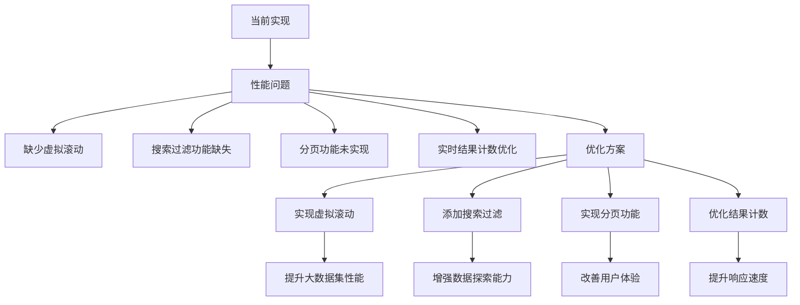

## 故障排除指南

### 常见问题及解决方案

| 问题类型 | 症状 | 可能原因 | 解决方案 |
|----------|------|----------|----------|
| 数据显示异常 | 答案顺序错误 | 排序逻辑问题 | 检查 date 字段格式和排序函数 |
| 过滤器不工作 | 月份过滤无效 | 状态管理问题 | 验证 selectedMonth 状态更新 |
| 分页异常 | 加载更多按钮不显示 | hasMore 计算错误 | 检查 visibleCount 和 filteredAnswers.length |
| 样式不正确 | 组件显示异常 | CSS 类名冲突 | 验证 Tailwind 配置和类名 |
| 性能问题 | 页面加载缓慢 | 大数据集渲染 | 考虑实现虚拟滚动或分页 |
| 交互失效 | 点击无响应 | 链接或事件绑定问题 | 检查 href 和事件处理器 |

### 错误处理最佳实践

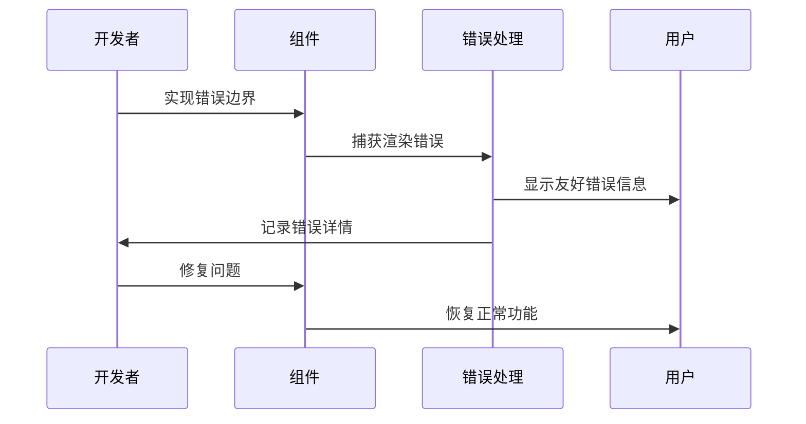

**章节来源**
- [ArchivesList.tsx:73-79](file://components/games/ArchivesList.tsx#L73-L79)

## 结论

ArchivesList 组件经过重大功能增强，现已升级为完整的交互式档案浏览系统，具有以下优势：

1. **智能化过滤**：支持按月份精确筛选历史记录
2. **高效分页**：每页10条记录，提升大数据集浏览体验
3. **实时反馈**：动态结果显示过滤后的结果数量
4. **优雅降级**：空状态处理和错误恢复机制
5. **性能优化**：状态管理和渲染优化策略
6. **用户体验**：直观的交互设计和响应式布局
7. **响应式设计**：移动端和桌面端的适配优化

组件的设计充分考虑了现代 Web 应用的需求，为用户提供了一个强大而易用的历史记录浏览工具。建议的进一步优化方向包括实现虚拟滚动和搜索过滤功能，以进一步提升性能和用户体验。

## 附录

### 组件使用示例

#### 基本用法
```typescript
// 在游戏归档页面中使用
<ArchivesList 
  answers={gameAnswers} 
  gameSlug={gameSlug} 
/>
```

#### 自定义样式
```typescript
// 通过 props 传入自定义样式
<ArchivesList 
  answers={answers} 
  gameSlug={gameSlug}
  className="custom-styles"
/>
```

#### 扩展功能
```typescript
// 添加搜索过滤功能
const filteredAnswers = answers.filter(answer => 
  answer.answer.toLowerCase().includes(searchTerm)
);

<ArchivesList 
  answers={filteredAnswers} 
  gameSlug={gameSlug}
/>
```

### 数据源扩展

要支持新的历史数据源，需要：

1. **添加数据文件**：在 `data/answers/` 目录下创建新的数据文件
2. **更新映射**：在 `lib/answers.ts` 中添加新的映射关系
3. **类型定义**：确保新的数据符合 GameAnswer 接口规范
4. **页面集成**：在相应的游戏页面中集成新数据源

### 性能优化建议

```typescript
// 使用 useMemo 优化昂贵的计算
const expensiveCalculation = useMemo(() => {
  return computeExpensiveValue(a, b);
}, [a, b]);

// 使用 useCallback 优化回调函数
const handleClick = useCallback((id) => {
  console.log(id);
}, []);

// 使用 React.lazy 实现代码分割
const LazyComponent = React.lazy(() => import('./LazyComponent'));
```

**章节来源**
- [ArchivesList.tsx:1-166](file://components/games/ArchivesList.tsx#L1-L166)
- [answers.ts:1-42](file://lib/answers.ts#L1-L42)