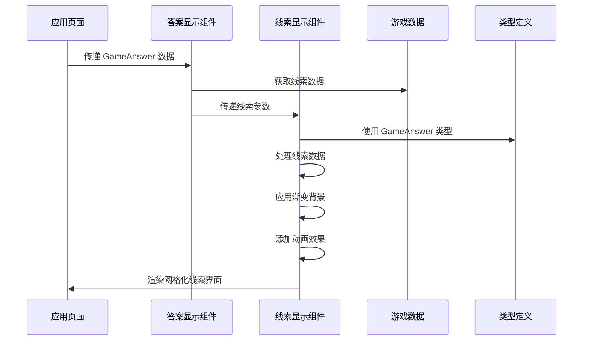
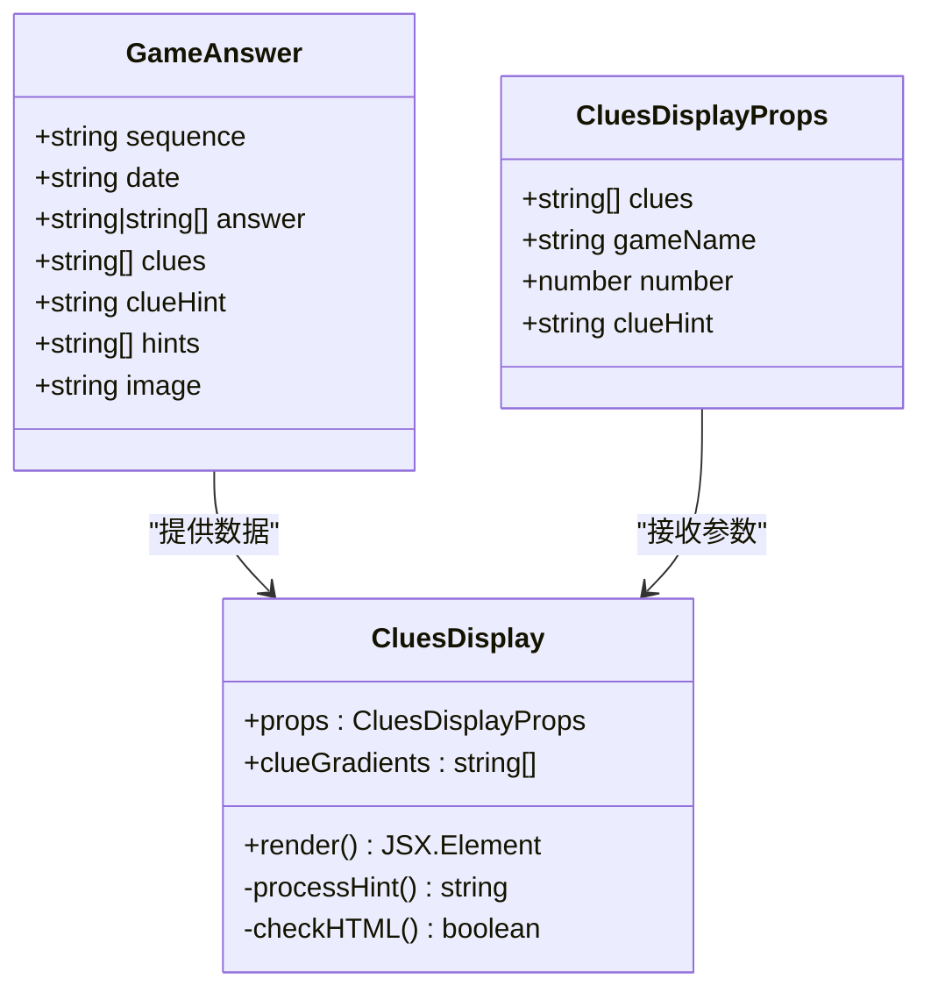
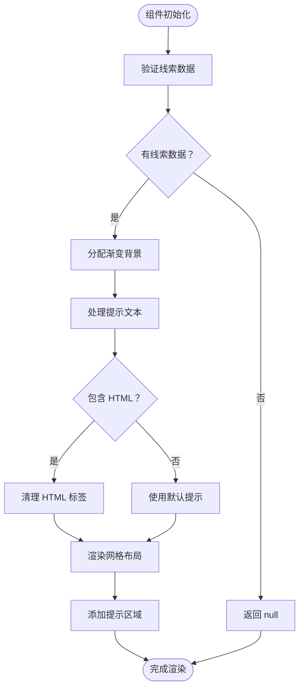
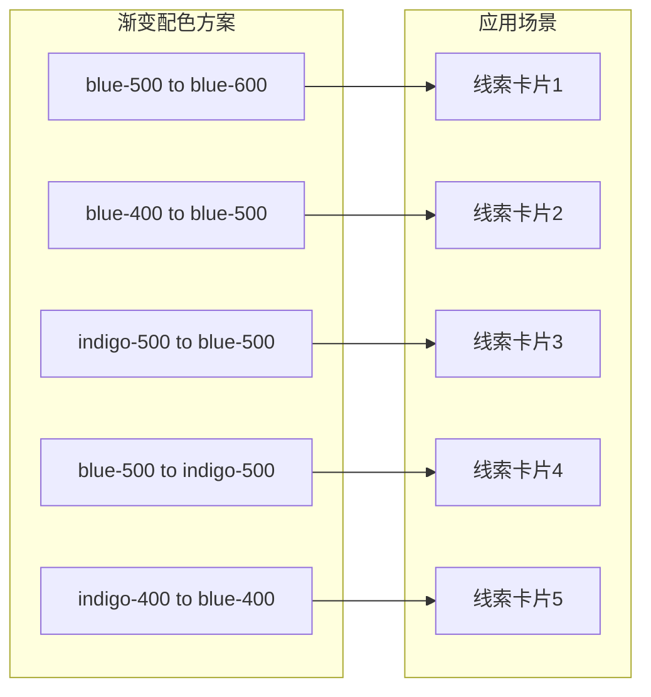
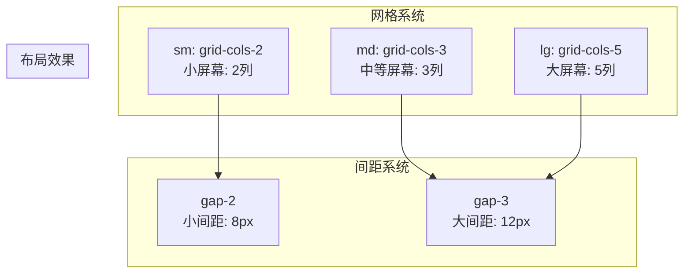
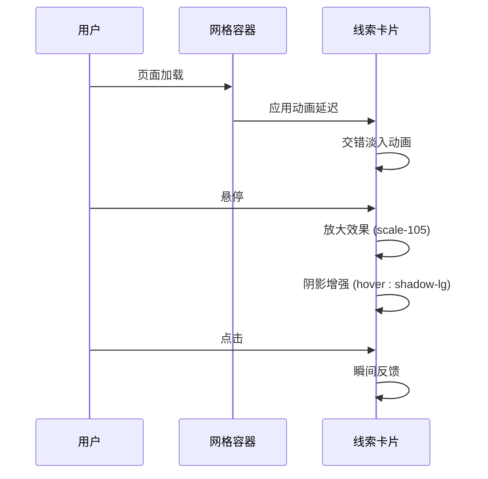
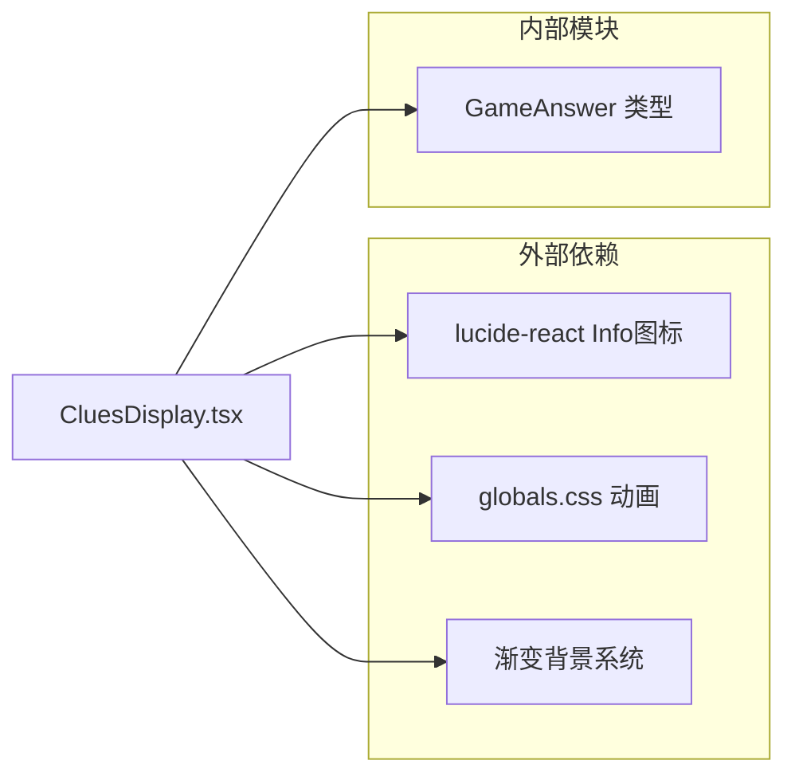

# CluesDisplay 线索显示组件

<cite>
**本文档引用的文件**
- [CluesDisplay.tsx](file://components/games/CluesDisplay.tsx)
- [AnswerDisplay.tsx](file://components/games/AnswerDisplay.tsx)
- [game.ts](file://types/game.ts)
- [pinpoint.ts](file://data/answers/pinpoint.ts)
- [queens.ts](file://data/answers/queens.ts)
- [page.tsx](file://app/games/pinpoint/[date]/page.tsx)
- [page.tsx](file://app/games/queens/[date]/page.tsx)
- [globals.css](file://styles/globals.css)
</cite>

## 更新摘要
**变更内容**
- 更新了视觉设计部分，反映从水平布局迁移到响应式5列网格系统的重大视觉转换
- 增强了渐变背景和蓝色/靛青色调配色方案的详细说明
- 更新了动画效果和交互设计章节以体现新的视觉层次
- 重新设计了响应式布局实现，优化了跨设备适配性

## 目录
1. [简介](#简介)
2. [项目结构](#项目结构)
3. [核心组件](#核心组件)
4. [架构概览](#架构概览)
5. [详细组件分析](#详细组件分析)
6. [视觉设计系统](#视觉设计系统)
7. [依赖关系分析](#依赖关系分析)
8. [性能考虑](#性能考虑)
9. [故障排除指南](#故障排除指南)
10. [结论](#结论)
11. [附录](#附录)

## 简介

CluesDisplay 是一个专门用于展示游戏线索信息的 React 组件，主要服务于 LinkedIn Answer 游戏平台中的线索显示需求。该组件负责管理、解析和展示各种游戏的线索信息，包括线索数据的格式化处理、层级显示和用户交互设计。

**重大更新** 组件已从传统的水平布局迁移至现代化的响应式5列网格系统，每个线索元素都配备了精心策划的渐变背景和蓝色/靛青色调配色方案，为用户提供更加丰富和直观的视觉体验。

该组件支持多种游戏类型的线索展示，包括 Pinpoint 游戏的词汇线索和 Queens 游戏的解谜线索。通过响应式网格布局、渐变背景和流畅的动画效果，为用户提供清晰、美观且具有层次感的线索浏览体验。

## 项目结构

CluesDisplay 组件在项目中的位置和组织方式如下：

```mermaid
graph TB
subgraph "组件层"
CD[CluesDisplay.tsx]
AD[AnswerDisplay.tsx]
AR[AnswerReveal.tsx]
end
subgraph "数据层"
GA[GameAnswer 类型]
PA[pinpoint.ts 数据]
QA[queens.ts 数据]
end
subgraph "应用层"
PDP[pinpoint/[date]/page.tsx]
QDP[queens/[date]/page.tsx]
end
subgraph "样式层"
GC[globals.css 动画]
GD[渐变背景系统]
end
PDP --> AD
QDP --> AD
AD --> CD
CD --> GA
PA --> PDP
QA --> QDP
GC --> CD
GD --> CD
```

**图表来源**
- [CluesDisplay.tsx:1-80](file://components/games/CluesDisplay.tsx#L1-L80)
- [AnswerDisplay.tsx:1-65](file://components/games/AnswerDisplay.tsx#L1-L65)
- [pinpoint.ts:1-200](file://data/answers/pinpoint.ts#L1-L200)
- [queens.ts:1-59](file://data/answers/queens.ts#L1-L59)

**章节来源**
- [CluesDisplay.tsx:1-80](file://components/games/CluesDisplay.tsx#L1-L80)
- [AnswerDisplay.tsx:1-65](file://components/games/AnswerDisplay.tsx#L1-L65)

## 核心组件

### CluesDisplay 组件

CluesDisplay 是一个客户端组件，专门负责线索信息的展示。其核心功能包括：

- **响应式网格布局**：采用5列网格系统，支持从2列到5列的自适应布局
- **渐变背景系统**：为每个线索元素提供独特的蓝色和靛青色调渐变背景
- **动画效果**：使用交错淡入动画，增强视觉层次和用户体验
- **智能空值处理**：当线索数组为空时自动返回 null，避免渲染无意义内容
- **HTML 安全处理**：对传入的提示文本进行安全的 HTML 格式化

### 关键特性

1. **多列网格布局**：使用 `grid grid-cols-2 sm:grid-cols-3 lg:grid-cols-5` 实现响应式布局
2. **渐变色彩方案**：包含5种不同的蓝色和靛青色调渐变组合
3. **悬停交互效果**：鼠标悬停时线索卡片放大和阴影增强
4. **动画序列**：每个线索元素有不同的动画延迟，创造流畅的入场效果
5. **深色模式支持**：完整的深色模式适配和色彩调整

**章节来源**
- [CluesDisplay.tsx:12-19](file://components/games/CluesDisplay.tsx#L12-L19)
- [CluesDisplay.tsx:47-52](file://components/games/CluesDisplay.tsx#L47-L52)

## 架构概览

CluesDisplay 在整个应用架构中的位置和交互关系如下：



**图表来源**
- [AnswerDisplay.tsx:59-61](file://components/games/AnswerDisplay.tsx#L59-L61)
- [CluesDisplay.tsx:12-19](file://components/games/CluesDisplay.tsx#L12-L19)
- [game.ts:5-13](file://types/game.ts#L5-L13)

**章节来源**
- [AnswerDisplay.tsx:59-61](file://components/games/AnswerDisplay.tsx#L59-L61)
- [page.tsx](file://app/games/pinpoint/[date]/page.tsx#L85)

## 详细组件分析

### 数据结构设计

CluesDisplay 组件基于 GameAnswer 类型定义工作，支持灵活的数据结构：



**图表来源**
- [game.ts:5-13](file://types/game.ts#L5-L13)
- [CluesDisplay.tsx:5-10](file://components/games/CluesDisplay.tsx#L5-L10)

### 显示逻辑分析

组件的核心显示逻辑包括以下步骤：

1. **输入验证**：检查线索数组的有效性
2. **渐变背景分配**：为每个线索元素分配独特的渐变背景
3. **提示处理**：根据传入参数决定提示文本
4. **HTML 格式化**：对包含 HTML 的提示文本进行安全处理
5. **网格渲染**：使用响应式网格系统渲染线索元素

### 视觉层次设计

组件采用了多层次的视觉设计：



**图表来源**
- [CluesDisplay.tsx:12-31](file://components/games/CluesDisplay.tsx#L12-L31)

**章节来源**
- [CluesDisplay.tsx:12-31](file://components/games/CluesDisplay.tsx#L12-L31)

## 视觉设计系统

### 渐变背景配色方案

**重大更新** 组件现在使用精心策划的渐变背景系统，为每个线索元素提供独特的视觉标识：



**渐变配色详情**：
- `from-blue-500 to-blue-600` - 深蓝色渐变
- `from-blue-400 to-blue-500` - 中等蓝色渐变  
- `from-indigo-500 to-blue-500` - 靛青蓝色渐变
- `from-blue-500 to-indigo-500` - 蓝色靛青渐变
- `from-indigo-400 to-blue-400` - 浅靛青蓝色渐变

### 响应式网格布局

**重大更新** 组件采用现代化的响应式网格系统，支持从2列到5列的自适应布局：



**网格断点配置**：
- `grid-cols-2` - 移动设备和小屏幕
- `sm:grid-cols-3` - 平板设备
- `lg:grid-cols-5` - 桌面设备和大屏幕

### 动画和交互设计

**重大更新** 组件集成了流畅的动画效果和交互反馈：



**动画效果**：
- `animate-stagger-fade-in` - 交错淡入动画
- `hover:scale-105` - 悬停放大效果
- `transition-all duration-300` - 平滑过渡动画
- `hover:shadow-lg` - 悬停阴影增强

**章节来源**
- [CluesDisplay.tsx:13-19](file://components/games/CluesDisplay.tsx#L13-L19)
- [CluesDisplay.tsx:47-52](file://components/games/CluesDisplay.tsx#L47-L52)
- [globals.css:148-175](file://styles/globals.css#L148-L175)

## 依赖关系分析

### 内部依赖

CluesDisplay 组件的内部依赖关系如下：



**图表来源**
- [CluesDisplay.tsx](file://components/games/CluesDisplay.tsx#L3)
- [game.ts:5-13](file://types/game.ts#L5-L13)
- [globals.css:19-28](file://styles/globals.css#L19-L28)

### 外部依赖

组件依赖于以下外部库和框架：

- **Lucide React**：提供 Info 图标组件
- **Tailwind CSS**：提供响应式布局和样式系统
- **Next.js**：提供客户端组件支持

### 数据流依赖

```mermaid
graph TB
subgraph "数据源"
PA[pinpoint.ts]
QA[queens.ts]
end
subgraph "组件链"
PDP[pinpoint/[date]/page.tsx]
AD[AnswerDisplay.tsx]
CD[CluesDisplay.tsx]
end
subgraph "类型系统"
GA[GameAnswer 类型]
end
PA --> PDP
QA --> PDP
PDP --> AD
AD --> CD
GA --> CD
```

**图表来源**
- [pinpoint.ts:3-200](file://data/answers/pinpoint.ts#L3-L200)
- [queens.ts:3-59](file://data/answers/queens.ts#L3-L59)
- [page.tsx:52-85](file://app/games/pinpoint/[date]/page.tsx#L52-L85)

**章节来源**
- [pinpoint.ts:3-200](file://data/answers/pinpoint.ts#L3-L200)
- [queens.ts:3-59](file://data/answers/queens.ts#L3-L59)

## 性能考虑

### 渲染优化

CluesDisplay 组件在性能方面采用了多项优化策略：

1. **条件渲染**：当没有线索数据时直接返回 null，避免不必要的 DOM 创建
2. **CSS 动画**：使用硬件加速的 CSS 动画而非 JavaScript 动画
3. **渐变背景**：使用 CSS 渐变而非图片，减少 HTTP 请求
4. **响应式优化**：新的网格布局策略减少了不必要的宽度计算
5. **动画延迟**：交错动画延迟优化了首屏渲染性能

### 内存管理

- **事件监听器**：组件未绑定任何事件监听器，避免内存泄漏
- **状态管理**：纯函数组件设计，无需本地状态管理
- **资源释放**：组件卸载时自动释放所有相关资源

### 加载性能

- **懒加载**：作为客户端组件，按需加载
- **缓存友好**：静态内容适合浏览器缓存
- **体积控制**：组件代码简洁，不引入额外依赖
- **渐进增强**：基础样式在 JavaScript 加载前可用

## 故障排除指南

### 常见问题及解决方案

#### 1. 线索不显示
**症状**：线索卡片完全不显示
**可能原因**：
- clues 数组为空或未正确传递
- 父组件未正确调用 CluesDisplay

**解决方法**：
- 检查父组件传递的 clues 参数
- 确认 GameAnswer 数据结构正确

#### 2. 渐变背景不生效
**症状**：线索卡片显示为纯色而非渐变
**可能原因**：
- Tailwind CSS 渐变类名使用不当
- 颜色变量未正确配置

**解决方法**：
- 检查渐变类名格式 (`from-blue-500 to-blue-600`)
- 验证 Tailwind 配置中的颜色变量

#### 3. 响应式布局问题
**症状**：在移动设备上布局错乱
**可能原因**：
- Tailwind CSS 类名使用不当
- 屏幕尺寸超出预期范围

**解决方法**：
- 检查断点类名的使用 (`sm:`, `lg:`)
- 验证容器的宽度设置

#### 4. 动画效果异常
**症状**：动画不流畅或不显示
**可能原因**：
- CSS 动画关键帧未正确加载
- 动画延迟计算错误

**解决方法**：
- 检查 `animate-stagger-fade-in` 关键帧定义
- 验证动画延迟公式 (`index * 0.1s`)

**章节来源**
- [CluesDisplay.tsx:12-19](file://components/games/CluesDisplay.tsx#L12-L19)
- [CluesDisplay.tsx:25-38](file://components/games/CluesDisplay.tsx#L25-L38)

## 结论

CluesDisplay 组件是一个设计精良的游戏线索展示组件，经过重大视觉升级后，具有以下突出特点：

1. **现代化网格布局**：从传统水平布局迁移到响应式5列网格系统
2. **渐变色彩系统**：精心策划的蓝色和靛青色调配色方案
3. **动画增强体验**：交错淡入动画和流畅的交互反馈
4. **模块化设计**：独立的功能模块，易于维护和扩展
5. **类型安全**：基于严格的 TypeScript 类型定义
6. **响应式设计**：适应各种设备和屏幕尺寸
7. **性能优化**：高效的渲染和内存管理

**重大更新** 组件经过全面的视觉转换，从简单的水平布局发展为现代化的网格系统，每个线索元素都配备了独特的渐变背景和动画效果，显著提升了用户的视觉体验和交互质量。

该组件成功地解决了游戏线索展示的核心需求，为用户提供了清晰、美观且具有层次感的线索浏览体验。通过合理的设计模式和最佳实践，确保了组件的可维护性和可扩展性。

## 附录

### 组件使用示例

#### 基本使用
```typescript
// 在 AnswerDisplay 中使用
{answer.clues && answer.clues.length > 0 && (
  <CluesDisplay 
    clues={answer.clues} 
    gameName={gameName} 
    clueHint={answer.clueHint} 
  />
)}
```

#### 自定义样式
```typescript
// 通过外部容器自定义样式
<div className="custom-clues-container">
  <CluesDisplay clues={clues} gameName={gameName} />
</div>
```

### 扩展建议

1. **交互功能**：可以添加点击展开详情的功能
2. **过滤功能**：支持按线索类型或难度过滤
3. **搜索功能**：添加线索内容的搜索能力
4. **分享功能**：允许用户分享特定的线索组合
5. **主题切换**：支持更多色彩主题的选择

### 最佳实践

1. **数据验证**：始终验证传入的数据有效性
2. **错误处理**：为异常情况提供优雅的降级方案
3. **性能监控**：定期检查组件的渲染性能
4. **测试覆盖**：编写充分的单元测试和集成测试
5. **无障碍支持**：确保组件对屏幕阅读器友好

**重大更新** 在使用组件时，建议充分利用其响应式网格布局和渐变背景系统，在不同设备上都能提供优秀的视觉体验。