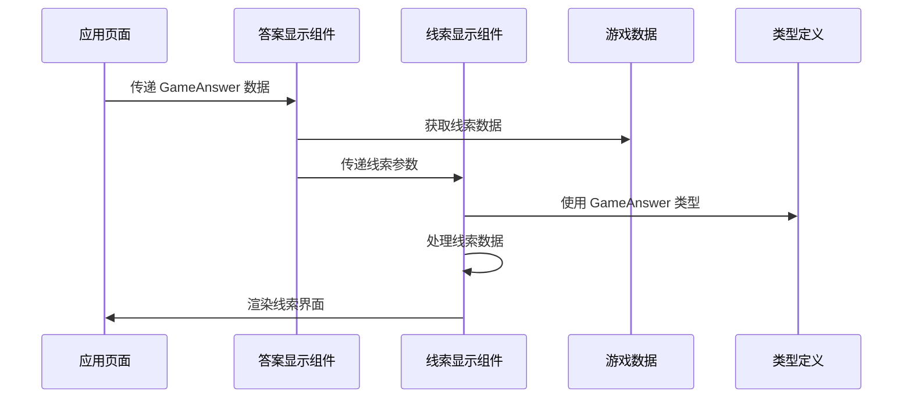
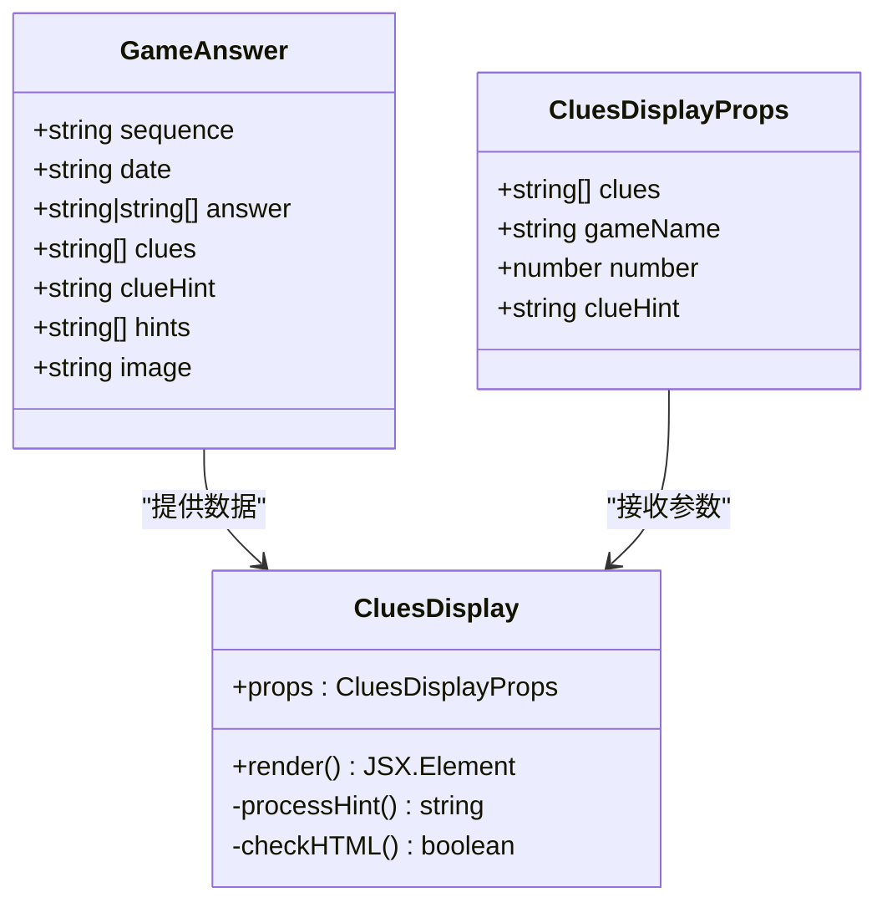
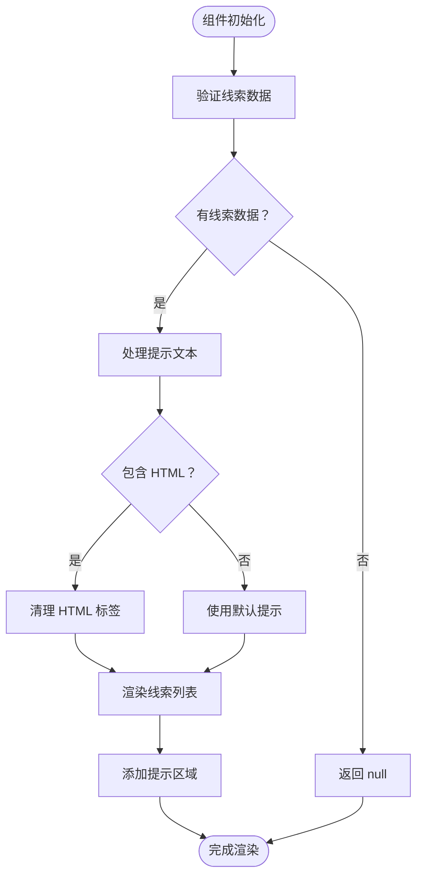
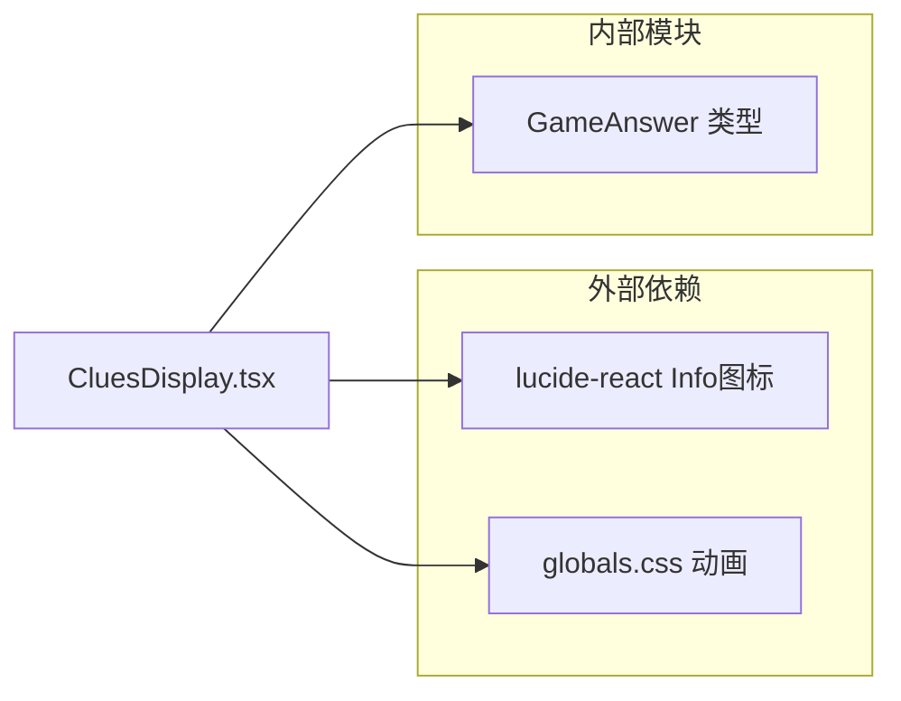

# CluesDisplay 线索显示组件

<cite>
**本文档引用的文件**
- [CluesDisplay.tsx](file://components/games/CluesDisplay.tsx)
- [AnswerDisplay.tsx](file://components/games/AnswerDisplay.tsx)
- [game.ts](file://types/game.ts)
- [pinpoint.ts](file://data/answers/pinpoint.ts)
- [queens.ts](file://data/answers/queens.ts)
- [page.tsx](file://app/games/pinpoint/[date]/page.tsx)
- [page.tsx](file://app/games/queens/[date]/page.tsx)
- [globals.css](file://styles/globals.css)
</cite>

## 更新摘要
**变更内容**
- 更新了响应式设计部分，反映移除宽度限制后的样式优化
- 增强了跨设备适配性的说明
- 更新了视觉层次设计章节以体现新的布局行为

## 目录
1. [简介](#简介)
2. [项目结构](#项目结构)
3. [核心组件](#核心组件)
4. [架构概览](#架构概览)
5. [详细组件分析](#详细组件分析)
6. [依赖关系分析](#依赖关系分析)
7. [性能考虑](#性能考虑)
8. [故障排除指南](#故障排除指南)
9. [结论](#结论)
10. [附录](#附录)

## 简介

CluesDisplay 是一个专门用于展示游戏线索信息的 React 组件，主要服务于 LinkedIn Answer 游戏平台中的线索显示需求。该组件负责管理、解析和展示各种游戏的线索信息，包括线索数据的格式化处理、层级显示和用户交互设计。

该组件支持多种游戏类型的线索展示，包括 Pinpoint 游戏的词汇线索和 Queens 游戏的解谜线索。通过精心设计的视觉层次和响应式布局，为用户提供清晰、直观的线索浏览体验。

**更新** 组件经过样式优化后，移除了固定的宽度限制，增强了在移动设备和小屏幕上的跨设备适配能力，同时保持了原有的视觉效果和交互功能。

## 项目结构

CluesDisplay 组件在项目中的位置和组织方式如下：

```mermaid
graph TB
subgraph "组件层"
CD[CluesDisplay.tsx]
AD[AnswerDisplay.tsx]
AR[AnswerReveal.tsx]
end
subgraph "数据层"
GA[GameAnswer 类型]
PA[pinpoint.ts 数据]
QA[queens.ts 数据]
end
subgraph "应用层"
PDP[pinpoint/[date]/page.tsx]
QDP[queens/[date]/page.tsx]
end
subgraph "样式层"
GC[globals.css 动画]
end
PDP --> AD
QDP --> AD
AD --> CD
CD --> GA
PA --> PDP
QA --> QDP
GC --> CD
```

**图表来源**
- [CluesDisplay.tsx](file://components/games/CluesDisplay.tsx#L1-L74)
- [AnswerDisplay.tsx](file://components/games/AnswerDisplay.tsx#L1-L65)
- [pinpoint.ts](file://data/answers/pinpoint.ts#L1-L139)
- [queens.ts](file://data/answers/queens.ts#L1-L59)

**章节来源**
- [CluesDisplay.tsx](file://components/games/CluesDisplay.tsx#L1-L74)
- [AnswerDisplay.tsx](file://components/games/AnswerDisplay.tsx#L1-L65)

## 核心组件

### CluesDisplay 组件

CluesDisplay 是一个客户端组件，专门负责线索信息的展示。其核心功能包括：

- **线索数据管理**：接收线索数组并进行格式化处理
- **动态提示系统**：支持可配置的提示文字，包含 HTML 格式化能力
- **视觉层次设计**：通过渐变背景和阴影效果创造层次感
- **响应式布局**：适配不同屏幕尺寸的设备，现已优化跨设备适配性

### 关键特性

1. **智能空值处理**：当线索数组为空时自动返回 null，避免渲染无意义内容
2. **HTML 安全处理**：对传入的提示文本进行安全的 HTML 格式化
3. **动画效果**：为每个线索元素添加淡入动画，增强用户体验
4. **交互反馈**：提供悬停和点击的视觉反馈效果

**更新** 组件现在采用更灵活的布局策略，移除了固定宽度限制，使线索卡片能够更好地适应不同屏幕尺寸。

**章节来源**
- [CluesDisplay.tsx](file://components/games/CluesDisplay.tsx#L5-L10)
- [CluesDisplay.tsx](file://components/games/CluesDisplay.tsx#L12-L15)

## 架构概览

CluesDisplay 在整个应用架构中的位置和交互关系如下：



**图表来源**
- [AnswerDisplay.tsx](file://components/games/AnswerDisplay.tsx#L59-L61)
- [CluesDisplay.tsx](file://components/games/CluesDisplay.tsx#L12-L15)
- [game.ts](file://types/game.ts#L5-L13)

**章节来源**
- [AnswerDisplay.tsx](file://components/games/AnswerDisplay.tsx#L59-L61)
- [page.tsx](file://app/games/pinpoint/[date]/page.tsx#L85)

## 详细组件分析

### 数据结构设计

CluesDisplay 组件基于 GameAnswer 类型定义工作，支持灵活的数据结构：



**图表来源**
- [game.ts](file://types/game.ts#L5-L13)
- [CluesDisplay.tsx](file://components/games/CluesDisplay.tsx#L5-L10)

### 显示逻辑分析

组件的核心显示逻辑包括以下步骤：

1. **输入验证**：检查线索数组的有效性
2. **提示处理**：根据传入参数决定提示文本
3. **HTML 格式化**：对包含 HTML 的提示文本进行安全处理
4. **线索渲染**：为每个线索创建独立的显示单元

### 视觉层次设计

组件采用了多层次的视觉设计：



**图表来源**
- [CluesDisplay.tsx](file://components/games/CluesDisplay.tsx#L12-L31)

**章节来源**
- [CluesDisplay.tsx](file://components/games/CluesDisplay.tsx#L12-L31)

### 响应式布局实现

**更新** 组件通过 Tailwind CSS 实现了优化的响应式设计：

- **移动端优先**：基础样式适用于小屏幕设备
- **断点适配**：使用 sm、md 等断点类名适配不同屏幕尺寸
- **弹性布局**：使用 flex-wrap 实现线索卡片的自动换行
- **灵活宽度**：移除了固定的 min-w-[100px] 和 max-w-[200px] 宽度限制，采用 flex-1 实现更好的跨设备适配
- **尺寸调整**：根据屏幕大小调整卡片间距和字体大小

**更新** 新的布局策略使组件在移动设备上表现更加出色，线索卡片能够根据内容长度和屏幕宽度自动调整，提供更佳的用户体验。

### 用户交互设计

组件提供了丰富的用户交互反馈：

- **悬停效果**：鼠标悬停时线索卡片放大和阴影增强
- **点击反馈**：提供清晰的点击状态指示
- **动画过渡**：流畅的动画效果提升用户体验
- **无障碍支持**：使用语义化的 HTML 结构

**章节来源**
- [CluesDisplay.tsx](file://components/games/CluesDisplay.tsx#L43-L46)

## 依赖关系分析

### 内部依赖

CluesDisplay 组件的内部依赖关系如下：



**图表来源**
- [CluesDisplay.tsx](file://components/games/CluesDisplay.tsx#L3)
- [game.ts](file://types/game.ts#L5-L13)
- [globals.css](file://styles/globals.css#L19-L28)

### 外部依赖

组件依赖于以下外部库和框架：

- **Lucide React**：提供 Info 图标组件
- **Tailwind CSS**：提供响应式布局和样式系统
- **Next.js**：提供客户端组件支持

### 数据流依赖

```mermaid
graph TB
subgraph "数据源"
PA[pinpoint.ts]
QA[queens.ts]
end
subgraph "组件链"
PDP[pinpoint/[date]/page.tsx]
AD[AnswerDisplay.tsx]
CD[CluesDisplay.tsx]
end
subgraph "类型系统"
GA[GameAnswer 类型]
end
PA --> PDP
QA --> PDP
PDP --> AD
AD --> CD
GA --> CD
```

**图表来源**
- [pinpoint.ts](file://data/answers/pinpoint.ts#L3-L139)
- [queens.ts](file://data/answers/queens.ts#L3-L59)
- [page.tsx](file://app/games/pinpoint/[date]/page.tsx#L52-L85)

**章节来源**
- [pinpoint.ts](file://data/answers/pinpoint.ts#L3-L139)
- [queens.ts](file://data/answers/queens.ts#L3-L59)

## 性能考虑

### 渲染优化

CluesDisplay 组件在性能方面采用了多项优化策略：

1. **条件渲染**：当没有线索数据时直接返回 null，避免不必要的 DOM 创建
2. **CSS 动画**：使用硬件加速的 CSS 动画而非 JavaScript 动画
3. **最小化重排**：通过合理的样式组合减少布局重计算
4. **响应式优化**：新的布局策略减少了不必要的宽度计算

### 内存管理

- **事件监听器**：组件未绑定任何事件监听器，避免内存泄漏
- **状态管理**：纯函数组件设计，无需本地状态管理
- **资源释放**：组件卸载时自动释放所有相关资源

### 加载性能

- **懒加载**：作为客户端组件，按需加载
- **缓存友好**：静态内容适合浏览器缓存
- **体积控制**：组件代码简洁，不引入额外依赖

## 故障排除指南

### 常见问题及解决方案

#### 1. 线索不显示
**症状**：线索卡片完全不显示
**可能原因**：
- clues 数组为空或未正确传递
- 父组件未正确调用 CluesDisplay

**解决方法**：
- 检查父组件传递的 clues 参数
- 确认 GameAnswer 数据结构正确

#### 2. 提示文本格式错误
**症状**：提示文本显示原始 HTML 标签
**可能原因**：
- clueHint 参数未正确设置
- HTML 标签格式不规范

**解决方法**：
- 确保 clueHint 包含正确的 HTML 格式
- 检查 HTML 标签的闭合和嵌套

#### 3. 响应式布局问题
**症状**：在移动设备上布局错乱
**可能原因**：
- Tailwind CSS 类名使用不当
- 屏幕尺寸超出预期范围

**解决方法**：
- 检查断点类名的使用
- 验证容器的宽度设置

**更新** 如果遇到线索卡片宽度异常的问题，检查是否正确使用了 flex-1 类而不是固定宽度限制。

**章节来源**
- [CluesDisplay.tsx](file://components/games/CluesDisplay.tsx#L12-L15)
- [CluesDisplay.tsx](file://components/games/CluesDisplay.tsx#L20-L30)

## 结论

CluesDisplay 组件是一个设计精良的游戏线索展示组件，具有以下突出特点：

1. **模块化设计**：独立的功能模块，易于维护和扩展
2. **类型安全**：基于严格的 TypeScript 类型定义
3. **响应式布局**：适应各种设备和屏幕尺寸，现已优化跨设备适配性
4. **用户体验**：提供流畅的动画效果和交互反馈
5. **性能优化**：高效的渲染和内存管理

**更新** 组件经过样式优化后，移除了固定的宽度限制，显著改善了在移动设备和小屏幕上的表现，同时保持了原有的视觉效果和交互功能。

该组件成功地解决了游戏线索展示的核心需求，为用户提供了清晰、直观的线索浏览体验。通过合理的设计模式和最佳实践，确保了组件的可维护性和可扩展性。

## 附录

### 组件使用示例

#### 基本使用
```typescript
// 在 AnswerDisplay 中使用
{answer.clues && answer.clues.length > 0 && (
  <CluesDisplay 
    clues={answer.clues} 
    gameName={gameName} 
    clueHint={answer.clueHint} 
  />
)}
```

#### 自定义样式
```typescript
// 通过外部容器自定义样式
<div className="custom-clues-container">
  <CluesDisplay clues={clues} gameName={gameName} />
</div>
```

### 扩展建议

1. **交互功能**：可以添加点击展开详情的功能
2. **过滤功能**：支持按线索类型或难度过滤
3. **搜索功能**：添加线索内容的搜索能力
4. **分享功能**：允许用户分享特定的线索组合

### 最佳实践

1. **数据验证**：始终验证传入的数据有效性
2. **错误处理**：为异常情况提供优雅的降级方案
3. **性能监控**：定期检查组件的渲染性能
4. **测试覆盖**：编写充分的单元测试和集成测试

**更新** 在使用组件时，建议关注其响应式特性的改进，特别是在小屏幕设备上的表现。