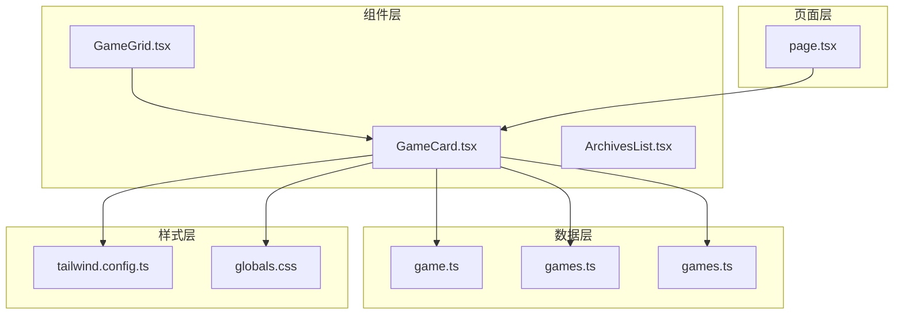
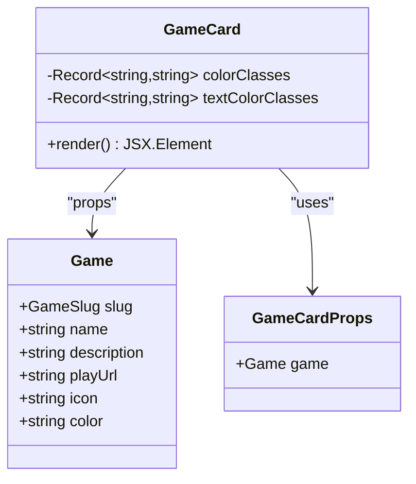
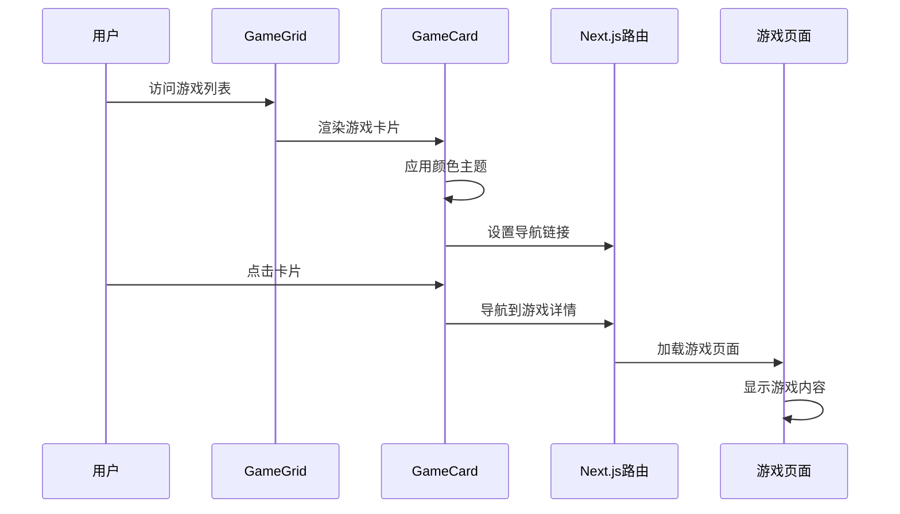
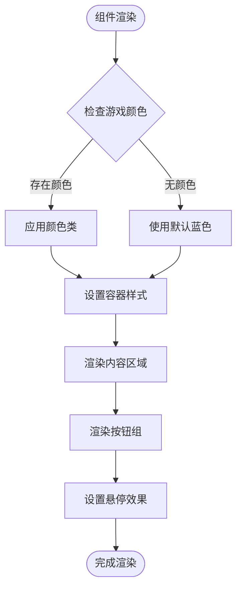
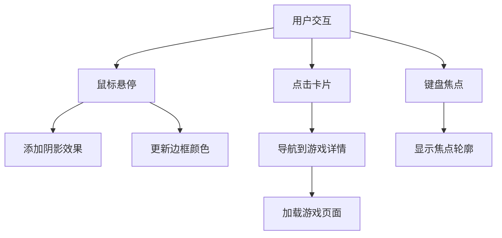
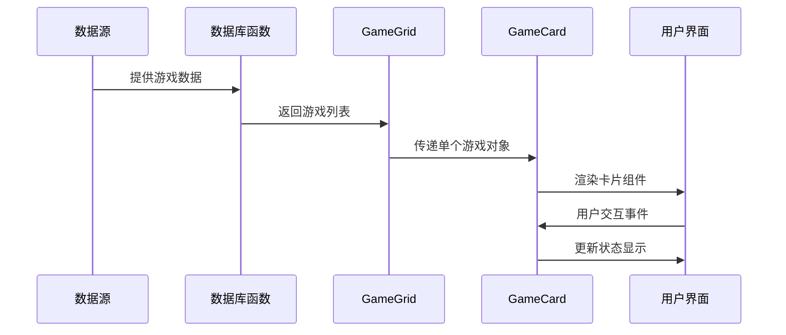

# GameCard 游戏卡片组件

<cite>
**本文档引用的文件**
- [GameCard.tsx](file://components/games/GameCard.tsx)
- [GameGrid.tsx](file://components/games/GameGrid.tsx)
- [game.ts](file://types/game.ts)
- [games.ts](file://data/games.ts)
- [games.ts](file://lib/games.ts)
- [page.tsx](file://app/games/[gameSlug]/page.tsx)
- [ArchivesList.tsx](file://components/games/ArchivesList.tsx)
- [tailwind.config.ts](file://tailwind.config.ts)
- [globals.css](file://styles/globals.css)
</cite>

## 目录
1. [简介](#简介)
2. [项目结构](#项目结构)
3. [核心组件](#核心组件)
4. [架构概览](#架构概览)
5. [详细组件分析](#详细组件分析)
6. [依赖关系分析](#依赖关系分析)
7. [性能考虑](#性能考虑)
8. [故障排除指南](#故障排除指南)
9. [结论](#结论)
10. [附录](#附录)

## 简介

GameCard 是一个专门用于展示游戏信息的 React 组件，作为游戏网格中的单个游戏入口。该组件实现了完整的用户界面展示，包括游戏标题、描述、图片处理、行动按钮和状态指示。组件采用现代化的设计理念，支持响应式布局、深色模式切换、悬停效果和无障碍访问。

该组件的核心功能包括：
- 游戏信息的完整展示（名称、描述、颜色主题）
- 多种交互按钮（今日答案、归档、玩法说明、外部链接）
- 响应式设计和主题适配
- 悬停动画效果和视觉反馈
- 无障碍访问支持

## 项目结构

GameCard 组件在项目中的位置和相关文件组织如下：



**图表来源**
- [GameCard.tsx](file://components/games/GameCard.tsx#L1-L91)
- [GameGrid.tsx](file://components/games/GameGrid.tsx#L1-L15)
- [game.ts](file://types/game.ts#L1-L27)
- [games.ts](file://data/games.ts#L1-L29)

**章节来源**
- [GameCard.tsx](file://components/games/GameCard.tsx#L1-L91)
- [GameGrid.tsx](file://components/games/GameGrid.tsx#L1-L15)
- [game.ts](file://types/game.ts#L1-L27)

## 核心组件

### GameCard 组件架构

GameCard 组件是一个客户端组件，负责渲染单个游戏的卡片视图。组件接收 Game 类型的数据作为 props，并根据游戏的颜色配置动态应用样式。

#### 主要特性

1. **颜色主题系统**：支持 10 种预定义颜色主题（蓝色、紫色、绿色、橙色、粉色、黄色、靛青色、灰色、红色、青色）
2. **响应式设计**：适配移动端到桌面端的不同屏幕尺寸
3. **交互效果**：悬停时的阴影效果和边框变化
4. **图标集成**：使用 Lucide React 图标库提供一致的视觉元素

#### 数据结构

组件基于以下类型定义工作：



**图表来源**
- [game.ts](file://types/game.ts#L15-L22)
- [GameCard.tsx](file://components/games/GameCard.tsx#L6-L8)

**章节来源**
- [GameCard.tsx](file://components/games/GameCard.tsx#L1-L91)
- [game.ts](file://types/game.ts#L15-L22)

## 架构概览

GameCard 组件在整个应用架构中的位置和交互关系：



**图表来源**
- [GameGrid.tsx](file://components/games/GameGrid.tsx#L4-L14)
- [GameCard.tsx](file://components/games/GameCard.tsx#L36-L90)
- [page.tsx](file://app/games/[gameSlug]/page.tsx#L45-L114)

## 详细组件分析

### 组件结构分析

GameCard 组件采用卡片式布局设计，包含以下主要部分：

#### 1. 外观容器
- 使用圆角边框和阴影效果
- 支持深色模式自动切换
- 动态颜色主题应用
- 悬停时的过渡动画效果

#### 2. 内容区域
- 游戏标题显示（支持响应式字体大小）
- 游戏描述文本（限制为 3 行，超出部分省略）
- 颜色主题的文本样式应用

#### 3. 交互按钮组
- **今日答案按钮**：主要行动按钮，使用 Play 图标
- **外部游玩链接**：可选的外部游戏链接
- **归档链接**：导航到历史答案页面
- **玩法说明**：提供游戏规则说明

### 样式系统

组件使用 Tailwind CSS 实现响应式设计和主题适配：



**图表来源**
- [GameCard.tsx](file://components/games/GameCard.tsx#L36-L90)

### 颜色主题系统

组件支持 10 种颜色主题，每种颜色都有对应的背景、边框和文本样式：

| 颜色 | 背景类名 | 边框类名 | 文本类名 |
|------|----------|----------|----------|
| blue | bg-blue-50/dark:bg-blue-950/20 | border-blue-200/dark:border-blue-800 | text-blue-600/dark:text-blue-400 |
| purple | bg-purple-50/dark:bg-purple-950/20 | border-purple-200/dark:border-purple-800 | text-purple-600/dark:text-purple-400 |
| green | bg-green-50/dark:bg-green-950/20 | border-green-200/dark:border-green-800 | text-green-600/dark:text-green-400 |
| orange | bg-orange-50/dark:bg-orange-950/20 | border-orange-200/dark:border-orange-800 | text-orange-600/dark:text-orange-400 |
| pink | bg-pink-50/dark:bg-pink-950/20 | border-pink-200/dark:border-pink-800 | text-pink-600/dark:text-pink-400 |
| yellow | bg-yellow-50/dark:bg-yellow-950/20 | border-yellow-200/dark:border-yellow-800 | text-yellow-600/dark:text-yellow-400 |
| indigo | bg-indigo-50/dark:bg-indigo-950/20 | border-indigo-200/dark:border-indigo-800 | text-indigo-600/dark:text-indigo-400 |
| gray | bg-gray-50/dark:bg-gray-950/20 | border-gray-200/dark:border-gray-800 | text-gray-600/dark:text-gray-400 |
| red | bg-red-50/dark:bg-red-950/20 | border-red-200/dark:border-red-800 | text-red-600/dark:text-red-400 |
| teal | bg-teal-50/dark:bg-teal-950/20 | border-teal-200/dark:border-teal-800 | text-teal-600/dark:text-teal-400 |

**章节来源**
- [GameCard.tsx](file://components/games/GameCard.tsx#L10-L34)

### 交互流程



**图表来源**
- [GameCard.tsx](file://components/games/GameCard.tsx#L40-L43)
- [GameCard.tsx](file://components/games/GameCard.tsx#L54-L86)

### 响应式设计

组件采用移动优先的设计策略，通过 Tailwind CSS 的断点系统实现不同屏幕尺寸的适配：

- **基础样式**：适用于所有屏幕尺寸
- **sm 断点**：小屏设备（≥640px）
- **md 断点**：中等设备（≥768px）
- **lg 断点**：大屏设备（≥1024px）

**章节来源**
- [GameCard.tsx](file://components/games/GameCard.tsx#L40-L90)

## 依赖关系分析

### 组件依赖图

```mermaid
graph TB
subgraph "外部依赖"
LC[lucide-react]
TS[TypeScript]
TW[Tailwind CSS]
end
subgraph "内部模块"
GT[types/game.ts]
GD[data/games.ts]
GL[lib/games.ts]
end
subgraph "组件"
GC[GameCard.tsx]
GG[GameGrid.tsx]
AL[ArchivesList.tsx]
end
subgraph "页面"
GP[app/games/[gameSlug]/page.tsx]
end
GC --> LC
GC --> GT
GC --> GD
GC --> GL
GG --> GC
AL --> GT
GP --> GC
GC --> TW
GC --> TS
```

**图表来源**
- [GameCard.tsx](file://components/games/GameCard.tsx#L3-L4)
- [GameGrid.tsx](file://components/games/GameGrid.tsx#L1-L2)
- [game.ts](file://types/game.ts#L1-L27)

### 数据流分析



**图表来源**
- [games.ts](file://data/games.ts#L22-L28)
- [games.ts](file://lib/games.ts#L4-L10)
- [GameGrid.tsx](file://components/games/GameGrid.tsx#L4-L10)

**章节来源**
- [GameCard.tsx](file://components/games/GameCard.tsx#L1-L91)
- [GameGrid.tsx](file://components/games/GameGrid.tsx#L1-L15)
- [games.ts](file://data/games.ts#L1-L29)

## 性能考虑

### 渲染优化

1. **客户端组件标记**：使用 `"use client"` 指令确保组件在客户端渲染
2. **条件渲染**：外部链接仅在存在时渲染，减少不必要的 DOM 元素
3. **CSS 类缓存**：颜色类映射在组件外部定义，避免重复计算

### 样式优化

1. **原子化 CSS**：使用 Tailwind CSS 的原子化类名，减少自定义 CSS 文件大小
2. **深色模式支持**：利用 CSS 变量和暗色类实现高效的模式切换
3. **过渡动画**：使用硬件加速的 CSS 过渡属性

### 内存管理

1. **无状态设计**：组件保持纯函数式设计，减少内存占用
2. **事件委托**：通过链接的原生行为处理导航，避免额外的事件监听器

## 故障排除指南

### 常见问题及解决方案

#### 1. 颜色主题不生效
**症状**：卡片始终显示默认蓝色
**原因**：游戏对象缺少颜色属性或颜色值不在支持列表中
**解决方案**：确保游戏数据包含有效的颜色值（blue、purple、green、orange、pink、yellow、indigo、gray、red、teal）

#### 2. 外部链接无法打开
**症状**：点击外部链接无反应
**原因**：缺少 playUrl 字段或链接格式不正确
**解决方案**：验证游戏数据中的 playUrl 字段，确保使用完整的 URL

#### 3. 响应式布局异常
**症状**：在某些屏幕尺寸下布局错乱
**原因**：Tailwind CSS 断点配置问题
**解决方案**：检查 tailwind.config.ts 中的断点配置，确保与设计要求一致

#### 4. 深色模式显示异常
**症状**：深色模式下文字难以阅读
**原因**：颜色对比度不足或 CSS 变量未正确应用
**解决方案**：调整颜色主题的深色版本，确保足够的对比度

**章节来源**
- [GameCard.tsx](file://components/games/GameCard.tsx#L36-L90)
- [tailwind.config.ts](file://tailwind.config.ts#L1-L95)

## 结论

GameCard 组件是一个设计精良的游戏展示组件，具有以下优势：

1. **模块化设计**：清晰的职责分离和单一功能原则
2. **可扩展性**：支持多种颜色主题和自定义配置
3. **用户体验**：流畅的交互效果和响应式设计
4. **可维护性**：类型安全的 TypeScript 实现和良好的代码组织

该组件为整个游戏系统的用户界面提供了坚实的基础，通过合理的架构设计和最佳实践，确保了良好的性能表现和用户体验。

## 附录

### 使用示例

#### 基础用法
```typescript
// 在游戏网格中使用
<GameGrid />

// 单独使用游戏卡片
<GameCard game={gameData} />
```

#### 自定义样式
```typescript
// 支持的颜色主题
const customGame = {
  ...baseGame,
  color: "custom-theme" // 将使用默认蓝色主题
}
```

#### 扩展功能
组件支持通过修改游戏数据结构来扩展功能，如添加徽章标识、自定义图标等。

**章节来源**
- [GameGrid.tsx](file://components/games/GameGrid.tsx#L4-L14)
- [games.ts](file://data/games.ts#L3-L20)