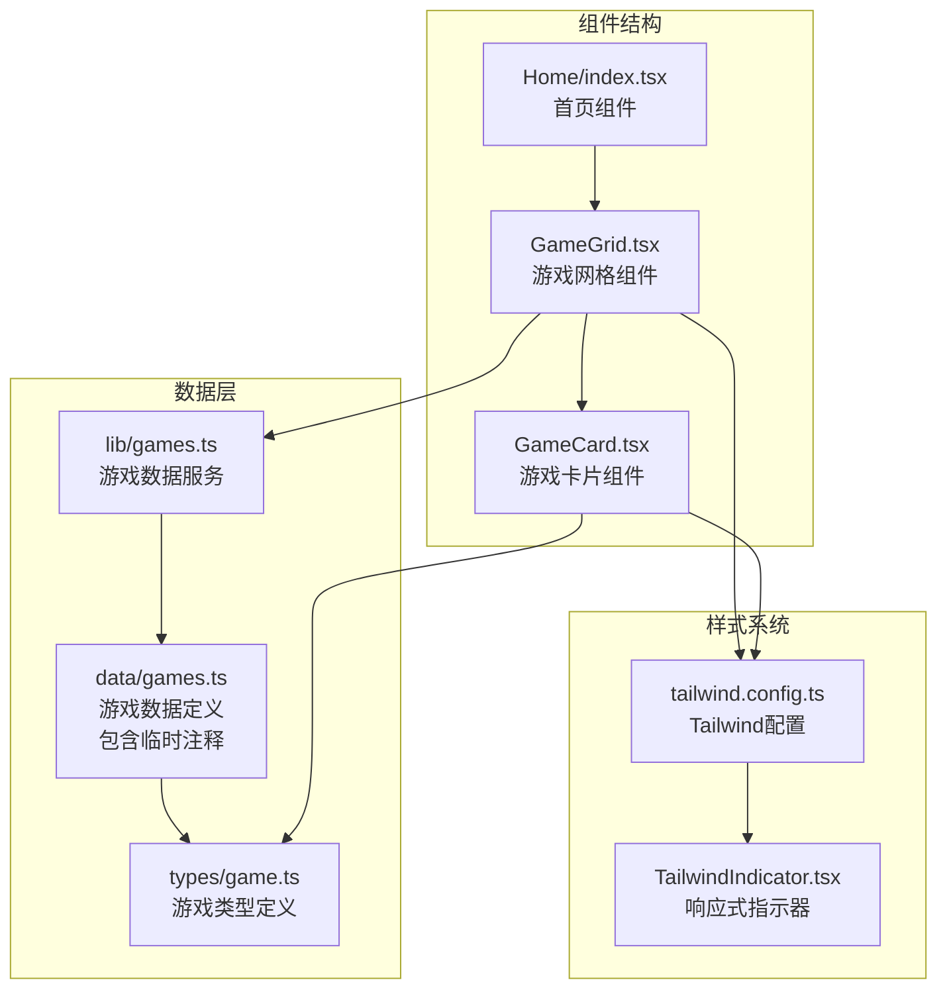
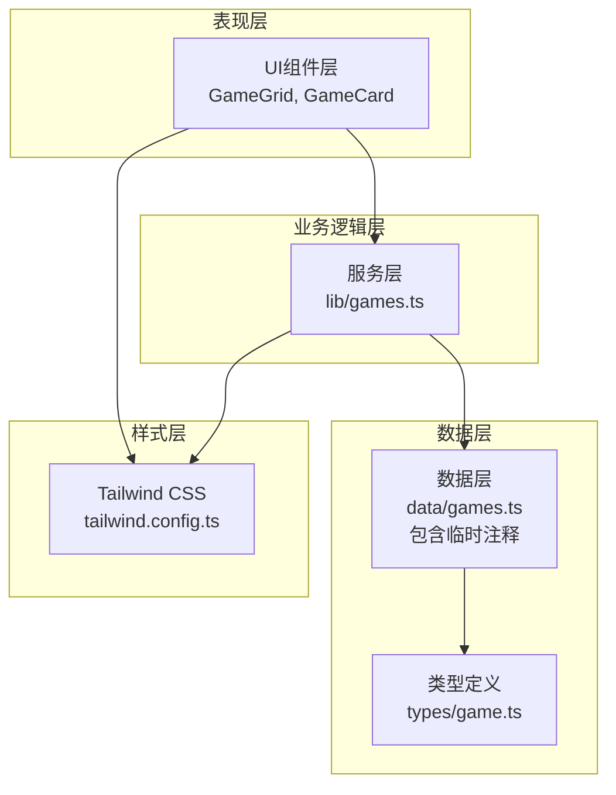
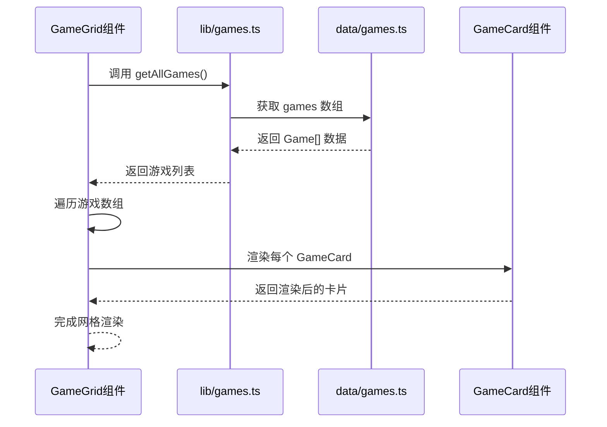
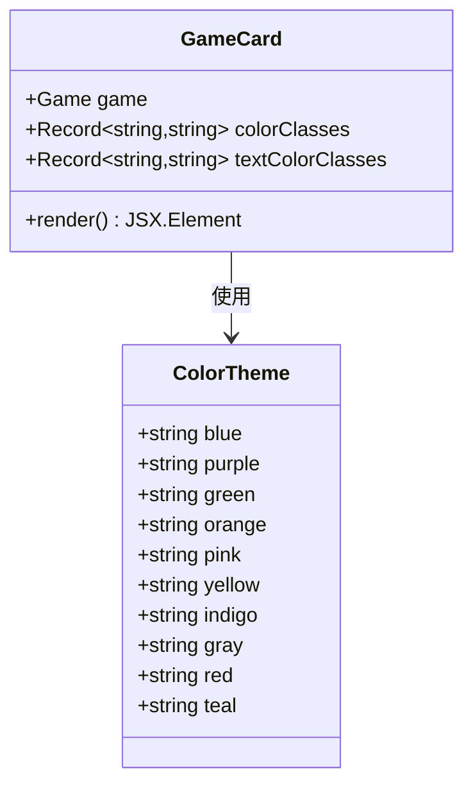
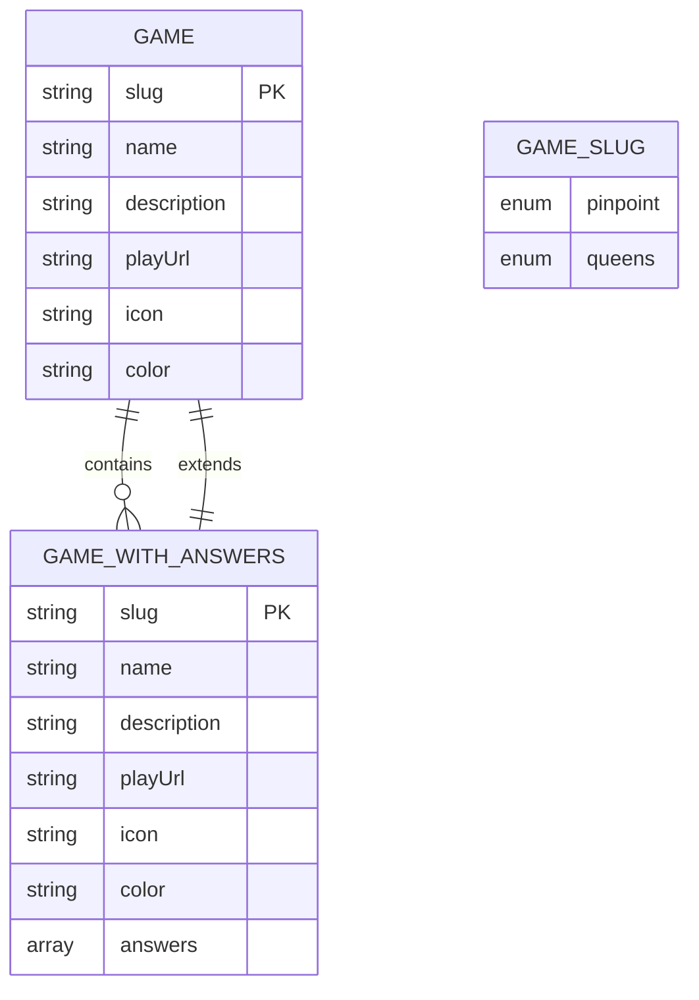
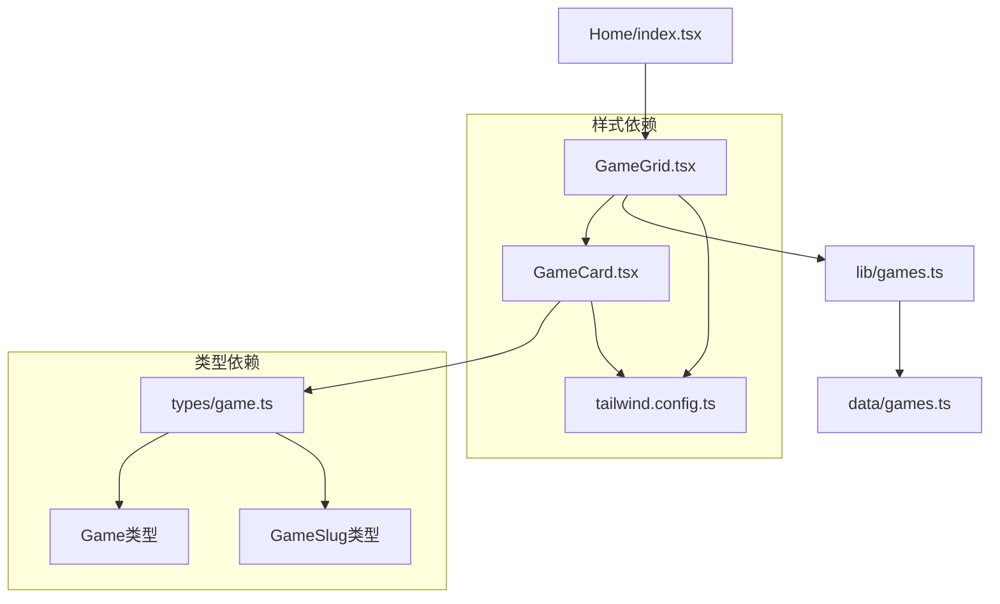

# GameGrid 游戏网格组件

<cite>
**本文档引用的文件**
- [GameGrid.tsx](file://components/games/GameGrid.tsx)
- [GameCard.tsx](file://components/games/GameCard.tsx)
- [games.ts](file://data/games.ts)
- [game.ts](file://types/game.ts)
- [lib/games.ts](file://lib/games.ts)
- [home/index.tsx](file://components/home/index.tsx)
- [tailwind.config.ts](file://tailwind.config.ts)
- [TailwindIndicator.tsx](file://components/TailwindIndicator.tsx)
</cite>

## 更新摘要
**变更内容**
- 更新了 GameGrid 组件在主页中的临时注释状态
- 新增了数据层中 LinkedIn Queens 游戏的临时注释说明
- 更新了组件使用现状和当前实现状态

## 目录
1. [简介](#简介)
2. [项目结构](#项目结构)
3. [核心组件](#核心组件)
4. [架构概览](#架构概览)
5. [详细组件分析](#详细组件分析)
6. [依赖关系分析](#依赖关系分析)
7. [性能考虑](#性能考虑)
8. [故障排除指南](#故障排除指南)
9. [结论](#结论)
10. [附录](#附录)

## 简介

GameGrid 是一个 React 组件，作为游戏入口界面的核心组件，负责从游戏数据源获取所有游戏信息并以网格形式展示。该组件实现了响应式网格布局，支持在不同屏幕尺寸下自动调整列数，并通过 GameCard 子组件展示每个游戏的详细信息。

**重要说明**：当前 GameGrid 组件在主页中处于临时注释状态，仅用于演示目的。实际部署时需要取消注释才能正常使用。

该组件的设计遵循了单一职责原则，专注于数据获取和布局展示，通过组合模式与 GameCard 组件协作，实现了清晰的组件层次结构。

## 项目结构

GameGrid 组件位于组件库的 games 目录中，与相关的游戏组件共同构成了完整的游戏展示系统：



**图表来源**
- [GameGrid.tsx](file://components/games/GameGrid.tsx#L1-L15)
- [GameCard.tsx](file://components/games/GameCard.tsx#L1-L91)
- [home/index.tsx](file://components/home/index.tsx#L1-L36)

**章节来源**
- [GameGrid.tsx](file://components/games/GameGrid.tsx#L1-L15)
- [home/index.tsx](file://components/home/index.tsx#L1-L36)

## 核心组件

### GameGrid 组件

GameGrid 是一个无状态函数组件，主要负责以下功能：

- **数据获取**：通过 `getAllGames()` 函数从数据层获取所有游戏信息
- **布局管理**：使用 Tailwind CSS 实现响应式网格布局
- **子组件渲染**：遍历游戏数组并为每个游戏渲染 GameCard 组件

组件的核心特性包括：
- 响应式网格布局：`grid-cols-1 md:grid-cols-2 lg:grid-cols-3`
- 固定间距：`gap-6`
- 键值管理：使用 `game.slug` 作为 React key

**当前状态**：组件功能完整，但目前在主页中被临时注释，需要取消注释后才能正常显示。

### GameCard 组件

GameCard 是 GameGrid 的子组件，负责展示单个游戏的详细信息：

- **颜色主题系统**：支持多种预定义的颜色主题
- **交互元素**：包含"今日答案"、"归档"、"如何游玩"等导航链接
- **外部链接支持**：可选的在线游玩链接
- **响应式设计**：适配不同屏幕尺寸的显示效果

**章节来源**
- [GameGrid.tsx](file://components/games/GameGrid.tsx#L4-L14)
- [GameCard.tsx](file://components/games/GameCard.tsx#L36-L90)

## 架构概览

GameGrid 组件采用分层架构设计，实现了清晰的关注点分离：



**图表来源**
- [GameGrid.tsx](file://components/games/GameGrid.tsx#L1-L2)
- [lib/games.ts](file://lib/games.ts#L1-L15)
- [data/games.ts](file://data/games.ts#L1-L28)
- [game.ts](file://types/game.ts#L1-L27)

## 详细组件分析

### GameGrid 组件实现分析

#### 数据流处理



**图表来源**
- [GameGrid.tsx](file://components/games/GameGrid.tsx#L4-L14)
- [lib/games.ts](file://lib/games.ts#L4-L6)
- [data/games.ts](file://data/games.ts#L26-L28)

#### 响应式网格布局实现

GameGrid 使用 Tailwind CSS 的响应式断点系统实现自适应布局：

| 断点 | 类名 | 列数 | 屏幕宽度 |
|------|------|------|----------|
| 默认 | `grid-cols-1` | 1列 | 所有设备 |
| 中等设备 | `md:grid-cols-2` | 2列 | ≥768px |
| 大型设备 | `lg:grid-cols-3` | 3列 | ≥1024px |

布局的关键实现：
- 使用 `grid` 布局容器
- 通过 `gap-6` 设置网格间距
- 动态映射游戏数组到 GameCard 组件

**章节来源**
- [GameGrid.tsx](file://components/games/GameGrid.tsx#L8-L12)

### GameCard 组件详细分析

#### 颜色主题系统

GameCard 实现了完整的颜色主题系统，支持 10 种不同的颜色主题：



**图表来源**
- [GameCard.tsx](file://components/games/GameCard.tsx#L10-L34)

#### 交互元素设计

GameCard 包含三个主要的交互元素：

1. **今日答案按钮**：导航到游戏的每日答案页面
2. **外部游玩链接**：可选的在线游玩链接
3. **辅助导航**：归档和如何游玩页面的链接

每个元素都实现了适当的样式和交互效果。

**章节来源**
- [GameCard.tsx](file://components/games/GameCard.tsx#L36-L90)

### 数据模型分析

#### 游戏类型定义

系统使用 TypeScript 定义了完整的数据模型：



**图表来源**
- [game.ts](file://types/game.ts#L1-L27)

#### 游戏数据结构

数据层提供了简洁的数据结构：

- `games`: 静态游戏配置数组（包含临时注释）
- `getGameBySlug()`: 按标识符检索特定游戏
- `getAllGames()`: 获取所有游戏列表

**当前状态**：LinkedIn Queens 游戏在数据层中被临时注释，需要取消注释后才能显示。

**章节来源**
- [game.ts](file://types/game.ts#L15-L22)
- [data/games.ts](file://data/games.ts#L3-L20)

## 依赖关系分析

### 组件依赖图



**图表来源**
- [GameGrid.tsx](file://components/games/GameGrid.tsx#L1-L2)
- [GameCard.tsx](file://components/games/GameCard.tsx#L3-L4)
- [lib/games.ts](file://lib/games.ts#L1-L2)
- [data/games.ts](file://data/games.ts#L1-L1)

### 外部依赖分析

主要外部依赖包括：

- **React**: 组件框架基础
- **Tailwind CSS**: 样式系统和响应式布局
- **Lucide React**: 图标库
- **TypeScript**: 类型安全

这些依赖确保了组件的现代化开发体验和良好的用户体验。

**章节来源**
- [GameCard.tsx](file://components/games/GameCard.tsx#L4-L5)
- [tailwind.config.ts](file://tailwind.config.ts#L1-L95)

## 性能考虑

### 渲染优化策略

1. **键值优化**: 使用 `game.slug` 作为 React key，确保组件更新效率
2. **无状态设计**: GameGrid 采用无状态函数组件，减少内存开销
3. **条件渲染**: GameCard 实现了条件渲染逻辑，避免不必要的 DOM 元素创建

### 样式性能优化

- **原子化 CSS**: Tailwind CSS 提供了高效的样式编译和缓存机制
- **响应式断点**: 合理使用断点减少不必要的样式计算
- **颜色主题复用**: 预定义的颜色主题减少了重复的样式定义

### 数据访问优化

- **单一数据源**: 所有游戏数据集中在一个位置管理
- **函数式接口**: 简洁的 API 接口减少了数据处理的复杂性

## 故障排除指南

### 常见问题及解决方案

#### 游戏数据为空

**症状**: 网格中没有显示任何游戏

**可能原因**:
- 数据文件中的游戏数组为空
- 数据导入路径错误
- 游戏数据被临时注释

**解决方法**:
1. 检查 `data/games.ts` 文件中的 `games` 数组
2. 确认数据文件的导出语句正确
3. 验证 `lib/games.ts` 中的数据访问函数
4. 检查是否有临时注释影响了数据加载

#### 样式显示异常

**症状**: 网格布局错乱或颜色不正确

**可能原因**:
- Tailwind CSS 配置问题
- 颜色主题名称不匹配

**解决方法**:
1. 检查 `tailwind.config.ts` 配置
2. 确认游戏对象的 `color` 属性值在颜色映射表中存在
3. 验证 CSS 类的拼写和语法

#### 响应式布局问题

**症状**: 在某些屏幕尺寸下布局异常

**解决方法**:
1. 使用 `TailwindIndicator.tsx` 组件检查当前激活的断点
2. 调整 Tailwind 配置中的断点设置
3. 测试不同屏幕尺寸下的显示效果

#### 组件未显示问题

**症状**: GameGrid 组件在主页中不显示

**可能原因**:
- 组件在主页中被临时注释
- 组件导入路径错误

**解决方法**:
1. 检查 `components/home/index.tsx` 中的注释状态
2. 确认 GameGrid 组件的导入和使用
3. 验证组件的导出和导入语句

**章节来源**
- [TailwindIndicator.tsx](file://components/TailwindIndicator.tsx#L1-L14)

## 结论

GameGrid 游戏网格组件是一个设计精良的 React 组件，具有以下特点：

**优势**:
- 清晰的组件层次结构
- 响应式布局设计
- 可扩展的颜色主题系统
- 类型安全的 TypeScript 实现

**当前状态**：组件功能完整，但目前在主页中处于临时注释状态，需要取消注释后才能正常使用。

**适用场景**:
- 游戏入口页面
- 应用程序主页
- 内容展示页面

**扩展建议**:
- 支持动态加载更多游戏
- 添加搜索和过滤功能
- 实现游戏分类标签
- 增加加载状态和错误处理

## 附录

### 使用示例

#### 基本使用

```typescript
// 在页面中直接使用（需要取消注释）
import GameGrid from '@/components/games/GameGrid';

function HomePage() {
  return (
    <div className="container mx-auto">
      <GameGrid />
    </div>
  );
}
```

#### 自定义样式

```typescript
// 通过父容器传递自定义样式
function CustomHomePage() {
  return (
    <div className="max-w-6xl mx-auto p-8">
      <GameGrid />
    </div>
  );
}
```

### 最佳实践

1. **保持数据一致性**: 确保游戏数据的 slug 唯一且格式正确
2. **颜色主题统一**: 使用一致的颜色主题命名约定
3. **响应式测试**: 在不同设备上测试布局效果
4. **性能监控**: 监控组件渲染性能和内存使用
5. **可访问性**: 确保所有交互元素都有适当的键盘导航支持
6. **注释管理**: 注意临时注释的状态，及时更新到生产环境

### 扩展指南

#### 添加新游戏类型

1. 更新 `types/game.ts` 中的 `GameSlug` 类型
2. 在 `data/games.ts` 中添加新的游戏配置
3. 如需特殊样式，更新颜色映射表
4. 确保新游戏在主页中正确显示

#### 自定义布局样式

1. 修改 `GameGrid.tsx` 中的 Tailwind 类名
2. 调整 `gap` 和 `grid-cols` 的值
3. 根据需要添加新的响应式断点

#### 处理临时注释

当组件需要临时隐藏时：
1. 使用注释标记明确标识临时状态
2. 在注释中说明原因和预计恢复时间
3. 确保代码结构保持完整以便快速恢复
4. 在版本控制中标记注释的变更历史