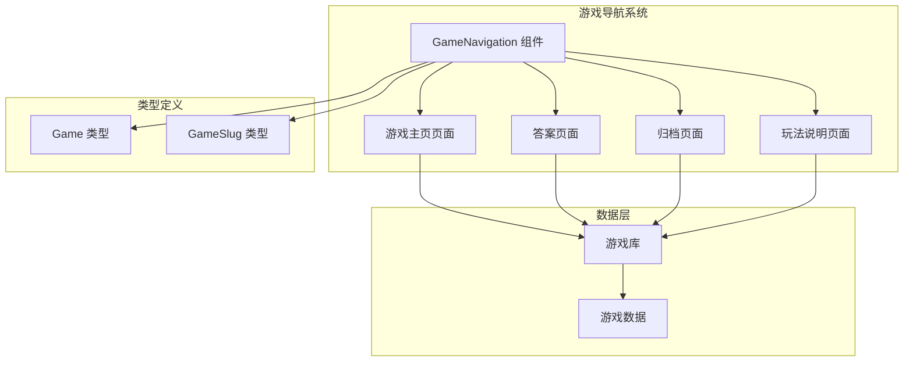
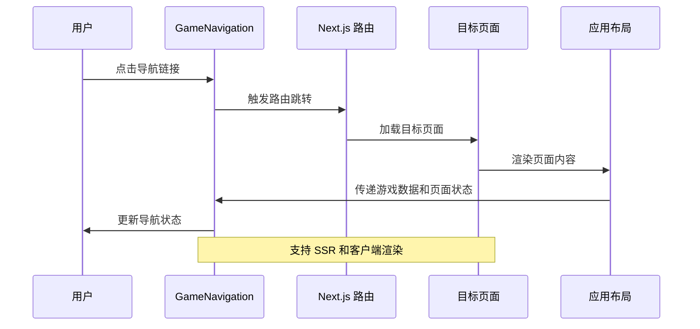
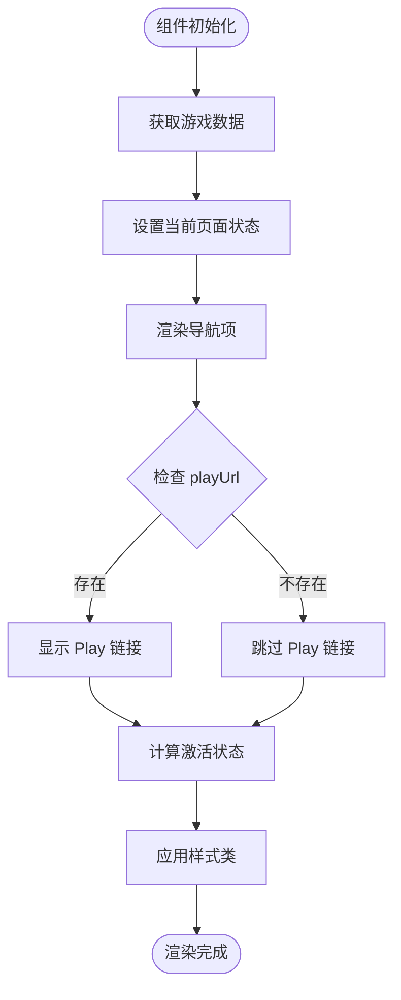
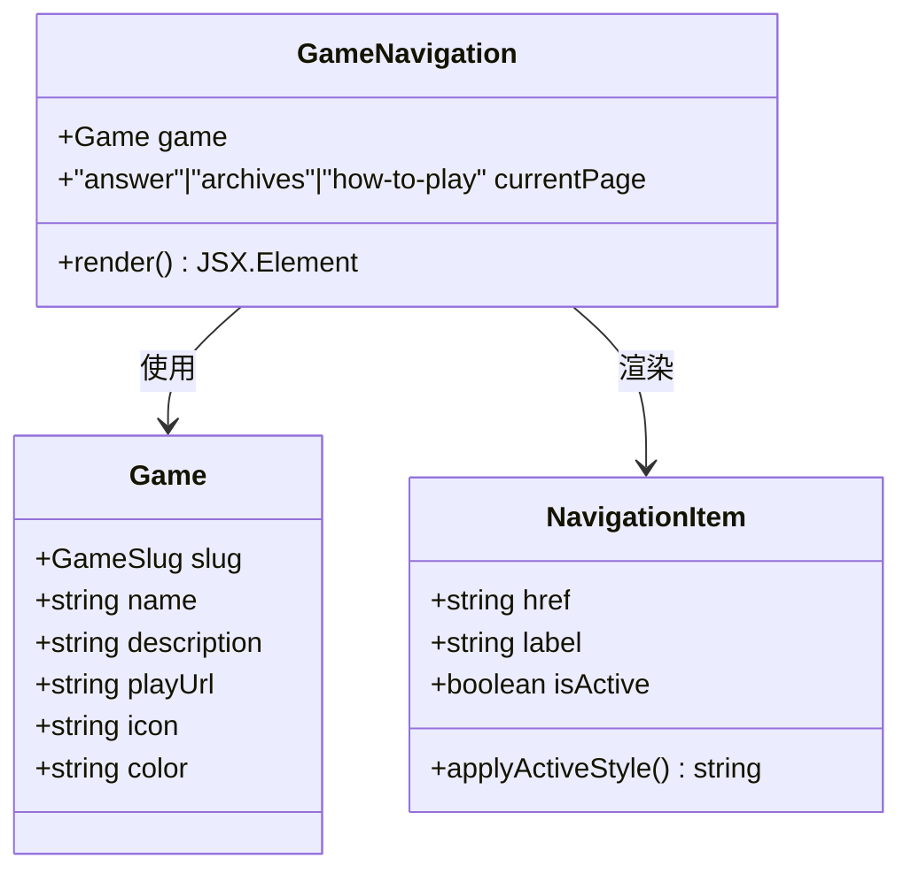
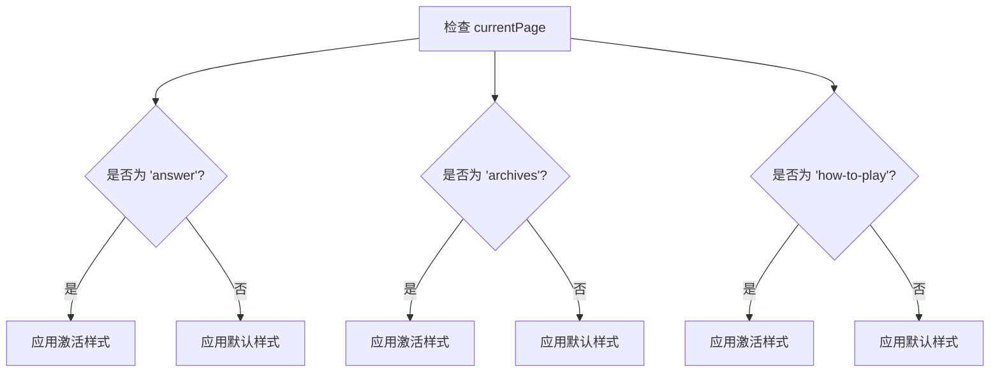
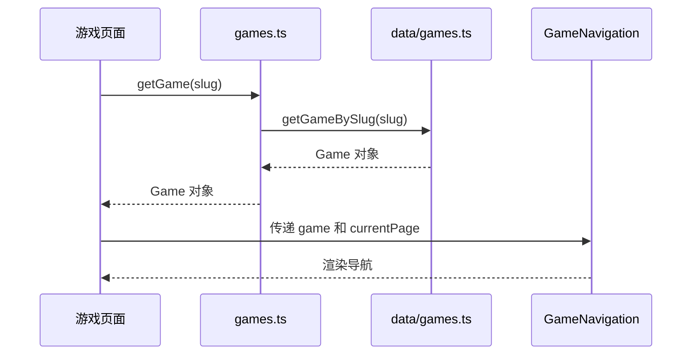
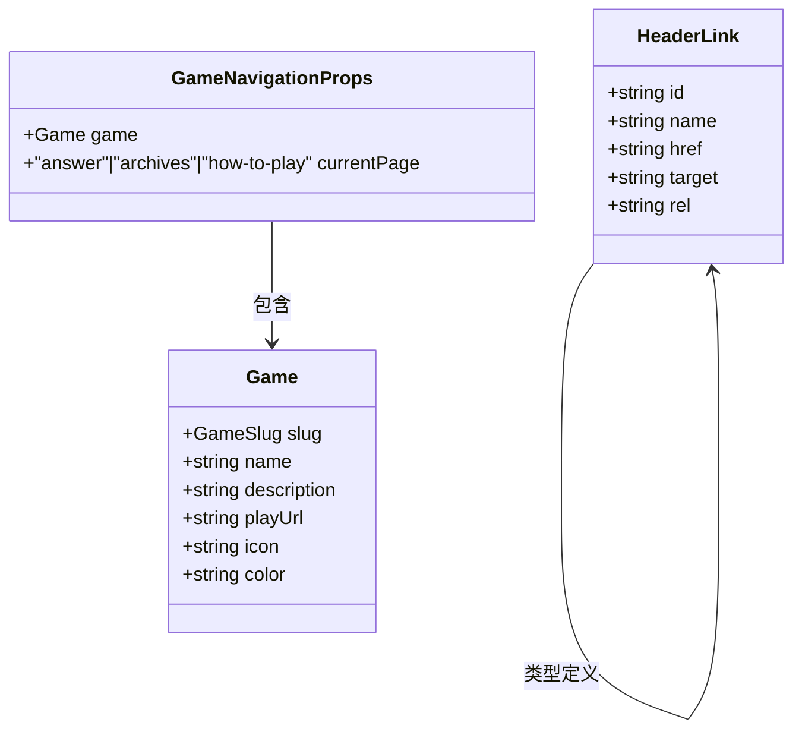

# GameNavigation 游戏导航组件

<cite>
**本文档引用的文件**
- [GameNavigation.tsx](file://components/games/GameNavigation.tsx)
- [game.ts](file://types/game.ts)
- [common.ts](file://types/common.ts)
- [page.tsx](file://app/games/[gameSlug]/page.tsx)
- [page.tsx](file://app/games/[gameSlug]/archives/page.tsx)
- [page.tsx](file://app/games/[gameSlug]/how-to-play/page.tsx)
- [games.ts](file://lib/games.ts)
- [AnswerDisplay.tsx](file://components/games/AnswerDisplay.tsx)
- [ArchivesList.tsx](file://components/games/ArchivesList.tsx)
- [Header.tsx](file://components/header/Header.tsx)
- [HeaderLinks.tsx](file://components/header/HeaderLinks.tsx)
- [layout.tsx](file://app/layout.tsx)
</cite>

## 目录
1. [简介](#简介)
2. [项目结构](#项目结构)
3. [核心组件](#核心组件)
4. [架构概览](#架构概览)
5. [详细组件分析](#详细组件分析)
6. [依赖关系分析](#依赖关系分析)
7. [性能考虑](#性能考虑)
8. [故障排除指南](#故障排除指南)
9. [结论](#结论)
10. [附录](#附录)

## 简介

GameNavigation 是一个专门用于游戏页面间导航的 React 组件，为 LinkedIn Answer Today 游戏应用提供统一的导航体验。该组件实现了以下核心功能：

- **路由跳转**：提供从主页到游戏详情页、归档页和玩法说明页的导航
- **面包屑导航**：显示当前页面在网站结构中的位置
- **活动状态标识**：根据当前页面动态高亮对应的导航项
- **页面状态管理**：通过 currentPage 属性控制导航项的激活状态
- **响应式设计**：适配不同屏幕尺寸的导航布局
- **无障碍访问**：支持键盘导航和屏幕阅读器访问

## 项目结构

GameNavigation 组件位于游戏功能模块中，与游戏相关的页面和数据层紧密集成：



**图表来源**
- [GameNavigation.tsx](file://components/games/GameNavigation.tsx#L1-L83)
- [game.ts](file://types/game.ts#L1-L27)
- [games.ts](file://lib/games.ts#L1-L15)

**章节来源**
- [GameNavigation.tsx](file://components/games/GameNavigation.tsx#L1-L83)
- [layout.tsx](file://app/layout.tsx#L1-L78)

## 核心组件

### 组件接口定义

GameNavigation 组件采用 TypeScript 接口定义，确保类型安全：

```typescript
interface GameNavigationProps {
  game: Game;
  currentPage?: "answer" | "archives" | "how-to-play";
}
```

**组件属性说明**：
- `game`: 游戏基本信息对象，包含游戏标识符、名称等
- `currentPage`: 当前页面类型，默认为 "answer"

### 导航项配置

组件内置了四个主要导航项，每个都具有特定的功能和样式：

| 导航项 | 路径 | 功能描述 | 激活条件 |
|--------|------|----------|----------|
| Home | `/` | 返回网站主页 | 始终可用 |
| Today's Answer | `/games/${game.slug}` | 显示当日答案 | `currentPage === "answer"` |
| Archives | `/games/${game.slug}/archives` | 查看历史答案 | `currentPage === "archives"` |
| How to Play | `/games/${game.slug}/how-to-play` | 游戏玩法说明 | `currentPage === "how-to-play"` |
| Play | `game.playUrl` | 外部游戏链接 | 仅当 `game.playUrl` 存在时显示 |

**章节来源**
- [GameNavigation.tsx](file://components/games/GameNavigation.tsx#L6-L14)

## 架构概览

GameNavigation 组件在整个应用架构中的位置和交互关系：



**图表来源**
- [GameNavigation.tsx](file://components/games/GameNavigation.tsx#L11-L82)
- [layout.tsx](file://app/layout.tsx#L32-L77)

### 数据流分析



**图表来源**
- [GameNavigation.tsx](file://components/games/GameNavigation.tsx#L11-L82)

**章节来源**
- [GameNavigation.tsx](file://components/games/GameNavigation.tsx#L1-L83)

## 详细组件分析

### 组件实现细节

#### 结构设计

GameNavigation 采用语义化的 HTML 结构，使用 `<nav>` 元素包裹导航内容，并通过 `<a>` 标签实现页面跳转：



**图表来源**
- [GameNavigation.tsx](file://components/games/GameNavigation.tsx#L3-L9)
- [game.ts](file://types/game.ts#L15-L22)

#### 样式系统

组件采用 Tailwind CSS 实现响应式设计：

- **基础样式**：`flex flex-wrap items-center gap-2 sm:gap-4`
- **间距控制**：移动端 2 个单位，桌面端 4 个单位
- **边框分隔**：底部边框，支持明暗主题切换
- **颜色系统**：使用 `text-slate-600`/`dark:text-slate-400` 等预定义颜色

#### 活动状态管理

通过 `currentPage` 属性动态控制导航项的激活状态：



**图表来源**
- [GameNavigation.tsx](file://components/games/GameNavigation.tsx#L29-L60)

**章节来源**
- [GameNavigation.tsx](file://components/games/GameNavigation.tsx#L15-L81)

### 类型系统设计

#### 游戏类型定义

```typescript
export type GameSlug = "pinpoint" | "queens";

export type Game = {
  slug: GameSlug;
  name: string;
  description: string;
  playUrl?: string;
  icon?: string;
  color?: string;
};
```

#### 页面状态枚举

组件使用 TypeScript 字面量类型确保类型安全：

```typescript
currentPage?: "answer" | "archives" | "how-to-play"
```

这种设计提供了编译时类型检查，防止传入无效的页面状态值。

**章节来源**
- [game.ts](file://types/game.ts#L1-L27)
- [GameNavigation.tsx](file://components/games/GameNavigation.tsx#L8-L8)

### 数据获取和页面集成

#### 游戏数据获取

应用使用专门的库函数获取游戏信息：



**图表来源**
- [games.ts](file://lib/games.ts#L8-L10)
- [page.tsx](file://app/games/[gameSlug]/page.tsx#L45-L51)

#### 页面状态传递

在各个游戏页面中，GameNavigation 组件以相同的方式被调用：

```typescript
// 在游戏主页、归档页、玩法说明页中
<GameNavigation game={game} currentPage="answer" />
<GameNavigation game={game} currentPage="archives" />
<GameNavigation game={game} currentPage="how-to-play" />
```

**章节来源**
- [page.tsx](file://app/games/[gameSlug]/page.tsx#L71-L90)
- [page.tsx](file://app/games/[gameSlug]/archives/page.tsx#L52-L63)
- [page.tsx](file://app/games/[gameSlug]/how-to-play/page.tsx#L40-L54)

## 依赖关系分析

### 组件依赖图

```mermaid
graph TB
subgraph "外部依赖"
Lucide["lucide-react 图标库"]
Next["next/navigation 路由"]
Tailwind["tailwindcss 样式框架"]
end
subgraph "内部模块"
GameNav[GameNavigation.tsx]
GameType[types/game.ts]
CommonType[types/common.ts]
GamesLib[lib/games.ts]
end
subgraph "页面组件"
HomePage[app/games/[gameSlug]/page.tsx]
ArchivePage[app/games/[gameSlug]/archives/page.tsx]
HowToPage[app/games/[gameSlug]/how-to-play/page.tsx]
end
GameNav --> Lucide
GameNav --> GameType
GameNav --> Tailwind
HomePage --> GameNav
ArchivePage --> GameNav
HowToPage --> GameNav
GameNav --> GamesLib
GamesLib --> GameType
```

**图表来源**
- [GameNavigation.tsx](file://components/games/GameNavigation.tsx#L3-L4)
- [games.ts](file://lib/games.ts#L1-L2)

### 类型依赖关系



**图表来源**
- [game.ts](file://types/game.ts#L15-L22)
- [common.ts](file://types/common.ts#L1-L7)

**章节来源**
- [GameNavigation.tsx](file://components/games/GameNavigation.tsx#L3-L9)
- [game.ts](file://types/game.ts#L15-L22)
- [common.ts](file://types/common.ts#L1-L7)

## 性能考虑

### 渲染优化

1. **静态路径生成**：所有游戏页面都使用 `generateStaticParams` 进行静态生成
2. **条件渲染**：Play 链接仅在有外部游戏地址时显示
3. **样式复用**：使用 Tailwind CSS 的原子化类名减少样式计算

### 内存管理

- 组件无状态设计，避免不必要的状态存储
- 使用函数组件而非类组件，减少内存开销
- 合理的 props 传递，避免重复渲染

### 加载性能

- 图标使用 lucide-react，按需加载
- 样式使用原子化设计，减少 CSS 文件大小
- 响应式设计支持移动设备，提升用户体验

## 故障排除指南

### 常见问题及解决方案

#### 导航项不显示

**问题**：当 `game.playUrl` 不存在时，Play 导航项不显示
**解决**：检查游戏数据中的 `playUrl` 字段是否正确设置

#### 激活状态不正确

**问题**：导航项没有正确高亮显示
**解决**：确认 `currentPage` 参数与页面实际状态匹配

#### 路由跳转失败

**问题**：点击导航链接无法跳转到目标页面
**解决**：检查路由配置和页面文件是否存在

#### 样式显示异常

**问题**：导航项样式在深色模式下显示不正确
**解决**：确认 Tailwind CSS 的暗色模式配置正常

**章节来源**
- [GameNavigation.tsx](file://components/games/GameNavigation.tsx#L66-L79)

## 结论

GameNavigation 组件是一个设计精良的游戏导航解决方案，具有以下优势：

1. **类型安全**：完整的 TypeScript 类型定义确保编译时错误检测
2. **响应式设计**：适配各种屏幕尺寸的导航布局
3. **可维护性**：清晰的代码结构和模块化设计
4. **扩展性**：易于添加新的导航项和功能
5. **性能优化**：高效的渲染和内存管理

该组件为游戏应用提供了统一、一致的导航体验，是 Next.js 应用中导航组件的最佳实践示例。

## 附录

### 使用示例

#### 基本使用

```typescript
import GameNavigation from "@/components/games/GameNavigation";

// 在游戏页面中使用
<GameNavigation game={game} currentPage="answer" />
```

#### 自定义导航项

如果需要添加新的导航项，可以修改组件的导航数组：

```typescript
// 在组件中添加新的导航项
<a href={`/games/${game.slug}/custom-page`}>
  自定义页面
</a>
```

#### 添加导航守卫

可以在组件中添加条件渲染逻辑：

```typescript
{game.hasCustomFeature && (
  <a href={`/games/${game.slug}/custom-feature`}>
    自定义功能
  </a>
)}
```

### 最佳实践

1. **保持类型一致性**：始终使用正确的 `currentPage` 值
2. **响应式测试**：在不同设备上测试导航组件
3. **无障碍访问**：确保键盘导航和屏幕阅读器支持
4. **性能监控**：定期检查组件的渲染性能
5. **样式维护**：遵循一致的样式命名约定