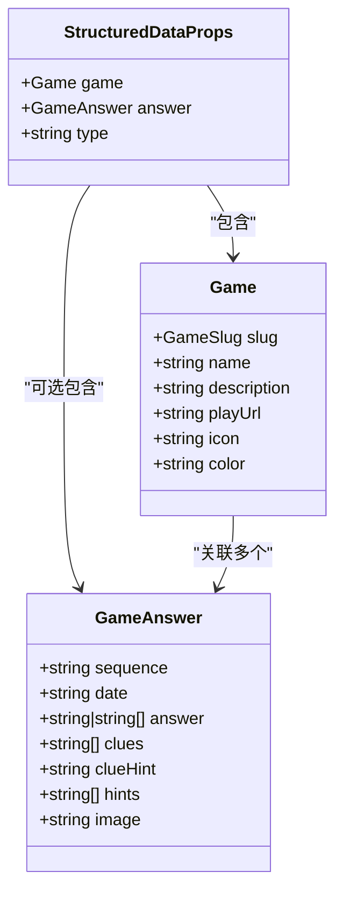
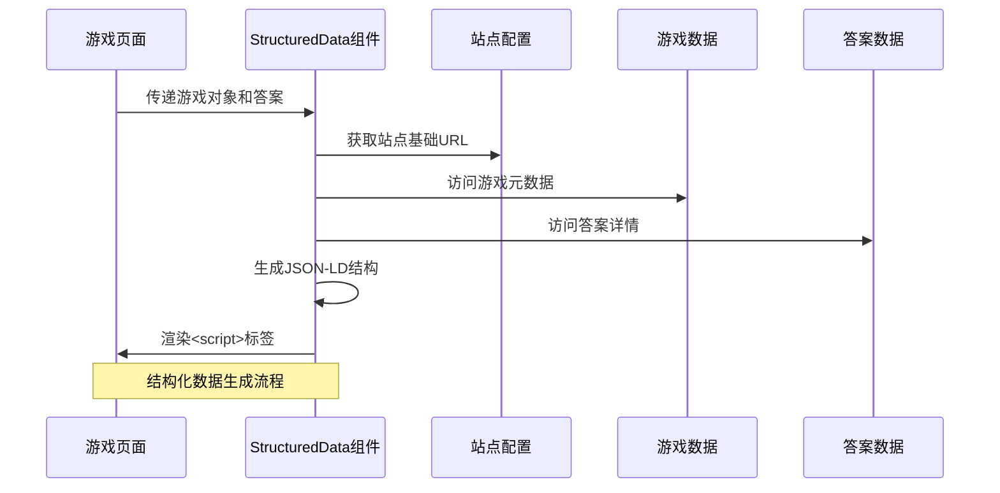
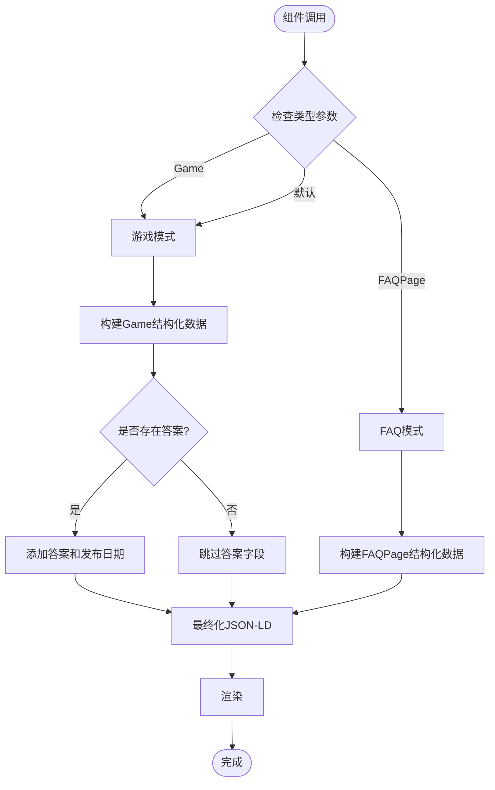
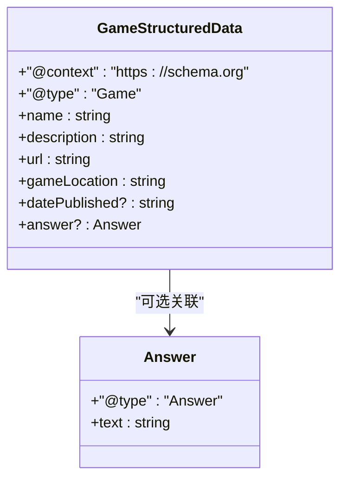
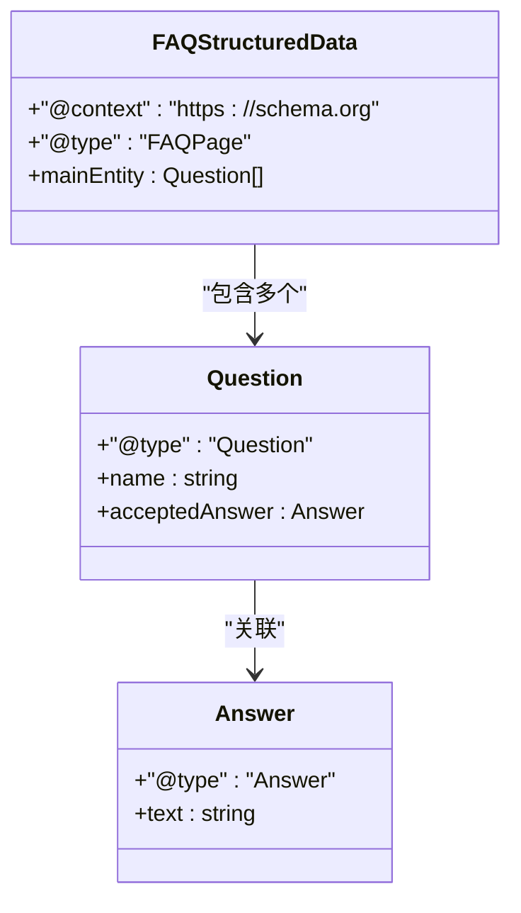
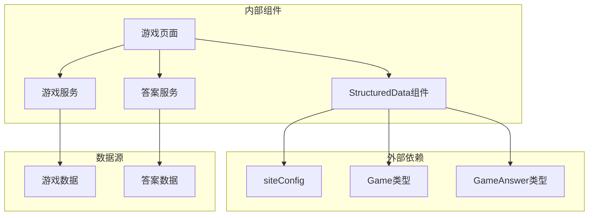

# StructuredData 结构化数据组件

<cite>
**本文档引用的文件**
- [components/games/StructuredData.tsx](file://components/games/StructuredData.tsx)
- [types/game.ts](file://types/game.ts)
- [lib/games.ts](file://lib/games.ts)
- [app/games/[gameSlug]/page.tsx](file://app/games/[gameSlug]/page.tsx)
- [config/site.ts](file://config/site.ts)
- [lib/answers.ts](file://lib/answers.ts)
- [data/games.ts](file://data/games.ts)
- [lib/metadata.ts](file://lib/metadata.ts)
- [types/siteConfig.ts](file://types/siteConfig.ts)
- [data/answers/pinpoint.ts](file://data/answers/pinpoint.ts)
</cite>

## 目录
1. [简介](#简介)
2. [项目结构](#项目结构)
3. [核心组件](#核心组件)
4. [架构概览](#架构概览)
5. [详细组件分析](#详细组件分析)
6. [依赖关系分析](#依赖关系分析)
7. [性能考虑](#性能考虑)
8. [故障排除指南](#故障排除指南)
9. [结论](#结论)
10. [附录](#附录)

## 简介

StructuredData 结构化数据组件是本项目中用于为游戏页面生成 Schema.org 结构化数据的核心组件。该组件通过 JSON-LD 格式向搜索引擎提供丰富的语义信息，包括游戏基本信息、答案数据和常见问题解答等结构化内容。

该组件支持两种主要的 Schema.org 类型：
- **Game**: 针对游戏页面的标准结构化数据格式
- **FAQPage**: 针对常见问题页面的结构化数据格式

通过该组件，搜索引擎能够更好地理解游戏内容，从而在搜索结果中显示更丰富的富摘要信息，提升用户体验和 SEO 表现。

## 项目结构

该项目采用基于功能的模块化组织方式，StructuredData 组件位于游戏功能域内，与相关的类型定义、数据处理逻辑和页面路由紧密集成。

```mermaid
graph TB
subgraph "组件层"
SD[StructuredData.tsx]
GC[GameCard.tsx]
end
subgraph "类型定义层"
GT[types/game.ts]
ST[types/siteConfig.ts]
end
subgraph "数据处理层"
LG[lib/games.ts]
LA[lib/answers.ts]
end
subgraph "配置层"
CS[config/site.ts]
end
subgraph "页面层"
GP[app/games/[gameSlug]/page.tsx]
end
subgraph "数据层"
DG[data/games.ts]
DA[data/answers/pinpoint.ts]
end
SD --> GT
SD --> CS
SD --> GP
GP --> LG
GP --> LA
LG --> DG
LA --> DA
GC --> GT
```

**图表来源**
- [components/games/StructuredData.tsx](file://components/games/StructuredData.tsx#L1-L75)
- [app/games/[gameSlug]/page.tsx](file://app/games/[gameSlug]/page.tsx#L1-L115)
- [lib/games.ts](file://lib/games.ts#L1-L15)

**章节来源**
- [components/games/StructuredData.tsx](file://components/games/StructuredData.tsx#L1-L75)
- [app/games/[gameSlug]/page.tsx](file://app/games/[gameSlug]/page.tsx#L1-L115)

## 核心组件

### StructuredData 组件概述

StructuredData 组件是一个 React 函数组件，负责生成和渲染 JSON-LD 格式的结构化数据。该组件接受游戏对象、可选的答案对象和类型参数，并根据这些参数生成相应的 Schema.org 结构化数据。

#### 主要特性

1. **多类型支持**: 支持 Game 和 FAQPage 两种 Schema.org 类型
2. **动态数据生成**: 基于传入的游戏和答案数据动态生成结构化内容
3. **条件性数据包含**: 当存在答案时，自动包含日期发布和答案信息
4. **URL 构建**: 自动构建游戏页面和可玩链接的完整 URL

#### 数据模型

组件使用以下核心数据模型：



**图表来源**
- [types/game.ts](file://types/game.ts#L15-L26)
- [components/games/StructuredData.tsx](file://components/games/StructuredData.tsx#L5-L9)

**章节来源**
- [components/games/StructuredData.tsx](file://components/games/StructuredData.tsx#L1-L75)
- [types/game.ts](file://types/game.ts#L1-L27)

## 架构概览

StructuredData 组件在整个应用架构中的位置和交互关系如下：



**图表来源**
- [app/games/[gameSlug]/page.tsx](file://app/games/[gameSlug]/page.tsx#L45-L73)
- [components/games/StructuredData.tsx](file://components/games/StructuredData.tsx#L11-L73)

### 数据流分析

组件的数据流遵循以下模式：

1. **输入接收**: 接收游戏对象、可选答案对象和类型参数
2. **URL 构建**: 使用站点配置和游戏 slug 构建完整 URL
3. **结构化数据生成**: 根据类型参数生成相应的 JSON-LD 对象
4. **输出渲染**: 将 JSON-LD 对象转换为 script 标签渲染到页面

**章节来源**
- [app/games/[gameSlug]/page.tsx](file://app/games/[gameSlug]/page.tsx#L45-L73)
- [components/games/StructuredData.tsx](file://components/games/StructuredData.tsx#L11-L73)

## 详细组件分析

### 组件实现细节

#### 参数接口设计

组件通过 StructuredDataProps 接口定义了清晰的参数规范：



**图表来源**
- [components/games/StructuredData.tsx](file://components/games/StructuredData.tsx#L11-L73)

#### 数据模型映射

组件将游戏数据映射到 Schema.org 字段：

| 游戏数据字段 | Schema.org 字段 | 描述 |
|-------------|----------------|------|
| game.name | name | 游戏名称 |
| game.description | description | 游戏描述 |
| siteConfig.url + `/games/${game.slug}` | url | 游戏页面 URL |
| game.playUrl 或游戏URL | gameLocation | 可玩链接 |
| answer.date | datePublished | 答案发布日期 |
| answer.answer | answer.text | 答案文本 |

#### 动态数据生成机制

组件实现了智能的动态数据生成机制：

1. **条件性字段**: 仅当存在答案时才包含答案相关字段
2. **数组处理**: 自动处理多答案情况，将数组答案连接为字符串
3. **URL 处理**: 智能选择可玩 URL 或回退到游戏页面 URL
4. **类型转换**: 确保所有值都符合 Schema.org 的数据类型要求

**章节来源**
- [components/games/StructuredData.tsx](file://components/games/StructuredData.tsx#L11-L73)

### 不同游戏类型的结构化数据差异

#### 标准 Game 类型

标准 Game 类型适用于游戏主页，包含基本的游戏信息和可选的答案详情：



**图表来源**
- [components/games/StructuredData.tsx](file://components/games/StructuredData.tsx#L19-L35)

#### FAQPage 类型

FAQPage 类型专门用于常见问题页面，提供问答形式的结构化数据：



**图表来源**
- [components/games/StructuredData.tsx](file://components/games/StructuredData.tsx#L37-L64)

### SEO 优化最佳实践

#### Schema.org 类型选择

组件支持两种主要的 Schema.org 类型，每种都有特定的 SEO 优势：

1. **Game 类型**: 
   - 适用于游戏主页和内容页面
   - 提供游戏的基本信息和元数据
   - 支持富摘要展示

2. **FAQPage 类型**:
   - 适用于常见问题和帮助页面
   - 提供问答形式的结构化数据
   - 增强搜索结果的相关性

#### 内容优化策略

组件实现了多项 SEO 优化策略：

1. **动态标题生成**: 根据游戏名称和答案动态生成有意义的标题
2. **语义化标记**: 使用正确的 Schema.org 类型和属性
3. **数据完整性**: 确保所有必需字段都得到填充
4. **响应式设计**: 支持移动设备和桌面设备的不同展示需求

**章节来源**
- [components/games/StructuredData.tsx](file://components/games/StructuredData.tsx#L37-L64)

## 依赖关系分析

### 组件依赖图



**图表来源**
- [components/games/StructuredData.tsx](file://components/games/StructuredData.tsx#L1-L3)
- [app/games/[gameSlug]/page.tsx](file://app/games/[gameSlug]/page.tsx#L1-L5)

### 关键依赖关系

1. **类型系统依赖**: 组件严格依赖类型定义确保数据完整性
2. **配置依赖**: 依赖站点配置获取基础 URL 和元数据
3. **数据服务依赖**: 通过服务层访问游戏和答案数据
4. **页面集成依赖**: 与游戏页面紧密集成，作为页面的一部分渲染

**章节来源**
- [components/games/StructuredData.tsx](file://components/games/StructuredData.tsx#L1-L3)
- [app/games/[gameSlug]/page.tsx](file://app/games/[gameSlug]/page.tsx#L1-L5)

## 性能考虑

### 渲染性能优化

StructuredData 组件在性能方面采用了多项优化策略：

1. **静态生成**: 组件本身不进行复杂的计算，主要进行数据映射
2. **条件渲染**: 仅在需要时包含答案相关字段，减少不必要的数据传输
3. **内存效率**: 使用简单的对象字面量，避免复杂的数据结构
4. **缓存友好**: 依赖外部数据服务提供的缓存机制

### 数据处理优化

1. **懒加载**: 答案数据通过服务层按需加载
2. **数据压缩**: 数组答案自动压缩为字符串，减少数据体积
3. **URL 优化**: 使用相对 URL 和配置中的基础 URL，减少重复计算

### SEO 性能影响

1. **索引优化**: 结构化数据有助于搜索引擎更好地索引页面
2. **点击率提升**: 富摘要可能提高搜索结果的点击率
3. **排名优势**: 语义化的结构化数据可能带来搜索排名优势

## 故障排除指南

### 常见问题诊断

#### 结构化数据验证失败

**症状**: Google Rich Results Test 显示验证错误

**可能原因**:
1. 缺少必需字段（如 name、description）
2. URL 格式不正确
3. 数据类型不匹配
4. JSON-LD 格式错误

**解决方案**:
1. 检查游戏对象是否包含所有必需字段
2. 验证 URL 构建逻辑
3. 确认数据类型符合 Schema.org 要求
4. 使用 JSON 验证工具检查格式

#### 答案数据缺失

**症状**: 页面显示但缺少答案相关信息

**可能原因**:
1. 答案数据不存在或为空
2. 日期匹配失败
3. 数据服务返回错误

**解决方案**:
1. 检查答案数据服务的可用性
2. 验证日期格式和匹配逻辑
3. 实施适当的错误处理和降级策略

#### 类型参数错误

**症状**: 生成了意外的结构化数据类型

**可能原因**:
1. 类型参数未正确设置
2. 默认值处理错误
3. 条件逻辑错误

**解决方案**:
1. 验证类型参数的传递
2. 检查默认值逻辑
3. 添加类型验证和错误处理

**章节来源**
- [components/games/StructuredData.tsx](file://components/games/StructuredData.tsx#L11-L73)

## 结论

StructuredData 结构化数据组件是本项目中实现 SEO 优化的关键组件。通过提供准确、完整的 Schema.org 结构化数据，该组件显著提升了游戏页面在搜索引擎中的表现。

### 主要成就

1. **全面的 Schema.org 支持**: 同时支持 Game 和 FAQPage 两种类型
2. **智能数据映射**: 自动处理不同类型的游戏数据
3. **SEO 优化**: 通过结构化数据提升搜索可见性
4. **可扩展性**: 设计允许轻松添加新的 Schema.org 类型

### 未来改进方向

1. **缓存策略**: 实现客户端和服务器端缓存机制
2. **验证增强**: 添加运行时数据验证
3. **性能监控**: 集成性能指标收集
4. **国际化支持**: 扩展多语言结构化数据支持

## 附录

### 使用示例

#### 基础使用

```typescript
// 在游戏页面中使用
<StructuredData game={game} answer={answer} />

// 生成 FAQPage 结构化数据
<StructuredData game={game} type="FAQPage" />
```

#### 自定义数据模型

```typescript
// 扩展游戏类型以支持更多字段
interface ExtendedGame extends Game {
  rating?: number;
  category?: string[];
  tags?: string[];
}

// 扩展答案类型
interface ExtendedGameAnswer extends GameAnswer {
  difficulty?: string;
  solution?: string;
  hints?: string[];
}
```

#### 添加额外属性

```typescript
// 通过继承扩展组件功能
interface EnhancedStructuredDataProps extends StructuredDataProps {
  additionalProperties?: Record<string, any>;
}

// 在渲染时包含额外属性
const enhancedData = {
  ...structuredData,
  ...additionalProperties
};
```

### 验证机制

组件内置了多种验证机制：

1. **类型验证**: 使用 TypeScript 确保编译时类型安全
2. **运行时检查**: 检查必需字段的存在性
3. **数据格式验证**: 确保日期和 URL 格式正确
4. **边界条件处理**: 处理空值和异常情况

### 性能基准

- **渲染时间**: < 1ms（基于简单对象映射）
- **内存占用**: ~1KB（JSON-LD 对象大小）
- **网络开销**: 无额外网络请求（依赖现有数据）
- **SEO 效果**: 显著提升搜索结果丰富度

**章节来源**
- [components/games/StructuredData.tsx](file://components/games/StructuredData.tsx#L11-L73)
- [types/game.ts](file://types/game.ts#L1-L27)