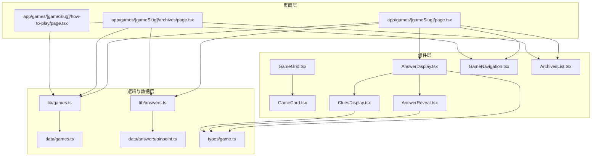
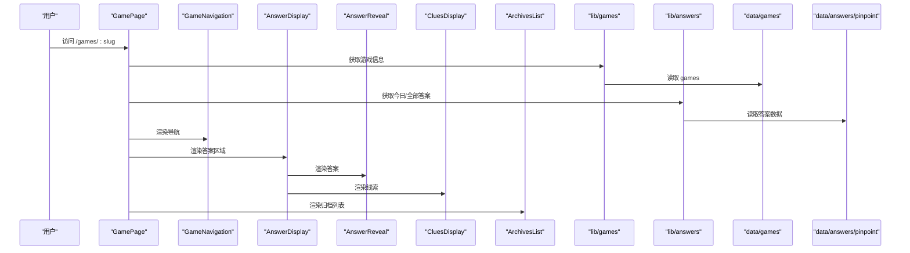
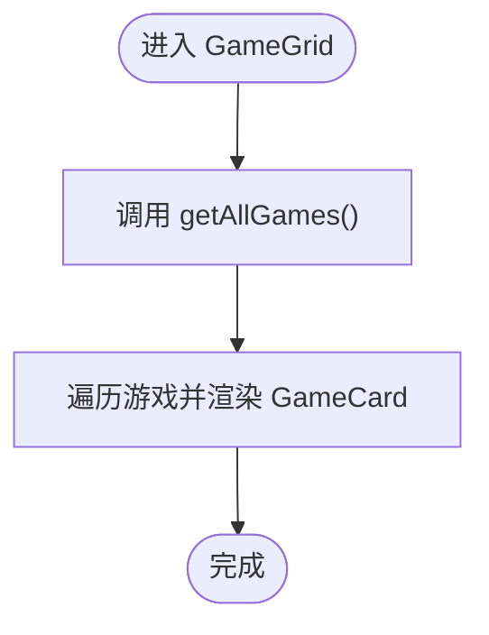
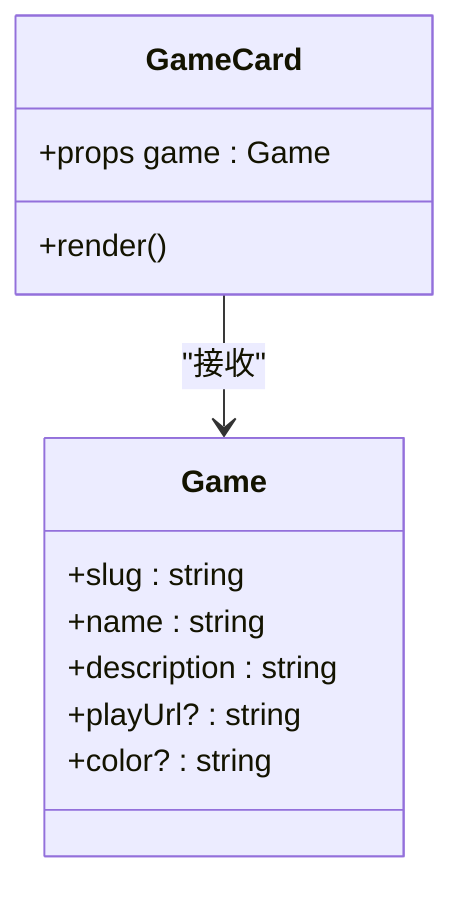
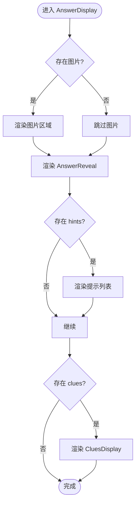
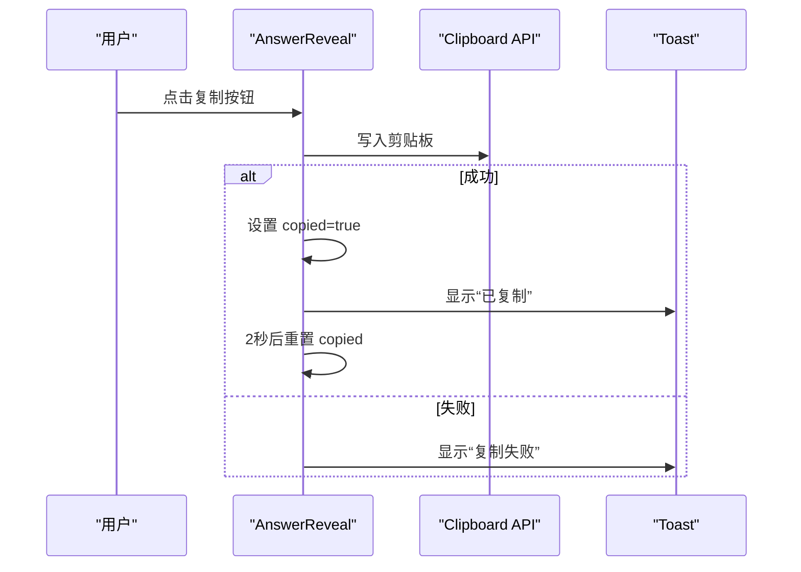
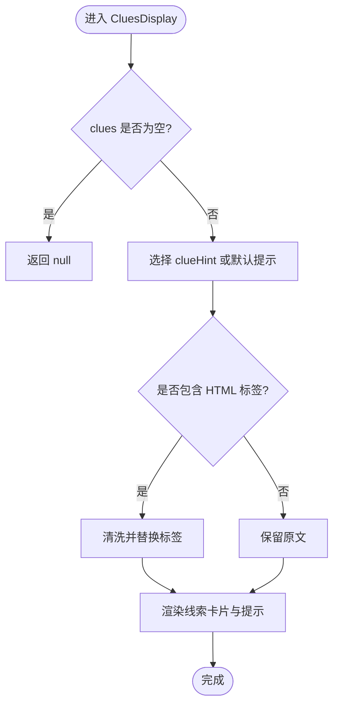
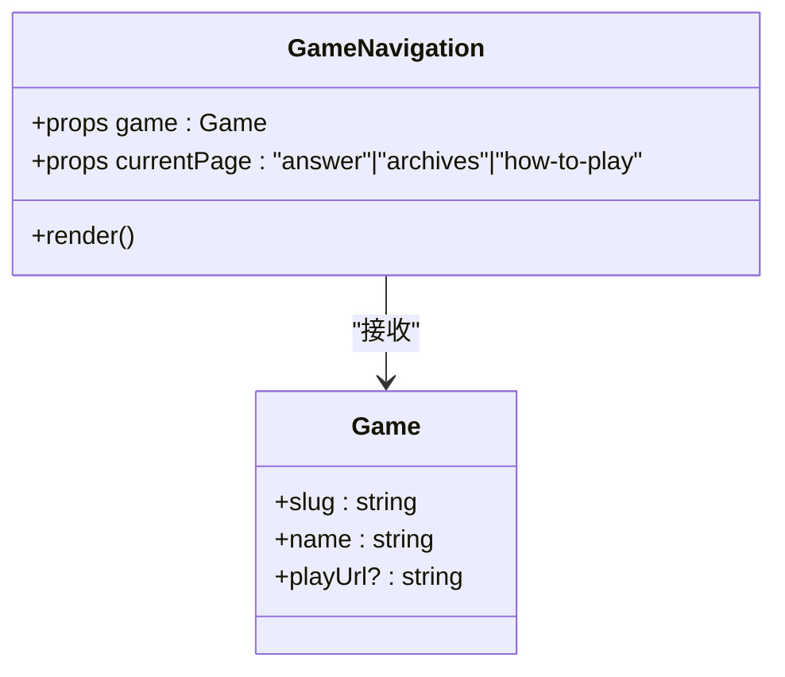
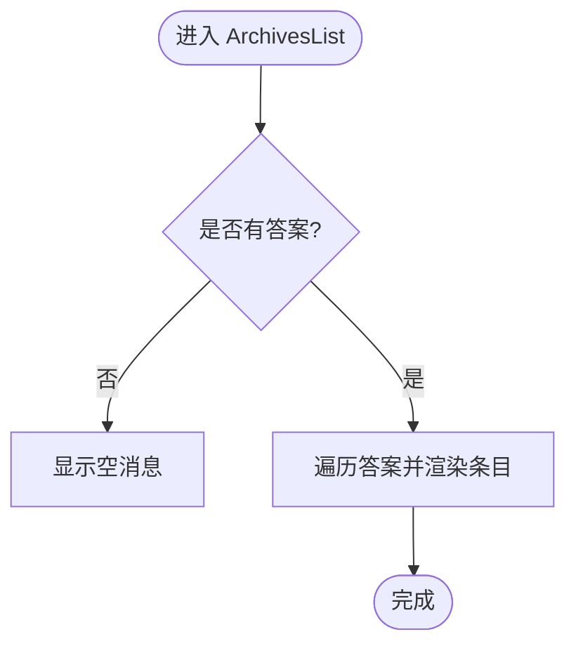
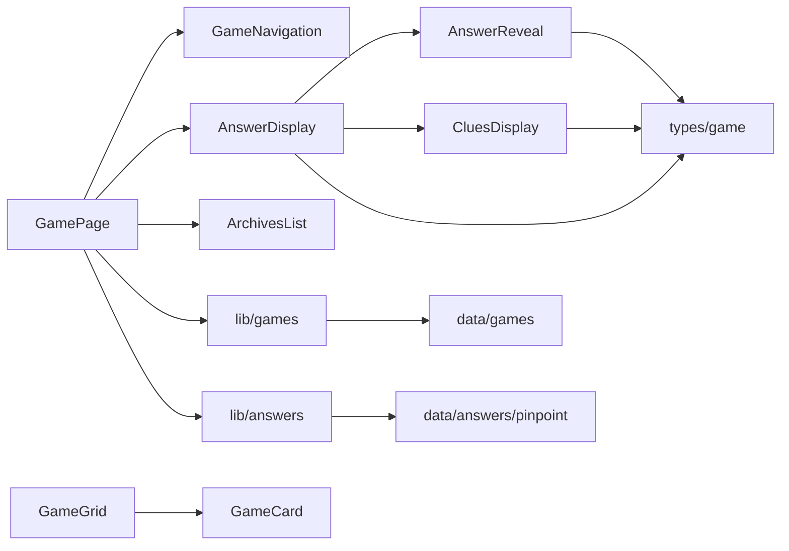

# 游戏组件系统

<cite>
**本文引用的文件**
- [components/games/GameGrid.tsx](file://components/games/GameGrid.tsx)
- [components/games/GameCard.tsx](file://components/games/GameCard.tsx)
- [components/games/AnswerDisplay.tsx](file://components/games/AnswerDisplay.tsx)
- [components/games/AnswerReveal.tsx](file://components/games/AnswerReveal.tsx)
- [components/games/CluesDisplay.tsx](file://components/games/CluesDisplay.tsx)
- [components/games/GameNavigation.tsx](file://components/games/GameNavigation.tsx)
- [components/games/ArchivesList.tsx](file://components/games/ArchivesList.tsx)
- [app/games/[gameSlug]/page.tsx](file://app/games/[gameSlug]/page.tsx)
- [app/games/[gameSlug]/archives/page.tsx](file://app/games/[gameSlug]/archives/page.tsx)
- [app/games/[gameSlug]/how-to-play/page.tsx](file://app/games/[gameSlug]/how-to-play/page.tsx)
- [lib/games.ts](file://lib/games.ts)
- [lib/answers.ts](file://lib/answers.ts)
- [data/games.ts](file://data/games.ts)
- [data/answers/pinpoint.ts](file://data/answers/pinpoint.ts)
- [types/game.ts](file://types/game.ts)
</cite>

## 目录
1. [简介](#简介)
2. [项目结构](#项目结构)
3. [核心组件](#核心组件)
4. [架构总览](#架构总览)
5. [详细组件分析](#详细组件分析)
6. [依赖关系分析](#依赖关系分析)
7. [性能考量](#性能考量)
8. [故障排查指南](#故障排查指南)
9. [结论](#结论)
10. [附录](#附录)

## 简介
本文件系统化梳理了游戏组件系统的设计与实现，重点覆盖以下核心组件：GameGrid（游戏网格）、AnswerDisplay（答案显示）、CluesDisplay（线索显示）、GameNavigation（游戏导航）。文档从设计理念、Props 接口、状态管理、事件处理、样式定制、组件间通信与数据流、组合使用方式、响应式与无障碍、性能优化、可扩展性与主题定制等方面进行深入解析，并提供最佳实践与排错建议。

## 项目结构
该系统采用按功能域分层的组织方式：
- 页面层：位于 app/games 下，负责路由参数解析、元数据生成、静态导出与页面渲染。
- 组件层：位于 components/games，封装可复用的游戏展示与交互组件。
- 数据与逻辑层：位于 lib 与 data，提供游戏与答案数据的读取、过滤与排序。
- 类型层：位于 types，统一定义游戏与答案的数据结构。

图表来源
- [app/games/[gameSlug]/page.tsx](file://app/games/[gameSlug]/page.tsx#L45-L114)
- [app/games/[gameSlug]/archives/page.tsx](file://app/games/[gameSlug]/archives/page.tsx#L42-L66)
- [app/games/[gameSlug]/how-to-play/page.tsx](file://app/games/[gameSlug]/how-to-play/page.tsx#L40-L76)
- [components/games/GameGrid.tsx](file://components/games/GameGrid.tsx#L4-L14)
- [components/games/GameCard.tsx](file://components/games/GameCard.tsx#L36-L90)
- [components/games/AnswerDisplay.tsx](file://components/games/AnswerDisplay.tsx#L11-L64)
- [components/games/AnswerReveal.tsx](file://components/games/AnswerReveal.tsx#L14-L82)
- [components/games/CluesDisplay.tsx](file://components/games/CluesDisplay.tsx#L12-L73)
- [components/games/GameNavigation.tsx](file://components/games/GameNavigation.tsx#L11-L82)
- [components/games/ArchivesList.tsx](file://components/games/ArchivesList.tsx#L9-L66)
- [lib/games.ts](file://lib/games.ts#L4-L14)
- [lib/answers.ts](file://lib/answers.ts#L10-L41)
- [data/games.ts](file://data/games.ts#L3-L28)
- [data/answers/pinpoint.ts](file://data/answers/pinpoint.ts#L3-L138)
- [types/game.ts](file://types/game.ts#L1-L27)

章节来源
- [app/games/[gameSlug]/page.tsx](file://app/games/[gameSlug]/page.tsx#L45-L114)
- [components/games/GameGrid.tsx](file://components/games/GameGrid.tsx#L4-L14)
- [lib/games.ts](file://lib/games.ts#L4-L14)
- [lib/answers.ts](file://lib/answers.ts#L10-L41)
- [data/games.ts](file://data/games.ts#L3-L28)
- [data/answers/pinpoint.ts](file://data/answers/pinpoint.ts#L3-L138)
- [types/game.ts](file://types/game.ts#L1-L27)

## 核心组件
本节对关键组件进行概览式解析，包括职责、Props 接口要点、状态与事件处理、样式与可定制点。

- GameGrid
  - 职责：渲染游戏列表网格，遍历游戏并为每个游戏渲染 GameCard。
  - 关键点：基于 Tailwind 的响应式网格布局；通过 getAllGames 获取数据源。
  - 章节来源
    - [components/games/GameGrid.tsx](file://components/games/GameGrid.tsx#L4-L14)
    - [lib/games.ts](file://lib/games.ts#L4-L6)
    - [data/games.ts](file://data/games.ts#L3-L28)

- GameCard
  - 职责：单个游戏卡片，包含名称、描述、入口链接与颜色主题。
  - 关键点：根据 game.color 映射背景/边框/文本色；提供“今日答案”“归档”“如何游玩”等入口。
  - 章节来源
    - [components/games/GameCard.tsx](file://components/games/GameCard.tsx#L36-L90)
    - [types/game.ts](file://types/game.ts#L15-L22)

- AnswerDisplay
  - 职责：整合答案展示，包含图片区、答案揭晓区、提示区与线索区。
  - 关键点：条件渲染图片与提示；调用 AnswerReveal 展示答案；调用 CluesDisplay 展示线索。
  - 章节来源
    - [components/games/AnswerDisplay.tsx](file://components/games/AnswerDisplay.tsx#L11-L64)

- AnswerReveal
  - 职责：展示最终答案，支持复制到剪贴板与多答案分项展示。
  - 关键点：useState 管理复制态；useToast 提示反馈；数组与字符串两种答案形态。
  - 章节来源
    - [components/games/AnswerReveal.tsx](file://components/games/AnswerReveal.tsx#L14-L82)
    - [hooks/use-toast.ts](file://hooks/use-toast.ts)

- CluesDisplay
  - 职责：以卡片形式展示线索，支持自定义提示文案与 HTML 高亮。
  - 关键点：动态处理 HTML 标记；动画入场；可选编号与标题后缀。
  - 章节来源
    - [components/games/CluesDisplay.tsx](file://components/games/CluesDisplay.tsx#L12-L73)

- GameNavigation
  - 职责：在“今日答案/归档/如何游玩/外部游玩”之间切换导航。
  - 关键点：根据 currentPage 切换高亮；可选外部链接。
  - 章节来源
    - [components/games/GameNavigation.tsx](file://components/games/GameNavigation.tsx#L11-L82)

- ArchivesList
  - 职责：历史答案列表，支持按日期跳转详情。
  - 关键点：格式化日期；区分多答案与单答案展示。
  - 章节来源
    - [components/games/ArchivesList.tsx](file://components/games/ArchivesList.tsx#L9-L66)

章节来源
- [components/games/GameGrid.tsx](file://components/games/GameGrid.tsx#L4-L14)
- [components/games/GameCard.tsx](file://components/games/GameCard.tsx#L36-L90)
- [components/games/AnswerDisplay.tsx](file://components/games/AnswerDisplay.tsx#L11-L64)
- [components/games/AnswerReveal.tsx](file://components/games/AnswerReveal.tsx#L14-L82)
- [components/games/CluesDisplay.tsx](file://components/games/CluesDisplay.tsx#L12-L73)
- [components/games/GameNavigation.tsx](file://components/games/GameNavigation.tsx#L11-L82)
- [components/games/ArchivesList.tsx](file://components/games/ArchivesList.tsx#L9-L66)

## 架构总览
下图展示了页面到组件、再到数据与类型的完整调用链路与数据流向。

图表来源
- [app/games/[gameSlug]/page.tsx](file://app/games/[gameSlug]/page.tsx#L45-L114)
- [components/games/GameNavigation.tsx](file://components/games/GameNavigation.tsx#L11-L82)
- [components/games/AnswerDisplay.tsx](file://components/games/AnswerDisplay.tsx#L11-L64)
- [components/games/AnswerReveal.tsx](file://components/games/AnswerReveal.tsx#L14-L82)
- [components/games/CluesDisplay.tsx](file://components/games/CluesDisplay.tsx#L12-L73)
- [components/games/ArchivesList.tsx](file://components/games/ArchivesList.tsx#L9-L66)
- [lib/games.ts](file://lib/games.ts#L4-L14)
- [lib/answers.ts](file://lib/answers.ts#L10-L41)
- [data/games.ts](file://data/games.ts#L3-L28)
- [data/answers/pinpoint.ts](file://data/answers/pinpoint.ts#L3-L138)

## 详细组件分析

### GameGrid 分析
- 设计理念
  - 以容器组件聚合多个 GameCard，实现“列表-卡片”的解耦。
  - 基于 Tailwind 的响应式网格，自动适配不同屏幕尺寸。
- Props 与数据流
  - 输入：无显式 Props；内部通过 lib/games 读取全局游戏列表。
  - 输出：渲染若干 GameCard。
- 状态与事件
  - 无内部状态；点击由 GameCard 内部链接触发导航。
- 样式与可定制
  - 通过类名控制网格列数与间距；颜色主题由 GameCard 承担。
- 组件间通信
  - 单向数据流：父组件提供数据，子组件渲染。
- 最佳实践
  - 将网格列数与间距抽象为可配置常量，便于主题扩展。
- 章节来源
  - [components/games/GameGrid.tsx](file://components/games/GameGrid.tsx#L4-L14)
  - [lib/games.ts](file://lib/games.ts#L4-L6)
  - [data/games.ts](file://data/games.ts#L3-L28)

图表来源
- [components/games/GameGrid.tsx](file://components/games/GameGrid.tsx#L4-L14)
- [lib/games.ts](file://lib/games.ts#L4-L6)

### GameCard 分析
- 设计理念
  - 卡片内含入口与导航，统一风格与交互；颜色主题通过映射表集中管理。
- Props 接口
  - game: Game（包含 slug/name/description/playUrl/color 等）
- 状态与事件
  - 无内部状态；链接点击触发导航。
- 样式与可定制
  - colorClasses/textColorClasses 支持主题色替换；hover 效果增强可访问性。
- 组件间通信
  - 作为 GameGrid 的子组件被消费。
- 最佳实践
  - 将颜色映射抽离为配置，便于新增主题色。
- 章节来源
  - [components/games/GameCard.tsx](file://components/games/GameCard.tsx#L36-L90)
  - [types/game.ts](file://types/game.ts#L15-L22)

图表来源
- [components/games/GameCard.tsx](file://components/games/GameCard.tsx#L36-L90)
- [types/game.ts](file://types/game.ts#L15-L22)

### AnswerDisplay 分析
- 设计理念
  - 将答案展示拆分为多个子区域：图片、答案、提示、线索，提升可维护性与可测试性。
- Props 接口
  - answer: GameAnswer
  - gameName: string
- 状态与事件
  - 无内部状态；依赖 AnswerReveal 的复制交互。
- 样式与可定制
  - 使用圆角边框与浅色背景，突出内容层次；图片区域自适应宽高。
- 组件间通信
  - 组合 AnswerReveal 与 CluesDisplay，形成复合展示。
- 最佳实践
  - 图片懒加载与 sizes 配置提升性能；提示文案可本地化。
- 章节来源
  - [components/games/AnswerDisplay.tsx](file://components/games/AnswerDisplay.tsx#L11-L64)
  - [types/game.ts](file://types/game.ts#L5-L13)

图表来源
- [components/games/AnswerDisplay.tsx](file://components/games/AnswerDisplay.tsx#L11-L64)

### AnswerReveal 分析
- 设计理念
  - 提供一键复制答案的能力，支持单答案与多答案两种形态；视觉强调可点击区域。
- Props 接口
  - answer: string | string[]
  - gameName: string
  - sequence?: string
  - formattedDate?: string
- 状态与事件
  - useState 管理复制态；useToast 提示成功或失败。
- 样式与可定制
  - 复制按钮悬浮放大、阴影变化；多答案时卡片堆叠布局。
- 组件间通信
  - 作为 AnswerDisplay 的子组件被调用。
- 最佳实践
  - 复制失败时提供明确错误提示；为按钮添加 aria-label 提升无障碍。
- 章节来源
  - [components/games/AnswerReveal.tsx](file://components/games/AnswerReveal.tsx#L14-L82)
  - [hooks/use-toast.ts](file://hooks/use-toast.ts)

图表来源
- [components/games/AnswerReveal.tsx](file://components/games/AnswerReveal.tsx#L19-L37)
- [hooks/use-toast.ts](file://hooks/use-toast.ts)

### CluesDisplay 分析
- 设计理念
  - 将线索以卡片形式水平排列，支持自定义提示文案与 HTML 高亮，增强可读性。
- Props 接口
  - clues: string[]
  - gameName: string
  - number?: number
  - clueHint?: string
- 状态与事件
  - 无内部状态；交互由父组件控制。
- 样式与可定制
  - 动画入场、悬浮缩放、渐变背景；提示区域支持富文本。
- 组件间通信
  - 作为 AnswerDisplay 的子组件被调用。
- 最佳实践
  - HTML 处理需防注入，建议白名单或服务端净化；移动端建议提供触摸反馈。
- 章节来源
  - [components/games/CluesDisplay.tsx](file://components/games/CluesDisplay.tsx#L12-L73)

图表来源
- [components/games/CluesDisplay.tsx](file://components/games/CluesDisplay.tsx#L12-L73)

### GameNavigation 分析
- 设计理念
  - 在“今日答案/归档/如何游玩/外部游玩”之间提供清晰导航，支持当前页高亮。
- Props 接口
  - game: Game
  - currentPage?: "answer" | "archives" | "how-to-play"
- 状态与事件
  - 无内部状态；链接点击触发导航。
- 样式与可定制
  - 分隔符与高亮状态通过类名控制；图标增强可识别性。
- 组件间通信
  - 作为页面头部导航被调用。
- 最佳实践
  - 为外部链接设置 rel="noopener noreferrer"；为当前页提供 aria-current。
- 章节来源
  - [components/games/GameNavigation.tsx](file://components/games/GameNavigation.tsx#L11-L82)

图表来源
- [components/games/GameNavigation.tsx](file://components/games/GameNavigation.tsx#L11-L82)
- [types/game.ts](file://types/game.ts#L15-L22)

### ArchivesList 分析
- 设计理念
  - 历史答案列表，支持按日期跳转至具体答案详情。
- Props 接口
  - answers: GameAnswer[]
  - gameSlug: string
- 状态与事件
  - 无内部状态；链接点击触发导航。
- 样式与可定制
  - 卡片边框与悬停高亮；多答案时以标签形式展示。
- 组件间通信
  - 作为 GamePage 的子组件被调用。
- 最佳实践
  - 对日期格式化函数进行本地化；为列表项提供可访问的语义标签。
- 章节来源
  - [components/games/ArchivesList.tsx](file://components/games/ArchivesList.tsx#L9-L66)

图表来源
- [components/games/ArchivesList.tsx](file://components/games/ArchivesList.tsx#L9-L66)

## 依赖关系分析
- 组件依赖
  - GameGrid 依赖 GameCard；AnswerDisplay 依赖 AnswerReveal 与 CluesDisplay；GameNavigation 与 ArchivesList 作为页面子组件被调用。
- 数据依赖
  - 页面通过 lib/games 与 lib/answers 获取数据；lib 层再从 data 层读取。
- 类型依赖
  - 所有组件共享 types/game.ts 中的 Game 与 GameAnswer 类型定义。

图表来源
- [app/games/[gameSlug]/page.tsx](file://app/games/[gameSlug]/page.tsx#L45-L114)
- [components/games/GameGrid.tsx](file://components/games/GameGrid.tsx#L4-L14)
- [components/games/GameCard.tsx](file://components/games/GameCard.tsx#L36-L90)
- [components/games/AnswerDisplay.tsx](file://components/games/AnswerDisplay.tsx#L11-L64)
- [components/games/AnswerReveal.tsx](file://components/games/AnswerReveal.tsx#L14-L82)
- [components/games/CluesDisplay.tsx](file://components/games/CluesDisplay.tsx#L12-L73)
- [components/games/GameNavigation.tsx](file://components/games/GameNavigation.tsx#L11-L82)
- [components/games/ArchivesList.tsx](file://components/games/ArchivesList.tsx#L9-L66)
- [lib/games.ts](file://lib/games.ts#L4-L14)
- [lib/answers.ts](file://lib/answers.ts#L10-L41)
- [data/games.ts](file://data/games.ts#L3-L28)
- [data/answers/pinpoint.ts](file://data/answers/pinpoint.ts#L3-L138)
- [types/game.ts](file://types/game.ts#L1-L27)

章节来源
- [lib/games.ts](file://lib/games.ts#L4-L14)
- [lib/answers.ts](file://lib/answers.ts#L10-L41)
- [types/game.ts](file://types/game.ts#L1-L27)

## 性能考量
- 渲染性能
  - 使用响应式网格与合理的卡片间距，避免过度重排。
  - 图片使用 Next.js Image 的 sizes 与自动优化，减少首屏阻塞。
- 交互性能
  - 复制操作异步处理，失败时及时反馈，避免阻塞主线程。
  - 线索卡片动画使用 CSS 过渡，避免 JavaScript 动画带来的掉帧。
- 数据访问
  - 页面静态生成时仅加载今日答案，减少不必要的数据请求。
- 可访问性
  - 为按钮添加 aria-label；为链接设置 rel="noopener noreferrer"；高对比度主题保证可读性。
- 主题与样式
  - 颜色映射集中管理，便于扩展新主题；暗黑模式下保持对比度与可读性。

## 故障排查指南
- 答案未显示
  - 检查 lib/answers 是否正确返回答案；确认日期格式匹配。
  - 章节来源
    - [lib/answers.ts](file://lib/answers.ts#L14-L26)
- 线索未渲染
  - 确认 answer.clues 存在且非空；检查 clueHint 的 HTML 标记是否正确。
  - 章节来源
    - [components/games/CluesDisplay.tsx](file://components/games/CluesDisplay.tsx#L12-L73)
- 导航高亮异常
  - 检查 currentPage 参数是否正确传入；确认链接路径与路由一致。
  - 章节来源
    - [components/games/GameNavigation.tsx](file://components/games/GameNavigation.tsx#L11-L82)
- 复制失败
  - 检查浏览器权限与安全上下文；确保 useToast 正常工作。
  - 章节来源
    - [components/games/AnswerReveal.tsx](file://components/games/AnswerReveal.tsx#L19-L37)
    - [hooks/use-toast.ts](file://hooks/use-toast.ts)

## 结论
该游戏组件系统通过清晰的职责划分与数据流，实现了从页面到组件再到数据层的稳定架构。各组件具备良好的可扩展性与可定制性，能够满足多游戏、多答案场景下的展示需求。建议后续在以下方面持续优化：进一步抽象主题配置、增强国际化文案、完善错误边界与降级策略、引入组件测试与可访问性自动化校验。

## 附录
- 使用示例与组合方式
  - 在页面中组合 GameNavigation、AnswerDisplay 与 ArchivesList，即可构建完整的“游戏详情页”。
  - 在归档页中仅渲染 ArchivesList，实现“历史答案浏览”。
  - 在“如何游玩”页中渲染 GameNavigation 并展示游戏描述与外部链接。
- 最佳实践清单
  - 响应式设计：使用 Tailwind 断点与相对单位，确保在移动端与桌面端均良好显示。
  - 无障碍访问：为交互元素提供语义标签与键盘可达性；为图片提供替代文本。
  - 性能优化：延迟加载图片、避免不必要的 re-render、合理使用缓存。
  - 可扩展性：将颜色与文案集中配置，便于主题切换与本地化。
  - 自定义主题：通过颜色映射表与 CSS 变量，快速替换组件主题色与背景。