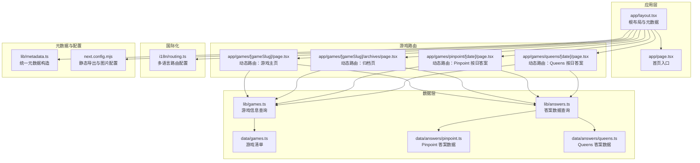
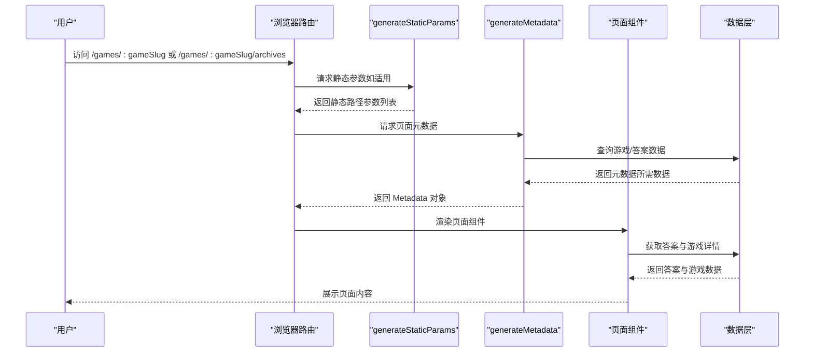
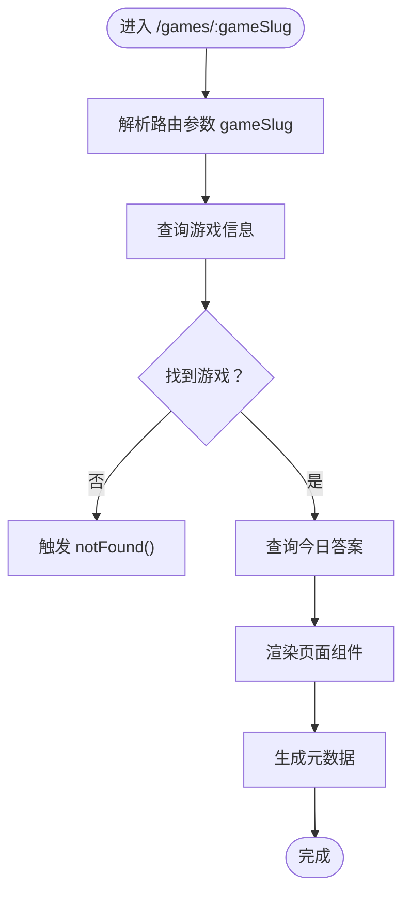
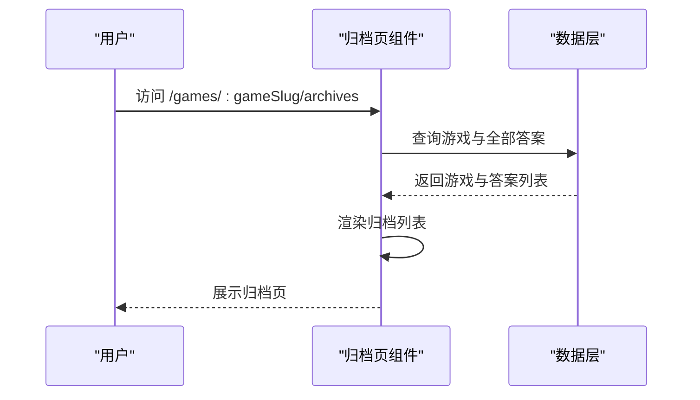
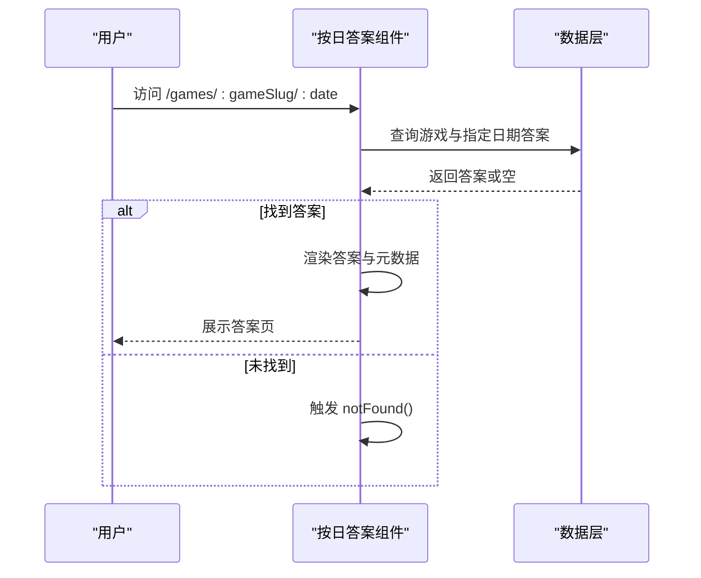
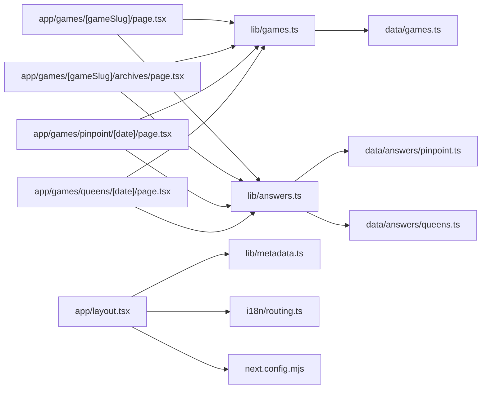

# 页面路由系统

<cite>
**本文引用的文件**
- [app/layout.tsx](file://app/layout.tsx)
- [app/page.tsx](file://app/page.tsx)
- [next.config.mjs](file://next.config.mjs)
- [i18n/routing.ts](file://i18n/routing.ts)
- [lib/metadata.ts](file://lib/metadata.ts)
- [app/games/[gameSlug]/page.tsx](file://app/games/[gameSlug]/page.tsx)
- [app/games/[gameSlug]/archives/page.tsx](file://app/games/[gameSlug]/archives/page.tsx)
- [app/games/pinpoint/[date]/page.tsx](file://app/games/pinpoint/[date]/page.tsx)
- [app/games/queens/[date]/page.tsx](file://app/games/queens/[date]/page.tsx)
- [components/games/AnswerDisplay.tsx](file://components/games/AnswerDisplay.tsx)
- [lib/answers.ts](file://lib/answers.ts)
- [lib/games.ts](file://lib/games.ts)
- [data/games.ts](file://data/games.ts)
- [data/answers/pinpoint.ts](file://data/answers/pinpoint.ts)
- [data/answers/queens.ts](file://data/answers/queens.ts)
</cite>

## 目录
1. [引言](#引言)
2. [项目结构](#项目结构)
3. [核心组件](#核心组件)
4. [架构总览](#架构总览)
5. [详细组件分析](#详细组件分析)
6. [依赖关系分析](#依赖关系分析)
7. [性能考虑](#性能考虑)
8. [故障排查指南](#故障排查指南)
9. [结论](#结论)
10. [附录](#附录)

## 引言
本文件系统性梳理该 Next.js App Router 项目的页面路由体系，重点覆盖以下方面：
- 动态路由 [date] 与 [gameSlug] 的实现原理、路由参数解析与页面渲染流程
- 静态生成（SSG）策略：预渲染、增量静态再生（ISR）与缓存管理
- 元数据管理、SEO 优化与结构化数据（Schema.org）
- 路由配置示例、页面组件结构与数据获取模式
- 路由守卫、权限控制与错误处理机制
- 路由性能优化、预加载策略与用户体验提升

## 项目结构
该项目采用 Next.js App Router 的目录约定式路由，页面位于 app 目录下，按功能模块组织子目录。根布局负责全局样式、主题、分析脚本与页头页脚；各游戏页面通过动态段实现按日期或游戏名的路由。

图表来源
- [app/layout.tsx](file://app/layout.tsx#L1-L78)
- [app/page.tsx](file://app/page.tsx#L1-L6)
- [i18n/routing.ts](file://i18n/routing.ts#L1-L37)
- [lib/metadata.ts](file://lib/metadata.ts#L1-L78)
- [next.config.mjs](file://next.config.mjs#L1-L28)
- [lib/games.ts](file://lib/games.ts#L1-L15)
- [lib/answers.ts](file://lib/answers.ts#L1-L42)
- [data/games.ts](file://data/games.ts#L1-L29)
- [data/answers/pinpoint.ts](file://data/answers/pinpoint.ts#L1-L139)
- [data/answers/queens.ts](file://data/answers/queens.ts#L1-L59)

章节来源
- [app/layout.tsx](file://app/layout.tsx#L1-L78)
- [app/page.tsx](file://app/page.tsx#L1-L6)
- [next.config.mjs](file://next.config.mjs#L1-L28)
- [i18n/routing.ts](file://i18n/routing.ts#L1-L37)
- [lib/metadata.ts](file://lib/metadata.ts#L1-L78)

## 核心组件
- 根布局与元数据
  - 根布局负责注入全局样式、主题切换、页头页脚、分析脚本与视口配置；同时通过 generateMetadata 提供统一的 SEO 元数据。
  - 元数据工具函数支持标题、描述、Open Graph、Twitter Card、robots 等字段的标准化构建。
- 游戏动态路由
  - [gameSlug] 路由用于展示某游戏的今日答案与历史归档；[date] 路由用于按日期展示具体答案。
- 数据层
  - lib/games.ts 与 lib/answers.ts 提供游戏与答案的查询接口；data 下的数据文件提供静态数据源。
- 组件层
  - AnswerDisplay 负责答案内容渲染（含图片、提示、线索等）。

章节来源
- [app/layout.tsx](file://app/layout.tsx#L18-L26)
- [lib/metadata.ts](file://lib/metadata.ts#L14-L78)
- [app/games/[gameSlug]/page.tsx](file://app/games/[gameSlug]/page.tsx#L14-L43)
- [app/games/[gameSlug]/archives/page.tsx](file://app/games/[gameSlug]/archives/page.tsx#L11-L40)
- [app/games/pinpoint/[date]/page.tsx](file://app/games/pinpoint/[date]/page.tsx#L14-L50)
- [app/games/queens/[date]/page.tsx](file://app/games/queens/[date]/page.tsx#L14-L50)
- [lib/games.ts](file://lib/games.ts#L1-L15)
- [lib/answers.ts](file://lib/answers.ts#L1-L42)
- [components/games/AnswerDisplay.tsx](file://components/games/AnswerDisplay.tsx#L1-L65)

## 架构总览
该路由系统遵循 Next.js App Router 的约定式路由与服务端渲染/静态生成能力，结合自定义元数据与国际化配置，形成可扩展、可维护的页面层架构。

图表来源
- [app/games/[gameSlug]/page.tsx](file://app/games/[gameSlug]/page.tsx#L14-L43)
- [app/games/[gameSlug]/archives/page.tsx](file://app/games/[gameSlug]/archives/page.tsx#L11-L40)
- [lib/metadata.ts](file://lib/metadata.ts#L14-L78)
- [lib/games.ts](file://lib/games.ts#L1-L15)
- [lib/answers.ts](file://lib/answers.ts#L1-L42)

## 详细组件分析

### 动态路由 [gameSlug]：游戏主页
- 实现要点
  - 使用 generateStaticParams 基于游戏列表生成静态页面参数，确保首页与各游戏页在构建时预渲染。
  - generateMetadata 动态读取当前游戏信息，生成标题、描述与 Canonical URL。
  - 页面根据是否为静态导出模式决定仅显示“今日答案”，并提供历史归档列表。
- 参数与渲染
  - 路由参数 gameSlug 通过 params 解析，调用 getGame 与 getTodayAnswer 获取数据。
  - 若无对应游戏，触发 notFound 错误处理。
- 结构化数据
  - 页面内嵌入结构化数据组件以增强 SEO。

图表来源
- [app/games/[gameSlug]/page.tsx](file://app/games/[gameSlug]/page.tsx#L14-L61)
- [lib/games.ts](file://lib/games.ts#L8-L10)
- [lib/answers.ts](file://lib/answers.ts#L14-L26)

章节来源
- [app/games/[gameSlug]/page.tsx](file://app/games/[gameSlug]/page.tsx#L1-L115)
- [lib/metadata.ts](file://lib/metadata.ts#L14-L78)
- [lib/games.ts](file://lib/games.ts#L1-L15)
- [lib/answers.ts](file://lib/answers.ts#L1-L42)

### 动态路由 [gameSlug]/archives：归档页
- 实现要点
  - 同样基于 generateStaticParams 生成静态归档页。
  - generateMetadata 为归档页生成合适的标题与描述。
  - 页面渲染归档列表，供用户浏览历史答案。
- 错误处理
  - 当游戏不存在时触发 notFound。

图表来源
- [app/games/[gameSlug]/archives/page.tsx](file://app/games/[gameSlug]/archives/page.tsx#L11-L50)
- [lib/games.ts](file://lib/games.ts#L1-L15)
- [lib/answers.ts](file://lib/answers.ts#L36-L41)

章节来源
- [app/games/[gameSlug]/archives/page.tsx](file://app/games/[gameSlug]/archives/page.tsx#L1-L67)

### 动态路由 [date]：按日答案（Pinpoint 与 Queens）
- 实现要点
  - 两个游戏均通过 generateStaticParams 基于答案列表生成静态页面。
  - generateMetadata 动态根据日期与游戏信息生成标题、描述与 Canonical URL。
  - 页面根据日期查询答案，若无则触发 notFound。
- 数据来源
  - Pinpoint：来自 data/answers/pinpoint.ts
  - Queens：来自 data/answers/queens.ts

图表来源
- [app/games/pinpoint/[date]/page.tsx](file://app/games/pinpoint/[date]/page.tsx#L14-L59)
- [app/games/queens/[date]/page.tsx](file://app/games/queens/[date]/page.tsx#L14-L59)
- [lib/answers.ts](file://lib/answers.ts#L28-L34)
- [data/answers/pinpoint.ts](file://data/answers/pinpoint.ts#L1-L139)
- [data/answers/queens.ts](file://data/answers/queens.ts#L1-L59)

章节来源
- [app/games/pinpoint/[date]/page.tsx](file://app/games/pinpoint/[date]/page.tsx#L1-L90)
- [app/games/queens/[date]/page.tsx](file://app/games/queens/[date]/page.tsx#L1-L90)
- [lib/answers.ts](file://lib/answers.ts#L1-L42)
- [data/answers/pinpoint.ts](file://data/answers/pinpoint.ts#L1-L139)
- [data/answers/queens.ts](file://data/answers/queens.ts#L1-L59)

### 元数据管理与 SEO 优化
- 元数据统一构造
  - constructMetadata 支持标题、描述、Open Graph、Twitter Card、robots 等字段，自动拼接站点基础 URL 与 Canonical。
- 根布局集成
  - RootLayout 中通过 generateMetadata 注入首页元数据，保证默认页面 SEO 基线。
- 页面级元数据
  - 各页面通过 generateMetadata 动态生成针对具体游戏与日期的元数据，提升搜索可见性与分享体验。

章节来源
- [lib/metadata.ts](file://lib/metadata.ts#L14-L78)
- [app/layout.tsx](file://app/layout.tsx#L18-L26)
- [app/games/[gameSlug]/page.tsx](file://app/games/[gameSlug]/page.tsx#L21-L43)
- [app/games/[gameSlug]/archives/page.tsx](file://app/games/[gameSlug]/archives/page.tsx#L18-L40)
- [app/games/pinpoint/[date]/page.tsx](file://app/games/pinpoint/[date]/page.tsx#L19-L50)
- [app/games/queens/[date]/page.tsx](file://app/games/queens/[date]/page.tsx#L19-L50)

### 结构化数据（Schema.org）
- 页面内嵌结构化数据组件，用于向搜索引擎提供更丰富的页面语义信息，提升摘要与卡片展示质量。
- 该实践与元数据配合，进一步增强 SEO 表现。

章节来源
- [app/games/[gameSlug]/page.tsx](file://app/games/[gameSlug]/page.tsx#L73-L73)
- [app/games/[gameSlug]/archives/page.tsx](file://app/games/[gameSlug]/archives/page.tsx#L52-L52)
- [app/games/pinpoint/[date]/page.tsx](file://app/games/pinpoint/[date]/page.tsx#L71-L71)
- [app/games/queens/[date]/page.tsx](file://app/games/queens/[date]/page.tsx#L71-L71)

### 国际化与路由守卫
- 多语言路由
  - i18n/routing.ts 定义支持的语言、默认语言与前缀策略，并导出轻量封装的导航 API（Link、redirect、usePathname、useRouter、getPathname）。
- 守卫与重定向
  - 可通过 createNavigation 导出的 redirect 在服务端进行语言检测后的重定向，实现语言守卫。
- 自动检测
  - 通过环境变量控制是否启用自动语言检测，避免硬编码语言前缀带来的复杂度。

章节来源
- [i18n/routing.ts](file://i18n/routing.ts#L1-L37)

### 错误处理机制
- notFound 触发
  - 当游戏或答案不存在时，页面组件调用 notFound()，Next.js 将返回 404 并渲染 404 页面。
- 根布局与页面级错误
  - 根布局与各页面均具备独立的错误分支，确保在不同层级都能优雅降级。

章节来源
- [app/games/[gameSlug]/page.tsx](file://app/games/[gameSlug]/page.tsx#L49-L51)
- [app/games/[gameSlug]/archives/page.tsx](file://app/games/[gameSlug]/archives/page.tsx#L46-L48)
- [app/games/pinpoint/[date]/page.tsx](file://app/games/pinpoint/[date]/page.tsx#L57-L59)
- [app/games/queens/[date]/page.tsx](file://app/games/queens/[date]/page.tsx#L57-L59)

### 数据获取模式与页面渲染
- 服务端渲染/静态生成
  - 通过 generateStaticParams 与 generateMetadata，页面在构建期或请求期生成静态 HTML 与元数据，降低运行时开销。
- 组件渲染
  - AnswerDisplay 负责答案内容渲染，包含图片、提示与线索等，提升阅读体验。
- 静态导出模式
  - next.config.mjs 启用静态导出与图片优化配置，适配静态托管场景。

章节来源
- [app/games/[gameSlug]/page.tsx](file://app/games/[gameSlug]/page.tsx#L14-L19)
- [app/games/[gameSlug]/archives/page.tsx](file://app/games/[gameSlug]/archives/page.tsx#L11-L16)
- [app/games/pinpoint/[date]/page.tsx](file://app/games/pinpoint/[date]/page.tsx#L14-L17)
- [app/games/queens/[date]/page.tsx](file://app/games/queens/[date]/page.tsx#L14-L17)
- [components/games/AnswerDisplay.tsx](file://components/games/AnswerDisplay.tsx#L1-L65)
- [next.config.mjs](file://next.config.mjs#L1-L28)

## 依赖关系分析
- 组件耦合
  - 页面组件依赖 lib/games.ts 与 lib/answers.ts 进行数据查询；数据查询再依赖 data 下的静态数据文件。
- 外部依赖
  - 元数据构造依赖 siteConfig；国际化依赖 next-intl；静态导出依赖 Next.js 输出配置。
- 可能的循环依赖
  - 当前结构清晰，页面组件不直接反向依赖数据层，避免循环依赖风险。

图表来源
- [app/games/[gameSlug]/page.tsx](file://app/games/[gameSlug]/page.tsx#L1-L12)
- [app/games/[gameSlug]/archives/page.tsx](file://app/games/[gameSlug]/archives/page.tsx#L1-L9)
- [app/games/pinpoint/[date]/page.tsx](file://app/games/pinpoint/[date]/page.tsx#L1-L12)
- [app/games/queens/[date]/page.tsx](file://app/games/queens/[date]/page.tsx#L1-L12)
- [lib/games.ts](file://lib/games.ts#L1-L15)
- [lib/answers.ts](file://lib/answers.ts#L1-L42)
- [data/games.ts](file://data/games.ts#L1-L29)
- [data/answers/pinpoint.ts](file://data/answers/pinpoint.ts#L1-L139)
- [data/answers/queens.ts](file://data/answers/queens.ts#L1-L59)
- [app/layout.tsx](file://app/layout.tsx#L1-L16)
- [lib/metadata.ts](file://lib/metadata.ts#L1-L78)
- [i18n/routing.ts](file://i18n/routing.ts#L1-L37)
- [next.config.mjs](file://next.config.mjs#L1-L28)

章节来源
- [lib/games.ts](file://lib/games.ts#L1-L15)
- [lib/answers.ts](file://lib/answers.ts#L1-L42)
- [data/games.ts](file://data/games.ts#L1-L29)
- [data/answers/pinpoint.ts](file://data/answers/pinpoint.ts#L1-L139)
- [data/answers/queens.ts](file://data/answers/queens.ts#L1-L59)

## 性能考虑
- 静态生成与预渲染
  - generateStaticParams 为每个游戏与日期生成静态页面，减少运行时计算与数据库访问。
- 缓存与增量更新
  - 在静态托管环境下，建议结合 CDN 缓存策略；对于需要实时性的内容，可在数据层引入增量更新机制（例如基于时间窗口的重建）。
- 图片优化
  - 静态导出模式下需禁用图片优化，确保资源正确加载；生产环境可启用优化以提升加载速度。
- 预加载策略
  - 对热门游戏与日期页面，可在导航前进行预加载，缩短首屏等待时间。
- 用户体验
  - 使用骨架屏与渐进式渲染，结合结构化数据与元数据，提升首屏 SEO 与可发现性。

章节来源
- [app/games/[gameSlug]/page.tsx](file://app/games/[gameSlug]/page.tsx#L14-L19)
- [app/games/[gameSlug]/archives/page.tsx](file://app/games/[gameSlug]/archives/page.tsx#L11-L16)
- [app/games/pinpoint/[date]/page.tsx](file://app/games/pinpoint/[date]/page.tsx#L14-L17)
- [app/games/queens/[date]/page.tsx](file://app/games/queens/[date]/page.tsx#L14-L17)
- [next.config.mjs](file://next.config.mjs#L5-L16)

## 故障排查指南
- 404 页面
  - 当游戏或答案不存在时会触发 notFound。检查 getGame 与 getAnswerByDate 的输入参数与数据源。
- 元数据异常
  - 若标题或描述不符合预期，检查 generateMetadata 的参数与 constructMetadata 的字段拼接逻辑。
- 国际化跳转问题
  - 若语言检测导致意外重定向，检查 i18n/routing.ts 的 localeDetection 与 localePrefix 设置。
- 静态导出图片加载失败
  - 确认 next.config.mjs 的 images.unoptimized 与 remotePatterns 配置是否符合部署环境。

章节来源
- [app/games/[gameSlug]/page.tsx](file://app/games/[gameSlug]/page.tsx#L49-L51)
- [app/games/[gameSlug]/archives/page.tsx](file://app/games/[gameSlug]/archives/page.tsx#L46-L48)
- [app/games/pinpoint/[date]/page.tsx](file://app/games/pinpoint/[date]/page.tsx#L57-L59)
- [app/games/queens/[date]/page.tsx](file://app/games/queens/[date]/page.tsx#L57-L59)
- [lib/metadata.ts](file://lib/metadata.ts#L14-L78)
- [i18n/routing.ts](file://i18n/routing.ts#L20-L22)
- [next.config.mjs](file://next.config.mjs#L5-L16)

## 结论
该路由系统通过 App Router 的动态路由、静态生成与元数据统一管理，实现了高性能、可维护且利于 SEO 的页面层架构。结合国际化配置与结构化数据，能够稳定支撑多语言、多游戏、多日期的答案展示场景。建议在现有基础上持续完善增量更新与预加载策略，以进一步提升性能与用户体验。

## 附录
- 路由配置示例
  - 动态段：[gameSlug]、[date]
  - 生成静态参数：generateStaticParams
  - 生成元数据：generateMetadata
- 页面组件结构
  - 游戏主页：[app/games/[gameSlug]/page.tsx](file://app/games/[gameSlug]/page.tsx#L1-L115)
  - 归档页：[app/games/[gameSlug]/archives/page.tsx](file://app/games/[gameSlug]/archives/page.tsx#L1-L67)
  - 按日答案（Pinpoint）：[app/games/pinpoint/[date]/page.tsx](file://app/games/pinpoint/[date]/page.tsx#L1-L90)
  - 按日答案（Queens）：[app/games/queens/[date]/page.tsx](file://app/games/queens/[date]/page.tsx#L1-L90)
- 数据获取模式
  - 游戏查询：[lib/games.ts](file://lib/games.ts#L1-L15)
  - 答案查询：[lib/answers.ts](file://lib/answers.ts#L1-L42)
  - 静态数据源：[data/games.ts](file://data/games.ts#L1-L29)、[data/answers/pinpoint.ts](file://data/answers/pinpoint.ts#L1-L139)、[data/answers/queens.ts](file://data/answers/queens.ts#L1-L59)
- 元数据与国际化
  - 元数据构造：[lib/metadata.ts](file://lib/metadata.ts#L1-L78)
  - 国际化路由：[i18n/routing.ts](file://i18n/routing.ts#L1-L37)
  - 静态导出配置：[next.config.mjs](file://next.config.mjs#L1-L28)