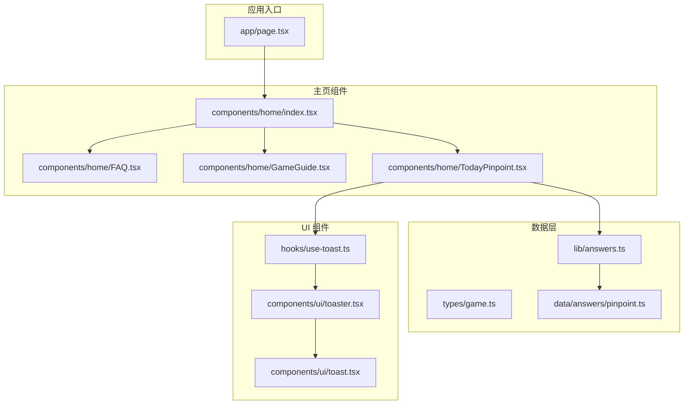
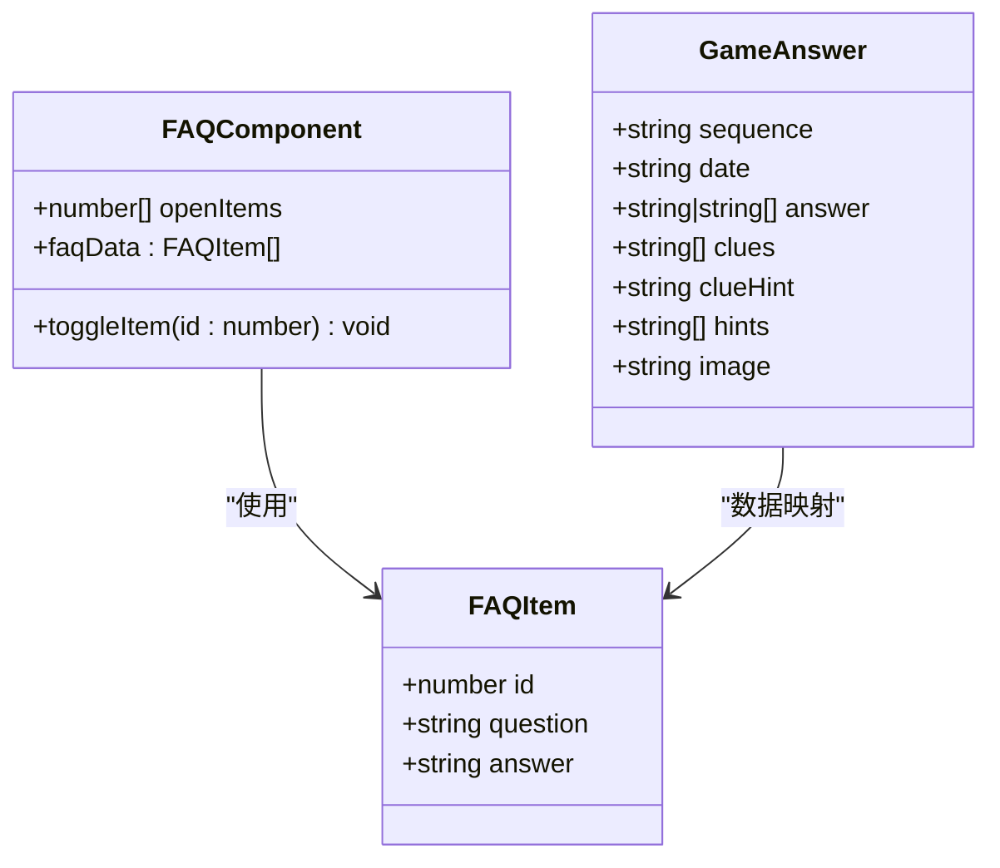
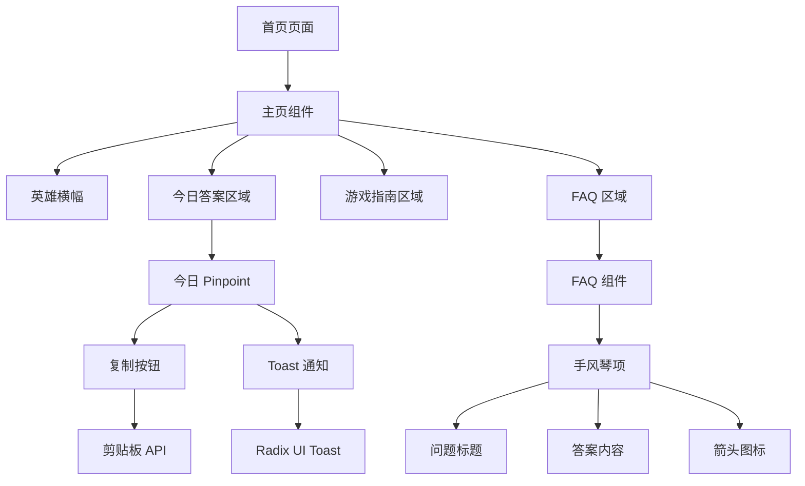
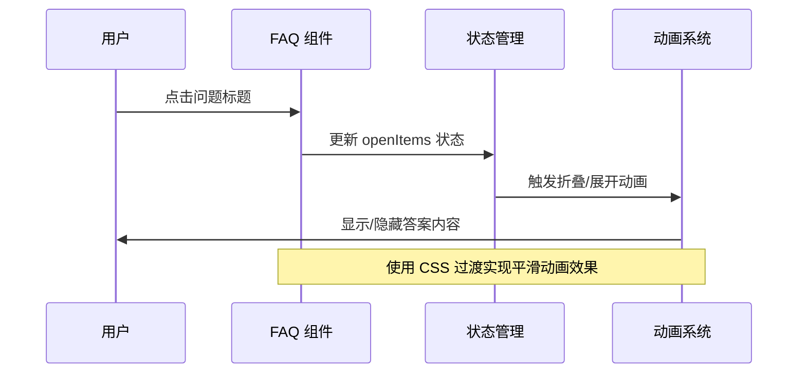
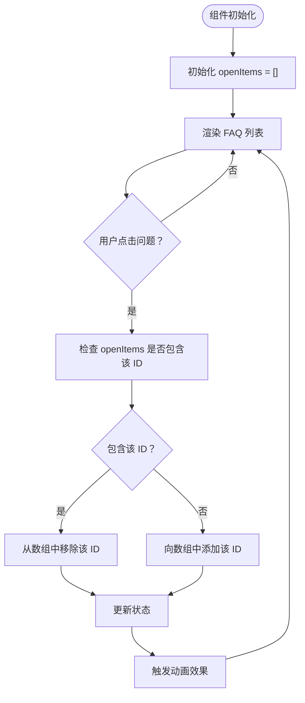
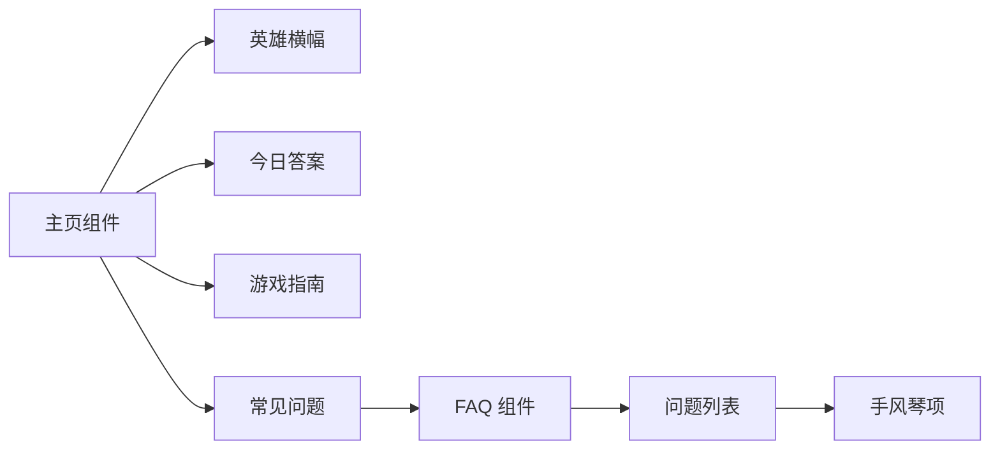
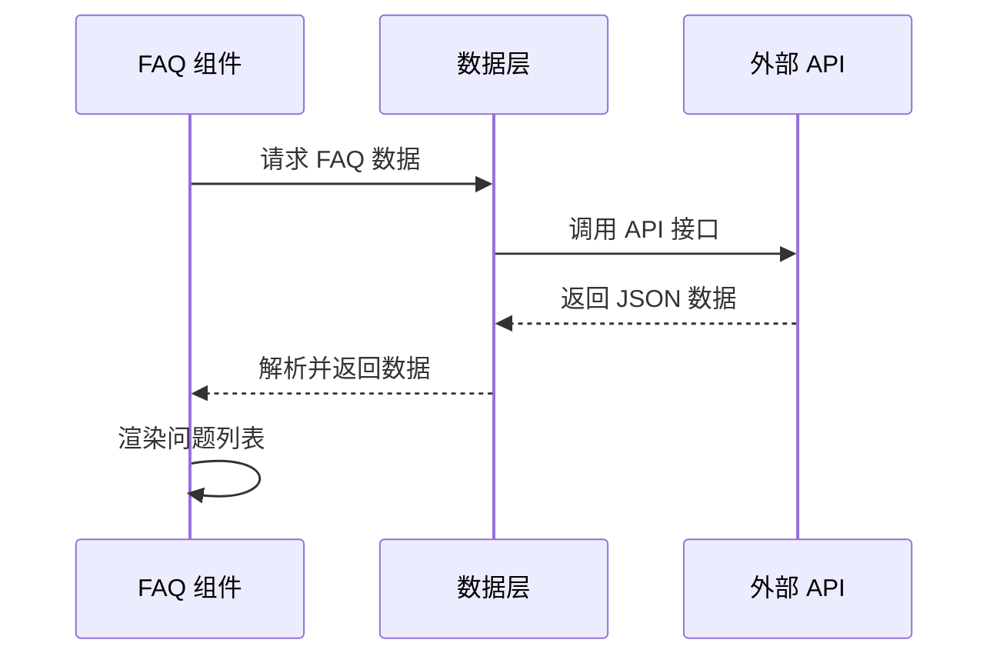
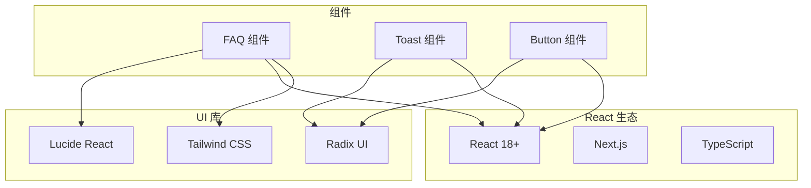
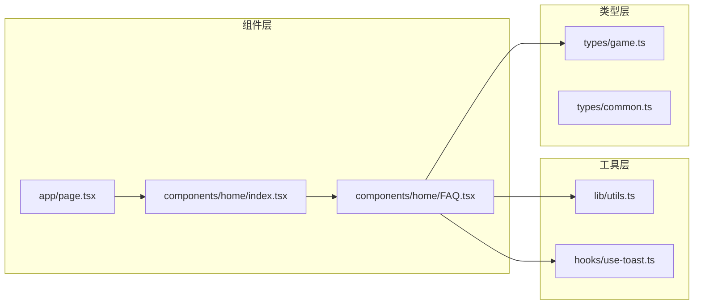

# FAQ 常见问题组件

<cite>
**本文档引用的文件**
- [components/home/FAQ.tsx](file://components/home/FAQ.tsx)
- [components/home/index.tsx](file://components/home/index.tsx)
- [app/page.tsx](file://app/page.tsx)
- [lib/answers.ts](file://lib/answers.ts)
- [types/game.ts](file://types/game.ts)
- [data/answers/pinpoint.ts](file://data/answers/pinpoint.ts)
- [components/home/TodayPinpoint.tsx](file://components/home/TodayPinpoint.tsx)
- [components/ui/toaster.tsx](file://components/ui/toaster.tsx)
- [components/ui/toast.tsx](file://components/ui/toast.tsx)
- [hooks/use-toast.ts](file://hooks/use-toast.ts)
- [styles/globals.css](file://styles/globals.css)
</cite>

## 目录
1. [简介](#简介)
2. [项目结构](#项目结构)
3. [核心组件](#核心组件)
4. [架构概览](#架构概览)
5. [详细组件分析](#详细组件分析)
6. [依赖关系分析](#依赖关系分析)
7. [性能考虑](#性能考虑)
8. [故障排除指南](#故障排除指南)
9. [结论](#结论)

## 简介

FAQ（常见问题）组件是 LinkedIn Answer 网站中的一个重要功能模块，为用户提供关于 LinkedIn 游戏（特别是 Pinpoint 游戏）的常见问题解答。该组件采用响应式设计，支持折叠展开功能，提供良好的用户体验。

## 项目结构

该项目基于 Next.js 构建，采用模块化组件架构。FAQ 组件位于 `components/home/` 目录下，与游戏指南、今日答案等其他主页组件共同构成完整的首页内容。

**图表来源**
- [app/page.tsx](file://app/page.tsx#L1-L6)
- [components/home/index.tsx](file://components/home/index.tsx#L1-L35)
- [components/home/FAQ.tsx](file://components/home/FAQ.tsx#L1-L116)

**章节来源**
- [app/page.tsx](file://app/page.tsx#L1-L6)
- [components/home/index.tsx](file://components/home/index.tsx#L1-L35)

## 核心组件

### FAQ 组件架构

FAQ 组件采用函数式组件设计，使用 React 的 useState Hook 来管理折叠状态。组件包含以下核心特性：

- **动态数据绑定**：从本地数组中获取问题和答案数据
- **交互式折叠**：每个 FAQ 项都可以独立展开/收起
- **动画效果**：使用 CSS 过渡动画提供流畅的用户体验
- **响应式设计**：适配不同屏幕尺寸

### 数据结构设计

**图表来源**
- [components/home/FAQ.tsx](file://components/home/FAQ.tsx#L6-L10)
- [types/game.ts](file://types/game.ts#L5-L13)

**章节来源**
- [components/home/FAQ.tsx](file://components/home/FAQ.tsx#L1-L116)
- [types/game.ts](file://types/game.ts#L1-L27)

## 架构概览

### 组件层次结构

**图表来源**
- [components/home/index.tsx](file://components/home/index.tsx#L8-L34)
- [components/home/TodayPinpoint.tsx](file://components/home/TodayPinpoint.tsx#L14-L216)
- [components/home/FAQ.tsx](file://components/home/FAQ.tsx#L51-L116)

### 数据流架构

**图表来源**
- [components/home/FAQ.tsx](file://components/home/FAQ.tsx#L54-L58)
- [components/home/FAQ.tsx](file://components/home/FAQ.tsx#L97-L102)

## 详细组件分析

### FAQ 组件实现细节

#### 状态管理机制

FAQ 组件使用 React 的 useState Hook 来管理当前展开的问题列表。状态结构为数字数组，每个数字对应特定问题的 ID。

**图表来源**
- [components/home/FAQ.tsx](file://components/home/FAQ.tsx#L52-L58)

#### 样式系统架构

组件采用 Tailwind CSS 类名系统，结合深色模式支持，提供丰富的视觉效果：

- **边框系统**：使用蓝色调边框，支持浅色和深色模式
- **渐变背景**：从浅蓝到白色的渐变效果
- **阴影效果**：多层次阴影增强立体感
- **动画过渡**：300ms 缓动动画提供流畅体验

#### 图标集成

使用 Lucide React 图标库，包括：
- HelpCircle：帮助图标
- ChevronDown：向下箭头，用于指示可展开状态

**章节来源**
- [components/home/FAQ.tsx](file://components/home/FAQ.tsx#L1-L116)

### 与其他组件的集成

#### 与主页组件的关系

FAQ 组件作为主页组件的一部分，通过统一的布局结构集成到整个页面中：

**图表来源**
- [components/home/index.tsx](file://components/home/index.tsx#L12-L32)

#### 与数据层的交互

虽然 FAQ 组件当前使用本地静态数据，但其架构设计允许轻松集成外部数据源：

**图表来源**
- [lib/answers.ts](file://lib/answers.ts#L14-L26)

**章节来源**
- [components/home/index.tsx](file://components/home/index.tsx#L1-L35)
- [lib/answers.ts](file://lib/answers.ts#L1-L42)

## 依赖关系分析

### 外部依赖

**图表来源**
- [components/home/FAQ.tsx](file://components/home/FAQ.tsx#L3-L4)
- [components/ui/toast.tsx](file://components/ui/toast.tsx#L4-L6)

### 内部依赖关系

**图表来源**
- [app/page.tsx](file://app/page.tsx#L1-L6)
- [components/home/index.tsx](file://components/home/index.tsx#L1-L7)

**章节来源**
- [components/home/FAQ.tsx](file://components/home/FAQ.tsx#L1-L116)
- [components/home/index.tsx](file://components/home/index.tsx#L1-L35)

## 性能考虑

### 渲染优化

- **条件渲染**：仅在需要时渲染展开的内容
- **CSS 过渡**：使用硬件加速的 CSS 属性进行动画
- **事件处理**：使用防抖技术避免频繁的状态更新

### 内存管理

- **状态最小化**：只存储必要的展开状态信息
- **组件卸载**：确保组件卸载时清理相关事件监听器

### 加载性能

- **懒加载**：可以考虑对不常用的功能进行懒加载
- **代码分割**：利用 Next.js 的自动代码分割功能

## 故障排除指南

### 常见问题及解决方案

#### 折叠动画不工作

**症状**：点击问题标题时没有动画效果

**可能原因**：
- CSS 类名冲突
- JavaScript 错误阻止了状态更新
- 浏览器兼容性问题

**解决方案**：
1. 检查浏览器控制台是否有 JavaScript 错误
2. 验证 CSS 类名是否正确应用
3. 确认浏览器支持所需的 CSS 属性

#### 状态同步问题

**症状**：多个 FAQ 项同时展开或收起

**可能原因**：
- 状态管理逻辑错误
- 事件处理器绑定问题

**解决方案**：
1. 检查 `toggleItem` 函数的逻辑实现
2. 确保每个问题项都有唯一的 ID
3. 验证事件处理器的正确绑定

#### 响应式布局问题

**症状**：在移动设备上显示异常

**可能原因**：
- 断点设置不当
- 元视口配置问题

**解决方案**：
1. 检查 Tailwind CSS 断点配置
2. 验证移动端的样式覆盖
3. 测试不同屏幕尺寸下的表现

**章节来源**
- [components/home/FAQ.tsx](file://components/home/FAQ.tsx#L54-L58)
- [styles/globals.css](file://styles/globals.css#L1-L128)

## 结论

FAQ 常见问题组件是一个设计精良、功能完整的用户界面组件。它采用了现代化的 React 开发实践，结合了良好的用户体验设计原则。组件的主要优势包括：

1. **简洁的架构**：清晰的组件结构和单一职责原则
2. **优秀的用户体验**：流畅的动画效果和直观的交互设计
3. **可扩展性**：灵活的数据结构设计便于未来扩展
4. **响应式设计**：适配各种设备和屏幕尺寸
5. **可访问性**：良好的语义化标记和键盘导航支持

该组件为 LinkedIn Answer 网站提供了重要的用户支持功能，帮助用户更好地理解和使用 LinkedIn 游戏。通过持续的优化和维护，该组件将继续为用户提供优质的问答体验。