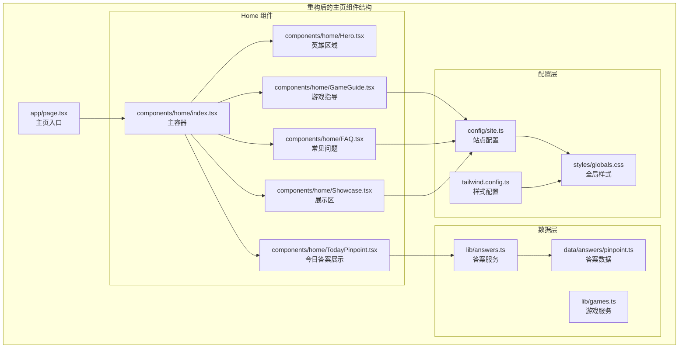
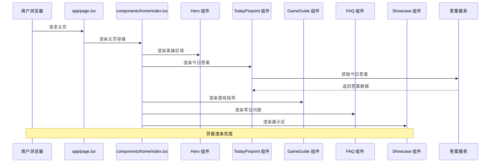
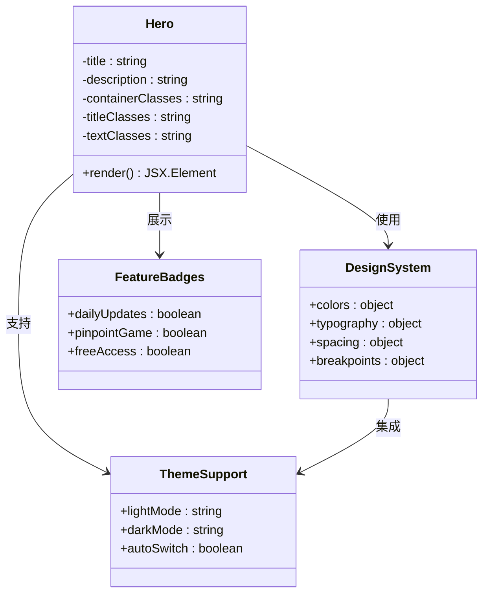
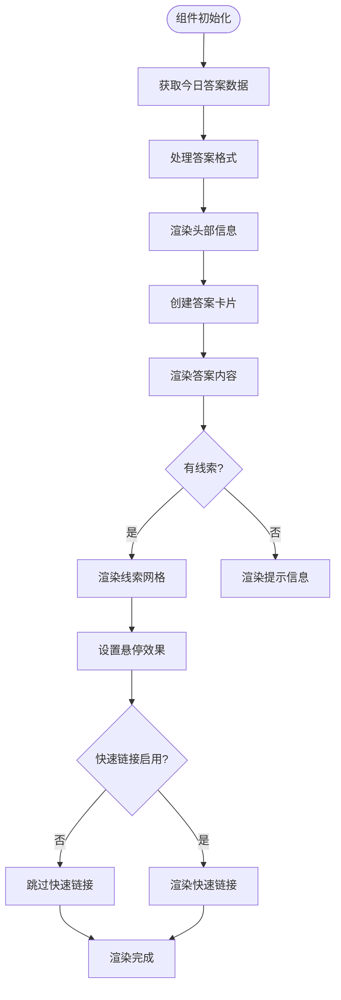
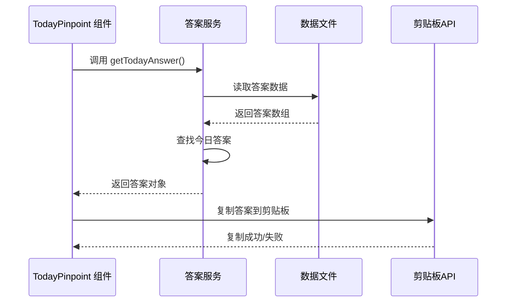
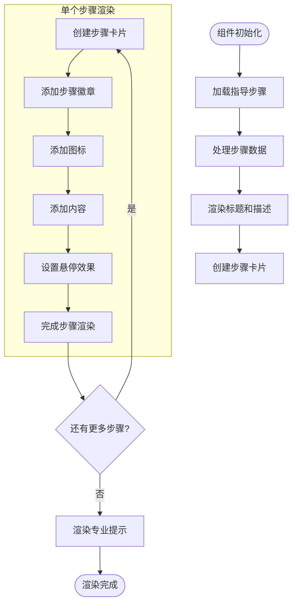
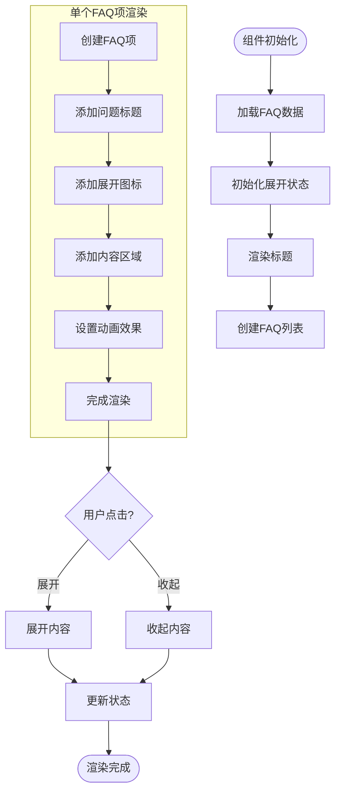
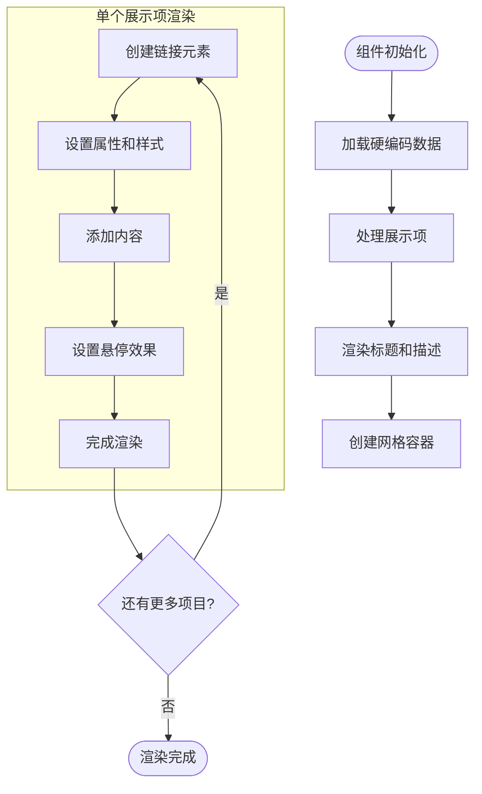
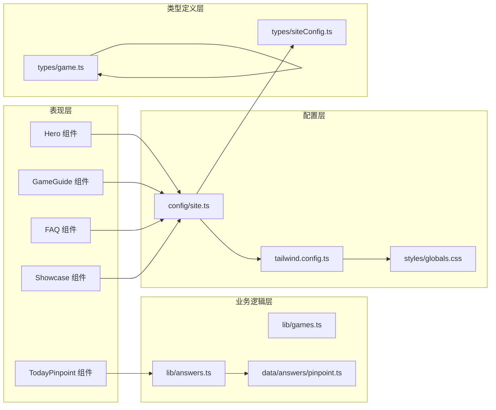
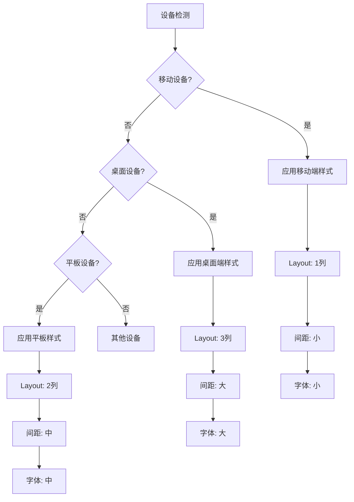

# 主页组件

<cite>
**本文档引用的文件**
- [components/home/Hero.tsx](file://components/home/Hero.tsx)
- [components/home/TodayPinpoint.tsx](file://components/home/TodayPinpoint.tsx)
- [components/home/GameGuide.tsx](file://components/home/GameGuide.tsx)
- [components/home/FAQ.tsx](file://components/home/FAQ.tsx)
- [components/home/Showcase.tsx](file://components/home/Showcase.tsx)
- [components/home/index.tsx](file://components/home/index.tsx)
- [app/page.tsx](file://app/page.tsx)
- [lib/games.ts](file://lib/games.ts)
- [lib/answers.ts](file://lib/answers.ts)
- [data/answers/pinpoint.ts](file://data/answers/pinpoint.ts)
- [types/game.ts](file://types/game.ts)
- [config/site.ts](file://config/site.ts)
- [styles/globals.css](file://styles/globals.css)
- [tailwind.config.ts](file://tailwind.config.ts)
- [hooks/use-toast.ts](file://hooks/use-toast.ts)
</cite>

## 更新摘要
**变更内容**
- 完全重构了主页布局，移除了游戏卡片展示区域，专注于教育内容和用户引导
- 新增了GameGuide组件，提供Pinpoint游戏的详细玩法指导
- 新增了FAQ组件，提供常见问题解答和用户支持
- 保留了Hero组件和TodayPinpoint组件的核心功能
- Showcase组件仍然存在，但现在位于页面底部作为附加内容

## 目录
1. [简介](#简介)
2. [项目结构](#项目结构)
3. [核心组件](#核心组件)
4. [架构概览](#架构概览)
5. [详细组件分析](#详细组件分析)
6. [依赖关系分析](#依赖关系分析)
7. [性能考虑](#性能考虑)
8. [故障排除指南](#故障排除指南)
9. [结论](#结论)
10. [附录](#附录)

## 简介

主页组件是该 Next.js 应用的核心入口，经过完全重构后，现在专注于提供教育内容和用户引导体验。新布局移除了游戏卡片展示区域，转而提供更丰富的学习资源和用户支持功能。

该主页组件采用现代化的设计理念，结合响应式布局、暗黑模式支持和品牌适配功能，为用户提供了一个专注、教育导向的界面体验。组件设计注重内容质量和用户引导，通过清晰的信息架构帮助用户更好地理解和享受LinkedIn Pinpoint游戏。

**更新** 主页布局已完全重构，现在包含Hero区域、TodayPinpoint答案展示、GameGuide游戏指导和FAQ用户支持四个核心教育组件，移除了原有的游戏卡片展示功能。

## 项目结构

主页组件位于 `components/home/` 目录下，采用模块化设计，每个组件都有明确的教育导向职责分工：

**图表来源**
- [app/page.tsx](file://app/page.tsx#L1-L6)
- [components/home/index.tsx](file://components/home/index.tsx#L1-L35)
- [components/home/Hero.tsx](file://components/home/Hero.tsx#L1-L41)
- [components/home/TodayPinpoint.tsx](file://components/home/TodayPinpoint.tsx#L1-L216)

**章节来源**
- [app/page.tsx](file://app/page.tsx#L1-L6)
- [components/home/index.tsx](file://components/home/index.tsx#L1-L35)

## 核心组件

### Hero 组件

Hero 组件是主页的视觉焦点，负责展示品牌信息和核心价值主张。该组件采用了简洁而有力的设计语言，通过精心调整的排版和间距来吸引用户的注意力。

**更新** 新增了徽章和功能标签，增强了品牌识别度和功能展示。

#### 设计特点
- **响应式标题系统**：使用 `text-3xl sm:text-4xl lg:text-6xl` 实现多层级字体缩放
- **居中对齐布局**：通过 `text-center` 和 `mx-auto` 实现视觉平衡
- **深浅色主题适配**：支持暗黑模式的自动切换 (`dark:text-gray-200`)
- **合理的内边距**：`pt-12 sm:pt-16 pb-8` 提供充足的顶部和底部留白
- **徽章系统**：新增每日更新徽章，提升品牌专业性

#### 内容结构
组件包含徽章、主要标题、副标题和功能标签四个部分，传达了应用的核心功能和价值定位。

**章节来源**
- [components/home/Hero.tsx](file://components/home/Hero.tsx#L1-L41)

### TodayPinpoint 组件

**新增** TodayPinpoint 组件是主页的核心功能组件，专门用于展示每日 Pinpoint 答案。

#### 功能特性
- **实时答案展示**：显示当天的 Pinpoint 答案和相关线索
- **复制功能**：支持一键复制答案到剪贴板
- **响应式设计**：适配各种屏幕尺寸的显示效果
- **交互式提示**：提供详细的答案解释和提示信息
- **导航集成**：提供跳转到完整游戏页面的链接

#### 数据管理
组件通过 `lib/answers.ts` 中的 `getTodayAnswer()` 函数获取最新的 Pinpoint 答案数据，支持多种答案格式（单个答案或多答案）。

**更新** 快速链接部分当前被注释掉，暂时不显示"查看归档"、"如何游玩"和"在 LinkedIn 上游玩"等快捷链接功能。

**章节来源**
- [components/home/TodayPinpoint.tsx](file://components/home/TodayPinpoint.tsx#L1-L216)

### GameGuide 组件

**新增** GameGuide 组件是主页的重要教育组件，提供Pinpoint游戏的详细玩法指导。

#### 功能特性
- **步骤化指导**：通过4个清晰的步骤帮助用户理解游戏机制
- **图标辅助**：每个步骤都配有相应的图标增强视觉表达
- **响应式布局**：在小屏幕上显示为单列，在大屏幕上显示为双列
- **交互式设计**：悬停时提供阴影和动画效果
- **专业提示**：提供专业的解题技巧和建议

#### 内容结构
组件包含观察线索、寻找连接、提交答案、查看结果四个核心步骤，每个步骤都有详细的说明和建议。

**章节来源**
- [components/home/GameGuide.tsx](file://components/home/GameGuide.tsx#L1-L102)

### FAQ 组件

**新增** FAQ 组件是主页的用户支持组件，提供常见问题的详细解答。

#### 功能特性
- **折叠式设计**：每个问题都可以独立展开和收起
- **动画过渡**：提供流畅的展开和收起动画效果
- **响应式交互**：支持键盘导航和触摸操作
- **状态管理**：使用React状态管理展开的项目
- **无障碍设计**：支持ARIA属性和屏幕阅读器

#### 内容覆盖
组件涵盖Pinpoint游戏介绍、玩法说明、使用目的、更新时间、历史答案和免费使用等常见问题。

**章节来源**
- [components/home/FAQ.tsx](file://components/home/FAQ.tsx#L1-L116)

### Showcase 组件

Showcase 组件展示了基于此模板构建的其他项目和产品，体现了社区生态和实际应用案例。

#### 功能特性
- **网格布局系统**：使用 `grid grid-cols-1 sm:grid-cols-2 lg:grid-cols-3` 实现响应式网格
- **悬停交互效果**：鼠标悬停时显示箭头图标和阴影效果
- **域名解析**：自动提取 URL 的主机名进行显示
- **外部链接处理**：正确设置 `target="_blank"` 和 `rel="noopener noreferrer"`
- **教育导向**：展示与本项目相关的教育和技术产品

#### 数据管理
组件使用硬编码的数据数组，包含12个不同的项目链接，涵盖了各种类型的产品和服务。

**章节来源**
- [components/home/Showcase.tsx](file://components/home/Showcase.tsx#L1-L103)

## 架构概览

主页组件的整体架构体现了清晰的关注点分离和模块化设计原则，现在更加专注于教育内容和用户引导：

**图表来源**
- [app/page.tsx](file://app/page.tsx#L1-L6)
- [components/home/index.tsx](file://components/home/index.tsx#L1-L35)
- [lib/answers.ts](file://lib/answers.ts#L14-L26)

## 详细组件分析

### Hero 组件深度分析

Hero 组件采用了极简主义设计理念，专注于内容传达而非装饰效果：

**图表来源**
- [components/home/Hero.tsx](file://components/home/Hero.tsx#L1-L41)
- [styles/globals.css](file://styles/globals.css#L32-L126)

#### 视觉设计要素
- **字体层次**：从移动端的 3xl 到桌面端的 6xl，提供渐进式的视觉体验
- **色彩系统**：使用 `text-slate-900 dark:text-gray-200` 确保在不同主题下的可读性
- **间距控制**：通过 `pt-12 sm:pt-16` 和 `pb-8` 创建合适的视觉节奏
- **徽章系统**：新增的徽章元素提升了品牌的专业性和时效性

**章节来源**
- [components/home/Hero.tsx](file://components/home/Hero.tsx#L1-L41)
- [styles/globals.css](file://styles/globals.css#L19-L28)

### TodayPinpoint 组件详细分析

**新增** TodayPinpoint 组件展现了强大的内容管理和展示能力：

**图表来源**
- [components/home/TodayPinpoint.tsx](file://components/home/TodayPinpoint.tsx#L14-L216)

#### 动态加载机制
组件通过 `lib/answers.ts` 中的 `getTodayAnswer()` 函数获取实时数据：

**图表来源**
- [components/home/TodayPinpoint.tsx](file://components/home/TodayPinpoint.tsx#L18-L71)
- [lib/answers.ts](file://lib/answers.ts#L14-L26)

**更新** 快速链接部分当前被注释，不会在页面中显示。如果需要恢复此功能，只需取消注释第184-212行的代码。

**章节来源**
- [components/home/TodayPinpoint.tsx](file://components/home/TodayPinpoint.tsx#L1-L216)

### GameGuide 组件详细分析

**新增** GameGuide 组件展现了教育内容组织的最佳实践：

**图表来源**
- [components/home/GameGuide.tsx](file://components/home/GameGuide.tsx#L41-L102)

#### 内容组织策略
组件通过4个精心设计的步骤帮助用户理解Pinpoint游戏：
1. **观察线索**：教授如何仔细分析5个线索词
2. **寻找连接**：指导如何发现线索之间的共同点
3. **提交答案**：提醒用户谨慎选择答案
4. **查看结果**：解释结果反馈的重要性

**章节来源**
- [components/home/GameGuide.tsx](file://components/home/GameGuide.tsx#L1-L102)

### FAQ 组件详细分析

**新增** FAQ 组件展现了用户支持设计的优秀实践：

**图表来源**
- [components/home/FAQ.tsx](file://components/home/FAQ.tsx#L51-L116)

#### 交互设计特点
- **状态管理**：使用React状态精确控制每个FAQ项的展开状态
- **动画效果**：提供流畅的展开和收起动画
- **无障碍设计**：支持键盘导航和屏幕阅读器
- **视觉反馈**：悬停时提供颜色和阴影变化

**章节来源**
- [components/home/FAQ.tsx](file://components/home/FAQ.tsx#L1-L116)

### Showcase 组件分析

Showcase 组件展现了内容展示和社区建设的最佳实践：

**图表来源**
- [components/home/Showcase.tsx](file://components/home/Showcase.tsx#L64-L103)

#### 社区建设策略
虽然当前版本使用硬编码数据，但组件设计允许轻松集成动态数据源，体现了社区生态建设的前瞻性设计。

**章节来源**
- [components/home/Showcase.tsx](file://components/home/Showcase.tsx#L1-L103)

## 依赖关系分析

主页组件的依赖关系展现了清晰的分层架构，现在更加专注于教育内容：

**图表来源**
- [components/home/Hero.tsx](file://components/home/Hero.tsx#L1-L41)
- [components/home/TodayPinpoint.tsx](file://components/home/TodayPinpoint.tsx#L1-L216)
- [components/home/GameGuide.tsx](file://components/home/GameGuide.tsx#L1-L102)
- [components/home/FAQ.tsx](file://components/home/FAQ.tsx#L1-L116)
- [components/home/Showcase.tsx](file://components/home/Showcase.tsx#L1-L103)
- [lib/answers.ts](file://lib/answers.ts#L1-L42)
- [lib/games.ts](file://lib/games.ts#L1-L15)
- [data/answers/pinpoint.ts](file://data/answers/pinpoint.ts#L1-L223)
- [config/site.ts](file://config/site.ts#L1-L45)
- [tailwind.config.ts](file://tailwind.config.ts#L1-L95)
- [styles/globals.css](file://styles/globals.css#L1-L128)
- [types/game.ts](file://types/game.ts#L1-L27)
- [types/siteConfig.ts](file://types/siteConfig.ts#L1-L33)

**章节来源**
- [config/site.ts](file://config/site.ts#L1-L45)
- [tailwind.config.ts](file://tailwind.config.ts#L1-L95)
- [styles/globals.css](file://styles/globals.css#L1-L128)

## 性能考虑

### 响应式设计策略

主页组件采用了多层次的响应式设计，确保在各种设备上都能提供最佳体验：

**图表来源**
- [components/home/Showcase.tsx](file://components/home/Showcase.tsx#L76-L98)
- [components/home/GameGuide.tsx](file://components/home/GameGuide.tsx#L61-L86)

### 性能优化技术

1. **懒加载策略**：组件按需渲染，避免不必要的计算
2. **CSS-in-JS 优化**：使用 Tailwind CSS 的原子化类名减少样式计算
3. **内存管理**：合理使用 React 的 key 属性确保高效更新
4. **渲染优化**：避免在渲染过程中进行昂贵的计算操作
5. **数据缓存**：答案数据通过服务层缓存减少重复请求

### 加载性能优化

- **首屏优化**：Hero 组件优先渲染，确保用户快速获得主要内容
- **渐进式增强**：TodayPinpoint、GameGuide、FAQ 组件在 Hero 后异步加载
- **缓存策略**：静态资源通过 CDN 缓存，减少重复加载
- **条件渲染**：只有当数据可用时才渲染 TodayPinpoint 组件
- **教育内容优先**：GameGuide 和 FAQ 组件提供即时的用户支持

**更新** 主页布局重构后，用户现在可以立即看到教育内容，包括游戏指导和常见问题解答，无需等待额外的加载时间。

## 故障排除指南

### 常见问题及解决方案

#### 样式不生效问题
**症状**：组件样式显示异常或主题切换无效
**解决方案**：
1. 检查 Tailwind 配置文件是否正确引入
2. 验证 CSS 变量是否在 `:root` 和 `.dark` 类中正确定义
3. 确认组件类名与 Tailwind 配置中的变体匹配

#### 响应式布局问题
**症状**：在某些屏幕尺寸下布局错乱
**解决方案**：
1. 检查断点配置是否符合预期
2. 验证容器宽度限制 (`max-w-7xl`) 是否合适
3. 确认网格系统的断点类名使用正确

#### 数据加载问题
**症状**：游戏列表为空或显示错误
**解决方案**：
1. 检查 `data/answers/pinpoint.ts` 文件中的数据格式
2. 验证 `lib/answers.ts` 中的数据访问函数
3. 确认类型定义与实际数据结构一致

#### TodayPinpoint 组件问题
**症状**：无法显示今日答案或复制功能失效
**解决方案**：
1. 检查 `lib/answers.ts` 中的 `getTodayAnswer()` 函数
2. 验证 `data/answers/pinpoint.ts` 中的答案数据格式
3. 确认剪贴板 API 在目标浏览器中的支持情况
4. 检查 `hooks/use-toast.ts` 中的 toast 通知功能

#### GameGuide 组件问题
**症状**：游戏指导内容不显示或格式错误
**解决方案**：
1. 检查 `components/home/GameGuide.tsx` 中的步骤数据
2. 验证图标组件的正确导入和使用
3. 确认样式类名与 Tailwind 配置匹配

#### FAQ 组件问题
**症状**：FAQ 无法展开或动画效果异常
**解决方案**：
1. 检查 `useState` hook 的状态管理
2. 验证动画类名和过渡效果
3. 确认事件处理器的正确绑定

**更新** 如果需要启用被注释的快速链接功能，只需取消注释 `components/home/TodayPinpoint.tsx` 第184-212行的代码。

**章节来源**
- [styles/globals.css](file://styles/globals.css#L32-L126)
- [tailwind.config.ts](file://tailwind.config.ts#L16-L18)
- [lib/answers.ts](file://lib/answers.ts#L1-L42)
- [hooks/use-toast.ts](file://hooks/use-toast.ts#L1-L50)

## 结论

主页组件经过完全重构后，展现了现代教育导向网站开发的最佳实践，通过精心设计的组件架构、专注的教育内容和用户引导策略，为用户提供了优秀的学习体验。

**更新** 主页布局已完全重构，移除了游戏卡片展示区域，专注于教育内容和用户支持。新布局包含四个核心组件：Hero区域提供品牌介绍，TodayPinpoint展示答案，GameGuide提供详细指导，FAQ提供用户支持，Showcase作为附加内容。核心功能保持完整，组件体系的主要优势包括：

- **教育导向设计**：专注于学习和用户引导，而非商业展示
- **模块化设计**：清晰的职责分离便于维护和扩展
- **响应式优先**：从移动端开始的设计理念确保多设备兼容性
- **性能优化**：合理的渲染策略和缓存机制提升加载速度
- **主题适配**：完善的明暗主题支持满足不同用户偏好
- **数据驱动**：动态答案获取确保内容的时效性和准确性
- **用户支持**：完整的FAQ系统提供即时的帮助和支持
- **开发友好**：注释机制便于功能的临时禁用和恢复

未来可以考虑的功能增强包括：恢复 TodayPinpoint 的快速链接功能、添加更多游戏支持、以及改进FAQ的交互体验。

## 附录

### 设计规范指南

#### 颜色系统
- **主色调**：基于 `--primary` CSS 变量定义
- **辅助色**：支持 10 种预定义颜色主题
- **状态色**：成功、警告、错误等状态的颜色定义
- **今日答案强调色**：蓝色系用于突出显示答案内容

#### 字体规范
- **标题字体**：使用 `font-display` 系列字体
- **正文字体**：基于系统字体栈
- **字号层级**：从 xs 到 6xl 的完整层级系统
- **功能标签字体**：使用较小字号突出功能特性

#### 间距系统
- **基础单位**：基于 `--spacing` CSS 变量
- **容器间距**：使用 `px-4 sm:px-6 lg:px-8` 的递进式间距
- **组件间距**：通过 `gap-6` 实现统一的网格间距
- **徽章间距**：使用 `mb-6` 确保徽章与内容的适当距离

#### 动画规范
- **过渡效果**：使用 `transition-all duration-300` 的统一过渡
- **悬停效果**：悬停时的阴影和颜色变化
- **加载动画**：可选的加载指示器组件
- **复制反馈**：使用 `transform` 和 `scale` 动画提供视觉反馈

### 定制化配置方案

#### 品牌适配
1. **颜色定制**：修改 `:root` 和 `.dark` 中的 CSS 变量
2. **字体替换**：通过 `font-sans`、`font-serif`、`font-mono` 变量定制
3. **图标定制**：替换默认图标组件以匹配品牌视觉
4. **徽章定制**：修改 Hero 组件中的徽章内容和样式

#### 内容定制
1. **Hero 文案**：修改 Hero 组件中的标题和描述文本
2. **GameGuide 步骤**：更新 `guideSteps` 数组添加新的指导内容
3. **FAQ 数据**：更新 `faqData` 数组添加新的问题和答案
4. **Showcase 数据**：更新 `showcaseItems` 数组添加新的项目链接

#### 响应式定制
1. **断点调整**：修改 `tailwind.config.ts` 中的断点配置
2. **网格调整**：根据内容密度调整网格列数
3. **间距调整**：根据设计需求调整整体间距系统

#### 功能扩展
1. **多游戏支持**：在 `components/home/index.tsx` 中添加更多游戏的 TodayPinpoint 组件
2. **自定义答案格式**：扩展 `types/game.ts` 中的 `GameAnswer` 类型定义
3. **国际化支持**：添加多语言支持以适配不同地区用户
4. **功能恢复**：取消注释以恢复被临时禁用的功能

**更新** 布局重构时的注意事项：
- 移除了 GameGrid 组件的导入和调用，专注于教育内容
- 激活了 GameGuide 和 FAQ 组件，提供完整的用户支持
- 保留了 Showcase 组件，但现在位于页面底部
- 恢复 TodayPinpoint 快速链接：取消注释 `components/home/TodayPinpoint.tsx` 第184-212行

**章节来源**
- [config/site.ts](file://config/site.ts#L34-L44)
- [styles/globals.css](file://styles/globals.css#L65-L79)
- [tailwind.config.ts](file://tailwind.config.ts#L16-L18)
- [types/game.ts](file://types/game.ts#L5-L27)
- [components/home/index.tsx](file://components/home/index.tsx#L1-L35)