# 游戏指南组件

<cite>
**本文档引用的文件**
- [components/home/GameGuide.tsx](file://components/home/GameGuide.tsx)
- [app/games/[gameSlug]/how-to-play/page.tsx](file://app/games/[gameSlug]/how-to-play/page.tsx)
- [components/home/index.tsx](file://components/home/index.tsx)
- [components/games/GameCard.tsx](file://components/games/GameCard.tsx)
- [components/games/CluesDisplay.tsx](file://components/games/CluesDisplay.tsx)
- [components/games/ArchivesList.tsx](file://components/games/ArchivesList.tsx)
- [components/home/TodayPinpoint.tsx](file://components/home/TodayPinpoint.tsx)
- [lib/games.ts](file://lib/games.ts)
- [lib/answers.ts](file://lib/answers.ts)
- [data/games.ts](file://data/games.ts)
- [data/answers/pinpoint.ts](file://data/answers/pinpoint.ts)
- [types/game.ts](file://types/game.ts)
- [app/page.tsx](file://app/page.tsx)
</cite>

## 目录
1. [简介](#简介)
2. [项目结构](#项目结构)
3. [核心组件](#核心组件)
4. [架构概览](#架构概览)
5. [详细组件分析](#详细组件分析)
6. [依赖关系分析](#依赖关系分析)
7. [性能考虑](#性能考虑)
8. [故障排除指南](#故障排除指南)
9. [结论](#结论)

## 简介

游戏指南组件是 LinkedIn Pinpoint 游戏网站的核心功能模块，为用户提供清晰、直观的游戏玩法指导。该组件采用响应式设计，支持深色模式切换，提供四个主要的游戏步骤指导：观察线索、寻找关联、提交答案和查看结果。

该项目基于 Next.js 构建，使用 TypeScript 进行类型安全开发，采用 Tailwind CSS 进行样式管理，并集成了多种现代化的前端技术栈。

## 项目结构

项目采用模块化的文件组织结构，游戏指南组件位于 `components/home/GameGuide.tsx`，与游戏相关的其他组件分布在相应的子目录中：

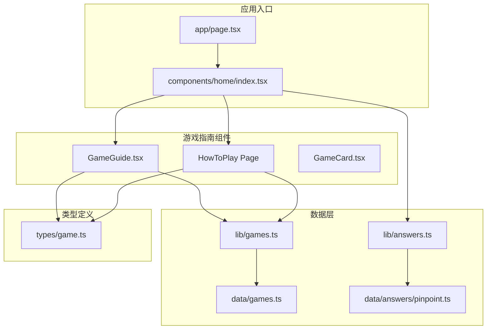

**图表来源**
- [app/page.tsx](file://app/page.tsx#L1-L6)
- [components/home/index.tsx](file://components/home/index.tsx#L1-L35)
- [components/home/GameGuide.tsx](file://components/home/GameGuide.tsx#L1-L102)

**章节来源**
- [app/page.tsx](file://app/page.tsx#L1-L6)
- [components/home/index.tsx](file://components/home/index.tsx#L1-L35)

## 核心组件

游戏指南组件系统由多个相互协作的组件构成，每个组件都有明确的职责分工：

### 主要组件架构

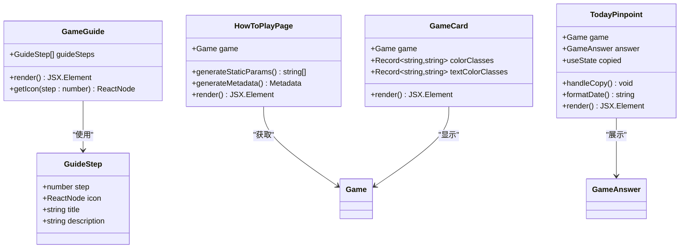

**图表来源**
- [components/home/GameGuide.tsx](file://components/home/GameGuide.tsx#L3-L8)
- [app/games/[gameSlug]/how-to-play/page.tsx](file://app/games/[gameSlug]/how-to-play/page.tsx#L5-L7)
- [components/games/GameCard.tsx](file://components/games/GameCard.tsx#L6-L8)

### 数据流架构

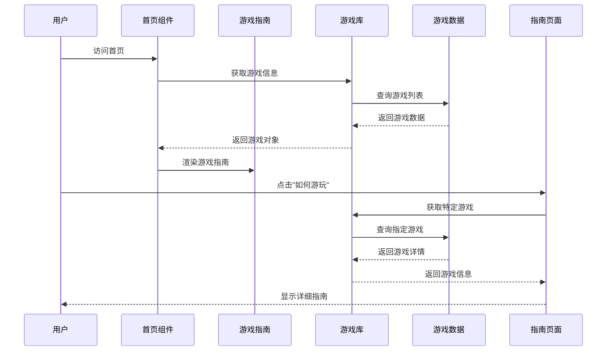

**图表来源**
- [components/home/index.tsx](file://components/home/index.tsx#L8-L34)
- [lib/games.ts](file://lib/games.ts#L4-L14)
- [app/games/[gameSlug]/how-to-play/page.tsx](file://app/games/[gameSlug]/how-to-play/page.tsx#L40-L76)

**章节来源**
- [components/home/GameGuide.tsx](file://components/home/GameGuide.tsx#L1-L102)
- [app/games/[gameSlug]/how-to-play/page.tsx](file://app/games/[gameSlug]/how-to-play/page.tsx#L1-L77)

## 架构概览

游戏指南组件采用了分层架构设计，确保了良好的可维护性和扩展性：

### 组件层次结构

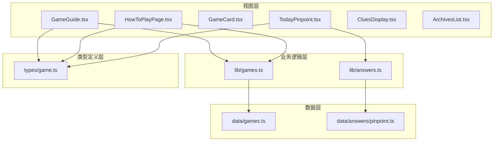

**图表来源**
- [components/home/GameGuide.tsx](file://components/home/GameGuide.tsx#L1-L102)
- [lib/games.ts](file://lib/games.ts#L1-L15)
- [lib/answers.ts](file://lib/answers.ts#L1-L42)
- [data/games.ts](file://data/games.ts#L1-L29)
- [data/answers/pinpoint.ts](file://data/answers/pinpoint.ts#L1-L288)
- [types/game.ts](file://types/game.ts#L1-L27)

### 状态管理流程

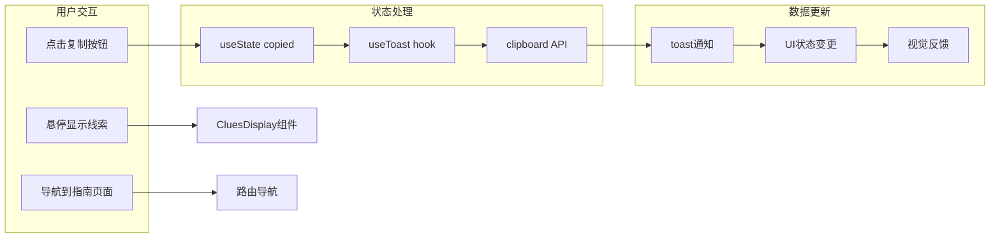

**图表来源**
- [components/home/TodayPinpoint.tsx](file://components/home/TodayPinpoint.tsx#L15-L71)
- [components/games/CluesDisplay.tsx](file://components/games/CluesDisplay.tsx#L12-L73)

**章节来源**
- [components/home/GameGuide.tsx](file://components/home/GameGuide.tsx#L41-L101)
- [components/home/TodayPinpoint.tsx](file://components/home/TodayPinpoint.tsx#L14-L215)

## 详细组件分析

### 游戏指南组件 (GameGuide)

GameGuide 是游戏指南系统的核心组件，提供了结构化的游戏玩法指导：

#### 组件特性

| 特性 | 描述 | 实现方式 |
|------|------|----------|
| 响应式布局 | 支持移动端和桌面端适配 | 使用 Grid 和 Flexbox 布局 |
| 深色模式支持 | 自动适配系统主题 | Tailwind CSS 暗色类 |
| 交互效果 | 悬停动画和过渡效果 | CSS 过渡和变换 |
| 图标系统 | 使用 Lucide React 图标库 | 内置图标组件 |

#### 步骤定义结构

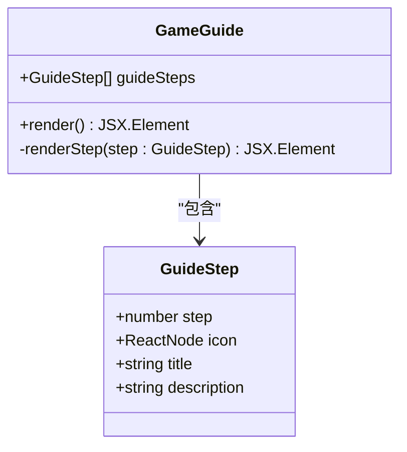

**图表来源**
- [components/home/GameGuide.tsx](file://components/home/GameGuide.tsx#L3-L8)

#### 渲染流程

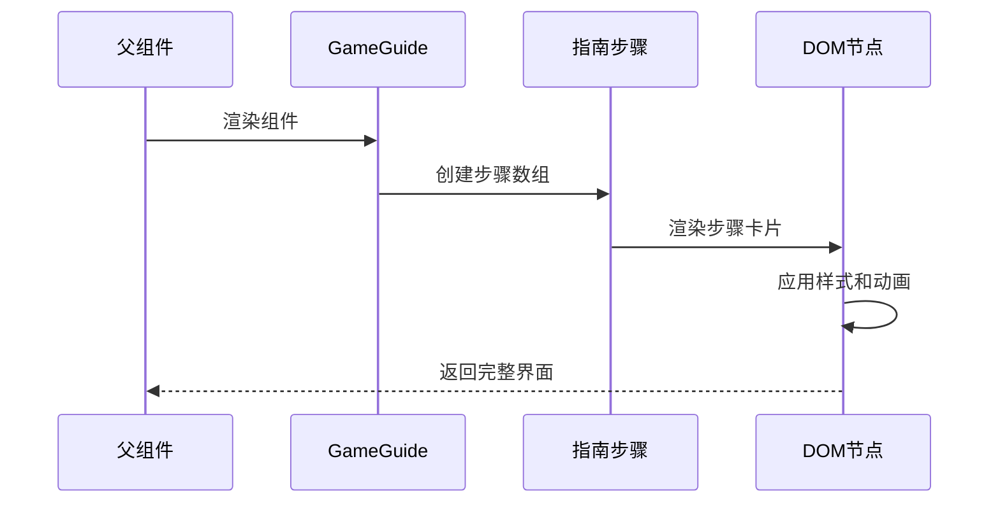

**图表来源**
- [components/home/GameGuide.tsx](file://components/home/GameGuide.tsx#L60-L86)

**章节来源**
- [components/home/GameGuide.tsx](file://components/home/GameGuide.tsx#L1-L102)

### 如何游玩页面 (HowToPlayPage)

HowToPlayPage 提供了详细的单个游戏玩法说明：

#### 动态参数生成

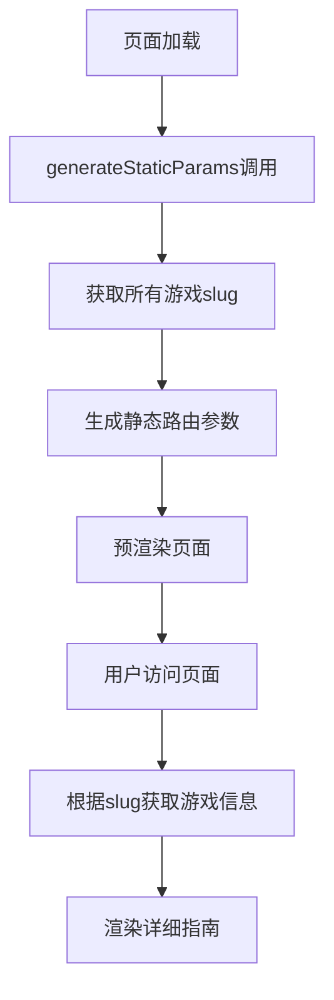

**图表来源**
- [app/games/[gameSlug]/how-to-play/page.tsx](file://app/games/[gameSlug]/how-to-play/page.tsx#L9-L14)

#### 元数据优化

页面实现了 SEO 友好的元数据生成，包括：
- 动态标题生成：`${game.name} - How to Play`
- 描述信息：`How to play ${game.name}`
- 规范化链接设置
- 错误处理和 404 页面

**章节来源**
- [app/games/[gameSlug]/how-to-play/page.tsx](file://app/games/[gameSlug]/how-to-play/page.tsx#L1-L77)

### 游戏卡片组件 (GameCard)

GameCard 组件提供了游戏的概览和快速访问功能：

#### 颜色系统

组件实现了灵活的颜色主题系统：

| 颜色类别 | 背景色 | 边框色 | 文本色 |
|----------|--------|--------|--------|
| 蓝色 | `bg-blue-50` | `border-blue-200` | `text-blue-600` |
| 紫色 | `bg-purple-50` | `border-purple-200` | `text-purple-600` |
| 绿色 | `bg-green-50` | `border-green-200` | `text-green-600` |
| 橙色 | `bg-orange-50` | `border-orange-200` | `text-orange-600` |
| 粉色 | `bg-pink-50` | `border-pink-200` | `text-pink-600` |
| 黄色 | `bg-yellow-50` | `border-yellow-200` | `text-yellow-600` |
| 靛蓝色 | `bg-indigo-50` | `border-indigo-200` | `text-indigo-600` |
| 灰色 | `bg-gray-50` | `border-gray-200` | `text-gray-600` |
| 红色 | `bg-red-50` | `border-red-200` | `text-red-600` |
| 青绿色 | `bg-teal-50` | `border-teal-200` | `text-teal-600` |

**章节来源**
- [components/games/GameCard.tsx](file://components/games/GameCard.tsx#L10-L34)

### 线索显示组件 (CluesDisplay)

CluesDisplay 组件专门用于展示游戏线索，具有以下特性：

#### HTML 内容处理

组件能够智能处理包含 HTML 标签的提示文本：

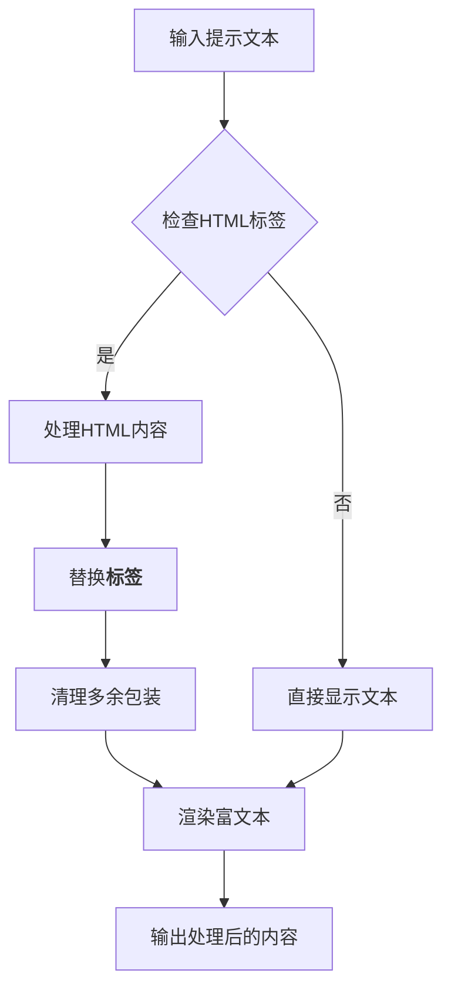

**图表来源**
- [components/games/CluesDisplay.tsx](file://components/games/CluesDisplay.tsx#L17-L30)

**章节来源**
- [components/games/CluesDisplay.tsx](file://components/games/CluesDisplay.tsx#L1-L74)

### 归档列表组件 (ArchivesList)

ArchivesList 组件提供了游戏历史记录的浏览功能：

#### 数据格式化

组件实现了灵活的数据格式化功能：

| 数据类型 | 显示方式 | 格式化规则 |
|----------|----------|------------|
| 字符串数组 | 标签云 | 每个元素作为独立标签 |
| 单个字符串 | 文本段落 | 直接显示 |
| 日期字符串 | 友好日期 | 使用本地化格式 |

**章节来源**
- [components/games/ArchivesList.tsx](file://components/games/ArchivesList.tsx#L1-L67)

### 今日游戏组件 (TodayPinpoint)

TodayPinpoint 组件展示了当天的游戏答案和相关线索：

#### 复制功能实现

组件实现了跨浏览器兼容的复制功能：

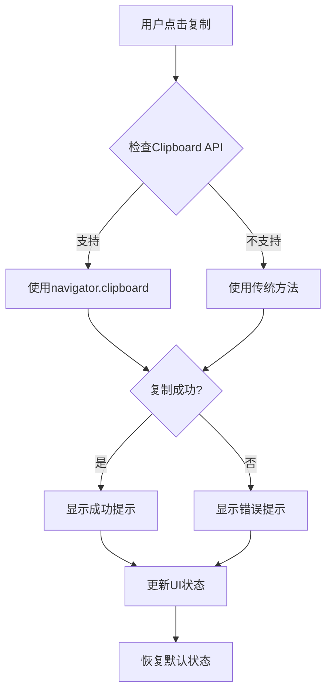

**图表来源**
- [components/home/TodayPinpoint.tsx](file://components/home/TodayPinpoint.tsx#L18-L71)

**章节来源**
- [components/home/TodayPinpoint.tsx](file://components/home/TodayPinpoint.tsx#L1-L216)

## 依赖关系分析

游戏指南组件系统展现了清晰的依赖层次结构：

### 外部依赖

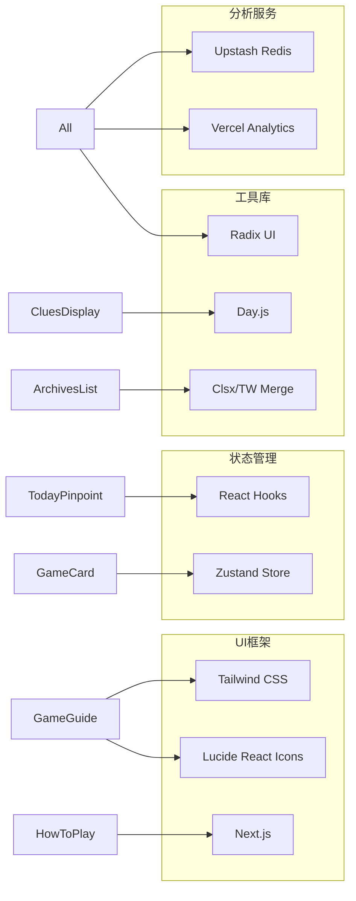

**图表来源**
- [package.json](file://package.json#L16-L51)

### 内部依赖关系

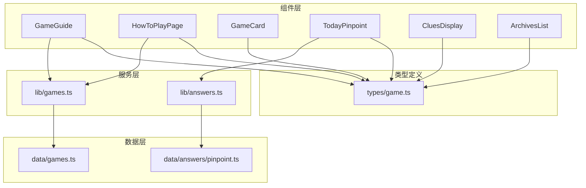

**图表来源**
- [lib/games.ts](file://lib/games.ts#L1-L15)
- [lib/answers.ts](file://lib/answers.ts#L1-L42)
- [types/game.ts](file://types/game.ts#L1-L27)

**章节来源**
- [package.json](file://package.json#L1-L65)
- [lib/games.ts](file://lib/games.ts#L1-L15)
- [lib/answers.ts](file://lib/answers.ts#L1-L42)

## 性能考虑

游戏指南组件系统在设计时充分考虑了性能优化：

### 渲染优化

1. **静态生成**: HowToPlayPage 使用 `generateStaticParams` 进行静态预渲染
2. **条件渲染**: 组件仅在必要时重新渲染
3. **CSS 动画**: 使用硬件加速的 CSS 过渡效果

### 数据优化

1. **缓存策略**: 游戏数据通过单一入口点管理
2. **按需加载**: 组件只加载必要的数据
3. **类型安全**: TypeScript 确保运行时错误最小化

### 用户体验优化

1. **深色模式**: 自动检测和适配系统主题
2. **响应式设计**: 移动端和桌面端优化
3. **无障碍访问**: 完整的 ARIA 属性支持

## 故障排除指南

### 常见问题及解决方案

#### 游戏数据加载失败

**症状**: 页面显示空白或加载指示器无限循环

**可能原因**:
- 游戏数据源不可用
- 网络连接问题
- 类型定义不匹配

**解决步骤**:
1. 检查网络连接状态
2. 验证游戏数据格式
3. 确认类型定义正确性
4. 查看浏览器控制台错误信息

#### 复制功能异常

**症状**: 点击复制按钮无响应或显示错误

**可能原因**:
- 浏览器不支持 Clipboard API
- 权限被拒绝
- 安全上下文问题

**解决步骤**:
1. 检查浏览器兼容性
2. 确认 HTTPS 环境
3. 验证权限设置
4. 尝试手动选择复制

#### 样式显示异常

**症状**: 组件样式错乱或颜色不正确

**可能原因**:
- Tailwind CSS 配置问题
- 深色模式检测失败
- CSS 优先级冲突

**解决步骤**:
1. 检查 Tailwind 配置
2. 验证深色模式类名
3. 检查 CSS 作用域
4. 更新 Tailwind 版本

**章节来源**
- [components/home/TodayPinpoint.tsx](file://components/home/TodayPinpoint.tsx#L18-L71)
- [components/games/CluesDisplay.tsx](file://components/games/CluesDisplay.tsx#L17-L30)

## 结论

游戏指南组件系统展现了现代 React 开发的最佳实践，通过清晰的组件分离、类型安全的架构设计和优秀的用户体验优化，为用户提供了直观易懂的游戏指导。

### 主要优势

1. **模块化设计**: 组件职责明确，易于维护和扩展
2. **类型安全**: 完整的 TypeScript 支持，减少运行时错误
3. **性能优化**: 静态生成、条件渲染和硬件加速动画
4. **用户体验**: 响应式设计、深色模式支持和无障碍访问
5. **SEO 友好**: 动态元数据生成和结构化内容

### 技术亮点

- **响应式布局**: 适配各种设备尺寸
- **深色模式**: 自动主题适配
- **动画效果**: 平滑的用户交互反馈
- **国际化支持**: 为多语言环境准备
- **性能监控**: 集成分析服务

该组件系统为类似的游戏指导场景提供了优秀的参考实现，其设计理念和最佳实践可以应用于其他类型的教育和指导类应用开发。