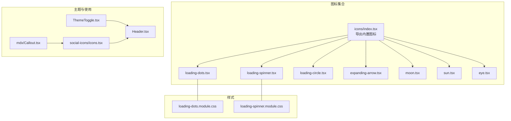
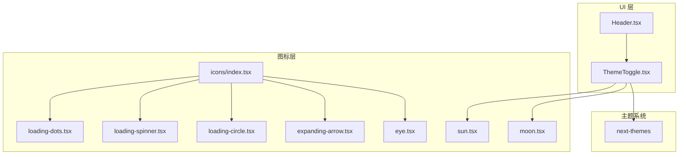
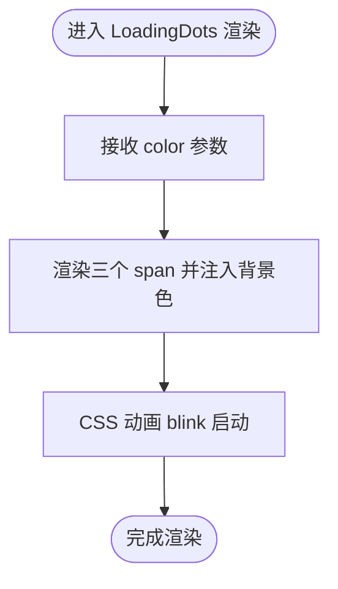
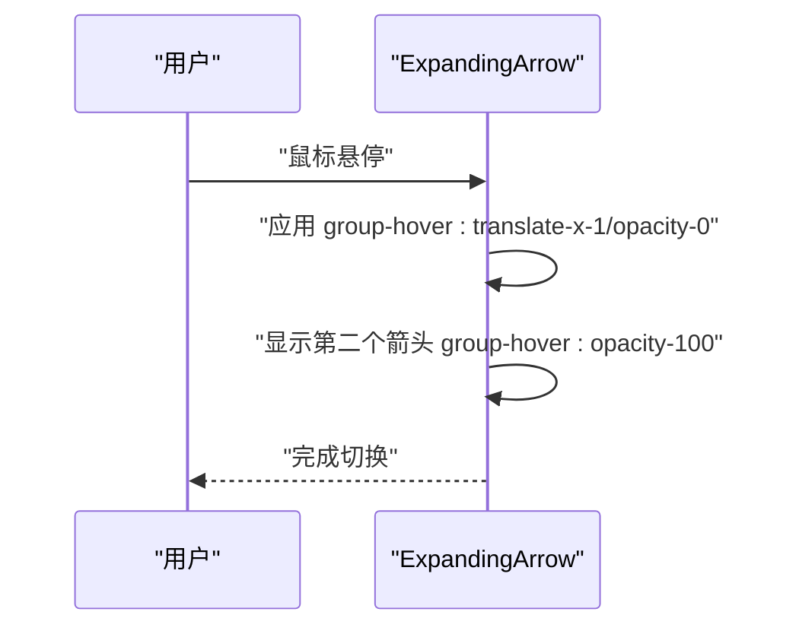
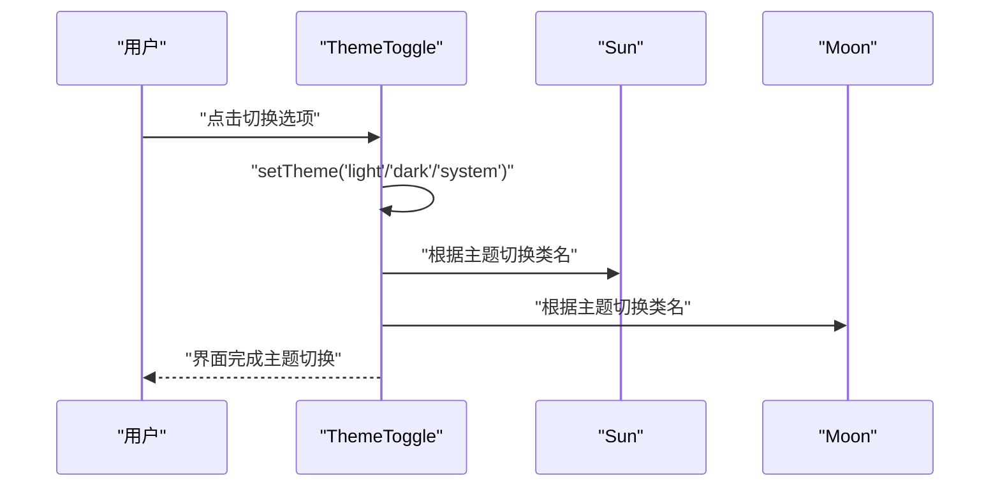
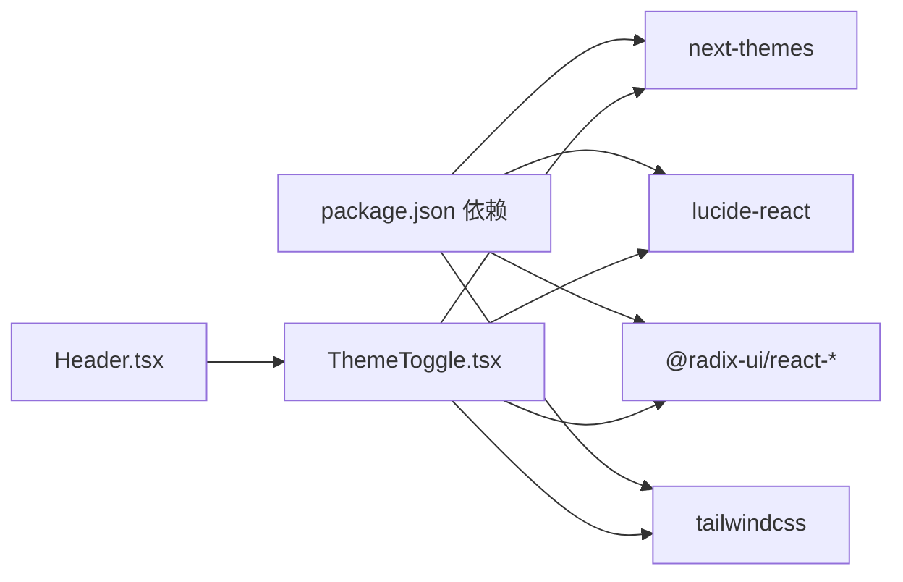

# 图标组件

<cite>
**本文引用的文件**
- [components/icons/index.tsx](file://components/icons/index.tsx)
- [components/icons/loading-dots.tsx](file://components/icons/loading-dots.tsx)
- [components/icons/loading-spinner.tsx](file://components/icons/loading-spinner.tsx)
- [components/icons/loading-circle.tsx](file://components/icons/loading-circle.tsx)
- [components/icons/expanding-arrow.tsx](file://components/icons/expanding-arrow.tsx)
- [components/icons/moon.tsx](file://components/icons/moon.tsx)
- [components/icons/sun.tsx](file://components/icons/sun.tsx)
- [components/icons/eye.tsx](file://components/icons/eye.tsx)
- [components/icons/loading-dots.module.css](file://components/icons/loading-dots.module.css)
- [components/icons/loading-spinner.module.css](file://components/icons/loading-spinner.module.css)
- [components/ThemeToggle.tsx](file://components/ThemeToggle.tsx)
- [components/header/Header.tsx](file://components/header/Header.tsx)
- [components/social-icons/icons.tsx](file://components/social-icons/icons.tsx)
- [components/mdx/Callout.tsx](file://components/mdx/Callout.tsx)
- [package.json](file://package.json)
- [tailwind.config.ts](file://tailwind.config.ts)
</cite>

## 目录
1. [简介](#简介)
2. [项目结构](#项目结构)
3. [核心组件](#核心组件)
4. [架构总览](#架构总览)
5. [详细组件分析](#详细组件分析)
6. [依赖关系分析](#依赖关系分析)
7. [性能考量](#性能考量)
8. [故障排查指南](#故障排查指南)
9. [结论](#结论)
10. [附录](#附录)

## 简介
本文件系统化梳理项目中的图标组件体系，覆盖以下方面：
- 图标集合：内置图标（加载动画与交互图标）、主题切换图标、第三方图标库集成方式
- 视觉设计与尺寸规范：SVG 尺寸、颜色与填充策略、CSS 动画与过渡
- 主题适配与动态切换：基于 next-themes 的明暗模式切换与图标状态联动
- 性能优化与懒加载：按需引入、CSS 动画替代复杂 JS 动画、避免阻塞渲染
- 扩展与自定义：如何新增图标、复用现有模式、保持一致的视觉与交互体验
- 高分辨率与清晰度：矢量 SVG 的优势与在不同容器尺寸下的表现

## 项目结构
图标相关代码主要位于 components/icons 与 components/social-icons 中，并通过 ThemeToggle 在头部导航中进行主题切换。

图表来源
- [components/icons/index.tsx](file://components/icons/index.tsx#L1-L5)
- [components/icons/loading-dots.tsx](file://components/icons/loading-dots.tsx#L1-L14)
- [components/icons/loading-spinner.tsx](file://components/icons/loading-spinner.tsx#L1-L21)
- [components/icons/loading-circle.tsx](file://components/icons/loading-circle.tsx#L1-L21)
- [components/icons/expanding-arrow.tsx](file://components/icons/expanding-arrow.tsx#L1-L37)
- [components/icons/moon.tsx](file://components/icons/moon.tsx#L1-L17)
- [components/icons/sun.tsx](file://components/icons/sun.tsx#L1-L17)
- [components/icons/eye.tsx](file://components/icons/eye.tsx#L1-L25)
- [components/icons/loading-dots.module.css](file://components/icons/loading-dots.module.css#L1-L41)
- [components/icons/loading-spinner.module.css](file://components/icons/loading-spinner.module.css#L1-L80)
- [components/ThemeToggle.tsx](file://components/ThemeToggle.tsx#L1-L40)
- [components/header/Header.tsx](file://components/header/Header.tsx#L1-L45)
- [components/social-icons/icons.tsx](file://components/social-icons/icons.tsx#L1-L114)
- [components/mdx/Callout.tsx](file://components/mdx/Callout.tsx#L1-L27)

章节来源
- [components/icons/index.tsx](file://components/icons/index.tsx#L1-L5)
- [components/icons/loading-dots.tsx](file://components/icons/loading-dots.tsx#L1-L14)
- [components/icons/loading-spinner.tsx](file://components/icons/loading-spinner.tsx#L1-L21)
- [components/icons/loading-circle.tsx](file://components/icons/loading-circle.tsx#L1-L21)
- [components/icons/expanding-arrow.tsx](file://components/icons/expanding-arrow.tsx#L1-L37)
- [components/icons/moon.tsx](file://components/icons/moon.tsx#L1-L17)
- [components/icons/sun.tsx](file://components/icons/sun.tsx#L1-L17)
- [components/icons/eye.tsx](file://components/icons/eye.tsx#L1-L25)
- [components/icons/loading-dots.module.css](file://components/icons/loading-dots.module.css#L1-L41)
- [components/icons/loading-spinner.module.css](file://components/icons/loading-spinner.module.css#L1-L80)
- [components/ThemeToggle.tsx](file://components/ThemeToggle.tsx#L1-L40)
- [components/header/Header.tsx](file://components/header/Header.tsx#L1-L45)
- [components/social-icons/icons.tsx](file://components/social-icons/icons.tsx#L1-L114)
- [components/mdx/Callout.tsx](file://components/mdx/Callout.tsx#L1-L27)

## 核心组件
- 内置图标导出入口：通过统一的 index.tsx 导出所有内置图标，便于集中管理与按需引入。
- 加载动画图标：
  - LoadingDots：三小点闪烁，支持颜色传参，使用 CSS 动画实现。
  - LoadingSpinner：多段旋转指示器，使用 CSS 动画与 keyframes。
  - LoadingCircle：SVG 轮盘式旋转，使用 CSS 动画与 fill/text 颜色控制。
- 交互图标：
  - ExpandingArrow：悬停时双箭头切换，使用 CSS 过渡与透明度控制。
- 主题切换图标：
  - Sun/Moon：分别对应明/暗主题的图标，配合 ThemeToggle 使用。
- 第三方图标库集成：
  - social-icons/icons.tsx 提供了大量第三方品牌图标，可直接复用或扩展。

章节来源
- [components/icons/index.tsx](file://components/icons/index.tsx#L1-L5)
- [components/icons/loading-dots.tsx](file://components/icons/loading-dots.tsx#L1-L14)
- [components/icons/loading-spinner.tsx](file://components/icons/loading-spinner.tsx#L1-L21)
- [components/icons/loading-circle.tsx](file://components/icons/loading-circle.tsx#L1-L21)
- [components/icons/expanding-arrow.tsx](file://components/icons/expanding-arrow.tsx#L1-L37)
- [components/icons/moon.tsx](file://components/icons/moon.tsx#L1-L17)
- [components/icons/sun.tsx](file://components/icons/sun.tsx#L1-L17)
- [components/social-icons/icons.tsx](file://components/social-icons/icons.tsx#L1-L114)

## 架构总览
图标组件在应用中的位置与交互如下：

图表来源
- [components/header/Header.tsx](file://components/header/Header.tsx#L1-L45)
- [components/ThemeToggle.tsx](file://components/ThemeToggle.tsx#L1-L40)
- [components/icons/index.tsx](file://components/icons/index.tsx#L1-L5)
- [components/icons/loading-dots.tsx](file://components/icons/loading-dots.tsx#L1-L14)
- [components/icons/loading-spinner.tsx](file://components/icons/loading-spinner.tsx#L1-L21)
- [components/icons/loading-circle.tsx](file://components/icons/loading-circle.tsx#L1-L21)
- [components/icons/expanding-arrow.tsx](file://components/icons/expanding-arrow.tsx#L1-L37)
- [components/icons/sun.tsx](file://components/icons/sun.tsx#L1-L17)
- [components/icons/moon.tsx](file://components/icons/moon.tsx#L1-L17)
- [components/icons/eye.tsx](file://components/icons/eye.tsx#L1-L25)

## 详细组件分析

### 加载动画图标族
- LoadingDots
  - 设计要点：三点等距排列，使用 CSS 动画实现逐个闪烁；颜色通过 props 注入，便于主题适配。
  - 尺寸与颜色：容器尺寸由外层 CSS 控制；颜色通过内联 style 注入，确保与主题一致。
  - 复杂度：O(1)，无 JS 动画开销。
- LoadingSpinner
  - 设计要点：12 段圆环围绕中心旋转，使用 CSS 动画与 keyframes；每段有固定延迟，形成流动感。
  - 尺寸与颜色：通过模块化 CSS 控制整体尺寸与颜色，使用相对单位以适配不同容器。
  - 复杂度：O(1)，纯 CSS 动画。
- LoadingCircle
  - 设计要点：SVG 轮盘式旋转，使用 CSS 动画与 fill/text 颜色控制前景/背景色。
  - 尺寸与颜色：固定 viewBox，通过类名控制尺寸与颜色，适合与 Tailwind 类组合使用。
  - 复杂度：O(1)，纯 CSS 动画。

图表来源
- [components/icons/loading-dots.tsx](file://components/icons/loading-dots.tsx#L1-L14)
- [components/icons/loading-dots.module.css](file://components/icons/loading-dots.module.css#L1-L41)

章节来源
- [components/icons/loading-dots.tsx](file://components/icons/loading-dots.tsx#L1-L14)
- [components/icons/loading-spinner.tsx](file://components/icons/loading-spinner.tsx#L1-L21)
- [components/icons/loading-circle.tsx](file://components/icons/loading-circle.tsx#L1-L21)
- [components/icons/loading-dots.module.css](file://components/icons/loading-dots.module.css#L1-L41)
- [components/icons/loading-spinner.module.css](file://components/icons/loading-spinner.module.css#L1-L80)

### 交互图标：ExpandingArrow
- 设计要点：悬停时从一个箭头平滑过渡到另一个箭头，使用绝对定位与透明度/位移过渡。
- 尺寸与颜色：默认尺寸为 16x16，可通过 className 覆盖；颜色继承自父级或当前色。
- 复杂度：O(1)，纯 CSS 过渡。

图表来源
- [components/icons/expanding-arrow.tsx](file://components/icons/expanding-arrow.tsx#L1-L37)

章节来源
- [components/icons/expanding-arrow.tsx](file://components/icons/expanding-arrow.tsx#L1-L37)

### 主题切换图标：Sun/Moon
- 设计要点：Sun/Moon 分别作为明/暗主题的图标，配合 ThemeToggle 实现切换。
- 尺寸与颜色：固定 viewBox 与尺寸，颜色通过 props 或 CSS 继承；与 next-themes 的类名切换配合。
- 复杂度：O(1)，纯 SVG。

图表来源
- [components/ThemeToggle.tsx](file://components/ThemeToggle.tsx#L1-L40)
- [components/icons/sun.tsx](file://components/icons/sun.tsx#L1-L17)
- [components/icons/moon.tsx](file://components/icons/moon.tsx#L1-L17)

章节来源
- [components/icons/sun.tsx](file://components/icons/sun.tsx#L1-L17)
- [components/icons/moon.tsx](file://components/icons/moon.tsx#L1-L17)
- [components/ThemeToggle.tsx](file://components/ThemeToggle.tsx#L1-L40)

### 第三方图标库：social-icons/icons.tsx
- 设计要点：提供大量第三方品牌图标，采用统一的 SVG 结构与 props 接口，便于复用。
- 尺寸与颜色：统一 viewBox，颜色通过 props 或 CSS 继承；可与 Tailwind 类组合使用。
- 复杂度：O(1)，纯 SVG。

章节来源
- [components/social-icons/icons.tsx](file://components/social-icons/icons.tsx#L1-L114)

### 其他图标：Eye
- 设计要点：用于展示/隐藏内容的图标，采用矢量 SVG，颜色可继承或覆盖。
- 尺寸与颜色：固定 viewBox，颜色通过 props 或 CSS 继承。
- 复杂度：O(1)，纯 SVG。

章节来源
- [components/icons/eye.tsx](file://components/icons/eye.tsx#L1-L25)

## 依赖关系分析
- 主题系统依赖：ThemeToggle 基于 next-themes，通过类名切换实现明暗主题。
- UI 组件依赖：Header 引入 ThemeToggle，Social Icons 图标在多个组件中复用。
- 样式系统依赖：Tailwind CSS 提供尺寸、颜色与过渡类，确保图标与主题一致。

图表来源
- [package.json](file://package.json#L16-L51)
- [components/ThemeToggle.tsx](file://components/ThemeToggle.tsx#L1-L40)
- [tailwind.config.ts](file://tailwind.config.ts#L1-L95)

章节来源
- [package.json](file://package.json#L16-L51)
- [tailwind.config.ts](file://tailwind.config.ts#L1-L95)
- [components/ThemeToggle.tsx](file://components/ThemeToggle.tsx#L1-L40)

## 性能考量
- 动画性能
  - LoadingDots/LoadingSpinner/LoadingCircle 均使用 CSS 动画，避免 JS 动画带来的主线程压力。
  - ExpandingArrow 使用 CSS 过渡，轻量且流畅。
- 按需引入
  - 通过 icons/index.tsx 集中导出，避免重复导入；在业务组件中仅引入所需图标。
- 主题切换
  - 使用 next-themes 的类名切换，避免重绘整个页面，仅影响受控区域。
- 清晰度与高分辨率
  - 所有图标为矢量 SVG，可在任意缩放下保持清晰；结合 Tailwind 尺寸类可适配不同容器。
- 可访问性
  - LoadingCircle 设置 aria-hidden，避免对读屏造成干扰；按钮类图标提供 sr-only 文本。

章节来源
- [components/icons/loading-dots.tsx](file://components/icons/loading-dots.tsx#L1-L14)
- [components/icons/loading-spinner.tsx](file://components/icons/loading-spinner.tsx#L1-L21)
- [components/icons/loading-circle.tsx](file://components/icons/loading-circle.tsx#L1-L21)
- [components/icons/expanding-arrow.tsx](file://components/icons/expanding-arrow.tsx#L1-L37)
- [components/ThemeToggle.tsx](file://components/ThemeToggle.tsx#L1-L40)

## 故障排查指南
- 图标不显示或颜色异常
  - 检查是否正确引入图标组件与样式模块（如 loading-dots.module.css）。
  - 确认 Tailwind 类与颜色变量是否生效（例如 fill/text 颜色类）。
- 动画不生效
  - 确认 CSS 模块已正确导入，且未被覆盖。
  - 检查浏览器是否禁用动画或处于省电模式。
- 主题切换无效
  - 确认 next-themes 已正确初始化，类名切换正常。
  - 检查 Tailwind darkMode 配置是否为 class 模式。
- 第三方图标缺失
  - 确认 social-icons/icons.tsx 中的图标函数已导出并在组件中正确使用。

章节来源
- [components/icons/loading-dots.module.css](file://components/icons/loading-dots.module.css#L1-L41)
- [components/icons/loading-spinner.module.css](file://components/icons/loading-spinner.module.css#L1-L80)
- [tailwind.config.ts](file://tailwind.config.ts#L1-L95)
- [components/ThemeToggle.tsx](file://components/ThemeToggle.tsx#L1-L40)
- [components/social-icons/icons.tsx](file://components/social-icons/icons.tsx#L1-L114)

## 结论
本项目通过统一的图标导出入口与模块化样式，构建了清晰、可维护且高性能的图标体系。加载动画图标采用纯 CSS 动画，交互图标使用过渡与类名切换，主题图标与 next-themes 协同工作，实现了良好的可访问性与跨设备清晰度。通过第三方图标库扩展，可快速集成品牌图标并保持一致的视觉风格。

## 附录

### 图标使用示例与设计规范
- 加载动画
  - 使用 LoadingDots/LoadingSpinner/LoadingCircle 替代传统 GIF，减少资源体积与网络请求。
  - 通过 Tailwind 尺寸类控制大小，通过颜色类控制主题色。
- 交互图标
  - ExpandingArrow 适用于按钮或链接的悬停反馈，建议与 group 容器配合使用。
- 主题图标
  - Sun/Moon 与 ThemeToggle 搭配使用，确保明/暗主题下图标颜色一致。
- 第三方图标
  - social-icons/icons.tsx 中的图标可直接复用，注意统一的 props 接口与 viewBox。
- MDX 使用
  - Callout 组件支持传入 icon 字符串，可用于在文档块中展示图标与文本。

章节来源
- [components/icons/loading-dots.tsx](file://components/icons/loading-dots.tsx#L1-L14)
- [components/icons/loading-spinner.tsx](file://components/icons/loading-spinner.tsx#L1-L21)
- [components/icons/loading-circle.tsx](file://components/icons/loading-circle.tsx#L1-L21)
- [components/icons/expanding-arrow.tsx](file://components/icons/expanding-arrow.tsx#L1-L37)
- [components/icons/sun.tsx](file://components/icons/sun.tsx#L1-L17)
- [components/icons/moon.tsx](file://components/icons/moon.tsx#L1-L17)
- [components/icons/eye.tsx](file://components/icons/eye.tsx#L1-L25)
- [components/social-icons/icons.tsx](file://components/social-icons/icons.tsx#L1-L114)
- [components/mdx/Callout.tsx](file://components/mdx/Callout.tsx#L1-L27)