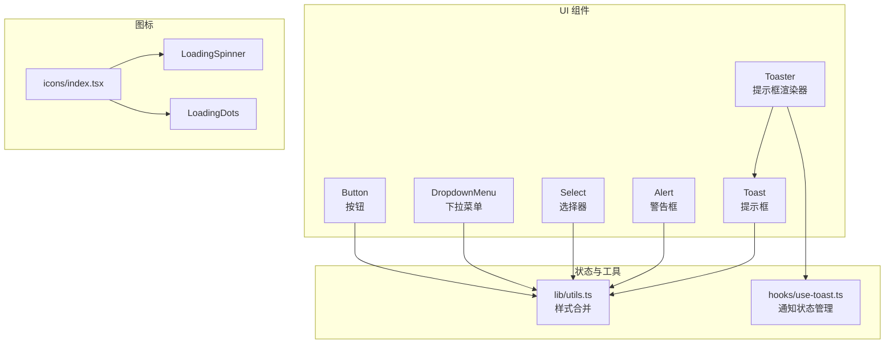
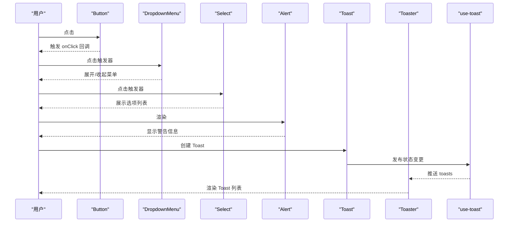
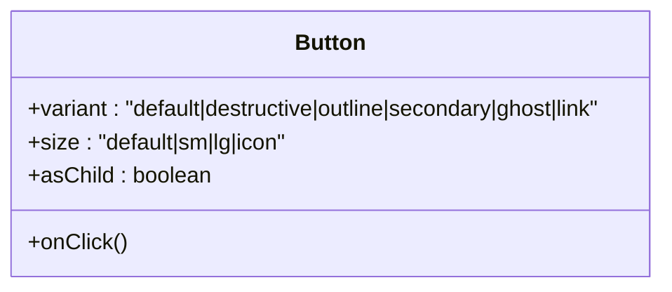
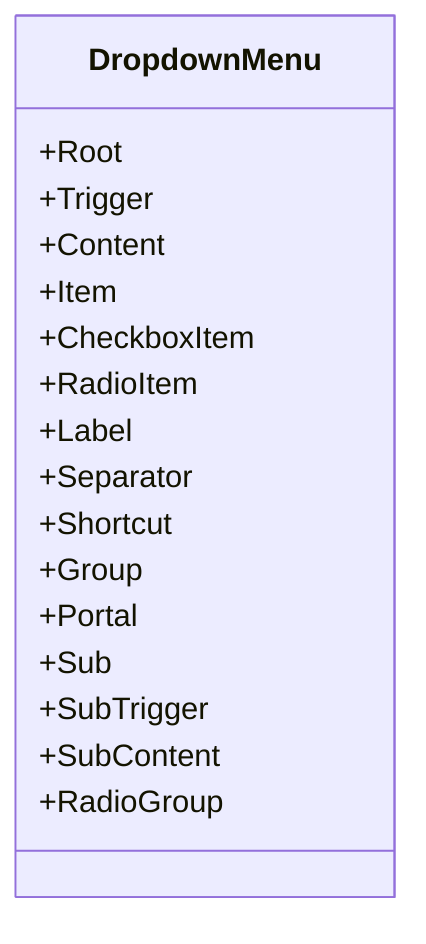
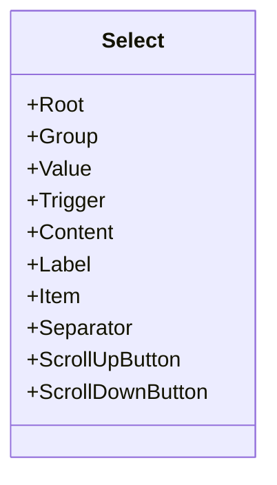
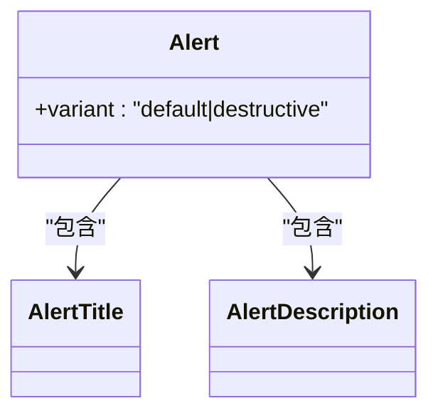
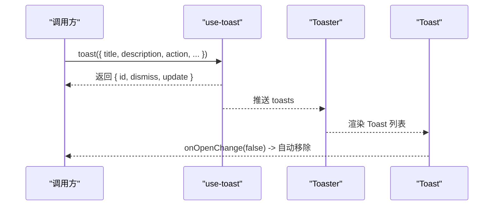
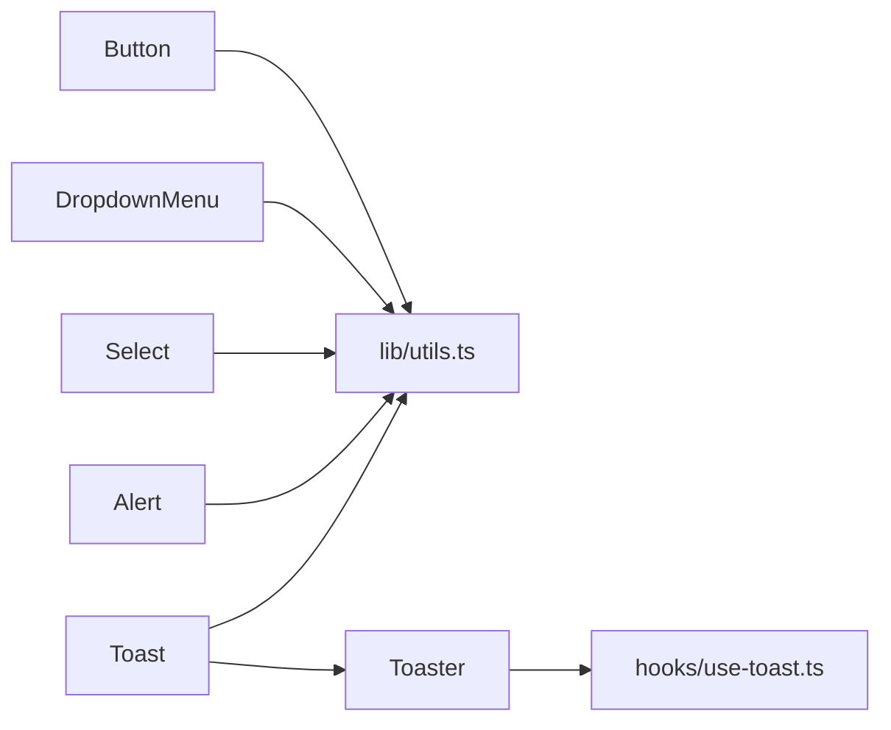

# 基础UI组件库

<cite>
**本文引用的文件**
- [components/ui/button.tsx](file://components/ui/button.tsx)
- [components/ui/dropdown-menu.tsx](file://components/ui/dropdown-menu.tsx)
- [components/ui/select.tsx](file://components/ui/select.tsx)
- [components/ui/alert.tsx](file://components/ui/alert.tsx)
- [components/ui/toast.tsx](file://components/ui/toast.tsx)
- [components/ui/toaster.tsx](file://components/ui/toaster.tsx)
- [hooks/use-toast.ts](file://hooks/use-toast.ts)
- [lib/utils.ts](file://lib/utils.ts)
- [components/icons/loading-spinner.tsx](file://components/icons/loading-spinner.tsx)
- [components/icons/loading-dots.tsx](file://components/icons/loading-dots.tsx)
- [components/icons/index.tsx](file://components/icons/index.tsx)
- [components/mdx/Callout.tsx](file://components/mdx/Callout.tsx)
- [components/home/index.tsx](file://components/home/index.tsx)
</cite>

## 目录
1. [简介](#简介)
2. [项目结构](#项目结构)
3. [核心组件](#核心组件)
4. [架构总览](#架构总览)
5. [详细组件分析](#详细组件分析)
6. [依赖关系分析](#依赖关系分析)
7. [性能考量](#性能考量)
8. [故障排查指南](#故障排查指南)
9. [结论](#结论)
10. [附录：API 参考与使用示例](#附录api-参考与使用示例)

## 简介
本文件系统性梳理并说明本仓库中的基础UI组件库，覆盖按钮、下拉菜单、选择器、警告框、提示框（Toast）等核心组件的设计规范、实现细节与最佳实践。内容包括：
- 属性配置与事件处理
- 样式定制与主题一致性
- 状态管理与动画过渡
- 无障碍访问与键盘导航
- 组件组合与设计模式
- 性能优化与常见问题排查

## 项目结构
基础UI组件集中于 components/ui 目录，配合 hooks/use-toast.ts 提供全局通知状态管理，lib/utils.ts 提供通用样式合并工具，icons 目录提供加载态图标。

图表来源
- [components/ui/button.tsx](file://components/ui/button.tsx#L1-L58)
- [components/ui/dropdown-menu.tsx](file://components/ui/dropdown-menu.tsx#L1-L202)
- [components/ui/select.tsx](file://components/ui/select.tsx#L1-L160)
- [components/ui/alert.tsx](file://components/ui/alert.tsx#L1-L60)
- [components/ui/toast.tsx](file://components/ui/toast.tsx#L1-L130)
- [components/ui/toaster.tsx](file://components/ui/toaster.tsx#L1-L36)
- [hooks/use-toast.ts](file://hooks/use-toast.ts#L1-L195)
- [lib/utils.ts](file://lib/utils.ts#L1-L19)
- [components/icons/loading-spinner.tsx](file://components/icons/loading-spinner.tsx#L1-L21)
- [components/icons/loading-dots.tsx](file://components/icons/loading-dots.tsx#L1-L14)
- [components/icons/index.tsx](file://components/icons/index.tsx#L1-L5)

章节来源
- [components/ui/button.tsx](file://components/ui/button.tsx#L1-L58)
- [components/ui/dropdown-menu.tsx](file://components/ui/dropdown-menu.tsx#L1-L202)
- [components/ui/select.tsx](file://components/ui/select.tsx#L1-L160)
- [components/ui/alert.tsx](file://components/ui/alert.tsx#L1-L60)
- [components/ui/toast.tsx](file://components/ui/toast.tsx#L1-L130)
- [components/ui/toaster.tsx](file://components/ui/toaster.tsx#L1-L36)
- [hooks/use-toast.ts](file://hooks/use-toast.ts#L1-L195)
- [lib/utils.ts](file://lib/utils.ts#L1-L19)
- [components/icons/loading-spinner.tsx](file://components/icons/loading-spinner.tsx#L1-L21)
- [components/icons/loading-dots.tsx](file://components/icons/loading-dots.tsx#L1-L14)
- [components/icons/index.tsx](file://components/icons/index.tsx#L1-L5)

## 核心组件
- 按钮 Button：支持多种变体与尺寸，可透传原生按钮属性，支持作为容器元素渲染。
- 下拉菜单 DropdownMenu：提供触发器、内容区、子菜单、复选/单选项、分隔符、快捷键等子组件。
- 选择器 Select：提供触发器、内容区、滚动按钮、选项、标签、分隔符等子组件。
- 警告框 Alert：支持默认与破坏性两种外观，提供标题与描述子组件。
- 提示框 Toast：提供 Provider、Viewport、Toast、标题、描述、关闭按钮、操作按钮等。
- 提示框渲染器 Toaster：基于全局状态渲染 Toast 列表，并挂载到视口。

章节来源
- [components/ui/button.tsx](file://components/ui/button.tsx#L37-L55)
- [components/ui/dropdown-menu.tsx](file://components/ui/dropdown-menu.tsx#L9-L201)
- [components/ui/select.tsx](file://components/ui/select.tsx#L9-L159)
- [components/ui/alert.tsx](file://components/ui/alert.tsx#L22-L59)
- [components/ui/toast.tsx](file://components/ui/toast.tsx#L10-L129)
- [components/ui/toaster.tsx](file://components/ui/toaster.tsx#L13-L35)

## 架构总览
组件库采用“原子化 + 组合”的设计思路：
- 使用 class-variance-authority 定义变体与尺寸，结合 Tailwind 类进行样式组合。
- 使用 Radix UI 原子组件构建语义化交互（下拉菜单、选择器、Toast），确保可访问性与可组合性。
- 通过 hooks/use-toast.ts 提供轻量级全局状态管理，限制同时显示数量并支持自动移除。

图表来源
- [components/ui/button.tsx](file://components/ui/button.tsx#L43-L55)
- [components/ui/dropdown-menu.tsx](file://components/ui/dropdown-menu.tsx#L9-L201)
- [components/ui/select.tsx](file://components/ui/select.tsx#L9-L159)
- [components/ui/alert.tsx](file://components/ui/alert.tsx#L22-L59)
- [components/ui/toast.tsx](file://components/ui/toast.tsx#L10-L129)
- [components/ui/toaster.tsx](file://components/ui/toaster.tsx#L13-L35)
- [hooks/use-toast.ts](file://hooks/use-toast.ts#L145-L172)

## 详细组件分析

### 按钮 Button
- 设计要点
  - 通过变体（variant）与尺寸（size）控制外观与布局。
  - 支持 asChild 将渲染节点替换为任意元素，便于链接或自定义容器。
  - 集成焦点可见性与环形高亮、禁用态、图标尺寸等通用交互。
- 关键属性
  - className：追加自定义类名
  - variant：default/destructive/outline/secondary/ghost/link
  - size：default/sm/lg/icon
  - asChild：是否以子元素容器渲染
  - 其他原生按钮属性透传
- 事件与状态
  - 透传 onClick 等事件；禁用时阻止交互
- 样式与主题
  - 基于 Tailwind 类与主题变量，保证在浅色/深色主题下一致表现
- 无障碍与键盘
  - 自动支持键盘激活与焦点管理（由原生按钮行为提供）
- 最佳实践
  - 图标按钮建议使用 icon 尺寸
  - 危险操作使用 destructive 变体
  - 需要包裹其他元素时使用 asChild

图表来源
- [components/ui/button.tsx](file://components/ui/button.tsx#L37-L55)

章节来源
- [components/ui/button.tsx](file://components/ui/button.tsx#L7-L35)
- [components/ui/button.tsx](file://components/ui/button.tsx#L37-L55)
- [lib/utils.ts](file://lib/utils.ts#L4-L6)

### 下拉菜单 DropdownMenu
- 设计要点
  - 以 Root/Trigger/Content/Item 等原子组件组合，支持子菜单、复选/单选、分隔符、快捷键等
  - 内置展开/收起动画与方向位移，适配多侧边定位
- 关键属性
  - Trigger：触发元素
  - Content：内容区，支持 sideOffset、动画类
  - SubTrigger/SubContent：子菜单触发与内容
  - Item/inset：支持缩进与禁用态
  - CheckboxItem/RadioItem：勾选/单选项
  - Label/Separator/Shortcut：分组标题、分割线、快捷键文本
- 事件与状态
  - 通过内部状态控制打开/关闭，支持键盘导航与焦点回退
- 动画与过渡
  - 使用 data-[state] 与 data-[side] 控制淡入淡出、缩放与滑入滑出
- 无障碍与键盘
  - 严格遵循 ARIA 语义，支持 Tab/Shift+Tab 导航、Enter/Space 激活、Esc 关闭
- 最佳实践
  - 复杂菜单建议拆分为多个 Group 与 Label
  - 子菜单使用 ChevronRight 指示

图表来源
- [components/ui/dropdown-menu.tsx](file://components/ui/dropdown-menu.tsx#L9-L201)

章节来源
- [components/ui/dropdown-menu.tsx](file://components/ui/dropdown-menu.tsx#L59-L76)
- [components/ui/dropdown-menu.tsx](file://components/ui/dropdown-menu.tsx#L78-L94)
- [components/ui/dropdown-menu.tsx](file://components/ui/dropdown-menu.tsx#L96-L140)
- [components/ui/dropdown-menu.tsx](file://components/ui/dropdown-menu.tsx#L142-L170)
- [components/ui/dropdown-menu.tsx](file://components/ui/dropdown-menu.tsx#L172-L183)

### 选择器 Select
- 设计要点
  - 触发器展示当前值，内容区展示选项列表，支持滚动按钮与弹出定位
  - 通过 ItemIndicator 显示选中态
- 关键属性
  - Root/Group/Value：根容器、分组、值占位
  - Trigger：触发器，内置降序/升序图标
  - Content：内容区，支持 position="popper" 的微调
  - Viewport：可视区域，自动匹配触发器尺寸
  - Item：选项，内置勾选指示器
  - Label/Separator：标签与分隔符
  - ScrollUpButton/ScrollDownButton：滚动按钮
- 事件与状态
  - 通过内部状态维护打开/关闭与选中值
- 动画与过渡
  - 与 DropdownMenu 类似的淡入淡出与缩放动画
- 无障碍与键盘
  - 支持键盘导航、Enter/Space 激活、Esc 关闭
- 最佳实践
  - 大列表建议启用滚动按钮
  - 使用 Label 对分组进行语义化分段

图表来源
- [components/ui/select.tsx](file://components/ui/select.tsx#L9-L159)

章节来源
- [components/ui/select.tsx](file://components/ui/select.tsx#L15-L33)
- [components/ui/select.tsx](file://components/ui/select.tsx#L70-L99)
- [components/ui/select.tsx](file://components/ui/select.tsx#L114-L134)
- [components/ui/select.tsx](file://components/ui/select.tsx#L136-L146)

### 警告框 Alert
- 设计要点
  - 默认与破坏性两种外观，支持标题与描述子组件
  - 内置图标定位与间距规则，保证内容对齐
- 关键属性
  - variant：default/destructive
  - AlertTitle/AlertDescription：标题与描述
- 无障碍与键盘
  - 通过 role="alert" 提示辅助技术关注
- 最佳实践
  - 破坏性信息使用 destructive
  - 描述建议使用段落包装

图表来源
- [components/ui/alert.tsx](file://components/ui/alert.tsx#L22-L59)

章节来源
- [components/ui/alert.tsx](file://components/ui/alert.tsx#L6-L20)
- [components/ui/alert.tsx](file://components/ui/alert.tsx#L22-L59)

### 提示框 Toast 与 Toaster
- 设计要点
  - Toast 提供 Provider/Viewport/Root/Title/Description/Close/Action 等子组件
  - Toaster 基于全局状态渲染 Toast 列表，自动挂载到右上角视口
  - hooks/use-toast.ts 提供 toast() 与 useToast()，限制同时显示数量并支持自动移除
- 关键属性
  - ToastProvider：提供上下文
  - ToastViewport：固定定位视口
  - Toast：根容器，支持 variant
  - ToastTitle/ToastDescription：标题与描述
  - ToastClose：关闭按钮
  - ToastAction：操作按钮
  - useToast：返回 toasts 数组与 toast()/dismiss() 方法
- 事件与状态
  - toast() 返回 id，支持 update()/dismiss() 更新或关闭
  - onOpenChange 在关闭时触发，用于自动移除
- 动画与过渡
  - 基于 data-[state]/data-[swipe] 实现滑入滑出、淡入淡出与拖拽关闭
- 无障碍与键盘
  - 关闭按钮具备焦点环与可访问标签
- 最佳实践
  - 同屏仅保留有限 Toast（默认限制为 1）
  - 破坏性操作使用 destructive 主题
  - 重要提示建议提供可点击的操作按钮

图表来源
- [hooks/use-toast.ts](file://hooks/use-toast.ts#L145-L172)
- [hooks/use-toast.ts](file://hooks/use-toast.ts#L174-L192)
- [components/ui/toaster.tsx](file://components/ui/toaster.tsx#L13-L35)
- [components/ui/toast.tsx](file://components/ui/toast.tsx#L10-L129)

章节来源
- [hooks/use-toast.ts](file://hooks/use-toast.ts#L11-L12)
- [hooks/use-toast.ts](file://hooks/use-toast.ts#L145-L172)
- [hooks/use-toast.ts](file://hooks/use-toast.ts#L174-L192)
- [components/ui/toaster.tsx](file://components/ui/toaster.tsx#L13-L35)
- [components/ui/toast.tsx](file://components/ui/toast.tsx#L27-L41)
- [components/ui/toast.tsx](file://components/ui/toast.tsx#L43-L56)
- [components/ui/toast.tsx](file://components/ui/toast.tsx#L73-L89)
- [components/ui/toast.tsx](file://components/ui/toast.tsx#L91-L113)

## 依赖关系分析
- 组件间耦合
  - Button/Alert/Select/DropdownMenu 均依赖 lib/utils.ts 的 cn 合并工具
  - Toast/Toaster 依赖 hooks/use-toast.ts 的全局状态
- 外部依赖
  - class-variance-authority：变体与尺寸
  - @radix-ui/react-*：下拉菜单、选择器、Toast 原子组件
  - lucide-react：图标库
- 潜在循环依赖
  - 当前未发现直接循环依赖；Toaster 仅消费状态，不反向写入

图表来源
- [lib/utils.ts](file://lib/utils.ts#L4-L6)
- [hooks/use-toast.ts](file://hooks/use-toast.ts#L1-L195)
- [components/ui/toaster.tsx](file://components/ui/toaster.tsx#L3-L11)

章节来源
- [lib/utils.ts](file://lib/utils.ts#L1-L19)
- [hooks/use-toast.ts](file://hooks/use-toast.ts#L1-L195)
- [components/ui/toaster.tsx](file://components/ui/toaster.tsx#L1-L36)

## 性能考量
- 样式合并
  - 使用 twMerge 合并 Tailwind 类，避免冲突与重复
- 动画与渲染
  - 下拉菜单与选择器使用 Portal 渲染，减少层级嵌套
  - Toast 采用 data-state 与 data-side 控制动画，避免不必要的重排
- 状态管理
  - use-toast 限制同时显示数量，降低 DOM 节点数
  - 自动移除机制避免内存泄漏
- 图标与资源
  - 加载态图标采用 CSS 动画，避免额外资源请求

章节来源
- [lib/utils.ts](file://lib/utils.ts#L4-L6)
- [components/ui/dropdown-menu.tsx](file://components/ui/dropdown-menu.tsx#L63-L74)
- [components/ui/select.tsx](file://components/ui/select.tsx#L74-L98)
- [hooks/use-toast.ts](file://hooks/use-toast.ts#L11-L12)
- [hooks/use-toast.ts](file://hooks/use-toast.ts#L61-L75)
- [components/icons/loading-spinner.tsx](file://components/icons/loading-spinner.tsx#L1-L21)
- [components/icons/loading-dots.tsx](file://components/icons/loading-dots.tsx#L1-L14)

## 故障排查指南
- 点击无响应
  - 检查按钮是否处于 disabled 状态
  - 确认事件回调是否正确传递
- 下拉菜单/选择器位置异常
  - 调整 sideOffset 或 position="popper" 的微调
  - 确保触发器尺寸已正确计算（Select 使用 var(--radix-select-trigger-height)）
- Toast 不显示或无法关闭
  - 确认已引入 Toaster 并挂载在应用根部
  - 检查 useToast 返回的 toasts 是否为空
  - 破坏性 Toast 的关闭按钮样式需在容器上添加 destructive 类名
- 动画不生效
  - 确认 data-state 与 data-side 属性是否正确设置
  - 检查 Tailwind 动画类是否被覆盖
- 无障碍问题
  - 确保菜单项具备可访问标签
  - 检查关闭按钮具备焦点环与可读文案

章节来源
- [components/ui/button.tsx](file://components/ui/button.tsx#L43-L55)
- [components/ui/dropdown-menu.tsx](file://components/ui/dropdown-menu.tsx#L62-L74)
- [components/ui/select.tsx](file://components/ui/select.tsx#L77-L83)
- [components/ui/toaster.tsx](file://components/ui/toaster.tsx#L13-L35)
- [hooks/use-toast.ts](file://hooks/use-toast.ts#L174-L192)
- [components/ui/toast.tsx](file://components/ui/toast.tsx#L28-L41)

## 结论
本基础UI组件库以 Radix UI 为核心，结合 class-variance-authority 与 Tailwind 实现高可组合、高可访问性的组件体系。通过 hooks/use-toast.ts 提供简洁的通知状态管理，配合 Toaster 实现统一的提示体验。建议在项目中遵循本文档的属性配置、事件处理、样式定制与无障碍规范，以获得一致且高性能的用户体验。

## 附录：API 参考与使用示例

### Button（按钮）
- 属性
  - variant：default/destructive/outline/secondary/ghost/link
  - size：default/sm/lg/icon
  - asChild：是否以子元素容器渲染
  - className：自定义类名
  - 其余原生按钮属性透传
- 示例场景
  - 危险操作：destructive 变体
  - 图标按钮：icon 尺寸 + asChild 包裹 SVG
- 参考路径
  - [组件定义](file://components/ui/button.tsx#L37-L55)
  - [样式变体](file://components/ui/button.tsx#L7-L35)

章节来源
- [components/ui/button.tsx](file://components/ui/button.tsx#L37-L55)
- [components/ui/button.tsx](file://components/ui/button.tsx#L7-L35)

### DropdownMenu（下拉菜单）
- 子组件
  - Root/Trigger/Content/Item/CheckboxItem/RadioItem/Label/Separator/Shortcut/Group/Portal/Sub/SubTrigger/SubContent/RadioGroup
- 属性要点
  - Content 支持 sideOffset 与动画类
  - SubTrigger 支持 inset 缩进
- 示例场景
  - 多级菜单：Sub/SubTrigger/SubContent
  - 复选/单选：CheckboxItem/RadioItem
- 参考路径
  - [组件导出](file://components/ui/dropdown-menu.tsx#L185-L201)
  - [内容区与动画](file://components/ui/dropdown-menu.tsx#L59-L76)
  - [子菜单触发器](file://components/ui/dropdown-menu.tsx#L21-L41)

章节来源
- [components/ui/dropdown-menu.tsx](file://components/ui/dropdown-menu.tsx#L185-L201)
- [components/ui/dropdown-menu.tsx](file://components/ui/dropdown-menu.tsx#L59-L76)
- [components/ui/dropdown-menu.tsx](file://components/ui/dropdown-menu.tsx#L21-L41)

### Select（选择器）
- 子组件
  - Root/Group/Value/Trigger/Content/Label/Item/Separator/ScrollUpButton/ScrollDownButton
- 属性要点
  - Content 支持 position="popper" 微调
  - Viewport 自动匹配触发器尺寸
- 示例场景
  - 分组选择：Label + Item
  - 大列表滚动：ScrollUpButton/ScrollDownButton
- 参考路径
  - [组件导出](file://components/ui/select.tsx#L148-L159)
  - [触发器](file://components/ui/select.tsx#L15-L33)
  - [内容区](file://components/ui/select.tsx#L70-L99)

章节来源
- [components/ui/select.tsx](file://components/ui/select.tsx#L148-L159)
- [components/ui/select.tsx](file://components/ui/select.tsx#L15-L33)
- [components/ui/select.tsx](file://components/ui/select.tsx#L70-L99)

### Alert（警告框）
- 子组件
  - Alert/AlertTitle/AlertDescription
- 属性
  - variant：default/destructive
- 示例场景
  - 错误提示：destructive
- 参考路径
  - [组件导出](file://components/ui/alert.tsx#L59-L59)
  - [样式变体](file://components/ui/alert.tsx#L6-L20)

章节来源
- [components/ui/alert.tsx](file://components/ui/alert.tsx#L59-L59)
- [components/ui/alert.tsx](file://components/ui/alert.tsx#L6-L20)

### Toast 与 Toaster（提示框）
- 子组件
  - ToastProvider/ToastViewport/Toast/ToastTitle/ToastDescription/ToastClose/ToastAction
- 状态与方法
  - useToast：返回 toasts、toast()、dismiss()
  - toast()：返回 { id, dismiss, update }
- 属性要点
  - Toast 支持 variant：default/destructive
  - ToastClose 支持破坏性样式
- 示例场景
  - 成功提示：toast({ title, description })
  - 危险操作：toast({ variant:"destructive", title, description })
  - 带操作：toast({ title, description, action:<ToastAction/> })
- 参考路径
  - [Toaster 渲染](file://components/ui/toaster.tsx#L13-L35)
  - [useToast 实现](file://hooks/use-toast.ts#L174-L192)
  - [Toast 样式变体](file://components/ui/toast.tsx#L27-L41)

章节来源
- [components/ui/toaster.tsx](file://components/ui/toaster.tsx#L13-L35)
- [hooks/use-toast.ts](file://hooks/use-toast.ts#L174-L192)
- [components/ui/toast.tsx](file://components/ui/toast.tsx#L27-L41)

### 加载态图标
- 组件
  - LoadingSpinner：九宫格旋转
  - LoadingDots：三点跳动
- 使用场景
  - 异步加载、提交中、后台任务
- 参考路径
  - [LoadingSpinner](file://components/icons/loading-spinner.tsx#L1-L21)
  - [LoadingDots](file://components/icons/loading-dots.tsx#L1-L14)
  - [图标导出索引](file://components/icons/index.tsx#L1-L5)

章节来源
- [components/icons/loading-spinner.tsx](file://components/icons/loading-spinner.tsx#L1-L21)
- [components/icons/loading-dots.tsx](file://components/icons/loading-dots.tsx#L1-L14)
- [components/icons/index.tsx](file://components/icons/index.tsx#L1-L5)

### 组件组合与设计模式
- 组合模式
  - 下拉菜单：Trigger + Content + Item/CheckboxItem/RadioItem
  - 选择器：Trigger + Content + Item + Label
  - 提示框：Toaster + Toast + ToastTitle/ToastDescription/ToastClose/ToastAction
- 设计模式
  - Provider/Context：ToastProvider 提供上下文
  - 状态订阅：useToast 订阅全局状态
  - 变体与尺寸：class-variance-authority 统一风格
- 参考路径
  - [Toaster 组合](file://components/ui/toaster.tsx#L13-L35)
  - [use-toast 订阅](file://hooks/use-toast.ts#L174-L192)
  - [DropdownMenu 组合](file://components/ui/dropdown-menu.tsx#L185-L201)
  - [Select 组合](file://components/ui/select.tsx#L148-L159)

章节来源
- [components/ui/toaster.tsx](file://components/ui/toaster.tsx#L13-L35)
- [hooks/use-toast.ts](file://hooks/use-toast.ts#L174-L192)
- [components/ui/dropdown-menu.tsx](file://components/ui/dropdown-menu.tsx#L185-L201)
- [components/ui/select.tsx](file://components/ui/select.tsx#L148-L159)

### 主题一致性与无障碍
- 主题一致性
  - 使用 Tailwind 主题变量与变体系统，确保浅色/深色主题一致
  - 通过 cn 合并类名，避免样式冲突
- 无障碍
  - 下拉菜单/选择器/Toast 均基于 Radix UI，具备 ARIA 语义与键盘导航
  - Alert 使用 role="alert" 提示辅助技术
- 参考路径
  - [样式合并](file://lib/utils.ts#L4-L6)
  - [Alert 无障碍](file://components/ui/alert.tsx#L26-L31)
  - [DropdownMenu 语义](file://components/ui/dropdown-menu.tsx#L9-L201)
  - [Select 语义](file://components/ui/select.tsx#L9-L159)
  - [Toast 语义](file://components/ui/toast.tsx#L10-L129)

章节来源
- [lib/utils.ts](file://lib/utils.ts#L4-L6)
- [components/ui/alert.tsx](file://components/ui/alert.tsx#L26-L31)
- [components/ui/dropdown-menu.tsx](file://components/ui/dropdown-menu.tsx#L9-L201)
- [components/ui/select.tsx](file://components/ui/select.tsx#L9-L159)
- [components/ui/toast.tsx](file://components/ui/toast.tsx#L10-L129)