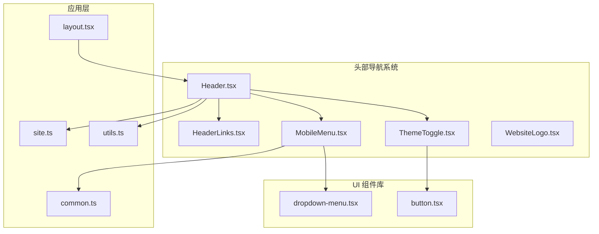
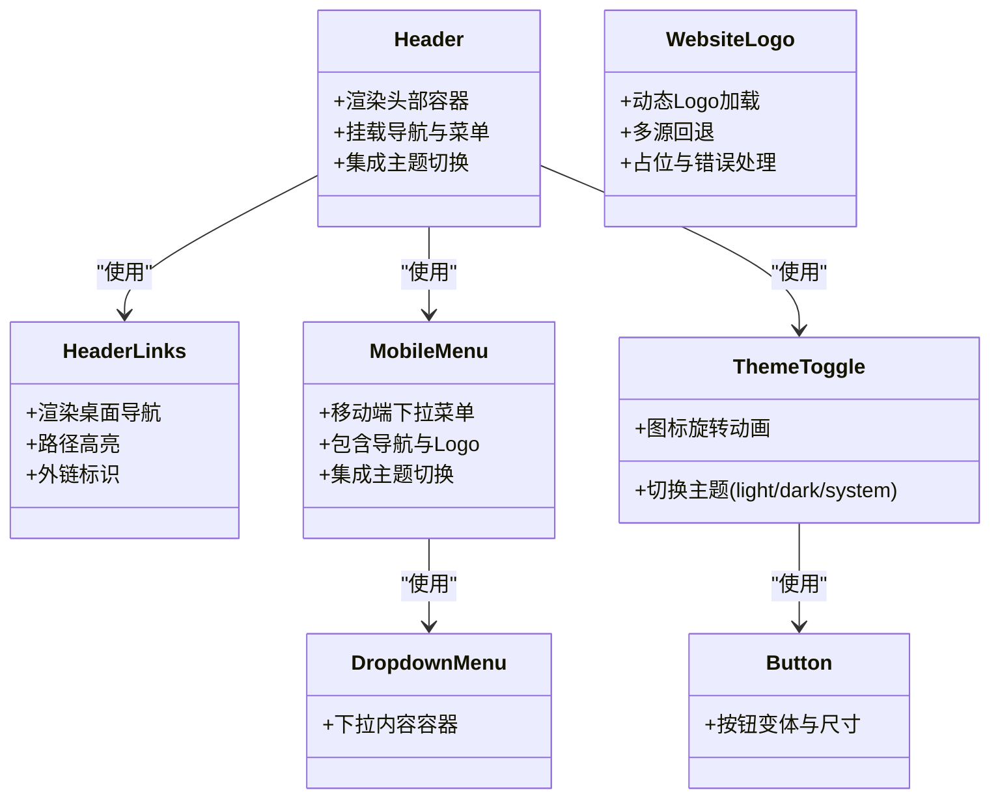
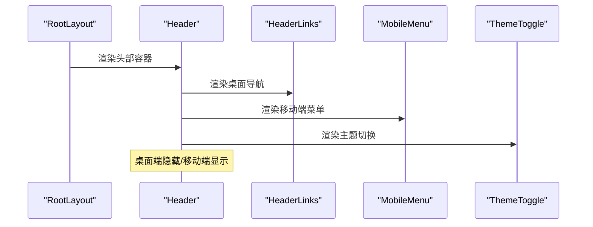
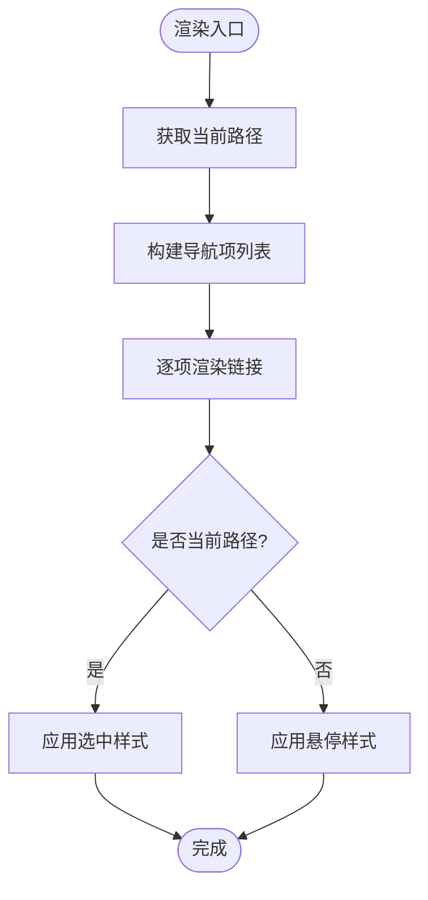
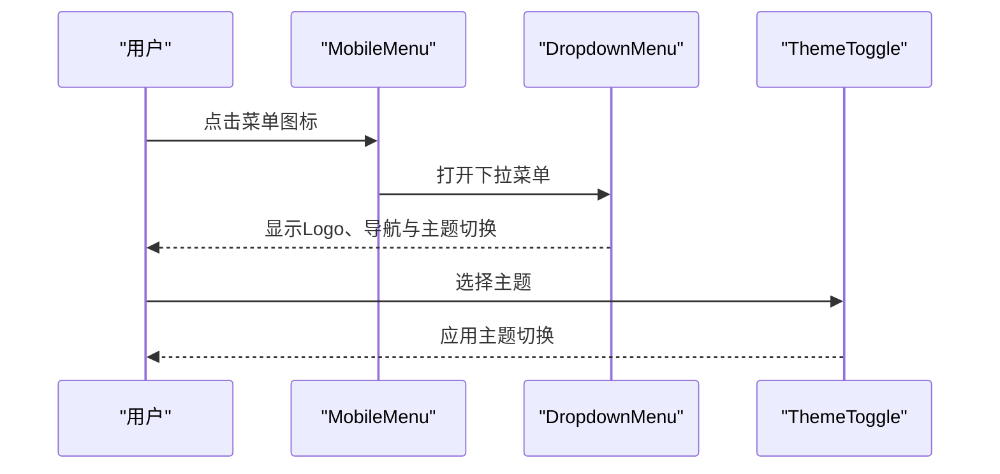
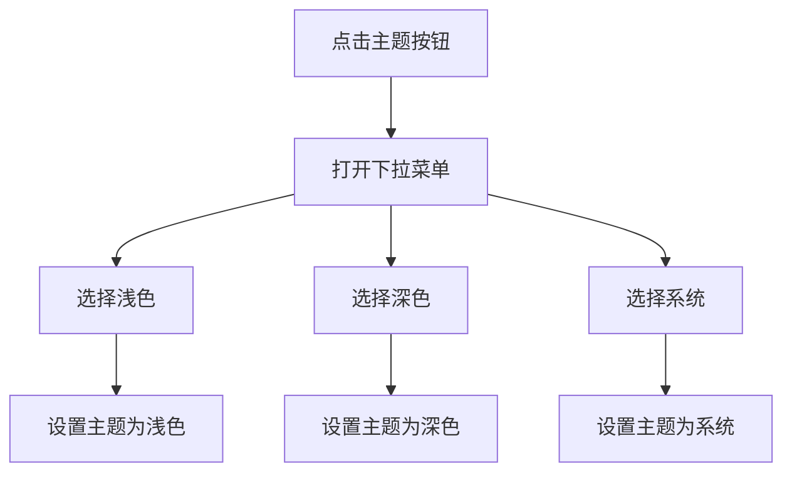
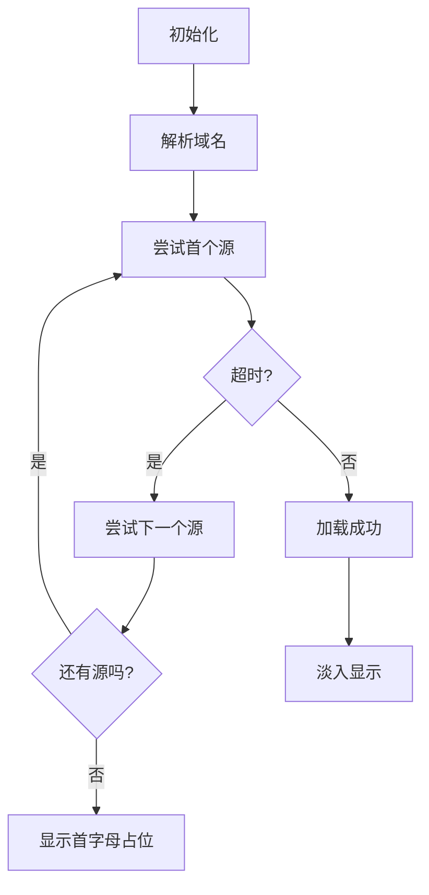
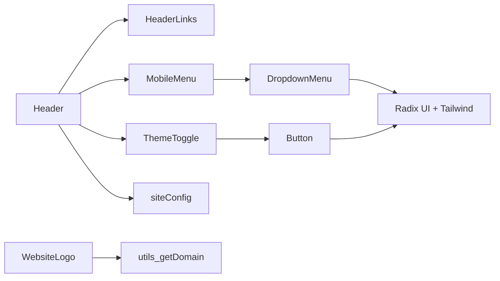
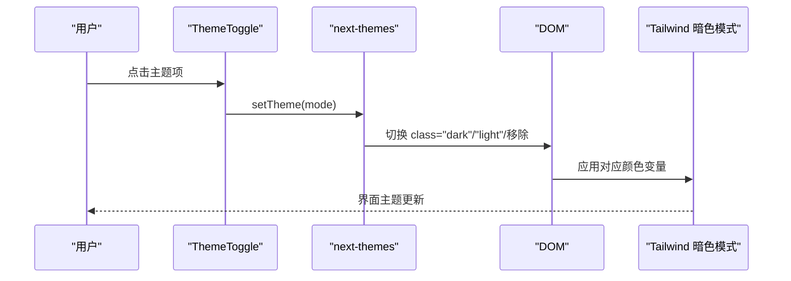

# 头部导航系统

<cite>
**本文档引用的文件**
- [components/header/Header.tsx](file://components/header/Header.tsx)
- [components/header/HeaderLinks.tsx](file://components/header/HeaderLinks.tsx)
- [components/header/MobileMenu.tsx](file://components/header/MobileMenu.tsx)
- [components/ThemeToggle.tsx](file://components/ThemeToggle.tsx)
- [components/WebsiteLogo.tsx](file://components/WebsiteLogo.tsx)
- [components/ui/dropdown-menu.tsx](file://components/ui/dropdown-menu.tsx)
- [components/ui/button.tsx](file://components/ui/button.tsx)
- [app/layout.tsx](file://app/layout.tsx)
- [config/site.ts](file://config/site.ts)
- [types/common.ts](file://types/common.ts)
- [lib/utils.ts](file://lib/utils.ts)
- [styles/globals.css](file://styles/globals.css)
- [tailwind.config.ts](file://tailwind.config.ts)
</cite>

## 目录
1. [简介](#简介)
2. [项目结构](#项目结构)
3. [核心组件](#核心组件)
4. [架构总览](#架构总览)
5. [详细组件分析](#详细组件分析)
6. [依赖关系分析](#依赖关系分析)
7. [性能考虑](#性能考虑)
8. [故障排除指南](#故障排除指南)
9. [结论](#结论)
10. [附录](#附录)

## 简介
本文件系统性地阐述头部导航系统的整体设计与实现，覆盖以下方面：
- 整体架构：由头部容器、导航链接、移动端菜单、主题切换与Logo等子组件构成
- 导航链接管理：基于路径高亮的静态导航项
- 移动端菜单：基于下拉菜单组件的移动端导航实现
- 视觉外观与交互：响应式布局、暗色模式适配、悬停与选中态
- 主题切换：基于 next-themes 的主题控制与 UI 呈现
- Logo 设计规范：内置 Logo 与动态网站 Logo 组件
- 无障碍与移动端体验：可访问性标签、触控尺寸与动画过渡
- 集成指南：如何在应用布局中正确挂载与扩展

## 项目结构
头部导航系统位于 components/header 目录，配合全局主题与 UI 组件库共同工作。关键文件如下：
- Header.tsx：头部容器与布局
- HeaderLinks.tsx：桌面端导航链接
- MobileMenu.tsx：移动端菜单（下拉）
- ThemeToggle.tsx：主题切换按钮
- WebsiteLogo.tsx：动态网站 Logo 组件
- ui/dropdown-menu.tsx：下拉菜单 UI 组件
- ui/button.tsx：按钮 UI 组件
- layout.tsx：根布局，挂载 Header
- site.ts：站点配置（名称、默认主题等）
- common.ts：HeaderLink 类型定义
- utils.ts：工具函数（类名合并、域名提取）

**图表来源**
- [components/header/Header.tsx](file://components/header/Header.tsx#L1-L45)
- [components/header/HeaderLinks.tsx](file://components/header/HeaderLinks.tsx#L1-L46)
- [components/header/MobileMenu.tsx](file://components/header/MobileMenu.tsx#L1-L70)
- [components/ThemeToggle.tsx](file://components/ThemeToggle.tsx#L1-L40)
- [components/WebsiteLogo.tsx](file://components/WebsiteLogo.tsx#L1-L109)
- [components/ui/dropdown-menu.tsx](file://components/ui/dropdown-menu.tsx#L1-L202)
- [components/ui/button.tsx](file://components/ui/button.tsx#L1-L58)
- [app/layout.tsx](file://app/layout.tsx#L32-L60)
- [config/site.ts](file://config/site.ts#L14-L44)
- [types/common.ts](file://types/common.ts#L1-L21)
- [lib/utils.ts](file://lib/utils.ts#L1-L19)

**章节来源**
- [components/header/Header.tsx](file://components/header/Header.tsx#L1-L45)
- [app/layout.tsx](file://app/layout.tsx#L32-L60)

## 核心组件
- Header：负责头部容器、Logo 区域、桌面导航、主题切换与移动端菜单的整体布局
- HeaderLinks：桌面端导航链接，支持当前路径高亮与外链标识
- MobileMenu：移动端菜单，通过下拉菜单承载导航与主题切换
- ThemeToggle：主题切换按钮，支持浅色、深色与系统主题
- WebsiteLogo：动态网站 Logo 组件，支持多源回退与加载占位
- UI 组件：DropdownMenu、DropdownMenuItem、Button 提供交互与样式基础

**章节来源**
- [components/header/Header.tsx](file://components/header/Header.tsx#L7-L42)
- [components/header/HeaderLinks.tsx](file://components/header/HeaderLinks.tsx#L8-L43)
- [components/header/MobileMenu.tsx](file://components/header/MobileMenu.tsx#L17-L68)
- [components/ThemeToggle.tsx](file://components/ThemeToggle.tsx#L14-L39)
- [components/WebsiteLogo.tsx](file://components/WebsiteLogo.tsx#L12-L106)
- [components/ui/dropdown-menu.tsx](file://components/ui/dropdown-menu.tsx#L9-L76)
- [components/ui/button.tsx](file://components/ui/button.tsx#L7-L35)

## 架构总览
头部导航系统采用“容器-展示”分层：
- Header 容器：承担布局与主题注入
- 展示组件：HeaderLinks、MobileMenu、ThemeToggle
- UI 组件：DropdownMenu、Button 提供一致的交互体验
- 类型与工具：HeaderLink 类型、cn 合并类名、域名解析

**图表来源**
- [components/header/Header.tsx](file://components/header/Header.tsx#L7-L42)
- [components/header/HeaderLinks.tsx](file://components/header/HeaderLinks.tsx#L8-L43)
- [components/header/MobileMenu.tsx](file://components/header/MobileMenu.tsx#L17-L68)
- [components/ThemeToggle.tsx](file://components/ThemeToggle.tsx#L14-L39)
- [components/WebsiteLogo.tsx](file://components/WebsiteLogo.tsx#L12-L106)
- [components/ui/dropdown-menu.tsx](file://components/ui/dropdown-menu.tsx#L9-L76)
- [components/ui/button.tsx](file://components/ui/button.tsx#L7-L35)

## 详细组件分析

### Header 组件分析
- 职责：构建头部容器、Logo 区域、桌面导航、主题切换与移动端菜单
- 响应式：桌面端显示导航与主题切换；移动端隐藏桌面元素，显示 MobileMenu
- 模糊背景与粘性定位：提升视觉层次与滚动体验
- 与站点配置：使用 siteConfig.name 作为 Logo 文案

**图表来源**
- [app/layout.tsx](file://app/layout.tsx#L48-L53)
- [components/header/Header.tsx](file://components/header/Header.tsx#L9-L39)

**章节来源**
- [components/header/Header.tsx](file://components/header/Header.tsx#L7-L42)
- [config/site.ts](file://config/site.ts#L14-L18)

### HeaderLinks 组件分析
- 职责：渲染桌面端导航链接，支持外链标识与当前路径高亮
- 数据结构：HeaderLink[]，包含 name、href、target、rel 等字段
- 交互：根据 pathname 与 href 判断是否为当前页，添加选中样式
- 可扩展性：可通过类型定义扩展更多导航项

**图表来源**
- [components/header/HeaderLinks.tsx](file://components/header/HeaderLinks.tsx#L8-L43)
- [types/common.ts](file://types/common.ts#L1-L7)

**章节来源**
- [components/header/HeaderLinks.tsx](file://components/header/HeaderLinks.tsx#L8-L43)
- [types/common.ts](file://types/common.ts#L1-L7)

### MobileMenu 组件分析
- 职责：移动端菜单，包含 Logo、导航项与主题切换
- 实现：基于 DropdownMenu，触发器为菜单图标，内容区包含导航与 Logo
- 交互：点击菜单图标展开下拉，点击导航项跳转
- 可扩展性：导航项与 Desktop 版保持一致，便于维护

**图表来源**
- [components/header/MobileMenu.tsx](file://components/header/MobileMenu.tsx#L17-L68)
- [components/ui/dropdown-menu.tsx](file://components/ui/dropdown-menu.tsx#L59-L76)

**章节来源**
- [components/header/MobileMenu.tsx](file://components/header/MobileMenu.tsx#L17-L68)

### ThemeToggle 组件分析
- 职责：提供主题切换入口，支持 light、dark、system 三种模式
- 实现：使用 next-themes 的 useTheme，结合 DropdownMenu 与 Button
- 动画：太阳与月亮图标旋转过渡，暗色模式下切换可见性
- 无障碍：提供 sr-only 文本，辅助屏幕阅读器识别

**图表来源**
- [components/ThemeToggle.tsx](file://components/ThemeToggle.tsx#L14-L39)
- [components/ui/button.tsx](file://components/ui/button.tsx#L7-L35)

**章节来源**
- [components/ThemeToggle.tsx](file://components/ThemeToggle.tsx#L14-L39)
- [config/site.ts](file://config/site.ts#L38-L38)

### WebsiteLogo 组件分析
- 职责：动态加载网站 Logo，支持多源回退与错误兜底
- 设计规范：支持自定义尺寸、类名与超时时间；加载时显示占位，失败时显示首字母
- 回退策略：按序尝试多个来源，包括 favicon、第三方服务等
- 性能：带超时保护，避免长时间等待；加载完成后淡入显示

**图表来源**
- [components/WebsiteLogo.tsx](file://components/WebsiteLogo.tsx#L12-L106)
- [lib/utils.ts](file://lib/utils.ts#L8-L19)

**章节来源**
- [components/WebsiteLogo.tsx](file://components/WebsiteLogo.tsx#L12-L106)
- [lib/utils.ts](file://lib/utils.ts#L8-L19)

## 依赖关系分析
- Header 依赖 HeaderLinks、MobileMenu、ThemeToggle、siteConfig
- MobileMenu 依赖 DropdownMenu、ThemeToggle、HeaderLink 类型
- ThemeToggle 依赖 Button、DropdownMenu、next-themes
- WebsiteLogo 依赖 utils.getDomain
- UI 组件库提供 DropdownMenu、DropdownMenuItem、Button 的基础能力
- 样式系统：Tailwind 全局样式与暗色模式变量

**图表来源**
- [components/header/Header.tsx](file://components/header/Header.tsx#L1-L5)
- [components/header/MobileMenu.tsx](file://components/header/MobileMenu.tsx#L3-L12)
- [components/ThemeToggle.tsx](file://components/ThemeToggle.tsx#L3-L6)
- [components/WebsiteLogo.tsx](file://components/WebsiteLogo.tsx#L2-L3)
- [components/ui/dropdown-menu.tsx](file://components/ui/dropdown-menu.tsx#L1-L7)
- [components/ui/button.tsx](file://components/ui/button.tsx#L1-L5)
- [lib/utils.ts](file://lib/utils.ts#L1-L6)

**章节来源**
- [tailwind.config.ts](file://tailwind.config.ts#L20-L62)
- [styles/globals.css](file://styles/globals.css#L32-L126)

## 性能考虑
- 图标与按钮：使用 lucide-react 图标与 Button 组件，减少自定义成本
- 下拉菜单：DropdownMenu 使用 Portal 渲染，避免层级遮挡与重排
- 主题切换：next-themes 在客户端管理主题，避免服务端闪烁
- Logo 加载：WebsiteLogo 的超时与回退策略降低资源失败影响
- 样式：Tailwind 动态生成，配合暗色模式变量，减少重复样式

[本节为通用性能建议，无需特定文件分析]

## 故障排除指南
- 主题切换无效
  - 检查 next-themes 是否在根布局启用
  - 确认 useTheme 在客户端组件中使用
  - 参考：[app/layout.tsx](file://app/layout.tsx#L48-L52)，[components/ThemeToggle.tsx](file://components/ThemeToggle.tsx#L14-L15)
- 移动端菜单不显示
  - 确认 MobileMenu 在移动端断点下可见
  - 检查 DropdownMenu 内容是否正确渲染
  - 参考：[components/header/MobileMenu.tsx](file://components/header/MobileMenu.tsx#L27-L33)
- Logo 不显示或一直加载
  - 检查域名解析与网络连通性
  - 调整 WebsiteLogo 的超时参数
  - 参考：[components/WebsiteLogo.tsx](file://components/WebsiteLogo.tsx#L34-L60)，[lib/utils.ts](file://lib/utils.ts#L8-L19)
- 导航高亮不生效
  - 确认 HeaderLinks 的 pathname 与 href 对齐
  - 参考：[components/header/HeaderLinks.tsx](file://components/header/HeaderLinks.tsx#L8-L9)

**章节来源**
- [app/layout.tsx](file://app/layout.tsx#L48-L52)
- [components/ThemeToggle.tsx](file://components/ThemeToggle.tsx#L14-L15)
- [components/header/MobileMenu.tsx](file://components/header/MobileMenu.tsx#L27-L33)
- [components/WebsiteLogo.tsx](file://components/WebsiteLogo.tsx#L34-L60)
- [lib/utils.ts](file://lib/utils.ts#L8-L19)
- [components/header/HeaderLinks.tsx](file://components/header/HeaderLinks.tsx#L8-L9)

## 结论
头部导航系统通过清晰的组件拆分与 UI 组件库协作，实现了响应式、可扩展且具备良好可访问性的导航体验。主题切换与 Logo 动态加载进一步增强了用户体验。后续可在 HeaderLinks 中扩展更多导航项，并统一维护移动端与桌面端的交互一致性。

[本节为总结性内容，无需特定文件分析]

## 附录

### 属性配置与事件处理
- Header
  - 无外部属性；内部使用 siteConfig.name 作为标题文案
  - 事件：无
- HeaderLinks
  - 属性：无；数据来自 HeaderLink[]
  - 事件：无；点击后浏览器跳转
- MobileMenu
  - 属性：无；导航项硬编码
  - 事件：无；点击后跳转
- ThemeToggle
  - 属性：无；通过 setTheme 切换主题
  - 事件：DropdownMenuItem onClick 设置主题
- WebsiteLogo
  - 属性：url、size、className、timeout
  - 事件：onError/onLoad 控制回退与占位

**章节来源**
- [components/header/Header.tsx](file://components/header/Header.tsx#L12-L26)
- [components/header/HeaderLinks.tsx](file://components/header/HeaderLinks.tsx#L12-L17)
- [components/header/MobileMenu.tsx](file://components/header/MobileMenu.tsx#L18-L24)
- [components/ThemeToggle.tsx](file://components/ThemeToggle.tsx#L26-L36)
- [components/WebsiteLogo.tsx](file://components/WebsiteLogo.tsx#L5-L10)

### 状态管理与主题切换原理
- 状态来源：next-themes 在客户端维护主题状态
- 切换流程：ThemeToggle -> setTheme -> DOM class 变更 -> Tailwind 暗色模式变量生效
- 默认主题：siteConfig.defaultNextTheme

**图表来源**
- [components/ThemeToggle.tsx](file://components/ThemeToggle.tsx#L14-L39)
- [app/layout.tsx](file://app/layout.tsx#L48-L52)
- [config/site.ts](file://config/site.ts#L38-L38)
- [styles/globals.css](file://styles/globals.css#L81-L126)

### 响应式设计与无障碍访问
- 响应式：md 断点区分桌面与移动端；移动端隐藏桌面导航，显示 MobileMenu
- 无障碍：ThemeToggle 提供 sr-only 文本；DropdownMenu 支持键盘导航
- 触控友好：Button 与 DropdownMenu 提供合适的交互尺寸与反馈

**章节来源**
- [components/header/Header.tsx](file://components/header/Header.tsx#L30-L37)
- [components/ThemeToggle.tsx](file://components/ThemeToggle.tsx#L23-L23)
- [components/ui/button.tsx](file://components/ui/button.tsx#L7-L35)
- [components/ui/dropdown-menu.tsx](file://components/ui/dropdown-menu.tsx#L59-L76)

### 集成指南
- 在根布局中引入 Header
  - 参考：[app/layout.tsx](file://app/layout.tsx#L53-L53)
- 自定义导航链接
  - 在 HeaderLinks 中扩展 HeaderLink[] 或从配置读取
  - 参考：[components/header/HeaderLinks.tsx](file://components/header/HeaderLinks.tsx#L12-L17)，[types/common.ts](file://types/common.ts#L1-L7)
- 扩展移动端菜单
  - 在 MobileMenu 中增加更多导航项或功能模块
  - 参考：[components/header/MobileMenu.tsx](file://components/header/MobileMenu.tsx#L18-L24)
- 主题切换
  - 使用 ThemeToggle；默认主题在 siteConfig 中配置
  - 参考：[components/ThemeToggle.tsx](file://components/ThemeToggle.tsx#L14-L39)，[config/site.ts](file://config/site.ts#L38-L38)

**章节来源**
- [app/layout.tsx](file://app/layout.tsx#L53-L53)
- [components/header/HeaderLinks.tsx](file://components/header/HeaderLinks.tsx#L12-L17)
- [components/header/MobileMenu.tsx](file://components/header/MobileMenu.tsx#L18-L24)
- [components/ThemeToggle.tsx](file://components/ThemeToggle.tsx#L14-L39)
- [config/site.ts](file://config/site.ts#L38-L38)