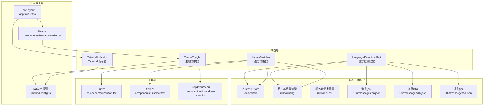
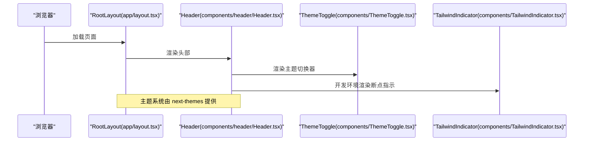
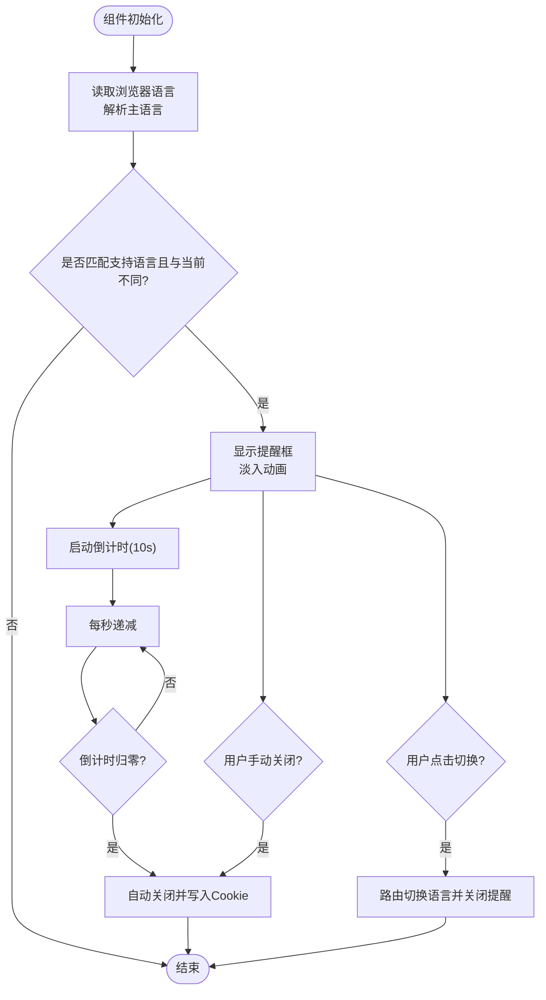
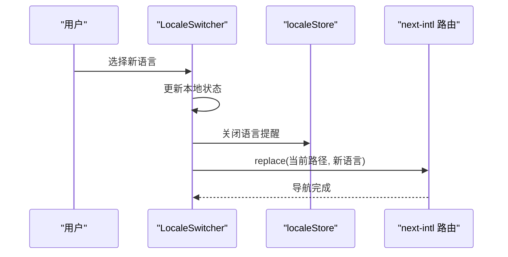
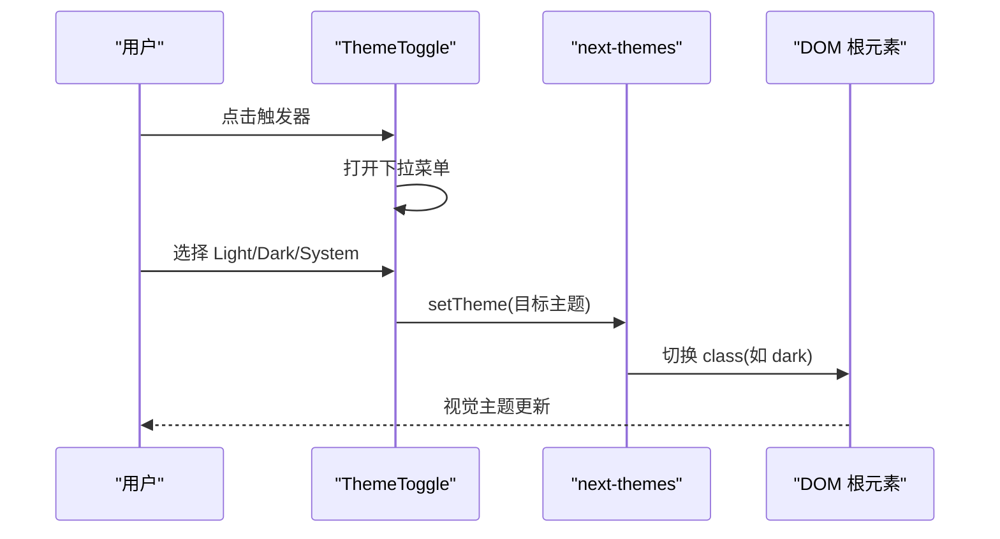
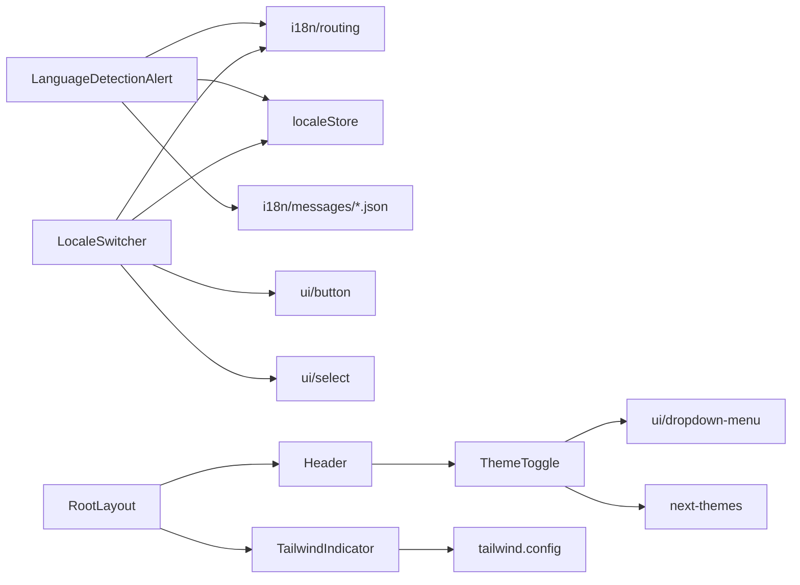

# 工具组件

<cite>
**本文引用的文件**
- [components/LanguageDetectionAlert.tsx](file://components/LanguageDetectionAlert.tsx)
- [components/LocaleSwitcher.tsx](file://components/LocaleSwitcher.tsx)
- [components/TailwindIndicator.tsx](file://components/TailwindIndicator.tsx)
- [components/ThemeToggle.tsx](file://components/ThemeToggle.tsx)
- [stores/localeStore.ts](file://stores/localeStore.ts)
- [i18n/routing.ts](file://i18n/routing.ts)
- [i18n/request.ts](file://i18n/request.ts)
- [i18n/messages/en.json](file://i18n/messages/en.json)
- [i18n/messages/zh.json](file://i18n/messages/zh.json)
- [i18n/messages/ja.json](file://i18n/messages/ja.json)
- [components/header/Header.tsx](file://components/header/Header.tsx)
- [app/layout.tsx](file://app/layout.tsx)
- [tailwind.config.ts](file://tailwind.config.ts)
- [components/ui/button.tsx](file://components/ui/button.tsx)
- [components/ui/select.tsx](file://components/ui/select.tsx)
- [components/ui/dropdown-menu.tsx](file://components/ui/dropdown-menu.tsx)
- [package.json](file://package.json)
</cite>

## 目录
1. [简介](#简介)
2. [项目结构](#项目结构)
3. [核心组件](#核心组件)
4. [架构总览](#架构总览)
5. [详细组件分析](#详细组件分析)
6. [依赖关系分析](#依赖关系分析)
7. [性能考量](#性能考量)
8. [故障排查指南](#故障排查指南)
9. [结论](#结论)
10. [附录](#附录)

## 简介
本章节系统化梳理并说明本项目中的辅助工具组件：语言检测提醒、语言切换器、Tailwind 指示器、主题切换器。文档覆盖以下方面：
- 功能特性与使用场景
- 状态管理、本地存储与用户偏好设置
- 国际化支持与多语言适配机制
- 可访问性设计与用户体验优化
- 浏览器与设备兼容性
- 完整集成示例与最佳实践

## 项目结构
这些工具组件主要位于 components 目录，配合 i18n 国际化配置、状态管理 store、UI 组件库以及全局布局进行集成。

图表来源
- [components/LanguageDetectionAlert.tsx](file://components/LanguageDetectionAlert.tsx#L1-L145)
- [components/LocaleSwitcher.tsx](file://components/LocaleSwitcher.tsx#L1-L72)
- [components/ThemeToggle.tsx](file://components/ThemeToggle.tsx#L1-L40)
- [components/TailwindIndicator.tsx](file://components/TailwindIndicator.tsx#L1-L15)
- [stores/localeStore.ts](file://stores/localeStore.ts#L1-L22)
- [i18n/routing.ts](file://i18n/routing.ts#L1-L37)
- [i18n/request.ts](file://i18n/request.ts#L1-L28)
- [i18n/messages/en.json](file://i18n/messages/en.json#L1-L110)
- [i18n/messages/zh.json](file://i18n/messages/zh.json#L1-L110)
- [i18n/messages/ja.json](file://i18n/messages/ja.json#L1-L110)
- [components/ui/button.tsx](file://components/ui/button.tsx#L1-L58)
- [components/ui/select.tsx](file://components/ui/select.tsx#L1-L160)
- [components/ui/dropdown-menu.tsx](file://components/ui/dropdown-menu.tsx#L1-L202)
- [components/header/Header.tsx](file://components/header/Header.tsx#L1-L45)
- [app/layout.tsx](file://app/layout.tsx#L1-L78)
- [tailwind.config.ts](file://tailwind.config.ts#L1-L95)

章节来源
- [components/LanguageDetectionAlert.tsx](file://components/LanguageDetectionAlert.tsx#L1-L145)
- [components/LocaleSwitcher.tsx](file://components/LocaleSwitcher.tsx#L1-L72)
- [components/ThemeToggle.tsx](file://components/ThemeToggle.tsx#L1-L40)
- [components/TailwindIndicator.tsx](file://components/TailwindIndicator.tsx#L1-L15)
- [stores/localeStore.ts](file://stores/localeStore.ts#L1-L22)
- [i18n/routing.ts](file://i18n/routing.ts#L1-L37)
- [i18n/request.ts](file://i18n/request.ts#L1-L28)
- [i18n/messages/en.json](file://i18n/messages/en.json#L1-L110)
- [i18n/messages/zh.json](file://i18n/messages/zh.json#L1-L110)
- [i18n/messages/ja.json](file://i18n/messages/ja.json#L1-L110)
- [components/header/Header.tsx](file://components/header/Header.tsx#L1-L45)
- [app/layout.tsx](file://app/layout.tsx#L1-L78)
- [tailwind.config.ts](file://tailwind.config.ts#L1-L95)
- [components/ui/button.tsx](file://components/ui/button.tsx#L1-L58)
- [components/ui/select.tsx](file://components/ui/select.tsx#L1-L160)
- [components/ui/dropdown-menu.tsx](file://components/ui/dropdown-menu.tsx#L1-L202)

## 核心组件
- 语言检测提醒：基于浏览器语言自动识别并提示切换语言，带倒计时与可关闭逻辑，使用 Cookie 记忆用户选择。
- 语言切换器：下拉选择语言，保持当前页面路径并切换语言，触发过渡导航。
- Tailwind 指示器：开发环境显示当前断点标识，便于调试响应式布局。
- 主题切换器：提供明/暗/系统三种主题模式切换，与 next-themes 集成。

章节来源
- [components/LanguageDetectionAlert.tsx](file://components/LanguageDetectionAlert.tsx#L11-L145)
- [components/LocaleSwitcher.tsx](file://components/LocaleSwitcher.tsx#L23-L72)
- [components/TailwindIndicator.tsx](file://components/TailwindIndicator.tsx#L1-L15)
- [components/ThemeToggle.tsx](file://components/ThemeToggle.tsx#L14-L40)

## 架构总览
工具组件通过以下层次协同工作：
- 状态层：Zustand store 管理语言提醒开关与持久化标记。
- 国际化层：next-intl 定义路由、默认语言、自动检测与消息映射。
- 视图层：UI 组件库提供按钮、下拉菜单、选择器等基础控件。
- 布局层：根布局启用主题系统，头部集成主题切换器；全局布局挂载 Tailwind 指示器。

图表来源
- [app/layout.tsx](file://app/layout.tsx#L32-L78)
- [components/header/Header.tsx](file://components/header/Header.tsx#L7-L45)
- [components/ThemeToggle.tsx](file://components/ThemeToggle.tsx#L14-L40)
- [components/TailwindIndicator.tsx](file://components/TailwindIndicator.tsx#L1-L15)

## 详细组件分析

### 语言检测提醒（LanguageDetectionAlert）
- 功能概述
  - 自动检测浏览器语言与当前语言差异，若存在支持的语言变体且不同于当前语言，则弹出提示框。
  - 提示框包含标题、描述、切换按钮与倒计时，倒计时结束后自动关闭。
  - 用户可手动关闭或点击“切换到”立即跳转至目标语言。
- 关键流程
  - 初始化：读取浏览器语言、解析主语言代码、匹配路由支持的语言集合。
  - 展示：若未被用户关闭过则显示提醒，并淡入动画。
  - 倒计时：每秒递减，归零后自动关闭并写入 Cookie 标记。
  - 切换：调用路由切换语言，同时关闭提醒。
- 状态与持久化
  - 使用 Zustand store 管理提醒开关与关闭标记。
  - 关闭标记通过 Cookie 存储，有效期 30 天。
- 国际化
  - 动态加载对应语言的消息文件，渲染标题、描述、按钮文案。
- 可访问性
  - 使用 banner 角色与 aria-live 提示屏幕阅读器关注。
  - 关闭按钮与链接提供明确的 aria-label。
- 兼容性
  - 使用 navigator.language 获取语言，对 zh-HK 等区域变体进行主语言前缀匹配。
  - 在生产环境不显示，避免干扰用户。

图表来源
- [components/LanguageDetectionAlert.tsx](file://components/LanguageDetectionAlert.tsx#L34-L72)
- [stores/localeStore.ts](file://stores/localeStore.ts#L14-L21)
- [i18n/routing.ts](file://i18n/routing.ts#L4-L23)

章节来源
- [components/LanguageDetectionAlert.tsx](file://components/LanguageDetectionAlert.tsx#L11-L145)
- [stores/localeStore.ts](file://stores/localeStore.ts#L1-L22)
- [i18n/routing.ts](file://i18n/routing.ts#L1-L37)
- [i18n/messages/en.json](file://i18n/messages/en.json#L2-L7)
- [i18n/messages/zh.json](file://i18n/messages/zh.json#L2-L7)
- [i18n/messages/ja.json](file://i18n/messages/ja.json#L2-L7)

### 语言切换器（LocaleSwitcher）
- 功能概述
  - 下拉选择器展示可用语言，选中后保持当前路径并切换语言。
  - 切换时调用路由 replace 并触发 startTransition，提升交互流畅度。
  - 选中项同步 store 中的提醒关闭状态，避免重复提示。
- 关键流程
  - 初始化：读取当前语言并设置为受控值。
  - 选择变更：更新本地状态、关闭语言提醒、执行路由替换。
- UI 与交互
  - 使用 Select 触发器与内容，内置图标 Globe。
  - 语言名称来自路由配置的 LOCALE_NAMES 映射。
- 可访问性
  - Select 触发器具备键盘可达性与无障碍标签。
- 兼容性
  - 通过 next-intl 的 Link/redirect 能力保证语言前缀与路径正确处理。

图表来源
- [components/LocaleSwitcher.tsx](file://components/LocaleSwitcher.tsx#L36-L50)
- [stores/localeStore.ts](file://stores/localeStore.ts#L14-L18)
- [i18n/routing.ts](file://i18n/routing.ts#L6-L10)

章节来源
- [components/LocaleSwitcher.tsx](file://components/LocaleSwitcher.tsx#L23-L72)
- [components/ui/select.tsx](file://components/ui/select.tsx#L1-L160)
- [components/ui/button.tsx](file://components/ui/button.tsx#L1-L58)
- [i18n/routing.ts](file://i18n/routing.ts#L1-L37)

### Tailwind 指示器（TailwindIndicator）
- 功能概述
  - 开发环境下固定显示当前生效的 Tailwind 断点标签（xs/sm/md/lg/xl/2xl），便于调试响应式。
  - 生产环境直接返回空，避免无意义渲染。
- 设计要点
  - 使用 Tailwind 断点类控制显示内容，简洁直观。
  - 定位在左下角，不影响主要内容区域。

章节来源
- [components/TailwindIndicator.tsx](file://components/TailwindIndicator.tsx#L1-L15)
- [app/layout.tsx](file://app/layout.tsx#L62-L62)

### 主题切换器（ThemeToggle）
- 功能概述
  - 提供 Light/Dark/System 三档主题切换，使用 next-themes 管理类名与系统偏好。
  - 图标随主题切换旋转与显隐，提供即时反馈。
- UI 与交互
  - 使用 DropdownMenu 提供菜单项，Button 作为触发器。
  - 内联 sr-only 文本用于可访问性。
- 集成位置
  - 在 Header 中以桌面端可见的方式集成，移动端通过菜单入口访问。

图表来源
- [components/ThemeToggle.tsx](file://components/ThemeToggle.tsx#L14-L38)
- [components/header/Header.tsx](file://components/header/Header.tsx#L30-L34)
- [tailwind.config.ts](file://tailwind.config.ts#L4-L4)

章节来源
- [components/ThemeToggle.tsx](file://components/ThemeToggle.tsx#L14-L40)
- [components/ui/dropdown-menu.tsx](file://components/ui/dropdown-menu.tsx#L1-L202)
- [components/ui/button.tsx](file://components/ui/button.tsx#L1-L58)
- [app/layout.tsx](file://app/layout.tsx#L48-L52)
- [tailwind.config.ts](file://tailwind.config.ts#L1-L95)

## 依赖关系分析
- 组件间耦合
  - LanguageDetectionAlert 与 LocaleSwitcher 共享 i18n 路由与消息映射，但前者负责提醒逻辑，后者负责切换动作。
  - ThemeToggle 与 TailwindIndicator 分别依赖 next-themes 与 Tailwind 配置，彼此独立。
- 外部依赖
  - next-intl：路由、导航、语言检测与消息加载。
  - js-cookie：语言提醒关闭标记持久化。
  - zustand：轻量状态管理。
  - next-themes：主题系统。
  - Radix UI：Select 与 DropdownMenu 组件。
- 潜在循环依赖
  - 未发现直接循环导入；国际化配置集中于 i18n 目录，组件按需引入。

图表来源
- [components/LanguageDetectionAlert.tsx](file://components/LanguageDetectionAlert.tsx#L3-L8)
- [components/LocaleSwitcher.tsx](file://components/LocaleSwitcher.tsx#L3-L18)
- [components/ThemeToggle.tsx](file://components/ThemeToggle.tsx#L3-L12)
- [components/TailwindIndicator.tsx](file://components/TailwindIndicator.tsx#L1-L15)
- [stores/localeStore.ts](file://stores/localeStore.ts#L1-L2)
- [i18n/routing.ts](file://i18n/routing.ts#L1-L37)
- [tailwind.config.ts](file://tailwind.config.ts#L1-L95)
- [components/header/Header.tsx](file://components/header/Header.tsx#L3-L3)
- [app/layout.tsx](file://app/layout.tsx#L6-L7)

章节来源
- [package.json](file://package.json#L16-L51)
- [i18n/routing.ts](file://i18n/routing.ts#L1-L37)
- [stores/localeStore.ts](file://stores/localeStore.ts#L1-L22)

## 性能考量
- 语言检测提醒
  - 仅在首次进入且未关闭过时触发，避免重复渲染。
  - 倒计时使用单向定时器，组件卸载时清理，防止内存泄漏。
- 语言切换器
  - 使用 startTransition 降低路由切换抖动，提升交互体验。
  - 保持当前路径不变，减少不必要的全页刷新。
- Tailwind 指示器
  - 仅在开发环境渲染，生产环境直接返回空，零成本。
- 主题切换器
  - 通过类名切换而非样式重算，性能开销极低。
- 国际化
  - 服务端请求配置对 zh/ja 进行主语言归一，减少分支判断与消息加载次数。

## 故障排查指南
- 语言检测提醒未出现
  - 检查浏览器语言是否为支持语言（en/zh/ja），或是否存在区域变体（如 zh-HK）。
  - 确认路由配置的 localeDetection 是否开启。
  - 若之前已关闭，检查 Cookie 标记是否仍存在。
- 语言切换无效
  - 确认当前页面路径是否正确传入 router.replace。
  - 检查路由 locales 列表与 LOCALE_NAMES 是否包含目标语言。
- Tailwind 指示器不显示
  - 确认 NODE_ENV 是否为 development。
  - 检查 Tailwind 配置断点扩展是否生效。
- 主题切换无反应
  - 确认 next-themes 已在根布局启用，且未被其他样式覆盖。
  - 检查系统主题与浏览器暗色模式设置。

章节来源
- [components/LanguageDetectionAlert.tsx](file://components/LanguageDetectionAlert.tsx#L34-L52)
- [components/LocaleSwitcher.tsx](file://components/LocaleSwitcher.tsx#L36-L50)
- [components/TailwindIndicator.tsx](file://components/TailwindIndicator.tsx#L2-L2)
- [i18n/routing.ts](file://i18n/routing.ts#L19-L23)
- [stores/localeStore.ts](file://stores/localeStore.ts#L14-L21)
- [app/layout.tsx](file://app/layout.tsx#L48-L52)

## 结论
上述工具组件围绕“易用、可访问、可维护”的目标设计：语言检测提醒与切换器结合 i18n 与状态管理，提供自然的语言适配体验；Tailwind 指示器与主题切换器分别服务于开发效率与用户体验。整体架构清晰、依赖边界明确，易于扩展与维护。

## 附录
- 集成示例
  - 在根布局中启用主题系统并在头部放置主题切换器。
  - 在根布局中挂载 Tailwind 指示器，确保开发环境可见。
  - 在需要语言切换的位置引入 LocaleSwitcher 或在特定场景使用 LanguageDetectionAlert。
- 最佳实践
  - 将语言检测与切换解耦：检测提醒只负责提示，切换由用户主动触发。
  - 使用 startTransition 优化路由切换的感知性能。
  - 保持国际化消息键一致，避免硬编码文本。
  - 为关键交互提供可访问性标签与键盘可达性。
  - 在生产环境禁用开发辅助组件，减少不必要渲染。